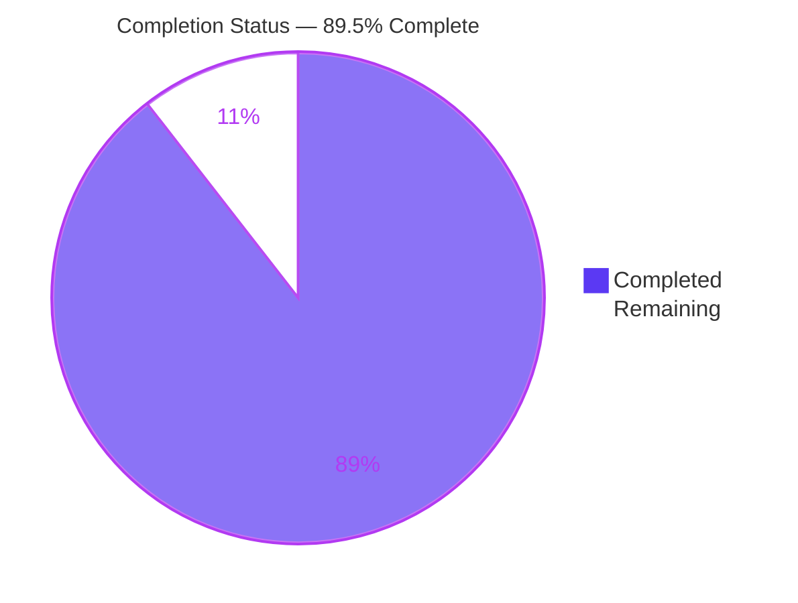
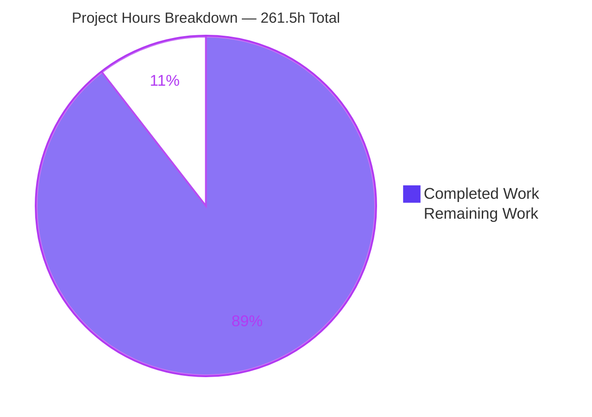
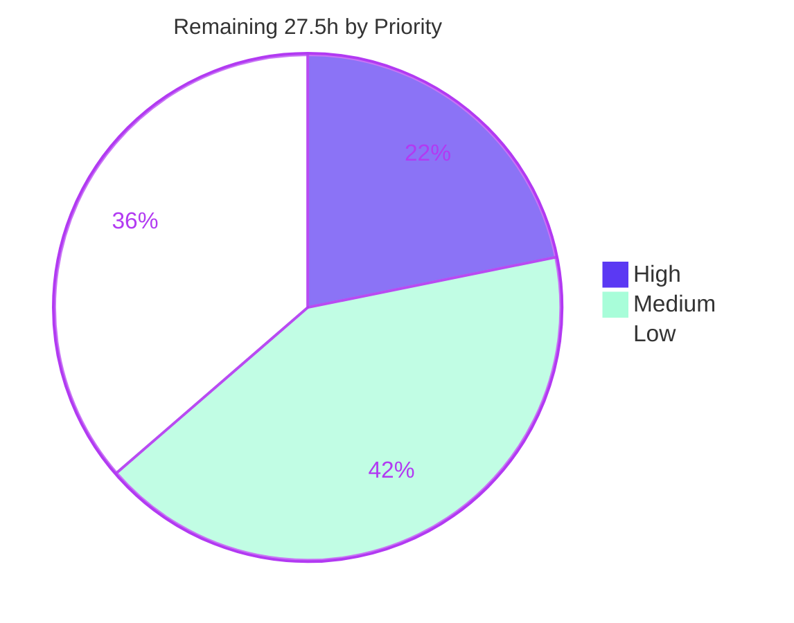

# 1. Executive Summary

## 1.1 Project Overview

This project delivers a candidate-selection analysis over the Apache Fineract lending domain. It measures the lending data elements and decisions the codebase produces under one normalized method — spread, depth, rule density and containment — derives a ranked shortlist of three, disposes the two supplied hypotheses, and names one recommended target for a later reconstruction effort. Its audience is the engineering team that will carry out that reconstruction. The work is strictly read-only: no code changes, and the output is one self-contained Markdown report citing a repository path, class, method and line for every structural claim. Scope: 6,773 Java sources, thirteen modules, 206 lending entry points, 19 measured candidates.

## 1.2 Completion Status



| Metric | Value |
|---|---|
| Total Hours | 261.5 |
| Completed Hours (AI + Manual) | 234 (234 AI + 0 manual) |
| Remaining Hours | 27.5 |
| Percent Complete | 89.5% |

Completion covers AAP-scoped work only: 234 of 261.5 hours delivered, or 89.5%.

## 1.3 Key Accomplishments

- ✅ Enumerated the lending entry-point universe: 206 entry points across five entry classes.
- ✅ Measured all 19 candidate outcomes on four criteria, with nothing screened out beforehand.
- ✅ Ranked a shortlist of three and named one recommended target, both derived from the measurements.
- ✅ Disposed both supplied hypotheses: each is beaten on containment, with the winning criteria named.
- ✅ Corrected the supplied symbols and derived the processor count from code — 10 built-in, 11 concrete repository-wide.
- ✅ Cited every structural claim: 3,208 tagged, resolvable claims over 1,522 report lines.
- ✅ Rendered all four diagrams through a pinned renderer, every node and edge label resolving locally.
- ✅ Proved the read-only mandate by measurement: zero net change to the analysed tree.

## 1.4 Critical Unresolved Issues

Ten items are open against the 40 requirements this work was scoped against: 30 fully closed, 1 partially closed, 9 handover or hardening items. The groups below carry all ten.

| Issue | Impact | Owner | ETA |
|---|---|---|---|
| Deliverable handover — 2 items: the report must be harvested from its canonical output path and placed where the downstream effort reads it, and the branch with its proof-binding commit must be published | The branch deliberately carries no report file, so a consumer who looks only at the branch receives nothing; the read-only proof is not yet externally verifiable | Receiving engineering team / release owner | 0.5 day |
| Evidence-record currency — 1 item: two of the evidence records bind to a superseded revision of the report rather than the delivered one | A re-auditor applying those records' own fail-closed rule reads INVALID, although every gate passes when re-run against the delivered bytes | Receiving engineering team | 0.5 day |
| Independent verification — 2 items: no second party has spot-audited the citation set, and the gate battery has not been reproduced on the consuming team's own host | The report's authority rests on citations that have been self-checked but not externally sampled; reproduction currently depends on one host's renderer pin | Receiving engineering team | 1.5 days |
| Build-toolchain integrity — 1 item: the Gradle wrapper properties carry no distribution checksum | A fresh checkout accepts distribution bytes on the address check alone; accepted for this work with a verified per-copy pin as the compensating control | Upstream Apache Fineract | Upstream cycle |
| Artefact-tree hygiene — 1 item: obsolete rendered copies remain alongside the current output, four of them naming a superseded recommendation | A reader who opens the wrong copy reads the wrong answer | Receiving engineering team | 0.5 day |
| Environment hardening — 2 items: the analysis ran as root with no seccomp profile, and the seal manifests are unsigned | A tamper-evident audit of the read-only claim cannot be fully closed from inside the environment | Platform owner | 1 day |
| Lifecycle — 1 item: no refresh cycle exists for what is a measurement of a single commit | Citations drift as the lending tree advances; the report has no standing maintainer by design | Receiving engineering team | Ongoing |

## 1.5 Access Issues

| System/Resource | Type of Access | Issue Description | Resolution Status | Owner |
|---|---|---|---|---|
| Git remote for this repository | Push / write | Publication of the branch and its proof-binding commit was refused; the credential presented for the push had expired | Open — needs a valid credential, then a single push | Release owner |
| Apache Fineract upstream repository | Commit / merge | Landing a distribution checksum in the wrapper properties requires an upstream commit, which this read-only work is forbidden to make | Open — accepted with a compensating per-copy pin | Upstream Apache Fineract |
| Analysis environment privileges | Privilege reduction | Non-root execution, a seccomp profile and an off-host signing key are not available inside the environment | Open — platform-owned | Platform owner |

## 1.6 Recommended Next Steps

1. **[High]** Harvest the report with its discovery and measurement ledgers and hand them to the reconstruction team — the branch carries no copy by design.
2. **[High]** Publish the branch and its proof-binding commit once a valid credential is available.
3. **[High]** Refresh the two evidence records that bind to a superseded revision.
4. **[Medium]** Spot-audit a citation sample as a second party, and reproduce the gates on the consuming host.
5. **[Medium]** Prune the obsolete rendered copies and record the build-toolchain checksum decision.

# 2. Project Hours Breakdown

## 2.1 Completed Work Detail

| Component | Hours | Description |
|---|---|---|
| Analysis toolchain and isolation | 6 | JDK 25, Node 22.23.2, a pinned diagram renderer with a pinned browser, and the Gradle 9.7.1 wrapper, each provisioned outside the checkout and version-verified |
| Read-only write proof | 8 | Baseline capture and re-take across three independent families — commit state, an 8,121-record content manifest, and the index digest — plus metadata, attribute and transient-write attestations |
| Lending entry-point discovery | 20 | Five-class entry taxonomy applied across thirteen modules; 206 entry points enumerated with annotation constants resolved and completeness cross-checked against bounded repository searches |
| Candidate formation | 8 | 19 candidate outcomes defined under a fixed boundary rule, each with its type, its business outcome and its production point stated before measurement |
| Measurement of the 16 non-shortlisted candidates | 36 | Spread, depth, rule density and containment measured for every candidate under one path policy, so the shortlist follows from exhaustive measurement rather than a screen |
| Rank 1 measurement — installment amounts from schedule generation | 30 | 202 counted hops and 99 participating units traced from entry to production, with a branch table as stopping proof, spread 34 (23 classes, 4 layer pairs, 7 module pairs) and rule density 84 |
| Rank 2 and Rank 3 measurement — working-capital and loan delinquency classification | 14 | Depth 21 and 27 respectively, each with its own hop table, branch table and containment classification, both fully contained |
| Report purpose, method and symbol verification | 14 | Run-scope and write-proof statements, the module mapping across thirteen modules, the entry taxonomy and coverage figures, the path policy and counting rules, the citation scheme, and the corrected symbols |
| Comparison-set score tables | 10 | Two aligned tables covering all 19 candidates with spread components, depth and direct-chain length, rule-density addends, containment tallies, qualification, aggregate and rank |
| Three ranked candidate sections | 28 | Fifteen mandatory evidence items across the three shortlisted candidates: element and production point, spread, depth, rules and strategies, containment |
| Hypothesis disposition, near misses and recommendation | 6 | Both supplied hypotheses disposed per criterion, the near misses explained by their deciding criterion, and one recommendation with its justification |
| Diagrams | 8 | A module map and one measured-path chain diagram per shortlisted candidate, every node and edge label resolving to an evidence row in its own section |
| Claim ledger | 22 | 3,208 claim rows over 1,522 report lines, each classified, tagged and carrying a resolvable citation or claim identifier, with line coverage reconciled |
| Validation gate battery | 14 | Diagram render, output-form scan, structure and heading gate, count checks, ledger completeness and diagram label resolution, each re-runnable and fail-closed |
| Evidence consolidation into the mandated report form | 10 | Ten-section structure with the non-shortlisted candidates' unit and hop rows carried in the measurement ledger and every cross-reference re-pointed to match |
| **Total** | **234** | |

## 2.2 Remaining Work Detail

| Category | Hours | Priority |
|---|---|---|
| Deliverable handover and branch publication | 3.5 | High |
| Evidence-record refresh against the delivered digest | 2.5 | High |
| Independent citation spot-audit | 6.0 | Medium |
| Host-independent gate and diagram re-verification | 3.0 | Medium |
| Artefact-tree cleanup of obsolete rendered copies | 1.5 | Medium |
| Build-toolchain distribution checksum decision | 1.0 | Medium |
| Environment hardening for a repeatable audit | 6.0 | Low |
| Method refresh cycle against a newer commit | 4.0 | Low |
| **Total** | **27.5** | |

## 2.3 Reconciliation

- Section 2.1 completed hours: **234**
- Section 2.2 remaining hours: **27.5**
- Total project hours: 234 + 27.5 = **261.5**, matching Section 1.2
- Completion: 234 / 261.5 = **89.5%**, the figure used in Sections 1.2, 7 and 8
- Estimate confidence: **High** for the completed analysis, every figure in it having been re-observed directly; **High** for handover, refresh and cleanup, which are bounded and well understood; **Medium** for the citation spot-audit and environment hardening, which are sized by category rather than measured.

# 3. Test Results

Every figure below was observed from a full run executed for this assessment: the Avro SDK task and the module compilations first, then the unit suites re-run from scratch with the CI exclusion flags. Compilation of the whole lending scope, the platform module and both custom extension modules succeeded with zero errors.

| Area / Category | Framework | Tests | Passed | Failed | Coverage | What This Proves |
|---|---|---|---|---|---|---|
| Lending modules — loan, progressive loan, working-capital loan, charge, accounting | JUnit 5 via Gradle | 624 | 624 | 0 | Not instrumented | The domain entities, transaction processors, schedule generators and allocation services that carry all three shortlisted candidates behave as their own assertions require |
| Platform services | JUnit 5 via Gradle | 1,417 | 1,417 | 0 | Not instrumented | The write services, assemblers, validators and accounting processors that the measured paths traverse are exercised, including the disbursement and repayment service entry points |
| Shared core | JUnit 5 via Gradle | 376 | 376 | 0 | Not instrumented | The monetary, calendar, working-day and holiday utilities that supply operand values on the measured paths compute as asserted |
| Close-of-business framework | JUnit 5 via Gradle | 5 | 5 | 0 | Not instrumented | The batch step framework that composes the tenant-configured workflow behind two candidates' alternate entries loads and dispatches |
| Custom extension modules | JUnit 5 via Gradle | 0 | 0 | 0 | Not instrumented | Nothing — these modules ship no unit tests, and the eleventh concrete transaction processor is verified only by reading it |
| Aggregate unit suite | JUnit 5 via Gradle | 2,422 | 2,422 | 0 | Not instrumented | The repository areas the analysis reasons about are green end to end: 355 test classes, zero failures, zero errors, three skipped |
| Deliverable gate battery | Pinned diagram renderer and fail-closed shell gates | 9 | 9 | 0 | Not applicable | The delivered report satisfies every mandated gate on its delivered bytes: diagrams render, output form is clean, structure and counts hold, the claim ledger and its identifiers resolve, and the read-only proof re-takes identically |

**Not Covered**

- **No test suite covers the deliverable itself.** It is a Markdown report, and no test framework asserts on one. The substitutes are the gate battery above — diagram render, output-form scan, structure and heading checks, count checks, claim-ledger integrity, claim-identifier resolution, digest binding and the three-family read-only proof. A human should re-run the render and output-form gates on their own host before relying on the report, since reproduction currently depends on one host's renderer pin.
- **The report's analytical judgement is not machine-checkable.** Whether a unit truly transforms a value, whether a branch is genuinely reachable, and whether a containment verdict is right were established by reading the cited source. A human should spot-audit a sample of the citation set against the tree.
- **Nothing was executed at runtime.** The measured paths were established by static reading of call sites; no lending flow ran. Verifying a measured hop sequence against real execution needs a database, a broker and a running platform, none of which this scope provisions.
- **The 12 non-shortlisted candidates cannot be recounted from the report alone.** Their scores are anchored in the comparison tables and their unit and hop rows are enumerated in the measurement ledger, so a reader who wants to re-derive one of those scores must open the ledger alongside the report.
- **Two repository areas the analysis relies on are thinly tested.** The custom extension processor package ships no test directory at all, and the charge module has 37 main classes and no test classes; the accounting module has 171 main classes and one test class. A human extending any of them should add tests first.
- **External publication of the read-only proof anchor was not exercised.** Pushing the branch could not be attempted with a valid credential, so the proof anchor's external verifiability is asserted from its local state rather than demonstrated.

# 4. Runtime Validation & UI Verification

This project ships an analysis document, not a running service, so runtime validation means the pipelines that produce and verify that document. Each line below was driven directly and its outcome observed.

- ✅ **Diagram rendering** — Operational. The pinned renderer was pointed at the delivered report and reported four Mermaid charts found, wrote four SVGs plus the rewritten markdown, and exited 0. All four SVGs are byte-identical to the published set, and a deliberately malformed block still fails closed with a parse error and a non-zero exit.
- ✅ **Renderer isolation** — Operational. The renderer runs a pinned browser at a fixed digest with sandbox, GPU and shared-memory flags set, and with host resolution mapped to failure, so a diagram cannot reach the network during a render.
- ✅ **Output-form gate** — Operational. The delivered bytes carry 8 fence lines forming 4 correctly paired blocks, every opener tagged for Mermaid, no fenced block of any other language, no drawing glyphs, no tabs, and 678 table rows none of which exceeds four columns.
- ✅ **Structure and content gate** — Operational. Ten numbered sections in order, 26 subsections, no appendix, three ranked-candidate sections whose identifiers and ranks agree with the comparison tables, and exactly one recommendation line.
- ✅ **Claim ledger and identifier resolution** — Operational. 3,208 claim rows over 1,522 report lines, none failing, none untagged, none malformed; all 500 diagram node and edge identifiers resolve to an evidence row inside their own section.
- ✅ **Read-only proof** — Operational. Commit state, an 8,121-record content manifest and the index digest were captured before any work and re-taken after building, testing and rendering; all three compare identically, the working tree reports nothing including ignored paths, no generated directory exists, and the tree hash equals the analysed commit's.
- ✅ **Build toolchain** — Operational. The Avro SDK task and compilation of the five lending modules, the platform module and both custom extension modules all succeed from a disposable copy, with the wrapper never invoked inside the analysed checkout.
- ✅ **Unit suite execution** — Operational. 2,422 tests across 355 classes run green from a clean re-run.
- ⚠ **Evidence-record binding** — Partial. The records that gate claims, measurements, output form, render manifest and proof anchor all bind to the delivered digest; two records bind to a superseded revision and read INVALID under their own fail-closed rule until refreshed.
- ⚠ **External publication** — Partial. Publication of the branch and its proof-binding commit could not be driven, the credential presented for the push having expired, so this leg is verified locally only.

**Never exercised at runtime.** No application server, database, message broker or web interface was started, and no lending flow was executed — the scope provisions none of them and the read-only mandate forbids running the platform from the analysed checkout. There is therefore no UI to verify and no end-to-end transaction trace: every measured hop sequence rests on reading the call sites, not on observing a request. Browser automation was likewise avoided deliberately, because it writes into the checkout and would have invalidated the read-only proof.

# 5. Compliance & Quality Review

## 5.1 Compliance Matrix

| Deliverable / Benchmark | Verified Status | Evidence | Progress |
|---|---|---|---|
| Exactly three ranked candidates, each with all five mandatory evidence items | ✅ PASS | Three ranked sections; 15 of 15 items present and non-empty | 100% |
| Both supplied hypotheses disposed, seated or beaten with the deciding criteria named | ✅ PASS | Disposition table carries repayment allocation in both its defined forms and the disbursement transition; all three beaten on containment | 100% |
| Exactly one recommendation, fully contained, justified in two to four sentences | ✅ PASS | One recommendation line naming the installment-amount candidate; containment PASS; depth 202 against 27 and 21 | 100% |
| Every structural claim tagged and cited to path, class, method and line | ✅ PASS | 3,208 claim rows over 1,522 report lines; none failing, none untagged, none malformed | 100% |
| Exhaustive measurement before any shortlist is formed | ✅ PASS | 206 entry points enumerated; 19 candidates measured on all four criteria; comparison tables written before the ranked sections | 100% |
| Comparable depth evidence for each ranked candidate | ✅ PASS | Hop table, branch table as stopping proof, and traversed-not-counted table per candidate, each with depth and direct-chain length | 100% |
| Rule density and spread reported with their components | ✅ PASS | Spread as classes plus layer pairs plus module pairs; rule density as four addends and a sum, for every candidate | 100% |
| Containment verdict derived from classified reads, not asserted | ✅ PASS | Every external read on each measured path and in-boundary branch classified, with category tallies per candidate | 100% |
| Supplied symbols verified against the code rather than carried forward | ✅ PASS | The named repayment class does not exist; three disbursement overloads recorded with full signatures; selection and fallback behaviour stated | 100% |
| Processor count derived from code, built-in distinguished from repository-wide | ✅ PASS | 10 built-in registered as conditional beans; 11 concrete repository-wide including the conditionally wired custom processor | 100% |
| Module mapping from the requested names onto the real structure | ✅ PASS | Thirteen modules mapped across 26 evidence rows, each citing its declaration and a representative unit | 100% |
| Read-only mandate and forbidden output form | ✅ PASS | Three-family proof identical before and after; zero net change to the analysed tree; no fenced block of any other language, no drawing glyphs, no directory listings | 100% |

## 5.2 AAP & Rule Divergences and Gaps

No user-specified rules were supplied for this project, so there are no rule divergences; the rules input was retrieved to completion and returned none, and the report records the named-rule count as zero rather than leaving it to inference. Seven divergences from the Agent Action Plan were identified.

| What the AAP/Rule Required | What Was Delivered Instead | Why It Diverged | Impact | Remediation |
|---|---|---|---|---|
| The pinned browser at a specific path inside the shared toolchain | The same browser version at a path one level deeper, under a version-named directory | A superseded build of the same major version already occupied the planned path in the shared read-only toolchain | None on findings; the renderer configuration points at the correct binary and the report discloses the path | None required |
| Renderer flags limited to sandbox, GPU and shared-memory settings | Those three flags plus host resolution mapped to failure | Deliberate additive hardening so a diagram cannot reach the network mid-render | None on output; strictly strengthens isolation | None required |
| Each candidate's unit and hop rows to live in its own ranked report section | Rows for the three highest-scoring non-shortlisted candidates live in the measurement ledger instead | The mandated report form permits exactly three ranked sections, and those candidates are not shortlisted | A reader re-deriving a non-shortlisted score must open the ledger alongside the report | Consume the report together with its ledgers |
| An enumerated set of validation artefacts | A broader evidence set including proof anchor, object metadata, transient-write scan, render manifest and provenance, publication store and toolchain seal | The read-only claim proved to need more independent families of evidence than first enumerated | None; the proof is stronger than planned. All artefacts are data only, outside every checkout | None required |
| The analysed commit pointer to be unchanged by the run | The analysed checkout's pointer is unchanged; the working branch carries four commits | Publishing work at all requires a commit; the analysed checkout and the publication branch are separate | None on the analysed tree, whose hash is identical and whose file-level diff is empty | Publish the branch so the equivalence is externally checkable |
| A distribution checksum for the build wrapper | The checksum applied to every disposable copy before use, not to the tracked wrapper properties | Writing the tracked file is forbidden by the read-only mandate in terms | A fresh checkout accepts distribution bytes on the address check alone until pinned | Land the key upstream or record the acceptance |
| One deliverable at a canonical path outside the repository | Exactly that, which leaves the branch with no report file at all | The zero-delta reading of the read-only mandate forbids any file inside the checkout | A consumer who harvests from the branch receives nothing | Harvest from the canonical output path and hand it over |

**Browser pin location.** The plan named a specific path inside the shared toolchain for the pinned browser. That path was already occupied by a superseded build of the same major version, which the analysis environment holds read-only and must not disturb, so the correct build was extracted to a sibling directory named for its exact version and the renderer configuration was pointed there. Version, archive, extraction method and flags are otherwise as planned, and the digest of the binary actually used is recorded. The report discloses the location in its own run-scope section. No finding, count or verdict depends on it, and nothing needs doing: the render gate reproduces on this host exactly as specified.

**Renderer network isolation.** The plan listed three renderer flags. The delivered configuration carries a fourth that maps all host resolution to failure, so the browser cannot fetch a remote font, script or image while rasterising a diagram. This is additive: it removes a way for render output to depend on anything outside the pinned toolchain, and it cannot change how a valid diagram renders. It was added because a diagram render that silently reaches the network would weaken the reproducibility claim the gate exists to make. Verified by the four SVGs being byte-identical to the published set. No action required.

**Non-shortlisted evidence in the ledger.** The plan makes each candidate's ranked section the home of its unit and hop rows. The mandated report form allows exactly three ranked sections, so for the three highest-scoring candidates that fall outside the shortlist — including both forms of the repayment-allocation hypothesis and the disbursement transition — those rows are carried in the measurement ledger, with the comparison tables citing the ledger block by name. Nothing is lost: every score, component and containment tally is present, and the entries are enumerated. The consequence for the reader is practical rather than evidential: re-deriving one of those scores means opening the ledger next to the report, so the two must travel together.

**Evidence set breadth.** The plan enumerated the validation artefacts it expected. The delivered set is wider, adding a proof anchor, object-level metadata listings, a transient-write scan, comparison results, precondition evidence, a render manifest with provenance, a content-addressed publication store and a toolchain seal. The reason is that proving a checkout unchanged by content hash alone leaves gaps — a mode or owner change, a file written and deleted mid-run, or a staged-but-uncommitted index — each of which needed its own independent family of evidence. Every added artefact is data, carries no program text, and lies outside every checkout. The plan's intent is exceeded rather than departed from; nothing needs closing.

**Branch commits against the unchanged-pointer target.** The plan asks that the analysed commit pointer be unchanged after the run, and in the analysed checkout it is: pointer, content manifest and index digest all compare identically before and after. The working branch, being where the work is published, necessarily carries four commits. The equivalence that matters is preserved and measured: the branch tip's tree hash equals the analysed commit's tree hash, and a file-level diff between them returns no paths at all. The reader should treat the branch as a record of the analysis rather than a change to their code, and publishing it makes that equivalence externally checkable.

**Build wrapper distribution checksum.** The wrapper properties in this repository carry a distribution address and an address-validation flag but no byte checksum, so a fresh checkout will accept whatever bytes that address serves. The plan's own review of this raised pinning the tracked file, which the read-only mandate forbids in terms — it requires a zero checkout delta and places any write inside the checkout explicitly out of scope. The pin was therefore applied to every disposable copy before the wrapper was invoked there, gate-tested to fail on altered bytes, and the residual recorded as accepted with that compensating control. Closing it durably means an upstream commit of that file; the owner is upstream.

**Deliverable absent from the branch.** The plan names one deliverable, at a canonical path outside the repository, and reads the read-only mandate as requiring zero checkout delta — no tracked change and no untracked file. Delivering to that letter leaves the branch with no report, which is correct by design but is a handover obligation the reader must act on: a consumer who looks only at the branch finds nothing, and the four commits on it describe work whose product lives elsewhere. The report sits at its canonical output path and is also retained in a content-addressed store keyed by its digest. Harvest it from there and hand it, with its ledgers, to the team that will use it.

# 6. Risk Assessment

| Risk | Category | Severity | Probability | Mitigation | Status |
|---|---|---|---|---|---|
| Two evidence records bind to a superseded revision of the report, so a re-auditor applying their own fail-closed rule reads INVALID even though every gate passes when re-run against the delivered bytes | Technical | Medium | High | The records covering claims, measurements, output form, render manifest and proof anchor all bind to the delivered digest and carry the same conclusions; refresh the two that trail | Open — 2.5h scheduled |
| Every figure is a measurement of one commit, and the report has no standing maintainer, so citations drift as the lending tree advances | Technical | Medium | High | The method section is self-sufficient for re-execution against a newer commit, and the report states its own ownership posture; establish a refresh trigger | Open by design — 4h scheduled |
| Diagram reproduction depends on a browser pinned at a host-specific path, so a consumer on another host cannot re-run the render gate as written | Technical | Low | Medium | The renderer, its version and its browser digest are all recorded, so the pin can be recreated; re-verify the gate battery on the consuming host | Open — 3h scheduled |
| The build wrapper carries a distribution address and an address check but no byte checksum, so a fresh checkout accepts whatever bytes that address serves | Security | Medium | Low | The checksum was applied to and gate-tested in every disposable copy before the wrapper ran; the residual is accepted with that compensating control and owned upstream | Accepted with caveat — 1h to record or escalate |
| The analysis ran as root with the full capability set, no seccomp profile and a writable shared toolchain mount, and its seal manifests are unsigned, so a tamper-evident audit of the read-only claim cannot be fully closed | Security | Medium | Low | The baseline is re-derivable from a content-addressed identifier the run cannot forge, and the renderer's own child process runs under a browser-imposed seccomp filter | Open — platform-owned, 6h scheduled |
| The report is not on the branch and its proof-binding commit is unpublished, so a consumer harvesting from the branch receives nothing and the read-only proof is not externally verifiable | Operational | High | Medium | The report sits at its canonical output path and in a content-addressed store keyed by digest; harvest it explicitly and publish the branch once a credential is available | Open — 3.5h scheduled |
| Obsolete rendered copies remain alongside the current output, four of them naming a superseded recommendation, so a reader opening the wrong copy reads the wrong answer | Operational | Medium | Medium | The canonical path and the digest-bound render manifest identify the current set unambiguously; prune the rest, the content-addressed store retaining every revision | Open — 1.5h scheduled |
| The downstream reconstruction effort must consume the report together with its discovery and measurement ledgers or it loses the non-shortlisted evidence and the entry-point universe, and no second party has yet sampled the citation set | Integration | Medium | Medium | The comparison tables name the ledger block for each affected candidate; hand over report and ledgers as one set and spot-audit a citation sample | Open — 6h scheduled |

# 7. Visual Project Status





**Remaining hours by category** — the same 27.5 hours as Section 2.2, shown against the longest bar for scale.

| Category | Hours | Share |
|---|---|---|
| Independent citation spot-audit | 6.0 | ██████████████████████ 21.8% |
| Environment hardening for a repeatable audit | 6.0 | ██████████████████████ 21.8% |
| Method refresh cycle against a newer commit | 4.0 | ███████████████ 14.5% |
| Deliverable handover and branch publication | 3.5 | █████████████ 12.7% |
| Host-independent gate and diagram re-verification | 3.0 | ███████████ 10.9% |
| Evidence-record refresh against the delivered digest | 2.5 | █████████ 9.1% |
| Artefact-tree cleanup of obsolete rendered copies | 1.5 | ██████ 5.5% |
| Build-toolchain distribution checksum decision | 1.0 | ████ 3.6% |
| **Total** | **27.5** | **100%** |

**Legend.** Completed work is shown in Blitzy dark blue (#5B39F3); remaining work in white (#FFFFFF); headings and chart accents in violet-black (#B23AF2); the medium-priority highlight in mint (#A8FDD9).

# 8. Summary & Recommendations

**What was delivered.** The project produced a single, self-contained candidate-selection analysis over the Apache Fineract lending domain. It enumerates the lending entry-point universe under a five-class taxonomy — 206 entry points across thirteen modules — groups the outputs those entries write into 19 candidate outcomes under a fixed boundary rule, and measures every one of them on spread, depth, rule density and containment before any shortlist is formed. Seven candidates clear the qualification floors. The shortlist is the installment amounts produced by repayment-schedule generation at rank one, working-capital delinquency classification at rank two and loan delinquency classification at rank three, and the recommendation is the rank-one candidate: 202 counted hops, spread of 34 across four architectural layers, rule density of 84, and a containment verdict of PASS with every external read on its measured path an operand rather than a stored algorithm. Both supplied hypotheses are beaten rather than seated, each on containment, and the report says on which criteria the winner beats them.

**What was verified, and how.** The analysis is a document, so its proof is a gate battery rather than a test suite, and every gate was re-run for this assessment against the delivered bytes: the four diagrams render through a pinned, network-isolated renderer with output byte-identical to the published set; the output form carries no fenced block of any other language, no drawing glyphs and no table wider than four columns; the structure holds at ten numbered sections with three ranked-candidate sections whose identifiers and ranks agree with the comparison tables and exactly one recommendation line; and the claim ledger stands at 3,208 rows over 1,522 report lines with none failing, untagged or malformed, all 500 diagram identifiers resolving inside their own sections. Separately, the repository the analysis reasons about is green: 2,422 unit tests across 355 classes pass with zero failures, and the whole lending scope, the platform module and both custom extension modules compile without error. The read-only mandate itself was proved by measurement — commit state, an 8,121-record content manifest and the index digest all identical before and after building, testing and rendering, with the branch tip's tree hash equal to the analysed commit's and a file-level diff between them returning no paths.

**What remains.** 27.5 hours across eight categories, and the shape of it matters more than the total: almost none of it is analysis work. Three items are handover — harvest the report from its canonical output path, publish the branch with its proof-binding commit, and refresh the two evidence records that still bind to a superseded revision. Four are independent assurance — sample the citation set as a second party, reproduce the gate battery on the consuming team's own host, prune the obsolete rendered copies, and settle the build-wrapper checksum question upstream or in the receiving team's risk register. One is lifecycle: decide when the method gets re-run against a newer commit. At 89.5% complete, the analytical deliverable is finished and verified; what is outstanding is getting it into the right hands with its assurance intact.

**Critical path to production.** The single highest-value action is the handover, because it is the only item whose absence makes the other 234 hours worthless to the reader: the branch carries no report by design, so a consumer who looks only at the branch finds four commits and nothing else. Harvest the report together with its discovery and measurement ledgers — the two travel as one set, since three high-scoring non-shortlisted candidates' unit and hop rows live in the ledger rather than the report. Then publish the branch so the read-only equivalence can be checked externally, refresh the two trailing evidence records so the whole set reads valid against the delivered digest, and remove the obsolete copies so no reader can open one naming a superseded recommendation. Those four steps take under a day and convert a verified artefact into a usable one.

**Production readiness.** The deliverable is ready to be consumed, with two qualifications a reader should hold in mind. First, it is a measurement of one commit with no standing maintainer: every citation resolves against that commit and the honest way to refresh it is to re-run the method, which the report's method section is written to support. Second, the assurance around it is self-checked rather than externally attested — the ledgers report no failures and every headline repository fact was independently re-verified, but no second party has sampled the citations and the environment that produced the proof ran with more privilege than a tamper-evident audit would want. Neither qualification undermines the findings; both are reasons to spend the scheduled hours on independent verification before the downstream reconstruction effort commits to the recommended target.

# 9. Development Guide

This project is a read-only static analysis. The governing rule for every command below is that **nothing may write inside the repository checkout** — not a build directory, not a cache, not a report. All work happens in a disposable copy, and all output goes to a directory you choose outside the checkout. Every command here was executed and its output observed; expected results are quoted.

## 9.1 System Prerequisites

| Requirement | Version | Notes |
|---|---|---|
| Operating system | Linux x86_64 | Verified on Ubuntu 25.10 |
| JDK | Azul Zulu OpenJDK **25.0.4.1** | Matches `build.gradle` (`JavaLanguageVersion.of(25)`) and the project's CI |
| Gradle | **9.7.1** via the repository wrapper only | Do not install Gradle separately; `./gradlew` fetches it |
| Node.js | **22.23.2** (npm 10.9.8) | Only needed for diagram rendering. Do not upgrade npm — the 22.x line requires 22.12.0 or newer |
| Diagram renderer | `@mermaid-js/mermaid-cli` **11.17.0**, pinned | Install with the browser download skipped, then point it at your own pinned browser |
| Browser | Google Chrome **152.0.7977.82**, extracted from the `.deb` rather than system-installed | Record its digest; the render gate's reproducibility depends on this pin |
| Tools | git 2.51.0, git-lfs 3.7.1, graphviz, ghostscript | Available from the distribution packages |
| Memory | 16 GB usable minimum | The build declares a large heap; the analysis host had far more |
| Not required | Database, message broker, application server | This scope starts none of them and needs none |

There is no Python or Node manifest in the repository, so there is no virtual environment to create. Each toolchain prefix is the isolation.

## 9.2 Environment Setup

Set these four variables for **every** command. Pick your own locations; nothing here belongs inside the checkout. `TOOLCHAIN` holds the prefixes you installed yourself, `GRADLE_USER_HOME` keeps every Gradle download and cache out of the checkout, and `WORK` is private scratch created before use.

```bash
export TOOLCHAIN="$HOME/fineract-analysis/toolchain"
export JAVA_HOME="$TOOLCHAIN/jdk"
export PATH="$JAVA_HOME/bin:$TOOLCHAIN/node/bin:$PATH"
export GRADLE_USER_HOME="$TOOLCHAIN/gradle-home"
export WORK="$HOME/fineract-analysis/work"
export TMPDIR="$WORK/tmp"
mkdir -p "$TMPDIR" "$WORK/out"
```

No secret, token or API key is needed. Dependency resolution reaches only public Maven Central, and the npm install only the public registry.

Verify the toolchain before going further:

```bash
java -version          # openjdk version "25.0.4.1" ... Zulu25.36+205-CA (build 25.0.4.1+1-LTS)
node --version         # v22.23.2
npm --version          # 10.9.8
git --version          # git version 2.51.0
git lfs version        # git-lfs/3.7.1 ...
```

## 9.3 Dependency Installation

Install the renderer with the bundled browser download suppressed, then pin your own browser:

```bash
mkdir -p "$TOOLCHAIN/mermaid" && cd "$TOOLCHAIN/mermaid"
npm_config_cache="$WORK/npm-cache" PUPPETEER_SKIP_DOWNLOAD=true \
  npm install --save-exact --no-fund --no-audit @mermaid-js/mermaid-cli@11.17.0
./node_modules/.bin/mmdc --version    # 11.17.0
```

Extract the pinned browser without installing it system-wide, record its digest, and write the renderer configuration:

```bash
cd "$WORK" && dpkg-deb -x google-chrome-stable_current_amd64.deb "$TOOLCHAIN/chrome"
CHROME="$TOOLCHAIN/chrome/opt/google/chrome/chrome"
"$CHROME" --version                  # Google Chrome 152.0.7977.82
sha256sum "$CHROME"                  # record this digest alongside your results

cat > "$TOOLCHAIN/mermaid/puppeteer-config.json" <<JSON
{"executablePath":"$CHROME",
 "args":["--no-sandbox","--disable-gpu","--disable-dev-shm-usage",
         "--host-resolver-rules=MAP * ~NOTFOUND"]}
JSON
```

The last flag maps all host resolution to failure, so a diagram cannot fetch a remote font, script or image mid-render. Keep it: it is what makes a render reproducible.

Project dependencies need no separate install step — the wrapper resolves them on first build, into `GRADLE_USER_HOME`.

## 9.4 Capturing the Read-Only Baseline

Run this **in the checkout, before anything else**. The first command must print nothing; if it prints anything, stop and clean the tree first.

```bash
cd /path/to/your/checkout
git status --porcelain=v1 --untracked-files=all          # must be empty

git rev-parse HEAD > "$WORK/out/head-baseline.txt"
find . -path ./.git -prune -o -type f -print0 | sort -z \
  | xargs -0 sha256sum > "$WORK/out/tree-baseline.sha256"
git ls-files --stage | sha256sum > "$WORK/out/index-baseline.txt"

wc -l < "$WORK/out/tree-baseline.sha256"                 # expect 8121
cut -c1-64 "$WORK/out/index-baseline.txt"                # expect the index digest below
```

Expected index digest: `1639d0a2e9f6abf6d5d3adc99901f6002fe380bbc31b8820bed530c25224df39`.

Those three files are independent families of evidence: a commit pointer, a per-file content manifest, and a digest of the staging index. Content hashing alone would miss a staged change or a permission change, which is why all three are taken.

## 9.5 Building and Testing in a Disposable Copy

Never invoke the wrapper inside the checkout. Copy first, with the pipeline checked so a truncated copy cannot pass silently:

```bash
COPY="$WORK/repo-copy" && rm -rf "$COPY" && mkdir -p "$COPY"
cd /path/to/your/checkout
( set -o pipefail; tar --exclude=./.git -cf - . | tar -xf - -C "$COPY" ) ; echo "exit=$?"
find "$COPY" -type f | wc -l    # 8121 — must equal the checkout's file count
```

Build in the copy. The Avro SDK task must run first; it generates sources the lending modules compile against.

```bash
cd "$COPY"
./gradlew --no-daemon --console=plain :fineract-avro-schemas:buildJavaSdk
./gradlew --no-daemon --console=plain \
  :fineract-loan:compileJava :fineract-progressive-loan:compileJava \
  :fineract-working-capital-loan:compileJava :fineract-charge:compileJava \
  :fineract-accounting:compileJava
./gradlew --no-daemon --console=plain :fineract-provider:compileJava
./gradlew --no-daemon --console=plain \
  :custom:acme:loan:processor:compileJava :custom:acme:loan:starter:compileJava
```

Expected: `BUILD SUCCESSFUL` for each — roughly 24s for the lending group (51 actionable tasks) and 38s for the platform and custom group (98 tasks) on a warm cache.

Run the unit suites with the project's own CI exclusions. `--rerun-tasks` defeats the build cache, which you want when the numbers matter:

```bash
cd "$COPY"
./gradlew --no-daemon --console=plain --rerun-tasks \
  :fineract-loan:test :fineract-progressive-loan:test \
  :fineract-working-capital-loan:test :fineract-charge:test :fineract-accounting:test \
  :fineract-provider:test :fineract-core:test :fineract-cob:test \
  :custom:acme:loan:processor:test :custom:acme:loan:starter:test \
  -PcargoDisabled -x checkstyleMain -x checkstyleTest -x checkstyleJmh \
  -x spotlessCheck -x spotlessApply -x spotbugsMain -x spotbugsTest \
  -x javadoc -x javadocJar -x modernizer -x buildJavaSdk
```

Expected: `BUILD SUCCESSFUL`, about 51s for the lending group and 3m 29s for the rest. Tally the results yourself rather than trusting the console:

```bash
cd "$COPY" && python3 - <<'PY'
import glob, xml.etree.ElementTree as ET
t=f=e=s=c=0
for p in glob.glob('*/build/test-results/test/TEST-*.xml'):
    r=ET.parse(p).getroot(); c+=1
    t+=int(r.get('tests',0)); f+=int(r.get('failures',0))
    e+=int(r.get('errors',0)); s+=int(r.get('skipped',0))
print(f"classes={c} tests={t} failures={f} errors={e} skipped={s}")
PY
```

Expected output: `classes=355 tests=2422 failures=0 errors=0 skipped=3`.

There is no coverage task in this scope, so no coverage percentage can be produced. Do not report one.

## 9.6 The Diagram Render Gate

This is the gate that proves the report's diagrams are well-formed. Run it against the report wherever you hold it:

```bash
export REPORT="/path/to/lending-reconstruction-candidate-selection.md"
"$TOOLCHAIN/mermaid/node_modules/.bin/mmdc" \
  -p "$TOOLCHAIN/mermaid/puppeteer-config.json" \
  -i "$REPORT" -o "$WORK/out/report-rendered.md"
echo "exit=$?"                                   # 0
ls -1 "$WORK/out"/report-rendered-*.svg | wc -l  # 4
```

Expected: `Found 4 mermaid charts in Markdown input`, four SVGs written, exit 0. Prove the gate actually fails on bad input before you trust a pass — write a file containing one deliberately truncated `flowchart LR` edge and render it; the renderer reports a parse error and exits non-zero.

## 9.7 Verifying the Report You Hold

Confirm you have the delivered revision and not a superseded one — several earlier revisions exist, and some of them name a different recommendation:

```bash
sha256sum "$REPORT"                        # compare against the digest below
wc -lwc < "$REPORT"                        # 1848  52422  584200
grep -cE '^## [0-9]+\. ' "$REPORT"         # 10 numbered sections
grep -c '^```mermaid' "$REPORT"            # 4 diagrams
grep -c '^```' "$REPORT"                   # 8 fence lines (4 paired blocks)
grep -c '^Recommended candidate:' "$REPORT"        # exactly 1
grep -m1 '^Recommended candidate:' "$REPORT"       # names candidate C-B
grep -c '\[CONFIRMED\]' "$REPORT"          # 1139
```

Expected digest: `b88fcc54ee5e3a78723db46ee6f870be84be40280b618defa7a17696e2d95bb1`. If it does not match, you are holding the wrong revision — stop and obtain the one above.

## 9.8 Re-Taking the Read-Only Proof

Run this **last**, after every build, test and render. All three comparisons must be silent with exit 0.

```bash
cd /path/to/your/checkout
git rev-parse HEAD > "$WORK/out/head-final.txt"
find . -path ./.git -prune -o -type f -print0 | sort -z \
  | xargs -0 sha256sum > "$WORK/out/tree-final.sha256"
git ls-files --stage | sha256sum > "$WORK/out/index-final.txt"

cmp "$WORK/out/head-baseline.txt"    "$WORK/out/head-final.txt"    && echo "head OK"
cmp "$WORK/out/tree-baseline.sha256" "$WORK/out/tree-final.sha256" && echo "tree OK"
cmp "$WORK/out/index-baseline.txt"   "$WORK/out/index-final.txt"   && echo "index OK"

git status --porcelain=v1 --untracked-files=all                     # empty
git status --porcelain=v1 --untracked-files=all --ignored=matching  # empty
find . -path ./.git -prune -o -type d \
  \( -name .gradle -o -name build -o -name node_modules -o -name dist -o -name target \) -print | wc -l
```

The last command must print `0`. Then dispose of the copy and re-confirm cleanliness:

```bash
rm -rf "$COPY"
cd /path/to/your/checkout && git status --porcelain=v1 --untracked-files=all | wc -l   # 0
```

## 9.9 Example Usage — Reading the Report

The report is consumed, not run. A productive first pass:

1. Read section 1 for the run scope, the read-only proof and the analysed commit; confirm the commit matches the tree you are looking at.
2. Read section 2.3 for the counting rules — what a hop is, what a layer is, how spread and rule density are composed — because every number in the document is defined there and nowhere else.
3. Read section 4's two comparison tables to see all 19 candidates side by side with their scores, qualification verdicts and ranks.
4. Read sections 5 to 7 for the three shortlisted candidates. Each gives its production point, its participating units, its hop table, its branch table, its rule enumeration and its containment classification.
5. Read section 8 to see why neither supplied hypothesis was seated, then section 10 for the recommendation.
6. Follow any citation straight into the tree — `grep -n` the cited method in the cited file to confirm the line still resolves.

To re-derive a score for a candidate that is not shortlisted, open the measurement ledger alongside the report: the comparison tables name the ledger block for each one.

## 9.10 Troubleshooting

| Symptom | Cause | Resolution |
|---|---|---|
| `git status` prints paths before you start | The checkout is not clean, so no read-only proof is possible | Clean or re-clone the checkout, then re-take the baseline |
| Compilation fails with missing generated classes | The Avro SDK task did not run first | Run `:fineract-avro-schemas:buildJavaSdk` before any `compileJava` |
| `Timeout waiting to lock` from Gradle | Another process is using the same `GRADLE_USER_HOME` | Point `GRADLE_USER_HOME` at a private directory; expect a cold re-download |
| The renderer exits non-zero with `Parse error` | A diagram block is malformed, or a fence is unpaired | Fix the block; the gate is fail-closed by design and must not be bypassed |
| The renderer hangs or cannot launch a browser | `executablePath` is wrong, or the container flags are missing | Point it at your extracted browser and keep the sandbox, GPU and shared-memory flags |
| A diagram renders differently on another host | The browser pin differs | Re-pin to the recorded version and digest, then compare the SVGs byte for byte |
| Report digest does not match | You are holding a superseded revision | Obtain the revision whose digest is in section 9.7 |
| `build/` or `.gradle/` appears in the checkout | A Gradle command was run inside the checkout | Delete the directories, re-take the proof, and re-run in a disposable copy |
| Screenshot or recording directories appear in the checkout | Browser automation was pointed at the repository | Move the artefacts out, delete the directories, and re-take the proof; the render gate's exit code is sufficient evidence |

**Never run** the documentation build task, `asciidoctor`, `bootRun`, `devRun`, `createPGDB` or the aggregate `build` task. The first two write generated output into the checkout; the rest require a database this scope does not provision.

# 10. Appendices

## A. Command Reference

| Purpose | Command |
|---|---|
| Confirm the checkout is clean (hard precondition) | `git status --porcelain=v1 --untracked-files=all` |
| Capture the commit pointer | `git rev-parse HEAD` |
| Capture the content manifest | `find . -path ./.git -prune -o -type f -print0 \| sort -z \| xargs -0 sha256sum` |
| Capture the index digest | `git ls-files --stage \| sha256sum` |
| Compare the analysed tree to a branch tip | `git diff <analysed-commit> HEAD --name-status` |
| Confirm tree-hash equivalence | `git rev-parse 'HEAD^{tree}'` |
| Make a disposable copy | `( set -o pipefail; tar --exclude=./.git -cf - . \| tar -xf - -C "$COPY" )` |
| Generate Avro sources (always first) | `./gradlew --no-daemon --console=plain :fineract-avro-schemas:buildJavaSdk` |
| Compile the lending scope | `./gradlew --no-daemon --console=plain :fineract-loan:compileJava :fineract-progressive-loan:compileJava :fineract-working-capital-loan:compileJava :fineract-charge:compileJava :fineract-accounting:compileJava` |
| Compile the platform and custom modules | `./gradlew --no-daemon --console=plain :fineract-provider:compileJava :custom:acme:loan:processor:compileJava :custom:acme:loan:starter:compileJava` |
| Run a module's tests | `./gradlew --no-daemon --console=plain --rerun-tasks :<module>:test -PcargoDisabled -x checkstyleMain -x checkstyleTest -x checkstyleJmh -x spotlessCheck -x spotlessApply -x spotbugsMain -x spotbugsTest -x javadoc -x javadocJar -x modernizer -x buildJavaSdk` |
| Dependency report for a module | `./gradlew --no-daemon --console=plain -q :<module>:dependencies --configuration runtimeClasspath` |
| Render the report's diagrams | `mmdc -p <puppeteer-config.json> -i "$REPORT" -o "$WORK/out/report-rendered.md"` |
| Verify a report digest | `sha256sum "$REPORT"` |
| Count a module's Java sources | `find <module>/src/main/java -name '*.java' \| wc -l` |
| Count annotated command handlers in a module | `grep -rl "@CommandType" <module>/src/main/java \| wc -l` |
| Verify the built-in processor registrations | `grep -c '@Bean' fineract-provider/src/main/java/org/apache/fineract/portfolio/loanaccount/starter/LoanAccountAutoStarter.java` |
| Verify the batch step implementations | `grep -rl "implements LoanCOBBusinessStep" fineract-provider/src/main/java fineract-loan/src/main/java` |

## B. Port Reference

This scope binds no ports. No application server, database, message broker or admin interface is started, and the report needs none of them.

| Port | Used by | Status |
|---|---|---|
| — | None | No listener is opened by any command in this guide |
| Ephemeral | The diagram renderer's browser | Chosen automatically by the operating system; nothing needs to be reserved or opened |

If you later run the platform itself — out of scope here — it needs a PostgreSQL instance and its own HTTP and management ports, none of which this guide provisions.

## C. Key File Locations

All paths are repository-relative.

| Area | Location |
|---|---|
| Module declarations | `settings.gradle` — 36 explicit includes plus a dynamic walk of `custom/` |
| Java toolchain and versioning | `build.gradle` — Java language version, project version, formatter and license-gate configuration |
| Build wrapper pin | `gradle/wrapper/gradle-wrapper.properties` |
| Loan domain, handlers and classic transaction processors | `fineract-loan/src/main/java/org/apache/fineract/portfolio/loanaccount/` |
| Transaction-processor strategy contract and base class | `fineract-loan/src/main/java/org/apache/fineract/portfolio/loanaccount/domain/transactionprocessor/` |
| The nine classic strategy implementations | `fineract-loan/src/main/java/org/apache/fineract/portfolio/loanaccount/domain/transactionprocessor/impl/` |
| Delinquency services and helpers (Rank 3) | `fineract-loan/src/main/java/org/apache/fineract/portfolio/delinquency/` |
| Cumulative schedule generation (Rank 1) | `fineract-loan/src/main/java/org/apache/fineract/portfolio/loanaccount/loanschedule/domain/` |
| Progressive schedule generation and EMI calculation (Rank 1) | `fineract-progressive-loan/src/main/java/org/apache/fineract/portfolio/` |
| Working-capital services, allocation and delinquency (Rank 2) | `fineract-working-capital-loan/src/main/java/org/apache/fineract/portfolio/workingcapitalloan/` |
| Charge domain | `fineract-charge/src/main/java/org/apache/fineract/portfolio/charge/domain/` |
| Accounting interfaces, journal-entry data and provisioning reads | `fineract-accounting/src/main/java/org/apache/fineract/accounting/` |
| Loan write services, assemblers, validators and journal posting | `fineract-provider/src/main/java/org/apache/fineract/portfolio/loanaccount/` |
| Processor bean registrations and enabling properties | `fineract-provider/src/main/java/org/apache/fineract/portfolio/loanaccount/starter/LoanAccountAutoStarter.java`, `fineract-provider/src/main/resources/application.properties` |
| Close-of-business steps | `fineract-provider/src/main/java/org/apache/fineract/cob/loan/`, `fineract-cob/src/main/java/org/apache/fineract/cob/` |
| Lending batch tasklets | `fineract-provider/src/main/java/org/apache/fineract/portfolio/loanaccount/jobs/` |
| Shared calendar, working-day, monetary and delinquency-range types | `fineract-core/src/main/java/org/apache/fineract/` |
| Custom extension processor and its conditional wiring | `custom/acme/loan/processor/`, `custom/acme/loan/starter/` |
| Existing lending documentation consulted for terminology | `fineract-doc/src/docs/en/chapters/architecture/`, `fineract-doc/src/docs/en/chapters/custom/`, `fineract-doc/src/docs/en/chapters/features/` |
| Acceptance feature files (context only) | `fineract-e2e-tests-runner/src/test/resources/features/` |

The analysis output set — the report itself plus its discovery ledger, measurement ledger, claim ledger, render manifest and read-only proof artefacts — is held together at the report's output path, deliberately outside every checkout. Harvest the set as a whole.

## D. Technology Versions

| Component | Version | Source of truth |
|---|---|---|
| Java language target | 25 | `build.gradle` |
| JDK used | Azul Zulu OpenJDK 25.0.4.1 (Zulu25.36+205-CA, 25.0.4.1+1-LTS) | Observed from `java -version` |
| Gradle | 9.7.1 | `gradle/wrapper/gradle-wrapper.properties` |
| Project version | 0.0.0-SNAPSHOT | `build.gradle` |
| Node.js | 22.23.2 | Observed from `node --version` |
| npm | 10.9.8 | Bundled with Node 22.23.2 |
| Diagram renderer | `@mermaid-js/mermaid-cli` 11.17.0 | Pinned at install; observed from `mmdc --version` |
| Browser for rendering | Google Chrome 152.0.7977.82 | Observed from `chrome --version`; digest recorded with the results |
| git / git-lfs | 2.51.0 / 3.7.1 | Observed from `git --version`, `git lfs version` |
| Documentation toolchain in the repository | Asciidoctor 4.0.5 plugins, AsciidoctorJ 2.5.11, OpenAPI Generator 7.22.0 | `build.gradle`, `fineract-doc/build.gradle` — not exercised by this scope |

## E. Environment Variable Reference

| Variable | Purpose | Required |
|---|---|---|
| `JAVA_HOME` | Selects the JDK 25 the wrapper and compiler use | Yes |
| `PATH` | Must place the JDK and Node prefixes ahead of the system defaults | Yes |
| `GRADLE_USER_HOME` | Holds every Gradle download, cache and distribution outside the checkout | Yes |
| `TMPDIR` | Private scratch, created before first use | Yes |
| `npm_config_cache` | Keeps the npm cache out of the checkout during the renderer install | Only while installing the renderer |
| `PUPPETEER_SKIP_DOWNLOAD` | Suppresses the renderer's bundled browser download so your pin is used | Only while installing the renderer |
| `WORK`, `COPY`, `REPORT`, `TOOLCHAIN`, `CHROME` | Convenience variables used by the commands in section 9 | Recommended |

No secret, credential or API key is required by any command in this guide. Publishing the branch is the only step that needs a credential, and it needs push access to this repository's remote and nothing else.

## F. Developer Tools Guide

- **Gradle wrapper.** The only supported way to build. Always `--no-daemon --console=plain` for reproducible output, and always from a disposable copy. Apply a distribution checksum to the copy's wrapper properties before the first invocation, and confirm the wrapper refuses altered bytes.
- **Diagram renderer.** Fail-closed by design: a malformed block or an unpaired fence yields a parse error and a non-zero exit. Treat a non-zero exit as a defect in the document, never as a reason to bypass the gate. Keep the browser pinned and network-isolated.
- **Read-only proof.** Three families, not one — commit pointer, content manifest, index digest — because a content hash alone cannot see a staged change or a mode change. Take the baseline before anything else and re-take it after everything else.
- **Ledger files.** Tab-separated data, one row per entry point, per candidate or per claim. Read them with `cut -f<n>`, `sort`, `uniq -c` and `comm -3`; do not edit them by hand, since each is bound to the report digest it describes.
- **Repository census.** `find`, `grep -rl` and `wc -l` bounded to a named module path are enough for every count in the report. Bound every recursive search to a path or a depth; an unbounded walk of this tree is slow enough to be unusable.
- **Formatting and license gates.** Markdown is excluded from both the formatter target and the license-header gate in this repository, so a Markdown deliverable placed inside the tree would pass neither gate nor be caught by them — one more reason the deliverable lives outside it.
- **Avoid.** Browser automation against the checkout (it writes screenshot directories and breaks the proof), the documentation build (it writes generated output into the tree), and any run task (each needs a database this scope does not provision).

## G. Glossary

| Term | Meaning in this project |
|---|---|
| Candidate | A business-real output of the lending domain — a computed amount or a classification decision — measured as a unit of comparison |
| Value candidate | A candidate whose outcome is a single computed monetary or classification value, bounded at its production and immediate persistence |
| Transition candidate | A candidate whose outcome is a state transition spanning several modules inside one transaction, bounded to include every output that transaction writes |
| Entry point | A place lending state is written from: an annotated command handler, an unannotated one, a typed-pipeline handler, a direct service or import entry, or a batch step or tasklet |
| Production point | The exact method and line where a candidate's value is computed and written |
| Hop | One counted call edge into a unit that transforms, gates or contributes to the outcome. Configuration reads and pass-through getters are not hops |
| Depth (D) | Counted hops from the entry unit to the completion of the outcome, on one deterministically chosen measured path |
| Direct-chain length | Edges on the straight, gate-free call chain from entry to the deepest terminal — a companion figure to depth |
| Spread (S) | Distinct classes on the measured path, plus distinct layer-pair crossings, plus distinct module-pair crossings |
| Rule density (R) | The deduplicated union of selectable implementations, branch-governing enum constants, validation gates and configuration branches, reported as four addends and a sum |
| Containment (K) | PASS only when every external read on the measured path and its in-boundary branches is an operand or an in-repository query; any stored algorithm, generated query, unimplemented branch or untraced producer makes it FAIL |
| Operand | External data the code interprets with logic that is itself in the repository — amounts, dates, thresholds, account mappings, flags that select among code-defined branches |
| Operative configuration | Stored configuration that supplies the algorithm's own ordering, composition or rule set rather than selecting a code-defined implementation — the usual cause of a containment failure |
| Measured path | The single path, chosen by a fixed policy, on which a candidate's spread and depth are counted |
| Branch table | The per-candidate record of every branch point on the measured path, its alternatives and their disposition — the proof that tracing stopped for a reason |
| Claim | Any sentence, table cell, diagram node or diagram edge asserting existence, production, location, signature, count, layer, containment category or a call edge; each carries a tag and a resolvable citation |
| CONFIRMED / INFERRED | Tags on every claim: confirmed means read in the cited source, inferred is reserved for a judgement the author did not settle by reading |
| Claim identifier | A short label on a diagram node or edge that resolves to an evidence row in the same section, so a diagram carries no uncited assertion |
| Zero checkout delta | The read-only success criterion: the analysed checkout's content, index and commit state are identical before and after the work |
| Gate | A fail-closed, re-runnable check on the delivered document — render, output form, structure, counts, ledger integrity, read-only proof |
