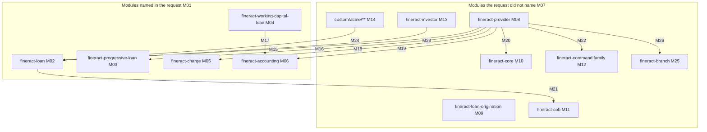
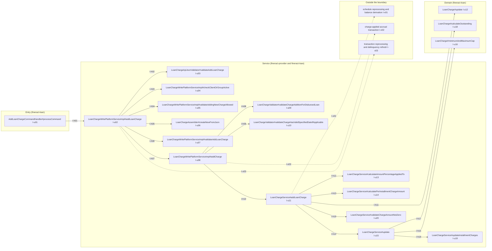
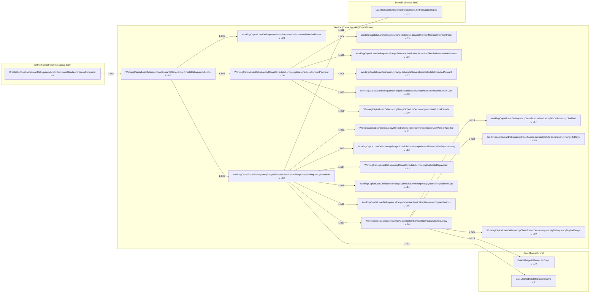

# Lending Reconstruction Candidate Selection

## 1. Purpose and run scope

This report is a read-only static-analysis **candidate-selection** report over the Apache Fineract lending domain. It measures a comparison set of lending-domain data elements and decisions under one normalized method, derives from those measurements a ranked shortlist of exactly three whose value-producing logic is maximally spread, deep, rule-dense and fully contained in the ingested code, disposes the two supplied hypotheses, and names exactly one recommended candidate for a later reconstruction run.

**Reconstruction is out of scope for this run.** No business logic is reconstructed, re-derived or expressed as pseudocode here. The report selects a target and hands the evidence to the downstream run.

- **Run result — selection: PASS.** [CONFIRMED] The rule of §2.3 makes this run a FAIL only where the exhausted comparison set yields fewer than three qualifying candidates. §4 records the measured comparison set with each candidate's qualification verdict — seven of the nineteen measured candidates qualify — §6, §9 and §10 carry the three shortlisted candidates, and §13 names exactly one recommended candidate whose containment verdict is PASS.
- **Run result — read-only analysis and delivery: PASS, with one addition disclosed.** [CONFIRMED] Nothing that existed in the analysed checkout was modified, removed or regenerated: the manifests taken before any work and after every other step agree on all 8121 baseline paths, hash for hash. This report is delivered at the canonical path outside every checkout that the governing plan names, and it is additionally present as one added file at the root of the delivery checkout, which is the output path this run's own tooling writes and reads back. That single added file is the whole of the difference between the two states, and §1.1 is the proof of both its extent and its limits, artefact by artefact.
- **Delivered output** [CONFIRMED] `/tmp/blitzy/deliverables/lending-reconstruction-candidate-selection.md` — the canonical path this run's output is consumed from, published from the exact bytes reviewed here; the copy at the root of the delivery checkout is byte-identical to it, verified with `cmp` and `sha256sum` at publication (§1.1).
- **Analysed commit** [CONFIRMED] `git rev-parse HEAD` = `74099701987ccb4755706d9a3de9fbbd3576ea1b` and `git rev-parse --abbrev-ref HEAD` = `blitzy-ibm`, both observed in the analysed checkout at `/tmp/blitzy/blitzy-fineract/blitzy-ibm_0b0560`. Every citation in this report resolves against that commit, and the delivery checkout carries that same content on every one of the 8121 paths it covers (§1.1).
- **Project version** [CONFIRMED] `build.gradle` (L144) `version = '0.0.0-SNAPSHOT'`.
- **Generated** [CONFIRMED] 2026-09-08 (ISO-8601), the date observed as `date -u +%Y-%m-%d` while the body of this report was being written; §1 and §1.1 were re-derived from the proof artefacts, and the delivered output above was republished from the reviewed bytes, on 2026-09-09. The generated date is stated separately from the analysed commit because the two can diverge: re-running the method of §2 against a newer commit is the only way to refresh this report.
- **Ownership posture.** This is a one-run artefact produced for the downstream reconstruction run. It has no standing maintainer and no update cadence. Every figure in it is a measurement of the analysed commit, and every citation is a repository-relative path that resolves against that commit.

### 1.1 Write proof

The governing plan required two things of this run's output: that the analysed code be read and never written, and that the report be delivered outside the checkout. The first holds exactly. The second holds at the canonical path. And one further fact is recorded here rather than left for a reader to discover: the delivery checkout also carries this report at its root, because that is the path this run's tooling writes and reads back for review. This sub-section is the proof of all three — a content-level baseline comparison taken before any work and re-taken after every other step, including after the delivered output of §1 was published. Two checkouts are involved and are never conflated here: the **analysed checkout**, whose content every citation in this report resolves against, and the **delivery checkout**, the clone through which this run publishes and the one that carries the added file.

- Precondition, a hard stop had it failed: [CONFIRMED] in the analysed checkout `git status --porcelain=v1 --untracked-files=all` printed nothing before any work started, and `git ls-files | wc -l` reported 8121 tracked files — equal to the 8121 files returned by a `find` over that working tree with `.git` pruned, so no untracked and no ignored file existed at baseline.
- The three artefact pairs and what comparing them settles: [CONFIRMED] three artefacts were captured before any work and re-captured, from the checkout as delivered, after every other step of the run — `git rev-parse HEAD`, a SHA-256 manifest of every file under the working tree with `.git` pruned, and the `git ls-files --stage` index listing. The index pair differs in exactly one entry — this report's path — and agrees on the other 8121; `/tmp/blitzy/validation/index-baseline.txt` holds `1639d0a2e9f6abf6d5d3adc99901f6002fe380bbc31b8820bed530c25224df39`, and the final listing's digest is deliberately not quoted, because that listing carries this file's own blob hash and no document can state a digest of itself: the pair is therefore compared entry by entry rather than digest to digest. The manifest pair is compared record by record in the next bullet. The head pair differs, `head-baseline.txt` holding the analysed commit `74099701987ccb4755706d9a3de9fbbd3576ea1b` and `head-final.txt` the delivery branch's tip; what that difference contains is exactly one path, which the fourth and seventh bullets state.
- The manifest comparison in detail, because a file count alone would not show alteration: [CONFIRMED] compared path by path under one byte collation, `LC_ALL=C`, the two manifests share **8121** paths and every one of those 8121 carries an identical hash on both sides; **zero** paths appear only in the baseline, **zero** shared path differs in hash, and **one** path appears only in the final manifest — `./lending-reconstruction-candidate-selection.md`, this report. Zero on the baseline side means no file present before the run was altered or removed; zero hash differences mean no analysed file was rewritten in place; the one path on the final side is this report and nothing else.
- What those artefacts describe, and when the final side was taken: [CONFIRMED] the checkout as delivered, whose content on every baseline path is that of the analysed commit `74099701987ccb4755706d9a3de9fbbd3576ea1b` — the same content carried by the analysed checkout at `/tmp/blitzy/blitzy-fineract/blitzy-ibm_0b0560` on branch `blitzy-ibm`, where the pruned `find` returns 8121 files. `git diff --name-status` from that commit to the delivery branch's tip lists exactly one path, `lending-reconstruction-candidate-selection.md`, with status `A`, and no other path in either direction. The three files named `final` were captured after every other step of the run, the publication of the delivered output included, so the comparison above is a re-measurement of the state actually delivered rather than a stale capture. The analysed content is independently re-derivable: extracting that commit with `git archive` and re-hashing the extracted tree under the identical command reproduces `tree-baseline.sha256` exactly.
- [CONFIRMED] **Result over the analysed code: zero existing files modified, zero files removed, zero code generated, and exactly one file added — this report.** A bounded `find` over the working tree with `.git` pruned, searching for directories named `.gradle`, `build`, `node_modules`, `dist`, `target` or `__pycache__`, returns none. The Gradle build, the test tasks, the Apache RAT task and the Asciidoctor and OpenAPI documentation tasks were never run against the analysed checkout, because each of them writes into it. The checks in this sub-section were run interactively; where one needed more than a single line it was supplied inline on standard input or kept as a helper file outside the repository, under `/tmp`, and no file of program text was written inside the checkout at any point. No generated program is part of the delivered output.
- Delivered output: [CONFIRMED] `/tmp/blitzy/deliverables/lending-reconstruction-candidate-selection.md` exists, is non-empty, and is byte-identical to the copy at the root of the delivery checkout — the same bytes you are reading, published from the reviewed file and verified against it with `cmp` and `sha256sum` at publication. It is the path the governing plan names for this run's output and the path the downstream reconstruction run consumes it from; any later revision reaches that run by republishing to this same path. The copy is data, carries no code, and lies outside every checkout.
- The one addition, stated plainly because a write proof that omitted it would be worth nothing: [CONFIRMED] the delivery checkout carries this report at its root as a tracked file, so `git ls-files | wc -l` reports **8122** there against the baseline's 8121, and the one path that accounts for the difference is this report's own. It is there because the output path this run's tooling writes, and reads back for review, is the repository root; the copy outside every checkout is the one the plan's delivery clause names and the one the downstream run consumes, and the two are byte-identical. No other path in that checkout is added, modified or removed — which is what the 8121 identical records above establish independently of any claim made here — and no analysed file is touched by the addition. The corresponding artefacts `/tmp/blitzy/validation/head-final.txt`, `tree-final.sha256` and `index-final.txt` record the delivered state, so these figures are auditable rather than asserted.
- One artefact necessarily differs, and pretending otherwise would be the only dishonest thing left to do: [CONFIRMED] the delivery branch's tip is not the analysed commit, because publishing anything through this run's mechanism requires a commit, and `head-baseline.txt` therefore differs from the delivery branch's `git rev-parse HEAD`. What that difference contains is the whole point: `git diff --name-status` from the analysed commit to the branch tip names one path and one path only, this report, added; no commit on the branch touches any other path. A reader auditing the delivery checkout should expect 8122 tracked files, one copy of this report at the root, and a diff against the analysed commit that consists of that single addition.
- One incidental observation, stated so that a reader repeating the directory scan is not surprised by it: [CONFIRMED] the delivery checkout — and only it, not the analysed checkout — carries two empty directories, `blitzy/screenshots` and `blitzy/screen_recordings`, provisioned by the platform when the working clone is created and therefore dated after the baseline capture rather than before it. `find blitzy -type f` returns zero at any depth in that checkout, the same path does not exist at all in the analysed checkout, and both directories are invisible to `git status` because Git does not track empty directories — which is also why they appear in neither tree manifest, each of which lists files only. Neither this run nor its validation wrote anything into them.

## 2. Method

### 2.1 Module mapping

The request named five modules — `fineract-loan`, `fineract-progressive-loan`, `fineract-working-capital-loan`, `fineract-charge` and `fineract-accounting` — and all five are declared in the Gradle settings, each cited to its own declaration line in the evidence table beneath the diagram (claims M01 to M26). The lending logic is not confined to them. The request offered a monolithic `fineract-provider` as a possible actual structure, and for the write path that structure is **confirmed**: the concrete loan write service, the loan domain service, the loan journal-entry poster and processor factory, and the transaction-processor bean wiring all live in `fineract-provider`, while the loan domain entities, the classic transaction processors, the schedule-date generator and the down-payment handler service live in `fineract-loan`. The validators straddle the same seam and are **not** all in one module: `fineract-loan` declares the transaction-validator contract and holds the final charge and down-payment validators, whereas the concrete transaction validator that the measured repayment and disbursement chains actually gate on, and the loan-application validator, are in `fineract-provider`. Rows M02 and M08 carry a citation for each of those placements.

Eight modules the request did not name participate, and each is mapped here because a measured chain of §5 to §10 or the entry enumeration of §2.2 reaches into it: `fineract-provider` itself; `fineract-loan-origination` (lending command handlers); `fineract-core` (money arithmetic, holiday and working-day utilities, the charge time types, the payment-detail write service and the SQL-dialect generator); `fineract-cob` (the close-of-business step framework and the tenant table that composes each workflow); the `fineract-command` family, six declared modules counted here as one (the typed command pipeline); `fineract-investor` (one lending close-of-business step); `fineract-branch` (the cashier gate on the disbursement path); and the dynamically included `custom/acme/**` tree (one conditional transaction processor and one no-op close-of-business step). `fineract-progressive-loan` and `fineract-working-capital-loan` are deliberately **not** in that list: the request named both, and each is mapped above as a named module.

**How to read the diagram.** Every edge asserts one relation and only one: **code in the tail module references code in the head module — it calls it, extends or implements a type the head module declares, or reads a constant or entity the head module defines — and that reference is exercised on a measured chain of §5 to §10 or on the entry enumeration of §2.2.** Node labels assert placement only: the module holds the units named in its row. No edge asserts a runtime call direction, a wiring precedence or a workflow order; where those matter — the ACME factory bean displacing the provider's, or the tenant-composed order of the close-of-business steps — they are stated in the row that owns them rather than drawn as an arrow. Each edge row cites the referencing unit and the referenced unit, both by full path, class and method, so the direction of every arrow is checkable from its own evidence.



| M-ID and claim | Evidence |
|---|---|
| M01 the request's five module names are all declared modules, on five distinct lines of one settings file | [CONFIRMED] `settings.gradle` (L60 `:fineract-accounting`, L66 `:fineract-charge`, L69 `:fineract-loan`, L82 `fineract-progressive-loan`, L84 `fineract-working-capital-loan`) |
| M02 `fineract-loan` holds the loan domain entities; the classic transaction-processor family; the schedule-date generator; the down-payment handler service; and the transaction-validator contract together with the final charge and down-payment validators | entities [CONFIRMED] `fineract-loan/src/main/java/org/apache/fineract/portfolio/loanaccount/domain/Loan.java:Loan (L92)` and `fineract-loan/src/main/java/org/apache/fineract/portfolio/loanaccount/domain/LoanTransaction.java:LoanTransaction#updateComponents (L570-L574)`; the processor family's base [CONFIRMED] `fineract-loan/src/main/java/org/apache/fineract/portfolio/loanaccount/domain/transactionprocessor/AbstractLoanRepaymentScheduleTransactionProcessor.java:AbstractLoanRepaymentScheduleTransactionProcessor (L77)` and its nine concrete implementations, each read at its own class declaration [CONFIRMED] `fineract-loan/src/main/java/org/apache/fineract/portfolio/loanaccount/domain/transactionprocessor/impl/CreocoreLoanRepaymentScheduleTransactionProcessor.java:CreocoreLoanRepaymentScheduleTransactionProcessor (L46)`, `fineract-loan/src/main/java/org/apache/fineract/portfolio/loanaccount/domain/transactionprocessor/impl/DuePenFeeIntPriInAdvancePriPenFeeIntLoanRepaymentScheduleTransactionProcessor.java:DuePenFeeIntPriInAdvancePriPenFeeIntLoanRepaymentScheduleTransactionProcessor (L46)`, `fineract-loan/src/main/java/org/apache/fineract/portfolio/loanaccount/domain/transactionprocessor/impl/DuePenIntPriFeeInAdvancePenIntPriFeeLoanRepaymentScheduleTransactionProcessor.java:DuePenIntPriFeeInAdvancePenIntPriFeeLoanRepaymentScheduleTransactionProcessor (L46)`, `fineract-loan/src/main/java/org/apache/fineract/portfolio/loanaccount/domain/transactionprocessor/impl/EarlyPaymentLoanRepaymentScheduleTransactionProcessor.java:EarlyPaymentLoanRepaymentScheduleTransactionProcessor (L40)`, `fineract-loan/src/main/java/org/apache/fineract/portfolio/loanaccount/domain/transactionprocessor/impl/FineractStyleLoanRepaymentScheduleTransactionProcessor.java:FineractStyleLoanRepaymentScheduleTransactionProcessor (L46)`, `fineract-loan/src/main/java/org/apache/fineract/portfolio/loanaccount/domain/transactionprocessor/impl/HeavensFamilyLoanRepaymentScheduleTransactionProcessor.java:HeavensFamilyLoanRepaymentScheduleTransactionProcessor (L48)`, `fineract-loan/src/main/java/org/apache/fineract/portfolio/loanaccount/domain/transactionprocessor/impl/InterestPrincipalPenaltyFeesOrderLoanRepaymentScheduleTransactionProcessor.java:InterestPrincipalPenaltyFeesOrderLoanRepaymentScheduleTransactionProcessor (L40)`, `fineract-loan/src/main/java/org/apache/fineract/portfolio/loanaccount/domain/transactionprocessor/impl/PrincipalInterestPenaltyFeesOrderLoanRepaymentScheduleTransactionProcessor.java:PrincipalInterestPenaltyFeesOrderLoanRepaymentScheduleTransactionProcessor (L40)` and `fineract-loan/src/main/java/org/apache/fineract/portfolio/loanaccount/domain/transactionprocessor/impl/RBILoanRepaymentScheduleTransactionProcessor.java:RBILoanRepaymentScheduleTransactionProcessor (L50)`; the date generator [CONFIRMED] `fineract-loan/src/main/java/org/apache/fineract/portfolio/loanaccount/loanschedule/domain/DefaultScheduledDateGenerator.java:DefaultScheduledDateGenerator#generateRepaymentPeriods (class L47, method L50)`; the handler service [CONFIRMED] `fineract-loan/src/main/java/org/apache/fineract/portfolio/loanaccount/service/LoanDownPaymentHandlerServiceImpl.java:LoanDownPaymentHandlerServiceImpl#handleRepaymentOrRecoveryOrWaiverTransaction (class L53, method L82)`; the validator contract [CONFIRMED] `fineract-loan/src/main/java/org/apache/fineract/portfolio/loanaccount/serialization/LoanTransactionValidator.java:LoanTransactionValidator (L35)` with `fineract-loan/src/main/java/org/apache/fineract/portfolio/loanaccount/serialization/LoanChargeValidator.java:LoanChargeValidator (L36)` and `fineract-loan/src/main/java/org/apache/fineract/portfolio/loanaccount/serialization/LoanDownPaymentTransactionValidator.java:LoanDownPaymentTransactionValidator (L40)`; module declared at `settings.gradle` (L69) |
| M03 `fineract-progressive-loan` holds the advanced allocation strategy, the progressive schedule generator and the EMI calculator that generator drives | strategy [CONFIRMED] `fineract-progressive-loan/src/main/java/org/apache/fineract/portfolio/loanaccount/domain/transactionprocessor/impl/AdvancedPaymentScheduleTransactionProcessor.java:AdvancedPaymentScheduleTransactionProcessor (class L134, strategy code L136, name L137)`; generator [CONFIRMED] `fineract-progressive-loan/src/main/java/org/apache/fineract/portfolio/loanaccount/loanschedule/domain/ProgressiveLoanScheduleGenerator.java:ProgressiveLoanScheduleGenerator#generate (class L61, method L87)`; calculator [CONFIRMED] `fineract-progressive-loan/src/main/java/org/apache/fineract/portfolio/loanproduct/calc/ProgressiveEMICalculator.java:ProgressiveEMICalculator (L76)`; module declared at `settings.gradle` (L82) |
| M04 `fineract-working-capital-loan` holds its own repayment entry, its own allocation planner and its own amortisation writer, and declares its own accounting contract that another module implements | entry [CONFIRMED] `fineract-working-capital-loan/src/main/java/org/apache/fineract/portfolio/workingcapitalloan/handler/RepaymentWorkingCapitalLoanCommandHandler.java:RepaymentWorkingCapitalLoanCommandHandler#processCommand (class L33, method L39-L41)` and `fineract-working-capital-loan/src/main/java/org/apache/fineract/portfolio/workingcapitalloan/service/WorkingCapitalLoanWritePlatformServiceImpl.java:WorkingCapitalLoanWritePlatformServiceImpl#makeRepayment (class L105, method L764)`; planner [CONFIRMED] `fineract-working-capital-loan/src/main/java/org/apache/fineract/portfolio/workingcapitalloan/service/WorkingCapitalLoanPaymentAllocationProcessor.java:WorkingCapitalLoanPaymentAllocationProcessor#plan (class L46, method L48)`; amortisation [CONFIRMED] `fineract-working-capital-loan/src/main/java/org/apache/fineract/portfolio/workingcapitalloan/service/WorkingCapitalLoanAmortizationScheduleWriteServiceImpl.java:WorkingCapitalLoanAmortizationScheduleWriteServiceImpl#applyRepayment (class L54, method L287)`; the accounting contract [CONFIRMED] `fineract-working-capital-loan/src/main/java/org/apache/fineract/portfolio/workingcapitalloan/accounting/WorkingCapitalLoanAccountingProcessor.java:WorkingCapitalLoanAccountingProcessor (interface L25)`, implemented at `fineract-provider/src/main/java/org/apache/fineract/accounting/journalentry/service/AccrualWithDeferredRevenueAmortizationAccountingProcessorForWorkingCapitalLoan.java:AccrualWithDeferredRevenueAmortizationAccountingProcessorForWorkingCapitalLoan (L50)`; module declared at `settings.gradle` (L84) |
| M05 `fineract-charge` holds the charge **definition** surface — the charge entity and its calculation-type enum, three charge-definition command handlers that are E1 entry points of §2.2, the charge API resource and the charge write-service contract — and not the charge **time** types the lending chains branch on, which are in `fineract-core` | entity and enum [CONFIRMED] `fineract-charge/src/main/java/org/apache/fineract/portfolio/charge/domain/Charge.java:Charge (L62)` and `fineract-charge/src/main/java/org/apache/fineract/portfolio/charge/domain/ChargeCalculationType.java:ChargeCalculationType (L23)`; handlers [CONFIRMED] `fineract-charge/src/main/java/org/apache/fineract/portfolio/charge/handler/CreateChargeDefinitionCommandHandler.java:CreateChargeDefinitionCommandHandler#processCommand (annotation L32, class L33, method L39)`, `fineract-charge/src/main/java/org/apache/fineract/portfolio/charge/handler/UpdateChargeDefinitionCommandHandler.java:UpdateChargeDefinitionCommandHandler (annotation L32, class L33)` and `fineract-charge/src/main/java/org/apache/fineract/portfolio/charge/handler/DeleteChargeDefinitionCommandHandler.java:DeleteChargeDefinitionCommandHandler (annotation L32, class L33)`; API and service [CONFIRMED] `fineract-charge/src/main/java/org/apache/fineract/portfolio/charge/api/ChargesApiResource.java:ChargesApiResource (L65)` and `fineract-charge/src/main/java/org/apache/fineract/portfolio/charge/service/ChargeWritePlatformService.java:ChargeWritePlatformService (L24)`; the time types elsewhere [CONFIRMED] `fineract-core/src/main/java/org/apache/fineract/portfolio/charge/domain/ChargeTimeType.java:ChargeTimeType (enum L23, DISBURSEMENT L26, TRANCHE_DISBURSEMENT L37)`; module declared at `settings.gradle` (L66) |
| M06 `fineract-accounting` holds the accounting contracts the lending chains post through and the provisioning read service; the units that implement those contracts are in `fineract-provider` | contracts [CONFIRMED] `fineract-accounting/src/main/java/org/apache/fineract/accounting/journalentry/service/AccountingProcessorHelper.java:AccountingProcessorHelper (interface L46, #getLinkedGLAccountForLoanProduct L204)` and `fineract-accounting/src/main/java/org/apache/fineract/accounting/journalentry/service/JournalEntryWritePlatformService.java:JournalEntryWritePlatformService (L28)`; read service [CONFIRMED] `fineract-accounting/src/main/java/org/apache/fineract/accounting/provisioning/service/ProvisioningEntriesReadPlatformServiceImpl.java:ProvisioningEntriesReadPlatformServiceImpl#retrieveLoanProductsProvisioningData (class L48, method L57)`; implementations [CONFIRMED] `fineract-provider/src/main/java/org/apache/fineract/accounting/journalentry/service/AccountingProcessorHelperImpl.java:AccountingProcessorHelperImpl (L93)` and `fineract-provider/src/main/java/org/apache/fineract/accounting/journalentry/service/JournalEntryWritePlatformServiceImpl.java:JournalEntryWritePlatformServiceImpl (L99)`; module declared at `settings.gradle` (L60) |
| M07 the eight modules in the lower group are declared modules that the request's list omits, and each holds units a measured chain or the §2.2 entry enumeration reaches | declarations [CONFIRMED] `settings.gradle` (L50 `:fineract-core`, L52 `:fineract-cob`, L54-L59 the six `:fineract-command*` modules, L61 `:fineract-provider`, L62 `:fineract-branch`, L64 `:fineract-investor`, L68 `:fineract-loan-origination`, L86 `:custom:docker` with the directory walk at L88-L94) — none of those lines is among the five cited in M01; the units themselves are cited one module at a time in rows M08 to M14 and M25 |
| M08 `fineract-provider` holds the concrete loan write service, the loan domain service, the loan journal-entry poster and journal-entry processor factory, the transaction-processor bean wiring, and the concrete transaction and loan-application validators — the structure the request offered as a possibility, confirmed | write service [CONFIRMED] `fineract-provider/src/main/java/org/apache/fineract/portfolio/loanaccount/service/LoanWritePlatformServiceJpaRepositoryImpl.java:LoanWritePlatformServiceJpaRepositoryImpl#disburseLoan (class L234, method L325-L326)`; domain service [CONFIRMED] `fineract-provider/src/main/java/org/apache/fineract/portfolio/loanaccount/domain/LoanAccountDomainServiceJpa.java:LoanAccountDomainServiceJpa#makeRepayment (class L127, method L216)`; journal-entry poster [CONFIRMED] `fineract-provider/src/main/java/org/apache/fineract/portfolio/loanaccount/service/LoanJournalEntryPosterImpl.java:LoanJournalEntryPosterImpl#postJournalEntriesForLoanTransaction (class L56, method L64)`; journal-entry factory [CONFIRMED] `fineract-provider/src/main/java/org/apache/fineract/accounting/journalentry/service/AccountingProcessorForLoanFactory.java:AccountingProcessorForLoanFactory#determineProcessor (L32-L48)`; bean wiring [CONFIRMED] `fineract-provider/src/main/java/org/apache/fineract/portfolio/loanaccount/starter/LoanAccountAutoStarter.java:LoanAccountAutoStarter (L50-L148)`; concrete validators [CONFIRMED] `fineract-provider/src/main/java/org/apache/fineract/portfolio/loanaccount/serialization/LoanTransactionValidatorImpl.java:LoanTransactionValidatorImpl (L103)` and `fineract-provider/src/main/java/org/apache/fineract/portfolio/loanaccount/serialization/LoanApplicationValidator.java:LoanApplicationValidator (L138)`; module declared at `settings.gradle` (L61) |
| M09 `fineract-loan-origination` contributes command handlers to the lending entry universe of §2.2, for both the loan and the working-capital-loan originator entities; the module's handler count is the coverage figure in §2.2, not a claim of this row | [CONFIRMED] `fineract-loan-origination/src/main/java/org/apache/fineract/portfolio/loanorigination/handler/AttachLoanOriginatorCommandHandler.java:AttachLoanOriginatorCommandHandler#processCommand (annotation L31, class L34, method L39)` and [CONFIRMED] `fineract-loan-origination/src/main/java/org/apache/fineract/portfolio/loanorigination/handler/AttachWorkingCapitalLoanOriginatorCommandHandler.java:AttachWorkingCapitalLoanOriginatorCommandHandler (annotation L31, class L34)`; module declared at `settings.gradle` (L68) |
| M10 `fineract-core` supplies the money arithmetic, the holiday and working-day utilities, the charge time types, the payment-detail write service and the SQL-dialect generator that the measured chains reach | money [CONFIRMED] `fineract-core/src/main/java/org/apache/fineract/organisation/monetary/domain/Money.java:Money#percentageOf (L405)`; holidays [CONFIRMED] `fineract-core/src/main/java/org/apache/fineract/organisation/holiday/service/HolidayUtil.java:HolidayUtil (L27)`; working days [CONFIRMED] `fineract-core/src/main/java/org/apache/fineract/organisation/workingdays/service/WorkingDaysUtil.java:WorkingDaysUtil (L27)`; charge time types [CONFIRMED] `fineract-core/src/main/java/org/apache/fineract/portfolio/charge/domain/ChargeTimeType.java:ChargeTimeType (L23)`; payment detail [CONFIRMED] `fineract-core/src/main/java/org/apache/fineract/portfolio/paymentdetail/service/PaymentDetailWritePlatformServiceJpaRepositoryImpl.java:PaymentDetailWritePlatformServiceJpaRepositoryImpl#createAndPersistPaymentDetail (class L33, method L61)`; SQL dialect [CONFIRMED] `fineract-core/src/main/java/org/apache/fineract/infrastructure/core/service/database/DatabaseSpecificSQLGenerator.java:DatabaseSpecificSQLGenerator#dateDiff (L154)`; module declared at `settings.gradle` (L50) |
| M11 `fineract-cob` supplies the close-of-business step contract and the service that composes each workflow from a tenant table rather than from code | contract [CONFIRMED] `fineract-cob/src/main/java/org/apache/fineract/cob/COBBusinessStep.java:COBBusinessStep (L23)`; composition [CONFIRMED] `fineract-cob/src/main/java/org/apache/fineract/cob/COBBusinessStepServiceImpl.java:COBBusinessStepServiceImpl#getCOBBusinessSteps (class L47, method L97-L110, tenant read L99)` through `fineract-cob/src/main/java/org/apache/fineract/cob/domain/BatchBusinessStepRepository.java:BatchBusinessStepRepository#findAllByJobName (interface L26, method L28)`; module declared at `settings.gradle` (L52) |
| M12 the `fineract-command` family supplies a second, typed command pipeline whose handler contract lending handlers implement | contract [CONFIRMED] `fineract-command/src/main/java/org/apache/fineract/command/core/CommandHandler.java:CommandHandler#handle (interface L24, method L26)`; family declared at `settings.gradle` (L54-L59, six modules) |
| M13 `fineract-investor` holds one lending close-of-business step, and the module is absent from the request's list | step [CONFIRMED] `fineract-investor/src/main/java/org/apache/fineract/investor/cob/loan/LoanAccountOwnerTransferBusinessStep.java:LoanAccountOwnerTransferBusinessStep (L58)`; module declared at `settings.gradle` (L64), which is not one of the five lines cited in M01 |
| M14 the `custom/**` tree is included by a directory walk rather than a static include, and the ACME modules under it supply one conditional transaction processor and one no-op close-of-business step; the processor's factory bean displaces the provider's, which yields only because the provider's is conditional on no other factory bean being present | inclusion [CONFIRMED] `settings.gradle` (L86 static `include ':custom:docker'`, L88 walk start, L94 dynamic `include ":custom:…"`); processor [CONFIRMED] `custom/acme/loan/processor/src/main/java/com/acme/fineract/loan/processor/AcmeLoanRepaymentScheduleTransactionProcessor.java:AcmeLoanRepaymentScheduleTransactionProcessor (class L28, STRATEGY_CODE L30)`; step [CONFIRMED] `custom/acme/loan/cob/src/main/java/com/acme/fineract/loan/cob/AcmeNoopBusinessStep.java:AcmeNoopBusinessStep (class L32)`, whose no-op behaviour is the body of its step method returning the loan it was given unchanged [CONFIRMED] `custom/acme/loan/cob/src/main/java/com/acme/fineract/loan/cob/AcmeNoopBusinessStep.java:AcmeNoopBusinessStep#execute (L47-L49, return L48)`, scanned in by `custom/acme/loan/starter/src/main/java/com/acme/fineract/loan/starter/AcmeLoanAutoConfiguration.java:AcmeLoanAutoConfiguration (@ComponentScan L31, @ConditionalOnProperty L32, class L33)`; displacement [CONFIRMED] `custom/acme/loan/starter/src/main/java/com/acme/fineract/loan/starter/AcmeLoanAutoConfiguration.java:AcmeLoanAutoConfiguration#loanRepaymentScheduleTransactionProcessorFactory (L36-L40)` against `fineract-provider/src/main/java/org/apache/fineract/portfolio/loanaccount/starter/LoanAccountAutoStarter.java:LoanAccountAutoStarter#loanRepaymentScheduleTransactionProcessorFactory (method L130, @ConditionalOnMissingBean L129)` |
| M15 `fineract-provider` references `fineract-loan`: its write service implements the loan module's write contract and operates on the loan module's entities | referencing unit [CONFIRMED] `fineract-provider/src/main/java/org/apache/fineract/portfolio/loanaccount/service/LoanWritePlatformServiceJpaRepositoryImpl.java:LoanWritePlatformServiceJpaRepositoryImpl (implements clause L234, #makeLoanRepayment L980-L985, import of the loan entity `LoanTransaction` L177)`; referenced units [CONFIRMED] `fineract-loan/src/main/java/org/apache/fineract/portfolio/loanaccount/service/LoanWritePlatformService.java:LoanWritePlatformService (interface L37, #makeLoanRepayment L48)` and `fineract-loan/src/main/java/org/apache/fineract/portfolio/loanaccount/domain/LoanTransaction.java:LoanTransaction (L63)`. The command handler that enters this chain is itself in the loan module [CONFIRMED] `fineract-loan/src/main/java/org/apache/fineract/portfolio/loanaccount/handler/LoanRepaymentCommandHandler.java:LoanRepaymentCommandHandler#processCommand (annotation L36, class L37, method L44-L48)` |
| M16 `fineract-provider` references `fineract-progressive-loan`: its bean wiring constructs the advanced allocation strategy the progressive module declares | referencing unit [CONFIRMED] `fineract-provider/src/main/java/org/apache/fineract/portfolio/loanaccount/starter/LoanAccountAutoStarter.java:LoanAccountAutoStarter#advancedPaymentScheduleTransactionProcessor (L136-L147, constructor call L144, import of the progressive class L26)`; referenced unit [CONFIRMED] `fineract-progressive-loan/src/main/java/org/apache/fineract/portfolio/loanaccount/domain/transactionprocessor/impl/AdvancedPaymentScheduleTransactionProcessor.java:AdvancedPaymentScheduleTransactionProcessor (L134)` |
| M17 `fineract-working-capital-loan` references `fineract-accounting`: its product accounting service holds the accounting module's product-to-general-ledger mapping repository and queries it for a product's mappings. The reference between this module and `fineract-provider` runs the other way, because the accounting contract this module declares is implemented in the provider | referencing unit [CONFIRMED] `fineract-working-capital-loan/src/main/java/org/apache/fineract/portfolio/workingcapitalloanproduct/service/WorkingCapitalProductAccountingMappingServiceImpl.java:WorkingCapitalProductAccountingMappingServiceImpl#fetchAccountMappingDetails (class L46, injected repository field L49, import L35, method L128, repository query L136)`; referenced unit [CONFIRMED] `fineract-accounting/src/main/java/org/apache/fineract/accounting/producttoaccountmapping/domain/ProductToGLAccountMappingRepository.java:ProductToGLAccountMappingRepository (L27)`; the direction of the provider relation [CONFIRMED] `fineract-working-capital-loan/src/main/java/org/apache/fineract/portfolio/workingcapitalloan/accounting/WorkingCapitalLoanAccountingProcessor.java:WorkingCapitalLoanAccountingProcessor (interface L25)` implemented at `fineract-provider/src/main/java/org/apache/fineract/accounting/journalentry/service/AccrualWithDeferredRevenueAmortizationAccountingProcessorForWorkingCapitalLoan.java:AccrualWithDeferredRevenueAmortizationAccountingProcessorForWorkingCapitalLoan (L50)` |
| M18 `fineract-provider` references `fineract-charge`: the disbursement path reads the charge definition entity's time type, then compares it against the constants, which are in `fineract-core` and not in `fineract-charge`. The direction follows from the two citations below rather than from a reading of the module names: the unit that does the reading is in `fineract-provider` and the entity it reads is in `fineract-charge`, so the arrow runs provider-to-charge — not charge-to-loan, which no cited unit supports | referencing unit [CONFIRMED] `fineract-provider/src/main/java/org/apache/fineract/portfolio/loanaccount/service/LoanDisbursementService.java:LoanDisbursementService#handleDisbursementTransaction (class L66, method L218, reads L239 and L242-L243, import of `Charge` L48 and of `ChargeTimeType` L49)`; referenced entity [CONFIRMED] `fineract-charge/src/main/java/org/apache/fineract/portfolio/charge/domain/Charge.java:Charge (L62)`; referenced constants [CONFIRMED] `fineract-core/src/main/java/org/apache/fineract/portfolio/charge/domain/ChargeTimeType.java:ChargeTimeType (DISBURSEMENT L26, TRANCHE_DISBURSEMENT L37)` |
| M19 `fineract-provider` references `fineract-accounting`: the units the lending chains post through implement the accounting module's contracts | referencing units [CONFIRMED] `fineract-provider/src/main/java/org/apache/fineract/accounting/journalentry/service/AccountingProcessorHelperImpl.java:AccountingProcessorHelperImpl (implements clause L93)` and `fineract-provider/src/main/java/org/apache/fineract/accounting/journalentry/service/JournalEntryWritePlatformServiceImpl.java:JournalEntryWritePlatformServiceImpl (implements clause L99)`; referenced contracts [CONFIRMED] `fineract-accounting/src/main/java/org/apache/fineract/accounting/journalentry/service/AccountingProcessorHelper.java:AccountingProcessorHelper (L46)` and `fineract-accounting/src/main/java/org/apache/fineract/accounting/journalentry/service/JournalEntryWritePlatformService.java:JournalEntryWritePlatformService (L28)` |
| M20 `fineract-provider` references `fineract-core`: the lending chains call the core money arithmetic, the core payment-detail write service and the core charge time types | money [CONFIRMED] called at `fineract-provider/src/main/java/org/apache/fineract/accounting/provisioning/service/ProvisioningEntriesWritePlatformServiceJpaRepositoryImpl.java:ProvisioningEntriesWritePlatformServiceJpaRepositoryImpl#generateLoanProvisioningEntry (L239)` into `fineract-core/src/main/java/org/apache/fineract/organisation/monetary/domain/Money.java:Money#percentageOf (L405)`; payment detail [CONFIRMED] called at `fineract-provider/src/main/java/org/apache/fineract/portfolio/loanaccount/service/LoanWritePlatformServiceJpaRepositoryImpl.java:LoanWritePlatformServiceJpaRepositoryImpl#disburseLoan (L361)` into `fineract-core/src/main/java/org/apache/fineract/portfolio/paymentdetail/service/PaymentDetailWritePlatformServiceJpaRepositoryImpl.java:PaymentDetailWritePlatformServiceJpaRepositoryImpl#createAndPersistPaymentDetail (L61)`; time types [CONFIRMED] read at `fineract-provider/src/main/java/org/apache/fineract/portfolio/loanaccount/service/LoanDisbursementService.java:LoanDisbursementService#handleDisbursementTransaction (L239)` from `fineract-core/src/main/java/org/apache/fineract/portfolio/charge/domain/ChargeTimeType.java:ChargeTimeType (L23)` |
| M21 `fineract-loan` references `fineract-cob`: the lending close-of-business step contract, which every lending step implements, extends the framework contract in `fineract-cob` — which is how a lending step joins a workflow whose membership and order come from a tenant table rather than from code | referencing unit [CONFIRMED] `fineract-loan/src/main/java/org/apache/fineract/cob/loan/LoanCOBBusinessStep.java:LoanCOBBusinessStep (extends clause L24, import L21)`; referenced contract [CONFIRMED] `fineract-cob/src/main/java/org/apache/fineract/cob/COBBusinessStep.java:COBBusinessStep (L23)`; the tenant-composed membership [CONFIRMED] `fineract-cob/src/main/java/org/apache/fineract/cob/COBBusinessStepServiceImpl.java:COBBusinessStepServiceImpl#getCOBBusinessSteps (L97-L110, tenant read L99)`; the provider's steps that implement the lending contract [CONFIRMED] `fineract-provider/src/main/java/org/apache/fineract/cob/loan/SetLoanDelinquencyTagsBusinessStep.java:SetLoanDelinquencyTagsBusinessStep (implements clause L46, #execute L54-L82)` |
| M22 `fineract-provider` references the `fineract-command` family: provider handlers implement the typed pipeline's handler contract for lending entities | referencing unit [CONFIRMED] `fineract-provider/src/main/java/org/apache/fineract/portfolio/loanproduct/productmix/handler/ProductMixCreateCommandHandler.java:ProductMixCreateCommandHandler#handle (import of the contract L25, class L35, method L42)`; referenced contract [CONFIRMED] `fineract-command/src/main/java/org/apache/fineract/command/core/CommandHandler.java:CommandHandler#handle (interface L24, method L26)` |
| M23 `fineract-investor` references `fineract-loan`: its step implements the lending close-of-business step contract, so it joins the same tenant-composed workflow as the provider's steps by way of M21 | referencing unit [CONFIRMED] `fineract-investor/src/main/java/org/apache/fineract/investor/cob/loan/LoanAccountOwnerTransferBusinessStep.java:LoanAccountOwnerTransferBusinessStep (implements clause L58)`; referenced contract [CONFIRMED] `fineract-loan/src/main/java/org/apache/fineract/cob/loan/LoanCOBBusinessStep.java:LoanCOBBusinessStep (L24)` |
| M24 `custom/acme/**` references `fineract-loan`: the ACME processor extends a concrete loan-module processor, and the ACME configuration constructs the loan module's processor factory with the ACME processor as its default — the direction the override runs, and the reason the eleventh processor is a code-and-name alias rather than a distinct algorithm | referencing units [CONFIRMED] `custom/acme/loan/processor/src/main/java/com/acme/fineract/loan/processor/AcmeLoanRepaymentScheduleTransactionProcessor.java:AcmeLoanRepaymentScheduleTransactionProcessor (extends clause L28, import L22)` and `custom/acme/loan/starter/src/main/java/com/acme/fineract/loan/starter/AcmeLoanAutoConfiguration.java:AcmeLoanAutoConfiguration#loanRepaymentScheduleTransactionProcessorFactory (L36-L40, constructor call L39, import L23, `@ConditionalOnProperty("acme.loan.enabled")` L32)`; referenced units [CONFIRMED] `fineract-loan/src/main/java/org/apache/fineract/portfolio/loanaccount/domain/transactionprocessor/impl/FineractStyleLoanRepaymentScheduleTransactionProcessor.java:FineractStyleLoanRepaymentScheduleTransactionProcessor (L46)` and `fineract-loan/src/main/java/org/apache/fineract/portfolio/loanaccount/domain/LoanRepaymentScheduleTransactionProcessorFactory.java:LoanRepaymentScheduleTransactionProcessorFactory (L30)` |
| M25 `fineract-branch` holds the cashier validator the disbursement path calls, and the module is absent from the request's list | validator [CONFIRMED] `fineract-branch/src/main/java/org/apache/fineract/organisation/teller/data/CashierTransactionDataValidator.java:CashierTransactionDataValidator#validateOnLoanDisbursal (class L45, method L111)`; module declared at `settings.gradle` (L62), which is not one of the five lines cited in M01 |
| M26 `fineract-provider` references `fineract-branch`: the disbursement path calls that validator, and only on the cash-payment-type branch. This edge carries the branch crossing alone; the provider's core crossings are M20's | referencing unit [CONFIRMED] `fineract-provider/src/main/java/org/apache/fineract/portfolio/loanaccount/service/LoanWritePlatformServiceJpaRepositoryImpl.java:LoanWritePlatformServiceJpaRepositoryImpl#disburseLoan (call L364, guarded by the cash-payment-type test L362)`; referenced unit [CONFIRMED] `fineract-branch/src/main/java/org/apache/fineract/organisation/teller/data/CashierTransactionDataValidator.java:CashierTransactionDataValidator#validateOnLoanDisbursal (L111)` |

### 2.2 Entry taxonomy and coverage

An **entry point** is any of five kinds, enumerated exhaustively over one fixed set of source roots before any candidate was scored. The **ten declared roots** are the six module source trees `fineract-loan/src/main/java`, `fineract-progressive-loan/src/main/java`, `fineract-working-capital-loan/src/main/java`, `fineract-charge/src/main/java`, `fineract-accounting/src/main/java` and `fineract-loan-origination/src/main/java`, and the four `fineract-provider` package roots `fineract-provider/src/main/java/org/apache/fineract/portfolio/loanaccount`, `fineract-provider/src/main/java/org/apache/fineract/accounting`, `fineract-provider/src/main/java/org/apache/fineract/portfolio/account` and `fineract-provider/src/main/java/org/apache/fineract/interoperation`. E1, E2 and E3 are bounded to those ten roots exactly. Two classes reach beyond them, and every such reach is named here rather than left to the class definition: **E4** adds the two bulk-import anchors under `fineract-provider/src/main/java/org/apache/fineract/infrastructure/bulkimport`, which are the only E4 rows outside the ten roots; **E5** is not bounded by the ten roots at all, and instead runs over three roots of its own — the close-of-business root `fineract-provider/src/main/java/org/apache/fineract/cob/loan`, the `custom/**` root, and a provider-wide search for qualifying tasklets across `fineract-provider/src/main/java`. Fifteen of the 25 E5 rows consequently sit outside the ten declared roots: 13 under the provider `cob/loan` root (its 11 close-of-business steps and its 2 qualifying lock tasklets), 1 under the `custom/**` root, and 1 under `fineract-provider/src/main/java/org/apache/fineract/infrastructure` [CONFIRMED] `fineract-provider/src/main/java/org/apache/fineract/infrastructure/jobs/service/updatenpa/UpdateNpaTasklet.java:UpdateNpaTasklet#execute (L44)`. The remaining 10 fall inside the ten roots (8 under the provider `portfolio/loanaccount` root, 1 under `accounting`, 1 under `portfolio/account`).

- **E1** — a handler annotated `@CommandType` in a declared root, with the annotation's entity and action constants resolved to their string values. Enumerated by `grep -Rl --include='*.java' '@CommandType'` over each declared root, then deduplicated by path.
- **E2** — a `NewCommandSourceHandler` implementation in a declared root that carries no `@CommandType`, found by the `*CommandHandler` name convention and routed by a `CommandWrapper` predicate rather than by an annotation. Enumerated by taking the `*CommandHandler.java` files of each declared root, keeping those that implement the contract, and removing those that carry the annotation.
- **E3** — a concrete implementation of the typed pipeline contract `CommandHandler<REQ, RES>` of `fineract-command`, whose request type `REQ` is a lending entity, in a declared root. The contract is one generic method [CONFIRMED] `fineract-command/src/main/java/org/apache/fineract/command/core/CommandHandler.java:CommandHandler#handle (L24-L26)` and dispatch is by the request type carried in the command payload [CONFIRMED] `fineract-command/src/main/java/org/apache/fineract/command/core/CommandHandler.java:CommandHandler#matches (L34-L38)`. Enumerated by `grep -rln 'implements CommandHandler<'` over every `src/main/java` tree and intersecting the result with the ten declared roots; an implementation outside those roots is a disclosed diagnostic, not an E3 row, however lending-specific its request type is.
- **E4** — a direct service, internal-API or bulk-import entry that writes lending state from **outside the command-handler pipeline**. It is the three anchors named by the governing plan — [CONFIRMED] `fineract-provider/src/main/java/org/apache/fineract/interoperation/service/InteropServiceImpl.java:InteropServiceImpl#disburseLoan (L527)` and [CONFIRMED] `fineract-provider/src/main/java/org/apache/fineract/interoperation/service/InteropServiceImpl.java:InteropServiceImpl#loanRepayment (L540)`, [CONFIRMED] `fineract-provider/src/main/java/org/apache/fineract/infrastructure/bulkimport/importhandler/loan/LoanImportHandler.java:LoanImportHandler#process (L76)` and [CONFIRMED] `fineract-provider/src/main/java/org/apache/fineract/infrastructure/bulkimport/importhandler/loanrepayment/LoanRepaymentImportHandler.java:LoanRepaymentImportHandler#process (L68)` (the two import handlers are the plan's named anchors and are the only E4 rows outside the ten roots) — plus every other class in a declared root that calls a lending write service from outside that pipeline. Those further entries are found exhaustively from the **call sites of the lending write-service authorities**, which are enumerated here rather than left implicit — the thirteen names are `LoanWritePlatformService`, `LoanApplicationWritePlatformService`, `LoanAccountDomainService`, `WorkingCapitalLoanWritePlatformService`, `LoanChargeWritePlatformService`, `AccountTransfersWritePlatformService`, `JournalEntryWritePlatformService`, `LoanAccrualsProcessingService`, `LoanArrearsAgingService`, `LoanStatusChangePlatformService`, `LoanScheduleService`, `LoanTransactionProcessingService` and `PortfolioCommandSourceWritePlatformService`. The search is `grep -Rl --include='*.java'` for that alternation over the ten declared roots, which returns 177 files at the analysed commit; removing the files already enumerated as E1, E2 or E5 entries leaves 65 to open, and each of those 65 is classified by reading the call site. A file is an E4 entry only when it invokes a write service on its own initiative — through a business-event listener registration, an internal API method, or a direct call from a non-command context. A class whose callers are all command handlers is a callee and not an E4 entry, even when the calling handler itself sits outside the ten roots; an interface declaration, a write-service implementation reached from another entry, and Spring wiring are likewise not entries.
- **E5** — a batch entry: every `LoanCOBBusinessStep` implementation under `fineract-provider/src/main/java/org/apache/fineract/cob/loan` or under the `custom/**` root, every `*Tasklet` under `fineract-provider/src/main/java/org/apache/fineract/portfolio/loanaccount/jobs`, and every other `*Tasklet` under `fineract-provider/src/main/java` that writes lending or lending-accounting state. The predicate for that last group is a persisted write to a lending or lending-accounting aggregate, read from the tasklet's own `#execute` body and the bodies it inherits; a tasklet that only populates Spring Batch execution or job context, emits a notification, or records job-tracking metadata is not an E5 entry.

[CONFIRMED] Coverage measured over the analysed commit: **206 entry points — E1 160, E2 5, E3 0, E4 16, E5 25**, counted over the taxonomy above under the coverage-figure rule of §2.6. The E1 total decomposes as 71 files under `fineract-loan/src/main/java`, 4 under `fineract-progressive-loan/src/main/java`, 35 under `fineract-working-capital-loan/src/main/java`, 3 under `fineract-charge/src/main/java`, 13 under `fineract-accounting/src/main/java`, 7 under `fineract-loan-origination/src/main/java` and 27 across the four `fineract-provider` package roots (`portfolio/loanaccount` 7, `accounting` 7, `portfolio/account` 6, `interoperation` 7 — the governing plan's planning-time indication of 20 covered only the first three of those roots, and the observed 27 is what the enumeration returns); of the 160 annotations, 144 carry both entity and action as string literals and 16 carry at least one constant reference, and all 16 were resolved to their values. The five E2 handlers all sit in `fineract-loan/src/main/java` — three interest-pause handlers and the two disbursement-detail handlers the `CommandWrapper` predicates separate by entity id. **E3 is 0**: 49 concrete typed implementations exist across every `src/main/java` tree (`fineract-command-test` 2, `fineract-core` 7, `fineract-document` 5, `fineract-provider` 33, `fineract-rates` 2) and none of them sits in a declared root, so four lending-specific implementations are disclosed as out-of-root diagnostics rather than counted — [CONFIRMED] `fineract-provider/src/main/java/org/apache/fineract/portfolio/collateralmanagement/handler/LoanCollateralDeleteCommandHandler.java:LoanCollateralDeleteCommandHandler (L35)`, [CONFIRMED] `fineract-provider/src/main/java/org/apache/fineract/portfolio/loanproduct/productmix/handler/ProductMixCreateCommandHandler.java:ProductMixCreateCommandHandler (L35)`, [CONFIRMED] `fineract-provider/src/main/java/org/apache/fineract/portfolio/loanproduct/productmix/handler/ProductMixUpdateCommandHandler.java:ProductMixUpdateCommandHandler (L35)` and [CONFIRMED] `fineract-provider/src/main/java/org/apache/fineract/portfolio/loanproduct/productmix/handler/ProductMixDeleteCommandHandler.java:ProductMixDeleteCommandHandler (L35)`. The E4 total decomposes as the 3 plan anchors, 9 classes that register a business-event listener and write on the event, 3 internal API resources with a writing verb, and the 1 post-transaction direct-service entry the plan names, [CONFIRMED] `fineract-provider/src/main/java/org/apache/fineract/portfolio/loanaccount/domain/LoanAccountDomainServiceJpa.java:LoanAccountDomainServiceJpa#setLoanDelinquencyTag (L576, L594)`. Five exclusions are disclosed with the test each fails: the internal loan-information API exposes only read verbs [CONFIRMED] `fineract-provider/src/main/java/org/apache/fineract/portfolio/loanaccount/api/InternalLoanInformationApiResource.java:InternalLoanInformationApiResource (L51; every exposed method carries the read verb, the first at L71)`; the internal close-of-business API mutates only an in-memory test map [CONFIRMED] `fineract-working-capital-loan/src/main/java/org/apache/fineract/cob/api/InternalWorkingCapitalLoanCOBApiResource.java:InternalWorkingCapitalLoanCOBApiResource#deleteLastCobRun (L70-L74)`; the interest-recalculation poster is a callable owned by an E5 tasklet [CONFIRMED] `fineract-loan/src/main/java/org/apache/fineract/portfolio/loanaccount/service/RecalculateInterestPoster.java:RecalculateInterestPoster#call (L43)`; the calendar, collection-sheet and client-transfer write services each reach the loan write service only from their own command handlers, which sit outside the ten roots [CONFIRMED] `fineract-provider/src/main/java/org/apache/fineract/portfolio/calendar/service/CalendarWritePlatformServiceJpaRepositoryImpl.java:CalendarWritePlatformServiceJpaRepositoryImpl#updateCalendar (L187, call site L282)`, [CONFIRMED] `fineract-provider/src/main/java/org/apache/fineract/portfolio/collectionsheet/service/CollectionSheetWritePlatformServiceJpaRepositoryImpl.java:CollectionSheetWritePlatformServiceJpaRepositoryImpl#updateBulkRepayments (L127, call sites L131, L139)` and [CONFIRMED] `fineract-provider/src/main/java/org/apache/fineract/portfolio/transfer/service/TransferWritePlatformServiceJpaRepositoryImpl.java:TransferWritePlatformServiceJpaRepositoryImpl#handleClientTransferLifecycleEvent (L362, call sites L387, L391)`; and the guarantor import handler routes through the standard command path rather than a direct write [CONFIRMED] `fineract-provider/src/main/java/org/apache/fineract/infrastructure/bulkimport/importhandler/guarantor/GuarantorImportHandler.java:GuarantorImportHandler#process (L62)`. The E5 total decomposes as 12 close-of-business steps (11 under the provider `cob/loan` root and 1 under `custom/**`), the 8 tasklets under `fineract-provider/src/main/java/org/apache/fineract/portfolio/loanaccount/jobs`, and 5 of the remaining 28 `*Tasklet` files under `fineract-provider/src/main/java` — 36 tasklets in total; of the 23 excluded, 19 write savings, share, campaign, messaging, dirty-job or business-date state only and 4 fail the E5 predicate by writing execution context, job context, a lock notification or job-tracking metadata [CONFIRMED] `fineract-provider/src/main/java/org/apache/fineract/cob/loan/InlineLoanCOBBuildExecutionContextTasklet.java:InlineLoanCOBBuildExecutionContextTasklet#execute (L71)`, [CONFIRMED] `fineract-provider/src/main/java/org/apache/fineract/cob/loan/ResolveLoanCOBCustomJobParametersTasklet.java:ResolveLoanCOBCustomJobParametersTasklet#execute (L36)`, [CONFIRMED] `fineract-provider/src/main/java/org/apache/fineract/cob/loan/StayedLockedLoansTasklet.java:StayedLockedLoansTasklet#execute (L46)`, [CONFIRMED] `fineract-provider/src/main/java/org/apache/fineract/infrastructure/jobs/service/aggregationjob/tasklet/JournalEntryAggregationTrackingTasklet.java:JournalEntryAggregationTrackingTasklet#execute (L46)`. A thirteenth implementation of the close-of-business contract exists outside the E5 roots and is disclosed here rather than counted: [CONFIRMED] `fineract-investor/src/main/java/org/apache/fineract/investor/cob/loan/LoanAccountOwnerTransferBusinessStep.java:LoanAccountOwnerTransferBusinessStep#execute (L76)`, in a module declared at `settings.gradle (L64)`, whose external-asset-owner transfer is a real lending write and is covered as an output of the account-transfer candidate through that candidate's own in-root entry points.

**Discovery method**, stated so the ledger can be regenerated from this section alone:

- *Constant resolution.* An `@CommandType` value written as an identifier is resolved by opening the constant's declaration and taking its string value; the pair is recorded as `entity/action`. One constant is its own name — `CommandWrapperConstants.ENTITY_WORKINGCAPITALLOANTRANSACTION` has the literal value `ENTITY_WORKINGCAPITALLOANTRANSACTION` [CONFIRMED] `fineract-core/src/main/java/org/apache/fineract/commands/domain/CommandWrapperConstants.java:CommandWrapperConstants#ENTITY_WORKINGCAPITALLOANTRANSACTION (L186)` — so that resolved pair is the real routing key and not an unresolved reference. For E2, where there is no annotation, the recorded identity is the entity and action the `CommandWrapper` predicate selects the handler on; for E5 it is the step's `#getEnumStyledName` value or the tasklet's job root; for E4 it is the entry kind.
- *Deduplication identity.* One row per (entry class, entry path). An entry class with several entry methods in one file is one row whose entry-unit field names each method with its line, so the path column is a set and can be compared with a repository enumeration directly.
- *Output extraction.* For each entry point, the outputs field lists the business-real lending outcomes its own transaction writes or returns — a derived monetary amount, a derived classification, or a stable business decision on a lending aggregate — separated by semicolons.
- *The `outputs=none` rule.* An entry point is recorded with `outputs=none` and the reason, and only then, when everything it writes falls into one of three categories: a caller-supplied value stored without derivation (reference, product or tenant configuration, a flag, an officer or originator reference); operational or batch state (a close-of-business lock, job-tracking metadata, execution context); or a read and its returned representation. Entry-class membership and the outputs field are separate tests: a tasklet qualifies as an E5 entry by writing lending or lending-accounting state, which is why the running-balance tasklet is an entry point while its GL-account balance, derived across every product's journal entries, is not a lending outcome.
- *Candidate assignment.* An output is assigned to the candidate whose outcome is the same computed value on the same fields of the same aggregate, under the boundary rule below, and a row may carry several candidate identifiers. Where a row's only lending output is the posting, event or audit row that carries a value computed elsewhere, the row is assigned the candidate that computes it and marked `consumer`, so that no output is recorded without a candidate.

**Candidate-boundary rule**, fixed before discovery and applied to every entry point. Each entry point's business-real outputs were listed — zero, one or several. Approvals, rejections, write-offs, charge-offs, charge application and accrual are outputs like any other, and a stable returned business decision counts even where it is not persisted. Outputs were then grouped into candidates of two types:

- **Value candidate** — a single computed monetary or classification value. Its boundary is the units that compute the value plus its immediate persistence on the aggregate. Journal entries, business events, delinquency tags and transfers that consume the value are outside the boundary and are listed as such. Two outputs that are the same computed value on the same fields of the same aggregates are one candidate even when reached from different entry points; this is why the write-off, charge-off, chargeback and refund component splits are entries to the repayment-split candidate rather than candidates of their own, and why rescheduling, re-ageing, holiday shifting and interest recalculation are entries to the installment-amount candidate.
- **Transition candidate** — a state transition the request's own wording defines as spanning several modules in one transaction. Its boundary is every output written inside that transaction, including the accounting, transfer and event legs.

The type is fixed by the request's wording where the request names the outcome: H1 is a value candidate, H2 is a transition candidate. Every other candidate is a value candidate unless an entry point's own contract — a single transactional method writing several aggregates — makes it a transition, in which case the type and the reason are stated. The type appears in the comparison table so that every score is read together with its boundary.

[CONFIRMED] The four aggregate figures of the discovery are: **206 entry points**, **429 outputs listed**, **19 candidates formed** and **19 candidates measured**. The output total counts the semicolon-separated items of every row's outputs field, an `outputs=none` row contributing zero, so it is an output cardinality and not a count of rows. Of the 206 entry points, 152 carry at least one business-real lending output and every one of those outputs is assigned to a candidate; the remaining 54 are recorded with `outputs=none` and the reason under the rule above — caller-supplied reference, product or tenant configuration, operational batch state, or a read and its returned representation.

No entry point is recorded with an output and no candidate, and no output-bearing entry point was set aside before measurement. Where an output is a computed decision that no already-formed candidate produces, the answer is a new candidate rather than an assignment to the nearest existing one, because a candidate's boundary is the set of units its measured section actually traces: a lifecycle status decision cannot be folded into the disbursement transition, whose boundary is transaction-scoped, and a due-state determination cannot be folded into the installment-amount candidate, which produces amounts and dates rather than a due flag. Five candidates were formed on that basis and are measured in §4 alongside the other thirteen:

- **C-M** — the loan lifecycle status decision and the fields its transition clears, produced by [CONFIRMED] `fineract-loan/src/main/java/org/apache/fineract/portfolio/loanaccount/domain/DefaultLoanLifecycleStateMachine.java:DefaultLoanLifecycleStateMachine#internalTransition (L73, status written L77)`, reached from loan approval, approval-undo, rejection, withdrawal, closure, close-as-rescheduled, deletion and their group-loan equivalents.
- **C-N** — the loan fraud marking decision, produced by [CONFIRMED] `fineract-loan/src/main/java/org/apache/fineract/portfolio/loanaccount/domain/Loan.java:Loan#markAsFraud (L1652)`, reached from [CONFIRMED] `fineract-provider/src/main/java/org/apache/fineract/portfolio/loanaccount/service/LoanWritePlatformServiceJpaRepositoryImpl.java:LoanWritePlatformServiceJpaRepositoryImpl#markLoanAsFraud (L2557-L2578)`.
- **C-O** — the installment due-state determination, produced by [CONFIRMED] `fineract-provider/src/main/java/org/apache/fineract/cob/loan/CheckLoanRepaymentOverdueBusinessStep.java:CheckLoanRepaymentOverdueBusinessStep#isOverDueEventNeededToBeSent (L83-L86)` and its two sibling steps, which return a stable decision on the event rather than persisting it.
- **C-P** — the working-capital loan fraud marking decision, produced by [CONFIRMED] `fineract-working-capital-loan/src/main/java/org/apache/fineract/portfolio/workingcapitalloan/service/WorkingCapitalLoanFraudWriteServiceImpl.java:WorkingCapitalLoanFraudWriteServiceImpl#markAsFraud (L56-L86)`.
- **C-Q** — the working-capital lifecycle status decision, produced by [CONFIRMED] `fineract-working-capital-loan/src/main/java/org/apache/fineract/portfolio/workingcapitalloan/domain/WorkingCapitalLoanLifecycleStateMachine.java:WorkingCapitalLoanLifecycleStateMachine#transition (L36-L45)`, reached from working-capital approval, approval-undo, rejection and deletion.

A **flag** is an output when the entry validates it, decides against the stored value and returns the change — which is why both fraud markings are candidates — and is not an output when it is a caller-supplied value stored without derivation. A **marker field** set directly alongside the transaction a flow already produces is part of that flow's outcome and not a value of its own: the charge-off, foreclosure and contract-termination sub-status markers are direct field writes with no computation [CONFIRMED] `fineract-loan/src/main/java/org/apache/fineract/portfolio/loanaccount/domain/Loan.java:Loan#markAsChargedOff (L1738)`, [CONFIRMED] `fineract-provider/src/main/java/org/apache/fineract/portfolio/loanaccount/domain/LoanAccountDomainServiceJpa.java:LoanAccountDomainServiceJpa#handleForeClosureTransactions (L1024, sub-status written L1026)` and [CONFIRMED] `fineract-provider/src/main/java/org/apache/fineract/portfolio/loanaccount/service/contracttermination/LoanContractTerminationServiceImpl.java:LoanContractTerminationServiceImpl#applyContractTermination (L78, sub-status written L92)`, so they carry no candidate of their own. A field initialised to a fixed constant is likewise not a computed decision: loan creation persists `SUBMITTED_AND_PENDING_APPROVAL` unconditionally and never reaches C-M's producer, since [CONFIRMED] `fineract-loan/src/main/java/org/apache/fineract/portfolio/loanaccount/domain/LoanEvent.java:LoanEvent#LOAN_CREATED (L26)` has no call site. Candidates formed therefore equals candidates measured, and §4 measures all 18 and screens none.

[CONFIRMED] The ledger's candidate identifiers are pinned to the ordering rule of §2.3 — a candidate takes its identifier from the sorted repository path of the file that produces its primary output, ties broken by production method name — so `C-G` is the accrual amount produced in `fineract-loan/src/main/java/org/apache/fineract/portfolio/loanaccount/domain/LoanTransaction.java`, `C-I` the loan charge amount produced in `fineract-loan/src/main/java/org/apache/fineract/portfolio/loanaccount/service/LoanChargeService.java` and `C-J` the account transfer produced in `fineract-provider/src/main/java/org/apache/fineract/portfolio/account/service/AccountTransfersWritePlatformServiceImpl.java`. Where a §4 through §10 label disagrees with that rule, the producer named in the section body is authoritative over the letter.

[CONFIRMED] Every entry point is one row of the discovery ledger kept outside this report at `/tmp/blitzy/validation/universe.tsv` — eight tab-separated columns (entry class, entry path, entry unit, resolved constant or step, outputs, candidate identifiers, measured, notes) over 206 data rows, every field populated and `measured` set for every row. Completeness was checked class by class, by set comparison of the ledger's path column against the bounded enumeration of §2.2 for that class: E1 160 against 160, E2 5 against 5, E4 16 against 16 and E5 25 against 25, each difference empty in both directions, with E3 empty on both sides; all 206 paths were confirmed to exist on disk, no two rows share an entry identity, and the 144 literal annotation pairs were compared mechanically against the ledger's resolved values with no mismatch.

### 2.3 Path policy, counting rules and ranking rule

**Path policy.** For each candidate exactly one **measured path** is selected deterministically: start from the entry point whose direct chain to the outcome is deepest; at every branch point that depends on product configuration, transaction attributes, runtime state or a selectable implementation, take the alternative that leads to the deepest fully contained continuation to the outcome. Alternatives are traced only until they rejoin the path, terminate, or exceed the current best depth, and only alternatives that can change an output, a score or the containment verdict are traced and listed. Equal-depth contained alternatives are broken by higher spread, then higher rule density, then the lexicographically smaller path label. A candidate whose containment verdict is FAIL is measured on its deepest path rather than its deepest contained path. Every branch point on the measured path appears in that candidate's branch table with each alternative's added units, whether it can change an output, a score or the verdict, its containment reads and their categories, and its disposition; the branch table is the stopping proof. A candidate's scope is never narrowed after evidence is seen — a narrower candidate must be declared up front, which is exactly why C-A′ exists.

**Batch entries are branch alternatives like any other.** A close-of-business step or a job tasklet that enters or re-enters a candidate's chain is traced, disposed and listed in the branch table under exactly the rules above, with no separate treatment for being a batch entry and no exemption from the hop, spread or rule-density counts. What is specific to a close-of-business entry is a containment consequence. Which steps run in a workflow, and in what order, is not in the code: it is composed at run time from a tenant table, read by `COBBusinessStepServiceImpl#getCOBBusinessSteps` [CONFIRMED] `fineract-cob/src/main/java/org/apache/fineract/cob/COBBusinessStepServiceImpl.java:COBBusinessStepServiceImpl#getCOBBusinessSteps (class L47, method L97-L110, tenant read L99)` through `BatchBusinessStepRepository#findAllByJobName` [CONFIRMED] `fineract-cob/src/main/java/org/apache/fineract/cob/domain/BatchBusinessStepRepository.java:BatchBusinessStepRepository#findAllByJobName (interface L26, method L28)`. That table supplies the composition and ordering of the workflow rather than selecting one code-defined implementation, so it is **OPERATIVE-CONFIG** under the containment rules below, and it is classified as such wherever a close-of-business entry lies inside a candidate's boundary. A candidate whose boundary contains such an entry therefore has an OPERATIVE-CONFIG read and K = FAIL on that ground alone. A candidate that merely has a close-of-business step as an **alternate entry outside** its boundary — one that re-enters a chain the candidate measures from a contained entry, and adds no unit inside the boundary — does not, and its branch table records that disposition and the reason.

**Participating unit.** One method on one class, written `Class#method`. An interface method and its implementation are one unit, named by the implementation. Overloads are distinct units. A lambda or private helper is a unit only where it transforms or gates the value; otherwise it is folded into its caller.

**Hop.** One call edge from unit A to unit B where B transforms, gates or contributes to an output inside the candidate's boundary. An edge is counted once per path however many loop iterations or repeated calls traverse it. Crossing a class, module or layer boundary adds no extra hop — the edge is the hop. A factory or lookup that returns the unit to call next is a counted edge into the factory, and the caller's subsequent call into the returned unit is a separate edge from the caller.

**Not counted:** repository loads and saves, DTO construction, logging, pass-through getters and mappers, and configuration reads that do not alter the value. **Counted:** arithmetic helpers such as `Money#minus`, `Money#plus`, `Money#percentageOf` and `MathUtil` methods where they compute an output inside the boundary; otherwise they are folded into their caller.

A comparison predicate — `MathUtil#isGreaterThanZero`, `MathUtil#isEmpty`, `DateUtils#isBefore` and their siblings — is **not** exempt as a class of method. Each call site is tested on its own under the unit and hop rules above, and it is **counted** where the predicate's result decides whether, or in what order, an output inside the boundary is produced, changed or withheld — that is where it gates — and folded into its caller only where it does neither: where the branch it serves cannot change any output inside the boundary, or where its value is consumed by logging, by an assertion, or by a leg the candidate-type boundary places outside. That the condition is also counted once in R is not a reason to leave its gate uncounted in S or D: R, S and D are separate scopes measured over different things, and one condition legitimately appears in more than one of them. Each candidate's traversed-not-counted table lists every call site whose treatment could change a hop, a score, a containment verdict or a reader's reading of the chain, together with the reason it was folded.

**Depth D.** For a value candidate, the number of counted edges on the measured path from the entry unit to the production of the value. For a transition candidate, the number of counted edges traversed to reach each terminal output of the outcome is measured and D is the maximum, with every per-terminal depth listed. The **direct-chain length** is stated alongside D so that the two are never confused: it is the number of counted edges on the straight call chain that runs from the entry unit to the **deepest terminal output of the outcome** — for a transition candidate the terminal that fixes D, and for a value candidate the production of the value — **excluding gate detours**, that is excluding every counted edge into a validation gate and every counted edge into any other unit that does not itself lie on that chain to the terminal. It is measured to the outcome, never to whichever contributing unit happens to sit deepest in the call tree, because a deep gate or a deep helper off the chain says nothing about how far the value itself travels. D therefore measures how much of the chain a reconstruction has to rebuild; the direct-chain length measures how deep the single stack that reaches the outcome runs.

**Layer taxonomy**, fixed, one layer per unit, shown per unit in each spread table; where a package rule and a name rule both match, the package rule wins. **Entry**: `*CommandHandler`, `*Tasklet`, `*BusinessStep`, bulk-import handlers, `InteropServiceImpl`. **Service**: `*WritePlatformService*`, `*Service*`, `*Assembler*`, `*Validator*` and `*Poster*` classes in `service`, `serialization` or `api` packages of `fineract-loan`, `fineract-progressive-loan`, `fineract-working-capital-loan`, `fineract-loan-origination`, `fineract-charge` and the `fineract-provider` `portfolio.*` packages. **Domain**: `domain` packages, including the transaction processors, the schedule generators, `LoanApplicationTerms` and the entities. **Accounting**: `org.apache.fineract.accounting.*` in any module. **Events**: `BusinessEventNotifierService` calls and `*BusinessEvent` construction. **Batch**: `org.apache.fineract.cob.*` and `*jobs*` packages. **Core**: `fineract-core` utilities.

Two mechanical additions keep the taxonomy total, and both are applied to every candidate. The **Core** rule takes precedence over the **Domain** package rule for the shared `fineract-core` utility classes — `Money`, `MathUtil`, `WorkingDaysUtil`, `HolidayUtil` and `DatabaseSpecificSQLGenerator` — because they are platform arithmetic rather than lending domain; a `fineract-core` class that is a write service rather than a utility is Service. Where a unit's module or package is named by none of the rules, a **residual role rule** decides: a `*WritePlatformService*`, `*Service*`, `*Validator*`, `*Assembler*`, `*Mapper*` or `*Helper*` class that transforms or gates is Service; a calculator or schedule generator is Domain; a class in a `domain` package is Domain.

**Units outside the boundary, and what that term does and does not mean.** Boundary membership is settled by two tests and by nothing else: the candidate-type boundary rule of §2.2, applied to the output the unit contributes to, and the hop rule above. For a **value candidate** the boundary is the units that compute the value together with its immediate persistence on the aggregate, and the postings that *consume* the finished value — journal entries, business events, delinquency tags, transfers — are outside it and are listed in that candidate's outside-the-boundary table. For a **transition candidate** the boundary is every output written inside that transaction, the accounting, transfer and event legs included, so a leg that a value candidate would exclude as a consumer is **inside** a transition candidate's boundary and is counted there.

Candidates are **not** a partition of the code, and nothing is excluded from one candidate because another candidate also measures it. The same unit, the same call edge and the same external read may lie inside the boundaries of two candidates at once, and each candidate counts them independently: an invoked chain that transforms, gates or contributes to an output inside **this** candidate's boundary is counted for this candidate's S and D, and every external read it makes is one of this candidate's reads for K — whether or not that chain is also another candidate's production point, and whether or not another candidate measures the same units. A unit is left out for exactly two reasons, and its outside-the-boundary row states which: the candidate-type boundary places it outside, because it consumes a value candidate's finished value; or it fails the hop rule, transforming nothing, gating nothing and contributing to no output inside the boundary. Where two candidates share part of a chain, the shared units appear in both candidates' tables, each under that candidate's own claim identifiers. The phrase *boundary crossing*, wherever it appears in this report, means exactly those two exclusions and nothing wider: it never means that a unit or a read is exempt because another candidate also measures it, and it never removes a read from a candidate's K.

For a transition candidate the terminal outputs of the outcome are enumerated up front, and the measured path is the traversal that reaches those terminals; a leg inside the boundary but off that traversal still contributes to R and to K.

**Spread S** = (distinct classes in the measured path's execution tree) + (distinct ordered layer pairs crossed by counted edges) + (distinct ordered module pairs crossed by counted edges). All three components are shown. Return crossings are not counted and a pair is counted once however many edges cross it. The distinct-method count is reported as detail.

**Rule density R**, measured over one scope — the deduplicated union of the measured path and every branch alternative inside the candidate's boundary — is the sum of four addends, each shown: selectable implementations at each factory reached, flagged built-in or custom; enum constants read to govern a branch, with `INVALID` placeholders excluded and each enum counted once; validation gates that can stop the value; and product or configuration boolean branches, each flag once.

**Containment K.** Every external read on the measured path and on every in-boundary branch alternative is classified as **OPERAND** (data the code interprets with logic that is itself in code — amounts, dates, day thresholds, GL account mappings, holiday and working-day rows, product flags and enum selections that choose among code-defined branches or implementations, and runtime selection among code-defined SQL dialects), **OPERATIVE-CONFIG** (configuration whose content supplies the algorithm's ordering, composition or rule set rather than selecting one code-defined implementation — a persisted ordered allocation list, a tenant-composed close-of-business step sequence, a stored formula), **IN-REPO-SQL** (query text explicit in the repository, dialect fragments included, with every input traced to an in-repository producer), **GENERATED-SQL** (a query whose text, or whose logic, is assembled from data or expressions that are not in the repository — a stored fragment or clause, a persisted expression or formula, or a predicate built out of tenant rows rather than out of code, so that reading the repository does not tell you what the query computes), **UNIMPLEMENTED** (a reachable branch whose body is a TODO, a no-op or a not-implemented exception) or **UNTRACED** (a call or a data producer that leaves the set of units this report has read, so that what it does to the value cannot be established from the citations given — an unresolved dynamic dispatch, an external service call, or a persisted value whose producer was not traced). K is PASS only where every such read is OPERAND or IN-REPO-SQL; otherwise K is FAIL and the read is named.

Applying UNIMPLEMENTED consistently needs one clarification, stated here and applied uniformly to every candidate. The test is **what the body does to the value, not whether it throws**, and it admits three shapes. A body that is a **TODO or a no-op** and lets execution continue to yield a value, or to yield the value unmodified, is UNIMPLEMENTED. A body that **throws because the case was never implemented** — a not-implemented or unsupported-operation exception, or any throw whose message, comment or surrounding context states that the case is not handled — is UNIMPLEMENTED as well, because the logic that case would need is absent from the repository, which is exactly what the category exists to record; a throwing branch is therefore never reclassified as a gate merely for throwing. A body that **throws to reject an input or a state the business rules forbid** is a validation gate: it counts towards R and is not UNIMPLEMENTED, because nothing is missing — the rejection is itself the implemented behaviour. Where a throwing branch could be read either way, the report states which of the three it is and on what evidence.

UNIMPLEMENTED further requires the branch to be **reachable**, and reachability is established from the validators that admit the governing value rather than assumed from the branch's presence. A reachable UNIMPLEMENTED read makes K FAIL and is named; an unreachable one is disclosed together with the validator evidence that makes it unreachable, so that the reader can check the reasoning rather than take the verdict on trust.

**Qualification floors.** A candidate qualifies only where all five hold: the outcome is a business-real value; S shows at least 3 distinct layers and at least 5 distinct classes; D is at least 5 counted hops; R is at least 5; and K is PASS.

**Ranking rule.** Among qualifying candidates, competition ranks are assigned on S, on D and on R, with 1 the highest, equal values sharing a rank and the next rank skipped. The aggregate is the sum of the three ranks and the lowest aggregate ranks first. Ties are broken by higher D, then higher S, then higher R, then the producer-file ordering key, then the candidate identifier, and the tie-break actually applied is recorded. A candidate whose K is FAIL is measured, its scores shown for information, marked non-qualifying, and never ranked.

**Producer-file ordering key**, defined here so that a tie reaching it is reproducible from this report alone. A candidate's key is the pair (primary-producer path, production method name). The primary-producer path is the repository-relative path of the file that contains the candidate's primary production point — the unit named as the production point in that candidate's row of table 4a. The production method name is that unit's method name, without its class or parameters. Keys are compared **bytewise ascending in the C collation** — plain byte order, no locale rules, no case folding and no punctuation folding — path first, and method name only where two candidates share a path; the candidate whose key sorts earlier ranks earlier. Where two candidates share both fields the next tie-break, the candidate identifier, decides, compared in the same collation. This is the same key, computed the same way, that fixes the order in which identifiers are assigned to newly discovered candidates in the discovery ledger, so an identifier assignment and a rank tie-break can never disagree with each other.

**Where fewer than three candidates qualify** the run is a FAIL, and the report takes one sanctioned form, whose five rules are stated here in full so that the form is checkable rather than a matter of judgement. First, §1 carries an explicit FAIL statement in place of a PASS. Second, the three ranked sections — §6, §9 and §10 — and the recommendation of §13 are replaced by a single statement of what was measured and why no shortlist exists. Third, §4 is retained in full and so is every other piece of measured evidence, and the non-ranked candidate sections §5, §7 and §8 are still written, so that a reader of a failed run sees the same measurements as a reader of a passing one. Fourth, no line beginning "Recommended candidate:" is emitted and no recommendation is made anywhere in the report. Fifth, no non-qualifying candidate is labelled shortlisted, ranked or recommended — not in a heading, not in a table cell, not in prose. The run reported in §1 is not of that form; the qualifying count that decides it is stated in §4.

**Recommendation rule.** Applied to the three shortlisted candidates only: the one with the greatest D whose containment verdict is PASS; where two or more share the greatest D, the one with the higher shortlist rank. Every shortlisted candidate is PASS by qualification, so the rule always yields exactly one. The rule governs only the final pick and never alters the shortlist order.

### 2.4 Hop definition

One hop is counted for each traversal between distinct code units — method to method, class to class, or layer to layer — where the unit transforms, gates, or contributes to the target value. Configuration reads and pass-through getters that do not alter the value are not hops.

### 2.5 Legend

- **[CONFIRMED]** — the author opened the cited unit at the analysed commit and read the fact being asserted: that the file exists, that the method has that signature at those lines, that the call edge is present at that call site, that the count is the number of declarations read, or that the layer assignment follows from the package and role rules of §2.3.
- **[INFERRED]** — the author did not settle the statement by reading a unit. It is reserved for reachability judgements the code read did not settle and for effort estimates, and is never used for existence, location, a signature, a count, a layer assignment or a call edge.

### 2.6 Citation format and claim-ID scheme

A **structural claim** is any prose sentence, table cell, diagram node label or diagram edge label that asserts existence, production, location, a signature, a count, selectability, a containment category, a layer assignment or a call edge. Every structural claim carries a `[CONFIRMED]` or `[INFERRED]` tag **and** one of exactly two things: a citation in one of the patterns below, or a claim identifier that resolves locally to a row that itself carries a tag and a citation. There is no third option and no exempt cell. Neither a candidate identifier, nor a section reference, nor a definition in §2.3 is a substitute for a citation: naming a definition states how a figure was counted, never that it was. A cell that restates a figure carries the tag and the resolution of the figure it restates, and a cell that asserts something its neighbours do not is cited in its own right. The single claim validated without an inline citation is the structural heading, and it is checked against the §4 tables by comparison rather than left unchecked, as its row below states.

Every citation is a full repository-relative path: "same file", "the same starter", bare file names, wildcards and directory paths are not citations, and root-level files are cited by their bare root name plus a locator.

| Claim type | Pattern |
|---|---|
| A unit exists, produces, gates or calls | `[CONFIRMED] <full path>:Class#method (L<n>-L<m>)` |
| A property or manifest fact | `[CONFIRMED] <full path> (key <name>, L<n>), read by <full path>:Class#method (L<n>-L<m>)`; module declarations cite `settings.gradle (L<n>)` |
| An enum or registration count | `[CONFIRMED] <full path>:Enum (constants L<n>-L<m>, INVALID excluded)` for a constant count, or `[CONFIRMED] <full path>:Class (L<n>-L<m>)` for the registering class, in both cases the full path and never a directory |
| A documentation fact | `[CONFIRMED] <full path> (heading "<text>", L<n>)` |
| An environment fact | the observed command output, or `build.gradle (L144) version 0.0.0-SNAPSHOT` |
| A chain-diagram node | the label ends with its `<candidate>-u<nn>` identifier, resolved as the first cell of that unit's row in the spread table of the same ranked-candidate section |
| A chain-diagram edge | the label is the `<candidate>-h<nn>` hop identifier resolved in the hop table of the same section; a dashed edge to a unit outside the boundary carries `<candidate>-x<nn>`, resolved in that section's outside-the-boundary table |
| A traversed-but-not-counted unit | the row carries its own tag and its own full-path citation, exactly as any other row does. The `<candidate>-n<nn>` label on it is a row key for cross-reference inside that section and is **not** a claim identifier, not a citation and never a permitted resolution — the permitted local schemes are `u`, `h`, `x` and `M`, and no other letter resolves anything. Such units are never diagram nodes, because no counted edge reaches them |
| A module-map node or edge | the label `M<nn>`, resolved in the evidence table directly beneath the §2.1 diagram |
| A "Rank n" heading | a structural claim validated against the §4 tables — same identifier at the same rank — rather than by an inline citation; the comparison is a check the claim ledger records, not a licence to leave it unchecked |
| A count taken over rows of this report | the cell or sentence carries its own tag and names the table whose rows it counts and the section that holds them — a distinct-class or distinct-method count, a hop total, a D or per-terminal depth, an R addend, a K tally. Every row so counted carries its own tag and full-path citation, and the figure is checked against those rows. A count may never rest on a definition or on the wording of a taxonomy |
| A score in §4 | the cell carries its own tag and the two full-path citations that fix the chain the count was taken over — the entry unit and the production point — and the depth cell names the measured path. For a shortlisted candidate it also names the ranked section whose spread, hop and branch tables carry one tagged, fully cited row per counted unit and per counted edge. For a candidate with no ranked section those two citations are the whole of its evidence in this report, and no cell of its row asserts a unit, an edge or a read that is not cited there |
| A row keyed by a candidate identifier | `C-<letter>` is a label, not a claim identifier and not a citation. Every asserting cell in such a row carries its own tag and its own citation or resolvable identifier under the rules above; table 4b and the disposition table of §11 are keyed this way and each of their asserting cells stands on its own evidence |
| A coverage figure in §2.2, or a candidate count | the figure carries its own tag and cites, by full path, the contract that defines the class of entry it counts — the command-type annotation type, the untyped handler contract, the typed handler contract, the lending close-of-business step contract — together with the module source roots the count was taken over and the external discovery ledger that holds one row per counted entry point. That ledger is the auditable record of the figure and is deliberately outside this report, because reproducing it here would be the per-entry-point inventory the output form forbids. No figure rests on the wording of the taxonomy |

Claim identifiers resolve within the enclosing ranked-candidate section, or, for `M` identifiers, within §2.1.

**How the citation contract is checked.** The check is a ledger kept outside this report, one row per extracted line-unit, tab-separated, nine columns. It is external for the same reason the discovery ledger is: reproducing it here would be an inventory the output form forbids. The columns are:

| Column | Values | What it records |
|---|---|---|
| `line` | a report line number | where the extracted text sits in the report |
| `section` | the enclosing "Rank n" section, or a top-level section number | which section a claim identifier must resolve inside |
| `kind` | `prose`, `cell`, `node`, `edge`, `heading` | which of the five extraction classes produced the row |
| `text` | the sentence or cell as extracted | the exact text the classification was made on |
| `classification` | `claim`, `non-claim` | whether the text asserts one of the nine structural things named above |
| `tag` | `CONFIRMED`, `INFERRED`, `none` | the tag the text carries |
| `citation_or_id` | a citation, or a `u`/`h`/`x`/`M` identifier — the only schemes that resolve | the evidence offered for the claim |
| `resolves` | `yes`, `no`, `n-a` | whether an identifier was found in its section; `n-a` where the row carries a citation instead |
| `check` | `pass`, `fail` | the verdict for that row |

Extraction is mechanical and covers the report in five classes: table cells (lines beginning with a pipe, header separator rows excluded, split into their cells, one row per cell); diagram edges (lines inside a Mermaid block carrying a solid or dashed arrow); diagram nodes (lines inside a Mermaid block carrying a bracketed label); structural headings (lines matching the rank-heading pattern); and prose (every remaining non-empty, non-heading line, split into sentences, one row per sentence). Classification is then made by reading: a row is `claim` where its text asserts existence, production, location, a signature, a count, selectability, a containment category, a layer assignment or a call edge, and `non-claim` otherwise. A `claim` row passes only where its tag is present **and** either its citation matches the pattern for its claim type or its identifier resolves — an identifier resolving by appearing as the first cell of a table row inside the enclosing section's line range, or, for an `M` identifier, inside §2.1, those two being the only resolutions the scheme allows. One class of row is checked differently, and it is the exception the pattern table above states rather than a further relaxation: a row whose `kind` is `heading` carries no inline tag and no citation, and it passes exactly when the candidate identifier in the heading and the rank in the heading both match that candidate's row in the §4 tables, and fails when either differs. Every other structural claim is subject to the tag-plus-citation-or-resolving-identifier rule with no exception at all.

Three checks make the ledger trustworthy rather than merely present. The **line-set parity check**: the set of extracted line numbers and the set of values in the `line` column must be equal, compared both ways, with an empty difference in each direction — a line absent from the ledger is a claim nobody checked. The **acceptance criterion**: zero rows with `classification` = `claim` and `check` = `fail`; a single failing claim row blocks the report. The **non-claim verb sweep**: the rows marked `non-claim` are swept once for the verbs "exists", "produces", "calls", "selects", "reads", "creates", "branches", "maps", "is located", "count", "registered", "implements" and "extends", and every hit is re-read and reclassified if it does assert, which catches a claim hidden in a sentence that reads like narration.

## 3. Symbol verification

The request supplied three symbols and one count as hypotheses. Every one was re-read against the analysed commit rather than carried forward, and each statement in this section is a separate claim carrying its own tag and its own complete citation under §2.6.

- [CONFIRMED] One supplied symbol does not exist. Observed command output at HEAD `e93d0dc4eed4103fc6f4ce067c0517cdcec56485`: `find . -name 'LoanRepayment.java' -not -path './.git/*'` returns no path, and `grep -rnE "(class|interface|enum|record) +LoanRepayment\b" --include=*.java .` returns no match.
- [CONFIRMED] The two supplied symbols that do exist are located where this section states them: `fineract-provider/src/main/java/org/apache/fineract/portfolio/loanaccount/service/LoanWritePlatformServiceJpaRepositoryImpl.java:LoanWritePlatformServiceJpaRepositoryImpl (class declaration L234)` and `fineract-loan/src/main/java/org/apache/fineract/portfolio/loanaccount/domain/transactionprocessor/LoanRepaymentScheduleTransactionProcessor.java:LoanRepaymentScheduleTransactionProcessor (interface declaration L31)`.
- [CONFIRMED] The supplied count is two different measurements and is split below: ten built-in registrations in `fineract-provider/src/main/java/org/apache/fineract/portfolio/loanaccount/starter/LoanAccountAutoStarter.java:LoanAccountAutoStarter (L50-L148)`, against eleven concrete implementations repository-wide — observed command output, `grep -rlE "extends (Abstract|FineractStyle)LoanRepaymentScheduleTransactionProcessor" --include=*.java .` restricted to `src/main` paths returns eleven files.

**`LoanRepayment` does not exist; these are the symbols that carry the repayment path.** [CONFIRMED] for the absence — observed command output, `find . -name 'LoanRepayment.java' -not -path './.git/*'` returns no path — and every link in the chain is stated below as its own claim with its own citation, because a chain is only as traceable as its weakest edge.

- [CONFIRMED] Nor is a Java type of that name declared anywhere: observed command output, `grep -rnE "(class|interface|enum|record) +LoanRepayment\b" --include=*.java .` returns no match, so the name is not a renamed or nested type either.
- [CONFIRMED] The repayment command entry is `fineract-loan/src/main/java/org/apache/fineract/portfolio/loanaccount/handler/LoanRepaymentCommandHandler.java:LoanRepaymentCommandHandler#processCommand (L44-L48)`.
- [CONFIRMED] That handler is bound to the `LOAN` `REPAYMENT` command by the annotation `@CommandType(entity = "LOAN", action = "REPAYMENT")` at `fineract-loan/src/main/java/org/apache/fineract/portfolio/loanaccount/handler/LoanRepaymentCommandHandler.java:LoanRepaymentCommandHandler (L36)`.
- [CONFIRMED] The handler calls the write service at the call site `fineract-loan/src/main/java/org/apache/fineract/portfolio/loanaccount/handler/LoanRepaymentCommandHandler.java:LoanRepaymentCommandHandler#processCommand (L47-L48)`, entering `fineract-provider/src/main/java/org/apache/fineract/portfolio/loanaccount/service/LoanWritePlatformServiceJpaRepositoryImpl.java:LoanWritePlatformServiceJpaRepositoryImpl#makeLoanRepayment (L978-L985)`.
- [CONFIRMED] That method delegates to the charge-refund overload at the call site `fineract-provider/src/main/java/org/apache/fineract/portfolio/loanaccount/service/LoanWritePlatformServiceJpaRepositoryImpl.java:LoanWritePlatformServiceJpaRepositoryImpl#makeLoanRepayment (L983-L984)`, entering `fineract-provider/src/main/java/org/apache/fineract/portfolio/loanaccount/service/LoanWritePlatformServiceJpaRepositoryImpl.java:LoanWritePlatformServiceJpaRepositoryImpl#makeLoanRepaymentWithChargeRefundChargeType (L1117-L1120)`.
- [CONFIRMED] The charge-refund overload calls the loan domain service at the call site `fineract-provider/src/main/java/org/apache/fineract/portfolio/loanaccount/service/LoanWritePlatformServiceJpaRepositoryImpl.java:LoanWritePlatformServiceJpaRepositoryImpl#makeLoanRepaymentWithChargeRefundChargeType (L1149-L1151)`, entering `fineract-provider/src/main/java/org/apache/fineract/portfolio/loanaccount/domain/LoanAccountDomainServiceJpa.java:LoanAccountDomainServiceJpa#makeRepayment (L216-L219)`.
- [CONFIRMED] The domain service creates the repayment transaction with the factory method `fineract-loan/src/main/java/org/apache/fineract/portfolio/loanaccount/domain/LoanTransaction.java:LoanTransaction#repaymentType (L198-L203)`, at the call site `fineract-provider/src/main/java/org/apache/fineract/portfolio/loanaccount/domain/LoanAccountDomainServiceJpa.java:LoanAccountDomainServiceJpa#makeRepayment (L241-L242)`.
- [CONFIRMED] The processor abstraction the request meant is the interface `fineract-loan/src/main/java/org/apache/fineract/portfolio/loanaccount/domain/transactionprocessor/LoanRepaymentScheduleTransactionProcessor.java:LoanRepaymentScheduleTransactionProcessor (interface declaration L31)`.
- [CONFIRMED] The selection contract that interface declares is `fineract-loan/src/main/java/org/apache/fineract/portfolio/loanaccount/domain/transactionprocessor/LoanRepaymentScheduleTransactionProcessor.java:LoanRepaymentScheduleTransactionProcessor#getCode (L33)`, `fineract-loan/src/main/java/org/apache/fineract/portfolio/loanaccount/domain/transactionprocessor/LoanRepaymentScheduleTransactionProcessor.java:LoanRepaymentScheduleTransactionProcessor#getName (L35)` and `fineract-loan/src/main/java/org/apache/fineract/portfolio/loanaccount/domain/transactionprocessor/LoanRepaymentScheduleTransactionProcessor.java:LoanRepaymentScheduleTransactionProcessor#accept (L37)`.
- [CONFIRMED] The sibling factory method is `fineract-loan/src/main/java/org/apache/fineract/portfolio/loanaccount/domain/LoanTransaction.java:LoanTransaction#repayment (L185-L188)`, and it has exactly three call sites in production code — observed command output, `grep -rn "LoanTransaction\.repayment(" --include=*.java` over the module source roots, restricted to `src/main` paths, returns three: two in the cumulative schedule generator and one in the foreclosure payoff.
- [CONFIRMED] Two of the three are in-memory transactions built while the cumulative generator handles a recalculation, not writes on any command path: `fineract-loan/src/main/java/org/apache/fineract/portfolio/loanaccount/loanschedule/domain/AbstractCumulativeLoanScheduleGenerator.java:AbstractCumulativeLoanScheduleGenerator#handleRecalculationForNonDueDateTransactions (call sites L919-L920 and L926-L927, each wrapped into a RecalculationDetail at L921 and L928)`.
- [CONFIRMED] The third is the foreclosure payoff: `fineract-provider/src/main/java/org/apache/fineract/portfolio/loanaccount/domain/LoanAccountDomainServiceJpa.java:LoanAccountDomainServiceJpa#foreCloseLoan (L702-L704, call site L731-L732)`.
- [CONFIRMED] None of those three sites lies on the repayment command path, which reaches `fineract-loan/src/main/java/org/apache/fineract/portfolio/loanaccount/domain/LoanTransaction.java:LoanTransaction#repaymentType (L198-L203)` instead, at `fineract-provider/src/main/java/org/apache/fineract/portfolio/loanaccount/domain/LoanAccountDomainServiceJpa.java:LoanAccountDomainServiceJpa#makeRepayment (L241-L242)` — so `LoanTransaction#repayment` is the wrong symbol to start a repayment-split reconstruction from.

**The three `disburseLoan` signatures.** [CONFIRMED] All three are declared on one implementation class in module **`fineract-provider`**: `fineract-provider/src/main/java/org/apache/fineract/portfolio/loanaccount/service/LoanWritePlatformServiceJpaRepositoryImpl.java:LoanWritePlatformServiceJpaRepositoryImpl (class declaration L234, annotations Slf4j at L232 and RequiredArgsConstructor at L233)`. Each signature below is reproduced in full — annotations, visibility, return type, parameter types and parameter names — and carries its own citation:

- `@Override` (L318) `public CommandProcessingResult disburseLoan(Long loanId, JsonCommand command, Boolean isAccountTransfer)` — [CONFIRMED] `fineract-provider/src/main/java/org/apache/fineract/portfolio/loanaccount/service/LoanWritePlatformServiceJpaRepositoryImpl.java:LoanWritePlatformServiceJpaRepositoryImpl#disburseLoan (L318-L321)`.
- [CONFIRMED] That three-argument overload delegates to the four-argument overload at the call site `fineract-provider/src/main/java/org/apache/fineract/portfolio/loanaccount/service/LoanWritePlatformServiceJpaRepositoryImpl.java:LoanWritePlatformServiceJpaRepositoryImpl#disburseLoan (L320)`, defaulting the without-auto-payment flag to false.
- `@Transactional` (L323) `@Override` (L324) `public CommandProcessingResult disburseLoan(final Long loanId, final JsonCommand command, Boolean isAccountTransfer, Boolean isWithoutAutoPayment)` — [CONFIRMED] `fineract-provider/src/main/java/org/apache/fineract/portfolio/loanaccount/service/LoanWritePlatformServiceJpaRepositoryImpl.java:LoanWritePlatformServiceJpaRepositoryImpl#disburseLoan (L323-L326)`.
- `private void disburseLoan(JsonCommand command, boolean isPaymentTypeApplicableForDisbursementCharge, PaymentDetail paymentDetail, Loan loan, AppUser currentUser, Map<String, Object> changes, ScheduleGeneratorDTO scheduleGeneratorDTO)` — [CONFIRMED] `fineract-provider/src/main/java/org/apache/fineract/portfolio/loanaccount/service/LoanWritePlatformServiceJpaRepositoryImpl.java:LoanWritePlatformServiceJpaRepositoryImpl#disburseLoan (L571-L572)`.

[CONFIRMED] The two public overloads are declared on an interface in a different module from the implementation — `fineract-loan/src/main/java/org/apache/fineract/portfolio/loanaccount/service/LoanWritePlatformService.java:LoanWritePlatformService (L37)` against `fineract-provider/src/main/java/org/apache/fineract/portfolio/loanaccount/service/LoanWritePlatformServiceJpaRepositoryImpl.java:LoanWritePlatformServiceJpaRepositoryImpl (L234)` — which is why the request's single symbol resolves to two locations:

- [CONFIRMED] The interface is in module **`fineract-loan`**: `fineract-loan/src/main/java/org/apache/fineract/portfolio/loanaccount/service/LoanWritePlatformService.java:LoanWritePlatformService (interface declaration L37)`.
- [CONFIRMED] Its three-argument declaration is `CommandProcessingResult disburseLoan(Long loanId, JsonCommand command, Boolean isAccountTransfer)` at `fineract-loan/src/main/java/org/apache/fineract/portfolio/loanaccount/service/LoanWritePlatformService.java:LoanWritePlatformService#disburseLoan (L39)`.
- [CONFIRMED] Its four-argument declaration is `CommandProcessingResult disburseLoan(Long loanId, JsonCommand command, Boolean isAccountTransfer, Boolean isWithoutAutoPayment)` at `fineract-loan/src/main/java/org/apache/fineract/portfolio/loanaccount/service/LoanWritePlatformService.java:LoanWritePlatformService#disburseLoan (L41)`.
- [CONFIRMED] The third signature is private and therefore has no interface declaration: `fineract-provider/src/main/java/org/apache/fineract/portfolio/loanaccount/service/LoanWritePlatformServiceJpaRepositoryImpl.java:LoanWritePlatformServiceJpaRepositoryImpl#disburseLoan (L571-L572)`.

**Processor count: 10 built-in, 11 repository-wide.** [CONFIRMED] for both figures — ten registered processor beans in `fineract-provider/src/main/java/org/apache/fineract/portfolio/loanaccount/starter/LoanAccountAutoStarter.java:LoanAccountAutoStarter (L50-L148)` and eleven concrete implementations by observed command output, `grep -rlE "extends (Abstract|FineractStyle)LoanRepaymentScheduleTransactionProcessor" --include=*.java .` restricted to `src/main` paths. They are different measurements and are never merged, and each step of the derivation is a separate claim:

- [CONFIRMED] The built-in processors are registered as conditional beans in one configuration class: `fineract-provider/src/main/java/org/apache/fineract/portfolio/loanaccount/starter/LoanAccountAutoStarter.java:LoanAccountAutoStarter (L50-L148, annotated Configuration at L49)`.
- [CONFIRMED] That class carries eleven bean methods, at L52, L60, L68, L76, L84, L93, L102, L110, L119, L128 and L136: `fineract-provider/src/main/java/org/apache/fineract/portfolio/loanaccount/starter/LoanAccountAutoStarter.java:LoanAccountAutoStarter (Bean annotations at L52, L60, L68, L76, L84, L93, L102, L110, L119, L128, L136)`.
- [CONFIRMED] The one at L128 is the **processor factory**, not a processor: `fineract-provider/src/main/java/org/apache/fineract/portfolio/loanaccount/starter/LoanAccountAutoStarter.java:LoanAccountAutoStarter#loanRepaymentScheduleTransactionProcessorFactory (L128-L134, ConditionalOnMissingBean for LoanRepaymentScheduleTransactionProcessorFactory at L129)`. A naive bean count therefore yields eleven built-in processors and is wrong.
- [CONFIRMED] The remaining ten bean methods each pair with a `@Conditional`, at L53, L61, L69, L77, L85, L94, L103, L111, L120 and L137: `fineract-provider/src/main/java/org/apache/fineract/portfolio/loanaccount/starter/LoanAccountAutoStarter.java:LoanAccountAutoStarter (Conditional annotations at L53, L61, L69, L77, L85, L94, L103, L111, L120, L137)`.
- [CONFIRMED] Each of those ten returns one processor, and the ten strategy codes are the ones enumerated in the table below, whose every cell carries its own citation: `fineract-provider/src/main/java/org/apache/fineract/portfolio/loanaccount/starter/LoanAccountAutoStarter.java:LoanAccountAutoStarter (bean method bodies L54-L58, L62-L66, L70-L74, L78-L82, L86-L91, L95-L100, L104-L108, L112-L117, L121-L126, L138-L147)`.

| Strategy code, tagged and cited to its declaring constant | The code the processor returns at selection time | Its bean registration and enabling condition |
|---|---|---|
| [CONFIRMED] `creocore-strategy`, the literal declared at `fineract-loan/src/main/java/org/apache/fineract/portfolio/loanaccount/domain/transactionprocessor/impl/CreocoreLoanRepaymentScheduleTransactionProcessor.java:CreocoreLoanRepaymentScheduleTransactionProcessor (STRATEGY_CODE, L48)` | [CONFIRMED] `fineract-loan/src/main/java/org/apache/fineract/portfolio/loanaccount/domain/transactionprocessor/impl/CreocoreLoanRepaymentScheduleTransactionProcessor.java:CreocoreLoanRepaymentScheduleTransactionProcessor#getCode (returns STRATEGY_CODE at L59)` | [CONFIRMED] `fineract-provider/src/main/java/org/apache/fineract/portfolio/loanaccount/starter/LoanAccountAutoStarter.java:LoanAccountAutoStarter#creocoreLoanRepaymentScheduleTransactionProcessor (L52-L58, Conditional at L53)` |
| [CONFIRMED] `early-repayment-strategy`, the literal declared at `fineract-loan/src/main/java/org/apache/fineract/portfolio/loanaccount/domain/transactionprocessor/impl/EarlyPaymentLoanRepaymentScheduleTransactionProcessor.java:EarlyPaymentLoanRepaymentScheduleTransactionProcessor (STRATEGY_CODE, L42)` | [CONFIRMED] `fineract-loan/src/main/java/org/apache/fineract/portfolio/loanaccount/domain/transactionprocessor/impl/EarlyPaymentLoanRepaymentScheduleTransactionProcessor.java:EarlyPaymentLoanRepaymentScheduleTransactionProcessor#getCode (returns STRATEGY_CODE at L53)` | [CONFIRMED] `fineract-provider/src/main/java/org/apache/fineract/portfolio/loanaccount/starter/LoanAccountAutoStarter.java:LoanAccountAutoStarter#earlyPaymentLoanRepaymentScheduleTransactionProcessor (L60-L66, Conditional at L61)` |
| [CONFIRMED] `mifos-standard-strategy`, the literal declared at `fineract-loan/src/main/java/org/apache/fineract/portfolio/loanaccount/domain/transactionprocessor/impl/FineractStyleLoanRepaymentScheduleTransactionProcessor.java:FineractStyleLoanRepaymentScheduleTransactionProcessor (STRATEGY_CODE, L48)` | [CONFIRMED] `fineract-loan/src/main/java/org/apache/fineract/portfolio/loanaccount/domain/transactionprocessor/impl/FineractStyleLoanRepaymentScheduleTransactionProcessor.java:FineractStyleLoanRepaymentScheduleTransactionProcessor#getCode (returns STRATEGY_CODE at L59)` | [CONFIRMED] `fineract-provider/src/main/java/org/apache/fineract/portfolio/loanaccount/starter/LoanAccountAutoStarter.java:LoanAccountAutoStarter#fineractStyleLoanRepaymentScheduleTransactionProcessor (L68-L74, Conditional at L69)` |
| [CONFIRMED] `heavensfamily-strategy`, the literal declared at `fineract-loan/src/main/java/org/apache/fineract/portfolio/loanaccount/domain/transactionprocessor/impl/HeavensFamilyLoanRepaymentScheduleTransactionProcessor.java:HeavensFamilyLoanRepaymentScheduleTransactionProcessor (STRATEGY_CODE, L50)` | [CONFIRMED] `fineract-loan/src/main/java/org/apache/fineract/portfolio/loanaccount/domain/transactionprocessor/impl/HeavensFamilyLoanRepaymentScheduleTransactionProcessor.java:HeavensFamilyLoanRepaymentScheduleTransactionProcessor#getCode (returns STRATEGY_CODE at L61)` | [CONFIRMED] `fineract-provider/src/main/java/org/apache/fineract/portfolio/loanaccount/starter/LoanAccountAutoStarter.java:LoanAccountAutoStarter#heavensFamilyLoanRepaymentScheduleTransactionProcessor (L76-L82, Conditional at L77)` |
| [CONFIRMED] `interest-principal-penalties-fees-order-strategy`, the literal declared at `fineract-loan/src/main/java/org/apache/fineract/portfolio/loanaccount/domain/transactionprocessor/impl/InterestPrincipalPenaltyFeesOrderLoanRepaymentScheduleTransactionProcessor.java:InterestPrincipalPenaltyFeesOrderLoanRepaymentScheduleTransactionProcessor (STRATEGY_CODE, L43)` | [CONFIRMED] `fineract-loan/src/main/java/org/apache/fineract/portfolio/loanaccount/domain/transactionprocessor/impl/InterestPrincipalPenaltyFeesOrderLoanRepaymentScheduleTransactionProcessor.java:InterestPrincipalPenaltyFeesOrderLoanRepaymentScheduleTransactionProcessor#getCode (returns STRATEGY_CODE at L54)` | [CONFIRMED] `fineract-provider/src/main/java/org/apache/fineract/portfolio/loanaccount/starter/LoanAccountAutoStarter.java:LoanAccountAutoStarter#interestPrincipalPenaltyFeesOrderLoanRepaymentScheduleTransactionProcessor (L84-L91, Conditional at L85)` |
| [CONFIRMED] `principal-interest-penalties-fees-order-strategy`, the literal declared at `fineract-loan/src/main/java/org/apache/fineract/portfolio/loanaccount/domain/transactionprocessor/impl/PrincipalInterestPenaltyFeesOrderLoanRepaymentScheduleTransactionProcessor.java:PrincipalInterestPenaltyFeesOrderLoanRepaymentScheduleTransactionProcessor (STRATEGY_CODE, L43)` | [CONFIRMED] `fineract-loan/src/main/java/org/apache/fineract/portfolio/loanaccount/domain/transactionprocessor/impl/PrincipalInterestPenaltyFeesOrderLoanRepaymentScheduleTransactionProcessor.java:PrincipalInterestPenaltyFeesOrderLoanRepaymentScheduleTransactionProcessor#getCode (returns STRATEGY_CODE at L54)` | [CONFIRMED] `fineract-provider/src/main/java/org/apache/fineract/portfolio/loanaccount/starter/LoanAccountAutoStarter.java:LoanAccountAutoStarter#principalInterestPenaltyFeesOrderLoanRepaymentScheduleTransactionProcessor (L93-L100, Conditional at L94)` |
| [CONFIRMED] `rbi-india-strategy`, the literal declared at `fineract-loan/src/main/java/org/apache/fineract/portfolio/loanaccount/domain/transactionprocessor/impl/RBILoanRepaymentScheduleTransactionProcessor.java:RBILoanRepaymentScheduleTransactionProcessor (STRATEGY_CODE, L52)` | [CONFIRMED] `fineract-loan/src/main/java/org/apache/fineract/portfolio/loanaccount/domain/transactionprocessor/impl/RBILoanRepaymentScheduleTransactionProcessor.java:RBILoanRepaymentScheduleTransactionProcessor#getCode (returns STRATEGY_CODE at L63)` | [CONFIRMED] `fineract-provider/src/main/java/org/apache/fineract/portfolio/loanaccount/starter/LoanAccountAutoStarter.java:LoanAccountAutoStarter#rbiLoanRepaymentScheduleTransactionProcessor (L102-L108, Conditional at L103)` |
| [CONFIRMED] `due-penalty-fee-interest-principal-in-advance-principal-penalty-fee-interest-strategy`, the literal declared at `fineract-loan/src/main/java/org/apache/fineract/portfolio/loanaccount/domain/transactionprocessor/impl/DuePenFeeIntPriInAdvancePriPenFeeIntLoanRepaymentScheduleTransactionProcessor.java:DuePenFeeIntPriInAdvancePriPenFeeIntLoanRepaymentScheduleTransactionProcessor (STRATEGY_CODE, L49)` | [CONFIRMED] `fineract-loan/src/main/java/org/apache/fineract/portfolio/loanaccount/domain/transactionprocessor/impl/DuePenFeeIntPriInAdvancePriPenFeeIntLoanRepaymentScheduleTransactionProcessor.java:DuePenFeeIntPriInAdvancePriPenFeeIntLoanRepaymentScheduleTransactionProcessor#getCode (returns STRATEGY_CODE at L60)` | [CONFIRMED] `fineract-provider/src/main/java/org/apache/fineract/portfolio/loanaccount/starter/LoanAccountAutoStarter.java:LoanAccountAutoStarter#duePenFeeIntPriInAdvancePriPenFeeIntLoanRepaymentScheduleTransactionProcessor (L110-L117, Conditional at L111)` |
| [CONFIRMED] `due-penalty-interest-principal-fee-in-advance-penalty-interest-principal-fee-strategy`, the literal declared at `fineract-loan/src/main/java/org/apache/fineract/portfolio/loanaccount/domain/transactionprocessor/impl/DuePenIntPriFeeInAdvancePenIntPriFeeLoanRepaymentScheduleTransactionProcessor.java:DuePenIntPriFeeInAdvancePenIntPriFeeLoanRepaymentScheduleTransactionProcessor (STRATEGY_CODE, L49)` | [CONFIRMED] `fineract-loan/src/main/java/org/apache/fineract/portfolio/loanaccount/domain/transactionprocessor/impl/DuePenIntPriFeeInAdvancePenIntPriFeeLoanRepaymentScheduleTransactionProcessor.java:DuePenIntPriFeeInAdvancePenIntPriFeeLoanRepaymentScheduleTransactionProcessor#getCode (returns STRATEGY_CODE at L60)` | [CONFIRMED] `fineract-provider/src/main/java/org/apache/fineract/portfolio/loanaccount/starter/LoanAccountAutoStarter.java:LoanAccountAutoStarter#duePenIntPriFeeInAdvancePenIntPriFeeLoanRepaymentScheduleTransactionProcessor (L119-L126, Conditional at L120)` |
| [CONFIRMED] `advanced-payment-allocation-strategy`, the literal declared at `fineract-progressive-loan/src/main/java/org/apache/fineract/portfolio/loanaccount/domain/transactionprocessor/impl/AdvancedPaymentScheduleTransactionProcessor.java:AdvancedPaymentScheduleTransactionProcessor (constant ADVANCED_PAYMENT_ALLOCATION_STRATEGY, L136; its name constant L137)` | [CONFIRMED] `fineract-progressive-loan/src/main/java/org/apache/fineract/portfolio/loanaccount/domain/transactionprocessor/impl/AdvancedPaymentScheduleTransactionProcessor.java:AdvancedPaymentScheduleTransactionProcessor#getCode (L162-L165, returning the constant at L164)` | [CONFIRMED] `fineract-provider/src/main/java/org/apache/fineract/portfolio/loanaccount/starter/LoanAccountAutoStarter.java:LoanAccountAutoStarter#advancedPaymentScheduleTransactionProcessor (L136-L147, Conditional at L137)` |

Two further claims close the built-in figure:

- [CONFIRMED] Each of the ten has an enabling property, and there are exactly ten such keys — which independently confirms the figure of ten: `fineract-provider/src/main/resources/application.properties` (keys `fineract.loan.transactionprocessor.creocore.enabled` L182 through `fineract.loan.transactionprocessor.advanced-payment-strategy.enabled` L191, ten consecutive keys), read by `fineract-provider/src/main/java/org/apache/fineract/portfolio/loanaccount/starter/LoanAccountAutoStarter.java:LoanAccountAutoStarter (Conditional annotations at L53, L61, L69, L77, L85, L94, L103, L111, L120, L137)`.
- [CONFIRMED] Every one of those ten keys defaults to `true`, so all ten built-in processors are registered unless a deployment switches one off: `fineract-provider/src/main/resources/application.properties` (each of L182-L191 ends in the default `:true`).

**The eleventh concrete implementation is repository-wide and is never counted as built-in.** [CONFIRMED] It is a custom-module class outside the built-in registration, `custom/acme/loan/processor/src/main/java/com/acme/fineract/loan/processor/AcmeLoanRepaymentScheduleTransactionProcessor.java:AcmeLoanRepaymentScheduleTransactionProcessor (L28)`, and it has no bean method in `fineract-provider/src/main/java/org/apache/fineract/portfolio/loanaccount/starter/LoanAccountAutoStarter.java:LoanAccountAutoStarter (L50-L148)`. Every statement about it is a separate claim:

- [CONFIRMED] Its strategy code is `acme-standard-strategy`, declared at `custom/acme/loan/processor/src/main/java/com/acme/fineract/loan/processor/AcmeLoanRepaymentScheduleTransactionProcessor.java:AcmeLoanRepaymentScheduleTransactionProcessor (STRATEGY_CODE, L30)`.
- [CONFIRMED] Its strategy name is declared at `custom/acme/loan/processor/src/main/java/com/acme/fineract/loan/processor/AcmeLoanRepaymentScheduleTransactionProcessor.java:AcmeLoanRepaymentScheduleTransactionProcessor (STRATEGY_NAME, L32)`.
- [CONFIRMED] It is invisible to a search for direct subclasses of the abstract base, because it extends a **concrete** processor instead: `custom/acme/loan/processor/src/main/java/com/acme/fineract/loan/processor/AcmeLoanRepaymentScheduleTransactionProcessor.java:AcmeLoanRepaymentScheduleTransactionProcessor (class declaration L28, extending FineractStyleLoanRepaymentScheduleTransactionProcessor; annotated Component at L27)`.
- [CONFIRMED] It overrides the code: `custom/acme/loan/processor/src/main/java/com/acme/fineract/loan/processor/AcmeLoanRepaymentScheduleTransactionProcessor.java:AcmeLoanRepaymentScheduleTransactionProcessor#getCode (L39-L42)`.
- [CONFIRMED] It overrides the name: `custom/acme/loan/processor/src/main/java/com/acme/fineract/loan/processor/AcmeLoanRepaymentScheduleTransactionProcessor.java:AcmeLoanRepaymentScheduleTransactionProcessor#getName (L44-L47)`.
- [CONFIRMED] Those two overrides and a constructor that forwards to the superclass are its only members, so the eleventh processor is a code-and-name alias of `mifos-standard-strategy` rather than a distinct allocation algorithm: `custom/acme/loan/processor/src/main/java/com/acme/fineract/loan/processor/AcmeLoanRepaymentScheduleTransactionProcessor.java:AcmeLoanRepaymentScheduleTransactionProcessor (constructor L34-L37 with its super call at L36; the class body ends at L49 and declares no other member)`.
- [CONFIRMED] It is wired only where its property is set: `custom/acme/loan/starter/src/main/java/com/acme/fineract/loan/starter/AcmeLoanAutoConfiguration.java:AcmeLoanAutoConfiguration (L30-L33, ConditionalOnProperty for acme.loan.enabled at L32, component scan of the processor package at L31)`.
- [CONFIRMED] That same configuration replaces the processor factory bean: `custom/acme/loan/starter/src/main/java/com/acme/fineract/loan/starter/AcmeLoanAutoConfiguration.java:AcmeLoanAutoConfiguration#loanRepaymentScheduleTransactionProcessorFactory (L35-L40)`.

**Selection and fallback.** [CONFIRMED] The matched string is the loan's transaction-processing strategy code and it originates in product configuration — the product code is read at `fineract-provider/src/main/java/org/apache/fineract/portfolio/loanaccount/service/LoanAssemblerImpl.java:LoanAssemblerImpl#assembleFrom (L183)` and the loan's stored code is what the repayment path passes at `fineract-loan/src/main/java/org/apache/fineract/portfolio/loanaccount/service/LoanDownPaymentHandlerServiceImpl.java:LoanDownPaymentHandlerServiceImpl#handleRepaymentOrRecoveryOrWaiverTransaction (call site L141-L143)` — so the origin is traced step by step here rather than assumed from the matching method alone:

- [CONFIRMED] At application assembly the code is taken from the product unless the product allows the request to override it: `fineract-provider/src/main/java/org/apache/fineract/portfolio/loanaccount/service/LoanAssemblerImpl.java:LoanAssemblerImpl#assembleFrom (L179-L185; the product code at L183, the request override at L182, the resolution call at L184-L185)`.
- [CONFIRMED] The resolved processor's code is what the loan stores: `fineract-loan/src/main/java/org/apache/fineract/portfolio/loanaccount/domain/Loan.java:Loan (constructor assignment L520 into the field declared at L160-L161, exposed by the class-level Getter at L91)`.
- [CONFIRMED] On the repayment path that stored code is what the caller passes: `fineract-loan/src/main/java/org/apache/fineract/portfolio/loanaccount/service/LoanDownPaymentHandlerServiceImpl.java:LoanDownPaymentHandlerServiceImpl#handleRepaymentOrRecoveryOrWaiverTransaction (call site L141-L143)`.
- [CONFIRMED] The processing service forwards it to the factory: `fineract-provider/src/main/java/org/apache/fineract/portfolio/loanaccount/service/LoanTransactionProcessingServiceImpl.java:LoanTransactionProcessingServiceImpl#getTransactionProcessor (L128-L130, forwarding at L129)`.
- [CONFIRMED] The factory tests each registered processor with that string: `fineract-loan/src/main/java/org/apache/fineract/portfolio/loanaccount/domain/LoanRepaymentScheduleTransactionProcessorFactory.java:LoanRepaymentScheduleTransactionProcessorFactory#determineProcessor (L39-L49; the filter over the injected processor list at L41-L42)`.
- [CONFIRMED] The test itself matches case-insensitively against either the processor's code **or** its name: `fineract-loan/src/main/java/org/apache/fineract/portfolio/loanaccount/domain/transactionprocessor/AbstractLoanRepaymentScheduleTransactionProcessor.java:AbstractLoanRepaymentScheduleTransactionProcessor#accept (L85-L87)`.
- [CONFIRMED] Where no processor matches, the factory throws only where the not-found flag is true and otherwise returns the injected default: `fineract-loan/src/main/java/org/apache/fineract/portfolio/loanaccount/domain/LoanRepaymentScheduleTransactionProcessorFactory.java:LoanRepaymentScheduleTransactionProcessorFactory#determineProcessor (throw at L45, injected default returned at L47)`.
- [CONFIRMED] That flag is a property read into the factory field: `fineract-provider/src/main/resources/application.properties` (key `fineract.loan.transactionprocessor.error-not-found-fail`, L192, default `true`), read by `fineract-loan/src/main/java/org/apache/fineract/portfolio/loanaccount/domain/LoanRepaymentScheduleTransactionProcessorFactory.java:LoanRepaymentScheduleTransactionProcessorFactory (Value-annotated field L36-L37)`.

[CONFIRMED] The injected default itself depends on which factory bean is active — the factory takes its default as a constructor argument, `fineract-loan/src/main/java/org/apache/fineract/portfolio/loanaccount/domain/LoanRepaymentScheduleTransactionProcessorFactory.java:LoanRepaymentScheduleTransactionProcessorFactory (default field L32, returned at L47)`, and two different configurations supply it — which is why the fallback has two answers rather than one:

- [CONFIRMED] Under the provider's factory the default is `PrincipalInterestPenaltyFeesOrderLoanRepaymentScheduleTransactionProcessor`: `fineract-provider/src/main/java/org/apache/fineract/portfolio/loanaccount/starter/LoanAccountAutoStarter.java:LoanAccountAutoStarter#loanRepaymentScheduleTransactionProcessorFactory (L128-L134, default parameter L131)`.
- [CONFIRMED] Where the ACME property activates the replacement factory the default is `AcmeLoanRepaymentScheduleTransactionProcessor`: `custom/acme/loan/starter/src/main/java/com/acme/fineract/loan/starter/AcmeLoanAutoConfiguration.java:AcmeLoanAutoConfiguration#loanRepaymentScheduleTransactionProcessorFactory (L35-L40, default parameter L37)`.

### 3.1 Documentation gaps this report closes

[CONFIRMED] Two existing documents cover the transaction-processor area — `fineract-doc/src/docs/en/chapters/custom/loan-transaction-processor.adoc` (L1-L114) and `fineract-doc/src/docs/en/chapters/architecture/advanced-payment-allocation.adoc` (L1-L142) — and each gap below is stated as its own claim:

- [CONFIRMED] The processor document states that Fineract has seven built-in loan transaction processors and lists seven, against the ten registered above: `fineract-doc/src/docs/en/chapters/custom/loan-transaction-processor.adoc` (sentence at L3, list L5-L11).
- [CONFIRMED] Four of that document's source includes pin fixed line ranges that no longer match where those declarations sit: `fineract-doc/src/docs/en/chapters/custom/loan-transaction-processor.adoc` (L16 including `LoanAccountAutoStarter[lines=38..80]`, L24 including `application.properties[lines=64..70]`, L99 including `LoanAccountAutoStarter[lines=81..87]`, L113 including `application.properties[lines=71..71]`).
- [CONFIRMED] The declarations those four includes point at now occupy different lines — the processor and factory beans `fineract-provider/src/main/java/org/apache/fineract/portfolio/loanaccount/starter/LoanAccountAutoStarter.java:LoanAccountAutoStarter (L52-L147)` and the processor properties `fineract-provider/src/main/resources/application.properties` (L182-L192).
- [CONFIRMED] The allocation document covers configuration, capabilities and allocation rules but traces no chain and counts no hops: `fineract-doc/src/docs/en/chapters/architecture/advanced-payment-allocation.adoc` (heading "Introducing Advanced payment allocation", L1; "Glossary", L13; "Capabilities", L29; "Configuration", L65; "New repayment strategy", L71; "Allocation rules", L76; "Future installment allocation rules:", L90; "High level design", L138).
- [CONFIRMED] Neither document traces a value from a command handler to its production point, and neither compares lending value chains on common criteria: the two files named above are the whole of the repository's transaction-processor documentation, `fineract-doc/src/docs/en/chapters/custom/loan-transaction-processor.adoc` (L1-L114, headings at L1, L27, L46, L50, L54, L58, L62, L66, L70, L74, L78 and L82) and `fineract-doc/src/docs/en/chapters/architecture/advanced-payment-allocation.adoc` (L1-L142, headings at L1, L13, L29, L65, L71, L76, L90, L95 and L138), and no heading in either introduces a chain trace or a hop count.
- [CONFIRMED] Neither inspected document maps the request's module names onto the physical split this report gives in §2.1, which — with the criteria comparison of §4 — is precisely what a reconstruction run needs in order to choose its target: `fineract-doc/src/docs/en/chapters/custom/loan-transaction-processor.adoc` (L1-L114) carries module paths only inside its eight include directives (L16, L24, L32, L38, L91, L99, L107 and L113) and states no mapping, and `fineract-doc/src/docs/en/chapters/architecture/advanced-payment-allocation.adoc` (L1-L142) names no module at all — observed command output, a grep for the `fineract-` module names over that file returns no match.

## 4. Comparison set and scores

[CONFIRMED] Nineteen candidates were formed from the 206 entry points under the candidate-boundary rule of §2.2 — both counts resolving under the coverage-figure row of §2.6 — and every one of them was measured under the counting rules of §2.3 before any shortlist was derived. No candidate was screened out before measurement, and no candidate was dropped to reach a number: the ten candidates whose containment verdict is FAIL are measured on their deepest path, shown here for information, marked non-qualifying and never ranked, exactly as §2.3 requires, and the two that fail only a floor are shown with the floor they fail. Candidate identifiers are allocated in the sorted order of the file that produces each candidate's primary output, within each pass of the discovery of §2.2, and are never reused once published: C-G to C-L were allocated in the first pass and C-M to C-R in the second, which is why the two runs of letters are each sorted internally rather than jointly.

The two tables below are the derivation of the ranks; the rank label of every candidate section is validated against them, and because the shortlist is derived rather than assumed, the physical order of §5 to §10 is the order in which those sections were written and not the rank order — §6 carries Rank 1, §9 Rank 2 and §10 Rank 3, while §5, §7 and §8 carry the measured evidence of three candidates the rules of §2.3 leave outside the shortlist: §5 and §7 the two largest measured candidates, both of which fail containment, and §8 a qualifying candidate that ranks fourth. Rows appear in shortlist order, then the remaining qualifying candidates by ascending aggregate, then the non-qualifying ones; the rank cell of table 4b, not the row position, is what states each candidate's place. Every figure in both tables was counted on the candidate's own measured path, whose label is given in the depth cell, so no figure should be read as "the" size of a candidate independently of that path.

Each row of table 4a carries its own `[CONFIRMED]` tag with the entry and production-point citations that define the chain the counts were taken over, and every producer of every output the row claims is cited, per the derived-score row of §2.6. For the three shortlisted candidates every unit and every edge behind those counts additionally carries its own tagged and fully cited row in §6, §9 or §10. For the nine candidates that have no section of their own the same evidence is held outside this report in the per-candidate measurement ledger `/tmp/blitzy/validation/candidate-measurements.tsv`, one block per candidate — and for C-C, whose own section carries its chain, one further block holding the in-transaction down-payment allocation leg the report adds to that section's measurement — carrying the class, layer and module assignment behind each S component, the measured path's unit-by-unit edge sequence behind each D, the members behind each of the four R addends, and every external read with the containment category behind each K tally; the ledger is outside the report because reproducing it here would be the per-entry-point inventory the output form forbids. Table 4b is keyed by the candidate identifier, which resolves as the first cell of the same candidate's row in table 4a, so the two tables are one claim each rather than two.

**Table 4a — outcome, spread and depth.** S is stated as distinct classes + distinct ordered layer pairs + distinct ordered module pairs; the distinct-layer count that the spread floor of §2.3 tests is stated next to it, with the layers named, and the distinct-method count follows as detail.

| Candidate | Type and outcome | S (classes; layer pairs; module pairs; layers; methods) | D (measured path; direct chain; per-terminal depths) |
|---|---|---|---|
| C-B installment amounts from schedule generation | Value — the due principal, interest, fee and penalty amounts and the due dates of the repayment schedule's installments, plus the down-payment installment amount. [CONFIRMED] entry `fineract-loan/src/main/java/org/apache/fineract/portfolio/loanaccount/handler/LoanApplicationSubmittalCommandHandler.java:LoanApplicationSubmittalCommandHandler#processCommand (L39)` → the amounts are derived by `fineract-progressive-loan/src/main/java/org/apache/fineract/portfolio/loanproduct/calc/data/RepaymentPeriod.java:RepaymentPeriod#getDuePrincipal (L345-L350)` and `fineract-progressive-loan/src/main/java/org/apache/fineract/portfolio/loanproduct/calc/data/RepaymentPeriod.java:RepaymentPeriod#getDueInterest (L272-L286)` and written onto the model period, and the last production edge is the interest-dependent charge write `fineract-loan/src/main/java/org/apache/fineract/portfolio/loanaccount/loanschedule/domain/LoanScheduleModelRepaymentPeriod.java:LoanScheduleModelRepaymentPeriod#addLoanCharges (L149-L154)` from `fineract-progressive-loan/src/main/java/org/apache/fineract/portfolio/loanaccount/loanschedule/domain/ProgressiveLoanScheduleGenerator.java:ProgressiveLoanScheduleGenerator#updatePeriodsWithCharges (L487)`; the persistence mapper `LoanScheduleComponent#updateLoanSchedule` is a pass-through under §2.3 and is not counted | 34 = 23 classes + 4 layer pairs + 7 module pairs; 4 distinct layers (Entry, Service, Domain, Core); 147 methods | 202 on "origination / joint-liability loan with a linked meeting calendar / floating rate / progressive product / declining balance / multi-tranche with down payment and full term for tranche"; direct chain 15 |
| C-L working-capital delinquency classification | Value — the delinquency range assigned to a working-capital loan and to the periods of its delinquency-range schedule. [CONFIRMED] entry `fineract-working-capital-loan/src/main/java/org/apache/fineract/portfolio/workingcapitalloan/handler/CreateWorkingCapitalLoanDelinquencyActionCommandHandler.java:CreateWorkingCapitalLoanDelinquencyActionCommandHandler#processCommand (L39)` → the per-period delinquent amount and delinquent days produced at `fineract-working-capital-loan/src/main/java/org/apache/fineract/portfolio/workingcapitalloan/service/WorkingCapitalLoanDelinquencyClassificationServiceImpl.java:WorkingCapitalLoanDelinquencyClassificationServiceImpl#classifyDelinquency (L82, days at L99-L100, amount and days written at L105-L106)` and the range tag produced at `fineract-working-capital-loan/src/main/java/org/apache/fineract/portfolio/workingcapitalloan/service/WorkingCapitalLoanDelinquencyClassificationServiceImpl.java:WorkingCapitalLoanDelinquencyClassificationServiceImpl#applyDelinquencyTagForRange (L184)`, the range itself selected at `fineract-working-capital-loan/src/main/java/org/apache/fineract/portfolio/workingcapitalloan/service/WorkingCapitalLoanDelinquencyClassificationServiceImpl.java:WorkingCapitalLoanDelinquencyClassificationServiceImpl#findDelinquencyRangeByDays (L164)` | 12 = 7 classes + 3 layer pairs + 2 module pairs; 4 distinct layers (Entry, Service, Domain, Core); 22 methods; unit rows in §9.2 | 21 on "WC_DELINQUENCY_ACTION CREATE / RESCHEDULE / classification"; direct chain 4; value candidate, no per-terminal depths; hop rows in §9.3 |
| C-E delinquency classification of a loan | Value — the delinquency range assigned to the loan and to its installments, and the pause state that suppresses it. [CONFIRMED] entry `fineract-provider/src/main/java/org/apache/fineract/portfolio/loanaccount/domain/LoanAccountDomainServiceJpa.java:LoanAccountDomainServiceJpa#setLoanDelinquencyTag (L576-L591)` → the loan-level tag produced at `fineract-loan/src/main/java/org/apache/fineract/portfolio/delinquency/service/DelinquencyWritePlatformServiceHelper.java:DelinquencyWritePlatformServiceHelper#setLoanDelinquencyTag (L88)` after range selection at `fineract-loan/src/main/java/org/apache/fineract/portfolio/delinquency/service/DelinquencyWritePlatformServiceHelper.java:DelinquencyWritePlatformServiceHelper#applyDelinquencyForLoan (L55)`, the installment-level tags at `fineract-loan/src/main/java/org/apache/fineract/portfolio/delinquency/service/DelinquencyWritePlatformServiceHelper.java:DelinquencyWritePlatformServiceHelper#applyDelinquencyForLoanInstallments (L146)` through `fineract-loan/src/main/java/org/apache/fineract/portfolio/delinquency/service/DelinquencyWritePlatformServiceHelper.java:DelinquencyWritePlatformServiceHelper#setInstallmentDelinquencyDetails (L178)`, and the pause state at `fineract-loan/src/main/java/org/apache/fineract/portfolio/delinquency/service/DelinquencyWritePlatformServiceImpl.java:DelinquencyWritePlatformServiceImpl#createDelinquencyAction (L281)` | 12 = 7 classes + 3 layer pairs + 2 module pairs; 3 distinct layers (Domain, Service, Core); 23 methods; ledger block C-E | 27 on "post-transaction entry / unpaused / installment-level tagging"; direct chain 6; value candidate, no per-terminal depths; ledger block C-E |
| C-I loan charge amount | Value — the computed amount of a loan charge and, where the charge is an instalment fee, the per-installment amounts it is split into. The paid portions of a charge are candidate C-A′'s outcome and are not claimed here, because one output belongs to exactly one candidate under §2.2. [CONFIRMED] entry `fineract-loan/src/main/java/org/apache/fineract/portfolio/loanaccount/handler/AddLoanChargeCommandHandler.java:AddLoanChargeCommandHandler#processCommand (L43)` → charge amount produced at `fineract-loan/src/main/java/org/apache/fineract/portfolio/loanaccount/service/LoanChargeService.java:LoanChargeService#update (L814-L858)`, the six-argument private overload the create path reaches, whose percentage branch takes the capped figure from `fineract-loan/src/main/java/org/apache/fineract/portfolio/loanaccount/domain/LoanCharge.java:LoanCharge#minimumAndMaximumCap (L327)` and whose flat branch takes it from `fineract-core/src/main/java/org/apache/fineract/organisation/monetary/domain/Money.java:Money#of (L114)`, with the tax component added at `fineract-tax/src/main/java/org/apache/fineract/portfolio/tax/service/ChargeTaxApplicationServiceImpl.java:ChargeTaxApplicationServiceImpl#computeTax (L33)`, and the per-installment amounts at `fineract-loan/src/main/java/org/apache/fineract/portfolio/loanaccount/service/LoanChargeService.java:LoanChargeService#updateInstallmentCharges (L650)` | 11 = 7 classes + 2 layer pairs + 2 module pairs; 3 distinct layers (Entry, Service, Domain); 19 methods; unit rows in §8.2 | 18 on "LOANCHARGE CREATE / percentage-based instalment fee with a tax group"; direct chain 5; hop rows in §8.3 |
| C-M loan lifecycle status decision | Value — the loan's lifecycle status and the dates and principal the transition itself fixes: the approved principal and the net disbursal amount on approval, the closure date on closure. The recalculated charge amounts are candidate C-I's outcome and the regenerated installment amounts are candidate C-B's; both are boundary crossings under §2.3 and are not claimed here. Twelve entries write this outcome — approve, undo approval, reject, withdraw, delete, close, close as rescheduled, the four GLIM variants, the status-change history listener and the bulk loan import. [CONFIRMED] entry `fineract-loan/src/main/java/org/apache/fineract/portfolio/loanaccount/handler/LoanApplicationApprovalCommandHandler.java:LoanApplicationApprovalCommandHandler#processCommand (L39)` → the status produced at `fineract-loan/src/main/java/org/apache/fineract/portfolio/loanaccount/domain/DefaultLoanLifecycleStateMachine.java:DefaultLoanLifecycleStateMachine#internalTransition (L73, status written at L77)` from `fineract-loan/src/main/java/org/apache/fineract/portfolio/loanaccount/domain/DefaultLoanLifecycleStateMachine.java:DefaultLoanLifecycleStateMachine#getNextStatus (L110)`, and the net disbursal amount produced at `fineract-loan/src/main/java/org/apache/fineract/portfolio/loanaccount/domain/Loan.java:Loan#adjustNetDisbursalAmount (L1710)`, both reached through `fineract-provider/src/main/java/org/apache/fineract/portfolio/loanaccount/loanschedule/service/LoanScheduleAssembler.java:LoanScheduleAssembler#assembleLoanApproval (L1503)` | 11 = 7 classes + 2 layer pairs + 2 module pairs; 3 distinct layers (Entry, Service, Domain); 9 methods; ledger block C-M | 8 on "LOAN APPROVE"; direct chain 5; value candidate, no per-terminal depths; ledger block C-M |
| C-F loan-loss provisioning amount | Value — the reserved amount on each product provisioning entry, at the grain the code accumulates it: parent entry, criteria, office, currency, loan product, provisioning category, overdue days, liability account and expense account. [CONFIRMED] entry `fineract-provider/src/main/java/org/apache/fineract/accounting/provisioning/handler/CreateProvisioningEntriesRequestCommandHandler.java:CreateProvisioningEntriesRequestCommandHandler#processCommand (L39)` → the row amount computed and accumulated at `fineract-provider/src/main/java/org/apache/fineract/accounting/provisioning/service/ProvisioningEntriesWritePlatformServiceJpaRepositoryImpl.java:ProvisioningEntriesWritePlatformServiceJpaRepositoryImpl#generateLoanProvisioningEntry (L197-L250)`, the row amount computed by `fineract-core/src/main/java/org/apache/fineract/organisation/monetary/domain/Money.java:Money#percentageOf (L405)` at the call at (L239) and rows sharing a partial hash added together at (L246-L250) under `fineract-provider/src/main/java/org/apache/fineract/accounting/provisioning/domain/LoanProductProvisioningEntry.java:LoanProductProvisioningEntry#partialHashCode (L111)` | 14 = 9 classes + 2 layer pairs + 3 module pairs; 3 distinct layers (Entry, Accounting, Core); 16 methods; ledger block C-F | 15 on "PROVISIONENTRIES CREATE"; direct chain 5; value candidate, no per-terminal depths; ledger block C-F |
| C-Q working-capital loan status decision | Value — the working-capital loan's status and the dates and approved principal the transition fixes. The amortisation schedule amounts approval generates are candidate C-K's outcome and are not claimed here. Four entries write this outcome — approve, reject, undo approval and application deletion. [CONFIRMED] entry `fineract-working-capital-loan/src/main/java/org/apache/fineract/portfolio/workingcapitalloan/handler/ApproveWorkingCapitalLoanCommandHandler.java:ApproveWorkingCapitalLoanCommandHandler#processCommand (L39)` → production at `fineract-working-capital-loan/src/main/java/org/apache/fineract/portfolio/workingcapitalloan/domain/WorkingCapitalLoanLifecycleStateMachine.java:WorkingCapitalLoanLifecycleStateMachine#transition (L36, status written at L39)` from `fineract-working-capital-loan/src/main/java/org/apache/fineract/portfolio/workingcapitalloan/domain/WorkingCapitalLoanLifecycleStateMachine.java:WorkingCapitalLoanLifecycleStateMachine#getNextStatus (L93)`, with the closure dates applied at `fineract-working-capital-loan/src/main/java/org/apache/fineract/portfolio/workingcapitalloan/domain/WorkingCapitalLoanLifecycleStateMachine.java:WorkingCapitalLoanLifecycleStateMachine#applyClosure (L47)`, and the approved principal fixed at `fineract-working-capital-loan/src/main/java/org/apache/fineract/portfolio/workingcapitalloan/service/WorkingCapitalLoanWritePlatformServiceImpl.java:WorkingCapitalLoanWritePlatformServiceImpl#approveApplication (L135, principal set at L157 and defaulted at L161)` | 7 = 5 classes + 2 layer pairs + 0 module pairs; 3 distinct layers (Entry, Service, Domain); 6 methods; ledger block C-Q | 6 on "WORKINGCAPITALLOAN APPROVE"; direct chain 3; value candidate, no per-terminal depths; ledger block C-Q |
| C-C disbursement transition (H2) | Transition — every output written inside the disbursement transaction: the disbursement transaction amount, its journal entries, the savings leg of the transfer, the regenerated schedule, the repayment-at-disbursement charge transaction, the loan state, the automatic down-payment transfer **and the component split of the down-payment repayment that transfer creates**, the delinquency tag and the disbursement events. [CONFIRMED] entry `fineract-loan/src/main/java/org/apache/fineract/portfolio/loanaccount/handler/DisburseLoanToSavingsCommandHandler.java:DisburseLoanToSavingsCommandHandler#processCommand (L39-L41)` → primary production `fineract-loan/src/main/java/org/apache/fineract/portfolio/loanaccount/domain/LoanTransaction.java:LoanTransaction#disbursement (L172)`; the down-payment split is produced at `fineract-loan/src/main/java/org/apache/fineract/portfolio/loanaccount/domain/LoanTransaction.java:LoanTransaction#updateComponents (L570-L574)` from `fineract-progressive-loan/src/main/java/org/apache/fineract/portfolio/loanaccount/domain/transactionprocessor/impl/AdvancedPaymentScheduleTransactionProcessor.java:AdvancedPaymentScheduleTransactionProcessor#processTransaction (L2657)`, reached because the transaction is @Transactional at `fineract-provider/src/main/java/org/apache/fineract/portfolio/loanaccount/service/LoanWritePlatformServiceJpaRepositoryImpl.java:LoanWritePlatformServiceJpaRepositoryImpl#disburseLoan (L323-L326)` and its transfer edge at (L461) runs `fineract-provider/src/main/java/org/apache/fineract/portfolio/account/service/AccountTransfersWritePlatformServiceImpl.java:AccountTransfersWritePlatformServiceImpl#transferFunds (L285)` → `fineract-provider/src/main/java/org/apache/fineract/portfolio/loanaccount/domain/LoanAccountDomainServiceJpa.java:LoanAccountDomainServiceJpa#makeRepayment (L216-L300)` at (L341) | 103 = 81 classes + 10 layer pairs + 12 module pairs; 6 distinct layers (Entry, Service, Domain, Accounting, Events, Core); 277 methods; unit rows in §5.2 | 344 on “DISBURSETOSAVINGS / transfer branch / progressive product / multi-tranche / top-up / periodic-accrual accounting”; direct chain 3, with the longest straight terminal-directed chain 16, both stated in §5.3 so neither is mistaken for D; per-terminal depths as §5.3 lists them; transition candidate, so D is the greatest of those; hop rows in §5.3 |
| C-A repayment allocation split, all selectable processors (H1) | Value — the principal, interest, fee and penalty portions of the repayment transaction, the paid portions of each installment the repayment touches and the paid amount of each charge it settles, measured over every selectable transaction processor, the advanced payment-allocation strategy included; C-A′ is that same outcome measured over the nine classic built-in processors alone, and the two are separate candidates because §2.3 forbids narrowing a candidate's scope once its evidence is seen. [CONFIRMED] entry `fineract-loan/src/main/java/org/apache/fineract/portfolio/loanaccount/handler/LoanRepaymentCommandHandler.java:LoanRepaymentCommandHandler#processCommand (L44-L48)` → transaction components produced at `fineract-loan/src/main/java/org/apache/fineract/portfolio/loanaccount/domain/LoanTransaction.java:LoanTransaction#updateComponents (L570-L574)` from `fineract-progressive-loan/src/main/java/org/apache/fineract/portfolio/loanaccount/domain/transactionprocessor/impl/AdvancedPaymentScheduleTransactionProcessor.java:AdvancedPaymentScheduleTransactionProcessor#processTransaction (L2657)`, installment portions at `fineract-loan/src/main/java/org/apache/fineract/portfolio/loanaccount/domain/LoanRepaymentScheduleInstallment.java:LoanRepaymentScheduleInstallment#payPrincipalComponent (L672)` and its three sibling component methods (L607, L630, L651), charge paid amounts at `fineract-loan/src/main/java/org/apache/fineract/portfolio/loanaccount/domain/LoanCharge.java:LoanCharge#updatePaidAmountBy (L436)` | 25 = 15 classes + 4 layer pairs + 6 module pairs; 4 distinct layers (Entry, Service, Domain, Core); 38 methods; ledger block C-A | 43 on "advanced-payment-allocation-strategy / progressive / full replay"; direct chain 13; value candidate, no per-terminal depths; ledger block C-A |
| C-A′ repayment allocation split, nine classic built-in processors | Value — the four component portions of the repayment transaction, the paid portions of each installment it touches and the paid amount of each charge it settles, re-derived from scratch when an earlier repayment is adjusted. [CONFIRMED] entry `fineract-loan/src/main/java/org/apache/fineract/portfolio/loanaccount/handler/LoanRepaymentCommandHandler.java:LoanRepaymentCommandHandler#processCommand (L44-L48)` → transaction components produced at `fineract-loan/src/main/java/org/apache/fineract/portfolio/loanaccount/domain/LoanTransaction.java:LoanTransaction#updateComponents (L570-L574)`, installment portions at `fineract-loan/src/main/java/org/apache/fineract/portfolio/loanaccount/domain/LoanRepaymentScheduleInstallment.java:LoanRepaymentScheduleInstallment#payPenaltyChargesComponent (L607)`, `fineract-loan/src/main/java/org/apache/fineract/portfolio/loanaccount/domain/LoanRepaymentScheduleInstallment.java:LoanRepaymentScheduleInstallment#payFeeChargesComponent (L630)`, `fineract-loan/src/main/java/org/apache/fineract/portfolio/loanaccount/domain/LoanRepaymentScheduleInstallment.java:LoanRepaymentScheduleInstallment#payInterestComponent (L651)` and `fineract-loan/src/main/java/org/apache/fineract/portfolio/loanaccount/domain/LoanRepaymentScheduleInstallment.java:LoanRepaymentScheduleInstallment#payPrincipalComponent (L672)`, and charge paid amounts at `fineract-loan/src/main/java/org/apache/fineract/portfolio/loanaccount/domain/LoanCharge.java:LoanCharge#updatePaidAmountBy (L436)` | 38 = 29 classes + 5 layer pairs + 4 module pairs; 4 distinct layers (Entry, Service, Domain, Core); 99 methods; unit rows in §7.2 | 135 on “due-penalty-fee-interest-principal-in-advance-principal-penalty-fee-interest-strategy / late-timing installment / ordinary repayment that does not overpay / cumulative interest-bearing product with interest recalculation enabled / latest-transaction processing followed by a full reprocess”, the deepest path rather than the deepest contained path because K is FAIL; direct chain 18; hop rows in §7.3 |
| C-J account-transfer amount and its loan leg | Transition — the transfer amount, the savings-side transaction, the loan-side transaction **and its component split**, the journal entries of both legs and the transfer detail, all written in one transaction. [CONFIRMED] entry `fineract-provider/src/main/java/org/apache/fineract/portfolio/account/handler/CreateAccountTransferCommandHandler.java:CreateAccountTransferCommandHandler#processCommand (L39)` → primary production `fineract-provider/src/main/java/org/apache/fineract/portfolio/account/service/AccountTransfersWritePlatformServiceImpl.java:AccountTransfersWritePlatformServiceImpl#create (L102)`; the loan leg runs `fineract-provider/src/main/java/org/apache/fineract/portfolio/loanaccount/domain/LoanAccountDomainServiceJpa.java:LoanAccountDomainServiceJpa#makeRepayment (L216-L300)` at (L176) and its split is produced at `fineract-loan/src/main/java/org/apache/fineract/portfolio/loanaccount/domain/LoanTransaction.java:LoanTransaction#updateComponents (L570-L574)` from `fineract-progressive-loan/src/main/java/org/apache/fineract/portfolio/loanaccount/domain/transactionprocessor/impl/AdvancedPaymentScheduleTransactionProcessor.java:AdvancedPaymentScheduleTransactionProcessor#processTransaction (L2657)` | 18 = 12 classes + 3 layer pairs + 3 module pairs; 3 distinct layers (Entry, Service, Domain); 24 methods; ledger block C-J | 24 on "ACCOUNTTRANSFER CREATE / savings-to-loan leg / progressive product / accrual accounting"; per-terminal depths in traversal order — savings-side withdrawal 3, loan-side transaction 5, loan-side component split 17, transfer detail 23, journal entries 24; transition candidate, so D is the greatest of those, 24; ledger block C-J |
| C-D working-capital repayment allocation | Value — the principal, fee, penalty and overpayment portions of a working-capital repayment. [CONFIRMED] entry `fineract-working-capital-loan/src/main/java/org/apache/fineract/portfolio/workingcapitalloan/handler/RepaymentWorkingCapitalLoanCommandHandler.java:RepaymentWorkingCapitalLoanCommandHandler#processCommand (L39)` → the split planned at `fineract-working-capital-loan/src/main/java/org/apache/fineract/portfolio/workingcapitalloan/service/WorkingCapitalLoanPaymentAllocationProcessor.java:WorkingCapitalLoanPaymentAllocationProcessor#plan (L48-L89)`, which produces the principal portion at (L67) and the overpayment at (L88) and takes the fee and penalty portions from `fineract-working-capital-loan/src/main/java/org/apache/fineract/portfolio/workingcapitalloan/service/WorkingCapitalLoanPaymentAllocationProcessor.java:WorkingCapitalLoanPaymentAllocationProcessor#allocateToCharges (L92)`, and materialised at `fineract-working-capital-loan/src/main/java/org/apache/fineract/portfolio/workingcapitalloan/domain/WorkingCapitalLoanTransactionAllocation.java:WorkingCapitalLoanTransactionAllocation#forPortions (L83)` | 14 = 10 classes + 3 layer pairs + 1 module pair; 4 distinct layers (Entry, Service, Domain, Core); 16 methods; ledger block C-D | 15 on "WORKINGCAPITALLOAN REPAYMENT / backdated-with-charges replay"; direct chain 6; value candidate, no per-terminal depths; ledger block C-D |
| C-K working-capital amortisation schedule amounts | Value — the period amounts of a working-capital projected amortisation schedule. [CONFIRMED] entry `fineract-working-capital-loan/src/main/java/org/apache/fineract/portfolio/workingcapitalloan/handler/RepaymentWorkingCapitalLoanCommandHandler.java:RepaymentWorkingCapitalLoanCommandHandler#processCommand (L39)` → production at `fineract-working-capital-loan/src/main/java/org/apache/fineract/portfolio/workingcapitalloan/calc/ProjectedAmortizationScheduleModel.java:ProjectedAmortizationScheduleModel#rebuildPayments (L743)`, entered from `fineract-working-capital-loan/src/main/java/org/apache/fineract/portfolio/workingcapitalloan/service/WorkingCapitalLoanAmortizationScheduleWriteServiceImpl.java:WorkingCapitalLoanAmortizationScheduleWriteServiceImpl#applyRepayment (L287)`, which is handed the allocated principal portion at `fineract-working-capital-loan/src/main/java/org/apache/fineract/portfolio/workingcapitalloan/service/WorkingCapitalLoanTransactionProcessor.java:WorkingCapitalLoanTransactionProcessor#processRepaymentLikeTransaction (L63-L160)` (call site L119) | 13 = 9 classes + 3 layer pairs + 1 module pair; 4 distinct layers (Entry, Service, Domain, Core); 14 methods; ledger block C-K | 13 on "WORKINGCAPITALLOAN REPAYMENT / schedule rebuild"; direct chain 5; value candidate, no per-terminal depths; ledger block C-K |
| C-G accrual amounts of a periodic accrual | Value — the accrued interest, fee and penalty amounts of an accrual transaction and the matching accrual portions written onto each installment. [CONFIRMED] entry `fineract-provider/src/main/java/org/apache/fineract/cob/loan/AddPeriodicAccrualEntriesBusinessStep.java:AddPeriodicAccrualEntriesBusinessStep#execute (L38)` → the accrual transaction produced at `fineract-loan/src/main/java/org/apache/fineract/portfolio/loanaccount/domain/LoanTransaction.java:LoanTransaction#accrueTransaction (L272)` from `fineract-provider/src/main/java/org/apache/fineract/portfolio/loanaccount/service/LoanAccrualsProcessingServiceImpl.java:LoanAccrualsProcessingServiceImpl#addPeriodicAccruals (L147)` (call site L691) and the installment accrual portions at `fineract-loan/src/main/java/org/apache/fineract/portfolio/loanaccount/domain/LoanRepaymentScheduleInstallment.java:LoanRepaymentScheduleInstallment#updateAccrualPortion (L806)` from the same service (call sites L409 and L900) | 10 = 5 classes + 3 layer pairs + 2 module pairs; 4 distinct layers (Batch, Service, Domain, Core); 19 methods; ledger block C-G | 18 on "AddPeriodicAccrualEntries step / progressive periodic accrual with merged transactions"; direct chain 4; value candidate, no per-terminal depths; ledger block C-G |
| C-H loan arrears aging | Value — the overdue-since date and the overdue principal, interest, fee and penalty amounts written onto the loan's arrears-aging row. The non-performing-asset flag is **not** part of this outcome: it is written by a different entry, [CONFIRMED] `fineract-provider/src/main/java/org/apache/fineract/infrastructure/jobs/service/updatenpa/UpdateNpaTasklet.java:UpdateNpaTasklet#execute (L46-L89)`, which sets `m_loan.is_npa` in its own statements (reset built at L51-L65 and executed at L66, set built at L68-L83 and executed at L85). [CONFIRMED] entry `fineract-provider/src/main/java/org/apache/fineract/cob/loan/UpdateLoanArrearsAgingBusinessStep.java:UpdateLoanArrearsAgingBusinessStep#execute (L34)` → on the measured original-schedule branch the rows are produced by `fineract-loan/src/main/java/org/apache/fineract/portfolio/loanaccount/service/LoanArrearsAgingServiceImpl.java:LoanArrearsAgingServiceImpl#createInsertStatements (L219)` through `fineract-loan/src/main/java/org/apache/fineract/portfolio/loanaccount/service/LoanArrearsAgingServiceImpl.java:LoanArrearsAgingServiceImpl#constructInsertStatement (L261)`, selected by `fineract-loan/src/main/java/org/apache/fineract/portfolio/loanaccount/jobs/updateloanarrearsageing/LoanArrearsAgeingUpdateHandler.java:LoanArrearsAgeingUpdateHandler#updateLoanArrearsAgeingDetailsWithOriginalSchedule (L150)`; the products not on the original schedule are served on the same call by `fineract-loan/src/main/java/org/apache/fineract/portfolio/loanaccount/jobs/updateloanarrearsageing/LoanArrearsAgeingUpdateHandler.java:LoanArrearsAgeingUpdateHandler#buildQueryForInsertAgeingDetails (L112)`, whose predicate is `arrears_based_on_original_schedule = false or … is null` (L145) | 8 = 4 classes + 2 layer pairs + 2 module pairs; 3 distinct layers (Batch, Service, Core); 9 methods; ledger block C-H | 12 on "UPDATE_LOAN_ARREARS_AGING step / original-schedule branch"; direct chain 4; value candidate, no per-terminal depths; ledger block C-H |
| C-O repayment-due and overdue determination | Value — the due, overdue and due-installment determinations a close-of-business step returns and carries on a business event; none of the three is persisted, and §2.2 counts a stable returned business decision as an output. [CONFIRMED] entry `fineract-provider/src/main/java/org/apache/fineract/cob/loan/CheckLoanRepaymentDueBusinessStep.java:CheckLoanRepaymentDueBusinessStep#execute (L45)` → production at `fineract-provider/src/main/java/org/apache/fineract/cob/loan/CheckLoanRepaymentDueBusinessStep.java:CheckLoanRepaymentDueBusinessStep#isDueEventNeededToBeSent (L79, the determination returned at L81-L84)`; the sibling entries are `fineract-provider/src/main/java/org/apache/fineract/cob/loan/CheckLoanRepaymentOverdueBusinessStep.java:CheckLoanRepaymentOverdueBusinessStep#execute (L45)` and `fineract-provider/src/main/java/org/apache/fineract/cob/loan/CheckDueInstallmentsBusinessStep.java:CheckDueInstallmentsBusinessStep#execute (L45)` | 9 = 5 classes + 2 layer pairs + 2 module pairs; 3 distinct layers (Batch, Service, Domain); 6 methods; ledger block C-O | 5 on "close-of-business / repayment due"; direct chain 2; value candidate, no per-terminal depths; ledger block C-O |
| C-N loan fraud marking decision | Value — the loan's fraud flag. [CONFIRMED] entry `fineract-loan/src/main/java/org/apache/fineract/portfolio/loanaccount/handler/MarkLoanAsFraudCommandHandler.java:MarkLoanAsFraudCommandHandler#processCommand (L39)` → production at `fineract-loan/src/main/java/org/apache/fineract/portfolio/loanaccount/domain/Loan.java:Loan#markAsFraud (L1652)`, reached from `fineract-provider/src/main/java/org/apache/fineract/portfolio/loanaccount/service/LoanWritePlatformServiceJpaRepositoryImpl.java:LoanWritePlatformServiceJpaRepositoryImpl#markLoanAsFraud (L2557, called at L2564 behind the differs-from-stored gate at L2563)` | 9 = 5 classes + 2 layer pairs + 2 module pairs; 3 distinct layers (Entry, Service, Domain); 5 methods; ledger block C-N | 4 on "LOAN SETFRAUD"; direct chain 3; value candidate, no per-terminal depths; ledger block C-N |
| C-P working-capital loan fraud marking decision | Value — the working-capital loan's fraud flag. [CONFIRMED] entry `fineract-working-capital-loan/src/main/java/org/apache/fineract/portfolio/workingcapitalloan/handler/MarkWorkingCapitalLoanAsFraudCommandHandler.java:MarkWorkingCapitalLoanAsFraudCommandHandler#processCommand (L39)` → production at `fineract-working-capital-loan/src/main/java/org/apache/fineract/portfolio/workingcapitalloan/service/WorkingCapitalLoanFraudWriteServiceImpl.java:WorkingCapitalLoanFraudWriteServiceImpl#markAsFraud (L56, flag written at L72 behind the open-loan gate at L65 and the differs-from-stored gate at L71)`; the aggregate carries no hand-written fraud setter, so no domain unit is counted | 3 = 2 classes + 1 layer pair + 0 module pairs; 2 distinct layers (Entry, Service); 2 methods; ledger block C-P | 1 on "WORKINGCAPITALLOAN SETFRAUD"; direct chain 1; value candidate, no per-terminal depths; ledger block C-P |
| C-R loan non-performing-asset flag | Value — the non-performing-asset flag on every loan the job touches: cleared on the loans that no longer qualify and set on the loans whose arrears have passed the product's overdue-days-for-NPA threshold. This is a different entry's output from the arrears-aging row of C-H, which is why the two are separate candidates. [CONFIRMED] entry `fineract-provider/src/main/java/org/apache/fineract/infrastructure/jobs/service/updatenpa/UpdateNpaTasklet.java:UpdateNpaTasklet#execute (L46-L89)` → production in that same method, [CONFIRMED] `fineract-provider/src/main/java/org/apache/fineract/infrastructure/jobs/service/updatenpa/UpdateNpaTasklet.java:UpdateNpaTasklet#execute (L46-L89)`: the reset statement built at (L51-L65) and executed at (L66), and the set statement built at (L68-L83) and executed at (L85); no domain unit stands between the method and the flag, because the flag is written by two set-based statements rather than through the entity model | 5 = 3 classes + 1 layer pair + 1 module pair; 2 distinct layers (Batch, Core); 4 methods; ledger block C-R | 3 on "scheduled job / set-based update"; direct chain 2; value candidate, no per-terminal depths; ledger block C-R |

**Table 4b — rule density, containment and rank.** R is stated as its four addends in the order selectable implementations + branch-governing enum constants + validation gates + configuration boolean branches; the members behind each addend are enumerated in the ranked candidate's own §x.4 sub-section or, for a candidate without a section, in its ledger block. K states all six containment categories of §2.3 and names the failing read where there is one.

| Candidate | R (sum; four addends) | K (verdict; category tallies; failing read) | Qualifies; aggregate; rank; tie-break applied |
|---|---|---|---|
| C-B | 84 = 3 + 44 + 19 + 18 | PASS; OPERAND 12, IN-REPO-SQL 2, others 0 | Yes; aggregate 3 (S rank 1, D rank 1, R rank 1); **Rank 1**; no tie-break needed |
| C-L | 20 = 0 selectable implementations + 7 branch-governing enum constants + 7 validation gates + 6 product or configuration boolean branches; members in §9.4 | PASS; OPERAND 6, IN-REPO-SQL 0, OPERATIVE-CONFIG 0, GENERATED-SQL 0, UNIMPLEMENTED 0, UNTRACED 0; no failing read; every read classified one by one in §9.5 | Yes; aggregate 10 (S rank 3 shared with C-E, D rank 3, R rank 4); **Rank 2**; no tie-break needed |
| C-E | 17 = 0 selectable implementations + 6 branch-governing enum constants + 6 validation gates + 5 configuration boolean branches; members in ledger block C-E | PASS; OPERAND 7, IN-REPO-SQL 0, OPERATIVE-CONFIG 0, GENERATED-SQL 0, UNIMPLEMENTED 0, UNTRACED 0; no failing read; every read classified one by one in ledger block C-E | Yes; aggregate 11 (S rank 3 shared with C-L, D rank 2, R rank 6); **Rank 3**; no tie-break needed |
| C-I | 29 = 0 selectable implementations + 11 branch-governing enum constants + 11 validation gates + 7 configuration boolean branches; members in §8.4 | PASS; OPERAND 6, IN-REPO-SQL 0, OPERATIVE-CONFIG 0, GENERATED-SQL 0, UNIMPLEMENTED 0, UNTRACED 0; no failing read; every read classified one by one in §8.5 | Yes; aggregate 12 (S rank 5 shared with C-M, D rank 4, R rank 3); rank 4; no tie-break needed |
| C-M | 37 = 0 selectable implementations + 27 branch-governing enum constants + 5 validation gates + 5 configuration boolean branches; members in ledger block C-M | PASS; OPERAND 5, IN-REPO-SQL 0, OPERATIVE-CONFIG 0, GENERATED-SQL 0, UNIMPLEMENTED 0, UNTRACED 0; no failing read; every read classified one by one in ledger block C-M | Yes; aggregate 13 (S rank 5 shared with C-I, D rank 6, R rank 2); rank 5; no tie-break needed |
| C-F | 11 = 0 selectable implementations + 2 branch-governing enum constants + 7 validation gates + 2 configuration boolean branches; members in ledger block C-F | PASS; OPERAND 6, IN-REPO-SQL 1, OPERATIVE-CONFIG 0, GENERATED-SQL 0, UNIMPLEMENTED 0, UNTRACED 0; no failing read; every read classified one by one in ledger block C-F | Yes; aggregate 14 (S rank 2, D rank 5, R rank 7); rank 6; no tie-break needed |
| C-Q | 19 = 0 selectable implementations + 13 branch-governing enum constants + 2 validation gates + 4 configuration boolean branches; members in ledger block C-Q | PASS; OPERAND 4, IN-REPO-SQL 0, OPERATIVE-CONFIG 0, GENERATED-SQL 0, UNIMPLEMENTED 0, UNTRACED 0; no failing read; every read classified one by one in ledger block C-Q | Yes; aggregate 19 (S rank 7, D rank 7, R rank 5); rank 7; no tie-break needed |
| C-C | 161 = 16 selectable implementations + 57 branch-governing enum constants + 50 validation gates + 38 configuration boolean branches; members in §5.4 | **FAIL**; OPERAND 31, IN-REPO-SQL 1, OPERATIVE-CONFIG 2, GENERATED-SQL 1, UNIMPLEMENTED 0, UNTRACED 1 over the 36 read groups of §5.5; four failing reads — the tenant-composed entity-datatable-check rule rows and the loan’s persisted payment-allocation ordering, both OPERATIVE-CONFIG, the latter read at [CONFIRMED] `fineract-progressive-loan/src/main/java/org/apache/fineract/portfolio/loanaccount/domain/transactionprocessor/impl/AdvancedPaymentScheduleTransactionProcessor.java:AdvancedPaymentScheduleTransactionProcessor#getAllocationRule (L3563-L3568)`; the row count of each required datatable, GENERATED-SQL, whose query text is concatenated from a tenant-registered table and column name; and the savings interest-posting alternative, UNTRACED — each named with its citation in §5.5 | **No** — fails K only; aggregate N/A — non-qualifying; not ranked; tie-break N/A — non-qualifying |
| C-A | 87 = 11 selectable implementations + 37 branch-governing enum constants + 14 validation gates + 25 configuration boolean branches; members in ledger block C-A | **FAIL**; OPERAND 10 — the 9 classified in §7.5 plus the product's schedule processing type, read by the advanced-strategy leg —, IN-REPO-SQL 0, OPERATIVE-CONFIG 1, GENERATED-SQL 0, UNIMPLEMENTED 0, UNTRACED 0; failing read — the loan's persisted payment-allocation-rule ordering, read at [CONFIRMED] `fineract-progressive-loan/src/main/java/org/apache/fineract/portfolio/loanaccount/domain/transactionprocessor/impl/AdvancedPaymentScheduleTransactionProcessor.java:AdvancedPaymentScheduleTransactionProcessor#getAllocationRule (L3563-L3568)` with its fallback [CONFIRMED] `fineract-progressive-loan/src/main/java/org/apache/fineract/portfolio/loanaccount/domain/transactionprocessor/impl/AdvancedPaymentScheduleTransactionProcessor.java:AdvancedPaymentScheduleTransactionProcessor#getDefaultAllocationRule (L3571-L3573)`; every read classified one by one in ledger block C-A | **No** — fails K only; aggregate N/A — non-qualifying; not ranked; tie-break N/A — non-qualifying |
| C-A′ | 101 = 9 selectable implementations + 57 branch-governing enum constants + 19 validation gates + 16 configuration boolean branches; members in §7.4 | **FAIL**; OPERAND 20, IN-REPO-SQL 2, OPERATIVE-CONFIG 0, GENERATED-SQL 0, UNIMPLEMENTED 2, UNTRACED 0; two failing reads, both UNIMPLEMENTED — the overpayment hook whose body is empty and which no processor in the repository overrides, [CONFIRMED] `fineract-loan/src/main/java/org/apache/fineract/portfolio/loanaccount/domain/transactionprocessor/AbstractLoanRepaymentScheduleTransactionProcessor.java:AbstractLoanRepaymentScheduleTransactionProcessor#onLoanOverpayment (L325-L327)`, reached from the two call sites inside this boundary at [CONFIRMED] `fineract-loan/src/main/java/org/apache/fineract/portfolio/loanaccount/domain/transactionprocessor/AbstractLoanRepaymentScheduleTransactionProcessor.java:AbstractLoanRepaymentScheduleTransactionProcessor#reprocessLoanTransactions (L163)` and [CONFIRMED] `fineract-loan/src/main/java/org/apache/fineract/portfolio/loanaccount/domain/transactionprocessor/AbstractLoanRepaymentScheduleTransactionProcessor.java:AbstractLoanRepaymentScheduleTransactionProcessor#processLatestTransaction (L249)`; and the in-advance handler that waives the installment’s outstanding interest while recording that the transaction the waiver requires is not implemented, [CONFIRMED] `fineract-loan/src/main/java/org/apache/fineract/portfolio/loanaccount/domain/transactionprocessor/impl/HeavensFamilyLoanRepaymentScheduleTransactionProcessor.java:HeavensFamilyLoanRepaymentScheduleTransactionProcessor#handleTransactionThatIsPaymentInAdvanceOfInstallment (the marker at L133-L134 and the waiver at L135)`; every read classified one by one in §7.5 | **No** — fails K only; aggregate N/A — non-qualifying; not ranked; tie-break N/A — non-qualifying |
| C-J | 43 = 11 selectable implementations + 25 branch-governing enum constants + 2 validation gates + 5 configuration boolean branches; members in ledger block C-J | **FAIL**; OPERAND 4, IN-REPO-SQL 0, OPERATIVE-CONFIG 1, GENERATED-SQL 0, UNIMPLEMENTED 0, UNTRACED 0; failing read — the loan's persisted payment-allocation-rule ordering, read at [CONFIRMED] `fineract-progressive-loan/src/main/java/org/apache/fineract/portfolio/loanaccount/domain/transactionprocessor/impl/AdvancedPaymentScheduleTransactionProcessor.java:AdvancedPaymentScheduleTransactionProcessor#getAllocationRule (L3563-L3568)` with its fallback [CONFIRMED] `fineract-progressive-loan/src/main/java/org/apache/fineract/portfolio/loanaccount/domain/transactionprocessor/impl/AdvancedPaymentScheduleTransactionProcessor.java:AdvancedPaymentScheduleTransactionProcessor#getDefaultAllocationRule (L3571-L3573)`, reached through the loan leg at `fineract-provider/src/main/java/org/apache/fineract/portfolio/account/service/AccountTransfersWritePlatformServiceImpl.java:AccountTransfersWritePlatformServiceImpl#create (L102)` (call site L176); every read classified one by one in ledger block C-J | **No** — fails K only; aggregate N/A — non-qualifying; not ranked; tie-break N/A — non-qualifying |
| C-D | 19 = 0 selectable implementations + 6 branch-governing enum constants + 6 validation gates + 7 configuration boolean branches; members in ledger block C-D | **FAIL**; OPERAND 4, IN-REPO-SQL 0, OPERATIVE-CONFIG 1, GENERATED-SQL 0, UNIMPLEMENTED 0, UNTRACED 0; failing read — the product's persisted working-capital payment-allocation ordering, read at [CONFIRMED] `fineract-working-capital-loan/src/main/java/org/apache/fineract/portfolio/workingcapitalloan/service/WorkingCapitalLoanAllocationRequestFactory.java:WorkingCapitalLoanAllocationRequestFactory#getAllocationRule (L56-L61)` with its fallback [CONFIRMED] `fineract-working-capital-loan/src/main/java/org/apache/fineract/portfolio/workingcapitalloan/service/WorkingCapitalLoanAllocationRequestFactory.java:WorkingCapitalLoanAllocationRequestFactory#getDefaultAllocationRule (L64-L66)` and iterated at [CONFIRMED] `fineract-working-capital-loan/src/main/java/org/apache/fineract/portfolio/workingcapitalloan/service/WorkingCapitalLoanPaymentAllocationProcessor.java:WorkingCapitalLoanPaymentAllocationProcessor#plan (L59)`; every read classified one by one in ledger block C-D | **No** — fails K only; aggregate N/A — non-qualifying; not ranked; tie-break N/A — non-qualifying |
| C-K | 15 = 0 selectable implementations + 6 branch-governing enum constants + 4 validation gates + 5 configuration boolean branches; members in ledger block C-K | **FAIL**; OPERAND 5, IN-REPO-SQL 0, OPERATIVE-CONFIG 1, GENERATED-SQL 0, UNIMPLEMENTED 0, UNTRACED 0; failing read — the product's persisted working-capital payment-allocation ordering, read at [CONFIRMED] `fineract-working-capital-loan/src/main/java/org/apache/fineract/portfolio/workingcapitalloan/service/WorkingCapitalLoanAllocationRequestFactory.java:WorkingCapitalLoanAllocationRequestFactory#getAllocationRule (L56-L61)` with its fallback [CONFIRMED] `fineract-working-capital-loan/src/main/java/org/apache/fineract/portfolio/workingcapitalloan/service/WorkingCapitalLoanAllocationRequestFactory.java:WorkingCapitalLoanAllocationRequestFactory#getDefaultAllocationRule (L64-L66)` and iterated at [CONFIRMED] `fineract-working-capital-loan/src/main/java/org/apache/fineract/portfolio/workingcapitalloan/service/WorkingCapitalLoanPaymentAllocationProcessor.java:WorkingCapitalLoanPaymentAllocationProcessor#plan (L59)`, whose allocated principal portion the schedule applies at `fineract-working-capital-loan/src/main/java/org/apache/fineract/portfolio/workingcapitalloan/service/WorkingCapitalLoanTransactionProcessor.java:WorkingCapitalLoanTransactionProcessor#processRepaymentLikeTransaction (L119)`; every read classified one by one in ledger block C-K | **No** — fails K only; aggregate N/A — non-qualifying; not ranked; tie-break N/A — non-qualifying |
| C-G | 14 = 0 selectable implementations + 4 branch-governing enum constants + 4 validation gates + 6 configuration boolean branches; members in ledger block C-G | **FAIL**; OPERAND 9, IN-REPO-SQL 0, OPERATIVE-CONFIG 1, GENERATED-SQL 0, UNIMPLEMENTED 0, UNTRACED 0; failing read — the tenant-composed close-of-business step sequence — membership and order — read at [CONFIRMED] `fineract-cob/src/main/java/org/apache/fineract/cob/COBBusinessStepServiceImpl.java:COBBusinessStepServiceImpl#getCOBBusinessSteps (L97-L108)` through [CONFIRMED] `fineract-cob/src/main/java/org/apache/fineract/cob/domain/BatchBusinessStepRepository.java:BatchBusinessStepRepository#findAllByJobName (L28)`; every read classified one by one in ledger block C-G | **No** — fails K only; aggregate N/A — non-qualifying; not ranked; tie-break N/A — non-qualifying |
| C-H | 11 = 0 selectable implementations + 2 branch-governing enum constants + 4 validation gates + 5 configuration boolean branches; members in ledger block C-H | **FAIL**; OPERAND 5, IN-REPO-SQL 1, OPERATIVE-CONFIG 1, GENERATED-SQL 0, UNIMPLEMENTED 0, UNTRACED 0; failing read — the tenant-composed close-of-business step sequence — membership and order — read at [CONFIRMED] `fineract-cob/src/main/java/org/apache/fineract/cob/COBBusinessStepServiceImpl.java:COBBusinessStepServiceImpl#getCOBBusinessSteps (L97-L108)` through [CONFIRMED] `fineract-cob/src/main/java/org/apache/fineract/cob/domain/BatchBusinessStepRepository.java:BatchBusinessStepRepository#findAllByJobName (L28)`; every read classified one by one in ledger block C-H | **No** — fails two tests: the spread floor, because the measured path touches 4 distinct classes against the floor of 5, and K; aggregate N/A — non-qualifying; not ranked; tie-break N/A — non-qualifying |
| C-O | 9 = 0 selectable implementations + 4 branch-governing enum constants + 0 validation gates + 5 configuration boolean branches; members in ledger block C-O | **FAIL**; OPERAND 4, IN-REPO-SQL 0, OPERATIVE-CONFIG 1, GENERATED-SQL 0, UNIMPLEMENTED 0, UNTRACED 0; failing read — the tenant-composed close-of-business step sequence — membership and order — read at [CONFIRMED] `fineract-cob/src/main/java/org/apache/fineract/cob/COBBusinessStepServiceImpl.java:COBBusinessStepServiceImpl#getCOBBusinessSteps (L97-L108)` through [CONFIRMED] `fineract-cob/src/main/java/org/apache/fineract/cob/domain/BatchBusinessStepRepository.java:BatchBusinessStepRepository#findAllByJobName (L28)`; every read classified one by one in ledger block C-O | **No** — fails K only; aggregate N/A — non-qualifying; not ranked; tie-break N/A — non-qualifying |
| C-N | 2 = 0 selectable implementations + 0 branch-governing enum constants + 1 validation gates + 1 configuration boolean branches; members in ledger block C-N | PASS; OPERAND 2, IN-REPO-SQL 0, OPERATIVE-CONFIG 0, GENERATED-SQL 0, UNIMPLEMENTED 0, UNTRACED 0; no failing read; every read classified one by one in ledger block C-N | **No** — fails two tests: the depth floor at 4 counted hops against 5, and the rule-density floor at 2 against 5; K is PASS; aggregate N/A — non-qualifying; not ranked; tie-break N/A — non-qualifying |
| C-P | 4 = 0 selectable implementations + 0 branch-governing enum constants + 2 validation gates + 2 configuration boolean branches; members in ledger block C-P | PASS; OPERAND 3, IN-REPO-SQL 0, OPERATIVE-CONFIG 0, GENERATED-SQL 0, UNIMPLEMENTED 0, UNTRACED 0; no failing read; every read classified one by one in ledger block C-P | **No** — fails three tests: the spread floor at 2 distinct classes and 2 distinct layers against 5 and 3, the depth floor at 1 counted hop against 5, and the rule-density floor at 4 against 5; K is PASS; aggregate N/A — non-qualifying; not ranked; tie-break N/A — non-qualifying |
| C-R | 6 = 0 selectable implementations + 2 branch-governing enum constants + 0 validation gates + 4 configuration boolean branches; members in ledger block C-R | **FAIL**; OPERAND 3, IN-REPO-SQL 1, OPERATIVE-CONFIG 0, GENERATED-SQL 0, UNIMPLEMENTED 0, UNTRACED 1; failing read — the arrears-aging row's overdue-since date, which the set statement joins on and which candidate C-H's own set-based insert produces, so from inside this boundary its producer is UNTRACED [CONFIRMED] `fineract-provider/src/main/java/org/apache/fineract/infrastructure/jobs/service/updatenpa/UpdateNpaTasklet.java:UpdateNpaTasklet#execute (L46, the join at L72)`; every read classified one by one in ledger block C-R | **No** — fails three tests: the spread floor at 3 distinct classes and 2 distinct layers against 5 and 3, the depth floor at 3 counted hops against 5, and K; aggregate N/A — non-qualifying; not ranked; tie-break N/A — non-qualifying |

[CONFIRMED] Seven candidates clear all five floors of §2.3, so the run does not fail and a shortlist of three exists. Ordering the seven by aggregate gives a strict order — no two of them share an aggregate — so no tie-break of §2.3 is reached and none is recorded: C-B takes **Rank 1** at aggregate 3, leading on all three criteria (S rank 1 on a spread of 34, D rank 1 on 202 counted hops, R rank 1 on 84 rules); C-L takes **Rank 2** at aggregate 10; and C-E takes **Rank 3** at aggregate 11, one aggregate point behind C-L. Below the shortlist the order is C-I rank 4 at aggregate 12, C-M rank 5 at 13, C-F rank 6 at 14 and C-Q rank 7 at 19. The two largest measured candidates are absent from this ordering by rule and not by size: C-C (§5, S 103, D 344, R 161) and C-A′ (§7, S 38, D 135, R 101) both carry K = FAIL, and §2.3 admits no rank for a candidate whose containment verdict is FAIL however large its spread, depth or rule density — which is why the largest figures in table 4a sit in rows that carry no rank, and why the shortlist is not the three biggest candidates measured. The ranks are competition ranks: equal values share a rank and the next rank is skipped, which is why C-L and C-E share S rank 3 on an identical spread of 12 — the same addends, 7 classes + 3 layer pairs + 2 module pairs, over different layer sets, C-L crossing 4 distinct layers and C-E 3 — so the next S rank awarded is 5, shared in turn by C-I and C-M at 11.

[CONFIRMED] Twelve candidates do not qualify, and they fail for two different reasons. Ten fail containment: C-C and C-J because a transition candidate's boundary is every output written inside its transaction, which puts the component split of an in-transaction repayment inside it and with it the advanced processor's persisted allocation ordering; C-A, C-D and C-K because the same class of persisted ordering governs the value they produce; C-A′ because two branches reachable on its own measured path produce their part of the value from an unimplemented body — the overpayment hook that no processor in the repository overrides, and the Heavens Family in-advance handler that waives the installment's outstanding interest in place of the transaction it records as not implemented (§7.5, items 23 and 24); and C-G, C-H and C-O because a close-of-business entry takes both its membership and its order from a tenant table. C-R fails it differently: the flag it writes is set by one statement that joins the arrears-aging row candidate C-H produces, so from inside C-R's boundary the producer of that input is UNTRACED. Eight of those ten fail containment and nothing else, and they are the near misses of §12; C-H also fails the spread floor at 4 distinct classes and C-R fails both spread and depth, so neither is a near miss. The remaining two fail only floors and pass containment: C-N on depth and rule density, C-P on spread, depth and rule density — both are shallow flag writes with a handful of units, and they are shown to make the measurement exhaustive rather than because they compete. Every one of the twelve is fully measured above, none is labelled shortlisted, and none is ranked.

## 5. C-C disbursement transition (hypothesis H2) — measured, non-qualifying

### 5.1 Element, outcome and production point

[CONFIRMED] **The outcome in business terms.** The banking outcome is the moment a loan becomes money in the borrower's hands, and the command that produces it is `fineract-loan/src/main/java/org/apache/fineract/portfolio/loanaccount/handler/DisburseLoanToSavingsCommandHandler.java:DisburseLoanToSavingsCommandHandler#processCommand (L39-L41)` reaching `fineract-provider/src/main/java/org/apache/fineract/portfolio/loanaccount/service/LoanWritePlatformServiceJpaRepositoryImpl.java:LoanWritePlatformServiceJpaRepositoryImpl#disburseLoan (L325-L560)`. One command turns an approved application into a disbursed, active, scheduled loan: the borrower is credited, the repayment schedule that governs every later payment is built, the charges due at disbursement are collected out of the disbursed amount, the general ledger is moved so that the institution's books balance, the delinquency classification is refreshed, and the events other subsystems listen for are raised. Every one of those writes happens inside a single transaction, which is what makes it a transition candidate rather than a value candidate: there is no single number to point at, there is a set of outputs that must all be right or the loan is wrong.

[CONFIRMED] **The transition boundary is every output the transactional method writes.** The candidate boundary for a transition candidate is fixed by §2.3 as every output written inside the transaction, so the boundary of C-C is the whole body of the four-argument write method `fineract-provider/src/main/java/org/apache/fineract/portfolio/loanaccount/service/LoanWritePlatformServiceJpaRepositoryImpl.java:LoanWritePlatformServiceJpaRepositoryImpl#disburseLoan (L325-L560)`, including the top-up settlement, the automatic down-payment allocation, the transaction reprocessing and the savings-account internals that the same method reaches. No output written there is excluded on the ground that another candidate also produces a value of that kind: a shared production point makes two candidates overlap, it does not shrink a transition.

[CONFIRMED] **Seventeen terminal outputs.** Terminals 1 to 9 are the outputs a reader of the summary tables sees first, and terminals 10 to 17 are the remaining writes of the same transactional method; each is measured to its own depth in §5.3 and each is produced by a unit cited in §5.2. Terminal 1 — the disbursement `LoanTransaction` and its amount. Terminal 2 — the journal entries of the disbursement. Terminal 3 — the savings-side deposit and the loan-to-savings transfer record. Terminal 4 — the regenerated repayment schedule. Terminal 5 — the repayment-at-disbursement transaction that settles the disbursement charges, and the paid state of those charges. Terminal 6 — the loan's status and derived balances. Terminal 7 — the automatic down-payment transfer, the savings withdrawal that funds it and the down-payment repayment allocation it produces on the loan. Terminal 8 — the delinquency tag on the loan and on its installments. Terminal 9 — the disbursement events. Terminal 10 — the tranche's actual disbursement date and principal, and the loan's own principal. Terminal 11 — the payment-detail row carried on the transaction. Terminal 12 — the loan's client and product cycle counters. Terminal 13 — the archived copy of the schedule. Terminal 14 — the reprocessed accrual and income-posting outputs. Terminal 15 — the top-up settlement, which is a disbursement transaction on this loan and a settling repayment on the loan being closed. Terminal 16 — the note, the standing instruction, the originator links, the post-dated checks and the charge-payment transfers. Terminal 17 — the start and end dates of the interest-recalculation rest calendar, which the same method rewrites and saves at `fineract-provider/src/main/java/org/apache/fineract/portfolio/loanaccount/service/LoanWritePlatformServiceJpaRepositoryImpl.java:LoanWritePlatformServiceJpaRepositoryImpl#updateRecurringCalendarDatesForInterestRecalculation (L687-L700, saved at L697)`.

[CONFIRMED] **Production point of the primary terminal.** The disbursement transaction is created by `fineract-loan/src/main/java/org/apache/fineract/portfolio/loanaccount/domain/LoanTransaction.java:LoanTransaction#disbursement (L172)`, invoked on the measured path from `fineract-provider/src/main/java/org/apache/fineract/portfolio/loanaccount/domain/LoanAccountDomainServiceJpa.java:LoanAccountDomainServiceJpa#makeDisburseTransaction (L541-L542)` on an amount that `fineract-core/src/main/java/org/apache/fineract/organisation/monetary/domain/Money.java:Money#of (L114)` wraps at `fineract-provider/src/main/java/org/apache/fineract/portfolio/loanaccount/domain/LoanAccountDomainServiceJpa.java:LoanAccountDomainServiceJpa#makeDisburseTransaction (L540)`.

[CONFIRMED] **The amount is fixed in two steps, not one.** The gross amount is returned by `fineract-provider/src/main/java/org/apache/fineract/portfolio/loanaccount/service/LoanDisbursementService.java:LoanDisbursementService#adjustDisburseAmount (L125-L216)`, and on the measured path — where the loan is a top-up — that gross amount is then reduced by the outstanding balance of the loan being closed, by `fineract-core/src/main/java/org/apache/fineract/organisation/monetary/domain/Money.java:Money#minus (L305)` at `fineract-provider/src/main/java/org/apache/fineract/portfolio/loanaccount/service/LoanWritePlatformServiceJpaRepositoryImpl.java:LoanWritePlatformServiceJpaRepositoryImpl#disburseLoan (L392)`, after the gate at (L390). The value that reaches terminal 1 is the netted value, so the production point of the amount is the netting statement and not the tranche adjustment.

[CONFIRMED] **Measured path.** The path is labelled **"DISBURSETOSAVINGS / transfer branch / progressive product / multi-tranche / top-up / periodic-accrual accounting"** and every figure in this section belongs to it. Its branch tuple, declared once and satisfiable end to end, is: entry `LOAN DISBURSETOSAVINGS`, so the account-transfer flag is true and the without-auto-payment flag is false `fineract-loan/src/main/java/org/apache/fineract/portfolio/loanaccount/handler/DisburseLoanToSavingsCommandHandler.java:DisburseLoanToSavingsCommandHandler#processCommand (L39-L41)`; a progressive, multi-disburse, tranche-based product with down payment and auto-repayment enabled, a linked savings account, a standing instruction at disbursement, interest recalculation enabled and a delinquency bucket attached; periodic-accrual accounting; a command carrying an explicit disbursed principal, a cash payment type, a note, originators and post-dated checks; and a loan flagged as a top-up with a client. Two consequences are stated here so that no row contradicts the tuple: the interest-applied transaction at (L614-L615) is gated at (L605-L609) on upfront-accrual accounting and is therefore **not** on this path, and `fineract-loan/src/main/java/org/apache/fineract/portfolio/loanaccount/service/LoanChargeService.java:LoanChargeService#handleChargeAppliedTransaction (L163-L170)` returns null at (L165-L167) for a progressive loan and is reached only for a charge that is neither a disbursement nor a tranche-disbursement charge under upfront accrual, so it is **not** on this path either. Both are recorded as branch alternatives in §5.3.

[CONFIRMED] **Containment verdict.** K = FAIL, derived in §5.5 from three reads inside this boundary: the tenant-composed entity-datatable-check rule rows, the datatable row-count query whose text is assembled from tenant metadata, and the loan's persisted payment-allocation ordering, which is reached two separate ways inside the transaction — the automatic down-payment allocation and the transaction replay. The processor *factory* is reached a third time, for the top-up prepayment read, but that path reads the persisted interest-schedule model rather than the allocation ordering, so it is not a third occurrence of the failing read; §5.4 counts the factory reaches and §5.5 counts the ordering reads, and the two figures are deliberately different. Under §2.3 a candidate whose containment verdict is FAIL is measured on its deepest path and its scores are shown for information but it is not ranked and cannot be recommended; the qualification and ordering consequence belongs to the comparison tables of §4.

### 5.2 Spread

| Claim ID and unit | Layer and module | Role | Tag and citation |
|---|---|---|---|
| C-u01 `DisburseLoanToSavingsCommandHandler#processCommand` | Entry / fineract-loan | Entry; fixes the account-transfer flag to true | [CONFIRMED] `fineract-loan/src/main/java/org/apache/fineract/portfolio/loanaccount/handler/DisburseLoanToSavingsCommandHandler.java:DisburseLoanToSavingsCommandHandler#processCommand (L39-L41)` |
| C-u02 `LoanWritePlatformServiceJpaRepositoryImpl#disburseLoan` (three-argument) | Service / fineract-provider | Public overload; defaults the without-auto-payment flag | [CONFIRMED] `fineract-provider/src/main/java/org/apache/fineract/portfolio/loanaccount/service/LoanWritePlatformServiceJpaRepositoryImpl.java:LoanWritePlatformServiceJpaRepositoryImpl#disburseLoan (L319-L321)` |
| C-u03 `LoanWritePlatformServiceJpaRepositoryImpl#disburseLoan` (four-argument) | Service / fineract-provider | The transactional body; every terminal of the transition is written inside it | [CONFIRMED] `fineract-provider/src/main/java/org/apache/fineract/portfolio/loanaccount/service/LoanWritePlatformServiceJpaRepositoryImpl.java:LoanWritePlatformServiceJpaRepositoryImpl#disburseLoan (L325-L560)` |
| C-u04 `LoanTransactionValidatorImpl#validateDisbursement` | Service / fineract-provider | Gate on the command payload and the loan's state | [CONFIRMED] `fineract-provider/src/main/java/org/apache/fineract/portfolio/loanaccount/serialization/LoanTransactionValidatorImpl.java:LoanTransactionValidatorImpl#validateDisbursement (L127-L245)` |
| C-u05 `LoanTransactionValidatorImpl#validatePaymentDetails` | Service / fineract-provider | Gate on the payment-detail fields of the command | [CONFIRMED] `fineract-provider/src/main/java/org/apache/fineract/portfolio/loanaccount/serialization/LoanTransactionValidatorImpl.java:LoanTransactionValidatorImpl#validatePaymentDetails (L1022)` |
| C-u06 `LoanTransactionValidatorImpl#validateDisbursementWithPostDatedChecks` | Service / fineract-provider | Gate on the post-dated cheque array | [CONFIRMED] `fineract-provider/src/main/java/org/apache/fineract/portfolio/loanaccount/serialization/LoanTransactionValidatorImpl.java:LoanTransactionValidatorImpl#validateDisbursementWithPostDatedChecks (L253)` |
| C-u07 `LoanTransactionValidatorImpl#validateLoanClientIsActive` | Service / fineract-provider | Gate on the client's status | [CONFIRMED] `fineract-provider/src/main/java/org/apache/fineract/portfolio/loanaccount/serialization/LoanTransactionValidatorImpl.java:LoanTransactionValidatorImpl#validateLoanClientIsActive (L664)` |
| C-u08 `LoanTransactionValidatorImpl#validateLoanGroupIsActive` | Service / fineract-provider | Gate on the group's status | [CONFIRMED] `fineract-provider/src/main/java/org/apache/fineract/portfolio/loanaccount/serialization/LoanTransactionValidatorImpl.java:LoanTransactionValidatorImpl#validateLoanGroupIsActive (L672)` |
| C-u09 `LoanDisbursementValidator#compareDisbursedToApprovedOrProposedPrincipal` | Service / fineract-provider | Gate: total disbursed against approved or proposed principal | [CONFIRMED] `fineract-provider/src/main/java/org/apache/fineract/portfolio/loanaccount/serialization/LoanDisbursementValidator.java:LoanDisbursementValidator#compareDisbursedToApprovedOrProposedPrincipal (L37)` |
| C-u10 `EntityDatatableChecksWritePlatformServiceImpl#runTheCheckForProduct` | Service / fineract-provider | Gate: reads the tenant's datatable-check rule rows and throws when a required datatable is empty | [CONFIRMED] `fineract-provider/src/main/java/org/apache/fineract/infrastructure/dataqueries/service/EntityDatatableChecksWritePlatformServiceImpl.java:EntityDatatableChecksWritePlatformServiceImpl#runTheCheckForProduct (L174-L198)` |
| C-u11 `DatatableReadServiceImpl#countDatatableEntries` | Service / fineract-provider | Assembles and executes the row-count query for each required datatable | [CONFIRMED] `fineract-provider/src/main/java/org/apache/fineract/infrastructure/dataqueries/service/DatatableReadServiceImpl.java:DatatableReadServiceImpl#countDatatableEntries (L265-L269)` |
| C-u12 `LoanUtilService#buildScheduleGeneratorDTO` (four-argument) | Service / fineract-provider | Computes the schedule inputs: the repayment-start date, the calendar and floating-rate behaviour and seven configuration flags | [CONFIRMED] `fineract-provider/src/main/java/org/apache/fineract/portfolio/loanaccount/service/LoanUtilService.java:LoanUtilService#buildScheduleGeneratorDTO (L87-L147)` |
| C-u13 `LoanUtilService#constructHolidayDTO` | Service / fineract-provider | Builds the holiday and working-day set the date generator shifts against | [CONFIRMED] `fineract-provider/src/main/java/org/apache/fineract/portfolio/loanaccount/service/LoanUtilService.java:LoanUtilService#constructHolidayDTO (L181-L194)` |
| C-u14 `LoanUtilService#getCalculatedRepaymentsStartingFromDate` (three-argument) | Service / fineract-provider | Derives the date the first repayment period starts from | [CONFIRMED] `fineract-provider/src/main/java/org/apache/fineract/portfolio/loanaccount/service/LoanUtilService.java:LoanUtilService#getCalculatedRepaymentsStartingFromDate (L224)` |
| C-u15 `LoanUtilService#calculateRepaymentStartingFromDate` | Service / fineract-provider | Applies the meeting calendar to that date | [CONFIRMED] `fineract-provider/src/main/java/org/apache/fineract/portfolio/loanaccount/service/LoanUtilService.java:LoanUtilService#calculateRepaymentStartingFromDate (L230)` |
| C-u16 `LoanUtilService#constructFloatingRateDTO` | Service / fineract-provider | Builds the floating-rate input of the schedule | [CONFIRMED] `fineract-provider/src/main/java/org/apache/fineract/portfolio/loanaccount/service/LoanUtilService.java:LoanUtilService#constructFloatingRateDTO (L206-L223)` |
| C-u17 `LoanUtilService#isLoanRepaymentsSyncWithMeeting` | Service / fineract-provider | Decides whether repayments follow the group meeting | [CONFIRMED] `fineract-provider/src/main/java/org/apache/fineract/portfolio/loanaccount/service/LoanUtilService.java:LoanUtilService#isLoanRepaymentsSyncWithMeeting (L150)` |
| C-u18 `WorkingDaysUtil#isWorkingDay` | Core / fineract-core | Gate: the disbursement date against the tenant's working-day set | [CONFIRMED] `fineract-core/src/main/java/org/apache/fineract/organisation/workingdays/service/WorkingDaysUtil.java:WorkingDaysUtil#isWorkingDay (L59)` |
| C-u19 `HolidayUtil#isHoliday` | Core / fineract-core | Gate: the disbursement date against the tenant's holiday rows | [CONFIRMED] `fineract-core/src/main/java/org/apache/fineract/organisation/holiday/service/HolidayUtil.java:HolidayUtil#isHoliday (L42)` |
| C-u20 `BusinessEventNotifierServiceImpl#notifyPreBusinessEvent` | Events / fineract-core | Raises the pre-disbursal event, which a listener may veto | [CONFIRMED] `fineract-core/src/main/java/org/apache/fineract/infrastructure/event/business/service/BusinessEventNotifierServiceImpl.java:BusinessEventNotifierServiceImpl#notifyPreBusinessEvent (L72)` |
| C-u21 `PaymentDetailWritePlatformServiceJpaRepositoryImpl#createAndPersistPaymentDetail` | Service / fineract-core | **Production of terminal 11** — the payment-detail row carried on the transaction | [CONFIRMED] `fineract-core/src/main/java/org/apache/fineract/portfolio/paymentdetail/service/PaymentDetailWritePlatformServiceJpaRepositoryImpl.java:PaymentDetailWritePlatformServiceJpaRepositoryImpl#createAndPersistPaymentDetail (L61)` |
| C-u22 `CashierTransactionDataValidator#validateOnLoanDisbursal` | Service / fineract-branch | Gate on teller cash availability; builds and runs its own query | [CONFIRMED] `fineract-branch/src/main/java/org/apache/fineract/organisation/teller/data/CashierTransactionDataValidator.java:CashierTransactionDataValidator#validateOnLoanDisbursal (L111-L132)` |
| C-u23 `CashierTransactionDataValidator#validateSettleCashAndCashOutTransactions` (three-argument) | Service / fineract-branch | Gate: the cashier's net cash against the amount | [CONFIRMED] `fineract-branch/src/main/java/org/apache/fineract/organisation/teller/data/CashierTransactionDataValidator.java:CashierTransactionDataValidator#validateSettleCashAndCashOutTransactions (L58-L65)` |
| C-u24 `ConfigurationDomainServiceJpa#isPaymentTypeApplicableForDisbursementCharge` | Domain / fineract-provider | Global configuration branch selecting how disbursement charges are settled | [CONFIRMED] `fineract-provider/src/main/java/org/apache/fineract/infrastructure/configuration/domain/ConfigurationDomainServiceJpa.java:ConfigurationDomainServiceJpa#isPaymentTypeApplicableForDisbursementCharge (L258)` |
| C-u25 `LoanWritePlatformServiceJpaRepositoryImpl#updateLoanCounters` | Service / fineract-provider | **Production of terminal 12** — the client and product loan-cycle counters | [CONFIRMED] `fineract-provider/src/main/java/org/apache/fineract/portfolio/loanaccount/service/LoanWritePlatformServiceJpaRepositoryImpl.java:LoanWritePlatformServiceJpaRepositoryImpl#updateLoanCounters (L2045)` |
| C-u26 `LoanWritePlatformServiceJpaRepositoryImpl#canDisburse` | Service / fineract-provider | Gate: whether the loan's state admits a disbursement at all | [CONFIRMED] `fineract-provider/src/main/java/org/apache/fineract/portfolio/loanaccount/service/LoanWritePlatformServiceJpaRepositoryImpl.java:LoanWritePlatformServiceJpaRepositoryImpl#canDisburse (L3572-L3582)` |
| C-u27 `DefaultLoanLifecycleStateMachine#dryTransition` | Domain / fineract-loan | Computes the status the disbursal event would yield, without writing it | [CONFIRMED] `fineract-loan/src/main/java/org/apache/fineract/portfolio/loanaccount/domain/DefaultLoanLifecycleStateMachine.java:DefaultLoanLifecycleStateMachine#dryTransition (L43-L46)` |
| C-u28 `DefaultLoanLifecycleStateMachine#getNextStatus` | Domain / fineract-loan | Maps the current status and the event to the next status | [CONFIRMED] `fineract-loan/src/main/java/org/apache/fineract/portfolio/loanaccount/domain/DefaultLoanLifecycleStateMachine.java:DefaultLoanLifecycleStateMachine#getNextStatus (L110)` |
| C-u29 `LoanDisbursementService#adjustDisburseAmount` | Service / fineract-provider | Fixes the gross amount and writes the tranche; returns it at (L215) | [CONFIRMED] `fineract-provider/src/main/java/org/apache/fineract/portfolio/loanaccount/service/LoanDisbursementService.java:LoanDisbursementService#adjustDisburseAmount (L125-L216)` |
| C-u30 `LoanDisbursementService#hasMultipleTranchesOnSameDateWithSameExpectedDate` | Service / fineract-provider | Predicate on the tranche set; returns a boolean and selects nothing | [CONFIRMED] `fineract-provider/src/main/java/org/apache/fineract/portfolio/loanaccount/service/LoanDisbursementService.java:LoanDisbursementService#hasMultipleTranchesOnSameDateWithSameExpectedDate (L475)` |
| C-u31 `LoanDisbursementService#sortDisbursementDetailsByBusinessRules` | Service / fineract-provider | Orders the tranche set when that predicate holds | [CONFIRMED] `fineract-provider/src/main/java/org/apache/fineract/portfolio/loanaccount/service/LoanDisbursementService.java:LoanDisbursementService#sortDisbursementDetailsByBusinessRules (L451)` |
| C-u32 `Money#of` | Core / fineract-core | Wraps an amount in the loan's currency; called for the tranche amount, the transaction amount and the schedule periods | [CONFIRMED] `fineract-core/src/main/java/org/apache/fineract/organisation/monetary/domain/Money.java:Money#of (L114)` |
| C-u33 `LoanDisbursementService#hasMultipleOrPreDefinedDisbursementDetails` | Service / fineract-provider | Decides tranche-based against on-the-fly multi-disbursal, which selects the tranche-writing arm | [CONFIRMED] `fineract-provider/src/main/java/org/apache/fineract/portfolio/loanaccount/service/LoanDisbursementService.java:LoanDisbursementService#hasMultipleOrPreDefinedDisbursementDetails (L426)` |
| C-u34 `LoanDisbursementDetails#updateActualDisbursementDate` | Domain / fineract-loan | **Production of terminal 10** — the tranche's actual disbursement date | [CONFIRMED] `fineract-loan/src/main/java/org/apache/fineract/portfolio/loanaccount/domain/LoanDisbursementDetails.java:LoanDisbursementDetails#updateActualDisbursementDate (L127)` |
| C-u35 `LoanDisbursementDetails#updatePrincipal` | Domain / fineract-loan | **Production of terminal 10** — the tranche's principal | [CONFIRMED] `fineract-loan/src/main/java/org/apache/fineract/portfolio/loanaccount/domain/LoanDisbursementDetails.java:LoanDisbursementDetails#updatePrincipal (L112)` |
| C-u36 `Money#copy` | Core / fineract-core | Copies the gross amount into the value the transition carries forward | [CONFIRMED] `fineract-core/src/main/java/org/apache/fineract/organisation/monetary/domain/Money.java:Money#copy (L212)` |
| C-u37 `ExternalIdFactory#createFromCommand` | Service / fineract-core | Produces the transaction's external identifier from the command | [CONFIRMED] `fineract-core/src/main/java/org/apache/fineract/infrastructure/core/service/ExternalIdFactory.java:ExternalIdFactory#createFromCommand (L45)` |
| C-u38 `LoanApplicationValidator#validateTopupLoan` | Service / fineract-provider | Gate on the top-up: the other loan's state, its last transaction date and its outstanding balance | [CONFIRMED] `fineract-provider/src/main/java/org/apache/fineract/portfolio/loanaccount/serialization/LoanApplicationValidator.java:LoanApplicationValidator#validateTopupLoan (L2008-L2033)` |
| C-u39 `LoanReadPlatformServiceImpl#retrieveLoanPrePaymentTemplate` | Service / fineract-provider | Derives the outstanding balance that the top-up settles | [CONFIRMED] `fineract-provider/src/main/java/org/apache/fineract/portfolio/loanaccount/service/LoanReadPlatformServiceImpl.java:LoanReadPlatformServiceImpl#retrieveLoanPrePaymentTemplate (L556)` |
| C-u40 `LoanTransactionProcessingServiceImpl#fetchPrepaymentDetail` | Service / fineract-provider | Computes that balance through the schedule generator and the transaction processor | [CONFIRMED] `fineract-provider/src/main/java/org/apache/fineract/portfolio/loanaccount/service/LoanTransactionProcessingServiceImpl.java:LoanTransactionProcessingServiceImpl#fetchPrepaymentDetail (L154-L173)` |
| C-u41 `DefaultLoanScheduleGeneratorFactory#create` | Service / fineract-provider | Selects the schedule generator; reached for the prepayment amount and again for the schedule | [CONFIRMED] `fineract-provider/src/main/java/org/apache/fineract/portfolio/loanaccount/loanschedule/domain/DefaultLoanScheduleGeneratorFactory.java:DefaultLoanScheduleGeneratorFactory#create (L33-L47)` |
| C-u42 `LoanTransactionProcessingServiceImpl#getTransactionProcessor` | Service / fineract-provider | Resolves the loan product's transaction-processing strategy to a processor | [CONFIRMED] `fineract-provider/src/main/java/org/apache/fineract/portfolio/loanaccount/service/LoanTransactionProcessingServiceImpl.java:LoanTransactionProcessingServiceImpl#getTransactionProcessor (L128-L130)` |
| C-u43 `LoanRepaymentScheduleTransactionProcessorFactory#determineProcessor` | Domain / fineract-loan | Matches the strategy code against the registered processors | [CONFIRMED] `fineract-loan/src/main/java/org/apache/fineract/portfolio/loanaccount/domain/LoanRepaymentScheduleTransactionProcessorFactory.java:LoanRepaymentScheduleTransactionProcessorFactory#determineProcessor (L39-L51)` |
| C-u44 `ProgressiveLoanScheduleGenerator#calculatePrepaymentAmount` | Domain / fineract-progressive-loan | Computes the payoff amount; requires the advanced processor at (L187-L189) | [CONFIRMED] `fineract-progressive-loan/src/main/java/org/apache/fineract/portfolio/loanaccount/loanschedule/domain/ProgressiveLoanScheduleGenerator.java:ProgressiveLoanScheduleGenerator#calculatePrepaymentAmount (L184-L200)` |
| C-u45 `AdvancedPaymentScheduleTransactionProcessor#getAllocationRule` | Domain / fineract-progressive-loan | Reads the loan's persisted payment-allocation ordering for the transaction type | [CONFIRMED] `fineract-progressive-loan/src/main/java/org/apache/fineract/portfolio/loanaccount/domain/transactionprocessor/impl/AdvancedPaymentScheduleTransactionProcessor.java:AdvancedPaymentScheduleTransactionProcessor#getAllocationRule (L3563-L3568)` |
| C-u46 `AdvancedPaymentScheduleTransactionProcessor#getDefaultAllocationRule` | Domain / fineract-progressive-loan | Reads the loan's persisted default ordering, or throws when none is stored | [CONFIRMED] `fineract-progressive-loan/src/main/java/org/apache/fineract/portfolio/loanaccount/domain/transactionprocessor/impl/AdvancedPaymentScheduleTransactionProcessor.java:AdvancedPaymentScheduleTransactionProcessor#getDefaultAllocationRule (L3571-L3573)` |
| C-u47 `Money#minus` (`BigDecimal` argument) | Core / fineract-core | **Produces the final amount** by netting the other loan's outstanding balance out of the gross amount | [CONFIRMED] `fineract-core/src/main/java/org/apache/fineract/organisation/monetary/domain/Money.java:Money#minus (L305)` |
| C-u48 `LoanWritePlatformServiceJpaRepositoryImpl#disburseLoanToLoan` | Service / fineract-provider | Opens **terminal 15** — the top-up settlement, written inside this transaction | [CONFIRMED] `fineract-provider/src/main/java/org/apache/fineract/portfolio/loanaccount/service/LoanWritePlatformServiceJpaRepositoryImpl.java:LoanWritePlatformServiceJpaRepositoryImpl#disburseLoanToLoan (L1715-L1727)` |
| C-u49 `AccountTransfersWritePlatformServiceImpl#repayLoanWithTopup` | Service / fineract-provider | **Production of terminal 15** — the disbursement leg and the settling repayment on the loan being closed | [CONFIRMED] `fineract-provider/src/main/java/org/apache/fineract/portfolio/account/service/AccountTransfersWritePlatformServiceImpl.java:AccountTransfersWritePlatformServiceImpl#repayLoanWithTopup (L470-L503)` |
| C-u50 `LoanTopupDetails#setTopupAmount` | Domain / fineract-loan | Writes the settled top-up amount on the loan's top-up detail | [CONFIRMED] `fineract-loan/src/main/java/org/apache/fineract/portfolio/loanaccount/domain/LoanTopupDetails.java:LoanTopupDetails#setTopupAmount (L61)` |
| C-u51 `AccountTransferAssembler#assembleLoanToLoanTransfer` | Domain / fineract-provider | Builds the transfer record that links the two loans | [CONFIRMED] `fineract-provider/src/main/java/org/apache/fineract/portfolio/account/domain/AccountTransferAssembler.java:AccountTransferAssembler#assembleLoanToLoanTransfer (L148)` |
| C-u52 `LoanWritePlatformServiceJpaRepositoryImpl#disburseLoanToSavings` | Service / fineract-provider | Gates the linked savings account and hands the amount to the transfer service | [CONFIRMED] `fineract-provider/src/main/java/org/apache/fineract/portfolio/loanaccount/service/LoanWritePlatformServiceJpaRepositoryImpl.java:LoanWritePlatformServiceJpaRepositoryImpl#disburseLoanToSavings (L1729-L1750)` |
| C-u53 `AccountTransfersWritePlatformServiceImpl#transferFunds` | Service / fineract-provider | Routes the transfer by account type; carries both the disbursement leg and the down-payment leg | [CONFIRMED] `fineract-provider/src/main/java/org/apache/fineract/portfolio/account/service/AccountTransfersWritePlatformServiceImpl.java:AccountTransfersWritePlatformServiceImpl#transferFunds (L285-L467)` |
| C-u54 `AccountTransfersWritePlatformServiceImpl#isLoanToSavingsAccountTransfer` | Service / fineract-provider | Selects the loan-to-savings arm | [CONFIRMED] `fineract-provider/src/main/java/org/apache/fineract/portfolio/account/service/AccountTransfersWritePlatformServiceImpl.java:AccountTransfersWritePlatformServiceImpl#isLoanToSavingsAccountTransfer (L558)` |
| C-u55 `ExternalIdFactory#create` | Service / fineract-core | Produces the transfer's external identifier | [CONFIRMED] `fineract-core/src/main/java/org/apache/fineract/infrastructure/core/service/ExternalIdFactory.java:ExternalIdFactory#create (L53)` |
| C-u56 `LoanAccountDomainServiceJpa#makeDisburseTransaction` (six-argument) | Domain / fineract-provider | Public overload of the disbursement-transaction producer | [CONFIRMED] `fineract-provider/src/main/java/org/apache/fineract/portfolio/loanaccount/domain/LoanAccountDomainServiceJpa.java:LoanAccountDomainServiceJpa#makeDisburseTransaction (L523-L526)` |
| C-u57 `LoanAccountDomainServiceJpa#makeDisburseTransaction` (seven-argument) | Domain / fineract-provider | Creates, attaches and journals the disbursement transaction | [CONFIRMED] `fineract-provider/src/main/java/org/apache/fineract/portfolio/loanaccount/domain/LoanAccountDomainServiceJpa.java:LoanAccountDomainServiceJpa#makeDisburseTransaction (L530-L559)` |
| C-u58 `LoanAccountDomainServiceJpa#checkClientOrGroupActive` | Domain / fineract-provider | Gate on the client's or group's status at transaction time | [CONFIRMED] `fineract-provider/src/main/java/org/apache/fineract/portfolio/loanaccount/domain/LoanAccountDomainServiceJpa.java:LoanAccountDomainServiceJpa#checkClientOrGroupActive (L461)` |
| C-u59 `LoanTransaction#disbursement` | Domain / fineract-loan | **Production of terminal 1** — the disbursement transaction and its amount | [CONFIRMED] `fineract-loan/src/main/java/org/apache/fineract/portfolio/loanaccount/domain/LoanTransaction.java:LoanTransaction#disbursement (L172)` |
| C-u60 `Loan#deductFromNetDisbursalAmount` | Domain / fineract-loan | Reduces the loan's net disbursal amount by the transaction amount | [CONFIRMED] `fineract-loan/src/main/java/org/apache/fineract/portfolio/loanaccount/domain/Loan.java:Loan#deductFromNetDisbursalAmount (L1808)` |
| C-u61 `LoanTransaction#updateLoan` | Domain / fineract-loan | Binds the transaction to the loan aggregate | [CONFIRMED] `fineract-loan/src/main/java/org/apache/fineract/portfolio/loanaccount/domain/LoanTransaction.java:LoanTransaction#updateLoan (L552)` |
| C-u62 `Loan#addLoanTransaction` | Domain / fineract-loan | Adds the transaction to the loan's transaction set | [CONFIRMED] `fineract-loan/src/main/java/org/apache/fineract/portfolio/loanaccount/domain/Loan.java:Loan#addLoanTransaction (L1219)` |
| C-u63 `LoanJournalEntryPosterImpl#postJournalEntriesForLoanTransaction` | Service / fineract-provider | Entry to the accounting leg for a single transaction | [CONFIRMED] `fineract-provider/src/main/java/org/apache/fineract/portfolio/loanaccount/service/LoanJournalEntryPosterImpl.java:LoanJournalEntryPosterImpl#postJournalEntriesForLoanTransaction (L64-L69)` |
| C-u64 `LoanJournalEntryPosterImpl#createAccountingBridgeDataForSingleTransaction` | Service / fineract-provider | Assembles the accounting input from the transaction and the product | [CONFIRMED] `fineract-provider/src/main/java/org/apache/fineract/portfolio/loanaccount/service/LoanJournalEntryPosterImpl.java:LoanJournalEntryPosterImpl#createAccountingBridgeDataForSingleTransaction (L84)` |
| C-u65 `JournalEntryWritePlatformServiceImpl#createJournalEntriesForLoanTransaction` | Accounting / fineract-provider | Gate: returns without writing when accounting is not enabled for the product | [CONFIRMED] `fineract-provider/src/main/java/org/apache/fineract/accounting/journalentry/service/JournalEntryWritePlatformServiceImpl.java:JournalEntryWritePlatformServiceImpl#createJournalEntriesForLoanTransaction (L710-L723)` |
| C-u66 `JournalEntryWritePlatformServiceImpl#createJournalEntriesForLoan` | Accounting / fineract-provider | Reads the three accounting-mode flags and dispatches to a processor | [CONFIRMED] `fineract-provider/src/main/java/org/apache/fineract/accounting/journalentry/service/JournalEntryWritePlatformServiceImpl.java:JournalEntryWritePlatformServiceImpl#createJournalEntriesForLoan (L425-L436)` |
| C-u67 `AccountingProcessorForLoanFactory#determineProcessor` | Accounting / fineract-provider | Selects the cash or the accrual accounting processor | [CONFIRMED] `fineract-provider/src/main/java/org/apache/fineract/accounting/journalentry/service/AccountingProcessorForLoanFactory.java:AccountingProcessorForLoanFactory#determineProcessor (L32-L48)` |
| C-u68 `AccrualBasedAccountingProcessorForLoan#createJournalEntriesForLoan` | Accounting / fineract-provider | Loops the transactions and routes the disbursement to its entry builder | [CONFIRMED] `fineract-provider/src/main/java/org/apache/fineract/accounting/journalentry/service/AccrualBasedAccountingProcessorForLoan.java:AccrualBasedAccountingProcessorForLoan#createJournalEntriesForLoan (L57)` |
| C-u69 `AccountingProcessorHelperImpl#getLatestClosureByBranch` | Accounting / fineract-provider | Reads the office's latest general-ledger closure | [CONFIRMED] `fineract-provider/src/main/java/org/apache/fineract/accounting/journalentry/service/AccountingProcessorHelperImpl.java:AccountingProcessorHelperImpl#getLatestClosureByBranch (L587)` |
| C-u70 `AccountingProcessorHelperImpl#getOfficeById` | Accounting / fineract-provider | Resolves the office the entries are posted in | [CONFIRMED] `fineract-provider/src/main/java/org/apache/fineract/accounting/journalentry/service/AccountingProcessorHelperImpl.java:AccountingProcessorHelperImpl#getOfficeById (L919)` |
| C-u71 `AccountingProcessorHelperImpl#checkForBranchClosures` | Accounting / fineract-provider | Gate: refuses an entry dated on or before the closure | [CONFIRMED] `fineract-provider/src/main/java/org/apache/fineract/accounting/journalentry/service/AccountingProcessorHelperImpl.java:AccountingProcessorHelperImpl#checkForBranchClosures (L576-L584)` |
| C-u72 `AccrualBasedAccountingProcessorForLoan#createJournalEntriesForDisbursements` | Accounting / fineract-provider | Splits principal from overpayment and chooses the credit account | [CONFIRMED] `fineract-provider/src/main/java/org/apache/fineract/accounting/journalentry/service/AccrualBasedAccountingProcessorForLoan.java:AccrualBasedAccountingProcessorForLoan#createJournalEntriesForDisbursements (L1309-L1348)` |
| C-u73 `AccountingProcessorHelperImpl#createDebitJournalEntryForLoan` (nine-argument) | Accounting / fineract-provider | Debit side: resolves the account and delegates | [CONFIRMED] `fineract-provider/src/main/java/org/apache/fineract/accounting/journalentry/service/AccountingProcessorHelperImpl.java:AccountingProcessorHelperImpl#createDebitJournalEntryForLoan (L779-L784)` |
| C-u74 `AccountingProcessorHelperImpl#getLinkedGLAccountForLoanProduct` | Accounting / fineract-provider | Resolves a general-ledger account from the organisation, product and payment-channel mappings; gate on a missing mapping | [CONFIRMED] `fineract-provider/src/main/java/org/apache/fineract/accounting/journalentry/service/AccountingProcessorHelperImpl.java:AccountingProcessorHelperImpl#getLinkedGLAccountForLoanProduct (L1239-L1270)` |
| C-u75 `AccountingProcessorHelperImpl#createDebitJournalEntryForLoan` (general-ledger-account body) | Accounting / fineract-provider | Builds and persists the debit entry | [CONFIRMED] `fineract-provider/src/main/java/org/apache/fineract/accounting/journalentry/service/AccountingProcessorHelperImpl.java:AccountingProcessorHelperImpl#createDebitJournalEntryForLoan (L1019-L1032)` |
| C-u76 `AccountingProcessorHelperImpl#createCreditJournalEntryForLoan` (nine-argument) | Accounting / fineract-provider | Credit side: resolves the account and delegates to the seven-argument overload | [CONFIRMED] `fineract-provider/src/main/java/org/apache/fineract/accounting/journalentry/service/AccountingProcessorHelperImpl.java:AccountingProcessorHelperImpl#createCreditJournalEntryForLoan (L924-L929)` |
| C-u77 `AccountingProcessorHelperImpl#createCreditJournalEntryForLoan` (seven-argument) | Accounting / fineract-provider | The overload that carries the resolved account into the entry-building body | [CONFIRMED] `fineract-provider/src/main/java/org/apache/fineract/accounting/journalentry/service/AccountingProcessorHelperImpl.java:AccountingProcessorHelperImpl#createCreditJournalEntryForLoan (L932-L935)` |
| C-u78 `AccountingProcessorHelperImpl#createCreditJournalEntryForLoan` (general-ledger-account body) | Accounting / fineract-provider | **Production of terminal 2** — builds the credit entry of the disbursement | [CONFIRMED] `fineract-provider/src/main/java/org/apache/fineract/accounting/journalentry/service/AccountingProcessorHelperImpl.java:AccountingProcessorHelperImpl#createCreditJournalEntryForLoan (L981-L994)` |
| C-u79 `JournalEntry#createNew` | Accounting / fineract-accounting | Constructs the journal entry with its office, account, amount and links | [CONFIRMED] `fineract-accounting/src/main/java/org/apache/fineract/accounting/journalentry/domain/JournalEntry.java:JournalEntry#createNew (L139)` |
| C-u80 `AccountingProcessorHelperImpl#persistJournalEntry` | Accounting / fineract-provider | Persists the entry and raises `LoanJournalEntryCreatedBusinessEvent` at (L1476) | [CONFIRMED] `fineract-provider/src/main/java/org/apache/fineract/accounting/journalentry/service/AccountingProcessorHelperImpl.java:AccountingProcessorHelperImpl#persistJournalEntry (L1472-L1482)` |
| C-u81 `BusinessEventNotifierServiceImpl#notifyPostBusinessEvent` | Events / fineract-core | **Production of terminal 9** — raises every post event of the transition | [CONFIRMED] `fineract-core/src/main/java/org/apache/fineract/infrastructure/event/business/service/BusinessEventNotifierServiceImpl.java:BusinessEventNotifierServiceImpl#notifyPostBusinessEvent (L91-L109)` |
| C-u82 `SavingsAccountDomainServiceJpa#handleDeposit` (public) | Domain / fineract-provider | Sets the deposit transaction type and delegates; performs no other work | [CONFIRMED] `fineract-provider/src/main/java/org/apache/fineract/portfolio/savings/domain/SavingsAccountDomainServiceJpa.java:SavingsAccountDomainServiceJpa#handleDeposit (L165-L171)` |
| C-u83 `SavingsAccountDomainServiceJpa#handleDeposit` (private) | Domain / fineract-provider | The overload that validates, reads configuration, deposits, posts interest, persists, journals and raises the deposit event | [CONFIRMED] `fineract-provider/src/main/java/org/apache/fineract/portfolio/savings/domain/SavingsAccountDomainServiceJpa.java:SavingsAccountDomainServiceJpa#handleDeposit (L173-L231)` |
| C-u84 `SavingsAccount#validateForAccountBlock` | Domain / fineract-savings | Gate: the savings account is not blocked | [CONFIRMED] `fineract-savings/src/main/java/org/apache/fineract/portfolio/savings/domain/SavingsAccount.java:SavingsAccount#validateForAccountBlock (L3606)` |
| C-u85 `SavingsAccount#validateForCreditBlock` | Domain / fineract-savings | Gate: credits to the savings account are not blocked | [CONFIRMED] `fineract-savings/src/main/java/org/apache/fineract/portfolio/savings/domain/SavingsAccount.java:SavingsAccount#validateForCreditBlock (L3620)` |
| C-u86 `SavingsAccount#allowDeposit` | Domain / fineract-savings | Gate: the account's status admits a deposit | [CONFIRMED] `fineract-savings/src/main/java/org/apache/fineract/portfolio/savings/domain/SavingsAccount.java:SavingsAccount#allowDeposit (L3215)` |
| C-u87 `SavingsAccount#deposit` | Domain / fineract-savings | **Production of terminal 3** — the savings-side deposit transaction | [CONFIRMED] `fineract-savings/src/main/java/org/apache/fineract/portfolio/savings/domain/SavingsAccount.java:SavingsAccount#deposit (L1003)` |
| C-u88 `SavingsAccount#isBeforeLastPostingPeriod` | Domain / fineract-savings | Selects between posting interest and recalculating it | [CONFIRMED] `fineract-savings/src/main/java/org/apache/fineract/portfolio/savings/domain/SavingsAccount.java:SavingsAccount#isBeforeLastPostingPeriod (L1318)` |
| C-u89 `SavingsAccountDomainServiceJpa#postJournalEntries` (private) | Domain / fineract-provider | Posts the savings-side journal entries of the deposit | [CONFIRMED] `fineract-provider/src/main/java/org/apache/fineract/portfolio/savings/domain/SavingsAccountDomainServiceJpa.java:SavingsAccountDomainServiceJpa#postJournalEntries (L274)` |
| C-u256 `SavingsAccountDomainServiceJpa#updateExistingTransactionsDetails` | Domain / fineract-provider | Snapshots the account's existing and reversed transaction identifiers for the accounting bridge | [CONFIRMED] `fineract-provider/src/main/java/org/apache/fineract/portfolio/savings/domain/SavingsAccountDomainServiceJpa.java:SavingsAccountDomainServiceJpa#updateExistingTransactionsDetails (L253-L257)` |
| C-u257 `SavingsAccountDomainServiceJpa#saveTransactionToGenerateTransactionId` | Domain / fineract-provider | Persists the savings transaction so that it carries an identifier | [CONFIRMED] `fineract-provider/src/main/java/org/apache/fineract/portfolio/savings/domain/SavingsAccountDomainServiceJpa.java:SavingsAccountDomainServiceJpa#saveTransactionToGenerateTransactionId (L259-L262)` |
| C-u258 `SavingsAccount#calculateInterestUsing` | Domain / fineract-savings | Recalculates the account's interest posting periods without posting them | [CONFIRMED] `fineract-savings/src/main/java/org/apache/fineract/portfolio/savings/domain/SavingsAccount.java:SavingsAccount#calculateInterestUsing (L696)` |
| C-u259 `SavingsAccount#deriveAccountingBridgeData` | Domain / fineract-savings | Builds the accounting bridge payload the savings journal entries are made from | [CONFIRMED] `fineract-savings/src/main/java/org/apache/fineract/portfolio/savings/domain/SavingsAccount.java:SavingsAccount#deriveAccountingBridgeData (L1791)` |
| C-u260 `SavingsAccountTransfersServiceImpl#findTransferTransactionIds` | Service / fineract-provider | Resolves which of the replaced transactions are transfer legs | [CONFIRMED] `fineract-provider/src/main/java/org/apache/fineract/portfolio/account/service/SavingsAccountTransfersServiceImpl.java:SavingsAccountTransfersServiceImpl#findTransferTransactionIds (L44)` |
| C-u261 `SavingsAccountTransfersServiceImpl#updateSavingsTransactionReferences` | Service / fineract-provider | Repoints the transfer records at the replacement savings transactions | [CONFIRMED] `fineract-provider/src/main/java/org/apache/fineract/portfolio/account/service/SavingsAccountTransfersServiceImpl.java:SavingsAccountTransfersServiceImpl#updateSavingsTransactionReferences (L68)` |
| C-u90 `AccountTransferAssembler#assembleLoanToSavingsTransfer` | Domain / fineract-provider | **Production of terminal 3** — the transfer record that links the loan and the savings account | [CONFIRMED] `fineract-provider/src/main/java/org/apache/fineract/portfolio/account/domain/AccountTransferAssembler.java:AccountTransferAssembler#assembleLoanToSavingsTransfer (L133)` |
| C-u91 `LoanWritePlatformServiceJpaRepositoryImpl#regenerateScheduleOnDisbursement` | Service / fineract-provider | Applies the command's installment amount and date variations, then regenerates by schedule type | [CONFIRMED] `fineract-provider/src/main/java/org/apache/fineract/portfolio/loanaccount/service/LoanWritePlatformServiceJpaRepositoryImpl.java:LoanWritePlatformServiceJpaRepositoryImpl#regenerateScheduleOnDisbursement (L2444-L2493)` |
| C-u92 `LoanScheduleService#regenerateRepaymentSchedule` | Service / fineract-loan | Builds the model, persists it and recalculates every charge | [CONFIRMED] `fineract-loan/src/main/java/org/apache/fineract/portfolio/loanaccount/service/LoanScheduleService.java:LoanScheduleService#regenerateRepaymentSchedule (L50-L62)` |
| C-u93 `LoanMapper#regenerateScheduleModel` | Service / fineract-loan | Builds the application terms and selects the generator for the product | [CONFIRMED] `fineract-loan/src/main/java/org/apache/fineract/portfolio/loanaccount/mapper/LoanMapper.java:LoanMapper#regenerateScheduleModel (L48-L75)` |
| C-u94 `LoanTermVariationsMapper#constructLoanApplicationTerms` | Service / fineract-loan | Produces the application terms the arithmetic consumes | [CONFIRMED] `fineract-loan/src/main/java/org/apache/fineract/portfolio/loanaccount/mapper/LoanTermVariationsMapper.java:LoanTermVariationsMapper#constructLoanApplicationTerms (L65)` |
| C-u95 `ProgressiveLoanScheduleGenerator#generate` | Domain / fineract-progressive-loan | The progressive period loop that builds the schedule model | [CONFIRMED] `fineract-progressive-loan/src/main/java/org/apache/fineract/portfolio/loanaccount/loanschedule/domain/ProgressiveLoanScheduleGenerator.java:ProgressiveLoanScheduleGenerator#generate (L87-L165)` |
| C-u96 `ProgressiveLoanScheduleGenerator#deriveTotalChargesDueAtTimeOfDisbursement` | Domain / fineract-progressive-loan | Sums the charges due at disbursement into the schedule's opening figures | [CONFIRMED] `fineract-progressive-loan/src/main/java/org/apache/fineract/portfolio/loanaccount/loanschedule/domain/ProgressiveLoanScheduleGenerator.java:ProgressiveLoanScheduleGenerator#deriveTotalChargesDueAtTimeOfDisbursement (L355-L365)` |
| C-u97 `LoanScheduleParams#createLoanScheduleParams` | Domain / fineract-loan | Creates the accumulator the period loop writes into | [CONFIRMED] `fineract-loan/src/main/java/org/apache/fineract/portfolio/loanaccount/loanschedule/data/LoanScheduleParams.java:LoanScheduleParams#createLoanScheduleParams (L200)` |
| C-u98 `ProgressiveLoanScheduleGenerator#separateTotalCompoundingPercentageCharges` | Domain / fineract-progressive-loan | Splits compounding percentage charges out of the charge set | [CONFIRMED] `fineract-progressive-loan/src/main/java/org/apache/fineract/portfolio/loanaccount/loanschedule/domain/ProgressiveLoanScheduleGenerator.java:ProgressiveLoanScheduleGenerator#separateTotalCompoundingPercentageCharges (L492)` |
| C-u99 `DefaultScheduledDateGenerator#generateRepaymentPeriods` | Domain / fineract-loan | Produces the due date of every period | [CONFIRMED] `fineract-loan/src/main/java/org/apache/fineract/portfolio/loanaccount/loanschedule/domain/DefaultScheduledDateGenerator.java:DefaultScheduledDateGenerator#generateRepaymentPeriods (L50-L75)` |
| C-u100 `Money#zero` | Core / fineract-core | Opens the period accumulators at zero in the loan's currency | [CONFIRMED] `fineract-core/src/main/java/org/apache/fineract/organisation/monetary/domain/Money.java:Money#zero (L118)` |
| C-u101 `DefaultScheduledDateGenerator#generateNextRepaymentDate` (three-argument) | Domain / fineract-loan | Advances the due date by the repayment frequency or the meeting recurrence | [CONFIRMED] `fineract-loan/src/main/java/org/apache/fineract/portfolio/loanaccount/loanschedule/domain/DefaultScheduledDateGenerator.java:DefaultScheduledDateGenerator#generateNextRepaymentDate (L117-L161)` |
| C-u102 `DefaultScheduledDateGenerator#getRepaymentPeriodDate` | Domain / fineract-loan | Adds the frequency-specific interval to a date | [CONFIRMED] `fineract-loan/src/main/java/org/apache/fineract/portfolio/loanaccount/loanschedule/domain/DefaultScheduledDateGenerator.java:DefaultScheduledDateGenerator#getRepaymentPeriodDate (L311)` |
| C-u103 `DefaultScheduledDateGenerator#adjustDate` | Domain / fineract-loan | Aligns a date to the seed date for the frequency | [CONFIRMED] `fineract-loan/src/main/java/org/apache/fineract/portfolio/loanaccount/loanschedule/domain/DefaultScheduledDateGenerator.java:DefaultScheduledDateGenerator#adjustDate (L168-L176)` |
| C-u104 `CalendarUtils#getNextRepaymentMeetingDate` | Core / fineract-core | Produces the next date the loan's meeting recurrence admits | [CONFIRMED] `fineract-core/src/main/java/org/apache/fineract/portfolio/calendar/service/CalendarUtils.java:CalendarUtils#getNextRepaymentMeetingDate (L589)` |
| C-u105 `LoanApplicationTerms#calculateMaxDateForFixedLength` | Domain / fineract-loan | Caps the schedule at the product's fixed length | [CONFIRMED] `fineract-loan/src/main/java/org/apache/fineract/portfolio/loanaccount/loanschedule/domain/LoanApplicationTerms.java:LoanApplicationTerms#calculateMaxDateForFixedLength (L2071)` |
| C-u106 `DefaultScheduledDateGenerator#adjustRepaymentDate` | Domain / fineract-loan | Entry to holiday and working-day shifting for a due date | [CONFIRMED] `fineract-loan/src/main/java/org/apache/fineract/portfolio/loanaccount/loanschedule/domain/DefaultScheduledDateGenerator.java:DefaultScheduledDateGenerator#adjustRepaymentDate (L195-L199)` |
| C-u107 `DefaultScheduledDateGenerator#getAdjustedDateDetailsDTO` | Domain / fineract-loan | Seeds the adjustment with the next period's due date | [CONFIRMED] `fineract-loan/src/main/java/org/apache/fineract/portfolio/loanaccount/loanschedule/domain/DefaultScheduledDateGenerator.java:DefaultScheduledDateGenerator#getAdjustedDateDetailsDTO (L201-L209)` |
| C-u108 `DefaultScheduledDateGenerator#recursivelyCheckNonWorkingDaysAndHolidaysAndWorkingDaysExemptionToGenerateNextRepaymentPeriodDate` | Domain / fineract-loan | Shifts the date until it is neither a holiday nor a non-working day, recursing on itself | [CONFIRMED] `fineract-loan/src/main/java/org/apache/fineract/portfolio/loanaccount/loanschedule/domain/DefaultScheduledDateGenerator.java:DefaultScheduledDateGenerator#recursivelyCheckNonWorkingDaysAndHolidaysAndWorkingDaysExemptionToGenerateNextRepaymentPeriodDate (L221-L249)` |
| C-u109 `CalendarUtils#getICalRecur` | Core / fineract-core | Parses the recurrence the exemption check reads | [CONFIRMED] `fineract-core/src/main/java/org/apache/fineract/portfolio/calendar/service/CalendarUtils.java:CalendarUtils#getICalRecur (L216)` |
| C-u110 `DefaultScheduledDateGenerator#checkAndUpdateWorkingDayIfRepaymentDateIsNonWorkingDay` | Domain / fineract-loan | Applies the tenant's non-working-day rule to the date | [CONFIRMED] `fineract-loan/src/main/java/org/apache/fineract/portfolio/loanaccount/loanschedule/domain/DefaultScheduledDateGenerator.java:DefaultScheduledDateGenerator#checkAndUpdateWorkingDayIfRepaymentDateIsNonWorkingDay (L290)` |
| C-u111 `WorkingDaysUtil#isNonWorkingDay` | Core / fineract-core | Tests a date against the working-day set | [CONFIRMED] `fineract-core/src/main/java/org/apache/fineract/organisation/workingdays/service/WorkingDaysUtil.java:WorkingDaysUtil#isNonWorkingDay (L63)` |
| C-u112 `WorkingDaysUtil#getRepaymentRescheduleType` | Core / fineract-core | Reads the tenant's reschedule type for a non-working day | [CONFIRMED] `fineract-core/src/main/java/org/apache/fineract/organisation/workingdays/service/WorkingDaysUtil.java:WorkingDaysUtil#getRepaymentRescheduleType (L74)` |
| C-u113 `WorkingDaysUtil#getOffSetDateIfNonWorkingDay` | Core / fineract-core | Moves the date by the reschedule type | [CONFIRMED] `fineract-core/src/main/java/org/apache/fineract/organisation/workingdays/service/WorkingDaysUtil.java:WorkingDaysUtil#getOffSetDateIfNonWorkingDay (L33-L57)` |
| C-u114 `DefaultScheduledDateGenerator#checkAndUpdateWorkingDayIfRepaymentDateIsHolidayDay` | Domain / fineract-loan | Applies the tenant's holiday rule to the date | [CONFIRMED] `fineract-loan/src/main/java/org/apache/fineract/portfolio/loanaccount/loanschedule/domain/DefaultScheduledDateGenerator.java:DefaultScheduledDateGenerator#checkAndUpdateWorkingDayIfRepaymentDateIsHolidayDay (L259-L280)` |
| C-u115 `HolidayUtil#getApplicableHoliday` | Core / fineract-core | Selects the holiday row that covers the date | [CONFIRMED] `fineract-core/src/main/java/org/apache/fineract/organisation/holiday/service/HolidayUtil.java:HolidayUtil#getApplicableHoliday (L46)` |
| C-u116 `HolidayUtil#updateRepaymentRescheduleDateToWorkingDayIfItIsHoliday` | Core / fineract-core | Moves the rescheduled date off the holiday | [CONFIRMED] `fineract-core/src/main/java/org/apache/fineract/organisation/holiday/service/HolidayUtil.java:HolidayUtil#updateRepaymentRescheduleDateToWorkingDayIfItIsHoliday (L59)` |
| C-u117 `LoanScheduleModelRepaymentPeriod#repayment` | Domain / fineract-loan | Creates a repayment period of the model with its dates | [CONFIRMED] `fineract-loan/src/main/java/org/apache/fineract/portfolio/loanaccount/loanschedule/domain/LoanScheduleModelRepaymentPeriod.java:LoanScheduleModelRepaymentPeriod#repayment (L52)` |
| C-u118 `ProgressiveEMICalculator#generatePeriodInterestScheduleModel` | Domain / fineract-progressive-loan | Builds the interest model the progressive schedule is derived from | [CONFIRMED] `fineract-progressive-loan/src/main/java/org/apache/fineract/portfolio/loanproduct/calc/ProgressiveEMICalculator.java:ProgressiveEMICalculator#generatePeriodInterestScheduleModel (L85)` |
| C-u119 `ProgressiveEMICalculator#calculateRateFactorPerPeriod` | Domain / fineract-progressive-loan | Computes the periodic rate factor from the days-in-month, days-in-year and custom-strategy settings | [CONFIRMED] `fineract-progressive-loan/src/main/java/org/apache/fineract/portfolio/loanproduct/calc/ProgressiveEMICalculator.java:ProgressiveEMICalculator#calculateRateFactorPerPeriod (L1561)` |
| C-u120 `ProgressiveLoanScheduleGenerator#prepareDisbursementsOnLoanApplicationTerms` | Domain / fineract-progressive-loan | Puts the disbursed tranches onto the application terms | [CONFIRMED] `fineract-progressive-loan/src/main/java/org/apache/fineract/portfolio/loanaccount/loanschedule/domain/ProgressiveLoanScheduleGenerator.java:ProgressiveLoanScheduleGenerator#prepareDisbursementsOnLoanApplicationTerms (L285)` |
| C-u121 `ProgressiveLoanScheduleGenerator#getSortedDisbursementList` | Domain / fineract-progressive-loan | Orders the tranches by date for the period loop | [CONFIRMED] `fineract-progressive-loan/src/main/java/org/apache/fineract/portfolio/loanaccount/loanschedule/domain/ProgressiveLoanScheduleGenerator.java:ProgressiveLoanScheduleGenerator#getSortedDisbursementList (L259)` |
| C-u122 `ProgressiveLoanScheduleGenerator#applyInterestRateChangesOnPeriod` | Domain / fineract-progressive-loan | Applies any interest-rate change that falls in the period | [CONFIRMED] `fineract-progressive-loan/src/main/java/org/apache/fineract/portfolio/loanaccount/loanschedule/domain/ProgressiveLoanScheduleGenerator.java:ProgressiveLoanScheduleGenerator#applyInterestRateChangesOnPeriod (L265)` |
| C-u246 `ProgressiveLoanScheduleGenerator#isDateWithinPeriod` | Domain / fineract-progressive-loan | Gates whether a term variation falls inside the period being built | [CONFIRMED] `fineract-progressive-loan/src/main/java/org/apache/fineract/portfolio/loanaccount/loanschedule/domain/ProgressiveLoanScheduleGenerator.java:ProgressiveLoanScheduleGenerator#isDateWithinPeriod (L281-L283)` |
| C-u247 `ProgressiveEMICalculator#changeInterestRate` | Domain / fineract-progressive-loan | Applies an interest-rate change to the interest-schedule model | [CONFIRMED] `fineract-progressive-loan/src/main/java/org/apache/fineract/portfolio/loanproduct/calc/ProgressiveEMICalculator.java:ProgressiveEMICalculator#changeInterestRate (L344)` |
| C-u248 `ProgressiveEMICalculator#applyInterestPause` | Domain / fineract-progressive-loan | Applies an interest pause to the interest-schedule model | [CONFIRMED] `fineract-progressive-loan/src/main/java/org/apache/fineract/portfolio/loanproduct/calc/ProgressiveEMICalculator.java:ProgressiveEMICalculator#applyInterestPause (L2089)` |
| C-u123 `ProgressiveLoanScheduleGenerator#processDisbursements` | Domain / fineract-progressive-loan | Adds each tranche to the model and derives its down-payment period | [CONFIRMED] `fineract-progressive-loan/src/main/java/org/apache/fineract/portfolio/loanaccount/loanschedule/domain/ProgressiveLoanScheduleGenerator.java:ProgressiveLoanScheduleGenerator#processDisbursements (L294-L353)` |
| C-u124 `ProgressiveEMICalculator#getOutstandingLoanBalanceOfPeriod` | Domain / fineract-progressive-loan | Reads the balance the tranche is added to | [CONFIRMED] `fineract-progressive-loan/src/main/java/org/apache/fineract/portfolio/loanproduct/calc/ProgressiveEMICalculator.java:ProgressiveEMICalculator#getOutstandingLoanBalanceOfPeriod (L674)` |
| C-u125 `LoanScheduleModelDisbursementPeriod#disbursement` | Domain / fineract-loan | Creates the disbursement period of the model | [CONFIRMED] `fineract-loan/src/main/java/org/apache/fineract/portfolio/loanaccount/loanschedule/domain/LoanScheduleModelDisbursementPeriod.java:LoanScheduleModelDisbursementPeriod#disbursement (L42)` |
| C-u126 `MathUtil#percentageOf` | Core / fineract-core | Computes the down-payment amount as a percentage of the disbursed amount, in the schedule and again in the write service | [CONFIRMED] `fineract-core/src/main/java/org/apache/fineract/infrastructure/core/service/MathUtil.java:MathUtil#percentageOf (L472)` |
| C-u127 `Money#roundToMultiplesOf` | Core / fineract-core | Rounds that amount to the product's installment multiple | [CONFIRMED] `fineract-core/src/main/java/org/apache/fineract/organisation/monetary/domain/Money.java:Money#roundToMultiplesOf (L159)` |
| C-u128 `LoanScheduleModelDownPaymentPeriod#downPayment` | Domain / fineract-loan | Creates the down-payment period of the model | [CONFIRMED] `fineract-loan/src/main/java/org/apache/fineract/portfolio/loanaccount/loanschedule/data/LoanScheduleModelDownPaymentPeriod.java:LoanScheduleModelDownPaymentPeriod#downPayment (L36)` |
| C-u129 `LoanScheduleParams#addTotalRepaymentExpected` | Domain / fineract-loan | Accumulates the total the schedule expects | [CONFIRMED] `fineract-loan/src/main/java/org/apache/fineract/portfolio/loanaccount/loanschedule/data/LoanScheduleParams.java:LoanScheduleParams#addTotalRepaymentExpected (L341)` |
| C-u249 `LoanScheduleParams#addTotalCumulativePrincipal` | Domain / fineract-loan | Accumulates the period principal into the schedule total | [CONFIRMED] `fineract-loan/src/main/java/org/apache/fineract/portfolio/loanaccount/loanschedule/data/LoanScheduleParams.java:LoanScheduleParams#addTotalCumulativePrincipal (L293)` |
| C-u250 `LoanScheduleParams#addTotalCumulativeInterest` | Domain / fineract-loan | Accumulates the period interest into the schedule total | [CONFIRMED] `fineract-loan/src/main/java/org/apache/fineract/portfolio/loanaccount/loanschedule/data/LoanScheduleParams.java:LoanScheduleParams#addTotalCumulativeInterest (L305)` |
| C-u130 `Money#minus` (`Money` argument) | Core / fineract-core | Takes the down payment out of the tranche before it is scheduled | [CONFIRMED] `fineract-core/src/main/java/org/apache/fineract/organisation/monetary/domain/Money.java:Money#minus (L273)` |
| C-u131 `LoanScheduleParams#addPrincipalToBeScheduled` | Domain / fineract-loan | Accumulates the principal the periods must amortise | [CONFIRMED] `fineract-loan/src/main/java/org/apache/fineract/portfolio/loanaccount/loanschedule/data/LoanScheduleParams.java:LoanScheduleParams#addPrincipalToBeScheduled (L447)` |
| C-u132 `ProgressiveEMICalculator#addDisbursement` | Domain / fineract-progressive-loan | Adds the tranche to the interest model and re-derives the installment amount | [CONFIRMED] `fineract-progressive-loan/src/main/java/org/apache/fineract/portfolio/loanproduct/calc/ProgressiveEMICalculator.java:ProgressiveEMICalculator#addDisbursement (L183)` |
| C-u133 `ProgressiveEMICalculator#findRepaymentPeriod` | Domain / fineract-progressive-loan | Locates the model period whose amounts the schedule period copies | [CONFIRMED] `fineract-progressive-loan/src/main/java/org/apache/fineract/portfolio/loanproduct/calc/ProgressiveEMICalculator.java:ProgressiveEMICalculator#findRepaymentPeriod (L117)` |
| C-u134 `LoanScheduleModelRepaymentPeriod#addPrincipalAmount` | Domain / fineract-loan | Writes the period's principal due | [CONFIRMED] `fineract-loan/src/main/java/org/apache/fineract/portfolio/loanaccount/loanschedule/domain/LoanScheduleModelRepaymentPeriod.java:LoanScheduleModelRepaymentPeriod#addPrincipalAmount (L157)` |
| C-u135 `LoanScheduleModelRepaymentPeriod#addInterestAmount` | Domain / fineract-loan | Writes the period's interest due | [CONFIRMED] `fineract-loan/src/main/java/org/apache/fineract/portfolio/loanaccount/loanschedule/domain/LoanScheduleModelRepaymentPeriod.java:LoanScheduleModelRepaymentPeriod#addInterestAmount (L168)` |
| C-u136 `LoanScheduleModelRepaymentPeriod#setOutstandingLoanBalance` | Domain / fineract-loan | Writes the period's closing balance | [CONFIRMED] `fineract-loan/src/main/java/org/apache/fineract/portfolio/loanaccount/loanschedule/domain/LoanScheduleModelRepaymentPeriod.java:LoanScheduleModelRepaymentPeriod#setOutstandingLoanBalance (L177)` |
| C-u137 `ProgressiveLoanScheduleGenerator#applyChargesForCurrentPeriod` | Domain / fineract-progressive-loan | Adds the fee and penalty due of the period | [CONFIRMED] `fineract-progressive-loan/src/main/java/org/apache/fineract/portfolio/loanaccount/loanschedule/domain/ProgressiveLoanScheduleGenerator.java:ProgressiveLoanScheduleGenerator#applyChargesForCurrentPeriod (L367)` |
| C-u138 `ProgressiveLoanScheduleGenerator#updatePeriodsWithCharges` | Domain / fineract-progressive-loan | Spreads installment charges across the finished periods | [CONFIRMED] `fineract-progressive-loan/src/main/java/org/apache/fineract/portfolio/loanaccount/loanschedule/domain/ProgressiveLoanScheduleGenerator.java:ProgressiveLoanScheduleGenerator#updatePeriodsWithCharges (L470)` |
| C-u251 `ProgressiveLoanScheduleGenerator#cumulativeFeeChargesDueWithin` | Domain / fineract-progressive-loan | Sums the fee charges falling in the period | [CONFIRMED] `fineract-progressive-loan/src/main/java/org/apache/fineract/portfolio/loanaccount/loanschedule/domain/ProgressiveLoanScheduleGenerator.java:ProgressiveLoanScheduleGenerator#cumulativeFeeChargesDueWithin (L384-L398)` |
| C-u252 `ProgressiveLoanScheduleGenerator#cumulativePenaltyChargesDueWithin` | Domain / fineract-progressive-loan | Sums the penalty charges falling in the period | [CONFIRMED] `fineract-progressive-loan/src/main/java/org/apache/fineract/portfolio/loanaccount/loanschedule/domain/ProgressiveLoanScheduleGenerator.java:ProgressiveLoanScheduleGenerator#cumulativePenaltyChargesDueWithin (L417-L431)` |
| C-u253 `ProgressiveLoanScheduleGenerator#getCumulativeAmountOfCharge` | Domain / fineract-progressive-loan | Adds one charge to the running period total, choosing how it is computed | [CONFIRMED] `fineract-progressive-loan/src/main/java/org/apache/fineract/portfolio/loanaccount/loanschedule/domain/ProgressiveLoanScheduleGenerator.java:ProgressiveLoanScheduleGenerator#getCumulativeAmountOfCharge (L400-L415)` |
| C-u254 `ProgressiveLoanScheduleGenerator#calculateInstallmentCharge` | Domain / fineract-progressive-loan | Computes an installment-fee charge from the period principal and interest | [CONFIRMED] `fineract-progressive-loan/src/main/java/org/apache/fineract/portfolio/loanaccount/loanschedule/domain/ProgressiveLoanScheduleGenerator.java:ProgressiveLoanScheduleGenerator#calculateInstallmentCharge (L433-L452)` |
| C-u255 `ProgressiveLoanScheduleGenerator#calculateSpecificDueDateChargeWithPercentage` | Domain / fineract-progressive-loan | Computes a percentage charge from the disbursed principal and full-term interest | [CONFIRMED] `fineract-progressive-loan/src/main/java/org/apache/fineract/portfolio/loanaccount/loanschedule/domain/ProgressiveLoanScheduleGenerator.java:ProgressiveLoanScheduleGenerator#calculateSpecificDueDateChargeWithPercentage (L454-L468)` |
| C-u139 `LoanScheduleModel#from` | Domain / fineract-loan | Assembles the finished schedule model | [CONFIRMED] `fineract-loan/src/main/java/org/apache/fineract/portfolio/loanaccount/loanschedule/domain/LoanScheduleModel.java:LoanScheduleModel#from (L51)` |
| C-u140 `LoanScheduleComponent#updateLoanSchedule` (model overload) | Service / fineract-loan | **Production of terminal 4** — copies the model periods onto the loan's installments and refreshes its derived fields | [CONFIRMED] `fineract-loan/src/main/java/org/apache/fineract/portfolio/loanaccount/service/schedule/LoanScheduleComponent.java:LoanScheduleComponent#updateLoanSchedule (L38-L63)` |
| C-u141 `LoanRepaymentScheduleInstallment#copyFrom` (model period) | Domain / fineract-loan | Copies a model period's amounts onto an existing installment | [CONFIRMED] `fineract-loan/src/main/java/org/apache/fineract/portfolio/loanaccount/domain/LoanRepaymentScheduleInstallment.java:LoanRepaymentScheduleInstallment#copyFrom (L1139)` |
| C-u142 `Loan#addLoanRepaymentScheduleInstallment` | Domain / fineract-loan | Adds a new installment to the loan | [CONFIRMED] `fineract-loan/src/main/java/org/apache/fineract/portfolio/loanaccount/domain/Loan.java:Loan#addLoanRepaymentScheduleInstallment (L1414)` |
| C-u143 `Loan#updateLoanScheduleDependentDerivedFields` | Domain / fineract-loan | Recomputes the loan's expected maturity and disbursement fields from the schedule | [CONFIRMED] `fineract-loan/src/main/java/org/apache/fineract/portfolio/loanaccount/domain/Loan.java:Loan#updateLoanScheduleDependentDerivedFields (L720)` |
| C-u144 `LoanBalanceService#updateLoanSummaryDerivedFields` | Service / fineract-loan | Entry to the balance refresh; reached from the schedule, the state machine and the write service | [CONFIRMED] `fineract-loan/src/main/java/org/apache/fineract/portfolio/loanaccount/service/LoanBalanceService.java:LoanBalanceService#updateLoanSummaryDerivedFields (L97-L109)` |
| C-u145 `LoanBalanceService#refreshSummaryAndBalancesForDisbursedLoan` | Service / fineract-loan | Recomputes the summary of a disbursed loan | [CONFIRMED] `fineract-loan/src/main/java/org/apache/fineract/portfolio/loanaccount/service/LoanBalanceService.java:LoanBalanceService#refreshSummaryAndBalancesForDisbursedLoan (L111-L128)` |
| C-u146 `LoanBalanceService#calculateTotalOverpayment` | Service / fineract-loan | Derives the overpaid amount that the summary carries | [CONFIRMED] `fineract-loan/src/main/java/org/apache/fineract/portfolio/loanaccount/service/LoanBalanceService.java:LoanBalanceService#calculateTotalOverpayment (L54)` |
| C-u147 `LoanBalanceService#calculateTotalRecoveredPayments` | Service / fineract-loan | Derives the recovered amount that the summary carries | [CONFIRMED] `fineract-loan/src/main/java/org/apache/fineract/portfolio/loanaccount/service/LoanBalanceService.java:LoanBalanceService#calculateTotalRecoveredPayments (L154)` |
| C-u148 `CapitalizedIncomeBalanceService#calculateCapitalizedIncome` | Service / fineract-loan | Derives the capitalised income the summary carries | [CONFIRMED] `fineract-loan/src/main/java/org/apache/fineract/portfolio/loanaccount/service/CapitalizedIncomeBalanceService.java:CapitalizedIncomeBalanceService#calculateCapitalizedIncome (L26)` |
| C-u149 `CapitalizedIncomeBalanceService#calculateCapitalizedIncomeAdjustment` | Service / fineract-loan | Derives its adjustment | [CONFIRMED] `fineract-loan/src/main/java/org/apache/fineract/portfolio/loanaccount/service/CapitalizedIncomeBalanceService.java:CapitalizedIncomeBalanceService#calculateCapitalizedIncomeAdjustment (L28)` |
| C-u150 `LoanSummary#updateSummary` | Domain / fineract-loan | **Production of terminal 6** — the loan's derived balances | [CONFIRMED] `fineract-loan/src/main/java/org/apache/fineract/portfolio/loanaccount/domain/LoanSummary.java:LoanSummary#updateSummary (L190)` |
| C-u151 `LoanBalanceService#reconcileChargeStatusWithSummary` | Service / fineract-loan | Reconciles each charge's paid state against the refreshed summary | [CONFIRMED] `fineract-loan/src/main/java/org/apache/fineract/portfolio/loanaccount/service/LoanBalanceService.java:LoanBalanceService#reconcileChargeStatusWithSummary (L130)` |
| C-u152 `LoanBalanceService#updateLoanOutstandingBalances` | Service / fineract-loan | Writes the running outstanding balance onto every transaction | [CONFIRMED] `fineract-loan/src/main/java/org/apache/fineract/portfolio/loanaccount/service/LoanBalanceService.java:LoanBalanceService#updateLoanOutstandingBalances (L160)` |
| C-u153 `LoanChargeService#recalculateLoanCharge` (three-argument) | Service / fineract-loan | Recomputes each charge against the regenerated schedule | [CONFIRMED] `fineract-loan/src/main/java/org/apache/fineract/portfolio/loanaccount/service/LoanChargeService.java:LoanChargeService#recalculateLoanCharge (L93-L116)` |
| C-u154 `LoanChargeService#calculateAmountPercentageAppliedTo` | Service / fineract-loan | Derives the base a percentage charge applies to | [CONFIRMED] `fineract-loan/src/main/java/org/apache/fineract/portfolio/loanaccount/service/LoanChargeService.java:LoanChargeService#calculateAmountPercentageAppliedTo (L254)` |
| C-u155 `LoanChargeService#calculatePerInstallmentChargeAmount` (two-argument) | Service / fineract-loan | Derives the installment-fee total | [CONFIRMED] `fineract-loan/src/main/java/org/apache/fineract/portfolio/loanaccount/service/LoanChargeService.java:LoanChargeService#calculatePerInstallmentChargeAmount (L646)` |
| C-u156 `LoanChargeService#clearLoanInstallmentChargesBeforeRegeneration` | Service / fineract-loan | Clears the per-installment charge rows the regeneration replaces | [CONFIRMED] `fineract-loan/src/main/java/org/apache/fineract/portfolio/loanaccount/service/LoanChargeService.java:LoanChargeService#clearLoanInstallmentChargesBeforeRegeneration (L587)` |
| C-u157 `LoanChargeService#update` (six-argument) | Service / fineract-loan | Writes the recalculated charge amount and due date | [CONFIRMED] `fineract-loan/src/main/java/org/apache/fineract/portfolio/loanaccount/service/LoanChargeService.java:LoanChargeService#update (L814)` |
| C-u158 `LoanCharge#amountOrPercentage` | Domain / fineract-loan | Yields the flat amount where the charge is not percentage-based | [CONFIRMED] `fineract-loan/src/main/java/org/apache/fineract/portfolio/loanaccount/domain/LoanCharge.java:LoanCharge#amountOrPercentage (L580)` |
| C-u159 `LoanChargeValidator#validateChargeHasValidSpecifiedDateIfApplicable` | Service / fineract-loan | Gate on the recalculated charge's date | [CONFIRMED] `fineract-loan/src/main/java/org/apache/fineract/portfolio/loanaccount/serialization/LoanChargeValidator.java:LoanChargeValidator#validateChargeHasValidSpecifiedDateIfApplicable (L59)` |
| C-u160 `LoanWritePlatformServiceJpaRepositoryImpl#createAndSaveLoanScheduleArchive` | Service / fineract-provider | Opens **terminal 13** — the archived schedule | [CONFIRMED] `fineract-provider/src/main/java/org/apache/fineract/portfolio/loanaccount/service/LoanWritePlatformServiceJpaRepositoryImpl.java:LoanWritePlatformServiceJpaRepositoryImpl#createAndSaveLoanScheduleArchive (L638-L643)` |
| C-u161 `LoanWritePlatformServiceJpaRepositoryImpl#retrieveRepaymentScheduleFromModel` | Service / fineract-provider | Turns the model into the installments the archive stores | [CONFIRMED] `fineract-provider/src/main/java/org/apache/fineract/portfolio/loanaccount/service/LoanWritePlatformServiceJpaRepositoryImpl.java:LoanWritePlatformServiceJpaRepositoryImpl#retrieveRepaymentScheduleFromModel (L2495)` |
| C-u162 `LoanScheduleHistoryWritePlatformServiceImpl#createAndSaveLoanScheduleArchive` | Service / fineract-provider | **Production of terminal 13** — writes the archived rows | [CONFIRMED] `fineract-provider/src/main/java/org/apache/fineract/portfolio/loanaccount/loanschedule/service/LoanScheduleHistoryWritePlatformServiceImpl.java:LoanScheduleHistoryWritePlatformServiceImpl#createAndSaveLoanScheduleArchive (L111)` |
| C-u163 `LoanWritePlatformServiceJpaRepositoryImpl#disburseLoan` (private seven-argument) | Service / fineract-provider | The helper that settles the charges, reprocesses and transitions the loan | [CONFIRMED] `fineract-provider/src/main/java/org/apache/fineract/portfolio/loanaccount/service/LoanWritePlatformServiceJpaRepositoryImpl.java:LoanWritePlatformServiceJpaRepositoryImpl#disburseLoan (L571-L632)` |
| C-u164 `Loan#adjustNetDisbursalAmount` | Domain / fineract-loan | Writes the loan's net disbursal amount from the final amount | [CONFIRMED] `fineract-loan/src/main/java/org/apache/fineract/portfolio/loanaccount/domain/Loan.java:Loan#adjustNetDisbursalAmount (L1710)` |
| C-u165 `Loan#deriveSumTotalOfChargesDueAtDisbursement` | Domain / fineract-loan | Sums the charges the disbursement must settle | [CONFIRMED] `fineract-loan/src/main/java/org/apache/fineract/portfolio/loanaccount/domain/Loan.java:Loan#deriveSumTotalOfChargesDueAtDisbursement (L614)` |
| C-u166 `Loan#updateLoanRepaymentPeriodsDerivedFields` | Domain / fineract-loan | Marks the installments obligations-met as at the disbursement date | [CONFIRMED] `fineract-loan/src/main/java/org/apache/fineract/portfolio/loanaccount/domain/Loan.java:Loan#updateLoanRepaymentPeriodsDerivedFields (L853)` |
| C-u167 `LoanDisbursementService#handleDisbursementTransaction` | Service / fineract-provider | Builds the repayment-at-disbursement transaction and settles the disbursement charges | [CONFIRMED] `fineract-provider/src/main/java/org/apache/fineract/portfolio/loanaccount/service/LoanDisbursementService.java:LoanDisbursementService#handleDisbursementTransaction (L218-L283)` |
| C-u168 `LoanTransaction#repaymentAtDisbursement` | Domain / fineract-loan | Creates the charge-settling transaction | [CONFIRMED] `fineract-loan/src/main/java/org/apache/fineract/portfolio/loanaccount/domain/LoanTransaction.java:LoanTransaction#repaymentAtDisbursement (L244)` |
| C-u169 `LoanCharge#markAsFullyPaid` | Domain / fineract-loan | **Production of terminal 5** — the paid state of each disbursement charge | [CONFIRMED] `fineract-loan/src/main/java/org/apache/fineract/portfolio/loanaccount/domain/LoanCharge.java:LoanCharge#markAsFullyPaid (L152)` |
| C-u170 `Money#plus` (`Money` argument) | Core / fineract-core | Accumulates the settled charge amounts | [CONFIRMED] `fineract-core/src/main/java/org/apache/fineract/organisation/monetary/domain/Money.java:Money#plus (L236)` |
| C-u171 `LoanTransaction#updateComponentsAndTotal` | Domain / fineract-loan | **Production of terminal 5** — the amount of the charge-settling transaction | [CONFIRMED] `fineract-loan/src/main/java/org/apache/fineract/portfolio/loanaccount/domain/LoanTransaction.java:LoanTransaction#updateComponentsAndTotal (L598)` |
| C-u172 `LoanDisbursementValidator#validateDisburseDate` | Service / fineract-provider | Gate: the disbursement date against the expected date, after the charges are settled | [CONFIRMED] `fineract-provider/src/main/java/org/apache/fineract/portfolio/loanaccount/serialization/LoanDisbursementValidator.java:LoanDisbursementValidator#validateDisburseDate (L68)` |
| C-u173 `DefaultLoanLifecycleStateMachine#transition` | Domain / fineract-loan | Refreshes the balances and delegates the status write; writes nothing itself | [CONFIRMED] `fineract-loan/src/main/java/org/apache/fineract/portfolio/loanaccount/domain/DefaultLoanLifecycleStateMachine.java:DefaultLoanLifecycleStateMachine#transition (L49-L52)` |
| C-u174 `DefaultLoanLifecycleStateMachine#internalTransition` | Domain / fineract-loan | **Production of terminal 6** — writes the loan's status at (L77) and raises the status-changed event at (L81) | [CONFIRMED] `fineract-loan/src/main/java/org/apache/fineract/portfolio/loanaccount/domain/DefaultLoanLifecycleStateMachine.java:DefaultLoanLifecycleStateMachine#internalTransition (L73-L104)` |
| C-u175 `DefaultLoanLifecycleStateMachine#isNotLoanCreation` | Domain / fineract-loan | Decides whether the status change raises an event | [CONFIRMED] `fineract-loan/src/main/java/org/apache/fineract/portfolio/loanaccount/domain/DefaultLoanLifecycleStateMachine.java:DefaultLoanLifecycleStateMachine#isNotLoanCreation (L106-L108)` |
| C-u176 `LoanAccrualsProcessingServiceImpl#reprocessExistingAccruals` | Service / fineract-provider | Opens **terminal 14** — re-derives the accrual transactions of the loan | [CONFIRMED] `fineract-provider/src/main/java/org/apache/fineract/portfolio/loanaccount/service/LoanAccrualsProcessingServiceImpl.java:LoanAccrualsProcessingServiceImpl#reprocessExistingAccruals (L207-L217)` |
| C-u266 `LoanAccrualsProcessingServiceImpl#retrieveListOfAccrualTransactions` | Service / fineract-provider | Collects the loan's existing accrual transactions, whose emptiness decides the branch | [CONFIRMED] `fineract-provider/src/main/java/org/apache/fineract/portfolio/loanaccount/service/LoanAccrualsProcessingServiceImpl.java:LoanAccrualsProcessingServiceImpl#retrieveListOfAccrualTransactions (L1179)` |
| C-u267 `LoanAccrualsProcessingServiceImpl#reprocessPeriodicAccruals` | Service / fineract-provider | Re-derives the accrued interest, fee and penalty of every installment from those transactions | [CONFIRMED] `fineract-provider/src/main/java/org/apache/fineract/portfolio/loanaccount/service/LoanAccrualsProcessingServiceImpl.java:LoanAccrualsProcessingServiceImpl#reprocessPeriodicAccruals (L758)` |
| C-u268 `LoanAccrualsProcessingServiceImpl#isChargeOnDueDate` | Service / fineract-provider | Reads the tenant charge-accrual-date setting that the mapping step depends on | [CONFIRMED] `fineract-provider/src/main/java/org/apache/fineract/portfolio/loanaccount/service/LoanAccrualsProcessingServiceImpl.java:LoanAccrualsProcessingServiceImpl#isChargeOnDueDate (L1184)` |
| C-u269 `LoanAccrualsProcessingServiceImpl#ensureAccrualTransactionMappings` | Service / fineract-provider | Repairs the mapping between accrual transactions and installments before the re-derivation | [CONFIRMED] `fineract-provider/src/main/java/org/apache/fineract/portfolio/loanaccount/service/LoanAccrualsProcessingServiceImpl.java:LoanAccrualsProcessingServiceImpl#ensureAccrualTransactionMappings (L1158)` |
| C-u177 `LoanAccrualsProcessingServiceImpl#isProgressiveAccrual` | Service / fineract-provider | Reads the product's schedule type to select the accrual family | [CONFIRMED] `fineract-provider/src/main/java/org/apache/fineract/portfolio/loanaccount/service/LoanAccrualsProcessingServiceImpl.java:LoanAccrualsProcessingServiceImpl#isProgressiveAccrual (L1324-L1326)` |
| C-u275 `Loan#fetchRepaymentScheduleInstallment` | Domain / fineract-loan | Reads the first installment, whose due date the income-posting gate compares | [CONFIRMED] `fineract-loan/src/main/java/org/apache/fineract/portfolio/loanaccount/domain/Loan.java:Loan#fetchRepaymentScheduleInstallment (L1436)` |
| C-u276 `Loan#isInterestBearingAndInterestRecalculationEnabled` | Domain / fineract-loan | Gates both the income-posting step and the calendar rewrite | [CONFIRMED] `fineract-loan/src/main/java/org/apache/fineract/portfolio/loanaccount/domain/Loan.java:Loan#isInterestBearingAndInterestRecalculationEnabled (L1376)` |
| C-u277 `Loan#isDisbursementMissed` | Domain / fineract-loan | The second predicate of the income-posting gate | [CONFIRMED] `fineract-loan/src/main/java/org/apache/fineract/portfolio/loanaccount/domain/Loan.java:Loan#isDisbursementMissed (L811)` |
| C-u178 `LoanAccrualsProcessingServiceImpl#processIncomePostingAndAccruals` | Service / fineract-provider | Gate only on this path: returns at (L260-L262) because the loan is progressive, so it posts nothing | [CONFIRMED] `fineract-provider/src/main/java/org/apache/fineract/portfolio/loanaccount/service/LoanAccrualsProcessingServiceImpl.java:LoanAccrualsProcessingServiceImpl#processIncomePostingAndAccruals (L259-L262)` |
| C-u179 `LoanAccrualsProcessingServiceImpl#processAccrualsOnInterestRecalculation` | Service / fineract-provider | Gate only on this path: returns at (L225-L227) for the same reason | [CONFIRMED] `fineract-provider/src/main/java/org/apache/fineract/portfolio/loanaccount/service/LoanAccrualsProcessingServiceImpl.java:LoanAccrualsProcessingServiceImpl#processAccrualsOnInterestRecalculation (L224-L227)` |
| C-u180 `ReprocessLoanTransactionsServiceImpl#reprocessTransactions` | Service / fineract-provider | Replays the loan's transactions against the regenerated schedule | [CONFIRMED] `fineract-provider/src/main/java/org/apache/fineract/portfolio/loanaccount/service/ReprocessLoanTransactionsServiceImpl.java:ReprocessLoanTransactionsServiceImpl#reprocessTransactions (L64-L71)` |
| C-u181 `LoanTransactionService#retrieveListOfTransactionsForReprocessing` | Service / fineract-loan | Selects the transactions the replay orders | [CONFIRMED] `fineract-loan/src/main/java/org/apache/fineract/portfolio/loanaccount/service/LoanTransactionService.java:LoanTransactionService#retrieveListOfTransactionsForReprocessing (L40)` |
| C-u182 `LoanTransactionProcessingServiceImpl#reprocessLoanTransactions` | Service / fineract-provider | Resolves the processor and replays the list | [CONFIRMED] `fineract-provider/src/main/java/org/apache/fineract/portfolio/loanaccount/service/LoanTransactionProcessingServiceImpl.java:LoanTransactionProcessingServiceImpl#reprocessLoanTransactions (L108-L125)` |
| C-u183 `AdvancedPaymentScheduleTransactionProcessor#reprocessProgressiveLoanTransactions` | Domain / fineract-progressive-loan | Re-derives every transaction's component split against the persisted allocation ordering | [CONFIRMED] `fineract-progressive-loan/src/main/java/org/apache/fineract/portfolio/loanaccount/domain/transactionprocessor/impl/AdvancedPaymentScheduleTransactionProcessor.java:AdvancedPaymentScheduleTransactionProcessor#reprocessProgressiveLoanTransactions (L207)` |
| C-u184 `LoanAccrualActivityProcessingServiceImpl#recalculateAccrualActivityTransaction` | Service / fineract-provider | **Production of terminal 14** — the recalculated accrual-activity transactions | [CONFIRMED] `fineract-provider/src/main/java/org/apache/fineract/portfolio/loanaccount/service/LoanAccrualActivityProcessingServiceImpl.java:LoanAccrualActivityProcessingServiceImpl#recalculateAccrualActivityTransaction (L113)` |
| C-u185 `ReprocessLoanTransactionsServiceImpl#handleChangedDetail` | Service / fineract-provider | Persists the replacements the replay produced | [CONFIRMED] `fineract-provider/src/main/java/org/apache/fineract/portfolio/loanaccount/service/ReprocessLoanTransactionsServiceImpl.java:ReprocessLoanTransactionsServiceImpl#handleChangedDetail (L130-L157)` |
| C-u186 `AccountTransfersWritePlatformServiceImpl#isSavingsToLoanAccountTransfer` | Service / fineract-provider | Selects the savings-to-loan arm that carries the down payment | [CONFIRMED] `fineract-provider/src/main/java/org/apache/fineract/portfolio/account/service/AccountTransfersWritePlatformServiceImpl.java:AccountTransfersWritePlatformServiceImpl#isSavingsToLoanAccountTransfer (L562)` |
| C-u187 `SavingsAccountDomainServiceJpa#handleWithdrawal` | Domain / fineract-provider | **Production of terminal 7** — the savings withdrawal that funds the down payment | [CONFIRMED] `fineract-provider/src/main/java/org/apache/fineract/portfolio/savings/domain/SavingsAccountDomainServiceJpa.java:SavingsAccountDomainServiceJpa#handleWithdrawal (L92)` |
| C-u262 `SavingsAccount#validateForDebitBlock` | Domain / fineract-savings | Gates a debit against an account-level debit block | [CONFIRMED] `fineract-savings/src/main/java/org/apache/fineract/portfolio/savings/domain/SavingsAccount.java:SavingsAccount#validateForDebitBlock (L3613)` |
| C-u263 `SavingsAccount#allowWithdrawal` | Domain / fineract-savings | Gates whether the deposit product admits a withdrawal at all | [CONFIRMED] `fineract-savings/src/main/java/org/apache/fineract/portfolio/savings/domain/SavingsAccount.java:SavingsAccount#allowWithdrawal (L3219)` |
| C-u264 `SavingsAccount#withdraw` | Domain / fineract-savings | Produces the withdrawal transaction and moves the running balance | [CONFIRMED] `fineract-savings/src/main/java/org/apache/fineract/portfolio/savings/domain/SavingsAccount.java:SavingsAccount#withdraw (L1124)` |
| C-u265 `SavingsAccount#validateAccountBalanceConstraints` | Domain / fineract-savings | Gates the withdrawal against the balance, the on-hold funds and the minimum-balance rule | [CONFIRMED] `fineract-savings/src/main/java/org/apache/fineract/portfolio/savings/domain/SavingsAccount.java:SavingsAccount#validateAccountBalanceConstraints (L1340)` |
| C-u188 `AccountTransferType#isLoanDownPayment` | Domain / fineract-provider | Routes the credit leg to the down-payment repayment rather than an ordinary repayment | [CONFIRMED] `fineract-provider/src/main/java/org/apache/fineract/portfolio/account/domain/AccountTransferType.java:AccountTransferType#isLoanDownPayment (L80)` |
| C-u189 `LoanAccountDomainServiceJpa#makeRepayment` (twelve-argument) | Domain / fineract-provider | Public overload that receives the down-payment transaction type | [CONFIRMED] `fineract-provider/src/main/java/org/apache/fineract/portfolio/loanaccount/domain/LoanAccountDomainServiceJpa.java:LoanAccountDomainServiceJpa#makeRepayment (L166-L172)` |
| C-u190 `LoanAccountDomainServiceJpa#makeRepayment` (thirteen-argument) | Domain / fineract-provider | Gates, creates and processes the down-payment transaction | [CONFIRMED] `fineract-provider/src/main/java/org/apache/fineract/portfolio/loanaccount/domain/LoanAccountDomainServiceJpa.java:LoanAccountDomainServiceJpa#makeRepayment (L216-L300)` |
| C-u191 `LoanTransactionValidatorImpl#validateLoanNotClosedOrOverpaidForTransactions` | Service / fineract-provider | Gate on the loan's status for a repayment-like transaction | [CONFIRMED] `fineract-provider/src/main/java/org/apache/fineract/portfolio/loanaccount/serialization/LoanTransactionValidatorImpl.java:LoanTransactionValidatorImpl#validateLoanNotClosedOrOverpaidForTransactions (L685)` |
| C-u192 `LoanTransaction#repaymentType` | Domain / fineract-loan | **Production of terminal 7** — the down-payment transaction | [CONFIRMED] `fineract-loan/src/main/java/org/apache/fineract/portfolio/loanaccount/domain/LoanTransaction.java:LoanTransaction#repaymentType (L198)` |
| C-u193 `LoanTransactionValidatorImpl#validateRepaymentDateIsOnHoliday` | Service / fineract-provider | Gate on the transaction date against the holiday rows | [CONFIRMED] `fineract-provider/src/main/java/org/apache/fineract/portfolio/loanaccount/serialization/LoanTransactionValidatorImpl.java:LoanTransactionValidatorImpl#validateRepaymentDateIsOnHoliday (L788)` |
| C-u194 `LoanTransactionValidatorImpl#validateRepaymentDateIsOnNonWorkingDay` | Service / fineract-provider | Gate on the transaction date against the working-day set | [CONFIRMED] `fineract-provider/src/main/java/org/apache/fineract/portfolio/loanaccount/serialization/LoanTransactionValidatorImpl.java:LoanTransactionValidatorImpl#validateRepaymentDateIsOnNonWorkingDay (L779)` |
| C-u195 `LoanTransactionValidatorImpl#validateActivityNotBeforeLastTransactionDate` | Service / fineract-provider | Gate: the transaction may not predate the loan's last transaction | [CONFIRMED] `fineract-provider/src/main/java/org/apache/fineract/portfolio/loanaccount/serialization/LoanTransactionValidatorImpl.java:LoanTransactionValidatorImpl#validateActivityNotBeforeLastTransactionDate (L745)` |
| C-u196 `LoanDownPaymentTransactionValidator#validateRepaymentTypeAccountStatus` | Service / fineract-loan | Gate on the account status for the down-payment transaction type | [CONFIRMED] `fineract-loan/src/main/java/org/apache/fineract/portfolio/loanaccount/serialization/LoanDownPaymentTransactionValidator.java:LoanDownPaymentTransactionValidator#validateRepaymentTypeAccountStatus (L71)` |
| C-u197 `LoanTransactionValidatorImpl#validateActivityNotBeforeClientOrGroupTransferDate` | Service / fineract-provider | Gate: the activity may not predate a client or group transfer | [CONFIRMED] `fineract-provider/src/main/java/org/apache/fineract/portfolio/loanaccount/serialization/LoanTransactionValidatorImpl.java:LoanTransactionValidatorImpl#validateActivityNotBeforeClientOrGroupTransferDate (L892)` |
| C-u198 `LoanAccountDomainServiceJpa#makeRepayment` (private) | Domain / fineract-provider | Gates the charge-refund ordering and hands the transaction to the down-payment handler | [CONFIRMED] `fineract-provider/src/main/java/org/apache/fineract/portfolio/loanaccount/domain/LoanAccountDomainServiceJpa.java:LoanAccountDomainServiceJpa#makeRepayment (L1018-L1022)` |
| C-u199 `LoanChargeValidator#validateRepaymentTypeTransactionNotBeforeAChargeRefund` | Service / fineract-loan | Gate: the transaction may not predate a charge refund | [CONFIRMED] `fineract-loan/src/main/java/org/apache/fineract/portfolio/loanaccount/serialization/LoanChargeValidator.java:LoanChargeValidator#validateRepaymentTypeTransactionNotBeforeAChargeRefund (L86)` |
| C-u200 `LoanDownPaymentHandlerServiceImpl#handleRepaymentOrRecoveryOrWaiverTransaction` | Service / fineract-loan | Attaches the down-payment transaction and dispatches it to the transaction processor | [CONFIRMED] `fineract-loan/src/main/java/org/apache/fineract/portfolio/loanaccount/service/LoanDownPaymentHandlerServiceImpl.java:LoanDownPaymentHandlerServiceImpl#handleRepaymentOrRecoveryOrWaiverTransaction (L82-L175)` |
| C-u201 `LoanTransactionService#isChronologicallyLatestRepaymentOrWaiver` | Service / fineract-loan | Decides whether the transaction is the latest, which selects the processing mode | [CONFIRMED] `fineract-loan/src/main/java/org/apache/fineract/portfolio/loanaccount/service/LoanTransactionService.java:LoanTransactionService#isChronologicallyLatestRepaymentOrWaiver (L45)` |
| C-u202 `LoanRefundService#extractTransactionDate` | Service / fineract-loan | Derives the date the gates below compare against | [CONFIRMED] `fineract-loan/src/main/java/org/apache/fineract/portfolio/loanaccount/service/LoanRefundService.java:LoanRefundService#extractTransactionDate (L49)` |
| C-u203 `LoanRefundValidator#validateTransactionAmountThreshold` | Service / fineract-loan | Gate on the transaction amount against the installment it pays | [CONFIRMED] `fineract-loan/src/main/java/org/apache/fineract/portfolio/loanaccount/serialization/LoanRefundValidator.java:LoanRefundValidator#validateTransactionAmountThreshold (L103)` |
| C-u204 `Loan#fetchLoanRepaymentScheduleInstallmentByDueDate` | Domain / fineract-loan | Selects the installment the down payment is due against | [CONFIRMED] `fineract-loan/src/main/java/org/apache/fineract/portfolio/loanaccount/domain/Loan.java:Loan#fetchLoanRepaymentScheduleInstallmentByDueDate (L1445)` |
| C-u205 `Loan#hasChargesAffectedByBackdatedRepaymentLikeTransaction` | Domain / fineract-loan | Contributes to the latest-only predicate | [CONFIRMED] `fineract-loan/src/main/java/org/apache/fineract/portfolio/loanaccount/domain/Loan.java:Loan#hasChargesAffectedByBackdatedRepaymentLikeTransaction (L1263)` |
| C-u206 `LoanTransactionProcessingServiceImpl#canProcessLatestTransactionOnly` | Service / fineract-provider | Decides between processing the latest transaction and replaying all of them | [CONFIRMED] `fineract-provider/src/main/java/org/apache/fineract/portfolio/loanaccount/service/LoanTransactionProcessingServiceImpl.java:LoanTransactionProcessingServiceImpl#canProcessLatestTransactionOnly (L70)` |
| C-u207 `LoanTransactionProcessingServiceImpl#processLatestTransaction` | Service / fineract-provider | Resolves the processor and dispatches the down-payment transaction | [CONFIRMED] `fineract-provider/src/main/java/org/apache/fineract/portfolio/loanaccount/service/LoanTransactionProcessingServiceImpl.java:LoanTransactionProcessingServiceImpl#processLatestTransaction (L96-L105)` |
| C-u208 `AdvancedPaymentScheduleTransactionProcessor#processLatestTransaction` | Domain / fineract-progressive-loan | **Production of terminal 7** — allocates the down payment across the installments under the persisted ordering | [CONFIRMED] `fineract-progressive-loan/src/main/java/org/apache/fineract/portfolio/loanaccount/domain/transactionprocessor/impl/AdvancedPaymentScheduleTransactionProcessor.java:AdvancedPaymentScheduleTransactionProcessor#processLatestTransaction (L560)` |
| C-u209 `DefaultLoanLifecycleStateMachine#determineAndTransition` | Domain / fineract-loan | Re-derives the loan's status after the down payment | [CONFIRMED] `fineract-loan/src/main/java/org/apache/fineract/portfolio/loanaccount/domain/DefaultLoanLifecycleStateMachine.java:DefaultLoanLifecycleStateMachine#determineAndTransition (L55-L71)` |
| C-u210 `AccountTransferAssembler#assembleSavingsToLoanTransfer` | Domain / fineract-provider | **Production of terminal 7** — the transfer record of the down payment | [CONFIRMED] `fineract-provider/src/main/java/org/apache/fineract/portfolio/account/domain/AccountTransferAssembler.java:AccountTransferAssembler#assembleSavingsToLoanTransfer (L100)` |
| C-u211 `LoanAccountDomainServiceJpa#disableStandingInstructionsLinkedToClosedLoan` | Domain / fineract-provider | Disables standing instructions where the down payment closed the loan | [CONFIRMED] `fineract-provider/src/main/java/org/apache/fineract/portfolio/loanaccount/domain/LoanAccountDomainServiceJpa.java:LoanAccountDomainServiceJpa#disableStandingInstructionsLinkedToClosedLoan (L773)` |
| C-u212 `LoanOriginatorLinkingServiceImpl#processOriginatorsForLoanDisbursement` | Service / fineract-loan-origination | **Production of terminal 16** — the originator links of the disbursement | [CONFIRMED] `fineract-loan-origination/src/main/java/org/apache/fineract/portfolio/loanorigination/service/LoanOriginatorLinkingServiceImpl.java:LoanOriginatorLinkingServiceImpl#processOriginatorsForLoanDisbursement (L84)` |
| C-u213 `LoanWritePlatformServiceJpaRepositoryImpl#createNote` | Service / fineract-provider | **Production of terminal 16** — the note recorded against the loan | [CONFIRMED] `fineract-provider/src/main/java/org/apache/fineract/portfolio/loanaccount/service/LoanWritePlatformServiceJpaRepositoryImpl.java:LoanWritePlatformServiceJpaRepositoryImpl#createNote (L562-L568)` |
| C-u214 `LoanWritePlatformServiceJpaRepositoryImpl#createStandingInstruction` | Service / fineract-provider | **Production of terminal 16** — the standing instruction created at disbursement | [CONFIRMED] `fineract-provider/src/main/java/org/apache/fineract/portfolio/loanaccount/service/LoanWritePlatformServiceJpaRepositoryImpl.java:LoanWritePlatformServiceJpaRepositoryImpl#createStandingInstruction (L651-L685)` |
| C-u215 `LoanWritePlatformServiceJpaRepositoryImpl#updateRecurringCalendarDatesForInterestRecalculation` | Service / fineract-provider | Moves the recalculation calendar onto the actual disbursement date | [CONFIRMED] `fineract-provider/src/main/java/org/apache/fineract/portfolio/loanaccount/service/LoanWritePlatformServiceJpaRepositoryImpl.java:LoanWritePlatformServiceJpaRepositoryImpl#updateRecurringCalendarDatesForInterestRecalculation (L687-L700)` |
| C-u270 `Calendar#updateStartAndEndDate` | Core / fineract-core | **Terminal 17** — writes the start and end dates of the interest-recalculation rest calendar | [CONFIRMED] `fineract-core/src/main/java/org/apache/fineract/portfolio/calendar/domain/Calendar.java:Calendar#updateStartAndEndDate (L576)` |
| C-u216 `LoanWritePlatformServiceJpaRepositoryImpl#updatePostDatedChecks` | Service / fineract-provider | **Production of terminal 16** — the post-dated cheques of the disbursement | [CONFIRMED] `fineract-provider/src/main/java/org/apache/fineract/portfolio/loanaccount/service/LoanWritePlatformServiceJpaRepositoryImpl.java:LoanWritePlatformServiceJpaRepositoryImpl#updatePostDatedChecks (L634-L636)` |
| C-u217 `LoanAccountDomainServiceJpa#setLoanDelinquencyTag` (two-argument) | Domain / fineract-provider | Entry to the delinquency refresh from inside the transaction | [CONFIRMED] `fineract-provider/src/main/java/org/apache/fineract/portfolio/loanaccount/domain/LoanAccountDomainServiceJpa.java:LoanAccountDomainServiceJpa#setLoanDelinquencyTag (L576-L591)` |
| C-u218 `DelinquencyReadPlatformServiceImpl#retrieveLoanDelinquencyActions` | Service / fineract-loan | Reads the recorded pause and resume actions | [CONFIRMED] `fineract-loan/src/main/java/org/apache/fineract/portfolio/delinquency/service/DelinquencyReadPlatformServiceImpl.java:DelinquencyReadPlatformServiceImpl#retrieveLoanDelinquencyActions (L301)` |
| C-u219 `DelinquencyEffectivePauseHelperImpl#calculateEffectiveDelinquencyList` | Service / fineract-loan | Reduces those actions to the effective pause periods | [CONFIRMED] `fineract-loan/src/main/java/org/apache/fineract/portfolio/delinquency/helper/DelinquencyEffectivePauseHelperImpl.java:DelinquencyEffectivePauseHelperImpl#calculateEffectiveDelinquencyList (L39)` |
| C-u220 `DelinquencyWritePlatformServiceImpl#calculateDelinquencyData` | Service / fineract-loan | Derives the overdue days and amount the classification uses | [CONFIRMED] `fineract-loan/src/main/java/org/apache/fineract/portfolio/delinquency/service/DelinquencyWritePlatformServiceImpl.java:DelinquencyWritePlatformServiceImpl#calculateDelinquencyData (L200-L217)` |
| C-u221 `LoanDelinquencyDomainServiceImpl#getOverdueCollectionData` | Service / fineract-loan | Computes the overdue collection figures from the installments | [CONFIRMED] `fineract-loan/src/main/java/org/apache/fineract/portfolio/delinquency/service/LoanDelinquencyDomainServiceImpl.java:LoanDelinquencyDomainServiceImpl#getOverdueCollectionData (L51)` |
| C-u222 `DelinquencyWritePlatformServiceImpl#applyDelinquencyTagToLoan` (data overload) | Service / fineract-loan | Gate on the product's delinquency bucket, then applies the classification | [CONFIRMED] `fineract-loan/src/main/java/org/apache/fineract/portfolio/delinquency/service/DelinquencyWritePlatformServiceImpl.java:DelinquencyWritePlatformServiceImpl#applyDelinquencyTagToLoan (L250-L265)` |
| C-u223 `LoanDelinquencyDomainServiceImpl#getLoanDelinquencyData` | Service / fineract-loan | Produces the loan-level and installment-level overdue figures | [CONFIRMED] `fineract-loan/src/main/java/org/apache/fineract/portfolio/delinquency/service/LoanDelinquencyDomainServiceImpl.java:LoanDelinquencyDomainServiceImpl#getLoanDelinquencyData (L147)` |
| C-u224 `DelinquencyWritePlatformServiceImpl#applyDelinquencyToLoanAndInstallments` | Service / fineract-loan | Applies the classification at both grains | [CONFIRMED] `fineract-loan/src/main/java/org/apache/fineract/portfolio/delinquency/service/DelinquencyWritePlatformServiceImpl.java:DelinquencyWritePlatformServiceImpl#applyDelinquencyToLoanAndInstallments (L267-L277)` |
| C-u225 `DelinquencyWritePlatformServiceHelper#applyDelinquencyForLoan` | Service / fineract-loan | Selects the range the loan's overdue days fall in | [CONFIRMED] `fineract-loan/src/main/java/org/apache/fineract/portfolio/delinquency/service/DelinquencyWritePlatformServiceHelper.java:DelinquencyWritePlatformServiceHelper#applyDelinquencyForLoan (L55-L86)` |
| C-u226 `DelinquencyWritePlatformServiceHelper#sortDelinquencyRangesByMinAge` | Service / fineract-loan | Orders the bucket's ranges by minimum age | [CONFIRMED] `fineract-loan/src/main/java/org/apache/fineract/portfolio/delinquency/service/DelinquencyWritePlatformServiceHelper.java:DelinquencyWritePlatformServiceHelper#sortDelinquencyRangesByMinAge (L140-L144)` |
| C-u227 `DelinquencyWritePlatformServiceHelper#setLoanDelinquencyTag` | Service / fineract-loan | **Production of terminal 8** — the delinquency tag on the loan, and the range-change event at (L134) | [CONFIRMED] `fineract-loan/src/main/java/org/apache/fineract/portfolio/delinquency/service/DelinquencyWritePlatformServiceHelper.java:DelinquencyWritePlatformServiceHelper#setLoanDelinquencyTag (L88-L138)` |
| C-u228 `DelinquencyWritePlatformServiceHelper#applyDelinquencyForLoanInstallments` | Service / fineract-loan | Loops the installments and raises the range-change event at (L161) | [CONFIRMED] `fineract-loan/src/main/java/org/apache/fineract/portfolio/delinquency/service/DelinquencyWritePlatformServiceHelper.java:DelinquencyWritePlatformServiceHelper#applyDelinquencyForLoanInstallments (L146-L164)` |
| C-u229 `DelinquencyWritePlatformServiceHelper#setInstallmentDelinquencyDetails` | Service / fineract-loan | Resolves and writes one installment's classification | [CONFIRMED] `fineract-loan/src/main/java/org/apache/fineract/portfolio/delinquency/service/DelinquencyWritePlatformServiceHelper.java:DelinquencyWritePlatformServiceHelper#setInstallmentDelinquencyDetails (L178-L183)` |
| C-u230 `DelinquencyWritePlatformServiceHelper#getInstallmentDelinquencyRange` | Service / fineract-loan | Selects the range for an installment's overdue days | [CONFIRMED] `fineract-loan/src/main/java/org/apache/fineract/portfolio/delinquency/service/DelinquencyWritePlatformServiceHelper.java:DelinquencyWritePlatformServiceHelper#getInstallmentDelinquencyRange (L185-L206)` |
| C-u231 `DelinquencyWritePlatformServiceHelper#setDelinquencyDetailsForInstallment` | Service / fineract-loan | **Production of terminal 8** — the delinquency tag on the installment | [CONFIRMED] `fineract-loan/src/main/java/org/apache/fineract/portfolio/delinquency/service/DelinquencyWritePlatformServiceHelper.java:DelinquencyWritePlatformServiceHelper#setDelinquencyDetailsForInstallment (L208)` |
| C-u232 `DelinquencyWritePlatformServiceHelper#removeDelinquencyTagsForNonExistingInstallments` | Service / fineract-loan | Removes installment tags the regenerated schedule no longer has | [CONFIRMED] `fineract-loan/src/main/java/org/apache/fineract/portfolio/delinquency/service/DelinquencyWritePlatformServiceHelper.java:DelinquencyWritePlatformServiceHelper#removeDelinquencyTagsForNonExistingInstallments (L166-L176)` |
| C-u233 `JournalEntryWritePlatformServiceImpl#createJournalEntriesForSavings` | Accounting / fineract-provider | Writes the savings-side journal entries of the deposit and the withdrawal | [CONFIRMED] `fineract-provider/src/main/java/org/apache/fineract/accounting/journalentry/service/JournalEntryWritePlatformServiceImpl.java:JournalEntryWritePlatformServiceImpl#createJournalEntriesForSavings (L440)` |
| C-u234 `ProgressiveEMICalculator#getOutstandingAmountsTillDate` | Domain / fineract-progressive-loan | Computes the outstanding principal and interest that the top-up settles | [CONFIRMED] `fineract-progressive-loan/src/main/java/org/apache/fineract/portfolio/loanproduct/calc/ProgressiveEMICalculator.java:ProgressiveEMICalculator#getOutstandingAmountsTillDate (L691)` |
| C-u235 `InterestScheduleModelRepositoryWrapperImpl#getSavedModel` | Service / fineract-progressive-loan | Reads the persisted progressive interest-schedule model those figures are derived from | [CONFIRMED] `fineract-progressive-loan/src/main/java/org/apache/fineract/portfolio/loanaccount/service/InterestScheduleModelRepositoryWrapperImpl.java:InterestScheduleModelRepositoryWrapperImpl#getSavedModel (L110)` |
| C-u271 `InterestScheduleModelRepositoryWrapperImpl#findOneByLoanId` | Service / fineract-progressive-loan | Loads the persisted progressive model row for the loan | [CONFIRMED] `fineract-progressive-loan/src/main/java/org/apache/fineract/portfolio/loanaccount/service/InterestScheduleModelRepositoryWrapperImpl.java:InterestScheduleModelRepositoryWrapperImpl#findOneByLoanId (L77)` |
| C-u272 `InterestScheduleModelRepositoryWrapperImpl#extractModel` | Service / fineract-progressive-loan | Decodes the stored JSON model into the in-memory interest-schedule model | [CONFIRMED] `fineract-progressive-loan/src/main/java/org/apache/fineract/portfolio/loanaccount/service/InterestScheduleModelRepositoryWrapperImpl.java:InterestScheduleModelRepositoryWrapperImpl#extractModel (L95-L100)` |
| C-u273 `ProgressiveLoanInterestScheduleModelParserServiceGsonImpl#fromJson` | Service / fineract-progressive-loan | Performs that decode | [CONFIRMED] `fineract-progressive-loan/src/main/java/org/apache/fineract/portfolio/loanaccount/service/ProgressiveLoanInterestScheduleModelParserServiceGsonImpl.java:ProgressiveLoanInterestScheduleModelParserServiceGsonImpl#fromJson (L80)` |
| C-u274 `AdvancedPaymentScheduleTransactionProcessor#recalculateInterestForDate` | Domain / fineract-progressive-loan | Brings the decoded model forward to the business date when the stored one is stale | [CONFIRMED] `fineract-progressive-loan/src/main/java/org/apache/fineract/portfolio/loanaccount/domain/transactionprocessor/impl/AdvancedPaymentScheduleTransactionProcessor.java:AdvancedPaymentScheduleTransactionProcessor#recalculateInterestForDate (L1944)` |
| C-u236 `AdvancedPaymentScheduleTransactionProcessor#handleRepayment` | Domain / fineract-progressive-loan | The down-payment case of the dispatch | [CONFIRMED] `fineract-progressive-loan/src/main/java/org/apache/fineract/portfolio/loanaccount/domain/transactionprocessor/impl/AdvancedPaymentScheduleTransactionProcessor.java:AdvancedPaymentScheduleTransactionProcessor#handleRepayment (L1973)` |
| C-u237 `AdvancedPaymentScheduleTransactionProcessor#processTransaction` | Domain / fineract-progressive-loan | Runs the allocation and writes the components back onto the transaction | [CONFIRMED] `fineract-progressive-loan/src/main/java/org/apache/fineract/portfolio/loanaccount/domain/transactionprocessor/impl/AdvancedPaymentScheduleTransactionProcessor.java:AdvancedPaymentScheduleTransactionProcessor#processTransaction (L2657)` |
| C-u238 `AdvancedPaymentScheduleTransactionProcessor#processPeriods` (five-argument) | Domain / fineract-progressive-loan | Reads the allocation rule at (L2673) and walks the installments in its order | [CONFIRMED] `fineract-progressive-loan/src/main/java/org/apache/fineract/portfolio/loanaccount/domain/transactionprocessor/impl/AdvancedPaymentScheduleTransactionProcessor.java:AdvancedPaymentScheduleTransactionProcessor#processPeriods (L2670)` |
| C-u239 `LoanTransaction#updateComponents` | Domain / fineract-loan | **Production of terminal 7** — the principal, interest, fee and penalty portions of the down payment | [CONFIRMED] `fineract-loan/src/main/java/org/apache/fineract/portfolio/loanaccount/domain/LoanTransaction.java:LoanTransaction#updateComponents (L570)` |
| C-u240 `WorkingDaysUtil#updateWorkingDayIfRepaymentDateIsNonWorkingDay` | Core / fineract-core | Rewrites the shifted date onto the adjustment carrier | [CONFIRMED] `fineract-core/src/main/java/org/apache/fineract/organisation/workingdays/service/WorkingDaysUtil.java:WorkingDaysUtil#updateWorkingDayIfRepaymentDateIsNonWorkingDay (L67)` |
| C-u241 `ProgressiveEMICalculator#calculateRateFactorForRepaymentPeriod` | Domain / fineract-progressive-loan | Sets the rate factor of every interest period of a repayment period | [CONFIRMED] `fineract-progressive-loan/src/main/java/org/apache/fineract/portfolio/loanproduct/calc/ProgressiveEMICalculator.java:ProgressiveEMICalculator#calculateRateFactorForRepaymentPeriod (L706)` |
| C-u242 `ProgressiveEMICalculator#generateInterestScheduleModel` | Domain / fineract-progressive-loan | Builds the model's repayment periods from the schedule periods | [CONFIRMED] `fineract-progressive-loan/src/main/java/org/apache/fineract/portfolio/loanproduct/calc/ProgressiveEMICalculator.java:ProgressiveEMICalculator#generateInterestScheduleModel (L103)` |
| C-u243 `RepaymentPeriod#create` | Domain / fineract-progressive-loan | Creates one model repayment period, chained to the previous one | [CONFIRMED] `fineract-progressive-loan/src/main/java/org/apache/fineract/portfolio/loanproduct/calc/data/RepaymentPeriod.java:RepaymentPeriod#create (L143)` |
| C-u244 `ProgressiveEMICalculator#addDisbursement` (private) | Domain / fineract-progressive-loan | Applies the tranche to the model and re-derives the installment amount | [CONFIRMED] `fineract-progressive-loan/src/main/java/org/apache/fineract/portfolio/loanproduct/calc/ProgressiveEMICalculator.java:ProgressiveEMICalculator#addDisbursement (L194)` |
| C-u245 `ReprocessLoanTransactionsServiceImpl#reprocessTransactionsAndFetchChangedTransactions` | Service / fineract-loan | Orders the replay, refreshes the balances and recalculates the accrual activity | [CONFIRMED] `fineract-provider/src/main/java/org/apache/fineract/portfolio/loanaccount/service/ReprocessLoanTransactionsServiceImpl.java:ReprocessLoanTransactionsServiceImpl#reprocessTransactionsAndFetchChangedTransactions (L158-L172)` |

[CONFIRMED] **Distinct counts on the measured path.** 277 distinct methods over **81 distinct classes**; **10 distinct ordered layer pairs** crossed by counted edges (Entry→Service, Service→Domain, Service→Accounting, Service→Events, Service→Core, Domain→Service, Domain→Accounting, Domain→Events, Domain→Core, Accounting→Events); **12 distinct ordered module pairs** (fineract-loan→fineract-provider, fineract-provider→fineract-loan, fineract-provider→fineract-core, fineract-provider→fineract-branch, fineract-provider→fineract-progressive-loan, fineract-provider→fineract-savings, fineract-provider→fineract-accounting, fineract-provider→fineract-loan-origination, fineract-loan→fineract-core, fineract-loan→fineract-progressive-loan, fineract-progressive-loan→fineract-loan, fineract-progressive-loan→fineract-core). **S = 81 + 10 + 12 = 103.** Layer assignment follows the fixed taxonomy of §2.3 with its package rule taking precedence over its name rule, which is why the `*DomainServiceJpa` classes in `portfolio/**/domain` packages are Domain and the `*Assembler` in `portfolio/account/domain` is Domain, while `LoanJournalEntryPosterImpl` in `portfolio/loanaccount/service` is Service even though its work is accounting.

[CONFIRMED] **Units outside the boundary.** A transition's boundary is every output written inside its transaction, so the top-up settlement, the down-payment allocation, the transaction reprocessing and the savings-account internals are **inside** this boundary and are counted above. Only three reached families sit outside it, and each is outside for the same reason: its effect lands outside this transaction.

| Claim ID and unit | Why not counted | Tag and citation |
|---|---|---|
| C-x01 `BusinessEventNotifierServiceImpl#findSuitableListeners` | Selects the listeners that run when a post event is raised. The listener set is registered at runtime through `#addPostBusinessEventListener`, so what executes below this call is not determined by the repository and its writes are not writes of this transaction | [CONFIRMED] `fineract-core/src/main/java/org/apache/fineract/infrastructure/event/business/service/BusinessEventNotifierServiceImpl.java:BusinessEventNotifierServiceImpl#findSuitableListeners (L123-L132)`, registered at `fineract-core/src/main/java/org/apache/fineract/infrastructure/event/business/service/BusinessEventNotifierServiceImpl.java:BusinessEventNotifierServiceImpl#addPostBusinessEventListener (L135)`, called at (L93) |
| C-x02 `BusinessEventNotifierServiceImpl#storeTransactionalBusinessEvent` | Queues the event for the external-event store, which is an integration artefact rather than a banking output of the disbursement | [CONFIRMED] `fineract-core/src/main/java/org/apache/fineract/infrastructure/event/business/service/BusinessEventNotifierServiceImpl.java:BusinessEventNotifierServiceImpl#storeTransactionalBusinessEvent (L192, called at L103)`, called at (L102-L106) |
| C-x03 `SetLoanDelinquencyTagsBusinessStep#execute` | The batch entry that reaches the same delinquency helper in the close-of-business transaction rather than in this one; it is an alternate entry to terminal 8, not a unit of this transition | [CONFIRMED] `fineract-provider/src/main/java/org/apache/fineract/cob/loan/SetLoanDelinquencyTagsBusinessStep.java:SetLoanDelinquencyTagsBusinessStep#execute (L54-L82)` |

### 5.3 Depth

[CONFIRMED] **Upstream values the outcome consumes.** The command's actual disbursement date, disbursed principal, net disbursal amount, fixed installment amount, external identifier, note, originator array, post-dated cheque array and payment-detail fields; the loan's approved and proposed principal, its tranche detail, its existing transactions and its status; the loan being closed by the top-up, and its outstanding principal and interest; the product's disbursement, tranche, down-payment, interest, amortisation, schedule-type, rounding and delinquency settings; the charges attached to the loan with their time types and payment modes; the tenant's holiday rows and working-day set and the loan's meeting calendar and calendar history; the linked savings account and its status, currency and balance; the accounting mode and the product's general-ledger and financial-activity mappings, and the office's closure rows; the teller's cashier allocations and net cash; the delinquency bucket, its ranges and the recorded delinquency pause actions; the loan's persisted payment-allocation ordering and its persisted progressive interest-schedule model; and the tenant's entity-datatable-check rule rows.

[CONFIRMED] **Hop table.** Every row is one counted edge on the measured path, in traversal order, between units that call each other directly. Terminal productions are marked and each terminal's depth is the running edge count at the row that produces it.

| Claim ID and hop (From#unit → To#unit) | Transforms or gates | Tag and citation |
|---|---|---|
| C-h001 C-u01 → C-u02 | Entry hands the command to the write service | [CONFIRMED] `fineract-loan/src/main/java/org/apache/fineract/portfolio/loanaccount/handler/DisburseLoanToSavingsCommandHandler.java:DisburseLoanToSavingsCommandHandler#processCommand (L41)` |
| C-h002 C-u02 → C-u03 | Delegates to the transactional overload | [CONFIRMED] `fineract-provider/src/main/java/org/apache/fineract/portfolio/loanaccount/service/LoanWritePlatformServiceJpaRepositoryImpl.java:LoanWritePlatformServiceJpaRepositoryImpl#disburseLoan (L320)` |
| C-h003 C-u03 → C-u04 | Gates the payload and the loan's state | [CONFIRMED] `fineract-provider/src/main/java/org/apache/fineract/portfolio/loanaccount/service/LoanWritePlatformServiceJpaRepositoryImpl.java:LoanWritePlatformServiceJpaRepositoryImpl#disburseLoan (L327)` |
| C-h004 C-u04 → C-u05 | Gates the payment-detail fields | [CONFIRMED] `fineract-provider/src/main/java/org/apache/fineract/portfolio/loanaccount/serialization/LoanTransactionValidatorImpl.java:LoanTransactionValidatorImpl#validateDisbursement (L159)` |
| C-h005 C-u04 → C-u06 | Gates the post-dated cheque array | [CONFIRMED] `fineract-provider/src/main/java/org/apache/fineract/portfolio/loanaccount/serialization/LoanTransactionValidatorImpl.java:LoanTransactionValidatorImpl#validateDisbursement (L162)` |
| C-h006 C-u04 → C-u07 | Gates the client's status | [CONFIRMED] `fineract-provider/src/main/java/org/apache/fineract/portfolio/loanaccount/serialization/LoanTransactionValidatorImpl.java:LoanTransactionValidatorImpl#validateDisbursement (L166)` |
| C-h007 C-u04 → C-u08 | Gates the group's status | [CONFIRMED] `fineract-provider/src/main/java/org/apache/fineract/portfolio/loanaccount/serialization/LoanTransactionValidatorImpl.java:LoanTransactionValidatorImpl#validateDisbursement (L167)` |
| C-h008 C-u04 → C-u09 | Gates the disbursed amount against the approved principal | [CONFIRMED] `fineract-provider/src/main/java/org/apache/fineract/portfolio/loanaccount/serialization/LoanTransactionValidatorImpl.java:LoanTransactionValidatorImpl#validateDisbursement (L171)` |
| C-h009 C-u04 → C-u10 | Runs the tenant's datatable checks for the product | [CONFIRMED] `fineract-provider/src/main/java/org/apache/fineract/portfolio/loanaccount/serialization/LoanTransactionValidatorImpl.java:LoanTransactionValidatorImpl#validateDisbursement (L208-L209)` |
| C-h010 C-u10 → C-u11 | Counts the rows of each rule's datatable and throws when one is empty | [CONFIRMED] `fineract-provider/src/main/java/org/apache/fineract/infrastructure/dataqueries/service/EntityDatatableChecksWritePlatformServiceImpl.java:EntityDatatableChecksWritePlatformServiceImpl#runTheCheckForProduct (L187)` |
| C-h011 C-u04 → C-u12 | Builds the schedule inputs the date gates compare against | [CONFIRMED] `fineract-provider/src/main/java/org/apache/fineract/portfolio/loanaccount/serialization/LoanTransactionValidatorImpl.java:LoanTransactionValidatorImpl#validateDisbursement (L211)` |
| C-h012 C-u12 → C-u13 | Builds the holiday and working-day set | [CONFIRMED] `fineract-provider/src/main/java/org/apache/fineract/portfolio/loanaccount/service/LoanUtilService.java:LoanUtilService#buildScheduleGeneratorDTO (L91)` |
| C-h013 C-u12 → C-u14 | Derives the repayment-start date | [CONFIRMED] `fineract-provider/src/main/java/org/apache/fineract/portfolio/loanaccount/service/LoanUtilService.java:LoanUtilService#buildScheduleGeneratorDTO (L104-L105)` |
| C-h014 C-u14 → C-u15 | Applies the meeting calendar to that date | [CONFIRMED] `fineract-provider/src/main/java/org/apache/fineract/portfolio/loanaccount/service/LoanUtilService.java:LoanUtilService#getCalculatedRepaymentsStartingFromDate (L224-L229)` |
| C-h015 C-u12 → C-u16 | Builds the floating-rate input | [CONFIRMED] `fineract-provider/src/main/java/org/apache/fineract/portfolio/loanaccount/service/LoanUtilService.java:LoanUtilService#buildScheduleGeneratorDTO (L118)` |
| C-h016 C-u12 → C-u17 | Decides whether repayments follow the group meeting | [CONFIRMED] `fineract-provider/src/main/java/org/apache/fineract/portfolio/loanaccount/service/LoanUtilService.java:LoanUtilService#buildScheduleGeneratorDTO (L123)` |
| C-h017 C-u04 → C-u18 | Gates the disbursement date against the working-day set | [CONFIRMED] `fineract-provider/src/main/java/org/apache/fineract/portfolio/loanaccount/serialization/LoanTransactionValidatorImpl.java:LoanTransactionValidatorImpl#validateDisbursement (L221-L226)` |
| C-h018 C-u04 → C-u19 | Gates it against the holiday rows | [CONFIRMED] `fineract-provider/src/main/java/org/apache/fineract/portfolio/loanaccount/serialization/LoanTransactionValidatorImpl.java:LoanTransactionValidatorImpl#validateDisbursement (L227-L232)` |
| C-h019 C-u03 → C-u12 | Builds the schedule inputs the transition itself uses | [CONFIRMED] `fineract-provider/src/main/java/org/apache/fineract/portfolio/loanaccount/service/LoanWritePlatformServiceJpaRepositoryImpl.java:LoanWritePlatformServiceJpaRepositoryImpl#disburseLoan (L354)` |
| C-h020 C-u03 → C-u20 | Raises the pre-disbursal event, which a listener may veto | [CONFIRMED] `fineract-provider/src/main/java/org/apache/fineract/portfolio/loanaccount/service/LoanWritePlatformServiceJpaRepositoryImpl.java:LoanWritePlatformServiceJpaRepositoryImpl#disburseLoan (L356)` |
| C-h021 C-u03 → C-u21 | **Terminal 11 produced here** — the payment-detail row | [CONFIRMED] `fineract-provider/src/main/java/org/apache/fineract/portfolio/loanaccount/service/LoanWritePlatformServiceJpaRepositoryImpl.java:LoanWritePlatformServiceJpaRepositoryImpl#disburseLoan (L361)` |
| C-h022 C-u03 → C-u22 | Gates teller cash availability for a cash payment type | [CONFIRMED] `fineract-provider/src/main/java/org/apache/fineract/portfolio/loanaccount/service/LoanWritePlatformServiceJpaRepositoryImpl.java:LoanWritePlatformServiceJpaRepositoryImpl#disburseLoan (L364)` |
| C-h023 C-u22 → C-u23 | Gates the cashier's net cash against the amount | [CONFIRMED] `fineract-branch/src/main/java/org/apache/fineract/organisation/teller/data/CashierTransactionDataValidator.java:CashierTransactionDataValidator#validateOnLoanDisbursal (L127)` |
| C-h024 C-u03 → C-u24 | Reads the configuration that decides how disbursement charges are settled | [CONFIRMED] `fineract-provider/src/main/java/org/apache/fineract/portfolio/loanaccount/service/LoanWritePlatformServiceJpaRepositoryImpl.java:LoanWritePlatformServiceJpaRepositoryImpl#disburseLoan (L366-L367)` |
| C-h025 C-u03 → C-u25 | **Terminal 12 produced here** — the loan-cycle counters | [CONFIRMED] `fineract-provider/src/main/java/org/apache/fineract/portfolio/loanaccount/service/LoanWritePlatformServiceJpaRepositoryImpl.java:LoanWritePlatformServiceJpaRepositoryImpl#disburseLoan (L370)` |
| C-h026 C-u03 → C-u26 | Gates the loan's disbursement state | [CONFIRMED] `fineract-provider/src/main/java/org/apache/fineract/portfolio/loanaccount/service/LoanWritePlatformServiceJpaRepositoryImpl.java:LoanWritePlatformServiceJpaRepositoryImpl#disburseLoan (L377)` |
| C-h027 C-u26 → C-u27 | Computes the prospective status without writing it | [CONFIRMED] `fineract-provider/src/main/java/org/apache/fineract/portfolio/loanaccount/service/LoanWritePlatformServiceJpaRepositoryImpl.java:LoanWritePlatformServiceJpaRepositoryImpl#canDisburse (L3573)` |
| C-h028 C-u27 → C-u28 | Maps the event and the current status to the next status | [CONFIRMED] `fineract-loan/src/main/java/org/apache/fineract/portfolio/loanaccount/domain/DefaultLoanLifecycleStateMachine.java:DefaultLoanLifecycleStateMachine#dryTransition (L44)` |
| C-h029 C-u03 → C-u29 | Fixes the gross amount and writes the tranche | [CONFIRMED] `fineract-provider/src/main/java/org/apache/fineract/portfolio/loanaccount/service/LoanWritePlatformServiceJpaRepositoryImpl.java:LoanWritePlatformServiceJpaRepositoryImpl#disburseLoan (L384)` |
| C-h030 C-u29 → C-u30 | Tests whether the tranche set needs ordering | [CONFIRMED] `fineract-provider/src/main/java/org/apache/fineract/portfolio/loanaccount/service/LoanDisbursementService.java:LoanDisbursementService#adjustDisburseAmount (L134)` |
| C-h031 C-u29 → C-u31 | Orders the tranche set when it does | [CONFIRMED] `fineract-provider/src/main/java/org/apache/fineract/portfolio/loanaccount/service/LoanDisbursementService.java:LoanDisbursementService#adjustDisburseAmount (L134-L135)` |
| C-h032 C-u29 → C-u32 | Wraps the disbursed principal in the loan's currency | [CONFIRMED] `fineract-provider/src/main/java/org/apache/fineract/portfolio/loanaccount/service/LoanDisbursementService.java:LoanDisbursementService#adjustDisburseAmount (L148)` |
| C-h033 C-u29 → C-u33 | Selects the tranche-writing arm over the on-the-fly arm | [CONFIRMED] `fineract-provider/src/main/java/org/apache/fineract/portfolio/loanaccount/service/LoanDisbursementService.java:LoanDisbursementService#adjustDisburseAmount (L158)` |
| C-h034 C-u29 → C-u34 | **Terminal 10 produced here** — the tranche's actual disbursement date | [CONFIRMED] `fineract-provider/src/main/java/org/apache/fineract/portfolio/loanaccount/service/LoanDisbursementService.java:LoanDisbursementService#adjustDisburseAmount (L185)` |
| C-h035 C-u29 → C-u35 | Terminal 10 continued — the tranche's principal | [CONFIRMED] `fineract-provider/src/main/java/org/apache/fineract/portfolio/loanaccount/service/LoanDisbursementService.java:LoanDisbursementService#adjustDisburseAmount (L186)` |
| C-h036 C-u29 → C-u09 | Gates the accumulated principal after the tranche is written | [CONFIRMED] `fineract-provider/src/main/java/org/apache/fineract/portfolio/loanaccount/service/LoanDisbursementService.java:LoanDisbursementService#adjustDisburseAmount (L213)` |
| C-h037 C-u03 → C-u36 | Copies the gross amount into the value carried forward | [CONFIRMED] `fineract-provider/src/main/java/org/apache/fineract/portfolio/loanaccount/service/LoanWritePlatformServiceJpaRepositoryImpl.java:LoanWritePlatformServiceJpaRepositoryImpl#disburseLoan (L385)` |
| C-h038 C-u03 → C-u37 | Produces the transaction's external identifier | [CONFIRMED] `fineract-provider/src/main/java/org/apache/fineract/portfolio/loanaccount/service/LoanWritePlatformServiceJpaRepositoryImpl.java:LoanWritePlatformServiceJpaRepositoryImpl#disburseLoan (L387)` |
| C-h039 C-u03 → C-u38 | Gates the top-up | [CONFIRMED] `fineract-provider/src/main/java/org/apache/fineract/portfolio/loanaccount/service/LoanWritePlatformServiceJpaRepositoryImpl.java:LoanWritePlatformServiceJpaRepositoryImpl#disburseLoan (L390)` |
| C-h040 C-u38 → C-u39 | Reads the outstanding balance of the loan being closed | [CONFIRMED] `fineract-provider/src/main/java/org/apache/fineract/portfolio/loanaccount/serialization/LoanApplicationValidator.java:LoanApplicationValidator#validateTopupLoan (L2024-L2025)` |
| C-h041 C-u39 → C-u40 | Computes that balance | [CONFIRMED] `fineract-provider/src/main/java/org/apache/fineract/portfolio/loanaccount/service/LoanReadPlatformServiceImpl.java:LoanReadPlatformServiceImpl#retrieveLoanPrePaymentTemplate (L572-L573)` |
| C-h042 C-u40 → C-u94 | Builds the application terms the computation consumes | [CONFIRMED] `fineract-provider/src/main/java/org/apache/fineract/portfolio/loanaccount/service/LoanTransactionProcessingServiceImpl.java:LoanTransactionProcessingServiceImpl#fetchPrepaymentDetail (L161)` |
| C-h043 C-u40 → C-u41 | Selects the schedule generator for the product | [CONFIRMED] `fineract-provider/src/main/java/org/apache/fineract/portfolio/loanaccount/service/LoanTransactionProcessingServiceImpl.java:LoanTransactionProcessingServiceImpl#fetchPrepaymentDetail (L163-L164)` |
| C-h044 C-u40 → C-u42 | Resolves the loan's transaction processor | [CONFIRMED] `fineract-provider/src/main/java/org/apache/fineract/portfolio/loanaccount/service/LoanTransactionProcessingServiceImpl.java:LoanTransactionProcessingServiceImpl#fetchPrepaymentDetail (L165-L166)` |
| C-h045 C-u42 → C-u43 | Matches the product's strategy code against the registered processors | [CONFIRMED] `fineract-provider/src/main/java/org/apache/fineract/portfolio/loanaccount/service/LoanTransactionProcessingServiceImpl.java:LoanTransactionProcessingServiceImpl#getTransactionProcessor (L129)` |
| C-h046 C-u40 → C-u44 | Computes the payoff amount, refusing any processor but the advanced one | [CONFIRMED] `fineract-provider/src/main/java/org/apache/fineract/portfolio/loanaccount/service/LoanTransactionProcessingServiceImpl.java:LoanTransactionProcessingServiceImpl#fetchPrepaymentDetail (L167-L168)` |
| C-h047 C-u44 → C-u235 | Reads the persisted progressive interest-schedule model | [CONFIRMED] `fineract-progressive-loan/src/main/java/org/apache/fineract/portfolio/loanaccount/loanschedule/domain/ProgressiveLoanScheduleGenerator.java:ProgressiveLoanScheduleGenerator#calculatePrepaymentAmount (L201-L202)` |
| C-h048 C-u235 → C-u271 | Loads the persisted model row | [CONFIRMED] `fineract-progressive-loan/src/main/java/org/apache/fineract/portfolio/loanaccount/service/InterestScheduleModelRepositoryWrapperImpl.java:InterestScheduleModelRepositoryWrapperImpl#getSavedModel (L111)` |
| C-h049 C-u235 → C-u272 | Decodes the stored JSON model | [CONFIRMED] `fineract-progressive-loan/src/main/java/org/apache/fineract/portfolio/loanaccount/service/InterestScheduleModelRepositoryWrapperImpl.java:InterestScheduleModelRepositoryWrapperImpl#getSavedModel (L114)` |
| C-h050 C-u272 → C-u273 | Performs the decode through the parser | [CONFIRMED] `fineract-progressive-loan/src/main/java/org/apache/fineract/portfolio/loanaccount/service/InterestScheduleModelRepositoryWrapperImpl.java:InterestScheduleModelRepositoryWrapperImpl#extractModel (L97-L99)` |
| C-h051 C-u235 → C-u274 | Brings a stale model forward to the business date | [CONFIRMED] `fineract-progressive-loan/src/main/java/org/apache/fineract/portfolio/loanaccount/service/InterestScheduleModelRepositoryWrapperImpl.java:InterestScheduleModelRepositoryWrapperImpl#getSavedModel (L123)` |
| C-h052 C-u44 → C-u234 | Derives the outstanding principal and interest from that model | [CONFIRMED] `fineract-progressive-loan/src/main/java/org/apache/fineract/portfolio/loanaccount/loanschedule/domain/ProgressiveLoanScheduleGenerator.java:ProgressiveLoanScheduleGenerator#calculatePrepaymentAmount (L204)` |
| C-h053 C-u03 → C-u47 | **Produces the final amount** by netting that balance out of the gross amount | [CONFIRMED] `fineract-provider/src/main/java/org/apache/fineract/portfolio/loanaccount/service/LoanWritePlatformServiceJpaRepositoryImpl.java:LoanWritePlatformServiceJpaRepositoryImpl#disburseLoan (L392)` |
| C-h054 C-u03 → C-u48 | Opens the top-up settlement | [CONFIRMED] `fineract-provider/src/main/java/org/apache/fineract/portfolio/loanaccount/service/LoanWritePlatformServiceJpaRepositoryImpl.java:LoanWritePlatformServiceJpaRepositoryImpl#disburseLoan (L393)` |
| C-h055 C-u48 → C-u49 | Hands the settlement to the transfer service | [CONFIRMED] `fineract-provider/src/main/java/org/apache/fineract/portfolio/loanaccount/service/LoanWritePlatformServiceJpaRepositoryImpl.java:LoanWritePlatformServiceJpaRepositoryImpl#disburseLoanToLoan (L1715-L1727)` |
| C-h056 C-u49 → C-u57 | Creates the disbursement leg of the settlement, entering the seven-argument overload directly because the call passes the loan-to-loan flag | [CONFIRMED] `fineract-provider/src/main/java/org/apache/fineract/portfolio/account/service/AccountTransfersWritePlatformServiceImpl.java:AccountTransfersWritePlatformServiceImpl#repayLoanWithTopup (L487-L489)` |
| C-h057 C-u49 → C-u190 | Creates the settling repayment on the loan being closed, entering the thirteen-argument overload directly for the same reason | [CONFIRMED] `fineract-provider/src/main/java/org/apache/fineract/portfolio/account/service/AccountTransfersWritePlatformServiceImpl.java:AccountTransfersWritePlatformServiceImpl#repayLoanWithTopup (L494-L496)` |
| C-h058 C-u49 → C-u51 | **Terminal 15 produced here** — the transfer record linking the two loans | [CONFIRMED] `fineract-provider/src/main/java/org/apache/fineract/portfolio/account/service/AccountTransfersWritePlatformServiceImpl.java:AccountTransfersWritePlatformServiceImpl#repayLoanWithTopup (L498)` |
| C-h059 C-u48 → C-u50 | Writes the settled amount onto the loan's top-up detail | [CONFIRMED] `fineract-provider/src/main/java/org/apache/fineract/portfolio/loanaccount/service/LoanWritePlatformServiceJpaRepositoryImpl.java:LoanWritePlatformServiceJpaRepositoryImpl#disburseLoanToLoan (L1726)` |
| C-h060 C-u03 → C-u52 | Routes the disbursement to the linked savings account | [CONFIRMED] `fineract-provider/src/main/java/org/apache/fineract/portfolio/loanaccount/service/LoanWritePlatformServiceJpaRepositoryImpl.java:LoanWritePlatformServiceJpaRepositoryImpl#disburseLoan (L398)` |
| C-h061 C-u52 → C-u53 | Hands the amount to the transfer service | [CONFIRMED] `fineract-provider/src/main/java/org/apache/fineract/portfolio/loanaccount/service/LoanWritePlatformServiceJpaRepositoryImpl.java:LoanWritePlatformServiceJpaRepositoryImpl#disburseLoanToSavings (L1749)` |
| C-h062 C-u53 → C-u54 | Selects the loan-to-savings arm | [CONFIRMED] `fineract-provider/src/main/java/org/apache/fineract/portfolio/account/service/AccountTransfersWritePlatformServiceImpl.java:AccountTransfersWritePlatformServiceImpl#transferFunds (L412)` |
| C-h063 C-u53 → C-u55 | Produces the transfer's external identifier | [CONFIRMED] `fineract-provider/src/main/java/org/apache/fineract/portfolio/account/service/AccountTransfersWritePlatformServiceImpl.java:AccountTransfersWritePlatformServiceImpl#transferFunds (L432)` |
| C-h064 C-u53 → C-u56 | Creates the disbursement transaction | [CONFIRMED] `fineract-provider/src/main/java/org/apache/fineract/portfolio/account/service/AccountTransfersWritePlatformServiceImpl.java:AccountTransfersWritePlatformServiceImpl#transferFunds (L435-L437)` |
| C-h065 C-u56 → C-u57 | Delegates to the producing overload | [CONFIRMED] `fineract-provider/src/main/java/org/apache/fineract/portfolio/loanaccount/domain/LoanAccountDomainServiceJpa.java:LoanAccountDomainServiceJpa#makeDisburseTransaction (L525)` |
| C-h066 C-u57 → C-u58 | Gates the client or group at transaction time | [CONFIRMED] `fineract-provider/src/main/java/org/apache/fineract/portfolio/loanaccount/domain/LoanAccountDomainServiceJpa.java:LoanAccountDomainServiceJpa#makeDisburseTransaction (L533)` |
| C-h067 C-u57 → C-u32 | Wraps the transaction amount in the loan's currency | [CONFIRMED] `fineract-provider/src/main/java/org/apache/fineract/portfolio/loanaccount/domain/LoanAccountDomainServiceJpa.java:LoanAccountDomainServiceJpa#makeDisburseTransaction (L540)` |
| C-h068 C-u57 → C-u59 | **Terminal 1 produced here** — the disbursement transaction and its amount | [CONFIRMED] `fineract-provider/src/main/java/org/apache/fineract/portfolio/loanaccount/domain/LoanAccountDomainServiceJpa.java:LoanAccountDomainServiceJpa#makeDisburseTransaction (L541-L542)` |
| C-h069 C-u57 → C-u60 | Reduces the loan's net disbursal amount | [CONFIRMED] `fineract-provider/src/main/java/org/apache/fineract/portfolio/loanaccount/domain/LoanAccountDomainServiceJpa.java:LoanAccountDomainServiceJpa#makeDisburseTransaction (L545)` |
| C-h070 C-u57 → C-u61 | Binds the transaction to the loan | [CONFIRMED] `fineract-provider/src/main/java/org/apache/fineract/portfolio/loanaccount/domain/LoanAccountDomainServiceJpa.java:LoanAccountDomainServiceJpa#makeDisburseTransaction (L547)` |
| C-h071 C-u57 → C-u62 | Adds it to the loan's transaction set | [CONFIRMED] `fineract-provider/src/main/java/org/apache/fineract/portfolio/loanaccount/domain/LoanAccountDomainServiceJpa.java:LoanAccountDomainServiceJpa#makeDisburseTransaction (L548)` |
| C-h072 C-u57 → C-u63 | Posts the journal entries of the transaction | [CONFIRMED] `fineract-provider/src/main/java/org/apache/fineract/portfolio/loanaccount/domain/LoanAccountDomainServiceJpa.java:LoanAccountDomainServiceJpa#makeDisburseTransaction (L557)` |
| C-h073 C-u63 → C-u64 | Assembles the accounting input from the transaction and the product | [CONFIRMED] `fineract-provider/src/main/java/org/apache/fineract/portfolio/loanaccount/service/LoanJournalEntryPosterImpl.java:LoanJournalEntryPosterImpl#postJournalEntriesForLoanTransaction (L66-L67)` |
| C-h074 C-u63 → C-u65 | Hands it to the journal-entry writer | [CONFIRMED] `fineract-provider/src/main/java/org/apache/fineract/portfolio/loanaccount/service/LoanJournalEntryPosterImpl.java:LoanJournalEntryPosterImpl#postJournalEntriesForLoanTransaction (L68)` |
| C-h075 C-u65 → C-u66 | Passes the loan's bridge data on once accounting is enabled | [CONFIRMED] `fineract-provider/src/main/java/org/apache/fineract/accounting/journalentry/service/JournalEntryWritePlatformServiceImpl.java:JournalEntryWritePlatformServiceImpl#createJournalEntriesForLoanTransaction (L722)` |
| C-h076 C-u66 → C-u67 | Selects the accounting processor from the three mode flags | [CONFIRMED] `fineract-provider/src/main/java/org/apache/fineract/accounting/journalentry/service/JournalEntryWritePlatformServiceImpl.java:JournalEntryWritePlatformServiceImpl#createJournalEntriesForLoan (L432-L433)` |
| C-h077 C-u66 → C-u68 | Runs the selected processor | [CONFIRMED] `fineract-provider/src/main/java/org/apache/fineract/accounting/journalentry/service/JournalEntryWritePlatformServiceImpl.java:JournalEntryWritePlatformServiceImpl#createJournalEntriesForLoan (L434)` |
| C-h078 C-u68 → C-u69 | Reads the office's latest general-ledger closure | [CONFIRMED] `fineract-provider/src/main/java/org/apache/fineract/accounting/journalentry/service/AccrualBasedAccountingProcessorForLoan.java:AccrualBasedAccountingProcessorForLoan#createJournalEntriesForLoan (L62)` |
| C-h079 C-u68 → C-u70 | Resolves the office the entries are posted in | [CONFIRMED] `fineract-provider/src/main/java/org/apache/fineract/accounting/journalentry/service/AccrualBasedAccountingProcessorForLoan.java:AccrualBasedAccountingProcessorForLoan#createJournalEntriesForLoan (L63)` |
| C-h080 C-u68 → C-u71 | Gates the entry date against that closure | [CONFIRMED] `fineract-provider/src/main/java/org/apache/fineract/accounting/journalentry/service/AccrualBasedAccountingProcessorForLoan.java:AccrualBasedAccountingProcessorForLoan#createJournalEntriesForLoan (L65)` |
| C-h081 C-u68 → C-u72 | Builds the disbursement's entries | [CONFIRMED] `fineract-provider/src/main/java/org/apache/fineract/accounting/journalentry/service/AccrualBasedAccountingProcessorForLoan.java:AccrualBasedAccountingProcessorForLoan#createJournalEntriesForLoan (L76)` |
| C-h082 C-u72 → C-u73 | Debits the loan portfolio | [CONFIRMED] `fineract-provider/src/main/java/org/apache/fineract/accounting/journalentry/service/AccrualBasedAccountingProcessorForLoan.java:AccrualBasedAccountingProcessorForLoan#createJournalEntriesForDisbursements (L1328-L1329)` |
| C-h083 C-u73 → C-u74 | Resolves the debit account from the mappings | [CONFIRMED] `fineract-provider/src/main/java/org/apache/fineract/accounting/journalentry/service/AccountingProcessorHelperImpl.java:AccountingProcessorHelperImpl#createDebitJournalEntryForLoan (L782)` |
| C-h084 C-u73 → C-u75 | Builds the debit entry | [CONFIRMED] `fineract-provider/src/main/java/org/apache/fineract/accounting/journalentry/service/AccountingProcessorHelperImpl.java:AccountingProcessorHelperImpl#createDebitJournalEntryForLoan (L783)` |
| C-h085 C-u75 → C-u79 | Constructs the debit entry object | [CONFIRMED] `fineract-provider/src/main/java/org/apache/fineract/accounting/journalentry/service/AccountingProcessorHelperImpl.java:AccountingProcessorHelperImpl#createDebitJournalEntryForLoan (L1019-L1032)` |
| C-h086 C-u75 → C-u80 | Persists it | [CONFIRMED] `fineract-provider/src/main/java/org/apache/fineract/accounting/journalentry/service/AccountingProcessorHelperImpl.java:AccountingProcessorHelperImpl#createDebitJournalEntryForLoan (L1031)` |
| C-h087 C-u72 → C-u76 | Credits the account that balances the disbursement — on this path the liability-transfer account | [CONFIRMED] `fineract-provider/src/main/java/org/apache/fineract/accounting/journalentry/service/AccrualBasedAccountingProcessorForLoan.java:AccrualBasedAccountingProcessorForLoan#createJournalEntriesForDisbursements (L1341)` |
| C-h088 C-u76 → C-u74 | Resolves the credit account from the mappings | [CONFIRMED] `fineract-provider/src/main/java/org/apache/fineract/accounting/journalentry/service/AccountingProcessorHelperImpl.java:AccountingProcessorHelperImpl#createCreditJournalEntryForLoan (L927)` |
| C-h089 C-u76 → C-u77 | Passes the resolved account to the seven-argument overload | [CONFIRMED] `fineract-provider/src/main/java/org/apache/fineract/accounting/journalentry/service/AccountingProcessorHelperImpl.java:AccountingProcessorHelperImpl#createCreditJournalEntryForLoan (L928)` |
| C-h090 C-u77 → C-u78 | Enters the entry-building body | [CONFIRMED] `fineract-provider/src/main/java/org/apache/fineract/accounting/journalentry/service/AccountingProcessorHelperImpl.java:AccountingProcessorHelperImpl#createCreditJournalEntryForLoan (L934)` |
| C-h091 C-u78 → C-u79 | **Terminal 2 produced here** — constructs the credit entry | [CONFIRMED] `fineract-provider/src/main/java/org/apache/fineract/accounting/journalentry/service/AccountingProcessorHelperImpl.java:AccountingProcessorHelperImpl#createCreditJournalEntryForLoan (L981-L994)` |
| C-h092 C-u78 → C-u80 | Persists it | [CONFIRMED] `fineract-provider/src/main/java/org/apache/fineract/accounting/journalentry/service/AccountingProcessorHelperImpl.java:AccountingProcessorHelperImpl#createCreditJournalEntryForLoan (L993)` |
| C-h093 C-u80 → C-u81 | Raises the journal-entry-created event | [CONFIRMED] `fineract-provider/src/main/java/org/apache/fineract/accounting/journalentry/service/AccountingProcessorHelperImpl.java:AccountingProcessorHelperImpl#persistJournalEntry (L1476)` |
| C-h094 C-u53 → C-u82 | Credits the savings account | [CONFIRMED] `fineract-provider/src/main/java/org/apache/fineract/portfolio/account/service/AccountTransfersWritePlatformServiceImpl.java:AccountTransfersWritePlatformServiceImpl#transferFunds (L445-L447)` |
| C-h095 C-u82 → C-u83 | Delegates to the overload that performs the deposit | [CONFIRMED] `fineract-provider/src/main/java/org/apache/fineract/portfolio/savings/domain/SavingsAccountDomainServiceJpa.java:SavingsAccountDomainServiceJpa#handleDeposit (L169-L170)` |
| C-h096 C-u83 → C-u84 | Gates the account block | [CONFIRMED] `fineract-provider/src/main/java/org/apache/fineract/portfolio/savings/domain/SavingsAccountDomainServiceJpa.java:SavingsAccountDomainServiceJpa#handleDeposit (L178)` |
| C-h097 C-u83 → C-u85 | Gates the credit block | [CONFIRMED] `fineract-provider/src/main/java/org/apache/fineract/portfolio/savings/domain/SavingsAccountDomainServiceJpa.java:SavingsAccountDomainServiceJpa#handleDeposit (L179)` |
| C-h098 C-u83 → C-u86 | Gates whether the status admits a deposit | [CONFIRMED] `fineract-provider/src/main/java/org/apache/fineract/portfolio/savings/domain/SavingsAccountDomainServiceJpa.java:SavingsAccountDomainServiceJpa#handleDeposit (L186-L188)` |
| C-h099 C-u83 → C-u256 | Snapshots the existing transaction identifiers for the accounting bridge | [CONFIRMED] `fineract-provider/src/main/java/org/apache/fineract/portfolio/savings/domain/SavingsAccountDomainServiceJpa.java:SavingsAccountDomainServiceJpa#handleDeposit (L196)` |
| C-h100 C-u83 → C-u87 | **Terminal 3 produced here** — the savings-side deposit | [CONFIRMED] `fineract-provider/src/main/java/org/apache/fineract/portfolio/savings/domain/SavingsAccountDomainServiceJpa.java:SavingsAccountDomainServiceJpa#handleDeposit (L203-L204)` |
| C-h101 C-u83 → C-u88 | Selects between posting interest and recalculating it | [CONFIRMED] `fineract-provider/src/main/java/org/apache/fineract/portfolio/savings/domain/SavingsAccountDomainServiceJpa.java:SavingsAccountDomainServiceJpa#handleDeposit (L210)` |
| C-h102 C-u83 → C-u258 | Recalculates the account interest on the arm this path takes | [CONFIRMED] `fineract-provider/src/main/java/org/apache/fineract/portfolio/savings/domain/SavingsAccountDomainServiceJpa.java:SavingsAccountDomainServiceJpa#handleDeposit (L215-L216)` |
| C-h103 C-u83 → C-u257 | Persists the deposit so that it carries an identifier | [CONFIRMED] `fineract-provider/src/main/java/org/apache/fineract/portfolio/savings/domain/SavingsAccountDomainServiceJpa.java:SavingsAccountDomainServiceJpa#handleDeposit (L219)` |
| C-h104 C-u83 → C-u89 | Posts the savings-side journal entries | [CONFIRMED] `fineract-provider/src/main/java/org/apache/fineract/portfolio/savings/domain/SavingsAccountDomainServiceJpa.java:SavingsAccountDomainServiceJpa#handleDeposit (L228)` |
| C-h105 C-u89 → C-u260 | Resolves which replaced transactions are transfer legs | [CONFIRMED] `fineract-provider/src/main/java/org/apache/fineract/portfolio/savings/domain/SavingsAccountDomainServiceJpa.java:SavingsAccountDomainServiceJpa#postJournalEntries (L278)` |
| C-h106 C-u89 → C-u259 | Builds the accounting bridge payload | [CONFIRMED] `fineract-provider/src/main/java/org/apache/fineract/portfolio/savings/domain/SavingsAccountDomainServiceJpa.java:SavingsAccountDomainServiceJpa#postJournalEntries (L279-L281)` |
| C-h107 C-u89 → C-u233 | Writes them | [CONFIRMED] `fineract-provider/src/main/java/org/apache/fineract/portfolio/savings/domain/SavingsAccountDomainServiceJpa.java:SavingsAccountDomainServiceJpa#postJournalEntries (L282)` |
| C-h108 C-u89 → C-u261 | Repoints the transfer records at the replacement transactions | [CONFIRMED] `fineract-provider/src/main/java/org/apache/fineract/portfolio/savings/domain/SavingsAccountDomainServiceJpa.java:SavingsAccountDomainServiceJpa#postJournalEntries (L283)` |
| C-h109 C-u83 → C-u81 | Raises the savings-deposit event | [CONFIRMED] `fineract-provider/src/main/java/org/apache/fineract/portfolio/savings/domain/SavingsAccountDomainServiceJpa.java:SavingsAccountDomainServiceJpa#handleDeposit (L229)` |
| C-h110 C-u53 → C-u90 | Terminal 3 continued — the loan-to-savings transfer record | [CONFIRMED] `fineract-provider/src/main/java/org/apache/fineract/portfolio/account/service/AccountTransfersWritePlatformServiceImpl.java:AccountTransfersWritePlatformServiceImpl#transferFunds (L448)` |
| C-h111 C-u03 → C-u91 | Regenerates the schedule on the disbursement | [CONFIRMED] `fineract-provider/src/main/java/org/apache/fineract/portfolio/loanaccount/service/LoanWritePlatformServiceJpaRepositoryImpl.java:LoanWritePlatformServiceJpaRepositoryImpl#disburseLoan (L414-L415)` |
| C-h112 C-u91 → C-u92 | Takes the progressive arm of the regeneration | [CONFIRMED] `fineract-provider/src/main/java/org/apache/fineract/portfolio/loanaccount/service/LoanWritePlatformServiceJpaRepositoryImpl.java:LoanWritePlatformServiceJpaRepositoryImpl#regenerateScheduleOnDisbursement (L2483-L2484)` |
| C-h113 C-u92 → C-u93 | Builds the schedule model | [CONFIRMED] `fineract-loan/src/main/java/org/apache/fineract/portfolio/loanaccount/service/LoanScheduleService.java:LoanScheduleService#regenerateRepaymentSchedule (L51)` |
| C-h114 C-u93 → C-u94 | Builds the application terms | [CONFIRMED] `fineract-loan/src/main/java/org/apache/fineract/portfolio/loanaccount/mapper/LoanMapper.java:LoanMapper#regenerateScheduleModel (L51-L52)` |
| C-h115 C-u93 → C-u41 | Selects the generator for the product's schedule type | [CONFIRMED] `fineract-loan/src/main/java/org/apache/fineract/portfolio/loanaccount/mapper/LoanMapper.java:LoanMapper#regenerateScheduleModel (L69-L70)` |
| C-h116 C-u93 → C-u95 | Runs the selected generator | [CONFIRMED] `fineract-loan/src/main/java/org/apache/fineract/portfolio/loanaccount/mapper/LoanMapper.java:LoanMapper#regenerateScheduleModel (L73-L74)` |
| C-h117 C-u95 → C-u96 | Sums the charges due at disbursement into the opening figures | [CONFIRMED] `fineract-progressive-loan/src/main/java/org/apache/fineract/portfolio/loanaccount/loanschedule/domain/ProgressiveLoanScheduleGenerator.java:ProgressiveLoanScheduleGenerator#generate (L91)` |
| C-h118 C-u95 → C-u97 | Creates the accumulator the period loop writes into | [CONFIRMED] `fineract-progressive-loan/src/main/java/org/apache/fineract/portfolio/loanaccount/loanschedule/domain/ProgressiveLoanScheduleGenerator.java:ProgressiveLoanScheduleGenerator#generate (L98-L99)` |
| C-h119 C-u95 → C-u98 | Splits the compounding percentage charges out | [CONFIRMED] `fineract-progressive-loan/src/main/java/org/apache/fineract/portfolio/loanaccount/loanschedule/domain/ProgressiveLoanScheduleGenerator.java:ProgressiveLoanScheduleGenerator#generate (L103)` |
| C-h120 C-u95 → C-u99 | Produces the due dates of every period | [CONFIRMED] `fineract-progressive-loan/src/main/java/org/apache/fineract/portfolio/loanaccount/loanschedule/domain/ProgressiveLoanScheduleGenerator.java:ProgressiveLoanScheduleGenerator#generate (L106-L107)` |
| C-h121 C-u99 → C-u100 | Opens the period accumulators at zero | [CONFIRMED] `fineract-loan/src/main/java/org/apache/fineract/portfolio/loanaccount/loanschedule/domain/DefaultScheduledDateGenerator.java:DefaultScheduledDateGenerator#generateRepaymentPeriods (L52)` |
| C-h122 C-u99 → C-u101 | Advances the due date | [CONFIRMED] `fineract-loan/src/main/java/org/apache/fineract/portfolio/loanaccount/loanschedule/domain/DefaultScheduledDateGenerator.java:DefaultScheduledDateGenerator#generateRepaymentPeriods (L59)` |
| C-h123 C-u101 → C-u102 | Adds the frequency-specific interval | [CONFIRMED] `fineract-loan/src/main/java/org/apache/fineract/portfolio/loanaccount/loanschedule/domain/DefaultScheduledDateGenerator.java:DefaultScheduledDateGenerator#generateNextRepaymentDate (L128-L129)` |
| C-h124 C-u101 → C-u103 | Aligns the result to the seed date | [CONFIRMED] `fineract-loan/src/main/java/org/apache/fineract/portfolio/loanaccount/loanschedule/domain/DefaultScheduledDateGenerator.java:DefaultScheduledDateGenerator#generateNextRepaymentDate (L130-L131)` |
| C-h125 C-u101 → C-u104 | Takes the meeting recurrence instead where the loan follows a calendar | [CONFIRMED] `fineract-loan/src/main/java/org/apache/fineract/portfolio/loanaccount/loanschedule/domain/DefaultScheduledDateGenerator.java:DefaultScheduledDateGenerator#generateNextRepaymentDate (L153-L156)` |
| C-h126 C-u99 → C-u105 | Caps the schedule at the product's fixed length | [CONFIRMED] `fineract-loan/src/main/java/org/apache/fineract/portfolio/loanaccount/loanschedule/domain/DefaultScheduledDateGenerator.java:DefaultScheduledDateGenerator#generateRepaymentPeriods (L63)` |
| C-h127 C-u99 → C-u106 | Shifts the due date off holidays and non-working days | [CONFIRMED] `fineract-loan/src/main/java/org/apache/fineract/portfolio/loanaccount/loanschedule/domain/DefaultScheduledDateGenerator.java:DefaultScheduledDateGenerator#generateRepaymentPeriods (L66)` |
| C-h128 C-u106 → C-u107 | Seeds the adjustment | [CONFIRMED] `fineract-loan/src/main/java/org/apache/fineract/portfolio/loanaccount/loanschedule/domain/DefaultScheduledDateGenerator.java:DefaultScheduledDateGenerator#adjustRepaymentDate (L198)` |
| C-h129 C-u107 → C-u101 | Computes the next period's due date for the adjustment | [CONFIRMED] `fineract-loan/src/main/java/org/apache/fineract/portfolio/loanaccount/loanschedule/domain/DefaultScheduledDateGenerator.java:DefaultScheduledDateGenerator#getAdjustedDateDetailsDTO (L204)` |
| C-h130 C-u107 → C-u108 | Runs the holiday and working-day loop | [CONFIRMED] `fineract-loan/src/main/java/org/apache/fineract/portfolio/loanaccount/loanschedule/domain/DefaultScheduledDateGenerator.java:DefaultScheduledDateGenerator#getAdjustedDateDetailsDTO (L207-L208)` |
| C-h131 C-u108 → C-u109 | Parses the meeting recurrence for the working-days exemption | [CONFIRMED] `fineract-loan/src/main/java/org/apache/fineract/portfolio/loanaccount/loanschedule/domain/DefaultScheduledDateGenerator.java:DefaultScheduledDateGenerator#recursivelyCheckNonWorkingDaysAndHolidaysAndWorkingDaysExemptionToGenerateNextRepaymentPeriodDate (L225)` |
| C-h132 C-u108 → C-u110 | Applies the non-working-day rule | [CONFIRMED] `fineract-loan/src/main/java/org/apache/fineract/portfolio/loanaccount/loanschedule/domain/DefaultScheduledDateGenerator.java:DefaultScheduledDateGenerator#recursivelyCheckNonWorkingDaysAndHolidaysAndWorkingDaysExemptionToGenerateNextRepaymentPeriodDate (L229-L230)` |
| C-h133 C-u110 → C-u111 | Tests the date against the working-day set | [CONFIRMED] `fineract-loan/src/main/java/org/apache/fineract/portfolio/loanaccount/loanschedule/domain/DefaultScheduledDateGenerator.java:DefaultScheduledDateGenerator#checkAndUpdateWorkingDayIfRepaymentDateIsNonWorkingDay (L293)` |
| C-h134 C-u110 → C-u112 | Reads the tenant's reschedule type | [CONFIRMED] `fineract-loan/src/main/java/org/apache/fineract/portfolio/loanaccount/loanschedule/domain/DefaultScheduledDateGenerator.java:DefaultScheduledDateGenerator#checkAndUpdateWorkingDayIfRepaymentDateIsNonWorkingDay (L294-L295)` |
| C-h135 C-u110 → C-u101 | Advances to the next repayment day where that type requires it | [CONFIRMED] `fineract-loan/src/main/java/org/apache/fineract/portfolio/loanaccount/loanschedule/domain/DefaultScheduledDateGenerator.java:DefaultScheduledDateGenerator#checkAndUpdateWorkingDayIfRepaymentDateIsNonWorkingDay (L301-L302)` |
| C-h136 C-u110 → C-u240 | Writes the shifted date back onto the adjustment carrier | [CONFIRMED] `fineract-loan/src/main/java/org/apache/fineract/portfolio/loanaccount/loanschedule/domain/DefaultScheduledDateGenerator.java:DefaultScheduledDateGenerator#checkAndUpdateWorkingDayIfRepaymentDateIsNonWorkingDay (L306)` |
| C-h137 C-u240 → C-u113 | Moves the date by the reschedule type | [CONFIRMED] `fineract-core/src/main/java/org/apache/fineract/organisation/workingdays/service/WorkingDaysUtil.java:WorkingDaysUtil#updateWorkingDayIfRepaymentDateIsNonWorkingDay (L69)` |
| C-h138 C-u108 → C-u114 | Applies the holiday rule | [CONFIRMED] `fineract-loan/src/main/java/org/apache/fineract/portfolio/loanaccount/loanschedule/domain/DefaultScheduledDateGenerator.java:DefaultScheduledDateGenerator#recursivelyCheckNonWorkingDaysAndHolidaysAndWorkingDaysExemptionToGenerateNextRepaymentPeriodDate (L233-L234)` |
| C-h139 C-u114 → C-u115 | Selects the holiday row covering the date | [CONFIRMED] `fineract-loan/src/main/java/org/apache/fineract/portfolio/loanaccount/loanschedule/domain/DefaultScheduledDateGenerator.java:DefaultScheduledDateGenerator#checkAndUpdateWorkingDayIfRepaymentDateIsHolidayDay (L263-L264)` |
| C-h140 C-u114 → C-u101 | Reschedules to the next repayment date where the holiday says so | [CONFIRMED] `fineract-loan/src/main/java/org/apache/fineract/portfolio/loanaccount/loanschedule/domain/DefaultScheduledDateGenerator.java:DefaultScheduledDateGenerator#checkAndUpdateWorkingDayIfRepaymentDateIsHolidayDay (L268-L269)` |
| C-h141 C-u114 → C-u116 | Moves the rescheduled date off the holiday | [CONFIRMED] `fineract-loan/src/main/java/org/apache/fineract/portfolio/loanaccount/loanschedule/domain/DefaultScheduledDateGenerator.java:DefaultScheduledDateGenerator#checkAndUpdateWorkingDayIfRepaymentDateIsHolidayDay (L275-L276)` |
| C-h142 C-u108 → C-u115 | Reads the applicable holiday directly, for the exemption test | [CONFIRMED] `fineract-loan/src/main/java/org/apache/fineract/portfolio/loanaccount/loanschedule/domain/DefaultScheduledDateGenerator.java:DefaultScheduledDateGenerator#recursivelyCheckNonWorkingDaysAndHolidaysAndWorkingDaysExemptionToGenerateNextRepaymentPeriodDate (L240)` |
| C-h143 C-u108 → C-u111 | Tests the date directly, for the same test | [CONFIRMED] `fineract-loan/src/main/java/org/apache/fineract/portfolio/loanaccount/loanschedule/domain/DefaultScheduledDateGenerator.java:DefaultScheduledDateGenerator#recursivelyCheckNonWorkingDaysAndHolidaysAndWorkingDaysExemptionToGenerateNextRepaymentPeriodDate (L242-L243)` |
| C-h144 C-u99 → C-u117 | Creates the period with its adjusted dates | [CONFIRMED] `fineract-loan/src/main/java/org/apache/fineract/portfolio/loanaccount/loanschedule/domain/DefaultScheduledDateGenerator.java:DefaultScheduledDateGenerator#generateRepaymentPeriods (L69-L70)` |
| C-h145 C-u95 → C-u118 | Builds the interest model over those periods | [CONFIRMED] `fineract-progressive-loan/src/main/java/org/apache/fineract/portfolio/loanaccount/loanschedule/domain/ProgressiveLoanScheduleGenerator.java:ProgressiveLoanScheduleGenerator#generate (L108-L110)` |
| C-h146 C-u118 → C-u242 | Delegates to the generic model builder | [CONFIRMED] `fineract-progressive-loan/src/main/java/org/apache/fineract/portfolio/loanproduct/calc/ProgressiveEMICalculator.java:ProgressiveEMICalculator#generatePeriodInterestScheduleModel (L88)` |
| C-h147 C-u242 → C-u100 | Opens the model's amounts at zero | [CONFIRMED] `fineract-progressive-loan/src/main/java/org/apache/fineract/portfolio/loanproduct/calc/ProgressiveEMICalculator.java:ProgressiveEMICalculator#generateInterestScheduleModel (L106)` |
| C-h148 C-u242 → C-u243 | Creates each model repayment period, chained to the previous | [CONFIRMED] `fineract-progressive-loan/src/main/java/org/apache/fineract/portfolio/loanproduct/calc/ProgressiveEMICalculator.java:ProgressiveEMICalculator#generateInterestScheduleModel (L109)` |
| C-h149 C-u95 → C-u120 | Puts the disbursed tranches onto the application terms | [CONFIRMED] `fineract-progressive-loan/src/main/java/org/apache/fineract/portfolio/loanaccount/loanschedule/domain/ProgressiveLoanScheduleGenerator.java:ProgressiveLoanScheduleGenerator#generate (L113)` |
| C-h150 C-u95 → C-u121 | Orders them by date | [CONFIRMED] `fineract-progressive-loan/src/main/java/org/apache/fineract/portfolio/loanaccount/loanschedule/domain/ProgressiveLoanScheduleGenerator.java:ProgressiveLoanScheduleGenerator#generate (L114)` |
| C-h151 C-u95 → C-u122 | Applies any interest-rate change falling in the period | [CONFIRMED] `fineract-progressive-loan/src/main/java/org/apache/fineract/portfolio/loanaccount/loanschedule/domain/ProgressiveLoanScheduleGenerator.java:ProgressiveLoanScheduleGenerator#generate (L120)` |
| C-h152 C-u122 → C-u246 | Gates each term variation against the period bounds | [CONFIRMED] `fineract-progressive-loan/src/main/java/org/apache/fineract/portfolio/loanaccount/loanschedule/domain/ProgressiveLoanScheduleGenerator.java:ProgressiveLoanScheduleGenerator#applyInterestRateChangesOnPeriod (L271)` |
| C-h153 C-u122 → C-u247 | Applies an interest-rate change falling in the period | [CONFIRMED] `fineract-progressive-loan/src/main/java/org/apache/fineract/portfolio/loanaccount/loanschedule/domain/ProgressiveLoanScheduleGenerator.java:ProgressiveLoanScheduleGenerator#applyInterestRateChangesOnPeriod (L272-L273)` |
| C-h154 C-u122 → C-u248 | Applies an interest pause falling in the period | [CONFIRMED] `fineract-progressive-loan/src/main/java/org/apache/fineract/portfolio/loanaccount/loanschedule/domain/ProgressiveLoanScheduleGenerator.java:ProgressiveLoanScheduleGenerator#applyInterestRateChangesOnPeriod (L276-L278)` |
| C-h155 C-u95 → C-u123 | Adds the tranches of the period to the model | [CONFIRMED] `fineract-progressive-loan/src/main/java/org/apache/fineract/portfolio/loanaccount/loanschedule/domain/ProgressiveLoanScheduleGenerator.java:ProgressiveLoanScheduleGenerator#generate (L121-L122)` |
| C-h156 C-u123 → C-u124 | Reads the balance the tranche is added to | [CONFIRMED] `fineract-progressive-loan/src/main/java/org/apache/fineract/portfolio/loanaccount/loanschedule/domain/ProgressiveLoanScheduleGenerator.java:ProgressiveLoanScheduleGenerator#processDisbursements (L313)` |
| C-h157 C-u123 → C-u32 | Wraps the tranche amount | [CONFIRMED] `fineract-progressive-loan/src/main/java/org/apache/fineract/portfolio/loanaccount/loanschedule/domain/ProgressiveLoanScheduleGenerator.java:ProgressiveLoanScheduleGenerator#processDisbursements (L315)` |
| C-h158 C-u123 → C-u125 | Creates the disbursement period of the model | [CONFIRMED] `fineract-progressive-loan/src/main/java/org/apache/fineract/portfolio/loanaccount/loanschedule/domain/ProgressiveLoanScheduleGenerator.java:ProgressiveLoanScheduleGenerator#processDisbursements (L316-L317)` |
| C-h159 C-u123 → C-u126 | Computes the down-payment amount as a percentage of the tranche | [CONFIRMED] `fineract-progressive-loan/src/main/java/org/apache/fineract/portfolio/loanaccount/loanschedule/domain/ProgressiveLoanScheduleGenerator.java:ProgressiveLoanScheduleGenerator#processDisbursements (L333-L334)` |
| C-h160 C-u123 → C-u127 | Rounds it to the product's installment multiple | [CONFIRMED] `fineract-progressive-loan/src/main/java/org/apache/fineract/portfolio/loanaccount/loanschedule/domain/ProgressiveLoanScheduleGenerator.java:ProgressiveLoanScheduleGenerator#processDisbursements (L336-L337)` |
| C-h161 C-u123 → C-u128 | Creates the down-payment period of the model | [CONFIRMED] `fineract-progressive-loan/src/main/java/org/apache/fineract/portfolio/loanaccount/loanschedule/domain/ProgressiveLoanScheduleGenerator.java:ProgressiveLoanScheduleGenerator#processDisbursements (L340-L342)` |
| C-h162 C-u123 → C-u129 | Accumulates the down payment into the total expected | [CONFIRMED] `fineract-progressive-loan/src/main/java/org/apache/fineract/portfolio/loanaccount/loanschedule/domain/ProgressiveLoanScheduleGenerator.java:ProgressiveLoanScheduleGenerator#processDisbursements (L345)` |
| C-h163 C-u123 → C-u130 | Takes the down payment out of the tranche | [CONFIRMED] `fineract-progressive-loan/src/main/java/org/apache/fineract/portfolio/loanaccount/loanschedule/domain/ProgressiveLoanScheduleGenerator.java:ProgressiveLoanScheduleGenerator#processDisbursements (L349)` |
| C-h164 C-u123 → C-u131 | Accumulates the remainder as principal to be scheduled | [CONFIRMED] `fineract-progressive-loan/src/main/java/org/apache/fineract/portfolio/loanaccount/loanschedule/domain/ProgressiveLoanScheduleGenerator.java:ProgressiveLoanScheduleGenerator#processDisbursements (L350)` |
| C-h165 C-u123 → C-u132 | Adds the tranche to the interest model | [CONFIRMED] `fineract-progressive-loan/src/main/java/org/apache/fineract/portfolio/loanaccount/loanschedule/domain/ProgressiveLoanScheduleGenerator.java:ProgressiveLoanScheduleGenerator#processDisbursements (L351)` |
| C-h166 C-u132 → C-u244 | Delegates to the private overload that re-derives the installment amount | [CONFIRMED] `fineract-progressive-loan/src/main/java/org/apache/fineract/portfolio/loanproduct/calc/ProgressiveEMICalculator.java:ProgressiveEMICalculator#addDisbursement (L183-L192)` |
| C-h167 C-u244 → C-u241 | Recomputes the rate factors of the affected periods | [CONFIRMED] `fineract-progressive-loan/src/main/java/org/apache/fineract/portfolio/loanproduct/calc/ProgressiveEMICalculator.java:ProgressiveEMICalculator#mergeNewScheduleModelWithExistingOne (L287, L299)`, reached from [CONFIRMED] `fineract-progressive-loan/src/main/java/org/apache/fineract/portfolio/loanproduct/calc/ProgressiveEMICalculator.java:ProgressiveEMICalculator#addDisbursement (L230)` |
| C-h168 C-u241 → C-u119 | Computes each interest period's rate factor | [CONFIRMED] `fineract-progressive-loan/src/main/java/org/apache/fineract/portfolio/loanproduct/calc/ProgressiveEMICalculator.java:ProgressiveEMICalculator#calculateRateFactorForRepaymentPeriod (L709)` |
| C-h169 C-u95 → C-u133 | Locates the model period whose amounts the schedule period copies | [CONFIRMED] `fineract-progressive-loan/src/main/java/org/apache/fineract/portfolio/loanaccount/loanschedule/domain/ProgressiveLoanScheduleGenerator.java:ProgressiveLoanScheduleGenerator#generate (L125)` |
| C-h170 C-u95 → C-u134 | Writes the period's principal due | [CONFIRMED] `fineract-progressive-loan/src/main/java/org/apache/fineract/portfolio/loanaccount/loanschedule/domain/ProgressiveLoanScheduleGenerator.java:ProgressiveLoanScheduleGenerator#generate (L130)` |
| C-h171 C-u95 → C-u135 | Writes the period's interest due | [CONFIRMED] `fineract-progressive-loan/src/main/java/org/apache/fineract/portfolio/loanaccount/loanschedule/domain/ProgressiveLoanScheduleGenerator.java:ProgressiveLoanScheduleGenerator#generate (L131)` |
| C-h172 C-u95 → C-u136 | Writes the period's closing balance | [CONFIRMED] `fineract-progressive-loan/src/main/java/org/apache/fineract/portfolio/loanaccount/loanschedule/domain/ProgressiveLoanScheduleGenerator.java:ProgressiveLoanScheduleGenerator#generate (L132)` |
| C-h173 C-u95 → C-u249 | Accumulates the period principal | [CONFIRMED] `fineract-progressive-loan/src/main/java/org/apache/fineract/portfolio/loanaccount/loanschedule/domain/ProgressiveLoanScheduleGenerator.java:ProgressiveLoanScheduleGenerator#generate (L134)` |
| C-h174 C-u95 → C-u250 | Accumulates the period interest | [CONFIRMED] `fineract-progressive-loan/src/main/java/org/apache/fineract/portfolio/loanaccount/loanschedule/domain/ProgressiveLoanScheduleGenerator.java:ProgressiveLoanScheduleGenerator#generate (L135)` |
| C-h175 C-u95 → C-u129 | Accumulates the period into the total the schedule expects | [CONFIRMED] `fineract-progressive-loan/src/main/java/org/apache/fineract/portfolio/loanaccount/loanschedule/domain/ProgressiveLoanScheduleGenerator.java:ProgressiveLoanScheduleGenerator#generate (L137)` |
| C-h176 C-u95 → C-u137 | Adds the fee and penalty due of the period | [CONFIRMED] `fineract-progressive-loan/src/main/java/org/apache/fineract/portfolio/loanaccount/loanschedule/domain/ProgressiveLoanScheduleGenerator.java:ProgressiveLoanScheduleGenerator#generate (L140)` |
| C-h177 C-u137 → C-u251 | Sums the fee charges of the period | [CONFIRMED] `fineract-progressive-loan/src/main/java/org/apache/fineract/portfolio/loanaccount/loanschedule/domain/ProgressiveLoanScheduleGenerator.java:ProgressiveLoanScheduleGenerator#applyChargesForCurrentPeriod (L372)` |
| C-h178 C-u137 → C-u252 | Sums the penalty charges of the period | [CONFIRMED] `fineract-progressive-loan/src/main/java/org/apache/fineract/portfolio/loanaccount/loanschedule/domain/ProgressiveLoanScheduleGenerator.java:ProgressiveLoanScheduleGenerator#applyChargesForCurrentPeriod (L375)` |
| C-h179 C-u251 → C-u253 | Adds each fee charge to the running total | [CONFIRMED] `fineract-progressive-loan/src/main/java/org/apache/fineract/portfolio/loanaccount/loanschedule/domain/ProgressiveLoanScheduleGenerator.java:ProgressiveLoanScheduleGenerator#cumulativeFeeChargesDueWithin (L392)` |
| C-h180 C-u252 → C-u253 | Adds each penalty charge to the same total | [CONFIRMED] `fineract-progressive-loan/src/main/java/org/apache/fineract/portfolio/loanaccount/loanschedule/domain/ProgressiveLoanScheduleGenerator.java:ProgressiveLoanScheduleGenerator#cumulativePenaltyChargesDueWithin (L425)` |
| C-h181 C-u253 → C-u254 | Computes an installment-fee charge | [CONFIRMED] `fineract-progressive-loan/src/main/java/org/apache/fineract/portfolio/loanaccount/loanschedule/domain/ProgressiveLoanScheduleGenerator.java:ProgressiveLoanScheduleGenerator#getCumulativeAmountOfCharge (L405)` |
| C-h182 C-u253 → C-u255 | Computes a percentage charge on the disbursed principal | [CONFIRMED] `fineract-progressive-loan/src/main/java/org/apache/fineract/portfolio/loanaccount/loanschedule/domain/ProgressiveLoanScheduleGenerator.java:ProgressiveLoanScheduleGenerator#getCumulativeAmountOfCharge (L409)` |
| C-h183 C-u95 → C-u138 | Spreads the installment charges across the finished periods | [CONFIRMED] `fineract-progressive-loan/src/main/java/org/apache/fineract/portfolio/loanaccount/loanschedule/domain/ProgressiveLoanScheduleGenerator.java:ProgressiveLoanScheduleGenerator#generate (L154)` |
| C-h184 C-u138 → C-u251 | Sums the fee charges again over the finished periods | [CONFIRMED] `fineract-progressive-loan/src/main/java/org/apache/fineract/portfolio/loanaccount/loanschedule/domain/ProgressiveLoanScheduleGenerator.java:ProgressiveLoanScheduleGenerator#updatePeriodsWithCharges (L476)` |
| C-h185 C-u138 → C-u252 | And the penalty charges | [CONFIRMED] `fineract-progressive-loan/src/main/java/org/apache/fineract/portfolio/loanaccount/loanschedule/domain/ProgressiveLoanScheduleGenerator.java:ProgressiveLoanScheduleGenerator#updatePeriodsWithCharges (L480)` |
| C-h186 C-u95 → C-u139 | Assembles the finished model | [CONFIRMED] `fineract-progressive-loan/src/main/java/org/apache/fineract/portfolio/loanaccount/loanschedule/domain/ProgressiveLoanScheduleGenerator.java:ProgressiveLoanScheduleGenerator#generate (L159-L164)` |
| C-h187 C-u92 → C-u140 | **Terminal 4 produced here** — the model is copied onto the loan's installments | [CONFIRMED] `fineract-loan/src/main/java/org/apache/fineract/portfolio/loanaccount/service/LoanScheduleService.java:LoanScheduleService#regenerateRepaymentSchedule (L55)` |
| C-h188 C-u140 → C-u141 | Copies a model period onto an existing installment | [CONFIRMED] `fineract-loan/src/main/java/org/apache/fineract/portfolio/loanaccount/service/schedule/LoanScheduleComponent.java:LoanScheduleComponent#updateLoanSchedule (L54)` |
| C-h189 C-u140 → C-u142 | Adds a new installment where the model has one more | [CONFIRMED] `fineract-loan/src/main/java/org/apache/fineract/portfolio/loanaccount/service/schedule/LoanScheduleComponent.java:LoanScheduleComponent#updateLoanSchedule (L52)` |
| C-h190 C-u140 → C-u143 | Refreshes the loan's schedule-dependent fields | [CONFIRMED] `fineract-loan/src/main/java/org/apache/fineract/portfolio/loanaccount/service/schedule/LoanScheduleComponent.java:LoanScheduleComponent#updateLoanSchedule (L61)` |
| C-h191 C-u140 → C-u144 | Refreshes the loan's balances | [CONFIRMED] `fineract-loan/src/main/java/org/apache/fineract/portfolio/loanaccount/service/schedule/LoanScheduleComponent.java:LoanScheduleComponent#updateLoanSchedule (L62)` |
| C-h192 C-u144 → C-u143 | Recomputes the schedule-dependent fields first | [CONFIRMED] `fineract-loan/src/main/java/org/apache/fineract/portfolio/loanaccount/service/LoanBalanceService.java:LoanBalanceService#updateLoanSummaryDerivedFields (L99)` |
| C-h193 C-u144 → C-u145 | Takes the disbursed-loan arm | [CONFIRMED] `fineract-loan/src/main/java/org/apache/fineract/portfolio/loanaccount/service/LoanBalanceService.java:LoanBalanceService#updateLoanSummaryDerivedFields (L106)` |
| C-h194 C-u145 → C-u146 | Derives the overpaid amount | [CONFIRMED] `fineract-loan/src/main/java/org/apache/fineract/portfolio/loanaccount/service/LoanBalanceService.java:LoanBalanceService#refreshSummaryAndBalancesForDisbursedLoan (L112)` |
| C-h195 C-u145 → C-u147 | Derives the recovered amount | [CONFIRMED] `fineract-loan/src/main/java/org/apache/fineract/portfolio/loanaccount/service/LoanBalanceService.java:LoanBalanceService#refreshSummaryAndBalancesForDisbursedLoan (L118)` |
| C-h196 C-u145 → C-u148 | Derives the capitalised income | [CONFIRMED] `fineract-loan/src/main/java/org/apache/fineract/portfolio/loanaccount/service/LoanBalanceService.java:LoanBalanceService#refreshSummaryAndBalancesForDisbursedLoan (L122)` |
| C-h197 C-u145 → C-u149 | Derives its adjustment | [CONFIRMED] `fineract-loan/src/main/java/org/apache/fineract/portfolio/loanaccount/service/LoanBalanceService.java:LoanBalanceService#refreshSummaryAndBalancesForDisbursedLoan (L123)` |
| C-h198 C-u145 → C-u150 | **Terminal 6 part one produced here** — the loan's derived balances | [CONFIRMED] `fineract-loan/src/main/java/org/apache/fineract/portfolio/loanaccount/service/LoanBalanceService.java:LoanBalanceService#refreshSummaryAndBalancesForDisbursedLoan (L124-L125)` |
| C-h199 C-u145 → C-u151 | Reconciles each charge's paid state against the summary | [CONFIRMED] `fineract-loan/src/main/java/org/apache/fineract/portfolio/loanaccount/service/LoanBalanceService.java:LoanBalanceService#refreshSummaryAndBalancesForDisbursedLoan (L126)` |
| C-h200 C-u145 → C-u152 | Writes the running outstanding balance onto every transaction | [CONFIRMED] `fineract-loan/src/main/java/org/apache/fineract/portfolio/loanaccount/service/LoanBalanceService.java:LoanBalanceService#refreshSummaryAndBalancesForDisbursedLoan (L127)` |
| C-h201 C-u92 → C-u153 | Recalculates each charge against the regenerated schedule | [CONFIRMED] `fineract-loan/src/main/java/org/apache/fineract/portfolio/loanaccount/service/LoanScheduleService.java:LoanScheduleService#regenerateRepaymentSchedule (L59)` |
| C-h202 C-u153 → C-u154 | Derives the base a percentage charge applies to | [CONFIRMED] `fineract-loan/src/main/java/org/apache/fineract/portfolio/loanaccount/service/LoanChargeService.java:LoanChargeService#recalculateLoanCharge (L101)` |
| C-h203 C-u153 → C-u155 | Derives the installment-fee total | [CONFIRMED] `fineract-loan/src/main/java/org/apache/fineract/portfolio/loanaccount/service/LoanChargeService.java:LoanChargeService#recalculateLoanCharge (L105)` |
| C-h204 C-u153 → C-u158 | Takes the flat amount where the charge is not percentage-based | [CONFIRMED] `fineract-loan/src/main/java/org/apache/fineract/portfolio/loanaccount/service/LoanChargeService.java:LoanChargeService#recalculateLoanCharge (L108)` |
| C-h205 C-u153 → C-u156 | Clears the per-installment charge rows the regeneration replaces | [CONFIRMED] `fineract-loan/src/main/java/org/apache/fineract/portfolio/loanaccount/service/LoanChargeService.java:LoanChargeService#recalculateLoanCharge (L111)` |
| C-h206 C-u153 → C-u157 | Writes the recalculated amount and due date | [CONFIRMED] `fineract-loan/src/main/java/org/apache/fineract/portfolio/loanaccount/service/LoanChargeService.java:LoanChargeService#recalculateLoanCharge (L112-L113)` |
| C-h207 C-u153 → C-u159 | Gates the recalculated charge's date | [CONFIRMED] `fineract-loan/src/main/java/org/apache/fineract/portfolio/loanaccount/service/LoanChargeService.java:LoanChargeService#recalculateLoanCharge (L114)` |
| C-h208 C-u03 → C-u160 | Opens the schedule archive | [CONFIRMED] `fineract-provider/src/main/java/org/apache/fineract/portfolio/loanaccount/service/LoanWritePlatformServiceJpaRepositoryImpl.java:LoanWritePlatformServiceJpaRepositoryImpl#disburseLoan (L418)` |
| C-h209 C-u160 → C-u93 | Rebuilds the model for the archive | [CONFIRMED] `fineract-provider/src/main/java/org/apache/fineract/portfolio/loanaccount/service/LoanWritePlatformServiceJpaRepositoryImpl.java:LoanWritePlatformServiceJpaRepositoryImpl#createAndSaveLoanScheduleArchive (L640)` |
| C-h210 C-u160 → C-u161 | Turns it into installments | [CONFIRMED] `fineract-provider/src/main/java/org/apache/fineract/portfolio/loanaccount/service/LoanWritePlatformServiceJpaRepositoryImpl.java:LoanWritePlatformServiceJpaRepositoryImpl#createAndSaveLoanScheduleArchive (L641)` |
| C-h211 C-u160 → C-u162 | **Terminal 13 produced here** — the archived schedule rows | [CONFIRMED] `fineract-provider/src/main/java/org/apache/fineract/portfolio/loanaccount/service/LoanWritePlatformServiceJpaRepositoryImpl.java:LoanWritePlatformServiceJpaRepositoryImpl#createAndSaveLoanScheduleArchive (L642)` |
| C-h212 C-u03 → C-u163 | Enters the helper that settles the charges and transitions the loan | [CONFIRMED] `fineract-provider/src/main/java/org/apache/fineract/portfolio/loanaccount/service/LoanWritePlatformServiceJpaRepositoryImpl.java:LoanWritePlatformServiceJpaRepositoryImpl#disburseLoan (L420-L421)` |
| C-h213 C-u03 → C-u164 | Writes the loan's net disbursal amount from the final amount | [CONFIRMED] `fineract-provider/src/main/java/org/apache/fineract/portfolio/loanaccount/service/LoanWritePlatformServiceJpaRepositoryImpl.java:LoanWritePlatformServiceJpaRepositoryImpl#disburseLoan (L422)` |
| C-h214 C-u163 → C-u143 | Refreshes the loan's schedule-dependent fields | [CONFIRMED] `fineract-provider/src/main/java/org/apache/fineract/portfolio/loanaccount/service/LoanWritePlatformServiceJpaRepositoryImpl.java:LoanWritePlatformServiceJpaRepositoryImpl#disburseLoan (L577)` |
| C-h215 C-u163 → C-u92 | Regenerates the schedule again inside the helper | [CONFIRMED] `fineract-provider/src/main/java/org/apache/fineract/portfolio/loanaccount/service/LoanWritePlatformServiceJpaRepositoryImpl.java:LoanWritePlatformServiceJpaRepositoryImpl#disburseLoan (L589)` |
| C-h216 C-u163 → C-u165 | Sums the charges the disbursement must settle | [CONFIRMED] `fineract-provider/src/main/java/org/apache/fineract/portfolio/loanaccount/service/LoanWritePlatformServiceJpaRepositoryImpl.java:LoanWritePlatformServiceJpaRepositoryImpl#disburseLoan (L592)` |
| C-h217 C-u163 → C-u166 | Marks the installments as at the disbursement date | [CONFIRMED] `fineract-provider/src/main/java/org/apache/fineract/portfolio/loanaccount/service/LoanWritePlatformServiceJpaRepositoryImpl.java:LoanWritePlatformServiceJpaRepositoryImpl#disburseLoan (L593)` |
| C-h218 C-u163 → C-u197 | Gates the activity against a client or group transfer | [CONFIRMED] `fineract-provider/src/main/java/org/apache/fineract/portfolio/loanaccount/service/LoanWritePlatformServiceJpaRepositoryImpl.java:LoanWritePlatformServiceJpaRepositoryImpl#disburseLoan (L594-L595)` |
| C-h219 C-u163 → C-u167 | Settles the charges due at disbursement | [CONFIRMED] `fineract-provider/src/main/java/org/apache/fineract/portfolio/loanaccount/service/LoanWritePlatformServiceJpaRepositoryImpl.java:LoanWritePlatformServiceJpaRepositoryImpl#disburseLoan (L596)` |
| C-h220 C-u167 → C-u100 | Opens the charge accumulator at zero | [CONFIRMED] `fineract-provider/src/main/java/org/apache/fineract/portfolio/loanaccount/service/LoanDisbursementService.java:LoanDisbursementService#handleDisbursementTransaction (L232)` |
| C-h221 C-u167 → C-u168 | Creates the charge-settling transaction | [CONFIRMED] `fineract-provider/src/main/java/org/apache/fineract/portfolio/loanaccount/service/LoanDisbursementService.java:LoanDisbursementService#handleDisbursementTransaction (L233-L234)` |
| C-h222 C-u167 → C-u169 | Marks each disbursement charge fully paid | [CONFIRMED] `fineract-provider/src/main/java/org/apache/fineract/portfolio/loanaccount/service/LoanDisbursementService.java:LoanDisbursementService#handleDisbursementTransaction (L252)` |
| C-h223 C-u167 → C-u170 | Accumulates the settled amounts | [CONFIRMED] `fineract-provider/src/main/java/org/apache/fineract/portfolio/loanaccount/service/LoanDisbursementService.java:LoanDisbursementService#handleDisbursementTransaction (L257)` |
| C-h224 C-u167 → C-u171 | **Terminal 5 produced here** — the amount of the charge-settling transaction | [CONFIRMED] `fineract-provider/src/main/java/org/apache/fineract/portfolio/loanaccount/service/LoanDisbursementService.java:LoanDisbursementService#handleDisbursementTransaction (L273)` |
| C-h225 C-u167 → C-u61 | Binds it to the loan | [CONFIRMED] `fineract-provider/src/main/java/org/apache/fineract/portfolio/loanaccount/service/LoanDisbursementService.java:LoanDisbursementService#handleDisbursementTransaction (L274)` |
| C-h226 C-u167 → C-u62 | Adds it to the loan's transactions | [CONFIRMED] `fineract-provider/src/main/java/org/apache/fineract/portfolio/loanaccount/service/LoanDisbursementService.java:LoanDisbursementService#handleDisbursementTransaction (L275)` |
| C-h227 C-u167 → C-u63 | Posts its journal entries | [CONFIRMED] `fineract-provider/src/main/java/org/apache/fineract/portfolio/loanaccount/service/LoanDisbursementService.java:LoanDisbursementService#handleDisbursementTransaction (L277)` |
| C-h228 C-u167 → C-u152 | Rewrites the outstanding balances after the settlement | [CONFIRMED] `fineract-provider/src/main/java/org/apache/fineract/portfolio/loanaccount/service/LoanDisbursementService.java:LoanDisbursementService#handleDisbursementTransaction (L278)` |
| C-h229 C-u167 → C-u172 | Gates the disbursement date against the expected date | [CONFIRMED] `fineract-provider/src/main/java/org/apache/fineract/portfolio/loanaccount/service/LoanDisbursementService.java:LoanDisbursementService#handleDisbursementTransaction (L282)` |
| C-h230 C-u163 → C-u144 | Refreshes the balances after the settlement | [CONFIRMED] `fineract-provider/src/main/java/org/apache/fineract/portfolio/loanaccount/service/LoanWritePlatformServiceJpaRepositoryImpl.java:LoanWritePlatformServiceJpaRepositoryImpl#disburseLoan (L597)` |
| C-h231 C-u163 → C-u32 | Wraps the interest charged so far | [CONFIRMED] `fineract-provider/src/main/java/org/apache/fineract/portfolio/loanaccount/service/LoanWritePlatformServiceJpaRepositoryImpl.java:LoanWritePlatformServiceJpaRepositoryImpl#disburseLoan (L598)` |
| C-h232 C-u163 → C-u180 | Replays the loan's transactions against the regenerated schedule | [CONFIRMED] `fineract-provider/src/main/java/org/apache/fineract/portfolio/loanaccount/service/LoanWritePlatformServiceJpaRepositoryImpl.java:LoanWritePlatformServiceJpaRepositoryImpl#disburseLoan (L625)` |
| C-h233 C-u180 → C-u181 | Selects the transactions to replay | [CONFIRMED] `fineract-provider/src/main/java/org/apache/fineract/portfolio/loanaccount/service/ReprocessLoanTransactionsServiceImpl.java:ReprocessLoanTransactionsServiceImpl#reprocessTransactions (L65-L66)` |
| C-h234 C-u180 → C-u245 | Runs the replay | [CONFIRMED] `fineract-provider/src/main/java/org/apache/fineract/portfolio/loanaccount/service/ReprocessLoanTransactionsServiceImpl.java:ReprocessLoanTransactionsServiceImpl#reprocessTransactions (L68-L69)` |
| C-h235 C-u245 → C-u182 | Hands the list to the processing service | [CONFIRMED] `fineract-provider/src/main/java/org/apache/fineract/portfolio/loanaccount/service/ReprocessLoanTransactionsServiceImpl.java:ReprocessLoanTransactionsServiceImpl#reprocessTransactionsAndFetchChangedTransactions (L160-L162)` |
| C-h236 C-u182 → C-u42 | Resolves the processor for the replay | [CONFIRMED] `fineract-provider/src/main/java/org/apache/fineract/portfolio/loanaccount/service/LoanTransactionProcessingServiceImpl.java:LoanTransactionProcessingServiceImpl#reprocessLoanTransactions (L111-L112)` |
| C-h237 C-u182 → C-u183 | Re-derives every transaction's component split | [CONFIRMED] `fineract-provider/src/main/java/org/apache/fineract/portfolio/loanaccount/service/LoanTransactionProcessingServiceImpl.java:LoanTransactionProcessingServiceImpl#reprocessLoanTransactions (L115-L116)` |
| C-h238 C-u245 → C-u144 | Refreshes the balances after the replay | [CONFIRMED] `fineract-provider/src/main/java/org/apache/fineract/portfolio/loanaccount/service/ReprocessLoanTransactionsServiceImpl.java:ReprocessLoanTransactionsServiceImpl#reprocessTransactionsAndFetchChangedTransactions (L169)` |
| C-h239 C-u245 → C-u184 | **Terminal 14 produced here** — the recalculated accrual-activity transactions | [CONFIRMED] `fineract-provider/src/main/java/org/apache/fineract/portfolio/loanaccount/service/ReprocessLoanTransactionsServiceImpl.java:ReprocessLoanTransactionsServiceImpl#reprocessTransactionsAndFetchChangedTransactions (L170)` |
| C-h240 C-u180 → C-u185 | Persists the replacements the replay produced | [CONFIRMED] `fineract-provider/src/main/java/org/apache/fineract/portfolio/loanaccount/service/ReprocessLoanTransactionsServiceImpl.java:ReprocessLoanTransactionsServiceImpl#reprocessTransactions (L70)` |
| C-h241 C-u163 → C-u173 | Transitions the loan on the disbursal event | [CONFIRMED] `fineract-provider/src/main/java/org/apache/fineract/portfolio/loanaccount/service/LoanWritePlatformServiceJpaRepositoryImpl.java:LoanWritePlatformServiceJpaRepositoryImpl#disburseLoan (L630)` |
| C-h242 C-u173 → C-u144 | Refreshes the balances before the status is written | [CONFIRMED] `fineract-loan/src/main/java/org/apache/fineract/portfolio/loanaccount/domain/DefaultLoanLifecycleStateMachine.java:DefaultLoanLifecycleStateMachine#transition (L50)` |
| C-h243 C-u173 → C-u174 | **Terminal 6 part two produced here** — the status itself is written by `loan.setLoanStatus` at (L77) inside this unit, not by C-u173 | [CONFIRMED] `fineract-loan/src/main/java/org/apache/fineract/portfolio/loanaccount/domain/DefaultLoanLifecycleStateMachine.java:DefaultLoanLifecycleStateMachine#transition (L51)` |
| C-h244 C-u174 → C-u28 | Computes the next status | [CONFIRMED] `fineract-loan/src/main/java/org/apache/fineract/portfolio/loanaccount/domain/DefaultLoanLifecycleStateMachine.java:DefaultLoanLifecycleStateMachine#internalTransition (L75)` |
| C-h245 C-u174 → C-u175 | Decides whether the change raises an event | [CONFIRMED] `fineract-loan/src/main/java/org/apache/fineract/portfolio/loanaccount/domain/DefaultLoanLifecycleStateMachine.java:DefaultLoanLifecycleStateMachine#internalTransition (L79)` |
| C-h246 C-u174 → C-u81 | Raises the status-changed event | [CONFIRMED] `fineract-loan/src/main/java/org/apache/fineract/portfolio/loanaccount/domain/DefaultLoanLifecycleStateMachine.java:DefaultLoanLifecycleStateMachine#internalTransition (L81)` |
| C-h247 C-u03 → C-u176 | Re-derives the loan's accrual transactions | [CONFIRMED] `fineract-provider/src/main/java/org/apache/fineract/portfolio/loanaccount/service/LoanWritePlatformServiceJpaRepositoryImpl.java:LoanWritePlatformServiceJpaRepositoryImpl#disburseLoan (L424)` |
| C-h248 C-u176 → C-u266 | Collects the existing accrual transactions | [CONFIRMED] `fineract-provider/src/main/java/org/apache/fineract/portfolio/loanaccount/service/LoanAccrualsProcessingServiceImpl.java:LoanAccrualsProcessingServiceImpl#reprocessExistingAccruals (L208)` |
| C-h249 C-u176 → C-u267 | Re-derives the accruals from them on the periodic-accounting arm | [CONFIRMED] `fineract-provider/src/main/java/org/apache/fineract/portfolio/loanaccount/service/LoanAccrualsProcessingServiceImpl.java:LoanAccrualsProcessingServiceImpl#reprocessExistingAccruals (L211)` |
| C-h250 C-u267 → C-u268 | Reads the charge-accrual-date setting | [CONFIRMED] `fineract-provider/src/main/java/org/apache/fineract/portfolio/loanaccount/service/LoanAccrualsProcessingServiceImpl.java:LoanAccrualsProcessingServiceImpl#reprocessPeriodicAccruals (L762)` |
| C-h251 C-u267 → C-u269 | Repairs the accrual-to-installment mappings first | [CONFIRMED] `fineract-provider/src/main/java/org/apache/fineract/portfolio/loanaccount/service/LoanAccrualsProcessingServiceImpl.java:LoanAccrualsProcessingServiceImpl#reprocessPeriodicAccruals (L763)` |
| C-h252 C-u03 → C-u275 | Reads the first installment for the income-posting gate | [CONFIRMED] `fineract-provider/src/main/java/org/apache/fineract/portfolio/loanaccount/service/LoanWritePlatformServiceJpaRepositoryImpl.java:LoanWritePlatformServiceJpaRepositoryImpl#disburseLoan (L426)` |
| C-h253 C-u03 → C-u276 | First predicate of that gate | [CONFIRMED] `fineract-provider/src/main/java/org/apache/fineract/portfolio/loanaccount/service/LoanWritePlatformServiceJpaRepositoryImpl.java:LoanWritePlatformServiceJpaRepositoryImpl#disburseLoan (L427)` |
| C-h254 C-u03 → C-u277 | Second predicate of that gate | [CONFIRMED] `fineract-provider/src/main/java/org/apache/fineract/portfolio/loanaccount/service/LoanWritePlatformServiceJpaRepositoryImpl.java:LoanWritePlatformServiceJpaRepositoryImpl#disburseLoan (L428)` |
| C-h255 C-u03 → C-u178 | Enters the income-posting step, which this product short-circuits | [CONFIRMED] `fineract-provider/src/main/java/org/apache/fineract/portfolio/loanaccount/service/LoanWritePlatformServiceJpaRepositoryImpl.java:LoanWritePlatformServiceJpaRepositoryImpl#disburseLoan (L429)` |
| C-h256 C-u178 → C-u177 | Reads the schedule type and returns immediately for a progressive loan | [CONFIRMED] `fineract-provider/src/main/java/org/apache/fineract/portfolio/loanaccount/service/LoanAccrualsProcessingServiceImpl.java:LoanAccrualsProcessingServiceImpl#processIncomePostingAndAccruals (L260)` |
| C-h257 C-u03 → C-u179 | Enters the recalculation-accrual step, which this product also short-circuits | [CONFIRMED] `fineract-provider/src/main/java/org/apache/fineract/portfolio/loanaccount/service/LoanWritePlatformServiceJpaRepositoryImpl.java:LoanWritePlatformServiceJpaRepositoryImpl#disburseLoan (L519-L520)` |
| C-h258 C-u179 → C-u177 | Reads the schedule type and returns immediately | [CONFIRMED] `fineract-provider/src/main/java/org/apache/fineract/portfolio/loanaccount/service/LoanAccrualsProcessingServiceImpl.java:LoanAccrualsProcessingServiceImpl#processAccrualsOnInterestRecalculation (L225)` |
| C-h259 C-u03 → C-u126 | Computes the automatic down-payment amount | [CONFIRMED] `fineract-provider/src/main/java/org/apache/fineract/portfolio/loanaccount/service/LoanWritePlatformServiceJpaRepositoryImpl.java:LoanWritePlatformServiceJpaRepositoryImpl#disburseLoan (L448)` |
| C-h260 C-u03 → C-u127 | Rounds it to the product's installment multiple | [CONFIRMED] `fineract-provider/src/main/java/org/apache/fineract/portfolio/loanaccount/service/LoanWritePlatformServiceJpaRepositoryImpl.java:LoanWritePlatformServiceJpaRepositoryImpl#disburseLoan (L450-L451)` |
| C-h261 C-u03 → C-u53 | Transfers the down payment out of the linked savings account | [CONFIRMED] `fineract-provider/src/main/java/org/apache/fineract/portfolio/loanaccount/service/LoanWritePlatformServiceJpaRepositoryImpl.java:LoanWritePlatformServiceJpaRepositoryImpl#disburseLoan (L461)` |
| C-h262 C-u53 → C-u186 | Selects the savings-to-loan arm | [CONFIRMED] `fineract-provider/src/main/java/org/apache/fineract/portfolio/account/service/AccountTransfersWritePlatformServiceImpl.java:AccountTransfersWritePlatformServiceImpl#transferFunds (L291)` |
| C-h263 C-u53 → C-u187 | Enters the withdrawal that funds the down payment; the withdrawal itself is produced inside it | [CONFIRMED] `fineract-provider/src/main/java/org/apache/fineract/portfolio/account/service/AccountTransfersWritePlatformServiceImpl.java:AccountTransfersWritePlatformServiceImpl#transferFunds (L320-L322)` |
| C-h264 C-u187 → C-u84 | Gates the account block on the withdrawal side | [CONFIRMED] `fineract-provider/src/main/java/org/apache/fineract/portfolio/savings/domain/SavingsAccountDomainServiceJpa.java:SavingsAccountDomainServiceJpa#handleWithdrawal (L96)` |
| C-h265 C-u187 → C-u262 | Gates the debit block | [CONFIRMED] `fineract-provider/src/main/java/org/apache/fineract/portfolio/savings/domain/SavingsAccountDomainServiceJpa.java:SavingsAccountDomainServiceJpa#handleWithdrawal (L97)` |
| C-h266 C-u187 → C-u263 | Gates whether the product admits a withdrawal | [CONFIRMED] `fineract-provider/src/main/java/org/apache/fineract/portfolio/savings/domain/SavingsAccountDomainServiceJpa.java:SavingsAccountDomainServiceJpa#handleWithdrawal (L103)` |
| C-h267 C-u187 → C-u256 | Snapshots the existing transaction identifiers | [CONFIRMED] `fineract-provider/src/main/java/org/apache/fineract/portfolio/savings/domain/SavingsAccountDomainServiceJpa.java:SavingsAccountDomainServiceJpa#handleWithdrawal (L113)` |
| C-h268 C-u187 → C-u264 | **Terminal 7 part one produced here** — the savings withdrawal that funds the down payment | [CONFIRMED] `fineract-provider/src/main/java/org/apache/fineract/portfolio/savings/domain/SavingsAccountDomainServiceJpa.java:SavingsAccountDomainServiceJpa#handleWithdrawal (L120-L121)` |
| C-h269 C-u187 → C-u88 | Selects between posting interest and recalculating it | [CONFIRMED] `fineract-provider/src/main/java/org/apache/fineract/portfolio/savings/domain/SavingsAccountDomainServiceJpa.java:SavingsAccountDomainServiceJpa#handleWithdrawal (L126)` |
| C-h270 C-u187 → C-u258 | Recalculates it on the arm this path takes | [CONFIRMED] `fineract-provider/src/main/java/org/apache/fineract/portfolio/savings/domain/SavingsAccountDomainServiceJpa.java:SavingsAccountDomainServiceJpa#handleWithdrawal (L131-L133)` |
| C-h271 C-u187 → C-u265 | Gates the balance, on-hold funds and minimum balance | [CONFIRMED] `fineract-provider/src/main/java/org/apache/fineract/portfolio/savings/domain/SavingsAccountDomainServiceJpa.java:SavingsAccountDomainServiceJpa#handleWithdrawal (L142-L143)` |
| C-h272 C-u187 → C-u257 | Persists the withdrawal so that it carries an identifier | [CONFIRMED] `fineract-provider/src/main/java/org/apache/fineract/portfolio/savings/domain/SavingsAccountDomainServiceJpa.java:SavingsAccountDomainServiceJpa#handleWithdrawal (L145)` |
| C-h273 C-u187 → C-u89 | Posts the savings-side journal entries of the withdrawal | [CONFIRMED] `fineract-provider/src/main/java/org/apache/fineract/portfolio/savings/domain/SavingsAccountDomainServiceJpa.java:SavingsAccountDomainServiceJpa#handleWithdrawal (L152-L153)` |
| C-h274 C-u187 → C-u81 | Raises the savings-withdrawal event | [CONFIRMED] `fineract-provider/src/main/java/org/apache/fineract/portfolio/savings/domain/SavingsAccountDomainServiceJpa.java:SavingsAccountDomainServiceJpa#handleWithdrawal (L158)` |
| C-h275 C-u53 → C-u188 | Routes the credit leg to the down-payment repayment | [CONFIRMED] `fineract-provider/src/main/java/org/apache/fineract/portfolio/account/service/AccountTransfersWritePlatformServiceImpl.java:AccountTransfersWritePlatformServiceImpl#transferFunds (L336)` |
| C-h276 C-u53 → C-u189 | Makes the down-payment repayment on the loan | [CONFIRMED] `fineract-provider/src/main/java/org/apache/fineract/portfolio/account/service/AccountTransfersWritePlatformServiceImpl.java:AccountTransfersWritePlatformServiceImpl#transferFunds (L341-L344)` |
| C-h277 C-u189 → C-u190 | Delegates to the overload that performs it | [CONFIRMED] `fineract-provider/src/main/java/org/apache/fineract/portfolio/loanaccount/domain/LoanAccountDomainServiceJpa.java:LoanAccountDomainServiceJpa#makeRepayment (L170-L171)` |
| C-h278 C-u190 → C-u58 | Gates the client or group | [CONFIRMED] `fineract-provider/src/main/java/org/apache/fineract/portfolio/loanaccount/domain/LoanAccountDomainServiceJpa.java:LoanAccountDomainServiceJpa#makeRepayment (L220)` |
| C-h279 C-u190 → C-u191 | Gates the loan's status | [CONFIRMED] `fineract-provider/src/main/java/org/apache/fineract/portfolio/loanaccount/domain/LoanAccountDomainServiceJpa.java:LoanAccountDomainServiceJpa#makeRepayment (L221)` |
| C-h280 C-u190 → C-u20 | Raises the pre-repayment event | [CONFIRMED] `fineract-provider/src/main/java/org/apache/fineract/portfolio/loanaccount/domain/LoanAccountDomainServiceJpa.java:LoanAccountDomainServiceJpa#makeRepayment (L224)` |
| C-h281 C-u190 → C-u32 | Wraps the down-payment amount | [CONFIRMED] `fineract-provider/src/main/java/org/apache/fineract/portfolio/loanaccount/domain/LoanAccountDomainServiceJpa.java:LoanAccountDomainServiceJpa#makeRepayment (L235)` |
| C-h282 C-u190 → C-u192 | Terminal 7 continued — creates the down-payment transaction | [CONFIRMED] `fineract-provider/src/main/java/org/apache/fineract/portfolio/loanaccount/domain/LoanAccountDomainServiceJpa.java:LoanAccountDomainServiceJpa#makeRepayment (L241-L242)` |
| C-h283 C-u190 → C-u12 | Rebuilds the schedule inputs for the allocation | [CONFIRMED] `fineract-provider/src/main/java/org/apache/fineract/portfolio/loanaccount/domain/LoanAccountDomainServiceJpa.java:LoanAccountDomainServiceJpa#makeRepayment (L249-L250)` |
| C-h284 C-u190 → C-u193 | Gates the transaction date against the holiday rows | [CONFIRMED] `fineract-provider/src/main/java/org/apache/fineract/portfolio/loanaccount/domain/LoanAccountDomainServiceJpa.java:LoanAccountDomainServiceJpa#makeRepayment (L260-L261)` |
| C-h285 C-u190 → C-u194 | Gates it against the working-day set | [CONFIRMED] `fineract-provider/src/main/java/org/apache/fineract/portfolio/loanaccount/domain/LoanAccountDomainServiceJpa.java:LoanAccountDomainServiceJpa#makeRepayment (L262-L263)` |
| C-h286 C-u190 → C-u195 | Gates it against the loan's last transaction | [CONFIRMED] `fineract-provider/src/main/java/org/apache/fineract/portfolio/loanaccount/domain/LoanAccountDomainServiceJpa.java:LoanAccountDomainServiceJpa#makeRepayment (L266)` |
| C-h287 C-u190 → C-u196 | Gates the account status for the down-payment type | [CONFIRMED] `fineract-provider/src/main/java/org/apache/fineract/portfolio/loanaccount/domain/LoanAccountDomainServiceJpa.java:LoanAccountDomainServiceJpa#makeRepayment (L267)` |
| C-h288 C-u190 → C-u197 | Gates it against a client or group transfer | [CONFIRMED] `fineract-provider/src/main/java/org/apache/fineract/portfolio/loanaccount/domain/LoanAccountDomainServiceJpa.java:LoanAccountDomainServiceJpa#makeRepayment (L268-L269)` |
| C-h289 C-u190 → C-u198 | Enters the private overload that processes the transaction | [CONFIRMED] `fineract-provider/src/main/java/org/apache/fineract/portfolio/loanaccount/domain/LoanAccountDomainServiceJpa.java:LoanAccountDomainServiceJpa#makeRepayment (L270)` |
| C-h290 C-u198 → C-u199 | Gates the ordering against a charge refund | [CONFIRMED] `fineract-provider/src/main/java/org/apache/fineract/portfolio/loanaccount/domain/LoanAccountDomainServiceJpa.java:LoanAccountDomainServiceJpa#makeRepayment (L1020)` |
| C-h291 C-u198 → C-u200 | Hands the transaction to the down-payment handler | [CONFIRMED] `fineract-provider/src/main/java/org/apache/fineract/portfolio/loanaccount/domain/LoanAccountDomainServiceJpa.java:LoanAccountDomainServiceJpa#makeRepayment (L1021)` |
| C-h292 C-u200 → C-u61 | Binds the transaction to the loan | [CONFIRMED] `fineract-loan/src/main/java/org/apache/fineract/portfolio/loanaccount/service/LoanDownPaymentHandlerServiceImpl.java:LoanDownPaymentHandlerServiceImpl#handleRepaymentOrRecoveryOrWaiverTransaction (L94)` |
| C-h293 C-u200 → C-u201 | Decides whether the transaction is the chronologically latest | [CONFIRMED] `fineract-loan/src/main/java/org/apache/fineract/portfolio/loanaccount/service/LoanDownPaymentHandlerServiceImpl.java:LoanDownPaymentHandlerServiceImpl#handleRepaymentOrRecoveryOrWaiverTransaction (L96-L97)` |
| C-h294 C-u200 → C-u62 | Adds it to the loan's transactions | [CONFIRMED] `fineract-loan/src/main/java/org/apache/fineract/portfolio/loanaccount/service/LoanDownPaymentHandlerServiceImpl.java:LoanDownPaymentHandlerServiceImpl#handleRepaymentOrRecoveryOrWaiverTransaction (L100)` |
| C-h295 C-u200 → C-u202 | Derives the date the gates below compare against | [CONFIRMED] `fineract-loan/src/main/java/org/apache/fineract/portfolio/loanaccount/service/LoanDownPaymentHandlerServiceImpl.java:LoanDownPaymentHandlerServiceImpl#handleRepaymentOrRecoveryOrWaiverTransaction (L109)` |
| C-h296 C-u200 → C-u203 | Gates the amount against the installment it pays | [CONFIRMED] `fineract-loan/src/main/java/org/apache/fineract/portfolio/loanaccount/service/LoanDownPaymentHandlerServiceImpl.java:LoanDownPaymentHandlerServiceImpl#handleRepaymentOrRecoveryOrWaiverTransaction (L128)` |
| C-h297 C-u200 → C-u204 | Selects that installment | [CONFIRMED] `fineract-loan/src/main/java/org/apache/fineract/portfolio/loanaccount/service/LoanDownPaymentHandlerServiceImpl.java:LoanDownPaymentHandlerServiceImpl#handleRepaymentOrRecoveryOrWaiverTransaction (L130-L131)` |
| C-h298 C-u200 → C-u205 | Contributes to the latest-only predicate | [CONFIRMED] `fineract-loan/src/main/java/org/apache/fineract/portfolio/loanaccount/service/LoanDownPaymentHandlerServiceImpl.java:LoanDownPaymentHandlerServiceImpl#handleRepaymentOrRecoveryOrWaiverTransaction (L138)` |
| C-h299 C-u200 → C-u206 | Completes that predicate | [CONFIRMED] `fineract-loan/src/main/java/org/apache/fineract/portfolio/loanaccount/service/LoanDownPaymentHandlerServiceImpl.java:LoanDownPaymentHandlerServiceImpl#handleRepaymentOrRecoveryOrWaiverTransaction (L139)` |
| C-h300 C-u200 → C-u207 | Processes the down-payment transaction | [CONFIRMED] `fineract-loan/src/main/java/org/apache/fineract/portfolio/loanaccount/service/LoanDownPaymentHandlerServiceImpl.java:LoanDownPaymentHandlerServiceImpl#handleRepaymentOrRecoveryOrWaiverTransaction (L141-L143)` |
| C-h301 C-u207 → C-u42 | Resolves the processor | [CONFIRMED] `fineract-provider/src/main/java/org/apache/fineract/portfolio/loanaccount/service/LoanTransactionProcessingServiceImpl.java:LoanTransactionProcessingServiceImpl#processLatestTransaction (L98-L99)` |
| C-h302 C-u207 → C-u208 | Dispatches the transaction to it | [CONFIRMED] `fineract-provider/src/main/java/org/apache/fineract/portfolio/loanaccount/service/LoanTransactionProcessingServiceImpl.java:LoanTransactionProcessingServiceImpl#processLatestTransaction (L104)` |
| C-h303 C-u208 → C-u236 | Takes the down-payment case of the dispatch | [CONFIRMED] `fineract-progressive-loan/src/main/java/org/apache/fineract/portfolio/loanaccount/domain/transactionprocessor/impl/AdvancedPaymentScheduleTransactionProcessor.java:AdvancedPaymentScheduleTransactionProcessor#processLatestTransaction (L574-L576)` |
| C-h304 C-u236 → C-u237 | Runs the allocation | [CONFIRMED] `fineract-progressive-loan/src/main/java/org/apache/fineract/portfolio/loanaccount/domain/transactionprocessor/impl/AdvancedPaymentScheduleTransactionProcessor.java:AdvancedPaymentScheduleTransactionProcessor#handleRepayment (L1980)` |
| C-h305 C-u237 → C-u238 | Walks the installments | [CONFIRMED] `fineract-progressive-loan/src/main/java/org/apache/fineract/portfolio/loanaccount/domain/transactionprocessor/impl/AdvancedPaymentScheduleTransactionProcessor.java:AdvancedPaymentScheduleTransactionProcessor#processTransaction (L2670)` |
| C-h306 C-u238 → C-u45 | Reads the loan's persisted allocation ordering, which fixes the order the amount is applied in | [CONFIRMED] `fineract-progressive-loan/src/main/java/org/apache/fineract/portfolio/loanaccount/domain/transactionprocessor/impl/AdvancedPaymentScheduleTransactionProcessor.java:AdvancedPaymentScheduleTransactionProcessor#processPeriods (L2673)` |
| C-h307 C-u45 → C-u46 | Falls back to the persisted default ordering, or throws where none is stored | [CONFIRMED] `fineract-progressive-loan/src/main/java/org/apache/fineract/portfolio/loanaccount/domain/transactionprocessor/impl/AdvancedPaymentScheduleTransactionProcessor.java:AdvancedPaymentScheduleTransactionProcessor#getAllocationRule (L3567)` |
| C-h308 C-u237 → C-u239 | **Terminal 7 part two produced here** — the down payment's principal, interest, fee and penalty portions | [CONFIRMED] `fineract-progressive-loan/src/main/java/org/apache/fineract/portfolio/loanaccount/domain/transactionprocessor/impl/AdvancedPaymentScheduleTransactionProcessor.java:AdvancedPaymentScheduleTransactionProcessor#processTransaction (L2660)` |
| C-h309 C-u200 → C-u209 | Re-derives the loan's status after the down payment | [CONFIRMED] `fineract-loan/src/main/java/org/apache/fineract/portfolio/loanaccount/service/LoanDownPaymentHandlerServiceImpl.java:LoanDownPaymentHandlerServiceImpl#handleRepaymentOrRecoveryOrWaiverTransaction (L169-L170)` |
| C-h310 C-u190 → C-u179 | Enters the recalculation-accrual step for the down payment | [CONFIRMED] `fineract-provider/src/main/java/org/apache/fineract/portfolio/loanaccount/domain/LoanAccountDomainServiceJpa.java:LoanAccountDomainServiceJpa#makeRepayment (L285-L286)` |
| C-h311 C-u190 → C-u217 | Refreshes the delinquency classification after the down payment | [CONFIRMED] `fineract-provider/src/main/java/org/apache/fineract/portfolio/loanaccount/domain/LoanAccountDomainServiceJpa.java:LoanAccountDomainServiceJpa#makeRepayment (L288)` |
| C-h312 C-u190 → C-u63 | Posts the journal entries of the down payment | [CONFIRMED] `fineract-provider/src/main/java/org/apache/fineract/portfolio/loanaccount/domain/LoanAccountDomainServiceJpa.java:LoanAccountDomainServiceJpa#makeRepayment (L290)` |
| C-h313 C-u190 → C-u81 | Raises the balance-changed and repayment events of the down payment | [CONFIRMED] `fineract-provider/src/main/java/org/apache/fineract/portfolio/loanaccount/domain/LoanAccountDomainServiceJpa.java:LoanAccountDomainServiceJpa#makeRepayment (L294-L295)` |
| C-h314 C-u190 → C-u211 | Disables standing instructions where the down payment closed the loan | [CONFIRMED] `fineract-provider/src/main/java/org/apache/fineract/portfolio/loanaccount/domain/LoanAccountDomainServiceJpa.java:LoanAccountDomainServiceJpa#makeRepayment (L300)` |
| C-h315 C-u53 → C-u210 | **Terminal 7 part three produced here** — the transfer record of the down payment | [CONFIRMED] `fineract-provider/src/main/java/org/apache/fineract/portfolio/account/service/AccountTransfersWritePlatformServiceImpl.java:AccountTransfersWritePlatformServiceImpl#transferFunds (L358)` |
| C-h316 C-u03 → C-u212 | **Terminal 16 part one produced here** — the originator links | [CONFIRMED] `fineract-provider/src/main/java/org/apache/fineract/portfolio/loanaccount/service/LoanWritePlatformServiceJpaRepositoryImpl.java:LoanWritePlatformServiceJpaRepositoryImpl#disburseLoan (L473)` |
| C-h317 C-u03 → C-u143 | Refreshes the loan's schedule-dependent fields before it is saved | [CONFIRMED] `fineract-provider/src/main/java/org/apache/fineract/portfolio/loanaccount/service/LoanWritePlatformServiceJpaRepositoryImpl.java:LoanWritePlatformServiceJpaRepositoryImpl#disburseLoan (L477)` |
| C-h318 C-u03 → C-u213 | Terminal 16 continued — the note | [CONFIRMED] `fineract-provider/src/main/java/org/apache/fineract/portfolio/loanaccount/service/LoanWritePlatformServiceJpaRepositoryImpl.java:LoanWritePlatformServiceJpaRepositoryImpl#disburseLoan (L480)` |
| C-h319 C-u03 → C-u214 | Terminal 16 continued — the standing instruction | [CONFIRMED] `fineract-provider/src/main/java/org/apache/fineract/portfolio/loanaccount/service/LoanWritePlatformServiceJpaRepositoryImpl.java:LoanWritePlatformServiceJpaRepositoryImpl#disburseLoan (L482)` |
| C-h320 C-u03 → C-u144 | Refreshes the balances after the charge transfers | [CONFIRMED] `fineract-provider/src/main/java/org/apache/fineract/portfolio/loanaccount/service/LoanWritePlatformServiceJpaRepositoryImpl.java:LoanWritePlatformServiceJpaRepositoryImpl#disburseLoan (L515)` |
| C-h321 C-u03 → C-u215 | Moves the recalculation calendar onto the actual disbursement date | [CONFIRMED] `fineract-provider/src/main/java/org/apache/fineract/portfolio/loanaccount/service/LoanWritePlatformServiceJpaRepositoryImpl.java:LoanWritePlatformServiceJpaRepositoryImpl#disburseLoan (L518)` |
| C-h322 C-u215 → C-u276 | Gates the rewrite on interest recalculation being enabled | [CONFIRMED] `fineract-provider/src/main/java/org/apache/fineract/portfolio/loanaccount/service/LoanWritePlatformServiceJpaRepositoryImpl.java:LoanWritePlatformServiceJpaRepositoryImpl#updateRecurringCalendarDatesForInterestRecalculation (L689)` |
| C-h323 C-u215 → C-u270 | **Terminal 17 produced here** — the rest calendar’s start and end dates, saved at (L697) | [CONFIRMED] `fineract-provider/src/main/java/org/apache/fineract/portfolio/loanaccount/service/LoanWritePlatformServiceJpaRepositoryImpl.java:LoanWritePlatformServiceJpaRepositoryImpl#updateRecurringCalendarDatesForInterestRecalculation (L696)` |
| C-h324 C-u03 → C-u217 | Refreshes the delinquency classification | [CONFIRMED] `fineract-provider/src/main/java/org/apache/fineract/portfolio/loanaccount/service/LoanWritePlatformServiceJpaRepositoryImpl.java:LoanWritePlatformServiceJpaRepositoryImpl#disburseLoan (L521)` |
| C-h325 C-u217 → C-u218 | Reads the recorded delinquency pause actions | [CONFIRMED] `fineract-provider/src/main/java/org/apache/fineract/portfolio/loanaccount/domain/LoanAccountDomainServiceJpa.java:LoanAccountDomainServiceJpa#setLoanDelinquencyTag (L578-L579)` |
| C-h326 C-u217 → C-u219 | Reduces them to the effective pause periods | [CONFIRMED] `fineract-provider/src/main/java/org/apache/fineract/portfolio/loanaccount/domain/LoanAccountDomainServiceJpa.java:LoanAccountDomainServiceJpa#setLoanDelinquencyTag (L580-L581)` |
| C-h327 C-u217 → C-u220 | Derives the overdue days and amount | [CONFIRMED] `fineract-provider/src/main/java/org/apache/fineract/portfolio/loanaccount/domain/LoanAccountDomainServiceJpa.java:LoanAccountDomainServiceJpa#setLoanDelinquencyTag (L582)` |
| C-h328 C-u220 → C-u221 | Computes the overdue collection figures from the installments | [CONFIRMED] `fineract-loan/src/main/java/org/apache/fineract/portfolio/delinquency/service/DelinquencyWritePlatformServiceImpl.java:DelinquencyWritePlatformServiceImpl#calculateDelinquencyData (L213)` |
| C-h329 C-u217 → C-u222 | Applies the classification where the loan is overdue | [CONFIRMED] `fineract-provider/src/main/java/org/apache/fineract/portfolio/loanaccount/domain/LoanAccountDomainServiceJpa.java:LoanAccountDomainServiceJpa#setLoanDelinquencyTag (L587)` |
| C-h330 C-u222 → C-u223 | Produces the loan-level and installment-level overdue figures | [CONFIRMED] `fineract-loan/src/main/java/org/apache/fineract/portfolio/delinquency/service/DelinquencyWritePlatformServiceImpl.java:DelinquencyWritePlatformServiceImpl#applyDelinquencyTagToLoan (L255-L256)` |
| C-h331 C-u222 → C-u224 | Applies the classification at both grains | [CONFIRMED] `fineract-loan/src/main/java/org/apache/fineract/portfolio/delinquency/service/DelinquencyWritePlatformServiceImpl.java:DelinquencyWritePlatformServiceImpl#applyDelinquencyTagToLoan (L263)` |
| C-h332 C-u224 → C-u225 | Selects the range the loan's overdue days fall in | [CONFIRMED] `fineract-loan/src/main/java/org/apache/fineract/portfolio/delinquency/service/DelinquencyWritePlatformServiceImpl.java:DelinquencyWritePlatformServiceImpl#applyDelinquencyToLoanAndInstallments (L271)` |
| C-h333 C-u225 → C-u226 | Orders the bucket's ranges by minimum age | [CONFIRMED] `fineract-loan/src/main/java/org/apache/fineract/portfolio/delinquency/service/DelinquencyWritePlatformServiceHelper.java:DelinquencyWritePlatformServiceHelper#applyDelinquencyForLoan (L64)` |
| C-h334 C-u225 → C-u227 | **Terminal 8 part one produced here** — the delinquency tag on the loan | [CONFIRMED] `fineract-loan/src/main/java/org/apache/fineract/portfolio/delinquency/service/DelinquencyWritePlatformServiceHelper.java:DelinquencyWritePlatformServiceHelper#applyDelinquencyForLoan (L60, L71, L78)` |
| C-h335 C-u227 → C-u81 | Raises the loan-level range-change event | [CONFIRMED] `fineract-loan/src/main/java/org/apache/fineract/portfolio/delinquency/service/DelinquencyWritePlatformServiceHelper.java:DelinquencyWritePlatformServiceHelper#setLoanDelinquencyTag (L134)` |
| C-h336 C-u224 → C-u228 | Tags the installments where installment-level delinquency is enabled | [CONFIRMED] `fineract-loan/src/main/java/org/apache/fineract/portfolio/delinquency/service/DelinquencyWritePlatformServiceImpl.java:DelinquencyWritePlatformServiceImpl#applyDelinquencyToLoanAndInstallments (L274)` |
| C-h337 C-u228 → C-u229 | Resolves and writes one installment's classification | [CONFIRMED] `fineract-loan/src/main/java/org/apache/fineract/portfolio/delinquency/service/DelinquencyWritePlatformServiceHelper.java:DelinquencyWritePlatformServiceHelper#applyDelinquencyForLoanInstallments (L151-L152)` |
| C-h338 C-u229 → C-u230 | Selects the range for that installment's overdue days | [CONFIRMED] `fineract-loan/src/main/java/org/apache/fineract/portfolio/delinquency/service/DelinquencyWritePlatformServiceHelper.java:DelinquencyWritePlatformServiceHelper#setInstallmentDelinquencyDetails (L180-L181)` |
| C-h339 C-u230 → C-u226 | Orders the ranges for the installment grain | [CONFIRMED] `fineract-loan/src/main/java/org/apache/fineract/portfolio/delinquency/service/DelinquencyWritePlatformServiceHelper.java:DelinquencyWritePlatformServiceHelper#getInstallmentDelinquencyRange (L189)` |
| C-h340 C-u229 → C-u231 | **Terminal 8 part two produced here** — the delinquency tag on the installment | [CONFIRMED] `fineract-loan/src/main/java/org/apache/fineract/portfolio/delinquency/service/DelinquencyWritePlatformServiceHelper.java:DelinquencyWritePlatformServiceHelper#setInstallmentDelinquencyDetails (L182)` |
| C-h341 C-u228 → C-u232 | Removes installment tags the regenerated schedule no longer has | [CONFIRMED] `fineract-loan/src/main/java/org/apache/fineract/portfolio/delinquency/service/DelinquencyWritePlatformServiceHelper.java:DelinquencyWritePlatformServiceHelper#applyDelinquencyForLoanInstallments (L158)` |
| C-h342 C-u228 → C-u81 | Raises the installment-level range-change event | [CONFIRMED] `fineract-loan/src/main/java/org/apache/fineract/portfolio/delinquency/service/DelinquencyWritePlatformServiceHelper.java:DelinquencyWritePlatformServiceHelper#applyDelinquencyForLoanInstallments (L161)` |
| C-h343 C-u03 → C-u216 | **Terminal 16 complete here** — the post-dated cheques | [CONFIRMED] `fineract-provider/src/main/java/org/apache/fineract/portfolio/loanaccount/service/LoanWritePlatformServiceJpaRepositoryImpl.java:LoanWritePlatformServiceJpaRepositoryImpl#disburseLoan (L527)` |
| C-h344 C-u03 → C-u81 | **Terminal 9 produced here** — the post-disbursal and balance-changed events of the transition, raised at (L530) and (L546) | [CONFIRMED] `fineract-provider/src/main/java/org/apache/fineract/portfolio/loanaccount/service/LoanWritePlatformServiceJpaRepositoryImpl.java:LoanWritePlatformServiceJpaRepositoryImpl#disburseLoan (L530, L546)` |

[CONFIRMED] **D = 344** counted edges on the measured path "DISBURSETOSAVINGS / transfer branch / progressive product / multi-tranche / top-up / periodic-accrual accounting". D is the maximum over the outcome's terminals, and terminal 9 is the last output the transactional body writes.

[CONFIRMED] **Direct-chain length 3**, on the straight, gate-free chain from the entry unit to the deepest terminal: C-u01 → C-u02 → C-u03 → C-u81. The figure is small because the deepest terminal is reached from the transactional body in a single edge, which is a property of a transition candidate rather than a measure of its depth; the longest straight terminal-directed chain on the path is **16 edges**, through the accounting leg to the event terminal: C-u01 → C-u02 → C-u03 → C-u52 → C-u53 → C-u56 → C-u57 → C-u63 → C-u65 → C-u66 → C-u68 → C-u72 → C-u76 → C-u77 → C-u78 → C-u80 → C-u81. Both figures are stated so that neither is mistaken for D.

[CONFIRMED] **Per-terminal depths.** Each figure is the ordinal of the hop row that produces that output, so it can be read straight off the hop table: terminal 1 disbursement transaction 68; terminal 2 journal entries 91; terminal 3 savings deposit and its transfer record 100, 110; terminal 4 regenerated schedule 187; terminal 5 charge-settling transaction 224; terminal 6 derived balances and loan status 198, 243; terminal 7 savings withdrawal, allocation and transfer record 268, 282, 308, 315; terminal 8 loan tag and installment tags 334, 340; terminal 9 events 344; terminal 10 tranche date and principal 34, 35; terminal 11 payment detail 21; terminal 12 cycle counters 25; terminal 13 schedule archive 211; terminal 14 accrual reprocessing 239; terminal 15 top-up settlement 58; terminal 16 originators, note, standing instruction and post-dated cheques 316, 318, 319, 343; terminal 17 interest-recalculation rest calendar 323. D is the largest of them, 344, at terminal 9.

[CONFIRMED] **Branch table — the stopping proof.** Every branch point on the measured path, with each alternative traced only until it rejoins the path, terminates, or is disposed of, as §2.3 requires; each row cites the unit and line range at which the branch is taken. The arm count of each row is stated so the table can be audited; the 75 rows carry 191 arms in total.

| Branch point (unit and condition) | Alternatives and disposition | Reads and categories | Tag and citation |
|---|---|---|---|
| Entry: which disbursement entry is used | `LOAN DISBURSETOSAVINGS` became the measured path, because the transfer branch adds the transfer service, the savings account and the loan domain service above the transaction production; `LOAN DISBURSE` rejoins at C-u03 and produces terminal 1 directly at (L400-L401), shallower and without terminal 3; `LOAN DISBURSEWITHOUTAUTOPAYMENT` rejoins at C-u03 with the auto-payment flag set, terminating terminal 7; the interoperation entry `InteropServiceImpl#disburseLoan` rejoins at C-u03; the bulk-import handler `LoanImportHandler` does not reach C-u03 itself — it builds a disbursal command, to savings at (L488-L490) or to cash at (L495-L497), and so re-enters through C-u01 or its cash sibling; `LoanRepaymentImportHandler` is **not** an entry to this outcome at all, because the command it builds is a repayment transaction at (L128-L130); and the five further disbursement-related commands (undo, adjust date, add-and-delete tranche details, update tranche date, disbursement-charge commands) reach other outcomes and terminate. (11 arms) | Command payload only — OPERAND | [CONFIRMED] `fineract-loan/src/main/java/org/apache/fineract/portfolio/loanaccount/handler/DisburseLoanCommandHandler.java:DisburseLoanCommandHandler#processCommand (L43-L46)`, `fineract-loan/src/main/java/org/apache/fineract/portfolio/loanaccount/handler/DisburseLoanWithoutAutoPaymentHandler.java:DisburseLoanWithoutAutoPaymentHandler#processCommand (L41-L43)`, `fineract-provider/src/main/java/org/apache/fineract/interoperation/service/InteropServiceImpl.java:InteropServiceImpl#disburseLoan (L527)`, `fineract-provider/src/main/java/org/apache/fineract/infrastructure/bulkimport/importhandler/loan/LoanImportHandler.java:LoanImportHandler#importDisbursalData (L488-L497)` and `fineract-provider/src/main/java/org/apache/fineract/infrastructure/bulkimport/importhandler/loanrepayment/LoanRepaymentImportHandler.java:LoanRepaymentImportHandler#importEntity (L128-L130)` |
| C-u04 at (L134): the payload carries an unsupported parameter | Present — the command is rejected and no terminal is written; absent — became the measured path. (2 arms) | Command payload — OPERAND | [CONFIRMED] `fineract-provider/src/main/java/org/apache/fineract/portfolio/loanaccount/serialization/LoanTransactionValidatorImpl.java:LoanTransactionValidatorImpl#validateDisbursement (L134)` |
| C-u04 at (L159): payment-detail fields present | Present — C-u05 validates them and the payment detail is written as terminal 11; absent — C-u05 passes and terminal 11 is not written. (2 arms) | Command payload — OPERAND | [CONFIRMED] `fineract-provider/src/main/java/org/apache/fineract/portfolio/loanaccount/serialization/LoanTransactionValidatorImpl.java:LoanTransactionValidatorImpl#validateDisbursement (L159)` |
| C-u04 at (L162): post-dated cheques present | Present — became the measured path, and terminal 16 includes them; absent — C-u06 passes and the cheque write at C-h343 does not run. (2 arms) | Command payload — OPERAND | [CONFIRMED] `fineract-provider/src/main/java/org/apache/fineract/portfolio/loanaccount/serialization/LoanTransactionValidatorImpl.java:LoanTransactionValidatorImpl#validateDisbursement (L162)` |
| C-u04 at (L166-L167): the loan belongs to a client or to a group | Client — became the measured path through C-u07; group — C-u08 gates instead and the counters of terminal 12 are the group's. (2 arms) | Client and group status rows — OPERAND | [CONFIRMED] `fineract-provider/src/main/java/org/apache/fineract/portfolio/loanaccount/serialization/LoanTransactionValidatorImpl.java:LoanTransactionValidatorImpl#validateDisbursement (L166-L167)` |
| C-u04 at (L173-L176): the loan is charged off | Charged off — the disbursement is refused and no terminal is written; not charged off — became the measured path. (2 arms) | Loan charge-off state — OPERAND | [CONFIRMED] `fineract-provider/src/main/java/org/apache/fineract/portfolio/loanaccount/serialization/LoanTransactionValidatorImpl.java:LoanTransactionValidatorImpl#validateDisbursement (L173-L176)` |
| C-u04 at (L178-L187): the loan's state admits a disbursement | Approved and not yet disbursed — became the measured path; any other state — refused. (2 arms) | Loan status — OPERAND | [CONFIRMED] `fineract-provider/src/main/java/org/apache/fineract/portfolio/loanaccount/serialization/LoanTransactionValidatorImpl.java:LoanTransactionValidatorImpl#validateDisbursement (L178-L187)` |
| C-u04 at (L189-L198): collateral covers the disbursement | Sufficient — became the measured path; insufficient — refused. (2 arms) | Collateral rows and their quantities — OPERAND | [CONFIRMED] `fineract-provider/src/main/java/org/apache/fineract/portfolio/loanaccount/serialization/LoanTransactionValidatorImpl.java:LoanTransactionValidatorImpl#validateDisbursement (L189-L198)` |
| C-u10 at (L176-L180): which datatable-check rules apply | Product-specific rows exist — they are used and became the measured path; none exist — the no-product rows are read instead; neither exists — no check runs. (3 arms) | Tenant-composed `EntityDatatableChecks` rule rows — **OPERATIVE-CONFIG** | [CONFIRMED] `fineract-provider/src/main/java/org/apache/fineract/infrastructure/dataqueries/service/EntityDatatableChecksWritePlatformServiceImpl.java:EntityDatatableChecksWritePlatformServiceImpl#runTheCheckForProduct (L176-L180)` |
| C-u10 at (L192-L196): a required datatable is empty | Empty — the disbursement is refused and no terminal is written; non-empty — became the measured path. (2 arms) | Row count of a tenant-registered datatable, read by a query assembled from its name — **GENERATED-SQL** | [CONFIRMED] `fineract-provider/src/main/java/org/apache/fineract/infrastructure/dataqueries/service/EntityDatatableChecksWritePlatformServiceImpl.java:EntityDatatableChecksWritePlatformServiceImpl#runTheCheckForProduct (L192-L196)` and `fineract-provider/src/main/java/org/apache/fineract/infrastructure/dataqueries/service/DatatableReadServiceImpl.java:DatatableReadServiceImpl#countDatatableEntries (L266-L268)` |
| C-u04 at (L202-L206): the product synchronises the expected disbursement date | On — the command's date must equal the expected date; off — became the measured path. (2 arms) | Product flag and tranche expected date — OPERAND | [CONFIRMED] `fineract-provider/src/main/java/org/apache/fineract/portfolio/loanaccount/serialization/LoanTransactionValidatorImpl.java:LoanTransactionValidatorImpl#validateDisbursement (L202-L206)` |
| C-u04 at (L214-L217): the product synchronises disbursement with the group meeting | On — the date must be a meeting date; off — became the measured path. (2 arms) | Product flag and the loan's meeting calendar — OPERAND | [CONFIRMED] `fineract-provider/src/main/java/org/apache/fineract/portfolio/loanaccount/serialization/LoanTransactionValidatorImpl.java:LoanTransactionValidatorImpl#validateDisbursement (L214-L217)` |
| C-u04 at (L221-L226): transactions on a non-working day are allowed | Allowed — the gate passes; not allowed — C-u18 refuses a non-working date. Both arms are on the path. (2 arms) | Global configuration flag and the tenant's working-day set — OPERAND | [CONFIRMED] `fineract-provider/src/main/java/org/apache/fineract/portfolio/loanaccount/serialization/LoanTransactionValidatorImpl.java:LoanTransactionValidatorImpl#validateDisbursement (L221-L226)` |
| C-u04 at (L227-L232): transactions on a holiday are allowed | Allowed — the gate passes; not allowed — C-u19 refuses a holiday date. Both arms are on the path. (2 arms) | Global configuration flag and the tenant's holiday rows — OPERAND | [CONFIRMED] `fineract-provider/src/main/java/org/apache/fineract/portfolio/loanaccount/serialization/LoanTransactionValidatorImpl.java:LoanTransactionValidatorImpl#validateDisbursement (L227-L232)` |
| C-u26 at (L3572-L3582): the loan's state admits a further disbursement | Admits — became the measured path; does not — the transition ends with no terminal written. (2 arms) | Loan status and its transactions — OPERAND | [CONFIRMED] `fineract-provider/src/main/java/org/apache/fineract/portfolio/loanaccount/service/LoanWritePlatformServiceJpaRepositoryImpl.java:LoanWritePlatformServiceJpaRepositoryImpl#canDisburse (L3572-L3582)` |
| C-u03 at (L362-L364): the payment type is a cash payment type | Cash — became the measured path, adding C-u22, C-u23 and the crossing into `fineract-branch`; not cash — rejoins at C-u03 two edges shallower. (2 arms) | Payment-type flag and the teller's cashier allocations — OPERAND | [CONFIRMED] `fineract-provider/src/main/java/org/apache/fineract/portfolio/loanaccount/service/LoanWritePlatformServiceJpaRepositoryImpl.java:LoanWritePlatformServiceJpaRepositoryImpl#disburseLoan (L362-L364)` |
| C-u23 at (L62-L64): the cashier holds enough net cash | Enough — became the measured path; not enough — the disbursement is refused. (2 arms) | Cashier transaction summary, selected by a query whose text is in the repository — **IN-REPO-SQL** | [CONFIRMED] `fineract-branch/src/main/java/org/apache/fineract/organisation/teller/data/CashierTransactionDataValidator.java:CashierTransactionDataValidator#validateSettleCashAndCashOutTransactions (L58-L64)` and its query at (L115-L118), executed at (L126) |
| C-u03 at (L331): the product disallows expected disbursements | Disallows — an artificial tranche is built in the body and no unit is added; allows — became the measured path. (2 arms) | Product flag — OPERAND | [CONFIRMED] `fineract-provider/src/main/java/org/apache/fineract/portfolio/loanaccount/service/LoanWritePlatformServiceJpaRepositoryImpl.java:LoanWritePlatformServiceJpaRepositoryImpl#disburseLoan (L331-L344)` |
| C-u29 at (L136): the command carries an explicit disbursed principal | Explicit — became the measured path, taking the tranche-writing arm at (L146-L214); absent — the arm at (L137-L145) runs instead, which updates the tranche from the loan's own principal and reaches C-u34 and C-u35 by a different call site. (2 arms) | Command principal and tranche rows — OPERAND | [CONFIRMED] `fineract-provider/src/main/java/org/apache/fineract/portfolio/loanaccount/service/LoanDisbursementService.java:LoanDisbursementService#adjustDisburseAmount (L136-L152)` |
| C-u29 at (L147): the product is multi-disburse | Multi-disburse — became the measured path, wrapping the principal with C-u32 at (L148) and accumulating the tranches at (L198-L207); single-disburse — the amount is accumulated with `Money#plus` at (L150) and the loan principal is netted with `Money#minus` at (L210), neither of which is on the measured path. (2 arms) | Product flag and tranche rows — OPERAND | [CONFIRMED] `fineract-provider/src/main/java/org/apache/fineract/portfolio/loanaccount/service/LoanDisbursementService.java:LoanDisbursementService#adjustDisburseAmount (L147-L151, L198-L211)` |
| C-u29 at (L134): several tranches share the date and expected date | Yes — C-u31 orders them and became the measured path; no — the raw order is used and C-u31 is not reached. (2 arms) | Tranche rows and their dates — OPERAND | [CONFIRMED] `fineract-provider/src/main/java/org/apache/fineract/portfolio/loanaccount/service/LoanDisbursementService.java:LoanDisbursementService#adjustDisburseAmount (L134-L135)` |
| C-u29 at (L164-L181): which tranche is selected | A tranche matching the amount exactly — became the measured path; no exact match, so the next undisbursed tranche in line; no undisbursed tranche at all — nothing is written and the principal gate at (L213) sees the unchanged total. (3 arms) | Tranche rows, their principals and their actual dates — OPERAND | [CONFIRMED] `fineract-provider/src/main/java/org/apache/fineract/portfolio/loanaccount/service/LoanDisbursementService.java:LoanDisbursementService#adjustDisburseAmount (L164-L187)` |
| C-u29 at (L158-L188): tranche-based or on-the-fly multi-disbursal | Tranche-based — became the measured path, writing one selected tranche; on-the-fly — every undisbursed tranche is written at (L191-L194). (2 arms) | Tranche rows and the product's tranche configuration — OPERAND | [CONFIRMED] `fineract-provider/src/main/java/org/apache/fineract/portfolio/loanaccount/service/LoanDisbursementService.java:LoanDisbursementService#adjustDisburseAmount (L158-L195)` |
| C-u03 at (L389): the loan is a top-up | Top-up — became the measured path, adding the gate C-u38, the netting edge C-h053 and terminal 15; not a top-up — the gross amount is the final amount and terminal 15 is not written. (2 arms) | Loan top-up flag and the other loan's outstanding balance — OPERAND | [CONFIRMED] `fineract-provider/src/main/java/org/apache/fineract/portfolio/loanaccount/service/LoanWritePlatformServiceJpaRepositoryImpl.java:LoanWritePlatformServiceJpaRepositoryImpl#disburseLoan (L389-L393)` |
| C-u40 at (L157): the loan being closed is interest-bearing with recalculation | Yes — became the measured path through the generator and the processor to C-u234; no — the balance is taken from the loan's own totals and C-u41 to C-u234 are not reached. (2 arms) | Product flag, the loan's charge-off state and its persisted interest-schedule model — OPERAND | [CONFIRMED] `fineract-provider/src/main/java/org/apache/fineract/portfolio/loanaccount/service/LoanTransactionProcessingServiceImpl.java:LoanTransactionProcessingServiceImpl#fetchPrepaymentDetail (L157-L172)` |
| C-u03 at (L397): the disbursement is an account transfer | Transfer — became the measured path, adding C-u52, C-u53, the savings leg and terminal 3; cash — the transaction is created directly at (L400-L401) and terminal 3 is not written. (2 arms) | The account-transfer argument of the call — OPERAND | [CONFIRMED] `fineract-provider/src/main/java/org/apache/fineract/portfolio/loanaccount/service/LoanWritePlatformServiceJpaRepositoryImpl.java:LoanWritePlatformServiceJpaRepositoryImpl#disburseLoan (L397-L405)` |
| C-u53 at (L434): the transfer's from-transaction type | `DISBURSEMENT` — became the measured path; otherwise the refund path is taken, which produces a refund transaction rather than this transition's terminal 1. (2 arms) | Transfer type constant — OPERAND | [CONFIRMED] `fineract-provider/src/main/java/org/apache/fineract/portfolio/account/service/AccountTransfersWritePlatformServiceImpl.java:AccountTransfersWritePlatformServiceImpl#transferFunds (L434-L442)` |
| C-u52 at (L1738-L1741): a savings account is linked to the loan | Linked — became the measured path; not linked — the disbursement is refused and no terminal is written. (2 arms) | Account-association row — OPERAND | [CONFIRMED] `fineract-provider/src/main/java/org/apache/fineract/portfolio/loanaccount/service/LoanWritePlatformServiceJpaRepositoryImpl.java:LoanWritePlatformServiceJpaRepositoryImpl#disburseLoanToSavings (L1738-L1741)` |
| C-u53 at (L454-L459): the savings account belongs to a group savings account | Belongs — the parent account's balance is updated as well, adding no unit outside the transfer service; does not — became the measured path. (2 arms) | Group savings-account association — OPERAND | [CONFIRMED] `fineract-provider/src/main/java/org/apache/fineract/portfolio/account/service/AccountTransfersWritePlatformServiceImpl.java:AccountTransfersWritePlatformServiceImpl#transferFunds (L454-L459)` |
| C-u83 at (L210): the deposit falls before the last interest-posting period | Before — interest is posted again through C-u88's true arm; after — interest is only recalculated. Both arms are on the path and neither changes a terminal amount. (2 arms) | Savings account's posting periods — OPERAND | [CONFIRMED] `fineract-provider/src/main/java/org/apache/fineract/portfolio/savings/domain/SavingsAccountDomainServiceJpa.java:SavingsAccountDomainServiceJpa#handleDeposit (L210-L217)` |
| C-u83 at (L182-L185): savings interest posting is configured at the current period end | Configured — the posting arm uses the current period end; not configured — it uses the period the transaction falls in. (2 arms) | Global savings configuration flags — OPERAND | [CONFIRMED] `fineract-provider/src/main/java/org/apache/fineract/portfolio/savings/domain/SavingsAccountDomainServiceJpa.java:SavingsAccountDomainServiceJpa#handleDeposit (L182-L185)` |
| C-u83 at (L178-L188): the savings account admits the credit | Open and unblocked — became the measured path; blocked for all operations — C-u84 refuses; blocked for credits — C-u85 refuses. (3 arms) | Savings account status and block flags — OPERAND | [CONFIRMED] `fineract-provider/src/main/java/org/apache/fineract/portfolio/savings/domain/SavingsAccountDomainServiceJpa.java:SavingsAccountDomainServiceJpa#handleDeposit (L178-L188)` |
| C-u66 at (L426-L430): the product's accounting mode | Periodic accrual — became the measured path through `AccrualBasedAccountingProcessorForLoan`; upfront accrual — selects the same processor and rejoins at C-u68, and additionally enables the interest-applied transaction described below; cash — selects `CashBasedAccountingProcessorForLoan`, whose own `#createJournalEntriesForDisbursements` produces terminal 2 one edge shallower; none enabled — C-u65 returns at (L713-L716) and terminal 2 is not written at all. (4 arms) | Product accounting-mode flags — OPERAND | [CONFIRMED] `fineract-provider/src/main/java/org/apache/fineract/accounting/journalentry/service/JournalEntryWritePlatformServiceImpl.java:JournalEntryWritePlatformServiceImpl#createJournalEntriesForLoan (L426-L430, L713-L716)` and `fineract-provider/src/main/java/org/apache/fineract/accounting/journalentry/service/CashBasedAccountingProcessorForLoan.java:CashBasedAccountingProcessorForLoan#createJournalEntriesForDisbursements (L444)` |
| C-u72 at (L1337-L1344): which account balances the disbursement | An account transfer — the liability-transfer account, which became the measured path; a loan-to-loan transfer — the asset-transfer account; neither — the fund-source account. All three rejoin at C-u76 and change only the account resolved. (3 arms) | Financial-activity and product-to-general-ledger mappings — OPERAND | [CONFIRMED] `fineract-provider/src/main/java/org/apache/fineract/accounting/journalentry/service/AccrualBasedAccountingProcessorForLoan.java:AccrualBasedAccountingProcessorForLoan#createJournalEntriesForDisbursements (L1337-L1346)` |
| C-u74 at (L1241-L1264): how the general-ledger account is resolved | An organisation-level financial-activity mapping exists — it is used and became the measured path; otherwise the product's own mapping; for a fund-source mapping, the payment-channel-specific mapping at (L1253-L1259); no mapping at all — the entry is refused at (L1262-L1264) and terminal 2 is not written. (4 arms) | Financial-activity, product and payment-channel mappings — OPERAND | [CONFIRMED] `fineract-provider/src/main/java/org/apache/fineract/accounting/journalentry/service/AccountingProcessorHelperImpl.java:AccountingProcessorHelperImpl#getLinkedGLAccountForLoanProduct (L1241-L1264)` |
| C-u71 at (L576-L584): the office has a general-ledger closure covering the date | No closure or an earlier one — became the measured path; a closure on or after the date — the entry is refused and terminal 2 is not written. (2 arms) | General-ledger closure rows — OPERAND | [CONFIRMED] `fineract-provider/src/main/java/org/apache/fineract/accounting/journalentry/service/AccountingProcessorHelperImpl.java:AccountingProcessorHelperImpl#checkForBranchClosures (L576-L584)` |
| C-u03 at (L407-L415): the loan already has a schedule | Has one — became the measured path through C-u91; has none — the schedule is regenerated by the branch at (L407-L411) instead, reaching C-u92 without the installment-amount and date-variation handling of C-u91. (2 arms) | Loan installments — OPERAND | [CONFIRMED] `fineract-provider/src/main/java/org/apache/fineract/portfolio/loanaccount/service/LoanWritePlatformServiceJpaRepositoryImpl.java:LoanWritePlatformServiceJpaRepositoryImpl#disburseLoan (L407-L415)` |
| C-u91 at (L2479-L2486): which regeneration arm runs | Progressive — became the measured path through C-u92; cumulative with interest recalculation — calls `LoanScheduleService#regenerateRepaymentScheduleWithInterestRecalculation`, which reaches the same persistence unit C-u140 through the recalculation service but never reaches the progressive installment calculator; neither — the schedule is not regenerated here and terminal 4 is produced only by the helper's own call at C-h215. (3 arms) | Product schedule type and interest-recalculation flag — OPERAND | [CONFIRMED] `fineract-provider/src/main/java/org/apache/fineract/portfolio/loanaccount/service/LoanWritePlatformServiceJpaRepositoryImpl.java:LoanWritePlatformServiceJpaRepositoryImpl#regenerateScheduleOnDisbursement (L2479-L2486)` and `fineract-loan/src/main/java/org/apache/fineract/portfolio/loanaccount/service/LoanScheduleService.java:LoanScheduleService#regenerateRepaymentScheduleWithInterestRecalculation (L97-L112)` |
| C-u93 at (L54-L70): equal amortisation | Enabled — a second generator is created and run for the declining-balance method before the flat generator is selected, adding no unit that is not already on the path through C-u41 and C-u95; disabled — became the measured path. (2 arms) | Product equal-amortisation flag — OPERAND | [CONFIRMED] `fineract-loan/src/main/java/org/apache/fineract/portfolio/loanaccount/mapper/LoanMapper.java:LoanMapper#regenerateScheduleModel (L54-L70)` |
| C-u41 at (L33-L47): which generator is selected | `PROGRESSIVE` → `ProgressiveLoanScheduleGenerator`, which became the measured path; `CUMULATIVE` with declining balance → `CumulativeDecliningBalanceInterestLoanScheduleGenerator`; `CUMULATIVE` with a flat method → `CumulativeFlatInterestLoanScheduleGenerator`. The two cumulative arms produce the same terminal through `LoanApplicationTerms` arithmetic and contribute their enum constants and gates to R. (3 arms) | Product schedule type and interest method — OPERAND | [CONFIRMED] `fineract-provider/src/main/java/org/apache/fineract/portfolio/loanaccount/loanschedule/domain/DefaultLoanScheduleGeneratorFactory.java:DefaultLoanScheduleGeneratorFactory#create (L33-L47)` |
| C-u91 at (L2452-L2476): which term variation the command creates | An installment amount on a multi-disburse product that can define it — an EMI-amount variation is created at (L2463-L2467), which became the measured path; a changed disbursement date — a due-date variation at (L2471-L2476); neither — no variation. (3 arms) | Command installment amount and dates; product multi-disburse and can-define-installment flags — OPERAND | [CONFIRMED] `fineract-provider/src/main/java/org/apache/fineract/portfolio/loanaccount/service/LoanWritePlatformServiceJpaRepositoryImpl.java:LoanWritePlatformServiceJpaRepositoryImpl#regenerateScheduleOnDisbursement (L2452-L2476)` |
| C-u119 at (L795-L802): the interest method governing the rate factor | `DECLINING_BALANCE` — became the measured path; `FLAT` — rejoins with the flat rate-factor variant and is shallower; any other value — the calculator throws, which is a gate and not an unimplemented path. (3 arms) | Product interest method — OPERAND | [CONFIRMED] `fineract-progressive-loan/src/main/java/org/apache/fineract/portfolio/loanproduct/calc/ProgressiveEMICalculator.java:ProgressiveEMICalculator#calculateEMIValueAndRateFactors (L795-L802)` |
| The installment-amount branch at (L1753-L1756): the same enum read at a second, independent point | `DECLINING_BALANCE` — became the measured path; `FLAT` — takes the flat installment formula; any other value — throws. This is a distinct branch point from C-u119's and is counted as its own row rather than folded into it. (3 arms) | Product interest method — OPERAND | [CONFIRMED] `fineract-progressive-loan/src/main/java/org/apache/fineract/portfolio/loanproduct/calc/ProgressiveEMICalculator.java:ProgressiveEMICalculator#calculateEMIOnActualModel (L1753-L1756)` |
| C-u99 at (L61-L67): the period is the last one | Last — became the measured path, adding the fixed-length cap C-u105 and the adjustment subtree C-u106 to C-u116; an earlier period — rejoins at C-u99 without that subtree. (2 arms) | Product fixed length; the loan's term — OPERAND | [CONFIRMED] `fineract-loan/src/main/java/org/apache/fineract/portfolio/loanaccount/loanschedule/domain/DefaultScheduledDateGenerator.java:DefaultScheduledDateGenerator#generateRepaymentPeriods (L61-L67)` |
| C-u108 at (L226-L245): what the due date collides with | A holiday — C-u114 shifts it; a non-working day — C-u110 shifts it; neither — the date stands and the loop ends. All three arms are on the path, and the first two re-enter C-u108 itself at (L244-L245) — a self-recursion, which §2.3 does not count as a hop because a hop is a traversal between distinct units; it is recorded as C-n15. (3 arms) | Tenant holiday rows and working-day set; the loan's meeting recurrence — OPERAND | [CONFIRMED] `fineract-loan/src/main/java/org/apache/fineract/portfolio/loanaccount/loanschedule/domain/DefaultScheduledDateGenerator.java:DefaultScheduledDateGenerator#recursivelyCheckNonWorkingDaysAndHolidaysAndWorkingDaysExemptionToGenerateNextRepaymentPeriodDate (L226-L245)` |
| C-u110 at (L294-L306): the tenant's reschedule type for a non-working day | Same day — the date stands; move to the next working day — C-u113 shifts it forward; move to the next repayment meeting day — C-u101 is called again at (L301-L302); move to the previous working day — C-u113 shifts it back; any value outside the admitted range — the switch falls through its default and the date is unchanged. (5 arms) | Tenant working-day row's reschedule type — OPERAND | [CONFIRMED] `fineract-loan/src/main/java/org/apache/fineract/portfolio/loanaccount/loanschedule/domain/DefaultScheduledDateGenerator.java:DefaultScheduledDateGenerator#checkAndUpdateWorkingDayIfRepaymentDateIsNonWorkingDay (L294-L306)` and `fineract-core/src/main/java/org/apache/fineract/organisation/workingdays/service/WorkingDaysUtil.java:WorkingDaysUtil#getOffSetDateIfNonWorkingDay (L33-L57)` |
| C-u167 at (L239-L244): the charge's time type | `DISBURSEMENT` — became the measured path and the charge is settled; `TRANCHE_DISBURSEMENT` falling on this disbursement date — also settled, on the same units; any other time type — the charge is not settled here. (3 arms) | Charge rows and their time types — OPERAND | [CONFIRMED] `fineract-provider/src/main/java/org/apache/fineract/portfolio/loanaccount/service/LoanDisbursementService.java:LoanDisbursementService#handleDisbursementTransaction (L239-L244)` |
| C-u167 at (L250-L268): how the charge is settled | Settled out of the disbursed amount — became the measured path through C-u169 and C-u171; applied as its own charge transaction — the arm at (L259-L268), which requires upfront-accrual accounting and, on a progressive loan, returns null from `LoanChargeService#handleChargeAppliedTransaction` at (L165-L167) so no transaction is created; payable by account transfer — deferred to the transfer at (L508), which is the already-counted edge C-h261. (3 arms) | Charge rows, the global payment-type-applicable flag and the product's accrual flags — OPERAND | [CONFIRMED] `fineract-provider/src/main/java/org/apache/fineract/portfolio/loanaccount/service/LoanDisbursementService.java:LoanDisbursementService#handleDisbursementTransaction (L250-L268)` and `fineract-loan/src/main/java/org/apache/fineract/portfolio/loanaccount/service/LoanChargeService.java:LoanChargeService#handleChargeAppliedTransaction (L163-L170)` |
| C-u163 at (L605-L609): an interest-applied transaction is written | Upfront-accrual accounting, or none-or-cash-or-upfront where cash-and-non-cash accrual is allowed — `LoanTransaction#accrueInterest` is created at (L614-L615) and journalled at (L618), adding a further terminal; periodic accrual, which is the measured path — the predicate is false and no such transaction exists. (2 arms) | Product accrual flags and the global cash-and-non-cash-accrual flag — OPERAND | [CONFIRMED] `fineract-provider/src/main/java/org/apache/fineract/portfolio/loanaccount/service/LoanWritePlatformServiceJpaRepositoryImpl.java:LoanWritePlatformServiceJpaRepositoryImpl#disburseLoan (L605-L618)` |
| C-u163 at (L611): external identifiers are auto-generated | Enabled — an identifier is generated for the interest-applied transaction; disabled — an empty identifier is used. Reached only on the upfront-accrual arm above. (2 arms) | Global external-identifier configuration — OPERAND | [CONFIRMED] `fineract-provider/src/main/java/org/apache/fineract/portfolio/loanaccount/service/LoanWritePlatformServiceJpaRepositoryImpl.java:LoanWritePlatformServiceJpaRepositoryImpl#disburseLoan (L611)` |
| C-u163 at (L621-L624): the loan's transactions are replayed | Multi-disburse or progressive with transactions already on the account — became the measured path through C-u180; neither, or no transactions — the replay does not run and terminal 14's replacements are not produced. (2 arms) | Product flags and the loan's existing transactions — OPERAND | [CONFIRMED] `fineract-provider/src/main/java/org/apache/fineract/portfolio/loanaccount/service/LoanWritePlatformServiceJpaRepositoryImpl.java:LoanWritePlatformServiceJpaRepositoryImpl#disburseLoan (L621-L627)` |
| C-u200 at (L135-L143): the down payment is processed alone or the loan is replayed | Chronologically latest and no backdated-charge effect — the single transaction is processed, which became the measured path through C-u207; otherwise the whole loan is replayed at (L156-L163), which reaches the same processor through `ReprocessLoanTransactionsService` and the same persisted allocation ordering. (2 arms) | The loan's transactions and its charges — OPERAND | [CONFIRMED] `fineract-loan/src/main/java/org/apache/fineract/portfolio/loanaccount/service/LoanDownPaymentHandlerServiceImpl.java:LoanDownPaymentHandlerServiceImpl#handleRepaymentOrRecoveryOrWaiverTransaction (L135-L163)` |
| C-u03 at (L432-L463): the automatic down payment | Auto-repayment enabled with a linked savings account — became the measured path, producing terminal 7 through C-h261 to C-h315; enabled without a linked account — `LoanDownPaymentHandlerServiceImpl#handleDownPayment` at (L463) allocates the amount through the same processor dispatch and the same persisted ordering; disabled — terminal 7 is not written. (3 arms) | Product down-payment percentage, rounding multiple and auto-repayment flag; the account association — OPERAND | [CONFIRMED] `fineract-provider/src/main/java/org/apache/fineract/portfolio/loanaccount/service/LoanWritePlatformServiceJpaRepositoryImpl.java:LoanWritePlatformServiceJpaRepositoryImpl#disburseLoan (L432-L465)` and `fineract-loan/src/main/java/org/apache/fineract/portfolio/loanaccount/service/LoanDownPaymentHandlerServiceImpl.java:LoanDownPaymentHandlerServiceImpl#handleDownPayment (L69)` |
| C-u217 at (L583-L589): the delinquency outcome | Overdue days above zero with a bucket on the product — became the measured path through C-u222; overdue days at zero — `DelinquencyWritePlatformServiceImpl#removeDelinquencyTagToLoan` at (L589) removes the tag instead; a recorded pause covering the date — the effective pause list suppresses the overdue days, so the same removal arm runs; no bucket on the product — C-u222 returns at (L253) without tagging. (4 arms) | Delinquency bucket and range rows; recorded pause actions; the loan's overdue installments — OPERAND | [CONFIRMED] `fineract-provider/src/main/java/org/apache/fineract/portfolio/loanaccount/domain/LoanAccountDomainServiceJpa.java:LoanAccountDomainServiceJpa#setLoanDelinquencyTag (L583-L589)` and `fineract-loan/src/main/java/org/apache/fineract/portfolio/delinquency/service/DelinquencyWritePlatformServiceImpl.java:DelinquencyWritePlatformServiceImpl#applyDelinquencyTagToLoan (L253, L327)` |
| C-u224 at (L273): installment-level delinquency | Enabled — became the measured path through C-u228 to C-u232; disabled — only the loan-level tag is written and C-u227's suppression gate at (L133) applies. (2 arms) | Product installment-level-delinquency flag — OPERAND | [CONFIRMED] `fineract-loan/src/main/java/org/apache/fineract/portfolio/delinquency/service/DelinquencyWritePlatformServiceImpl.java:DelinquencyWritePlatformServiceImpl#applyDelinquencyToLoanAndInstallments (L273)` and `fineract-loan/src/main/java/org/apache/fineract/portfolio/delinquency/service/DelinquencyWritePlatformServiceHelper.java:DelinquencyWritePlatformServiceHelper#setLoanDelinquencyTag (L133)` |
| C-u225 at (L58-L81): which range the overdue days select | Beyond the last range's minimum age — the last range, which became the measured path; inside a bounded range — that range; no overdue days at all — the no-delinquency arm at (L58-L60) clears the tag. (3 arms) | Delinquency range rows and their age boundaries — OPERAND | [CONFIRMED] `fineract-loan/src/main/java/org/apache/fineract/portfolio/delinquency/service/DelinquencyWritePlatformServiceHelper.java:DelinquencyWritePlatformServiceHelper#applyDelinquencyForLoan (L58-L81)` |
| C-u03 at (L535-L546): which post events are raised | An account transfer, which is the measured path — the post-disbursal event at (L530) and the balance-changed event at (L546) are raised and the disbursal-transaction event is **skipped**, because the block at (L535-L544) is guarded by the not-an-account-transfer test at (L535); a cash disbursement — the same edge C-h344 additionally raises `LoanDisbursalTransactionBusinessEvent` at (L542-L543). (2 arms) | The account-transfer argument; the loan's transactions — OPERAND | [CONFIRMED] `fineract-provider/src/main/java/org/apache/fineract/portfolio/loanaccount/service/LoanWritePlatformServiceJpaRepositoryImpl.java:LoanWritePlatformServiceJpaRepositoryImpl#disburseLoan (L530, L535-L546)` |
| C-u03 at (L416-L418): the schedule archive is written | Down payment enabled and the loan interest-bearing with recalculation — became the measured path, producing terminal 13; otherwise — no archive row is written. (2 arms) | Product down-payment and interest-recalculation flags — OPERAND | [CONFIRMED] `fineract-provider/src/main/java/org/apache/fineract/portfolio/loanaccount/service/LoanWritePlatformServiceJpaRepositoryImpl.java:LoanWritePlatformServiceJpaRepositoryImpl#disburseLoan (L416-L418)` |
| C-u176 at (L209-L214): how existing accruals are reprocessed | Accrual transactions already exist and the product is periodic accrual — the periodic arm at (L210-L211) runs, which became the measured path; they exist and the product is not periodic — the arm at (L212-L214); none exist — nothing is reprocessed. (3 arms) | The loan's accrual transactions and the product's accrual flags — OPERAND | [CONFIRMED] `fineract-provider/src/main/java/org/apache/fineract/portfolio/loanaccount/service/LoanAccrualsProcessingServiceImpl.java:LoanAccrualsProcessingServiceImpl#reprocessExistingAccruals (L209-L214)` |
| C-u03 at (L471-L473): the command carries originators | Present — became the measured path, producing part of terminal 16 and the crossing into `fineract-loan-origination`; absent — no originator link is written. (2 arms) | Command originator array — OPERAND | [CONFIRMED] `fineract-provider/src/main/java/org/apache/fineract/portfolio/loanaccount/service/LoanWritePlatformServiceJpaRepositoryImpl.java:LoanWritePlatformServiceJpaRepositoryImpl#disburseLoan (L471-L473)` |
| C-u03 at (L476-L482): the transition recorded any change | Changed — the loan is saved, the note is written and the standing instruction is created, which became the measured path; unchanged — none of the three runs. (2 arms) | The accumulated changes map — OPERAND | [CONFIRMED] `fineract-provider/src/main/java/org/apache/fineract/portfolio/loanaccount/service/LoanWritePlatformServiceJpaRepositoryImpl.java:LoanWritePlatformServiceJpaRepositoryImpl#disburseLoan (L476-L482)` |
| C-u03 at (L434, L653): a standing instruction is created at disbursement | Configured on the product and the disbursement is a transfer — became the measured path through C-u214; not configured — no standing instruction is written. (2 arms) | Product flag and the account association — OPERAND | [CONFIRMED] `fineract-provider/src/main/java/org/apache/fineract/portfolio/loanaccount/service/LoanWritePlatformServiceJpaRepositoryImpl.java:LoanWritePlatformServiceJpaRepositoryImpl#disburseLoan (L434, L651-L685)` |
| C-u03 at (L485-L508): charges payable by account transfer | Such a charge exists and a savings account is linked — the transfer at (L508) settles it, on the already-counted edge C-h261; the charge exists without a linked account — the gate at (L496-L498) refuses the disbursement; no such charge — became the measured path. (3 arms) | Charge rows and their payment modes; the account association — OPERAND | [CONFIRMED] `fineract-provider/src/main/java/org/apache/fineract/portfolio/loanaccount/service/LoanWritePlatformServiceJpaRepositoryImpl.java:LoanWritePlatformServiceJpaRepositoryImpl#disburseLoan (L485-L508)` |
| C-u03 at (L426-L429): whether income posting and accruals run at all | Interest-bearing with recalculation **and** either the first installment already due or the disbursement missed — became the measured path, entering C-u178 through C-u275, C-u276 and C-u277; not interest-bearing with recalculation — the step is skipped entirely; interest-bearing but the first installment not yet due and the disbursement not missed — also skipped. Only the first arm reaches C-u178, and C-u178 then returns immediately for a progressive loan, so no arm posts income on this path. (3 arms) | Product interest-recalculation flag; the first installment's due date; the loan's disbursement state — OPERAND | [CONFIRMED] `fineract-provider/src/main/java/org/apache/fineract/portfolio/loanaccount/service/LoanWritePlatformServiceJpaRepositoryImpl.java:LoanWritePlatformServiceJpaRepositoryImpl#disburseLoan (L426-L429)` |
| C-u176 at (L209-L213): which accrual re-derivation runs | Accrual transactions present and the product on periodic accrual — became the measured path, reaching C-u267 and through it C-u268 and C-u269; present and the product on upfront accrual, or the tenant allowing cash and non-cash accrual together — the non-periodic re-derivation runs instead and rejoins at C-u176's exit; the list empty, which is the case on a first disbursement — nothing inside runs. The measured path is a later tranche of a multi-disburse loan, so the list is non-empty. (3 arms) | The loan's accrual transactions; the product accrual mode; the allow-cash-and-non-cash-accrual flag — OPERAND | [CONFIRMED] `fineract-provider/src/main/java/org/apache/fineract/portfolio/loanaccount/service/LoanAccrualsProcessingServiceImpl.java:LoanAccrualsProcessingServiceImpl#reprocessExistingAccruals (L209-L213)` |
| C-u187 at (L126-L134): how savings interest is brought up to date on the withdrawal | The transaction date not before the account's last posting period — became the measured path, recalculating in place through C-u258; before it — `SavingsAccountPostInterestServiceImpl#postInterest` posts interest instead, which opens the savings interest-posting engine; that engine is a savings-domain computation this analysis has not read and is recorded as the UNTRACED read of §5.5 rather than traced. (2 arms) | The account's last posting period; the savings interest-posting configuration — OPERAND; the posting engine itself — UNTRACED | [CONFIRMED] `fineract-provider/src/main/java/org/apache/fineract/portfolio/savings/domain/SavingsAccountDomainServiceJpa.java:SavingsAccountDomainServiceJpa#handleWithdrawal (L126-L134)` |
| C-u83 at (L210-L217): the same question on the deposit | Not before the last posting period — became the measured path through C-u258; before it — the same untraced posting engine. This is a second, independent occurrence of the branch and is counted as its own row. (2 arms) | As above — OPERAND, with the posting engine UNTRACED | [CONFIRMED] `fineract-provider/src/main/java/org/apache/fineract/portfolio/savings/domain/SavingsAccountDomainServiceJpa.java:SavingsAccountDomainServiceJpa#handleDeposit (L210-L217)` |
| C-u187 at (L110-L114) and C-u83 at (L193-L197): whether backdated transactions are allowed to the pivot date | Not allowed — became the measured path, snapshotting the transaction identifiers through C-u256; allowed — the pivot-config snapshot runs instead and the account's pivot-window transactions are saved separately later. Both sites read the same tenant setting and take the same arm, so they are one branch point. (2 arms) | The backdated-transactions-allowed-till tenant setting — OPERAND | [CONFIRMED] `fineract-provider/src/main/java/org/apache/fineract/portfolio/savings/domain/SavingsAccountDomainServiceJpa.java:SavingsAccountDomainServiceJpa#handleWithdrawal (L110-L114)` |
| C-u187 at (L137-L139): whether on-hold funds constrain the withdrawal | On-hold funds greater than zero — the un-reversed on-hold rows are loaded and C-u265 applies them; none — C-u265 runs with an empty list. Both arms reach C-u265, so neither changes the unit set; the arm taken changes only whether the on-hold read occurs. (2 arms) | The account's on-hold funds and its un-reversed on-hold transactions — OPERAND | [CONFIRMED] `fineract-provider/src/main/java/org/apache/fineract/portfolio/savings/domain/SavingsAccountDomainServiceJpa.java:SavingsAccountDomainServiceJpa#handleWithdrawal (L137-L139)` |
| C-u187 at (L155-L159): which withdrawal event is raised | An ordinary withdrawal — became the measured path, raising `SavingsWithdrawalBusinessEvent`; a forced withdrawal — `SavingsAccountForceWithdrawalBusinessEvent` is raised instead through the same edge into C-u81. (2 arms) | The force-withdrawal argument of the transfer — runtime state, not configuration | [CONFIRMED] `fineract-provider/src/main/java/org/apache/fineract/portfolio/savings/domain/SavingsAccountDomainServiceJpa.java:SavingsAccountDomainServiceJpa#handleWithdrawal (L155-L159)` |
| C-u28 at (L110-L126): which status the disbursement event admits | The loan approved and the event `LOAN_DISBURSED` — became the measured path, returning `ACTIVE` so that C-u174 writes it; a status the event does not admit — the method returns null and the guard at (L76) stops the transition, leaving the status unchanged and raising no event. (2 arms) | The loan's current status; the lifecycle event — OPERAND | [CONFIRMED] `fineract-loan/src/main/java/org/apache/fineract/portfolio/loanaccount/domain/DefaultLoanLifecycleStateMachine.java:DefaultLoanLifecycleStateMachine#getNextStatus (L110-L126)` |
| C-u174 at (L85-L104): which mandatory fields the new status clears | `ACTIVE` — became the measured path, clearing the closure fields; `SUBMITTED_AND_PENDING_APPROVAL` and `APPROVED` — clear the approval and disbursal fields, which this transition cannot reach from an approved loan; the default arm — no field needs clearing. (4 arms) | The new status — OPERAND | [CONFIRMED] `fineract-loan/src/main/java/org/apache/fineract/portfolio/loanaccount/domain/DefaultLoanLifecycleStateMachine.java:DefaultLoanLifecycleStateMachine#internalTransition (L85-L104)` |
| C-u16 at (L208-L216): whether a floating base rate is read | The product linked to a floating interest rate — became the measured path, reading the dated base-lending-rate periods; not linked — the floating-rate input stays null and the schedule uses the product's fixed rate. A third arm exists inside the first: the base-rate lookup throws a missing-rate exception, which the method swallows, leaving the periods null without stopping the outcome. (3 arms) | The product's floating-rate linkage and the base-lending-rate periods — OPERAND | [CONFIRMED] `fineract-provider/src/main/java/org/apache/fineract/portfolio/loanaccount/service/LoanUtilService.java:LoanUtilService#constructFloatingRateDTO (L208-L216)` |
| C-u253 at (L400-L412): how one charge is added to the period total | An installment fee — C-u254 computes it from the period's principal and interest, which became the measured path; a specified-due-date charge calculated as a percentage — C-u255 computes it from the disbursed principal and the full-term interest; neither — the running total is unchanged. (3 arms) | The charge's calculation type and time type — OPERAND | [CONFIRMED] `fineract-progressive-loan/src/main/java/org/apache/fineract/portfolio/loanaccount/loanschedule/domain/ProgressiveLoanScheduleGenerator.java:ProgressiveLoanScheduleGenerator#getCumulativeAmountOfCharge (L400-L412)` |
| C-u122 at (L266-L278): which term variations apply to the period | Rate changes falling in the period — C-u247 applies each, which became the measured path; interest pauses falling in the period — C-u248 applies each, also on the measured path since the tuple carries both; the loan carrying no term variations at all — the method returns at (L267-L269) and neither runs. C-u246 gates each variation against the period bounds. (3 arms) | The loan's term variations — OPERAND | [CONFIRMED] `fineract-progressive-loan/src/main/java/org/apache/fineract/portfolio/loanaccount/loanschedule/domain/ProgressiveLoanScheduleGenerator.java:ProgressiveLoanScheduleGenerator#applyInterestRateChangesOnPeriod (L266-L278)` |

[CONFIRMED] **Traversed but not counted.** Only units whose treatment could change a hop, a score, a containment verdict or a reader's reading of the chain; each row cites the unit it excludes and the rule of §2.3 under which it is excluded.

| Claim ID and unit | Why not counted | Tag and citation |
|---|---|---|
| C-n01 `LoanAssemblerImpl#assembleFrom` (single-argument) | A repository load with helper wiring; it alters no amount. A reader could mistake it for the origination assembler, which is a counted unit of candidate C-B | [CONFIRMED] `fineract-provider/src/main/java/org/apache/fineract/portfolio/loanaccount/service/LoanAssemblerImpl.java:LoanAssemblerImpl#assembleFrom (L143)`, called at `fineract-provider/src/main/java/org/apache/fineract/portfolio/loanaccount/service/LoanWritePlatformServiceJpaRepositoryImpl.java:LoanWritePlatformServiceJpaRepositoryImpl#disburseLoan (L329, the call to #assembleFrom)` |
| C-n02 `AccountingProcessorHelperImpl#populateLoanDtoFromDTO` | Maps the accounting bridge data into the processor's data object without altering an amount | [CONFIRMED] `fineract-provider/src/main/java/org/apache/fineract/accounting/journalentry/service/AccountingProcessorHelperImpl.java:AccountingProcessorHelperImpl#populateLoanDtoFromDTO (L113)`, called at `fineract-provider/src/main/java/org/apache/fineract/accounting/journalentry/service/JournalEntryWritePlatformServiceImpl.java:JournalEntryWritePlatformServiceImpl#createJournalEntriesForLoan (L431, the call to #populateLoanDtoFromDTO)` |
| C-n03 `MathUtil#isGreaterThan` | A stateless comparison on an amount already computed; the branch it serves is the cashier gate, counted once in R | [CONFIRMED] `fineract-core/src/main/java/org/apache/fineract/infrastructure/core/service/MathUtil.java:MathUtil#isGreaterThan (L380)`, called at `fineract-branch/src/main/java/org/apache/fineract/organisation/teller/data/CashierTransactionDataValidator.java:CashierTransactionDataValidator#validateSettleCashAndCashOutTransactions (L62-L64, the call to #isGreaterThan)` |
| C-n04 `LoanProductRelatedDetail#setPrincipal` | A Lombok-generated accessor — the class carries `@Setter` — so the loan-level principal write is folded into its caller C-u29 rather than counted as a unit of its own | [CONFIRMED] `fineract-loan/src/main/java/org/apache/fineract/portfolio/loanproduct/domain/LoanProductRelatedDetail.java:LoanProductRelatedDetail#setPrincipal (L55, L62)`, written at `fineract-provider/src/main/java/org/apache/fineract/portfolio/loanaccount/service/LoanDisbursementService.java:LoanDisbursementService#adjustDisburseAmount (L207, the call to #setPrincipal)` |
| C-n05 `SavingsAccountAssembler#assembleFrom` | A repository load of the savings account; the amount it is credited with is already fixed | [CONFIRMED] `fineract-provider/src/main/java/org/apache/fineract/portfolio/savings/domain/SavingsAccountAssembler.java:SavingsAccountAssembler#assembleFrom (L342)`, called at `fineract-provider/src/main/java/org/apache/fineract/portfolio/account/service/AccountTransfersWritePlatformServiceImpl.java:AccountTransfersWritePlatformServiceImpl#transferFunds (L422, the call to #assembleFrom)` |
| C-n06 `SavingsAccount#deriveAccountingBridgeData` | Assembles the savings-side accounting input from transactions already written | [CONFIRMED] called at `fineract-provider/src/main/java/org/apache/fineract/portfolio/savings/domain/SavingsAccountDomainServiceJpa.java:SavingsAccountDomainServiceJpa#postJournalEntries (L279-L281, the call to #deriveAccountingBridgeData)` |
| C-n07 `Loan#fetchRepaymentScheduleInstallment` | A getter used to read the first installment's due date for the regeneration test | [CONFIRMED] called at `fineract-provider/src/main/java/org/apache/fineract/portfolio/loanaccount/service/LoanWritePlatformServiceJpaRepositoryImpl.java:LoanWritePlatformServiceJpaRepositoryImpl#disburseLoan (L584, the call to #fetchRepaymentScheduleInstallment)` |
| C-n08 `LoanSummary#getTotalFeeChargesDueAtDisbursement` | A getter on the summary the charge settlement compares against | [CONFIRMED] called at `fineract-provider/src/main/java/org/apache/fineract/portfolio/loanaccount/service/LoanDisbursementService.java:LoanDisbursementService#handleDisbursementTransaction (L226, the call to #getTotalFeeChargesDueAtDisbursement)` |
| C-n09 `DefaultScheduledDateGenerator#applyLoanTermVariations` | Returns immediately for a progressive schedule, so on the measured path it alters nothing; it is a counted unit on the cumulative alternative | [CONFIRMED] `fineract-loan/src/main/java/org/apache/fineract/portfolio/loanaccount/loanschedule/domain/DefaultScheduledDateGenerator.java:DefaultScheduledDateGenerator#applyLoanTermVariations (L77-L82)`, called at (L68) |
| C-n10 `LoanChargeService#handleChargeAppliedTransaction` | Returns null at (L165-L167) for a progressive loan, and its only call site here additionally requires upfront-accrual accounting, so it creates nothing on the measured path. It is listed because the earlier revision of this section counted it as a producing unit | [CONFIRMED] `fineract-loan/src/main/java/org/apache/fineract/portfolio/loanaccount/service/LoanChargeService.java:LoanChargeService#handleChargeAppliedTransaction (L163-L170)`, called at `fineract-provider/src/main/java/org/apache/fineract/portfolio/loanaccount/service/LoanDisbursementService.java:LoanDisbursementService#handleDisbursementTransaction (L262-L263, the call to #handleChargeAppliedTransaction)` |
| C-n11 `LoanTransaction#accrueInterest` | Creates the interest-applied transaction, which the periodic-accrual predicate at (L605-L609) excludes from the measured path | [CONFIRMED] `fineract-loan/src/main/java/org/apache/fineract/portfolio/loanaccount/domain/LoanTransaction.java:LoanTransaction#accrueInterest (L258)`, called at `fineract-provider/src/main/java/org/apache/fineract/portfolio/loanaccount/service/LoanWritePlatformServiceJpaRepositoryImpl.java:LoanWritePlatformServiceJpaRepositoryImpl#disburseLoan (L614-L615, the call to #accrueInterest)` |
| C-n12 `Money#isNotEqualTo` | A comparison between the adjusted and the requested amount; the branch it serves is counted once in R | [CONFIRMED] called at `fineract-provider/src/main/java/org/apache/fineract/portfolio/loanaccount/service/LoanWritePlatformServiceJpaRepositoryImpl.java:LoanWritePlatformServiceJpaRepositoryImpl#disburseLoan (L386, the call to #isNotEqualTo)` |
| C-n13 `AccountTransferType#isChargePayment` | A routing predicate whose true arm is the charge-payment transfer, already counted as the edge C-h261 | [CONFIRMED] `fineract-provider/src/main/java/org/apache/fineract/portfolio/account/domain/AccountTransferType.java:AccountTransferType#isChargePayment (L72)`, called at `fineract-provider/src/main/java/org/apache/fineract/portfolio/account/service/AccountTransfersWritePlatformServiceImpl.java:AccountTransfersWritePlatformServiceImpl#transferFunds (L330, the call to #isChargePayment)` |
| C-n14 `LoanTopupDetails#setAccountTransferDetails` | Writes only the link to the transfer record that C-u51 produced | [CONFIRMED] `fineract-loan/src/main/java/org/apache/fineract/portfolio/loanaccount/domain/LoanTopupDetails.java:LoanTopupDetails#setAccountTransferDetails (L65)`, called at `fineract-provider/src/main/java/org/apache/fineract/portfolio/loanaccount/service/LoanWritePlatformServiceJpaRepositoryImpl.java:LoanWritePlatformServiceJpaRepositoryImpl#disburseLoanToLoan (L1725, the call to #setAccountTransferDetails)` |
| C-n15 `DefaultScheduledDateGenerator#recursivelyCheckNonWorkingDaysAndHolidaysAndWorkingDaysExemptionToGenerateNextRepaymentPeriodDate` calling itself | The self-recursion at (L244-L245) that continues the date shift. §2.3 counts a hop as a traversal between **distinct** code units and counts an edge once per path however many times it is taken, so the recursive call adds no hop; the unit itself is counted once as C-u108 and its three collision arms are the branch row in §5.3. | [CONFIRMED] `fineract-loan/src/main/java/org/apache/fineract/portfolio/loanaccount/loanschedule/domain/DefaultScheduledDateGenerator.java:DefaultScheduledDateGenerator#recursivelyCheckNonWorkingDaysAndHolidaysAndWorkingDaysExemptionToGenerateNextRepaymentPeriodDate (L244-L245)` |

### 5.4 Rules and strategies

[CONFIRMED] **R = 161 = 16 selectable implementations + 57 branch-governing enum constants + 50 validation gates + 38 configuration boolean branches**, measured as the deduplicated union over the measured path and every branch alternative inside the boundary. [CONFIRMED] **Dedup rule between the third and fourth addends, stated so they cannot double-count.** A product or tenant boolean whose only effect is to raise an exception is counted once, as a validation gate, and is not also counted as a configuration branch; a boolean that selects between two continuations that both proceed is counted once, as a configuration branch. This is why the savings product's deposit-admitted and withdrawal-admitted flags appear among the gates and not among the flags. Each addend below enumerates its members, and the enumerated members are the count.

[CONFIRMED] **Selectable implementations at the factories reached (16 — 15 built-in and 1 custom).** Three schedule generators at `DefaultLoanScheduleGeneratorFactory#create`: `CumulativeFlatInterestLoanScheduleGenerator`, `CumulativeDecliningBalanceInterestLoanScheduleGenerator` and `ProgressiveLoanScheduleGenerator` [CONFIRMED] `fineract-provider/src/main/java/org/apache/fineract/portfolio/loanaccount/loanschedule/domain/DefaultLoanScheduleGeneratorFactory.java:DefaultLoanScheduleGeneratorFactory#create (L33-L47)`. Two accounting processors at `AccountingProcessorForLoanFactory#determineProcessor`: the cash-based and the accrual-based processor, the latter serving both the upfront-accrual and the periodic-accrual mode [CONFIRMED] `fineract-provider/src/main/java/org/apache/fineract/accounting/journalentry/service/AccountingProcessorForLoanFactory.java:AccountingProcessorForLoanFactory#determineProcessor (L32-L48)`. Eleven repayment-schedule transaction processors at `LoanRepaymentScheduleTransactionProcessorFactory#determineProcessor` — the ten registered as conditional beans in `LoanAccountAutoStarter` plus the conditionally wired custom `AcmeLoanRepaymentScheduleTransactionProcessor`, which is flagged custom — reached three times inside this boundary: for the top-up prepayment read at C-h044, for the transaction replay at C-h236 and for the down-payment allocation at C-h301 [CONFIRMED] `fineract-loan/src/main/java/org/apache/fineract/portfolio/loanaccount/domain/LoanRepaymentScheduleTransactionProcessorFactory.java:LoanRepaymentScheduleTransactionProcessorFactory#determineProcessor (L39-L51)`, `fineract-provider/src/main/java/org/apache/fineract/portfolio/loanaccount/starter/LoanAccountAutoStarter.java:LoanAccountAutoStarter (L52-L147)` and `custom/acme/loan/processor/src/main/java/com/acme/fineract/loan/processor/AcmeLoanRepaymentScheduleTransactionProcessor.java:AcmeLoanRepaymentScheduleTransactionProcessor (L30)`. Unlike the earlier revision of this section, the processor family is inside the boundary because the down-payment allocation, the replay and the prepayment read are all written or read inside this transaction.

[CONFIRMED] **Branch-governing enum constants (57 over 22 enums; each enum counted once; `INVALID` placeholders excluded).** `LoanScheduleType` 2 [CONFIRMED] `fineract-loan/src/main/java/org/apache/fineract/portfolio/loanaccount/loanschedule/domain/LoanScheduleType.java:LoanScheduleType (constants L31-L32)`; `InterestMethod` 2 [CONFIRMED] `fineract-loan/src/main/java/org/apache/fineract/portfolio/loanproduct/domain/InterestMethod.java:InterestMethod (constants L23-L24)`; `AmortizationMethod` 2 [CONFIRMED] `fineract-loan/src/main/java/org/apache/fineract/portfolio/loanproduct/domain/AmortizationMethod.java:AmortizationMethod (constants L23-L24)`; `InterestCalculationPeriodMethod` 2 [CONFIRMED] `fineract-loan/src/main/java/org/apache/fineract/portfolio/loanproduct/domain/InterestCalculationPeriodMethod.java:InterestCalculationPeriodMethod (constants L23-L24)`; `PeriodFrequencyType` 4 selectable [CONFIRMED] `fineract-core/src/main/java/org/apache/fineract/portfolio/common/domain/PeriodFrequencyType.java:PeriodFrequencyType (constants L25-L28; WHOLE_TERM L29 unreachable per §5.5)`; `RepaymentRescheduleType` **4 admitted**, because the tenant validator admits only values 1 to 4 and the fifth constant falls through the switch's default [CONFIRMED] `fineract-core/src/main/java/org/apache/fineract/organisation/workingdays/domain/RepaymentRescheduleType.java:RepaymentRescheduleType (constants L29-L32; MOVE_TO_NEXT_MEETING_DAY L33 excluded)`, `fineract-provider/src/main/java/org/apache/fineract/organisation/workingdays/data/WorkingDaysUpdateRequestValidator.java:WorkingDaysUpdateRequestValidator#validateForUpdate (L43-L44)` and `fineract-core/src/main/java/org/apache/fineract/organisation/workingdays/service/WorkingDaysUtil.java:WorkingDaysUtil#getOffSetDateIfNonWorkingDay (L54-L55)`; `ChargeTimeType` 2 [CONFIRMED] `fineract-core/src/main/java/org/apache/fineract/portfolio/charge/domain/ChargeTimeType.java:ChargeTimeType (DISBURSEMENT L26, TRANCHE_DISBURSEMENT L37)`; `ChargePaymentMode` 2 [CONFIRMED] `fineract-charge/src/main/java/org/apache/fineract/portfolio/charge/domain/ChargePaymentMode.java:ChargePaymentMode (constants L23-L24)`; `LoanTransactionType` 4 read to branch [CONFIRMED] `fineract-loan/src/main/java/org/apache/fineract/portfolio/loanaccount/domain/LoanTransactionType.java:LoanTransactionType (DISBURSEMENT L27, REPAYMENT L28, REPAYMENT_AT_DISBURSEMENT L31, DOWN_PAYMENT L66)`; `PortfolioAccountType` 2, which select the transfer direction [CONFIRMED] `fineract-core/src/main/java/org/apache/fineract/portfolio/account/PortfolioAccountType.java:PortfolioAccountType (LOAN L24, SAVINGS L25)`; `AccountTransferType` 3 [CONFIRMED] `fineract-provider/src/main/java/org/apache/fineract/portfolio/account/domain/AccountTransferType.java:AccountTransferType (ACCOUNT_TRANSFER L27, CHARGE_PAYMENT L29, LOAN_DOWN_PAYMENT L31)`; `LoanEvent` 3 [CONFIRMED] `fineract-loan/src/main/java/org/apache/fineract/portfolio/loanaccount/domain/LoanEvent.java:LoanEvent (LOAN_RECOVERY_PAYMENT L31, LOAN_DISBURSED L32, LOAN_REPAYMENT_OR_WAIVER L35)`; `LoanStatus` 5 read by the lifecycle machine and the delinquency service [CONFIRMED] `fineract-core/src/main/java/org/apache/fineract/portfolio/loanaccount/domain/LoanStatus.java:LoanStatus (SUBMITTED_AND_PENDING_APPROVAL L29, APPROVED L30, ACTIVE L31, CLOSED_OBLIGATIONS_MET L36, OVERPAID L39)`; `DaysInMonthType` 2 [CONFIRMED] `fineract-core/src/main/java/org/apache/fineract/portfolio/common/domain/DaysInMonthType.java:DaysInMonthType (ACTUAL L35, DAYS_30 L36)`; `DaysInYearType` 4 [CONFIRMED] `fineract-core/src/main/java/org/apache/fineract/portfolio/common/domain/DaysInYearType.java:DaysInYearType (constants L37-L40)`; `DaysInYearCustomStrategyType` 2 [CONFIRMED] `fineract-core/src/main/java/org/apache/fineract/portfolio/common/domain/DaysInYearCustomStrategyType.java:DaysInYearCustomStrategyType (FULL_LEAP_YEAR L57, FEB_29_PERIOD_ONLY L60)`; the accrual account-mapping constants 3 [CONFIRMED] `fineract-core/src/main/java/org/apache/fineract/accounting/common/AccountingConstants.java:AccountingConstants.AccrualAccountsForLoan (FUND_SOURCE L97, LOAN_PORTFOLIO L98, OVERPAYMENT L107)`; `FinancialActivity` 2, which the credit-side branch reads and which the earlier revision omitted [CONFIRMED] `fineract-core/src/main/java/org/apache/fineract/accounting/common/AccountingConstants.java:AccountingConstants.FinancialActivity (ASSET_TRANSFER L439, LIABILITY_TRANSFER L440)`; `RepaymentStartDateType` 2 [CONFIRMED] `fineract-loan/src/main/java/org/apache/fineract/portfolio/loanproduct/domain/RepaymentStartDateType.java:RepaymentStartDateType (constants L24-L25)`; `LoanTermVariationType` 2 [CONFIRMED] `fineract-loan/src/main/java/org/apache/fineract/portfolio/loanaccount/domain/LoanTermVariationType.java:LoanTermVariationType (EMI_AMOUNT L24, DUE_DATE L27)`; `SavingsAccountTransactionType` 2 [CONFIRMED] `fineract-core/src/main/java/org/apache/fineract/portfolio/savings/SavingsAccountTransactionType.java:SavingsAccountTransactionType (DEPOSIT L36, WITHDRAWAL L37)`; `StatusEnum` 1, the disbursal status the datatable check is keyed on [CONFIRMED] `fineract-core/src/main/java/org/apache/fineract/infrastructure/dataqueries/data/StatusEnum.java:StatusEnum (DISBURSE L37)`. Sum: 2+2+2+2+4+4+2+2+4+2+3+3+5+2+4+2+3+2+2+2+2+1 = 57.

[CONFIRMED] **Validation gates that can stop the outcome (50).** Sixteen in the command validator and its collaborators: the unsupported-parameter check (L134), the amount and date payload rules (L139-L157), `#validatePaymentDetails` (C-u05), `#validateDisbursementWithPostDatedChecks` (C-u06), `#validateLoanClientIsActive` (C-u07), `#validateLoanGroupIsActive` (C-u08), `LoanDisbursementValidator#compareDisbursedToApprovedOrProposedPrincipal` (C-u09), the datatable-entry-required throw (L192-L196 of C-u10), the charged-off rule (L173-L176), the loan-state rule (L178-L187), the collateral rule (L189-L198), the sync-expected-date rule (L202-L206), the meeting-date rule (L214-L217), the non-working-day rule (L221-L226 with C-u18), the holiday rule (L227-L232 with C-u19), and the submitted-and-approved-date rules (L234-L245) [CONFIRMED] `fineract-provider/src/main/java/org/apache/fineract/portfolio/loanaccount/serialization/LoanTransactionValidatorImpl.java:LoanTransactionValidatorImpl#validateDisbursement (L127-L245)` and `fineract-provider/src/main/java/org/apache/fineract/portfolio/loanaccount/serialization/LoanDisbursementValidator.java:LoanDisbursementValidator#compareDisbursedToApprovedOrProposedPrincipal (L37)`. Two in the teller module: `CashierTransactionDataValidator#validateOnLoanDisbursal` (C-u22) and its net-cash rule (C-u23). Seven in the write service: `#canDisburse` (C-u26), the linked-savings requirement for disbursement to savings (L1738-L1741), the same requirement for the automatic down payment (L437-L439), the same for a charge payable by transfer (L496-L498), and the two further top-up rules beyond the amount rule — the loan-not-active rule (L2011-L2014) and the disbursal-after-last-transaction rule (L2016-L2022) — together with the amount rule (L2027-L2030) inside `LoanApplicationValidator#validateTopupLoan` (C-u38) [CONFIRMED] `fineract-provider/src/main/java/org/apache/fineract/portfolio/loanaccount/serialization/LoanApplicationValidator.java:LoanApplicationValidator#validateTopupLoan (L2008-L2033)`. One more in the disbursement service: `LoanDisbursementValidator#validateDisburseDate` (C-u172), which the earlier revision omitted. Two in the loan domain service: `#checkClientOrGroupActive` (C-u58) and the charge-off-date rule at (L534-L539). Three in the savings module: `SavingsAccount#validateForAccountBlock` (C-u84), `#validateForCreditBlock` (C-u85) and the deposit-admitted rule through `#allowDeposit` (C-u86). Three in accounting: `#checkForBranchClosures` (C-u71), the missing-general-ledger-mapping rule (L1262-L1264 of C-u74) and the accounting-not-enabled early return (L713-L716 of C-u65). One in the schedule generator: the maximum-outstanding-balance rule [CONFIRMED] `fineract-progressive-loan/src/main/java/org/apache/fineract/portfolio/loanaccount/loanschedule/domain/ProgressiveLoanScheduleGenerator.java:ProgressiveLoanScheduleGenerator#processDisbursements (L322-L329)`. Two in the installment calculator: the unsupported-interest-method rules at (L800-L801) and (L1756). One in the advanced processor: the missing-default-allocation-rule throw (C-u46). One in the lifecycle machine: the null-next-status guard [CONFIRMED] `fineract-loan/src/main/java/org/apache/fineract/portfolio/loanaccount/domain/DefaultLoanLifecycleStateMachine.java:DefaultLoanLifecycleStateMachine#internalTransition (L76)`. Four in the down-payment handler and its validators: the written-off rule (L88-L92), the transaction-type rule (L103-L107), the future-date rule (L111-L114) and `LoanRefundValidator#validateTransactionAmountThreshold` (C-u203). Two more repayment-side gates: `LoanDownPaymentTransactionValidator#validateRepaymentTypeAccountStatus` (C-u196) and `LoanChargeValidator#validateRepaymentTypeTransactionNotBeforeAChargeRefund` (C-u199). One in the charge service: `LoanChargeValidator#validateChargeHasValidSpecifiedDateIfApplicable` (C-u159). One in the replay: the saved-model rule [CONFIRMED] `fineract-provider/src/main/java/org/apache/fineract/portfolio/loanaccount/service/ReprocessLoanTransactionsServiceImpl.java:ReprocessLoanTransactionsServiceImpl#processLatestTransaction (L97-L99)`. Three more on the savings withdrawal that funds the automatic down payment, which the earlier revision left inside an unexpanded wrapper: `SavingsAccount#validateForDebitBlock` (C-u262), the withdrawal-admitted rule through `SavingsAccount#allowWithdrawal` (C-u263) whose throw is at [CONFIRMED] `fineract-provider/src/main/java/org/apache/fineract/portfolio/savings/domain/SavingsAccountDomainServiceJpa.java:SavingsAccountDomainServiceJpa#handleWithdrawal (L103-L105)`, and the balance, on-hold and minimum-balance rule `SavingsAccount#validateAccountBalanceConstraints` (C-u265). The enumerated members are 16 + 2 + 7 + 1 + 2 + 3 + 3 + 1 + 2 + 1 + 1 + 4 + 2 + 1 + 1 + 3 = 50, which is the addend; the earlier revision stated 34 against an enumeration of 47 and labelled the write-service group six when it listed seven.

[CONFIRMED] **Configuration boolean branches (38, each flag once).** Twenty-two product flags: disallow-expected-disbursements (L331), multi-disburse — counted once although it is read at (L336), (L2452) and (L621) — can-define-installment-amount (L2452), enable-down-payment (L416), auto-repayment-for-down-payment (L432), standing-instruction-at-disbursement (L434), installment-amount-in-multiples-of present (L449), interest-bearing-with-recalculation (L417), sync-expected-with-disbursement-date (L202), sync-disbursement-with-meeting (L214), equal-amortisation [CONFIRMED] `fineract-loan/src/main/java/org/apache/fineract/portfolio/loanaccount/mapper/LoanMapper.java:LoanMapper#regenerateScheduleModel (L54)`, the three accounting-mode flags (L426-L428), installment-level delinquency [CONFIRMED] `fineract-loan/src/main/java/org/apache/fineract/portfolio/delinquency/service/DelinquencyWritePlatformServiceHelper.java:DelinquencyWritePlatformServiceHelper#setLoanDelinquencyTag (L133)`, delinquency-bucket present [CONFIRMED] `fineract-loan/src/main/java/org/apache/fineract/portfolio/delinquency/service/DelinquencyWritePlatformServiceImpl.java:DelinquencyWritePlatformServiceImpl#applyDelinquencyTagToLoan (L253)`, down-payment-enabled on the terms [CONFIRMED] `fineract-progressive-loan/src/main/java/org/apache/fineract/portfolio/loanaccount/loanschedule/domain/ProgressiveLoanScheduleGenerator.java:ProgressiveLoanScheduleGenerator#processDisbursements (L332)`, maximum-outstanding-balance present [CONFIRMED] `fineract-progressive-loan/src/main/java/org/apache/fineract/portfolio/loanaccount/loanschedule/domain/ProgressiveLoanScheduleGenerator.java:ProgressiveLoanScheduleGenerator#processDisbursements (L322)`, fixed-length present [CONFIRMED] `fineract-loan/src/main/java/org/apache/fineract/portfolio/loanaccount/loanschedule/domain/DefaultScheduledDateGenerator.java:DefaultScheduledDateGenerator#generateRepaymentPeriods (L62)`, withdrawal-fee-applicable-for-transfer [CONFIRMED] `fineract-provider/src/main/java/org/apache/fineract/portfolio/account/service/AccountTransfersWritePlatformServiceImpl.java:AccountTransfersWritePlatformServiceImpl#transferFunds (L316)`, the loan product's linkage to a floating interest rate, which gates the base-rate read [CONFIRMED] `fineract-provider/src/main/java/org/apache/fineract/portfolio/loanaccount/service/LoanUtilService.java:LoanUtilService#constructFloatingRateDTO (L208)`, and compounding-posted-as-transaction [CONFIRMED] `fineract-provider/src/main/java/org/apache/fineract/portfolio/loanaccount/service/LoanAccrualsProcessingServiceImpl.java:LoanAccrualsProcessingServiceImpl#processIncomePostingAndAccruals (L264)`. Sixteen global configuration flags, all read through `ConfigurationDomainServiceJpa` unless stated: disbursement-charge-applicable-by-payment-type (L258), allow-cash-and-non-cash-accrual (L593), interest-charged-from-date-same-as-disbursement-date (L296), skipping-meeting-on-first-day-of-month (L265), change-installment-if-repayment-date-equals-disbursement-date (L303), first-repayment-date-after-reschedule-allowed-on-holiday (L270), interest-recovered-first-when-greater-than-installment (L276), principal-compounding-disabled-for-overdue-loans (L282), savings-interest-posting-at-current-period-end (L179), reversal-transaction-allowed (L449), holiday-enabled and skip-repayment-on-first-day-of-month as carried on the holiday input [CONFIRMED] `fineract-loan/src/main/java/org/apache/fineract/portfolio/loanaccount/loanschedule/domain/DefaultScheduledDateGenerator.java:DefaultScheduledDateGenerator#generateNextRepaymentDate (L156, L240, L261)`, allow-transactions-on-non-working-day (L221) and allow-transactions-on-holiday (L227) as read by the validator, external-identifier auto-generation [CONFIRMED] `fineract-provider/src/main/java/org/apache/fineract/portfolio/loanaccount/service/LoanWritePlatformServiceJpaRepositoryImpl.java:LoanWritePlatformServiceJpaRepositoryImpl#disburseLoan (L611)`, and the payment type's own cash flag (L362). Sum 22 + 16 = 38.

[CONFIRMED] **Nine members the earlier revision counted here are not configuration branches and are excluded.** The loan's top-up flag (L389), the account-transfer argument of the call (L397), the without-auto-payment argument (L432), the disbursement-missed state (L583), the loan's charged-off state (L534), the reversed-transaction state of a transaction [CONFIRMED] `fineract-provider/src/main/java/org/apache/fineract/accounting/journalentry/service/AccrualBasedAccountingProcessorForLoan.java:AccrualBasedAccountingProcessorForLoan#createJournalEntriesForLoan (L68)`, the loan-to-loan-transfer and account-transfer states carried on the transaction data object [CONFIRMED] `fineract-provider/src/main/java/org/apache/fineract/accounting/journalentry/service/AccrualBasedAccountingProcessorForLoan.java:AccrualBasedAccountingProcessorForLoan#createJournalEntriesForDisbursements (L1337, L1340)` and the charge-waived state [CONFIRMED] `fineract-loan/src/main/java/org/apache/fineract/portfolio/loanaccount/service/LoanScheduleService.java:LoanScheduleService#regenerateRepaymentSchedule (L58)` are all runtime state of the command or the aggregate rather than tenant or product configuration. Two further corrections: the product's multi-disburse flag was counted twice, and the "delinquency-paused flag" the earlier revision cited at (L586) does not exist — that line is the integer comparison `loanDelinquencyData.getOverdueDays() > 0` [CONFIRMED] `fineract-provider/src/main/java/org/apache/fineract/portfolio/loanaccount/domain/LoanAccountDomainServiceJpa.java:LoanAccountDomainServiceJpa#setLoanDelinquencyTag (L586)`; the pause itself is the effective-pause list computed by C-u219, and it is recorded as a branch arm in §5.3 rather than as a flag.

### 5.5 Containment

[CONFIRMED] **K = FAIL.** Category tallies over the 36 read groups below: OPERAND 31, IN-REPO-SQL 1, OPERATIVE-CONFIG 2, GENERATED-SQL 1, UNIMPLEMENTED 0, UNTRACED 1. Under §2.3 a candidate is contained only when every read on the measured path and on every in-boundary branch alternative is OPERAND or IN-REPO-SQL, so the two OPERATIVE-CONFIG reads and the one GENERATED-SQL read make this candidate non-qualifying. Each read below carries its own tag and citation.

- [CONFIRMED] **The command payload** — the actual disbursement date, the disbursed principal, the net disbursal amount, the fixed installment amount, the external identifier, the payment-detail fields, the note, the originator array and the post-dated cheque array. **OPERAND**: each is a number, a date or a string that in-repository code interprets `fineract-provider/src/main/java/org/apache/fineract/portfolio/loanaccount/service/LoanWritePlatformServiceJpaRepositoryImpl.java:LoanWritePlatformServiceJpaRepositoryImpl#disburseLoan (L328-L393, L471-L527)`.
- [CONFIRMED] **The loan aggregate and its tranche detail** — approved and proposed principal, expected and actual disbursement dates, existing transactions and net disbursal amount. **OPERAND** `fineract-provider/src/main/java/org/apache/fineract/portfolio/loanaccount/service/LoanDisbursementService.java:LoanDisbursementService#adjustDisburseAmount (L125-L216)`.
- [CONFIRMED] **The product's disbursement settings** — multi-disburse, disallow-expected-disbursements, can-define-installment-amount, and the two synchronisation flags. **OPERAND**: each selects between branches written in code `fineract-provider/src/main/java/org/apache/fineract/portfolio/loanaccount/service/LoanWritePlatformServiceJpaRepositoryImpl.java:LoanWritePlatformServiceJpaRepositoryImpl#disburseLoan (L331, L336, L2452)`.
- [CONFIRMED] **The product's schedule settings** — schedule type, interest method, amortisation method, interest-calculation period method, days-in-month, days-in-year and the custom days-in-year strategy, installment multiple, fixed length and moratorium settings. **OPERAND**: every one is an enum selection or a number that in-repository arithmetic consumes `fineract-progressive-loan/src/main/java/org/apache/fineract/portfolio/loanproduct/calc/ProgressiveEMICalculator.java:ProgressiveEMICalculator#calculateRateFactorPerPeriod (L1561)`.
- [CONFIRMED] **The product's down-payment settings** — enable-down-payment, the disbursed-amount percentage, the rounding multiple and auto-repayment-for-down-payment. **OPERAND** `fineract-provider/src/main/java/org/apache/fineract/portfolio/loanaccount/service/LoanWritePlatformServiceJpaRepositoryImpl.java:LoanWritePlatformServiceJpaRepositoryImpl#disburseLoan (L416, L432-L451)`.
- [CONFIRMED] **The interest-recalculation configuration and the recurring calendar.** **OPERAND** `fineract-provider/src/main/java/org/apache/fineract/portfolio/loanaccount/service/LoanWritePlatformServiceJpaRepositoryImpl.java:LoanWritePlatformServiceJpaRepositoryImpl#updateRecurringCalendarDatesForInterestRecalculation (L687-L700)`.
- [CONFIRMED] **The charges attached to the loan** — amounts, charge time types, payment modes and paid or waived state. **OPERAND** `fineract-provider/src/main/java/org/apache/fineract/portfolio/loanaccount/service/LoanDisbursementService.java:LoanDisbursementService#handleDisbursementTransaction (L236-L269)`.
- [CONFIRMED] **The tenant's working-day rows** — the working-day set and the reschedule type. **OPERAND**: the days are data and the shifting logic is in the repository `fineract-core/src/main/java/org/apache/fineract/organisation/workingdays/service/WorkingDaysUtil.java:WorkingDaysUtil#getOffSetDateIfNonWorkingDay (L33-L74)`.
- [CONFIRMED] **The tenant's holiday rows** — from and to dates and the rescheduled-to date. **OPERAND**, for the same reason `fineract-core/src/main/java/org/apache/fineract/organisation/holiday/service/HolidayUtil.java:HolidayUtil#isHoliday (L42-L59)`.
- [CONFIRMED] **The loan's meeting calendar and its history** — the recurrence the due dates are aligned to. **OPERAND**: the recurrence string is data parsed by in-repository calendar code `fineract-core/src/main/java/org/apache/fineract/portfolio/calendar/service/CalendarUtils.java:CalendarUtils#getICalRecur (L216)`.
- [CONFIRMED] **The sixteen global configuration flags** enumerated in §5.4. **OPERAND**: each is a boolean selecting an in-code branch `fineract-provider/src/main/java/org/apache/fineract/infrastructure/configuration/domain/ConfigurationDomainServiceJpa.java:ConfigurationDomainServiceJpa (global-configuration accessors at L179, L258, L265-L303, L449, L593)`.
- [CONFIRMED] **The linked savings-account association.** **OPERAND**: an identifier, with the requirement enforced by an in-code gate `fineract-provider/src/main/java/org/apache/fineract/portfolio/loanaccount/service/LoanWritePlatformServiceJpaRepositoryImpl.java:LoanWritePlatformServiceJpaRepositoryImpl#disburseLoanToSavings (L1736-L1741)`.
- [CONFIRMED] **The cashier row and its transaction summary** selected by the teller validator. **IN-REPO-SQL**: the query text is explicit in the repository at (L115-L118) and executed at (L126), and its inputs — the acting user's staff identifier and the tenant business date — are produced in the repository `fineract-branch/src/main/java/org/apache/fineract/organisation/teller/data/CashierTransactionDataValidator.java:CashierTransactionDataValidator#validateOnLoanDisbursal (L111-L132)`. The earlier revision recorded no IN-REPO-SQL read at all.
- [CONFIRMED] **The savings account** the transfer credits — its status, block flags, currency and balance. **OPERAND** `fineract-savings/src/main/java/org/apache/fineract/portfolio/savings/domain/SavingsAccount.java:SavingsAccount#deposit (L1003, L3215, L3606, L3620)`.
- [CONFIRMED] **The savings product's deposit and interest-posting configuration.** **OPERAND** `fineract-provider/src/main/java/org/apache/fineract/portfolio/savings/domain/SavingsAccountDomainServiceJpa.java:SavingsAccountDomainServiceJpa#handleDeposit (L182-L188, L210-L217)`.
- [CONFIRMED] **The product's accounting-mode flags.** **OPERAND**: they select among code-defined processors `fineract-provider/src/main/java/org/apache/fineract/accounting/journalentry/service/JournalEntryWritePlatformServiceImpl.java:JournalEntryWritePlatformServiceImpl#createJournalEntriesForLoan (L426-L430)`.
- [CONFIRMED] **The product-to-general-ledger, financial-activity and payment-channel account mappings.** **OPERAND**: general-ledger mappings are operands by the classification of §2.3, and the entry-building logic is in the repository `fineract-provider/src/main/java/org/apache/fineract/accounting/journalentry/service/AccountingProcessorHelperImpl.java:AccountingProcessorHelperImpl#getLinkedGLAccountForLoanProduct (L1239-L1270)`.
- [CONFIRMED] **The office's general-ledger closure rows.** **OPERAND**: dates compared by an in-code gate `fineract-provider/src/main/java/org/apache/fineract/accounting/journalentry/service/AccountingProcessorHelperImpl.java:AccountingProcessorHelperImpl#checkForBranchClosures (L576-L584)`.
- [CONFIRMED] **The delinquency bucket and its ranges.** **OPERAND**: day boundaries compared by in-code range selection `fineract-loan/src/main/java/org/apache/fineract/portfolio/delinquency/service/DelinquencyWritePlatformServiceHelper.java:DelinquencyWritePlatformServiceHelper#applyDelinquencyForLoan (L58-L81, L140-L144)`.
- [CONFIRMED] **The recorded delinquency pause actions.** **OPERAND**: dates reduced to effective pauses by in-repository code `fineract-loan/src/main/java/org/apache/fineract/portfolio/delinquency/helper/DelinquencyEffectivePauseHelperImpl.java:DelinquencyEffectivePauseHelperImpl#calculateEffectiveDelinquencyList (L39)`.
- [CONFIRMED] **The loan's own status and transaction history** read by the lifecycle machine and the balance service. **OPERAND** `fineract-loan/src/main/java/org/apache/fineract/portfolio/loanaccount/domain/DefaultLoanLifecycleStateMachine.java:DefaultLoanLifecycleStateMachine#internalTransition (L73-L104)`.
- [CONFIRMED] **The loan's client and product cycle counters.** **OPERAND** `fineract-provider/src/main/java/org/apache/fineract/portfolio/loanaccount/service/LoanWritePlatformServiceJpaRepositoryImpl.java:LoanWritePlatformServiceJpaRepositoryImpl#updateLoanCounters (L2045)`.
- [CONFIRMED] **The loan being closed by the top-up** — its status, its last transaction date and its first disbursal amount. **OPERAND** `fineract-provider/src/main/java/org/apache/fineract/portfolio/loanaccount/serialization/LoanApplicationValidator.java:LoanApplicationValidator#validateTopupLoan (L2009-L2030)`.
- [CONFIRMED] **The persisted progressive interest-schedule model** from which the top-up's outstanding principal and interest are derived. **OPERAND**, and its producer chain is traced rather than assumed: the model is written by `fineract-progressive-loan/src/main/java/org/apache/fineract/portfolio/loanaccount/service/InterestScheduleModelRepositoryWrapperImpl.java:InterestScheduleModelRepositoryWrapperImpl#writeInterestScheduleModel (L55-L74)`, which serialises it through `fineract-progressive-loan/src/main/java/org/apache/fineract/portfolio/loanaccount/service/ProgressiveLoanInterestScheduleModelParserServiceGsonImpl.java:ProgressiveLoanInterestScheduleModelParserServiceGsonImpl#toJson (L75)` and saves it at (L71) — not, as the earlier revision of this section stated, by the EMI calculator — and it is read back by `fineract-progressive-loan/src/main/java/org/apache/fineract/portfolio/loanaccount/service/InterestScheduleModelRepositoryWrapperImpl.java:InterestScheduleModelRepositoryWrapperImpl#getSavedModel (L110)`, and the figures are computed from it by `fineract-progressive-loan/src/main/java/org/apache/fineract/portfolio/loanproduct/calc/ProgressiveEMICalculator.java:ProgressiveEMICalculator#getOutstandingAmountsTillDate (L691)`. This is the read the earlier review recorded as untraced; it is in fact derived state with an in-repository producer.
- [CONFIRMED] **The loan's collateral rows and their quantities.** **OPERAND** `fineract-provider/src/main/java/org/apache/fineract/portfolio/loanaccount/serialization/LoanTransactionValidatorImpl.java:LoanTransactionValidatorImpl#validateDisbursement (L189-L198)`.
- [CONFIRMED] **The client and group status rows.** **OPERAND** `fineract-provider/src/main/java/org/apache/fineract/portfolio/loanaccount/serialization/LoanTransactionValidatorImpl.java:LoanTransactionValidatorImpl#validateLoanClientIsActive (L664)`.
- [CONFIRMED] **The tenant-composed entity-datatable-check rule rows.** **OPERATIVE-CONFIG**: these rows are not a flag selecting a code-defined branch — they compose, per product and per action, the set of datatables that must carry an entry before a disbursement is permitted. The rule set itself lives in tenant data, so the gate's behaviour cannot be reconstructed from the repository `fineract-provider/src/main/java/org/apache/fineract/infrastructure/dataqueries/service/EntityDatatableChecksWritePlatformServiceImpl.java:EntityDatatableChecksWritePlatformServiceImpl#runTheCheckForProduct (L176-L180)`.
- [CONFIRMED] **The row count of each required datatable.** **GENERATED-SQL**: the query text is concatenated from a tenant-registered table name and foreign-key column name that are not in the repository, then executed `fineract-provider/src/main/java/org/apache/fineract/infrastructure/dataqueries/service/DatatableReadServiceImpl.java:DatatableReadServiceImpl#countDatatableEntries (L265-L269)`.
- [CONFIRMED] **The loan's persisted payment-allocation ordering.** **OPERATIVE-CONFIG**: the ordering *is* the algorithm by which the automatic down payment is applied across principal, interest, fees and penalties — it is a stored ordered list, not a selection among code-defined orders `fineract-progressive-loan/src/main/java/org/apache/fineract/portfolio/loanaccount/domain/transactionprocessor/impl/AdvancedPaymentScheduleTransactionProcessor.java:AdvancedPaymentScheduleTransactionProcessor#getAllocationRule (L3563-L3568)` and `fineract-progressive-loan/src/main/java/org/apache/fineract/portfolio/loanaccount/domain/transactionprocessor/impl/AdvancedPaymentScheduleTransactionProcessor.java:AdvancedPaymentScheduleTransactionProcessor#getDefaultAllocationRule (L3571-L3573)`. It is reached twice inside this transaction: on the down-payment allocation at C-h306, and on the transaction replay at C-h237, whose processor is the same advanced processor. This is the read that fails candidates C-A and C-D, and it fails C-C for the same reason; the earlier revision of this section escaped it only by placing the down-payment allocation and the replay outside the boundary, which the boundary rule of §2.3 does not permit for a transition candidate.
- [CONFIRMED] **The transaction-processing strategy code of the loan product.** **OPERAND**: unlike the ordering above, the code selects among the eleven implementations registered in the repository `fineract-loan/src/main/java/org/apache/fineract/portfolio/loanaccount/domain/LoanRepaymentScheduleTransactionProcessorFactory.java:LoanRepaymentScheduleTransactionProcessorFactory#determineProcessor (L39-L51)`.

- [CONFIRMED] **The application-currency row of the loan's currency code**, read while the schedule inputs are assembled. **OPERAND**: a currency definition — code, decimal places and rounding — that in-repository arithmetic interprets `fineract-provider/src/main/java/org/apache/fineract/portfolio/loanaccount/service/LoanUtilService.java:LoanUtilService#buildScheduleGeneratorDTO (L94)`.
- [CONFIRMED] **The penalty-wait period and the length of the skip-meeting period**, two numeric tenant settings read on the same assembly. **OPERAND**: integers the schedule arithmetic consumes, not stored logic `fineract-provider/src/main/java/org/apache/fineract/portfolio/loanaccount/service/LoanUtilService.java:LoanUtilService#buildScheduleGeneratorDTO (L114, L125)`.
- [CONFIRMED] **The base-lending-rate periods**, read only when the product is linked to a floating rate. **OPERAND**: dated rate values that `LoanProduct#fetchInterestRates` interprets in code; the read is inside a try that swallows a missing-rate exception, so its absence does not stop the outcome `fineract-provider/src/main/java/org/apache/fineract/portfolio/loanaccount/service/LoanUtilService.java:LoanUtilService#constructFloatingRateDTO (L208-L216)`.
- [CONFIRMED] **The savings account's un-reversed on-hold deposit transactions**, read before the withdrawal's balance rule is applied. **OPERAND**: amounts the in-repository balance rule compares `fineract-provider/src/main/java/org/apache/fineract/portfolio/savings/domain/SavingsAccountDomainServiceJpa.java:SavingsAccountDomainServiceJpa#handleWithdrawal (L137-L139)`.
- [CONFIRMED] **The savings-side numeric configuration** — the relaxing-days pivot-date allowance and the financial-year beginning month — read on both the withdrawal and the deposit. **OPERAND**: integers the savings transaction arithmetic consumes `fineract-provider/src/main/java/org/apache/fineract/portfolio/savings/domain/SavingsAccountDomainServiceJpa.java:SavingsAccountDomainServiceJpa#handleWithdrawal (L98-L102)` and `fineract-provider/src/main/java/org/apache/fineract/portfolio/savings/domain/SavingsAccountDomainServiceJpa.java:SavingsAccountDomainServiceJpa#handleDeposit (L182-L185)`.
- [CONFIRMED] **The savings interest-posting alternative.** **UNTRACED**, and disclosed rather than absorbed: when the transaction date precedes the account's last posting period the deposit and the withdrawal both call `fineract-savings/src/main/java/org/apache/fineract/portfolio/savings/service/SavingsAccountPostInterestServiceImpl.java:SavingsAccountPostInterestServiceImpl#postInterest (L46)` instead of recalculating in place, and that call opens the savings interest-posting engine, which this analysis has not read. It is a savings-domain computation, outside the lending domain this run covers (§1), so it is named here as an untraced call on an in-boundary branch alternative rather than traced. It does not change the verdict — K is already FAIL on the three reads above — but it is a fourth reason a reconstruction of this transition could not be completed from the repository alone.
[CONFIRMED] **What would break an end-to-end trace, and what would not.** Three things would, and two of the three are the failing reads above: a reconstruction of this transition cannot derive which datatables must be populated before a disbursement, nor the query that counts them, nor the order in which the automatic down payment is applied, from the repository alone — each of those comes out of tenant data. The third is not a read but a dispatch: the post events at C-u81 are delivered to a listener list registered at runtime, which is why that dispatch is recorded outside the boundary as C-x01 rather than as an untraced read inside it. Two hazards were checked and cleared. [CONFIRMED] The one unimplemented-looking branch in the reachable date-generation code — the whole-term repayment frequency, whose cases are no-ops `fineract-loan/src/main/java/org/apache/fineract/portfolio/loanaccount/loanschedule/domain/DefaultScheduledDateGenerator.java:DefaultScheduledDateGenerator#getRepaymentPeriodDate (L328-L330, L370-L371, L407-L409)` — is **unreachable**, because every validator that admits a repayment frequency restricts it to the range 0 to 3 while the whole-term constant is 4 `fineract-provider/src/main/java/org/apache/fineract/portfolio/loanproduct/serialization/LoanProductDataValidator.java:LoanProductDataValidator#validateForCreate (L360)` and `fineract-provider/src/main/java/org/apache/fineract/portfolio/loanproduct/serialization/LoanProductDataValidator.java:LoanProductDataValidator#validateForUpdate (L1446)`, `fineract-provider/src/main/java/org/apache/fineract/portfolio/loanaccount/serialization/LoanApplicationValidator.java:LoanApplicationValidator#validateForCreate (L401-L402)` and `fineract-provider/src/main/java/org/apache/fineract/portfolio/loanaccount/serialization/LoanApplicationValidator.java:LoanApplicationValidator#validateForModify (L1079-L1080)` and `fineract-core/src/main/java/org/apache/fineract/portfolio/common/domain/PeriodFrequencyType.java:PeriodFrequencyType (WHOLE_TERM L29)`; so UNIMPLEMENTED is 0. [CONFIRMED] The savings-account internals below the deposit are **traced, not excluded**: `SavingsAccount#deposit`, the interest branch and the savings journal writer are counted units C-u87, C-u88 and C-u233, so no output of this transition depends on an unread unit.

### 5.6 Chain diagram

[CONFIRMED] **The diagram is generated from the tables of §5.2 and §5.3 and carries no unit those tables do not cite.** Every node label ends with its unit identifier from §5.2 and every solid edge carries its hop identifier from §5.3, one node per counted unit and one edge per hop row — 277 nodes and 344 edges. Dashed edges carry the outside-the-boundary identifiers of §5.2. No edge is drawn between units that do not call each other directly.

```mermaid
flowchart LR
    subgraph Entry["Entry"]
        u01["DisburseLoanToSavingsCommandHandler#processCommand C-u01"]
    end
    subgraph Service["Service"]
        u02["LoanWritePlatformServiceJpaRepositoryImpl#disburseLoan C-u02"]
        u03["LoanWritePlatformServiceJpaRepositoryImpl#disburseLoan C-u03"]
        u04["LoanTransactionValidatorImpl#validateDisbursement C-u04"]
        u05["LoanTransactionValidatorImpl#validatePaymentDetails C-u05"]
        u06["LoanTransactionValidatorImpl#validateDisbursementWithPostDatedChecks C-u06"]
        u07["LoanTransactionValidatorImpl#validateLoanClientIsActive C-u07"]
        u08["LoanTransactionValidatorImpl#validateLoanGroupIsActive C-u08"]
        u09["LoanDisbursementValidator#compareDisbursedToApprovedOrProposedPrincipal C-u09"]
        u10["EntityDatatableChecksWritePlatformServiceImpl#runTheCheckForProduct C-u10"]
        u11["DatatableReadServiceImpl#countDatatableEntries C-u11"]
        u12["LoanUtilService#buildScheduleGeneratorDTO C-u12"]
        u13["LoanUtilService#constructHolidayDTO C-u13"]
        u14["LoanUtilService#getCalculatedRepaymentsStartingFromDate C-u14"]
        u15["LoanUtilService#calculateRepaymentStartingFromDate C-u15"]
        u16["LoanUtilService#constructFloatingRateDTO C-u16"]
        u17["LoanUtilService#isLoanRepaymentsSyncWithMeeting C-u17"]
        u21["PaymentDetailWritePlatformServiceJpaRepositoryImpl#createAndPersistPaymentDetail C-u21"]
        u22["CashierTransactionDataValidator#validateOnLoanDisbursal C-u22"]
        u23["CashierTransactionDataValidator#validateSettleCashAndCashOutTransactions C-u23"]
        u25["LoanWritePlatformServiceJpaRepositoryImpl#updateLoanCounters C-u25"]
        u26["LoanWritePlatformServiceJpaRepositoryImpl#canDisburse C-u26"]
        u29["LoanDisbursementService#adjustDisburseAmount C-u29"]
        u30["LoanDisbursementService#hasMultipleTranchesOnSameDateWithSameExpectedDate C-u30"]
        u31["LoanDisbursementService#sortDisbursementDetailsByBusinessRules C-u31"]
        u33["LoanDisbursementService#hasMultipleOrPreDefinedDisbursementDetails C-u33"]
        u37["ExternalIdFactory#createFromCommand C-u37"]
        u38["LoanApplicationValidator#validateTopupLoan C-u38"]
        u39["LoanReadPlatformServiceImpl#retrieveLoanPrePaymentTemplate C-u39"]
        u40["LoanTransactionProcessingServiceImpl#fetchPrepaymentDetail C-u40"]
        u41["DefaultLoanScheduleGeneratorFactory#create C-u41"]
        u42["LoanTransactionProcessingServiceImpl#getTransactionProcessor C-u42"]
        u48["LoanWritePlatformServiceJpaRepositoryImpl#disburseLoanToLoan C-u48"]
        u49["AccountTransfersWritePlatformServiceImpl#repayLoanWithTopup C-u49"]
        u52["LoanWritePlatformServiceJpaRepositoryImpl#disburseLoanToSavings C-u52"]
        u53["AccountTransfersWritePlatformServiceImpl#transferFunds C-u53"]
        u54["AccountTransfersWritePlatformServiceImpl#isLoanToSavingsAccountTransfer C-u54"]
        u55["ExternalIdFactory#create C-u55"]
        u63["LoanJournalEntryPosterImpl#postJournalEntriesForLoanTransaction C-u63"]
        u64["LoanJournalEntryPosterImpl#createAccountingBridgeDataForSingleTransaction C-u64"]
        u260["SavingsAccountTransfersServiceImpl#findTransferTransactionIds C-u260"]
        u261["SavingsAccountTransfersServiceImpl#updateSavingsTransactionReferences C-u261"]
        u91["LoanWritePlatformServiceJpaRepositoryImpl#regenerateScheduleOnDisbursement C-u91"]
        u92["LoanScheduleService#regenerateRepaymentSchedule C-u92"]
        u93["LoanMapper#regenerateScheduleModel C-u93"]
        u94["LoanTermVariationsMapper#constructLoanApplicationTerms C-u94"]
        u140["LoanScheduleComponent#updateLoanSchedule C-u140"]
        u144["LoanBalanceService#updateLoanSummaryDerivedFields C-u144"]
        u145["LoanBalanceService#refreshSummaryAndBalancesForDisbursedLoan C-u145"]
        u146["LoanBalanceService#calculateTotalOverpayment C-u146"]
        u147["LoanBalanceService#calculateTotalRecoveredPayments C-u147"]
        u148["CapitalizedIncomeBalanceService#calculateCapitalizedIncome C-u148"]
        u149["CapitalizedIncomeBalanceService#calculateCapitalizedIncomeAdjustment C-u149"]
        u151["LoanBalanceService#reconcileChargeStatusWithSummary C-u151"]
        u152["LoanBalanceService#updateLoanOutstandingBalances C-u152"]
        u153["LoanChargeService#recalculateLoanCharge C-u153"]
        u154["LoanChargeService#calculateAmountPercentageAppliedTo C-u154"]
        u155["LoanChargeService#calculatePerInstallmentChargeAmount C-u155"]
        u156["LoanChargeService#clearLoanInstallmentChargesBeforeRegeneration C-u156"]
        u157["LoanChargeService#update C-u157"]
        u159["LoanChargeValidator#validateChargeHasValidSpecifiedDateIfApplicable C-u159"]
        u160["LoanWritePlatformServiceJpaRepositoryImpl#createAndSaveLoanScheduleArchive C-u160"]
        u161["LoanWritePlatformServiceJpaRepositoryImpl#retrieveRepaymentScheduleFromModel C-u161"]
        u162["LoanScheduleHistoryWritePlatformServiceImpl#createAndSaveLoanScheduleArchive C-u162"]
        u163["LoanWritePlatformServiceJpaRepositoryImpl#disburseLoan C-u163"]
        u167["LoanDisbursementService#handleDisbursementTransaction C-u167"]
        u172["LoanDisbursementValidator#validateDisburseDate C-u172"]
        u176["LoanAccrualsProcessingServiceImpl#reprocessExistingAccruals C-u176"]
        u266["LoanAccrualsProcessingServiceImpl#retrieveListOfAccrualTransactions C-u266"]
        u267["LoanAccrualsProcessingServiceImpl#reprocessPeriodicAccruals C-u267"]
        u268["LoanAccrualsProcessingServiceImpl#isChargeOnDueDate C-u268"]
        u269["LoanAccrualsProcessingServiceImpl#ensureAccrualTransactionMappings C-u269"]
        u177["LoanAccrualsProcessingServiceImpl#isProgressiveAccrual C-u177"]
        u178["LoanAccrualsProcessingServiceImpl#processIncomePostingAndAccruals C-u178"]
        u179["LoanAccrualsProcessingServiceImpl#processAccrualsOnInterestRecalculation C-u179"]
        u180["ReprocessLoanTransactionsServiceImpl#reprocessTransactions C-u180"]
        u181["LoanTransactionService#retrieveListOfTransactionsForReprocessing C-u181"]
        u182["LoanTransactionProcessingServiceImpl#reprocessLoanTransactions C-u182"]
        u184["LoanAccrualActivityProcessingServiceImpl#recalculateAccrualActivityTransaction C-u184"]
        u185["ReprocessLoanTransactionsServiceImpl#handleChangedDetail C-u185"]
        u186["AccountTransfersWritePlatformServiceImpl#isSavingsToLoanAccountTransfer C-u186"]
        u191["LoanTransactionValidatorImpl#validateLoanNotClosedOrOverpaidForTransactions C-u191"]
        u193["LoanTransactionValidatorImpl#validateRepaymentDateIsOnHoliday C-u193"]
        u194["LoanTransactionValidatorImpl#validateRepaymentDateIsOnNonWorkingDay C-u194"]
        u195["LoanTransactionValidatorImpl#validateActivityNotBeforeLastTransactionDate C-u195"]
        u196["LoanDownPaymentTransactionValidator#validateRepaymentTypeAccountStatus C-u196"]
        u197["LoanTransactionValidatorImpl#validateActivityNotBeforeClientOrGroupTransferDate C-u197"]
        u199["LoanChargeValidator#validateRepaymentTypeTransactionNotBeforeAChargeRefund C-u199"]
        u200["LoanDownPaymentHandlerServiceImpl#handleRepaymentOrRecoveryOrWaiverTransaction C-u200"]
        u201["LoanTransactionService#isChronologicallyLatestRepaymentOrWaiver C-u201"]
        u202["LoanRefundService#extractTransactionDate C-u202"]
        u203["LoanRefundValidator#validateTransactionAmountThreshold C-u203"]
        u206["LoanTransactionProcessingServiceImpl#canProcessLatestTransactionOnly C-u206"]
        u207["LoanTransactionProcessingServiceImpl#processLatestTransaction C-u207"]
        u212["LoanOriginatorLinkingServiceImpl#processOriginatorsForLoanDisbursement C-u212"]
        u213["LoanWritePlatformServiceJpaRepositoryImpl#createNote C-u213"]
        u214["LoanWritePlatformServiceJpaRepositoryImpl#createStandingInstruction C-u214"]
        u215["LoanWritePlatformServiceJpaRepositoryImpl#updateRecurringCalendarDatesForInterestRecalculation C-u215"]
        u216["LoanWritePlatformServiceJpaRepositoryImpl#updatePostDatedChecks C-u216"]
        u218["DelinquencyReadPlatformServiceImpl#retrieveLoanDelinquencyActions C-u218"]
        u219["DelinquencyEffectivePauseHelperImpl#calculateEffectiveDelinquencyList C-u219"]
        u220["DelinquencyWritePlatformServiceImpl#calculateDelinquencyData C-u220"]
        u221["LoanDelinquencyDomainServiceImpl#getOverdueCollectionData C-u221"]
        u222["DelinquencyWritePlatformServiceImpl#applyDelinquencyTagToLoan C-u222"]
        u223["LoanDelinquencyDomainServiceImpl#getLoanDelinquencyData C-u223"]
        u224["DelinquencyWritePlatformServiceImpl#applyDelinquencyToLoanAndInstallments C-u224"]
        u225["DelinquencyWritePlatformServiceHelper#applyDelinquencyForLoan C-u225"]
        u226["DelinquencyWritePlatformServiceHelper#sortDelinquencyRangesByMinAge C-u226"]
        u227["DelinquencyWritePlatformServiceHelper#setLoanDelinquencyTag C-u227"]
        u228["DelinquencyWritePlatformServiceHelper#applyDelinquencyForLoanInstallments C-u228"]
        u229["DelinquencyWritePlatformServiceHelper#setInstallmentDelinquencyDetails C-u229"]
        u230["DelinquencyWritePlatformServiceHelper#getInstallmentDelinquencyRange C-u230"]
        u231["DelinquencyWritePlatformServiceHelper#setDelinquencyDetailsForInstallment C-u231"]
        u232["DelinquencyWritePlatformServiceHelper#removeDelinquencyTagsForNonExistingInstallments C-u232"]
        u235["InterestScheduleModelRepositoryWrapperImpl#getSavedModel C-u235"]
        u271["InterestScheduleModelRepositoryWrapperImpl#findOneByLoanId C-u271"]
        u272["InterestScheduleModelRepositoryWrapperImpl#extractModel C-u272"]
        u273["ProgressiveLoanInterestScheduleModelParserServiceGsonImpl#fromJson C-u273"]
        u245["ReprocessLoanTransactionsServiceImpl#reprocessTransactionsAndFetchChangedTransactions C-u245"]
    end
    subgraph Domain["Domain"]
        u24["ConfigurationDomainServiceJpa#isPaymentTypeApplicableForDisbursementCharge C-u24"]
        u27["DefaultLoanLifecycleStateMachine#dryTransition C-u27"]
        u28["DefaultLoanLifecycleStateMachine#getNextStatus C-u28"]
        u34["LoanDisbursementDetails#updateActualDisbursementDate C-u34"]
        u35["LoanDisbursementDetails#updatePrincipal C-u35"]
        u43["LoanRepaymentScheduleTransactionProcessorFactory#determineProcessor C-u43"]
        u44["ProgressiveLoanScheduleGenerator#calculatePrepaymentAmount C-u44"]
        u45["AdvancedPaymentScheduleTransactionProcessor#getAllocationRule C-u45"]
        u46["AdvancedPaymentScheduleTransactionProcessor#getDefaultAllocationRule C-u46"]
        u50["LoanTopupDetails#setTopupAmount C-u50"]
        u51["AccountTransferAssembler#assembleLoanToLoanTransfer C-u51"]
        u56["LoanAccountDomainServiceJpa#makeDisburseTransaction C-u56"]
        u57["LoanAccountDomainServiceJpa#makeDisburseTransaction C-u57"]
        u58["LoanAccountDomainServiceJpa#checkClientOrGroupActive C-u58"]
        u59["LoanTransaction#disbursement C-u59"]
        u60["Loan#deductFromNetDisbursalAmount C-u60"]
        u61["LoanTransaction#updateLoan C-u61"]
        u62["Loan#addLoanTransaction C-u62"]
        u82["SavingsAccountDomainServiceJpa#handleDeposit C-u82"]
        u83["SavingsAccountDomainServiceJpa#handleDeposit C-u83"]
        u84["SavingsAccount#validateForAccountBlock C-u84"]
        u85["SavingsAccount#validateForCreditBlock C-u85"]
        u86["SavingsAccount#allowDeposit C-u86"]
        u87["SavingsAccount#deposit C-u87"]
        u88["SavingsAccount#isBeforeLastPostingPeriod C-u88"]
        u89["SavingsAccountDomainServiceJpa#postJournalEntries C-u89"]
        u256["SavingsAccountDomainServiceJpa#updateExistingTransactionsDetails C-u256"]
        u257["SavingsAccountDomainServiceJpa#saveTransactionToGenerateTransactionId C-u257"]
        u258["SavingsAccount#calculateInterestUsing C-u258"]
        u259["SavingsAccount#deriveAccountingBridgeData C-u259"]
        u90["AccountTransferAssembler#assembleLoanToSavingsTransfer C-u90"]
        u95["ProgressiveLoanScheduleGenerator#generate C-u95"]
        u96["ProgressiveLoanScheduleGenerator#deriveTotalChargesDueAtTimeOfDisbursement C-u96"]
        u97["LoanScheduleParams#createLoanScheduleParams C-u97"]
        u98["ProgressiveLoanScheduleGenerator#separateTotalCompoundingPercentageCharges C-u98"]
        u99["DefaultScheduledDateGenerator#generateRepaymentPeriods C-u99"]
        u101["DefaultScheduledDateGenerator#generateNextRepaymentDate C-u101"]
        u102["DefaultScheduledDateGenerator#getRepaymentPeriodDate C-u102"]
        u103["DefaultScheduledDateGenerator#adjustDate C-u103"]
        u105["LoanApplicationTerms#calculateMaxDateForFixedLength C-u105"]
        u106["DefaultScheduledDateGenerator#adjustRepaymentDate C-u106"]
        u107["DefaultScheduledDateGenerator#getAdjustedDateDetailsDTO C-u107"]
        u108["DefaultScheduledDateGenerator#recursivelyCheckNonWorkingDaysAndHolidaysAndWorkingDaysExemptionToGenerateNextRepaymentPeriodDate C-u108"]
        u110["DefaultScheduledDateGenerator#checkAndUpdateWorkingDayIfRepaymentDateIsNonWorkingDay C-u110"]
        u114["DefaultScheduledDateGenerator#checkAndUpdateWorkingDayIfRepaymentDateIsHolidayDay C-u114"]
        u117["LoanScheduleModelRepaymentPeriod#repayment C-u117"]
        u118["ProgressiveEMICalculator#generatePeriodInterestScheduleModel C-u118"]
        u119["ProgressiveEMICalculator#calculateRateFactorPerPeriod C-u119"]
        u120["ProgressiveLoanScheduleGenerator#prepareDisbursementsOnLoanApplicationTerms C-u120"]
        u121["ProgressiveLoanScheduleGenerator#getSortedDisbursementList C-u121"]
        u122["ProgressiveLoanScheduleGenerator#applyInterestRateChangesOnPeriod C-u122"]
        u246["ProgressiveLoanScheduleGenerator#isDateWithinPeriod C-u246"]
        u247["ProgressiveEMICalculator#changeInterestRate C-u247"]
        u248["ProgressiveEMICalculator#applyInterestPause C-u248"]
        u123["ProgressiveLoanScheduleGenerator#processDisbursements C-u123"]
        u124["ProgressiveEMICalculator#getOutstandingLoanBalanceOfPeriod C-u124"]
        u125["LoanScheduleModelDisbursementPeriod#disbursement C-u125"]
        u128["LoanScheduleModelDownPaymentPeriod#downPayment C-u128"]
        u129["LoanScheduleParams#addTotalRepaymentExpected C-u129"]
        u249["LoanScheduleParams#addTotalCumulativePrincipal C-u249"]
        u250["LoanScheduleParams#addTotalCumulativeInterest C-u250"]
        u131["LoanScheduleParams#addPrincipalToBeScheduled C-u131"]
        u132["ProgressiveEMICalculator#addDisbursement C-u132"]
        u133["ProgressiveEMICalculator#findRepaymentPeriod C-u133"]
        u134["LoanScheduleModelRepaymentPeriod#addPrincipalAmount C-u134"]
        u135["LoanScheduleModelRepaymentPeriod#addInterestAmount C-u135"]
        u136["LoanScheduleModelRepaymentPeriod#setOutstandingLoanBalance C-u136"]
        u137["ProgressiveLoanScheduleGenerator#applyChargesForCurrentPeriod C-u137"]
        u138["ProgressiveLoanScheduleGenerator#updatePeriodsWithCharges C-u138"]
        u251["ProgressiveLoanScheduleGenerator#cumulativeFeeChargesDueWithin C-u251"]
        u252["ProgressiveLoanScheduleGenerator#cumulativePenaltyChargesDueWithin C-u252"]
        u253["ProgressiveLoanScheduleGenerator#getCumulativeAmountOfCharge C-u253"]
        u254["ProgressiveLoanScheduleGenerator#calculateInstallmentCharge C-u254"]
        u255["ProgressiveLoanScheduleGenerator#calculateSpecificDueDateChargeWithPercentage C-u255"]
        u139["LoanScheduleModel#from C-u139"]
        u141["LoanRepaymentScheduleInstallment#copyFrom C-u141"]
        u142["Loan#addLoanRepaymentScheduleInstallment C-u142"]
        u143["Loan#updateLoanScheduleDependentDerivedFields C-u143"]
        u150["LoanSummary#updateSummary C-u150"]
        u158["LoanCharge#amountOrPercentage C-u158"]
        u164["Loan#adjustNetDisbursalAmount C-u164"]
        u165["Loan#deriveSumTotalOfChargesDueAtDisbursement C-u165"]
        u166["Loan#updateLoanRepaymentPeriodsDerivedFields C-u166"]
        u168["LoanTransaction#repaymentAtDisbursement C-u168"]
        u169["LoanCharge#markAsFullyPaid C-u169"]
        u171["LoanTransaction#updateComponentsAndTotal C-u171"]
        u173["DefaultLoanLifecycleStateMachine#transition C-u173"]
        u174["DefaultLoanLifecycleStateMachine#internalTransition C-u174"]
        u175["DefaultLoanLifecycleStateMachine#isNotLoanCreation C-u175"]
        u275["Loan#fetchRepaymentScheduleInstallment C-u275"]
        u276["Loan#isInterestBearingAndInterestRecalculationEnabled C-u276"]
        u277["Loan#isDisbursementMissed C-u277"]
        u183["AdvancedPaymentScheduleTransactionProcessor#reprocessProgressiveLoanTransactions C-u183"]
        u187["SavingsAccountDomainServiceJpa#handleWithdrawal C-u187"]
        u262["SavingsAccount#validateForDebitBlock C-u262"]
        u263["SavingsAccount#allowWithdrawal C-u263"]
        u264["SavingsAccount#withdraw C-u264"]
        u265["SavingsAccount#validateAccountBalanceConstraints C-u265"]
        u188["AccountTransferType#isLoanDownPayment C-u188"]
        u189["LoanAccountDomainServiceJpa#makeRepayment C-u189"]
        u190["LoanAccountDomainServiceJpa#makeRepayment C-u190"]
        u192["LoanTransaction#repaymentType C-u192"]
        u198["LoanAccountDomainServiceJpa#makeRepayment C-u198"]
        u204["Loan#fetchLoanRepaymentScheduleInstallmentByDueDate C-u204"]
        u205["Loan#hasChargesAffectedByBackdatedRepaymentLikeTransaction C-u205"]
        u208["AdvancedPaymentScheduleTransactionProcessor#processLatestTransaction C-u208"]
        u209["DefaultLoanLifecycleStateMachine#determineAndTransition C-u209"]
        u210["AccountTransferAssembler#assembleSavingsToLoanTransfer C-u210"]
        u211["LoanAccountDomainServiceJpa#disableStandingInstructionsLinkedToClosedLoan C-u211"]
        u217["LoanAccountDomainServiceJpa#setLoanDelinquencyTag C-u217"]
        u234["ProgressiveEMICalculator#getOutstandingAmountsTillDate C-u234"]
        u274["AdvancedPaymentScheduleTransactionProcessor#recalculateInterestForDate C-u274"]
        u236["AdvancedPaymentScheduleTransactionProcessor#handleRepayment C-u236"]
        u237["AdvancedPaymentScheduleTransactionProcessor#processTransaction C-u237"]
        u238["AdvancedPaymentScheduleTransactionProcessor#processPeriods C-u238"]
        u239["LoanTransaction#updateComponents C-u239"]
        u241["ProgressiveEMICalculator#calculateRateFactorForRepaymentPeriod C-u241"]
        u242["ProgressiveEMICalculator#generateInterestScheduleModel C-u242"]
        u243["RepaymentPeriod#create C-u243"]
        u244["ProgressiveEMICalculator#addDisbursement C-u244"]
    end
    subgraph Accounting["Accounting"]
        u65["JournalEntryWritePlatformServiceImpl#createJournalEntriesForLoanTransaction C-u65"]
        u66["JournalEntryWritePlatformServiceImpl#createJournalEntriesForLoan C-u66"]
        u67["AccountingProcessorForLoanFactory#determineProcessor C-u67"]
        u68["AccrualBasedAccountingProcessorForLoan#createJournalEntriesForLoan C-u68"]
        u69["AccountingProcessorHelperImpl#getLatestClosureByBranch C-u69"]
        u70["AccountingProcessorHelperImpl#getOfficeById C-u70"]
        u71["AccountingProcessorHelperImpl#checkForBranchClosures C-u71"]
        u72["AccrualBasedAccountingProcessorForLoan#createJournalEntriesForDisbursements C-u72"]
        u73["AccountingProcessorHelperImpl#createDebitJournalEntryForLoan C-u73"]
        u74["AccountingProcessorHelperImpl#getLinkedGLAccountForLoanProduct C-u74"]
        u75["AccountingProcessorHelperImpl#createDebitJournalEntryForLoan C-u75"]
        u76["AccountingProcessorHelperImpl#createCreditJournalEntryForLoan C-u76"]
        u77["AccountingProcessorHelperImpl#createCreditJournalEntryForLoan C-u77"]
        u78["AccountingProcessorHelperImpl#createCreditJournalEntryForLoan C-u78"]
        u79["JournalEntry#createNew C-u79"]
        u80["AccountingProcessorHelperImpl#persistJournalEntry C-u80"]
        u233["JournalEntryWritePlatformServiceImpl#createJournalEntriesForSavings C-u233"]
    end
    subgraph Events["Events"]
        u20["BusinessEventNotifierServiceImpl#notifyPreBusinessEvent C-u20"]
        u81["BusinessEventNotifierServiceImpl#notifyPostBusinessEvent C-u81"]
    end
    subgraph Core["Core"]
        u18["WorkingDaysUtil#isWorkingDay C-u18"]
        u19["HolidayUtil#isHoliday C-u19"]
        u32["Money#of C-u32"]
        u36["Money#copy C-u36"]
        u47["Money#minus C-u47"]
        u100["Money#zero C-u100"]
        u104["CalendarUtils#getNextRepaymentMeetingDate C-u104"]
        u109["CalendarUtils#getICalRecur C-u109"]
        u111["WorkingDaysUtil#isNonWorkingDay C-u111"]
        u112["WorkingDaysUtil#getRepaymentRescheduleType C-u112"]
        u113["WorkingDaysUtil#getOffSetDateIfNonWorkingDay C-u113"]
        u115["HolidayUtil#getApplicableHoliday C-u115"]
        u116["HolidayUtil#updateRepaymentRescheduleDateToWorkingDayIfItIsHoliday C-u116"]
        u126["MathUtil#percentageOf C-u126"]
        u127["Money#roundToMultiplesOf C-u127"]
        u130["Money#minus C-u130"]
        u170["Money#plus C-u170"]
        u270["Calendar#updateStartAndEndDate C-u270"]
        u240["WorkingDaysUtil#updateWorkingDayIfRepaymentDateIsNonWorkingDay C-u240"]
    end
    subgraph Outside["Outside the boundary"]
        x01["BusinessEventNotifierServiceImpl#findSuitableListeners C-x01"]
        x02["BusinessEventNotifierServiceImpl#storeTransactionalBusinessEvent C-x02"]
        x03["SetLoanDelinquencyTagsBusinessStep#execute C-x03"]
    end
    u01 -->|C-h001| u02
    u02 -->|C-h002| u03
    u03 -->|C-h003| u04
    u04 -->|C-h004| u05
    u04 -->|C-h005| u06
    u04 -->|C-h006| u07
    u04 -->|C-h007| u08
    u04 -->|C-h008| u09
    u04 -->|C-h009| u10
    u10 -->|C-h010| u11
    u04 -->|C-h011| u12
    u12 -->|C-h012| u13
    u12 -->|C-h013| u14
    u14 -->|C-h014| u15
    u12 -->|C-h015| u16
    u12 -->|C-h016| u17
    u04 -->|C-h017| u18
    u04 -->|C-h018| u19
    u03 -->|C-h019| u12
    u03 -->|C-h020| u20
    u03 -->|C-h021| u21
    u03 -->|C-h022| u22
    u22 -->|C-h023| u23
    u03 -->|C-h024| u24
    u03 -->|C-h025| u25
    u03 -->|C-h026| u26
    u26 -->|C-h027| u27
    u27 -->|C-h028| u28
    u03 -->|C-h029| u29
    u29 -->|C-h030| u30
    u29 -->|C-h031| u31
    u29 -->|C-h032| u32
    u29 -->|C-h033| u33
    u29 -->|C-h034| u34
    u29 -->|C-h035| u35
    u29 -->|C-h036| u09
    u03 -->|C-h037| u36
    u03 -->|C-h038| u37
    u03 -->|C-h039| u38
    u38 -->|C-h040| u39
    u39 -->|C-h041| u40
    u40 -->|C-h042| u94
    u40 -->|C-h043| u41
    u40 -->|C-h044| u42
    u42 -->|C-h045| u43
    u40 -->|C-h046| u44
    u44 -->|C-h047| u235
    u235 -->|C-h048| u271
    u235 -->|C-h049| u272
    u272 -->|C-h050| u273
    u235 -->|C-h051| u274
    u44 -->|C-h052| u234
    u03 -->|C-h053| u47
    u03 -->|C-h054| u48
    u48 -->|C-h055| u49
    u49 -->|C-h056| u57
    u49 -->|C-h057| u190
    u49 -->|C-h058| u51
    u48 -->|C-h059| u50
    u03 -->|C-h060| u52
    u52 -->|C-h061| u53
    u53 -->|C-h062| u54
    u53 -->|C-h063| u55
    u53 -->|C-h064| u56
    u56 -->|C-h065| u57
    u57 -->|C-h066| u58
    u57 -->|C-h067| u32
    u57 -->|C-h068| u59
    u57 -->|C-h069| u60
    u57 -->|C-h070| u61
    u57 -->|C-h071| u62
    u57 -->|C-h072| u63
    u63 -->|C-h073| u64
    u63 -->|C-h074| u65
    u65 -->|C-h075| u66
    u66 -->|C-h076| u67
    u66 -->|C-h077| u68
    u68 -->|C-h078| u69
    u68 -->|C-h079| u70
    u68 -->|C-h080| u71
    u68 -->|C-h081| u72
    u72 -->|C-h082| u73
    u73 -->|C-h083| u74
    u73 -->|C-h084| u75
    u75 -->|C-h085| u79
    u75 -->|C-h086| u80
    u72 -->|C-h087| u76
    u76 -->|C-h088| u74
    u76 -->|C-h089| u77
    u77 -->|C-h090| u78
    u78 -->|C-h091| u79
    u78 -->|C-h092| u80
    u80 -->|C-h093| u81
    u53 -->|C-h094| u82
    u82 -->|C-h095| u83
    u83 -->|C-h096| u84
    u83 -->|C-h097| u85
    u83 -->|C-h098| u86
    u83 -->|C-h099| u256
    u83 -->|C-h100| u87
    u83 -->|C-h101| u88
    u83 -->|C-h102| u258
    u83 -->|C-h103| u257
    u83 -->|C-h104| u89
    u89 -->|C-h105| u260
    u89 -->|C-h106| u259
    u89 -->|C-h107| u233
    u89 -->|C-h108| u261
    u83 -->|C-h109| u81
    u53 -->|C-h110| u90
    u03 -->|C-h111| u91
    u91 -->|C-h112| u92
    u92 -->|C-h113| u93
    u93 -->|C-h114| u94
    u93 -->|C-h115| u41
    u93 -->|C-h116| u95
    u95 -->|C-h117| u96
    u95 -->|C-h118| u97
    u95 -->|C-h119| u98
    u95 -->|C-h120| u99
    u99 -->|C-h121| u100
    u99 -->|C-h122| u101
    u101 -->|C-h123| u102
    u101 -->|C-h124| u103
    u101 -->|C-h125| u104
    u99 -->|C-h126| u105
    u99 -->|C-h127| u106
    u106 -->|C-h128| u107
    u107 -->|C-h129| u101
    u107 -->|C-h130| u108
    u108 -->|C-h131| u109
    u108 -->|C-h132| u110
    u110 -->|C-h133| u111
    u110 -->|C-h134| u112
    u110 -->|C-h135| u101
    u110 -->|C-h136| u240
    u240 -->|C-h137| u113
    u108 -->|C-h138| u114
    u114 -->|C-h139| u115
    u114 -->|C-h140| u101
    u114 -->|C-h141| u116
    u108 -->|C-h142| u115
    u108 -->|C-h143| u111
    u99 -->|C-h144| u117
    u95 -->|C-h145| u118
    u118 -->|C-h146| u242
    u242 -->|C-h147| u100
    u242 -->|C-h148| u243
    u95 -->|C-h149| u120
    u95 -->|C-h150| u121
    u95 -->|C-h151| u122
    u122 -->|C-h152| u246
    u122 -->|C-h153| u247
    u122 -->|C-h154| u248
    u95 -->|C-h155| u123
    u123 -->|C-h156| u124
    u123 -->|C-h157| u32
    u123 -->|C-h158| u125
    u123 -->|C-h159| u126
    u123 -->|C-h160| u127
    u123 -->|C-h161| u128
    u123 -->|C-h162| u129
    u123 -->|C-h163| u130
    u123 -->|C-h164| u131
    u123 -->|C-h165| u132
    u132 -->|C-h166| u244
    u244 -->|C-h167| u241
    u241 -->|C-h168| u119
    u95 -->|C-h169| u133
    u95 -->|C-h170| u134
    u95 -->|C-h171| u135
    u95 -->|C-h172| u136
    u95 -->|C-h173| u249
    u95 -->|C-h174| u250
    u95 -->|C-h175| u129
    u95 -->|C-h176| u137
    u137 -->|C-h177| u251
    u137 -->|C-h178| u252
    u251 -->|C-h179| u253
    u252 -->|C-h180| u253
    u253 -->|C-h181| u254
    u253 -->|C-h182| u255
    u95 -->|C-h183| u138
    u138 -->|C-h184| u251
    u138 -->|C-h185| u252
    u95 -->|C-h186| u139
    u92 -->|C-h187| u140
    u140 -->|C-h188| u141
    u140 -->|C-h189| u142
    u140 -->|C-h190| u143
    u140 -->|C-h191| u144
    u144 -->|C-h192| u143
    u144 -->|C-h193| u145
    u145 -->|C-h194| u146
    u145 -->|C-h195| u147
    u145 -->|C-h196| u148
    u145 -->|C-h197| u149
    u145 -->|C-h198| u150
    u145 -->|C-h199| u151
    u145 -->|C-h200| u152
    u92 -->|C-h201| u153
    u153 -->|C-h202| u154
    u153 -->|C-h203| u155
    u153 -->|C-h204| u158
    u153 -->|C-h205| u156
    u153 -->|C-h206| u157
    u153 -->|C-h207| u159
    u03 -->|C-h208| u160
    u160 -->|C-h209| u93
    u160 -->|C-h210| u161
    u160 -->|C-h211| u162
    u03 -->|C-h212| u163
    u03 -->|C-h213| u164
    u163 -->|C-h214| u143
    u163 -->|C-h215| u92
    u163 -->|C-h216| u165
    u163 -->|C-h217| u166
    u163 -->|C-h218| u197
    u163 -->|C-h219| u167
    u167 -->|C-h220| u100
    u167 -->|C-h221| u168
    u167 -->|C-h222| u169
    u167 -->|C-h223| u170
    u167 -->|C-h224| u171
    u167 -->|C-h225| u61
    u167 -->|C-h226| u62
    u167 -->|C-h227| u63
    u167 -->|C-h228| u152
    u167 -->|C-h229| u172
    u163 -->|C-h230| u144
    u163 -->|C-h231| u32
    u163 -->|C-h232| u180
    u180 -->|C-h233| u181
    u180 -->|C-h234| u245
    u245 -->|C-h235| u182
    u182 -->|C-h236| u42
    u182 -->|C-h237| u183
    u245 -->|C-h238| u144
    u245 -->|C-h239| u184
    u180 -->|C-h240| u185
    u163 -->|C-h241| u173
    u173 -->|C-h242| u144
    u173 -->|C-h243| u174
    u174 -->|C-h244| u28
    u174 -->|C-h245| u175
    u174 -->|C-h246| u81
    u03 -->|C-h247| u176
    u176 -->|C-h248| u266
    u176 -->|C-h249| u267
    u267 -->|C-h250| u268
    u267 -->|C-h251| u269
    u03 -->|C-h252| u275
    u03 -->|C-h253| u276
    u03 -->|C-h254| u277
    u03 -->|C-h255| u178
    u178 -->|C-h256| u177
    u03 -->|C-h257| u179
    u179 -->|C-h258| u177
    u03 -->|C-h259| u126
    u03 -->|C-h260| u127
    u03 -->|C-h261| u53
    u53 -->|C-h262| u186
    u53 -->|C-h263| u187
    u187 -->|C-h264| u84
    u187 -->|C-h265| u262
    u187 -->|C-h266| u263
    u187 -->|C-h267| u256
    u187 -->|C-h268| u264
    u187 -->|C-h269| u88
    u187 -->|C-h270| u258
    u187 -->|C-h271| u265
    u187 -->|C-h272| u257
    u187 -->|C-h273| u89
    u187 -->|C-h274| u81
    u53 -->|C-h275| u188
    u53 -->|C-h276| u189
    u189 -->|C-h277| u190
    u190 -->|C-h278| u58
    u190 -->|C-h279| u191
    u190 -->|C-h280| u20
    u190 -->|C-h281| u32
    u190 -->|C-h282| u192
    u190 -->|C-h283| u12
    u190 -->|C-h284| u193
    u190 -->|C-h285| u194
    u190 -->|C-h286| u195
    u190 -->|C-h287| u196
    u190 -->|C-h288| u197
    u190 -->|C-h289| u198
    u198 -->|C-h290| u199
    u198 -->|C-h291| u200
    u200 -->|C-h292| u61
    u200 -->|C-h293| u201
    u200 -->|C-h294| u62
    u200 -->|C-h295| u202
    u200 -->|C-h296| u203
    u200 -->|C-h297| u204
    u200 -->|C-h298| u205
    u200 -->|C-h299| u206
    u200 -->|C-h300| u207
    u207 -->|C-h301| u42
    u207 -->|C-h302| u208
    u208 -->|C-h303| u236
    u236 -->|C-h304| u237
    u237 -->|C-h305| u238
    u238 -->|C-h306| u45
    u45 -->|C-h307| u46
    u237 -->|C-h308| u239
    u200 -->|C-h309| u209
    u190 -->|C-h310| u179
    u190 -->|C-h311| u217
    u190 -->|C-h312| u63
    u190 -->|C-h313| u81
    u190 -->|C-h314| u211
    u53 -->|C-h315| u210
    u03 -->|C-h316| u212
    u03 -->|C-h317| u143
    u03 -->|C-h318| u213
    u03 -->|C-h319| u214
    u03 -->|C-h320| u144
    u03 -->|C-h321| u215
    u215 -->|C-h322| u276
    u215 -->|C-h323| u270
    u03 -->|C-h324| u217
    u217 -->|C-h325| u218
    u217 -->|C-h326| u219
    u217 -->|C-h327| u220
    u220 -->|C-h328| u221
    u217 -->|C-h329| u222
    u222 -->|C-h330| u223
    u222 -->|C-h331| u224
    u224 -->|C-h332| u225
    u225 -->|C-h333| u226
    u225 -->|C-h334| u227
    u227 -->|C-h335| u81
    u224 -->|C-h336| u228
    u228 -->|C-h337| u229
    u229 -->|C-h338| u230
    u230 -->|C-h339| u226
    u229 -->|C-h340| u231
    u228 -->|C-h341| u232
    u228 -->|C-h342| u81
    u03 -->|C-h343| u216
    u03 -->|C-h344| u81
    u81 -.->|C-x01| x01
    u81 -.->|C-x02| x02
    u227 -.->|C-x03| x03
```

## 6. Rank 1 — C-B installment amounts from repayment-schedule generation

### 6.1 Element, outcome and production point

The banking outcome is the repayment schedule the borrower actually owes: for every installment, the due date and the principal, interest, fee and penalty amounts due on it. It is the number the customer sees, the number every later repayment is measured against, and the number the delinquency and provisioning machinery both consume. [CONFIRMED] It is a value candidate under the boundary rule of §2.2: one computed set of per-installment amounts and dates on one aggregate, produced by the units of §6.2 and persisted by the mapper cited at the end of this sub-section. [CONFIRMED] Its boundary is those computing units plus that immediate persistence: every unit inside it is a row of §6.2's spread table with its own full-path citation. [CONFIRMED] Every unit reached from a counted unit whose own output falls outside that boundary is a row of the outside-the-boundary table of §6.2, and there are twelve of them.

[CONFIRMED] The outcome has five production points on the measured path, one per bullet below, and each bullet carries the citation of the unit that produces that part of the value.

- The **due dates** are produced when the date generator constructs each model period: [CONFIRMED] `fineract-loan/src/main/java/org/apache/fineract/portfolio/loanaccount/loanschedule/domain/LoanScheduleModelRepaymentPeriod.java:LoanScheduleModelRepaymentPeriod#repayment (L52-L59)`, called at [CONFIRMED] `fineract-loan/src/main/java/org/apache/fineract/portfolio/loanaccount/loanschedule/domain/DefaultScheduledDateGenerator.java:DefaultScheduledDateGenerator#generateRepaymentPeriods (L69-L70)`.
- The **principal due** is *derived* by [CONFIRMED] `fineract-progressive-loan/src/main/java/org/apache/fineract/portfolio/loanproduct/calc/data/RepaymentPeriod.java:RepaymentPeriod#getDuePrincipal (L345-L350)` and *written onto the model period* by [CONFIRMED] `fineract-loan/src/main/java/org/apache/fineract/portfolio/loanaccount/loanschedule/domain/LoanScheduleModelRepaymentPeriod.java:LoanScheduleModelRepaymentPeriod#addPrincipalAmount (L156-L160)`. The setter receives an already-computed amount; the arithmetic that produces it is the subtree beneath `#getDuePrincipal`, which this section traces to its leaf.
- The **interest due** is *derived* by [CONFIRMED] `fineract-progressive-loan/src/main/java/org/apache/fineract/portfolio/loanproduct/calc/data/RepaymentPeriod.java:RepaymentPeriod#getDueInterest (L272-L286)` and written by [CONFIRMED] `fineract-loan/src/main/java/org/apache/fineract/portfolio/loanaccount/loanschedule/domain/LoanScheduleModelRepaymentPeriod.java:LoanScheduleModelRepaymentPeriod#addInterestAmount (L167-L171)`. The arithmetic bottoms out in [CONFIRMED] `fineract-progressive-loan/src/main/java/org/apache/fineract/portfolio/loanproduct/calc/data/InterestPeriod.java:InterestPeriod#getCalculatedDueInterest (L145-L158)`, whose multiply-divide-multiply on the outstanding balance and the rate factor is the interest of one interest period.
- The **fee and penalty due** on an installment are produced by [CONFIRMED] `fineract-loan/src/main/java/org/apache/fineract/portfolio/loanaccount/loanschedule/domain/LoanScheduleModelRepaymentPeriod.java:LoanScheduleModelRepaymentPeriod#addLoanCharges (L149-L154)`, reached twice — once per installment from [CONFIRMED] `fineract-progressive-loan/src/main/java/org/apache/fineract/portfolio/loanaccount/loanschedule/domain/ProgressiveLoanScheduleGenerator.java:ProgressiveLoanScheduleGenerator#applyChargesForCurrentPeriod (L367-L382)` at its L379, and once for the interest-dependent charges after the loop from [CONFIRMED] `fineract-progressive-loan/src/main/java/org/apache/fineract/portfolio/loanaccount/loanschedule/domain/ProgressiveLoanScheduleGenerator.java:ProgressiveLoanScheduleGenerator#updatePeriodsWithCharges (L470-L490)` at its L487.
- The **down-payment installment amount** is produced by [CONFIRMED] `fineract-core/src/main/java/org/apache/fineract/infrastructure/core/service/MathUtil.java:MathUtil#percentageOf (L484-L491)` and rounded by [CONFIRMED] `fineract-core/src/main/java/org/apache/fineract/organisation/monetary/domain/Money.java:Money#roundToMultiplesOf (L163-L170)`, both called from [CONFIRMED] `fineract-progressive-loan/src/main/java/org/apache/fineract/portfolio/loanaccount/loanschedule/domain/ProgressiveLoanScheduleGenerator.java:ProgressiveLoanScheduleGenerator#processDisbursements (L333-L338)`. It is inside the outcome because the down-payment period becomes an installment entity: [CONFIRMED] `fineract-loan/src/main/java/org/apache/fineract/portfolio/loanaccount/service/schedule/LoanScheduleComponent.java:LoanScheduleComponent#updateLoanSchedule (L41)` copies repayment periods and down-payment periods, and nothing else.

[CONFIRMED] The outcome is complete once `fineract-loan/src/main/java/org/apache/fineract/portfolio/loanaccount/service/schedule/LoanScheduleComponent.java:LoanScheduleComponent#updateLoanSchedule (L38-L63)` has run, which is the statement that copies each model period into an installment entity. [CONFIRMED] That method is a pass-through persistence mapper under the not-counted rule of §2.3, so it is listed as B-n05 and is neither a counted unit nor a counted hop. [CONFIRMED] D is therefore measured to the last production edge, B-h202, rather than to the mapper.

The measured path is labelled **"origination / joint-liability loan with a linked meeting calendar / floating rate / progressive product / declining balance / multi-tranche with down payment and full term for tranche"**. [CONFIRMED] Every element of that label is one realizable input combination rather than a union of alternatives, and each element is the alternative recorded as "became the measured path" in its own row of the branch table below. [CONFIRMED] Origination is the entry whose direct chain to the value is deepest, because it assembles the application terms from the raw command at `fineract-provider/src/main/java/org/apache/fineract/portfolio/loanaccount/loanschedule/service/LoanScheduleAssembler.java:LoanScheduleAssembler#assembleLoanTerms (L173-L179)` before generating, whereas each regeneration entry receives an already-assembled loan — `fineract-loan/src/main/java/org/apache/fineract/portfolio/loanaccount/service/LoanScheduleService.java:LoanScheduleService#regenerateRepaymentSchedule (L50-L62)` and `fineract-loan/src/main/java/org/apache/fineract/portfolio/loanaccount/service/LoanScheduleService.java:LoanScheduleService#regenerateRepaymentScheduleWithInterestRecalculation (L97-L127)`. [CONFIRMED] The account type is `JLG` with both a client and a group and a supplied `calendarId`, which is what that type requires: `fineract-provider/src/main/java/org/apache/fineract/portfolio/loanaccount/serialization/LoanApplicationValidator.java:LoanApplicationValidator#validateForCreate (L291-L302)`. [CONFIRMED] That combination is the only one that reaches the meeting-frequency branch, at `fineract-provider/src/main/java/org/apache/fineract/portfolio/loanaccount/loanschedule/service/LoanScheduleAssembler.java:LoanScheduleAssembler#assembleLoanApplicationTermsFrom (L298-L302)`. [CONFIRMED] It is also the only one that reaches the meeting-date gate, at the same method's (L347-L350). [CONFIRMED] And it is the combination that selects the aggregate factory at `fineract-provider/src/main/java/org/apache/fineract/portfolio/loanaccount/service/LoanAssemblerImpl.java:LoanAssemblerImpl#assembleFrom (L266-L272)`. [CONFIRMED] Rescheduling, re-ageing, holiday shifting and interest recalculation are further entries to this same candidate under the boundary rule of §2.2 rather than candidates of their own, and each is a row of the branch table of §6.3.

### 6.2 Spread

| Claim ID and unit | Layer and module | Role | Tag and citation |
|---|---|---|---|
| B-u01 `LoanApplicationSubmittalCommandHandler#processCommand` | Entry / fineract-loan | Entry for `LOAN CREATE` | [CONFIRMED] `fineract-loan/src/main/java/org/apache/fineract/portfolio/loanaccount/handler/LoanApplicationSubmittalCommandHandler.java:LoanApplicationSubmittalCommandHandler#processCommand (L39-L42)`, annotated at (L32) |
| B-u02 `LoanApplicationWritePlatformServiceJpaRepositoryImpl#submitApplication` | Service / fineract-provider | Orchestrates validation, assembly and persistence in one transaction | [CONFIRMED] `fineract-provider/src/main/java/org/apache/fineract/portfolio/loanaccount/service/LoanApplicationWritePlatformServiceJpaRepositoryImpl.java:LoanApplicationWritePlatformServiceJpaRepositoryImpl#submitApplication (L136-L198)` |
| B-u03 `LoanApplicationValidator#validateForCreate` (`JsonCommand`) | Service / fineract-provider | Gate: rejects an unsupported request body before assembly | [CONFIRMED] `fineract-provider/src/main/java/org/apache/fineract/portfolio/loanaccount/serialization/LoanApplicationValidator.java:LoanApplicationValidator#validateForCreate (L237-L243)` |
| B-u04 `LoanApplicationValidator#validateForCreate` (`JsonElement`) | Service / fineract-provider | Gate: admits the account type and its client and group combination, and restricts the repayment frequency | [CONFIRMED] `fineract-provider/src/main/java/org/apache/fineract/portfolio/loanaccount/serialization/LoanApplicationValidator.java:LoanApplicationValidator#validateForCreate (L253-L817)`, account-type rules at (L277-L302), frequency range at (L401-L402) |
| B-u05 `LoanAssemblerImpl#assembleFrom` (`JsonCommand`) | Service / fineract-provider | Builds the loan, drives generation and persists the schedule | [CONFIRMED] `fineract-provider/src/main/java/org/apache/fineract/portfolio/loanaccount/service/LoanAssemblerImpl.java:LoanAssemblerImpl#assembleFrom (L163-L297)` |
| B-u06 `LoanChargeAssembler#fromParsedJson` | Service / fineract-provider | Builds the charge entities whose amounts enter the installments | [CONFIRMED] `fineract-provider/src/main/java/org/apache/fineract/portfolio/loanaccount/service/LoanChargeAssembler.java:LoanChargeAssembler#fromParsedJson (L66-L224)` |
| B-u07 `LoanScheduleAssembler#assembleLoanTerms` | Service / fineract-provider | Resolves the product and delegates to the terms builder | [CONFIRMED] `fineract-provider/src/main/java/org/apache/fineract/portfolio/loanaccount/loanschedule/service/LoanScheduleAssembler.java:LoanScheduleAssembler#assembleLoanTerms (L173-L179)` |
| B-u08 `LoanScheduleAssembler#assembleLoanApplicationTermsFrom` | Service / fineract-provider | Assembles every term the generator reads: frequency, rates, grace, calendar, recalculation, down payment, fixed length | [CONFIRMED] `fineract-provider/src/main/java/org/apache/fineract/portfolio/loanaccount/loanschedule/service/LoanScheduleAssembler.java:LoanScheduleAssembler#assembleLoanApplicationTermsFrom (L181-L577)` |
| B-u09 `CalendarUtils#getMeetingPeriodFrequencyType` (`String`) | Core / fineract-core | Parses the meeting recurrence and derives the meeting frequency | [CONFIRMED] `fineract-core/src/main/java/org/apache/fineract/portfolio/calendar/service/CalendarUtils.java:CalendarUtils#getMeetingPeriodFrequencyType (L459-L462)` |
| B-u10 `CalendarUtils#getICalRecur` | Core / fineract-core | Turns a recurrence string into the recurrence object every calendar helper reads | [CONFIRMED] `fineract-core/src/main/java/org/apache/fineract/portfolio/calendar/service/CalendarUtils.java:CalendarUtils#getICalRecur (L216-L231)` |
| B-u11 `CalendarUtils#getMeetingPeriodFrequencyType` (`Recur`) | Core / fineract-core | Maps the recurrence frequency onto a `PeriodFrequencyType` | [CONFIRMED] `fineract-core/src/main/java/org/apache/fineract/portfolio/calendar/service/CalendarUtils.java:CalendarUtils#getMeetingPeriodFrequencyType (L464-L476)` |
| B-u12 `LoanScheduleAssembler#validateRepaymentFrequencyIsSameAsMeetingFrequency` | Service / fineract-provider | Gate: the repayment frequency must match the meeting frequency and its interval must be a multiple | [CONFIRMED] `fineract-provider/src/main/java/org/apache/fineract/portfolio/loanaccount/loanschedule/service/LoanScheduleAssembler.java:LoanScheduleAssembler#validateRepaymentFrequencyIsSameAsMeetingFrequency (L677-L696)` |
| B-u13 `CalendarUtils#getInterval` | Core / fineract-core | Reads the meeting interval the gate compares against | [CONFIRMED] `fineract-core/src/main/java/org/apache/fineract/portfolio/calendar/service/CalendarUtils.java:CalendarUtils#getInterval (L492-L495)` |
| B-u14 `LoanScheduleAssembler#deriveFirstRepaymentDate` | Service / fineract-provider | Derives the first repayment date; branches on whether a calendar is attached, not on the account type | [CONFIRMED] `fineract-provider/src/main/java/org/apache/fineract/portfolio/loanaccount/loanschedule/service/LoanScheduleAssembler.java:LoanScheduleAssembler#deriveFirstRepaymentDate (L1171-L1204)`, calendar branch at (L1180) |
| B-u15 `LoanScheduleAssembler#deriveFirstRepaymentDateForLoans` | Service / fineract-provider | The calendar-attached derivation; recurses until the minimum-days rule is satisfied | [CONFIRMED] `fineract-provider/src/main/java/org/apache/fineract/portfolio/loanaccount/loanschedule/service/LoanScheduleAssembler.java:LoanScheduleAssembler#deriveFirstRepaymentDateForLoans (L1206-L1218)` |
| B-u16 `CalendarUtils#getMeetingFrequencyFromPeriodFrequencyType` | Core / fineract-core | Converts the product frequency into a recurrence frequency name | [CONFIRMED] `fineract-core/src/main/java/org/apache/fineract/portfolio/calendar/service/CalendarUtils.java:CalendarUtils#getMeetingFrequencyFromPeriodFrequencyType (L478-L490)` |
| B-u17 `CalendarUtils#getFirstRepaymentMeetingDate` | Core / fineract-core | Produces the first meeting date the first installment is due on | [CONFIRMED] `fineract-core/src/main/java/org/apache/fineract/portfolio/calendar/service/CalendarUtils.java:CalendarUtils#getFirstRepaymentMeetingDate (L531-L572)` |
| B-u18 `CalendarUtils#isValidRecurringDate` (recurrence string, skip flag) | Core / fineract-core | Tests a date against the meeting recurrence | [CONFIRMED] `fineract-core/src/main/java/org/apache/fineract/portfolio/calendar/service/CalendarUtils.java:CalendarUtils#isValidRecurringDate (L364-L373)` |
| B-u19 `CalendarUtils#isValidRecurringDate` (recurrence object, skip flag) | Core / fineract-core | Applies the skip-first-day-of-month shift and enumerates the recurrence | [CONFIRMED] `fineract-core/src/main/java/org/apache/fineract/portfolio/calendar/service/CalendarUtils.java:CalendarUtils#isValidRecurringDate (L375-L385)` |
| B-u20 `LoanScheduleAssembler#validateRepaymentsStartDateWithMeetingDates` | Service / fineract-provider | Gate: the first repayment must fall on a meeting date | [CONFIRMED] `fineract-provider/src/main/java/org/apache/fineract/portfolio/loanaccount/loanschedule/service/LoanScheduleAssembler.java:LoanScheduleAssembler#validateRepaymentsStartDateWithMeetingDates (L667-L675)` |
| B-u21 `LoanScheduleAssembler#validateMinimumDaysBetweenDisbursalAndFirstRepayment` | Service / fineract-provider | Gate: the gap between disbursal and the first due date | [CONFIRMED] `fineract-provider/src/main/java/org/apache/fineract/portfolio/loanaccount/loanschedule/service/LoanScheduleAssembler.java:LoanScheduleAssembler#validateMinimumDaysBetweenDisbursalAndFirstRepayment (L1220-L1227)` |
| B-u22 `LoanProduct#fetchInterestRates` | Domain / fineract-loan | Resolves the applicable floating rates | [CONFIRMED] `fineract-loan/src/main/java/org/apache/fineract/portfolio/loanproduct/domain/LoanProduct.java:LoanProduct#fetchInterestRates (L747-L753)` |
| B-u23 `LoanApplicationTerms#assembleFrom` | Domain / fineract-loan | Produces the terms object the generator computes from; fixes the calendar-history wrapper to null at origination | [CONFIRMED] `fineract-loan/src/main/java/org/apache/fineract/portfolio/loanaccount/loanschedule/domain/LoanApplicationTerms.java:LoanApplicationTerms#assembleFrom (L609-L667)`, wrapper nulled at (L646) |
| B-u24 `LoanScheduleAssembler#assembleLoanProductRelatedDetail` | Service / fineract-provider | Derives the loan's own product-related detail from the terms | [CONFIRMED] `fineract-provider/src/main/java/org/apache/fineract/portfolio/loanaccount/loanschedule/service/LoanScheduleAssembler.java:LoanScheduleAssembler#assembleLoanProductRelatedDetail (L698-L707)` |
| B-u25 `LoanScheduleAssembler#assembleLoanScheduleFrom` (six-argument) | Service / fineract-provider | Partitions the charges, takes the tenant math context, selects the generator and runs generation | [CONFIRMED] `fineract-provider/src/main/java/org/apache/fineract/portfolio/loanaccount/loanschedule/service/LoanScheduleAssembler.java:LoanScheduleAssembler#assembleLoanScheduleFrom (L745-L771)` |
| B-u26 `LoanScheduleAssembler#validateDisbursementPercentageCharges` | Service / fineract-provider | Transforms, does not gate: partitions out the disbursement charges that are a percentage of interest, which are then removed from the set the generator sees | [CONFIRMED] `fineract-provider/src/main/java/org/apache/fineract/portfolio/loanaccount/loanschedule/service/LoanScheduleAssembler.java:LoanScheduleAssembler#validateDisbursementPercentageCharges (L1570-L1581)`, removal at (L751) |
| B-u27 `MoneyHelper#getMathContext` | Core / fineract-core | Supplies the tenant precision and rounding mode every amount on this chain is computed with | [CONFIRMED] `fineract-core/src/main/java/org/apache/fineract/organisation/monetary/domain/MoneyHelper.java:MoneyHelper#getMathContext (L91-L94)`, rounding mode at (L74-L82) |
| B-u28 `DefaultLoanScheduleGeneratorFactory#create` | Domain / fineract-provider | Factory: the schedule type selects the generator | [CONFIRMED] `fineract-provider/src/main/java/org/apache/fineract/portfolio/loanaccount/loanschedule/domain/DefaultLoanScheduleGeneratorFactory.java:DefaultLoanScheduleGeneratorFactory#create (L34-L39)` |
| B-u29 `ProgressiveLoanScheduleGenerator#generate` | Domain / fineract-progressive-loan | Drives the whole model: dates, interest model, disbursements, per-period amounts, charges | [CONFIRMED] `fineract-progressive-loan/src/main/java/org/apache/fineract/portfolio/loanaccount/loanschedule/domain/ProgressiveLoanScheduleGenerator.java:ProgressiveLoanScheduleGenerator#generate (L86-L165)` |
| B-u30 `ProgressiveLoanScheduleGenerator#deriveTotalChargesDueAtTimeOfDisbursement` | Domain / fineract-progressive-loan | Sums the charges due at disbursement, which are excluded from the installments | [CONFIRMED] `fineract-progressive-loan/src/main/java/org/apache/fineract/portfolio/loanaccount/loanschedule/domain/ProgressiveLoanScheduleGenerator.java:ProgressiveLoanScheduleGenerator#deriveTotalChargesDueAtTimeOfDisbursement (L355-L365)` |
| B-u31 `ProgressiveLoanScheduleGenerator#separateTotalCompoundingPercentageCharges` | Domain / fineract-progressive-loan | Partitions the specified-due-date charges that depend on total interest, applied after the loop | [CONFIRMED] `fineract-progressive-loan/src/main/java/org/apache/fineract/portfolio/loanaccount/loanschedule/domain/ProgressiveLoanScheduleGenerator.java:ProgressiveLoanScheduleGenerator#separateTotalCompoundingPercentageCharges (L492-L502)` |
| B-u32 `DefaultScheduledDateGenerator#generateRepaymentPeriods` | Domain / fineract-loan | Produces every period's boundaries | [CONFIRMED] `fineract-loan/src/main/java/org/apache/fineract/portfolio/loanaccount/loanschedule/domain/DefaultScheduledDateGenerator.java:DefaultScheduledDateGenerator#generateRepaymentPeriods (L50-L75)` |
| B-u33 `DefaultScheduledDateGenerator#generateNextRepaymentDate` (three-argument) | Domain / fineract-loan | Computes the next due date; takes the calendar route when the loan has a meeting calendar | [CONFIRMED] `fineract-loan/src/main/java/org/apache/fineract/portfolio/loanaccount/loanschedule/domain/DefaultScheduledDateGenerator.java:DefaultScheduledDateGenerator#generateNextRepaymentDate (L117-L161)`, calendar route at (L131-L156) |
| B-u34 `DefaultScheduledDateGenerator#getRepaymentPeriodDate` | Domain / fineract-loan | Adds one period of the product frequency | [CONFIRMED] `fineract-loan/src/main/java/org/apache/fineract/portfolio/loanaccount/loanschedule/domain/DefaultScheduledDateGenerator.java:DefaultScheduledDateGenerator#getRepaymentPeriodDate (L311-L333)` |
| B-u35 `DefaultScheduledDateGenerator#adjustDate` | Domain / fineract-loan | Snaps a monthly date to the seed day of month | [CONFIRMED] `fineract-loan/src/main/java/org/apache/fineract/portfolio/loanaccount/loanschedule/domain/DefaultScheduledDateGenerator.java:DefaultScheduledDateGenerator#adjustDate (L168-L176)` |
| B-u36 `CalendarUtils#getNextRepaymentMeetingDate` (seven-argument) | Core / fineract-core | The overload the schedule generator calls; fixes the working-day arguments to null and false | [CONFIRMED] `fineract-core/src/main/java/org/apache/fineract/portfolio/calendar/service/CalendarUtils.java:CalendarUtils#getNextRepaymentMeetingDate (L785-L793)` |
| B-u37 `CalendarUtils#getNextRepaymentMeetingDate` (ten-argument) | Core / fineract-core | Produces the next meeting date from the recurrence and the repayment interval | [CONFIRMED] `fineract-core/src/main/java/org/apache/fineract/portfolio/calendar/service/CalendarUtils.java:CalendarUtils#getNextRepaymentMeetingDate (L795-L873)` |
| B-u38 `CalendarUtils#getMeetingIntervalFromFrequency` | Core / fineract-core | Reconciles a monthly repayment interval with a weekly meeting recurrence | [CONFIRMED] `fineract-core/src/main/java/org/apache/fineract/portfolio/calendar/service/CalendarUtils.java:CalendarUtils#getMeetingIntervalFromFrequency (L875-L886)` |
| B-u39 `LoanApplicationTerms#calculateMaxDateForFixedLength` | Domain / fineract-loan | Caps the last period at the product's fixed length | [CONFIRMED] `fineract-loan/src/main/java/org/apache/fineract/portfolio/loanaccount/loanschedule/domain/LoanApplicationTerms.java:LoanApplicationTerms#calculateMaxDateForFixedLength (L2071-L2097)` |
| B-u40 `LoanApplicationTerms#getRepaymentStartDate` | Domain / fineract-loan | Selects the disbursement date or the submission date as the schedule seed | [CONFIRMED] `fineract-loan/src/main/java/org/apache/fineract/portfolio/loanaccount/loanschedule/domain/LoanApplicationTerms.java:LoanApplicationTerms#getRepaymentStartDate (L2099-L2103)` |
| B-u41 `DefaultScheduledDateGenerator#adjustRepaymentDate` | Domain / fineract-loan | Entry to holiday and working-day shifting | [CONFIRMED] `fineract-loan/src/main/java/org/apache/fineract/portfolio/loanaccount/loanschedule/domain/DefaultScheduledDateGenerator.java:DefaultScheduledDateGenerator#adjustRepaymentDate (L195-L199)` |
| B-u42 `DefaultScheduledDateGenerator#getAdjustedDateDetailsDTO` | Domain / fineract-loan | Builds the adjusted-date detail and starts the shifting recursion | [CONFIRMED] `fineract-loan/src/main/java/org/apache/fineract/portfolio/loanaccount/loanschedule/domain/DefaultScheduledDateGenerator.java:DefaultScheduledDateGenerator#getAdjustedDateDetailsDTO (L201-L209)` |
| B-u43 `DefaultScheduledDateGenerator#recursivelyCheckNonWorkingDaysAndHolidaysAndWorkingDaysExemptionToGenerateNextRepaymentPeriodDate` | Domain / fineract-loan | Applies the working-day and holiday rules and re-tests the result until the date is stable | [CONFIRMED] `fineract-loan/src/main/java/org/apache/fineract/portfolio/loanaccount/loanschedule/domain/DefaultScheduledDateGenerator.java:DefaultScheduledDateGenerator#recursivelyCheckNonWorkingDaysAndHolidaysAndWorkingDaysExemptionToGenerateNextRepaymentPeriodDate (L221-L249)`, seven-days-week test at (L226), re-test at (L240-L243) |
| B-u44 `DefaultScheduledDateGenerator#checkAndUpdateWorkingDayIfRepaymentDateIsNonWorkingDay` | Domain / fineract-loan | Loops while the date is a non-working day, selecting the shift rule and applying it | [CONFIRMED] `fineract-loan/src/main/java/org/apache/fineract/portfolio/loanaccount/loanschedule/domain/DefaultScheduledDateGenerator.java:DefaultScheduledDateGenerator#checkAndUpdateWorkingDayIfRepaymentDateIsNonWorkingDay (L290-L308)` |
| B-u45 `WorkingDaysUtil#isNonWorkingDay` | Core / fineract-core | Tests the date against the tenant's working-day recurrence | [CONFIRMED] `fineract-core/src/main/java/org/apache/fineract/organisation/workingdays/service/WorkingDaysUtil.java:WorkingDaysUtil#isNonWorkingDay (L63-L65)` |
| B-u46 `WorkingDaysUtil#getRepaymentRescheduleType` | Core / fineract-core | Reads which of the four admissible shift rules applies | [CONFIRMED] `fineract-core/src/main/java/org/apache/fineract/organisation/workingdays/service/WorkingDaysUtil.java:WorkingDaysUtil#getRepaymentRescheduleType (L74-L76)` |
| B-u47 `WorkingDaysUtil#updateWorkingDayIfRepaymentDateIsNonWorkingDay` | Core / fineract-core | **Performs the non-working-day mutation** — computes the offset date and writes it onto the adjusted-date detail | [CONFIRMED] `fineract-core/src/main/java/org/apache/fineract/organisation/workingdays/service/WorkingDaysUtil.java:WorkingDaysUtil#updateWorkingDayIfRepaymentDateIsNonWorkingDay (L67-L72)` |
| B-u48 `WorkingDaysUtil#getOffSetDateIfNonWorkingDay` | Core / fineract-core | The shift arithmetic itself: same day, next working day, next meeting day or previous working day | [CONFIRMED] `fineract-core/src/main/java/org/apache/fineract/organisation/workingdays/service/WorkingDaysUtil.java:WorkingDaysUtil#getOffSetDateIfNonWorkingDay (L33-L57)` |
| B-u49 `DefaultScheduledDateGenerator#checkAndUpdateWorkingDayIfRepaymentDateIsHolidayDay` | Domain / fineract-loan | Loops while the date falls in a holiday, choosing between the next-repayment-date rule and the specific-date rule | [CONFIRMED] `fineract-loan/src/main/java/org/apache/fineract/portfolio/loanaccount/loanschedule/domain/DefaultScheduledDateGenerator.java:DefaultScheduledDateGenerator#checkAndUpdateWorkingDayIfRepaymentDateIsHolidayDay (L259-L280)` |
| B-u50 `HolidayUtil#getApplicableHoliday` | Core / fineract-core | Finds the holiday covering the date | [CONFIRMED] `fineract-core/src/main/java/org/apache/fineract/organisation/holiday/service/HolidayUtil.java:HolidayUtil#getApplicableHoliday (L46-L53)` |
| B-u51 `HolidayUtil#updateRepaymentRescheduleDateToWorkingDayIfItIsHoliday` | Core / fineract-core | **Performs the holiday mutation** — writes the holiday's rescheduled-to date onto the adjusted-date detail | [CONFIRMED] `fineract-core/src/main/java/org/apache/fineract/organisation/holiday/service/HolidayUtil.java:HolidayUtil#updateRepaymentRescheduleDateToWorkingDayIfItIsHoliday (L59-L64)` |
| B-u52 `LoanScheduleModelRepaymentPeriod#repayment` | Domain / fineract-loan | **Production of the due dates** on the model period | [CONFIRMED] `fineract-loan/src/main/java/org/apache/fineract/portfolio/loanaccount/loanschedule/domain/LoanScheduleModelRepaymentPeriod.java:LoanScheduleModelRepaymentPeriod#repayment (L52-L59)` |
| B-u53 `ProgressiveEMICalculator#generatePeriodInterestScheduleModel` | Domain / fineract-progressive-loan | Builds the interest-schedule model from the proposed periods | [CONFIRMED] `fineract-progressive-loan/src/main/java/org/apache/fineract/portfolio/loanproduct/calc/ProgressiveEMICalculator.java:ProgressiveEMICalculator#generatePeriodInterestScheduleModel (L83-L90)` |
| B-u54 `ProgressiveEMICalculator#generateInterestScheduleModel` | Domain / fineract-progressive-loan | Chains each repayment period to its predecessor, which is what makes the balance roll forward | [CONFIRMED] `fineract-progressive-loan/src/main/java/org/apache/fineract/portfolio/loanproduct/calc/ProgressiveEMICalculator.java:ProgressiveEMICalculator#generateInterestScheduleModel (L102-L113)` |
| B-u55 `ProgressiveLoanScheduleGenerator#prepareDisbursementsOnLoanApplicationTerms` | Domain / fineract-progressive-loan | Supplies a single expected disbursement when the command listed none | [CONFIRMED] `fineract-progressive-loan/src/main/java/org/apache/fineract/portfolio/loanaccount/loanschedule/domain/ProgressiveLoanScheduleGenerator.java:ProgressiveLoanScheduleGenerator#prepareDisbursementsOnLoanApplicationTerms (L285-L292)` |
| B-u56 `ProgressiveLoanScheduleGenerator#getSortedDisbursementList` | Domain / fineract-progressive-loan | Orders the tranches by date, which fixes the order the balance is built in | [CONFIRMED] `fineract-progressive-loan/src/main/java/org/apache/fineract/portfolio/loanaccount/loanschedule/domain/ProgressiveLoanScheduleGenerator.java:ProgressiveLoanScheduleGenerator#getSortedDisbursementList (L259-L263)` |
| B-u57 `ProgressiveLoanScheduleGenerator#applyInterestRateChangesOnPeriod` | Domain / fineract-progressive-loan | Applies the floating-rate variations and the interest pauses that fall in the period | [CONFIRMED] `fineract-progressive-loan/src/main/java/org/apache/fineract/portfolio/loanaccount/loanschedule/domain/ProgressiveLoanScheduleGenerator.java:ProgressiveLoanScheduleGenerator#applyInterestRateChangesOnPeriod (L265-L279)` |
| B-u58 `ProgressiveEMICalculator#changeInterestRate` (model, date, rate) | Domain / fineract-progressive-loan | Wraps the rate change as a model operation | [CONFIRMED] `fineract-progressive-loan/src/main/java/org/apache/fineract/portfolio/loanproduct/calc/ProgressiveEMICalculator.java:ProgressiveEMICalculator#changeInterestRate (L343-L347)` |
| B-u59 `ProgressiveEMICalculator#changeInterestRate` (model, operation) | Domain / fineract-progressive-loan | Records the new rate from the day before the change and re-derives the installment | [CONFIRMED] `fineract-progressive-loan/src/main/java/org/apache/fineract/portfolio/loanproduct/calc/ProgressiveEMICalculator.java:ProgressiveEMICalculator#changeInterestRate (L407-L417)` |
| B-u60 `ProgressiveEMICalculator#applyInterestPause` | Domain / fineract-progressive-loan | Splits the interest periods around a pause window | [CONFIRMED] `fineract-progressive-loan/src/main/java/org/apache/fineract/portfolio/loanproduct/calc/ProgressiveEMICalculator.java:ProgressiveEMICalculator#applyInterestPause (L2088-L2093)` |
| B-u61 `ProgressiveEMICalculator#calculateRateFactorsForInterestPause` | Domain / fineract-progressive-loan | Re-derives the rate factors of the periods the pause touched | [CONFIRMED] `fineract-progressive-loan/src/main/java/org/apache/fineract/portfolio/loanproduct/calc/ProgressiveEMICalculator.java:ProgressiveEMICalculator#calculateRateFactorsForInterestPause (L2095-L2100)` |
| B-u62 `ProgressiveLoanScheduleGenerator#processDisbursements` | Domain / fineract-progressive-loan | Feeds each tranche into the model, gates the outstanding balance, and produces the down-payment period | [CONFIRMED] `fineract-progressive-loan/src/main/java/org/apache/fineract/portfolio/loanaccount/loanschedule/domain/ProgressiveLoanScheduleGenerator.java:ProgressiveLoanScheduleGenerator#processDisbursements (L294-L353)`, balance gate at (L322-L329) |
| B-u63 `ProgressiveEMICalculator#getOutstandingLoanBalanceOfPeriod` | Domain / fineract-progressive-loan | Reads the balance the tranche is added to | [CONFIRMED] `fineract-progressive-loan/src/main/java/org/apache/fineract/portfolio/loanproduct/calc/ProgressiveEMICalculator.java:ProgressiveEMICalculator#getOutstandingLoanBalanceOfPeriod (L674-L688)` |
| B-u64 `MathUtil#percentageOf` | Core / fineract-core | **Production of the down-payment installment amount** from the tranche and the product percentage | [CONFIRMED] `fineract-core/src/main/java/org/apache/fineract/infrastructure/core/service/MathUtil.java:MathUtil#percentageOf (L484-L491)` |
| B-u65 `Money#roundToMultiplesOf` (money, multiple, math context) | Core / fineract-core | Rounds an installment amount to the product's multiple | [CONFIRMED] `fineract-core/src/main/java/org/apache/fineract/organisation/monetary/domain/Money.java:Money#roundToMultiplesOf (L163-L170)` |
| B-u66 `ProgressiveEMICalculator#addDisbursement` (model, date, amount) | Domain / fineract-progressive-loan | Resolves the effective due date the tranche is booked against | [CONFIRMED] `fineract-progressive-loan/src/main/java/org/apache/fineract/portfolio/loanproduct/calc/ProgressiveEMICalculator.java:ProgressiveEMICalculator#addDisbursement (L183-L192)` |
| B-u67 `ProgressiveEMICalculator#addDisbursement` (model, operation) | Domain / fineract-progressive-loan | Adds the tranche to every period from the disbursement onward and chooses between the full-term-tranche route and the direct route | [CONFIRMED] `fineract-progressive-loan/src/main/java/org/apache/fineract/portfolio/loanproduct/calc/ProgressiveEMICalculator.java:ProgressiveEMICalculator#addDisbursement (L194-L210)` |
| B-u68 `ProgressiveEMICalculator#addFullTermTrancheDisbursement` | Domain / fineract-progressive-loan | The full-term-for-tranche route: builds a temporary schedule for the tranche and merges it | [CONFIRMED] `fineract-progressive-loan/src/main/java/org/apache/fineract/portfolio/loanproduct/calc/ProgressiveEMICalculator.java:ProgressiveEMICalculator#addFullTermTrancheDisbursement (L212-L231)` |
| B-u69 `ProgressiveEMICalculator#buildLoanApplicationTerms` | Domain / fineract-progressive-loan | Derives the terms of the temporary schedule; leaves the full-term flag at its default so the recursion terminates | [CONFIRMED] `fineract-progressive-loan/src/main/java/org/apache/fineract/portfolio/loanproduct/calc/ProgressiveEMICalculator.java:ProgressiveEMICalculator#buildLoanApplicationTerms (L233-L261)`, flag default at `fineract-loan/src/main/java/org/apache/fineract/portfolio/loanaccount/loanschedule/domain/LoanApplicationTerms.java:LoanApplicationTerms (L302)` |
| B-u70 `ProgressiveEMICalculator#generateTemporaryScheduleModel` | Domain / fineract-progressive-loan | Generates the tranche's own dates, interest model and installment | [CONFIRMED] `fineract-progressive-loan/src/main/java/org/apache/fineract/portfolio/loanproduct/calc/ProgressiveEMICalculator.java:ProgressiveEMICalculator#generateTemporaryScheduleModel (L1174-L1184)` |
| B-u71 `ProgressiveEMICalculator#mergeNewScheduleModelWithExistingOne` | Domain / fineract-progressive-loan | Adds the tranche's per-period principal and interest onto the existing installments | [CONFIRMED] `fineract-progressive-loan/src/main/java/org/apache/fineract/portfolio/loanproduct/calc/ProgressiveEMICalculator.java:ProgressiveEMICalculator#mergeNewScheduleModelWithExistingOne (L263-L305)` |
| B-u72 `ProgressiveLoanInterestScheduleModel#changeOutstandingBalanceAndUpdateInterestPeriods` | Domain / fineract-progressive-loan | Splits the interest periods at the balance-change date and books the amount | [CONFIRMED] `fineract-progressive-loan/src/main/java/org/apache/fineract/portfolio/loanproduct/calc/data/ProgressiveLoanInterestScheduleModel.java:ProgressiveLoanInterestScheduleModel#changeOutstandingBalanceAndUpdateInterestPeriods (L224-L230)` |
| B-u73 `ProgressiveEMICalculator#getEffectiveRepaymentDueDate` | Domain / fineract-progressive-loan | Chooses the period the recalculation starts from | [CONFIRMED] `fineract-progressive-loan/src/main/java/org/apache/fineract/portfolio/loanproduct/calc/ProgressiveEMICalculator.java:ProgressiveEMICalculator#getEffectiveRepaymentDueDate (L307-L320)` |
| B-u74 `ProgressiveEMICalculator#calculateEMIValueAndRateFactors` | Domain / fineract-progressive-loan | Interest-method branch; the unsupported case throws | [CONFIRMED] `fineract-progressive-loan/src/main/java/org/apache/fineract/portfolio/loanproduct/calc/ProgressiveEMICalculator.java:ProgressiveEMICalculator#calculateEMIValueAndRateFactors (L793-L803)` |
| B-u75 `ProgressiveEMICalculator#calculateEMIValueAndRateFactorsForDecliningBalanceInterestMethod` | Domain / fineract-progressive-loan | Orchestrates moratoria, rate factors, balances, the installment amount and the final adjustments | [CONFIRMED] `fineract-progressive-loan/src/main/java/org/apache/fineract/portfolio/loanproduct/calc/ProgressiveEMICalculator.java:ProgressiveEMICalculator#calculateEMIValueAndRateFactorsForDecliningBalanceInterestMethod (L805-L826)` |
| B-u76 `ProgressiveEMICalculator#applyInterestMoratoriumIfRequired` | Domain / fineract-progressive-loan | Marks the grace periods so their interest is not charged | [CONFIRMED] `fineract-progressive-loan/src/main/java/org/apache/fineract/portfolio/loanproduct/calc/ProgressiveEMICalculator.java:ProgressiveEMICalculator#applyInterestMoratoriumIfRequired (L1783-L1795)` |
| B-u77 `ProgressiveEMICalculator#calculateRateFactorForPeriods` | Domain / fineract-progressive-loan | Drives the per-period rate factor | [CONFIRMED] `fineract-progressive-loan/src/main/java/org/apache/fineract/portfolio/loanproduct/calc/ProgressiveEMICalculator.java:ProgressiveEMICalculator#calculateRateFactorForPeriods (L1400-L1403)` |
| B-u78 `ProgressiveEMICalculator#calculateRateFactorForRepaymentPeriod` | Domain / fineract-progressive-loan | Sets both rate factors on every interest period of the repayment period | [CONFIRMED] `fineract-progressive-loan/src/main/java/org/apache/fineract/portfolio/loanproduct/calc/ProgressiveEMICalculator.java:ProgressiveEMICalculator#calculateRateFactorForRepaymentPeriod (L706-L714)` |
| B-u79 `ProgressiveEMICalculator#calculateRateFactorPerPeriod` | Domain / fineract-progressive-loan | Computes the interest period's own rate factor; days-in-month branch, unsupported case throws | [CONFIRMED] `fineract-progressive-loan/src/main/java/org/apache/fineract/portfolio/loanproduct/calc/ProgressiveEMICalculator.java:ProgressiveEMICalculator#calculateRateFactorPerPeriod (L1561-L1615)` |
| B-u80 `ProgressiveEMICalculator#calculateRateFactorPerPeriodForInterest` | Domain / fineract-progressive-loan | Computes the rate factor up to the repayment due date; repayment-frequency branch, unsupported cases throw | [CONFIRMED] `fineract-progressive-loan/src/main/java/org/apache/fineract/portfolio/loanproduct/calc/ProgressiveEMICalculator.java:ProgressiveEMICalculator#calculateRateFactorPerPeriodForInterest (L1430-L1492)` |
| B-u81 `ProgressiveEMICalculator#calcNominalInterestRatePercentage` | Domain / fineract-progressive-loan | Converts the recorded percentage into a fraction | [CONFIRMED] `fineract-progressive-loan/src/main/java/org/apache/fineract/portfolio/loanproduct/calc/ProgressiveEMICalculator.java:ProgressiveEMICalculator#calcNominalInterestRatePercentage (L1393-L1395)` |
| B-u82 `ProgressiveEMICalculator#getNumberOfDays` | Domain / fineract-progressive-loan | Resolves the days-in-year figure, including the leap-year custom strategy | [CONFIRMED] `fineract-progressive-loan/src/main/java/org/apache/fineract/portfolio/loanproduct/calc/ProgressiveEMICalculator.java:ProgressiveEMICalculator#getNumberOfDays (L1421-L1428)` |
| B-u83 `ProgressiveEMICalculator#numberOfDaysFeb29PeriodOnly` | Domain / fineract-progressive-loan | Gives 366 only to the period that contains 29 February | [CONFIRMED] `fineract-progressive-loan/src/main/java/org/apache/fineract/portfolio/loanproduct/calc/ProgressiveEMICalculator.java:ProgressiveEMICalculator#numberOfDaysFeb29PeriodOnly (L1417-L1419)` |
| B-u84 `ProgressiveEMICalculator#calculatePeriodFractions` | Domain / fineract-progressive-loan | Splits a period that straddles a year boundary into year fractions | [CONFIRMED] `fineract-progressive-loan/src/main/java/org/apache/fineract/portfolio/loanproduct/calc/ProgressiveEMICalculator.java:ProgressiveEMICalculator#calculatePeriodFractions (L1625-L1643)` |
| B-u85 `ProgressiveEMICalculator#getFractionPeriodDueDateForEndOfYear` | Domain / fineract-progressive-loan | Supplies the year-end boundary each fraction is measured to | [CONFIRMED] `fineract-progressive-loan/src/main/java/org/apache/fineract/portfolio/loanproduct/calc/ProgressiveEMICalculator.java:ProgressiveEMICalculator#getFractionPeriodDueDateForEndOfYear (L1653-L1659)` |
| B-u86 `ProgressiveEMICalculator#rateFactorByRepaymentPartialPeriod` | Domain / fineract-progressive-loan | Rate-factor arithmetic for a period that straddles a year boundary | [CONFIRMED] `fineract-progressive-loan/src/main/java/org/apache/fineract/portfolio/loanproduct/calc/ProgressiveEMICalculator.java:ProgressiveEMICalculator#rateFactorByRepaymentPartialPeriod (L2044-L2055)` |
| B-u87 `ProgressiveEMICalculator#rateFactorByRepaymentPeriod` | Domain / fineract-progressive-loan | Rate-factor arithmetic for an ordinary period | [CONFIRMED] `fineract-progressive-loan/src/main/java/org/apache/fineract/portfolio/loanproduct/calc/ProgressiveEMICalculator.java:ProgressiveEMICalculator#rateFactorByRepaymentPeriod (L2025-L2038)` |
| B-u88 `ProgressiveEMICalculator#calculatePeriodRatio` | Domain / fineract-progressive-loan | Expresses the period length as a ratio of the repayment frequency unit | [CONFIRMED] `fineract-progressive-loan/src/main/java/org/apache/fineract/portfolio/loanproduct/calc/ProgressiveEMICalculator.java:ProgressiveEMICalculator#calculatePeriodRatio (L1494-L1534)` |
| B-u89 `ProgressiveEMICalculator#calculateSeedDate` | Domain / fineract-progressive-loan | Supplies the anchor date the ratio is measured from | [CONFIRMED] `fineract-progressive-loan/src/main/java/org/apache/fineract/portfolio/loanproduct/calc/ProgressiveEMICalculator.java:ProgressiveEMICalculator#calculateSeedDate (L1536-L1556)` |
| B-u90 `ProgressiveEMICalculator#calculateRateFactorPerPeriodBasedOnRepaymentFrequency` | Domain / fineract-progressive-loan | Converts the annual rate to the repayment frequency | [CONFIRMED] `fineract-progressive-loan/src/main/java/org/apache/fineract/portfolio/loanproduct/calc/ProgressiveEMICalculator.java:ProgressiveEMICalculator#calculateRateFactorPerPeriodBasedOnRepaymentFrequency (L1673-L1686)` |
| B-u91 `ProgressiveEMICalculator#calculateOutstandingBalance` | Domain / fineract-progressive-loan | Rolls the outstanding balance across every interest period | [CONFIRMED] `fineract-progressive-loan/src/main/java/org/apache/fineract/portfolio/loanproduct/calc/ProgressiveEMICalculator.java:ProgressiveEMICalculator#calculateOutstandingBalance (L1329-L1331)` |
| B-u92 `InterestPeriod#updateOutstandingLoanBalance` | Domain / fineract-progressive-loan | Computes one interest period's opening balance from its predecessor and its bookings | [CONFIRMED] `fineract-progressive-loan/src/main/java/org/apache/fineract/portfolio/loanproduct/calc/data/InterestPeriod.java:InterestPeriod#updateOutstandingLoanBalance (L168-L188)` |
| B-u93 `ProgressiveEMICalculator#calculateEMIOnActualModel` | Domain / fineract-progressive-loan | Interest-method branch for the installment amount; the unsupported case throws | [CONFIRMED] `fineract-progressive-loan/src/main/java/org/apache/fineract/portfolio/loanproduct/calc/ProgressiveEMICalculator.java:ProgressiveEMICalculator#calculateEMIOnActualModel (L1749-L1758)` |
| B-u94 `ProgressiveEMICalculator#calculateEMIOnActualModelWithDecliningBalanceInterestMethod` | Domain / fineract-progressive-loan | Computes the equal monthly installment and writes it onto every period | [CONFIRMED] `fineract-progressive-loan/src/main/java/org/apache/fineract/portfolio/loanproduct/calc/ProgressiveEMICalculator.java:ProgressiveEMICalculator#calculateEMIOnActualModelWithDecliningBalanceInterestMethod (L1797-L1817)` |
| B-u95 `ProgressiveEMICalculator#calculateRateFactorPlus1NForEmi` | Domain / fineract-progressive-loan | Multiplies the per-period rate factors into the annuity numerator | [CONFIRMED] `fineract-progressive-loan/src/main/java/org/apache/fineract/portfolio/loanproduct/calc/ProgressiveEMICalculator.java:ProgressiveEMICalculator#calculateRateFactorPlus1NForEmi (L1891-L1895)` |
| B-u96 `ProgressiveEMICalculator#calculateFnResultForEmi` | Domain / fineract-progressive-loan | Folds the rate factors into the annuity denominator | [CONFIRMED] `fineract-progressive-loan/src/main/java/org/apache/fineract/portfolio/loanproduct/calc/ProgressiveEMICalculator.java:ProgressiveEMICalculator#calculateFnResultForEmi (L1897-L1903)` |
| B-u97 `ProgressiveEMICalculator#getRateFactorPlus1ForEmi` | Domain / fineract-progressive-loan | Substitutes one for a period whose interest is in grace | [CONFIRMED] `fineract-progressive-loan/src/main/java/org/apache/fineract/portfolio/loanproduct/calc/ProgressiveEMICalculator.java:ProgressiveEMICalculator#getRateFactorPlus1ForEmi (L1905-L1908)` |
| B-u98 `RepaymentPeriod#getRateFactorPlus1` | Domain / fineract-progressive-loan | Memoises the period's rate factor plus one | [CONFIRMED] `fineract-progressive-loan/src/main/java/org/apache/fineract/portfolio/loanproduct/calc/data/RepaymentPeriod.java:RepaymentPeriod#getRateFactorPlus1 (L209-L214)` |
| B-u99 `RepaymentPeriod#calculateRateFactorPlus1` | Domain / fineract-progressive-loan | Sums the interest periods' rate factors | [CONFIRMED] `fineract-progressive-loan/src/main/java/org/apache/fineract/portfolio/loanproduct/calc/data/RepaymentPeriod.java:RepaymentPeriod#calculateRateFactorPlus1 (L216-L218)` |
| B-u100 `ProgressiveEMICalculator#fnValue` | Domain / fineract-progressive-loan | One step of the annuity denominator recurrence | [CONFIRMED] `fineract-progressive-loan/src/main/java/org/apache/fineract/portfolio/loanproduct/calc/ProgressiveEMICalculator.java:ProgressiveEMICalculator#fnValue (L2066-L2068)` |
| B-u101 `RepaymentPeriod#getInitialBalanceForEmiRecalculation` | Domain / fineract-progressive-loan | Supplies the balance the annuity is solved for | [CONFIRMED] `fineract-progressive-loan/src/main/java/org/apache/fineract/portfolio/loanproduct/calc/data/RepaymentPeriod.java:RepaymentPeriod#getInitialBalanceForEmiRecalculation (L422-L436)` |
| B-u102 `ProgressiveEMICalculator#calculateEMIValue` | Domain / fineract-progressive-loan | The annuity arithmetic itself | [CONFIRMED] `fineract-progressive-loan/src/main/java/org/apache/fineract/portfolio/loanproduct/calc/ProgressiveEMICalculator.java:ProgressiveEMICalculator#calculateEMIValue (L1913-L1916)` |
| B-u103 `ProgressiveEMICalculator#calculateEMIValueForFixedInterest` | Domain / fineract-progressive-loan | Adds the fixed-interest share of the installment | [CONFIRMED] `fineract-progressive-loan/src/main/java/org/apache/fineract/portfolio/loanproduct/calc/ProgressiveEMICalculator.java:ProgressiveEMICalculator#calculateEMIValueForFixedInterest (L1921-L1924)` |
| B-u104 `ProgressiveEMICalculator#applyInstallmentAmountInMultiplesOf` | Domain / fineract-progressive-loan | Applies the product's installment multiple to the computed installment | [CONFIRMED] `fineract-progressive-loan/src/main/java/org/apache/fineract/portfolio/loanproduct/calc/ProgressiveEMICalculator.java:ProgressiveEMICalculator#applyInstallmentAmountInMultiplesOf (L1836-L1841)` |
| B-u105 `ProgressiveEMICalculator#safeRoundingForEMI` | Domain / fineract-progressive-loan | Falls back to currency precision where rounding would zero a positive installment | [CONFIRMED] `fineract-progressive-loan/src/main/java/org/apache/fineract/portfolio/loanproduct/calc/ProgressiveEMICalculator.java:ProgressiveEMICalculator#safeRoundingForEMI (L1845-L1851)` |
| B-u106 `Money#roundToMultiplesOf` (money, multiple) | Core / fineract-core | The two-argument overload, which takes the tenant math context itself | [CONFIRMED] `fineract-core/src/main/java/org/apache/fineract/organisation/monetary/domain/Money.java:Money#roundToMultiplesOf (L159-L161)` |
| B-u107 `ProgressiveEMICalculator#applyPrincipalMoratoriumIfRequired` | Domain / fineract-progressive-loan | Reduces the grace periods' installment to interest only and re-solves the rest | [CONFIRMED] `fineract-progressive-loan/src/main/java/org/apache/fineract/portfolio/loanproduct/calc/ProgressiveEMICalculator.java:ProgressiveEMICalculator#applyPrincipalMoratoriumIfRequired (L1760-L1781)` |
| B-u108 `ProgressiveEMICalculator#calculateLastUnpaidRepaymentPeriodEMI` | Domain / fineract-progressive-loan | Balances the final installment against the remaining principal | [CONFIRMED] `fineract-progressive-loan/src/main/java/org/apache/fineract/portfolio/loanproduct/calc/ProgressiveEMICalculator.java:ProgressiveEMICalculator#calculateLastUnpaidRepaymentPeriodEMI (L1235-L1294)` |
| B-u109 `ProgressiveEMICalculator#checkAndAdjustEmiIfNeededOnRelatedRepaymentPeriods` | Domain / fineract-progressive-loan | Iterates the installment up or down until the schedule closes | [CONFIRMED] `fineract-progressive-loan/src/main/java/org/apache/fineract/portfolio/loanproduct/calc/ProgressiveEMICalculator.java:ProgressiveEMICalculator#checkAndAdjustEmiIfNeededOnRelatedRepaymentPeriods (L1333-L1384)` |
| B-u110 `ProgressiveEMICalculator#getEmiAdjustment` | Domain / fineract-progressive-loan | Measures the shortfall or excess that the adjustment loop corrects | [CONFIRMED] `fineract-progressive-loan/src/main/java/org/apache/fineract/portfolio/loanproduct/calc/ProgressiveEMICalculator.java:ProgressiveEMICalculator#getEmiAdjustment (L1853-L1864)` |
| B-u111 `ProgressiveEMICalculator#findRepaymentPeriod` | Domain / fineract-progressive-loan | Locates the interest-model period matching the schedule period | [CONFIRMED] `fineract-progressive-loan/src/main/java/org/apache/fineract/portfolio/loanproduct/calc/ProgressiveEMICalculator.java:ProgressiveEMICalculator#findRepaymentPeriod (L116-L123)` |
| B-u112 `ProgressiveLoanInterestScheduleModel#findRepaymentPeriodByFromAndDueDate` | Domain / fineract-progressive-loan | Matches on the from and due dates, exactly then approximately | [CONFIRMED] `fineract-progressive-loan/src/main/java/org/apache/fineract/portfolio/loanproduct/calc/data/ProgressiveLoanInterestScheduleModel.java:ProgressiveLoanInterestScheduleModel#findRepaymentPeriodByFromAndDueDate (L172-L189)` |
| B-u113 `RepaymentPeriod#getDuePrincipal` | Domain / fineract-progressive-loan | **Derives the principal due** as the installment less the interest due, floored at zero and at the paid principal | [CONFIRMED] `fineract-progressive-loan/src/main/java/org/apache/fineract/portfolio/loanproduct/calc/data/RepaymentPeriod.java:RepaymentPeriod#getDuePrincipal (L345-L350)` |
| B-u114 `RepaymentPeriod#getDueInterest` | Domain / fineract-progressive-loan | **Derives the interest due**, capped by the installment and floored at the paid interest, or the paid interest alone under interest grace | [CONFIRMED] `fineract-progressive-loan/src/main/java/org/apache/fineract/portfolio/loanproduct/calc/data/RepaymentPeriod.java:RepaymentPeriod#getDueInterest (L272-L286)` |
| B-u115 `RepaymentPeriod#getCalculatedDueInterest` | Domain / fineract-progressive-loan | Memoises the summed interest of the period | [CONFIRMED] `fineract-progressive-loan/src/main/java/org/apache/fineract/portfolio/loanproduct/calc/data/RepaymentPeriod.java:RepaymentPeriod#getCalculatedDueInterest (L226-L233)` |
| B-u116 `RepaymentPeriod#calculateCalculatedDueInterest` | Domain / fineract-progressive-loan | Sums the interest periods and adds fixed, deferred and carried-over interest | [CONFIRMED] `fineract-progressive-loan/src/main/java/org/apache/fineract/portfolio/loanproduct/calc/data/RepaymentPeriod.java:RepaymentPeriod#calculateCalculatedDueInterest (L252-L265)` |
| B-u117 `InterestPeriod#getCalculatedDueInterest` (no argument) | Domain / fineract-progressive-loan | Returns credited interest for a paused or re-aged period, otherwise the computed interest | [CONFIRMED] `fineract-progressive-loan/src/main/java/org/apache/fineract/portfolio/loanproduct/calc/data/InterestPeriod.java:InterestPeriod#getCalculatedDueInterest (L134-L143)` |
| B-u118 `InterestPeriod#getCalculatedDueInterest` (interest method, length) | Domain / fineract-progressive-loan | **The interest arithmetic**: base amount times the rate factor, prorated by the period length; the unsupported method throws | [CONFIRMED] `fineract-progressive-loan/src/main/java/org/apache/fineract/portfolio/loanproduct/calc/data/InterestPeriod.java:InterestPeriod#getCalculatedDueInterest (L145-L158)`, arithmetic at (L154-L157) |
| B-u119 `RepaymentPeriod#getCalculatedDuePrincipal` | Domain / fineract-progressive-loan | The installment less the computed interest, floored at zero | [CONFIRMED] `fineract-progressive-loan/src/main/java/org/apache/fineract/portfolio/loanproduct/calc/data/RepaymentPeriod.java:RepaymentPeriod#getCalculatedDuePrincipal (L302-L305)` |
| B-u120 `RepaymentPeriod#getEmiPlusCreditedAmountsPlusFutureUnrecognizedInterest` | Domain / fineract-progressive-loan | The installment enlarged by credited amounts and deferred interest | [CONFIRMED] `fineract-progressive-loan/src/main/java/org/apache/fineract/portfolio/loanproduct/calc/data/RepaymentPeriod.java:RepaymentPeriod#getEmiPlusCreditedAmountsPlusFutureUnrecognizedInterest (L293-L295)` |
| B-u121 `RepaymentPeriod#getTotalCreditedAmount` | Domain / fineract-progressive-loan | Nets the credited principal and interest against the amounts moved by re-ageing | [CONFIRMED] `fineract-progressive-loan/src/main/java/org/apache/fineract/portfolio/loanproduct/calc/data/RepaymentPeriod.java:RepaymentPeriod#getTotalCreditedAmount (L357-L360)` |
| B-u122 `LoanScheduleModelRepaymentPeriod#addPrincipalAmount` | Domain / fineract-loan | Writes the derived principal due onto the model period and its total | [CONFIRMED] `fineract-loan/src/main/java/org/apache/fineract/portfolio/loanaccount/loanschedule/domain/LoanScheduleModelRepaymentPeriod.java:LoanScheduleModelRepaymentPeriod#addPrincipalAmount (L156-L160)` |
| B-u123 `LoanScheduleModelRepaymentPeriod#addInterestAmount` | Domain / fineract-loan | Writes the derived interest due onto the model period and its total | [CONFIRMED] `fineract-loan/src/main/java/org/apache/fineract/portfolio/loanaccount/loanschedule/domain/LoanScheduleModelRepaymentPeriod.java:LoanScheduleModelRepaymentPeriod#addInterestAmount (L167-L171)` |
| B-u124 `ProgressiveLoanScheduleGenerator#applyChargesForCurrentPeriod` | Domain / fineract-progressive-loan | Computes the installment's fee and penalty totals from the charges due in the period | [CONFIRMED] `fineract-progressive-loan/src/main/java/org/apache/fineract/portfolio/loanaccount/loanschedule/domain/ProgressiveLoanScheduleGenerator.java:ProgressiveLoanScheduleGenerator#applyChargesForCurrentPeriod (L367-L382)` |
| B-u125 `ProgressiveLoanScheduleGenerator#cumulativeFeeChargesDueWithin` | Domain / fineract-progressive-loan | Accumulates the fee charges of one period | [CONFIRMED] `fineract-progressive-loan/src/main/java/org/apache/fineract/portfolio/loanaccount/loanschedule/domain/ProgressiveLoanScheduleGenerator.java:ProgressiveLoanScheduleGenerator#cumulativeFeeChargesDueWithin (L384-L398)` |
| B-u126 `ProgressiveLoanScheduleGenerator#cumulativePenaltyChargesDueWithin` | Domain / fineract-progressive-loan | Accumulates the penalty charges of one period | [CONFIRMED] `fineract-progressive-loan/src/main/java/org/apache/fineract/portfolio/loanaccount/loanschedule/domain/ProgressiveLoanScheduleGenerator.java:ProgressiveLoanScheduleGenerator#cumulativePenaltyChargesDueWithin (L417-L431)` |
| B-u127 `ProgressiveLoanScheduleGenerator#getCumulativeAmountOfCharge` | Domain / fineract-progressive-loan | Selects the calculation route for one charge: installment fee, overdue, specified-due-date percentage or flat | [CONFIRMED] `fineract-progressive-loan/src/main/java/org/apache/fineract/portfolio/loanaccount/loanschedule/domain/ProgressiveLoanScheduleGenerator.java:ProgressiveLoanScheduleGenerator#getCumulativeAmountOfCharge (L400-L415)` |
| B-u128 `ProgressiveLoanScheduleGenerator#calculateInstallmentCharge` | Domain / fineract-progressive-loan | Computes an installment fee as a percentage of that period's principal, interest or both | [CONFIRMED] `fineract-progressive-loan/src/main/java/org/apache/fineract/portfolio/loanaccount/loanschedule/domain/ProgressiveLoanScheduleGenerator.java:ProgressiveLoanScheduleGenerator#calculateInstallmentCharge (L433-L452)` |
| B-u129 `ProgressiveLoanScheduleGenerator#calculateSpecificDueDateChargeWithPercentage` | Domain / fineract-progressive-loan | Computes a due-date charge as a percentage of the disbursed principal, the total interest or both | [CONFIRMED] `fineract-progressive-loan/src/main/java/org/apache/fineract/portfolio/loanaccount/loanschedule/domain/ProgressiveLoanScheduleGenerator.java:ProgressiveLoanScheduleGenerator#calculateSpecificDueDateChargeWithPercentage (L454-L468)` |
| B-u130 `LoanScheduleModelRepaymentPeriod#addLoanCharges` | Domain / fineract-loan | **Production of the fee and penalty due** on the installment, and of its total | [CONFIRMED] `fineract-loan/src/main/java/org/apache/fineract/portfolio/loanaccount/loanschedule/domain/LoanScheduleModelRepaymentPeriod.java:LoanScheduleModelRepaymentPeriod#addLoanCharges (L149-L154)` |
| B-u131 `ProgressiveLoanScheduleGenerator#updatePeriodsWithCharges` | Domain / fineract-progressive-loan | Applies the interest-dependent charges to every repayment period once the total interest is known | [CONFIRMED] `fineract-progressive-loan/src/main/java/org/apache/fineract/portfolio/loanaccount/loanschedule/domain/ProgressiveLoanScheduleGenerator.java:ProgressiveLoanScheduleGenerator#updatePeriodsWithCharges (L470-L490)` |
| B-u132 `Loan#newIndividualLoanApplicationFromGroup` | Domain / fineract-loan | Creates the joint-liability aggregate the installments are persisted on | [CONFIRMED] `fineract-loan/src/main/java/org/apache/fineract/portfolio/loanaccount/domain/Loan.java:Loan#newIndividualLoanApplicationFromGroup (L472-L487)` |
| B-u133 `LoanApplicationValidator#validateForCreate` (`Loan`) | Service / fineract-provider | Gate on the assembled loan and its schedule, after production | [CONFIRMED] `fineract-provider/src/main/java/org/apache/fineract/portfolio/loanaccount/serialization/LoanApplicationValidator.java:LoanApplicationValidator#validateForCreate (L209-L221)` |
| B-u134 `RepaymentPeriod#getCreditedPrincipal` | Domain / fineract-progressive-loan | Sums the credited principal of every interest period of the period and floors the sum at zero | [CONFIRMED] `fineract-progressive-loan/src/main/java/org/apache/fineract/portfolio/loanproduct/calc/data/RepaymentPeriod.java:RepaymentPeriod#getCreditedPrincipal (L312-L316)` |
| B-u135 `RepaymentPeriod#getCreditedInterest` | Domain / fineract-progressive-loan | Sums the credited interest of every interest period of the period and floors the sum at zero | [CONFIRMED] `fineract-progressive-loan/src/main/java/org/apache/fineract/portfolio/loanproduct/calc/data/RepaymentPeriod.java:RepaymentPeriod#getCreditedInterest (L323-L327)` |
| B-u136 `ProgressiveEMICalculator#rateFactorByRepaymentEveryMonth` | Domain / fineract-progressive-loan | **The monthly rate-factor arithmetic selected on this path** — supplies the days-in-month term to the common rate-factor formula | [CONFIRMED] `fineract-progressive-loan/src/main/java/org/apache/fineract/portfolio/loanproduct/calc/ProgressiveEMICalculator.java:ProgressiveEMICalculator#rateFactorByRepaymentEveryMonth (L1997-L2002)` |
| B-u137 `ProgressiveEMICalculator#isPeriodContainsFeb29` | Domain / fineract-progressive-loan | Decides whether the period spans 29 February, which is what fixes the days-in-year figure under the leap-year custom strategy | [CONFIRMED] `fineract-progressive-loan/src/main/java/org/apache/fineract/portfolio/loanproduct/calc/ProgressiveEMICalculator.java:ProgressiveEMICalculator#isPeriodContainsFeb29 (L1405-L1415)` |
| B-u138 `ProgressiveEMICalculator#getUncountablePeriods` | Domain / fineract-progressive-loan | Counts the periods already paid beyond the installment, which the installment adjustment excludes from its redistribution | [CONFIRMED] `fineract-progressive-loan/src/main/java/org/apache/fineract/portfolio/loanproduct/calc/ProgressiveEMICalculator.java:ProgressiveEMICalculator#getUncountablePeriods (L2102-L2106)` |
| B-u139 `ProgressiveLoanScheduleGenerator#isDateWithinPeriod` | Domain / fineract-progressive-loan | Gate: decides whether a recorded rate change or interest pause falls inside this period and therefore alters its interest | [CONFIRMED] `fineract-progressive-loan/src/main/java/org/apache/fineract/portfolio/loanaccount/loanschedule/domain/ProgressiveLoanScheduleGenerator.java:ProgressiveLoanScheduleGenerator#isDateWithinPeriod (L281-L283)` |
| B-u140 `HolidayUtil#isHoliday` (date and holiday) | Core / fineract-core | Gate: tests one holiday's date range against the candidate due date, which is what decides whether the date is shifted | [CONFIRMED] `fineract-core/src/main/java/org/apache/fineract/organisation/holiday/service/HolidayUtil.java:HolidayUtil#isHoliday (L55-L57)` |
| B-u141 `WorkingDaysUtil#isWorkingDay` | Core / fineract-core | Gate: decides whether the offset recursion stops on this date or shifts it again | [CONFIRMED] `fineract-core/src/main/java/org/apache/fineract/organisation/workingdays/service/WorkingDaysUtil.java:WorkingDaysUtil#isWorkingDay (L59-L61)` |
| B-u142 `Money#minus` | Core / fineract-core | Subtracts the interest due from the installment plus credited amounts, which is the subtraction that leaves the principal due | [CONFIRMED] `fineract-core/src/main/java/org/apache/fineract/organisation/monetary/domain/Money.java:Money#minus (L273-L276)` |
| B-u143 `MathUtil#max` | Core / fineract-core | Floors a derived due amount at the amount already paid, which is what makes an early payoff or overpayment hold | [CONFIRMED] `fineract-core/src/main/java/org/apache/fineract/infrastructure/core/service/MathUtil.java:MathUtil#max (L508-L515)` |
| B-u144 `MathUtil#min` | Core / fineract-core | Caps the interest due at the installment plus credited amounts and future unrecognized interest | [CONFIRMED] `fineract-core/src/main/java/org/apache/fineract/infrastructure/core/service/MathUtil.java:MathUtil#min (L436-L443)` |
| B-u145 `MathUtil#negativeToZero` | Core / fineract-core | Floors a derived due or credited amount at zero | [CONFIRMED] `fineract-core/src/main/java/org/apache/fineract/infrastructure/core/service/MathUtil.java:MathUtil#negativeToZero (L356-L358)` |
| B-u146 `Money#plus` | Core / fineract-core | Adds the credited principal and the credited interest into the credited total the installment is measured against | [CONFIRMED] `fineract-core/src/main/java/org/apache/fineract/organisation/monetary/domain/Money.java:Money#plus (L240-L243)` |
| B-u147 `CalendarUtils#isValidRecurringDate` (three-argument) | Core / fineract-core | Gate: tests the candidate date against the tenant working-week recurrence | [CONFIRMED] `fineract-core/src/main/java/org/apache/fineract/portfolio/calendar/service/CalendarUtils.java:CalendarUtils#isValidRecurringDate (L354-L362)` |

[CONFIRMED] **Distinct counts on the measured path.** 23 distinct classes; 147 distinct methods; 4 distinct ordered layer pairs crossed by counted edges (Entry→Service, Service→Domain, Service→Core, Domain→Core); 7 distinct ordered module pairs (fineract-loan→fineract-provider, fineract-provider→fineract-loan, fineract-provider→fineract-core, fineract-provider→fineract-progressive-loan, fineract-progressive-loan→fineract-loan, fineract-progressive-loan→fineract-core, fineract-loan→fineract-core). **S = 23 + 4 + 7 = 34.** The 23 classes are `LoanApplicationSubmittalCommandHandler`, `LoanApplicationWritePlatformServiceJpaRepositoryImpl`, `LoanApplicationValidator`, `LoanAssemblerImpl`, `LoanChargeAssembler`, `LoanScheduleAssembler`, `DefaultLoanScheduleGeneratorFactory`, `CalendarUtils`, `MoneyHelper`, `MathUtil`, `Money`, `WorkingDaysUtil`, `HolidayUtil`, `LoanProduct`, `LoanApplicationTerms`, `DefaultScheduledDateGenerator`, `LoanScheduleModelRepaymentPeriod`, `Loan`, `ProgressiveLoanScheduleGenerator`, `ProgressiveEMICalculator`, `ProgressiveLoanInterestScheduleModel`, `RepaymentPeriod` and `InterestPeriod`, each cited in its own rows above.

**Units outside the boundary.** [CONFIRMED] Each row is a unit reached from a counted unit of §6.2 whose own output is not an installment amount or date, so the crossing is listed rather than counted.

| Claim ID and unit | Why not counted | Tag and citation |
|---|---|---|
| B-x01 `LoanAssemblerImpl#copyAdvancedPaymentRulesIfApplicable` | Copies the product's persisted payment-allocation ordering onto the loan. That ordering is candidate C-A's production input, not an installment amount, so it is a boundary crossing under §2.3 — which is why the OPERATIVE-CONFIG read that fails C-A does not fail this candidate | [CONFIRMED] `fineract-provider/src/main/java/org/apache/fineract/portfolio/loanaccount/service/LoanAssemblerImpl.java:LoanAssemblerImpl#copyAdvancedPaymentRulesIfApplicable (L426-L446)`, called at its (L291) |
| B-x02 `LoanScheduleAssembler#updateDisbursementWithCharges` | Spreads the percentage-of-interest disbursement charges, but only over periods that are a `LoanScheduleModelDisbursementPeriod`. The disbursement period never becomes an installment, so this leg produces the charges-due-at-disbursement figure and not an installment amount | [CONFIRMED] `fineract-provider/src/main/java/org/apache/fineract/portfolio/loanaccount/loanschedule/service/LoanScheduleAssembler.java:LoanScheduleAssembler#updateDisbursementWithCharges (L1583-L1599)`, receiver filter at its (L1587), called at its (L766-L768) |
| B-x03 `LoanScheduleModelDisbursementPeriod#addLoanCharges` | The dynamic receiver of that call: it adds the fee to the disbursement period's charges-due-at-disbursement and discards the penalty argument | [CONFIRMED] `fineract-loan/src/main/java/org/apache/fineract/portfolio/loanaccount/loanschedule/domain/LoanScheduleModelDisbursementPeriod.java:LoanScheduleModelDisbursementPeriod#addLoanCharges (L106-L108)`, called at `fineract-provider/src/main/java/org/apache/fineract/portfolio/loanaccount/loanschedule/service/LoanScheduleAssembler.java:LoanScheduleAssembler#updateDisbursementWithCharges (L1595)` |
| B-x04 `LoanChargeService#populateDerivedFields` | Recomputes the disbursement charge's own amount for that same leg; it writes to the charge, not to an installment | [CONFIRMED] `fineract-loan/src/main/java/org/apache/fineract/portfolio/loanaccount/service/LoanChargeService.java:LoanChargeService#populateDerivedFields (L414)`, called at `fineract-provider/src/main/java/org/apache/fineract/portfolio/loanaccount/loanschedule/service/LoanScheduleAssembler.java:LoanScheduleAssembler#updateDisbursementWithCharges (L1593-L1594)` |
| B-x05 `LoanCollateralAssembler#fromParsedJson` | Builds loan collateral, which is not an installment amount. It is also reached only on the individual-account alternative, so it is not on this measured path at all | [CONFIRMED] `fineract-provider/src/main/java/org/apache/fineract/portfolio/collateralmanagement/service/LoanCollateralAssembler.java:LoanCollateralAssembler#fromParsedJson (L46)`, called at `fineract-provider/src/main/java/org/apache/fineract/portfolio/loanaccount/service/LoanAssemblerImpl.java:LoanAssemblerImpl#assembleFrom (L210)` under the account-type test at its (L209) |
| B-x06 `LoanRepositoryWrapper#saveAndFlush` | Repository save; the value is complete once the schedule mapper B-n05 has run | [CONFIRMED] `fineract-loan/src/main/java/org/apache/fineract/portfolio/loanaccount/domain/LoanRepositoryWrapper.java:LoanRepositoryWrapper#saveAndFlush (L91-L93)`, called at `fineract-provider/src/main/java/org/apache/fineract/portfolio/loanaccount/service/LoanApplicationWritePlatformServiceJpaRepositoryImpl.java:LoanApplicationWritePlatformServiceJpaRepositoryImpl#submitApplication (L145)` |
| B-x07 `BusinessEventNotifierService#notifyPostBusinessEvent` | The post-persistence notification, raised with a `LoanCreatedBusinessEvent`; it consumes the schedule and cannot change it | [CONFIRMED] `fineract-core/src/main/java/org/apache/fineract/infrastructure/event/business/service/BusinessEventNotifierService.java:BusinessEventNotifierService#notifyPostBusinessEvent (L38)`, called at `fineract-provider/src/main/java/org/apache/fineract/portfolio/loanaccount/service/LoanApplicationWritePlatformServiceJpaRepositoryImpl.java:LoanApplicationWritePlatformServiceJpaRepositoryImpl#submitApplication (L178)` |
| B-x08 `LoanChargeService#recalculateAllCharges` | Recomputes each attached charge's own amount and its per-installment shares, and refreshes the loan's summary of charges due at disbursement. It writes `LoanCharge` and `LoanInstallmentCharge` rows and the loan summary, never an installment's fee or penalty due, which B-u130 has already produced; it also runs after the mapper B-n05, so the outcome is complete before it | [CONFIRMED] `fineract-loan/src/main/java/org/apache/fineract/portfolio/loanaccount/service/LoanChargeService.java:LoanChargeService#recalculateAllCharges (L76-L83)`, per-charge recomputation at its `fineract-loan/src/main/java/org/apache/fineract/portfolio/loanaccount/service/LoanChargeService.java:LoanChargeService#recalculateLoanCharge (L93-L140)` and installment-share write at its `fineract-loan/src/main/java/org/apache/fineract/portfolio/loanaccount/service/LoanChargeService.java:LoanChargeService#updateInstallmentCharges (L650)`, called at `fineract-provider/src/main/java/org/apache/fineract/portfolio/loanaccount/service/LoanAssemblerImpl.java:LoanAssemblerImpl#assembleFrom (L293)` |
| B-x09 `LoanAssemblerImpl#topUpLoanConfiguration` | Records the top-up linkage on the loan; it writes the top-up flag and the loan-to-close detail and touches no installment amount or date | [CONFIRMED] `fineract-provider/src/main/java/org/apache/fineract/portfolio/loanaccount/service/LoanAssemblerImpl.java:LoanAssemblerImpl#topUpLoanConfiguration (L381-L394)`, called at `fineract-provider/src/main/java/org/apache/fineract/portfolio/loanaccount/service/LoanAssemblerImpl.java:LoanAssemblerImpl#assembleFrom (L294)` |
| B-x10 `LoanAccrualsProcessingServiceImpl#reprocessExistingAccruals` | Reprocesses accrual transactions against the newly generated schedule. It consumes the installment amounts and writes accrual transactions and journal entries, which are candidate C-C's territory rather than this outcome's | [CONFIRMED] `fineract-provider/src/main/java/org/apache/fineract/portfolio/loanaccount/service/LoanAccrualsProcessingServiceImpl.java:LoanAccrualsProcessingServiceImpl#reprocessExistingAccruals (L207-L218)`, declared at `fineract-loan/src/main/java/org/apache/fineract/portfolio/loanaccount/service/LoanAccrualsProcessingService.java:LoanAccrualsProcessingService#reprocessExistingAccruals (L36)`, called at `fineract-provider/src/main/java/org/apache/fineract/portfolio/loanaccount/service/LoanAssemblerImpl.java:LoanAssemblerImpl#assembleFrom (L295)` |
| B-x11 `LoanDisbursementDetailsAssembler#fetchDisbursementData` | Builds the `LoanDisbursementDetails` entities carried on the loan aggregate. The tranche amounts and dates the generator consumes are built separately inside the schedule assembler, at `LoanScheduleAssembler#fetchDisbursementData`, so this call contributes no unit to the installment amounts | [CONFIRMED] `fineract-provider/src/main/java/org/apache/fineract/portfolio/loanaccount/service/LoanDisbursementDetailsAssembler.java:LoanDisbursementDetailsAssembler#fetchDisbursementData (L38)`, called at `fineract-provider/src/main/java/org/apache/fineract/portfolio/loanaccount/service/LoanAssemblerImpl.java:LoanAssemblerImpl#assembleFrom (L202)` |
| B-x12 `RateAssembler#fromParsedJson` | Builds the loan's rate entities; they are recorded on the aggregate and are not read by any unit that produces an installment amount or date on this path | [CONFIRMED] `fineract-provider/src/main/java/org/apache/fineract/portfolio/rate/service/RateAssembler.java:RateAssembler#fromParsedJson (L38)`, called at `fineract-provider/src/main/java/org/apache/fineract/portfolio/loanaccount/service/LoanAssemblerImpl.java:LoanAssemblerImpl#assembleFrom (L223)` |

### 6.3 Depth

[CONFIRMED] **Upstream values the outcome consumes on this measured path**, and only on it. Each bullet is a group of reads whose classification is given in §6.5 and whose reading unit is cited there.

- [CONFIRMED] From the command: principal, loan term and its frequency, number of repayments, repayment interval and frequency, nth day and day of week, interest rate and its frequency, expected disbursement date, submitted-on date, repayments-starting-from date, interest-charged-from date, grace on principal and on interest, arrears tolerance, the tranche list and its maximum outstanding balance, the charge list, the calendar identifier, the client and group identifiers and the account type — all read at `fineract-provider/src/main/java/org/apache/fineract/portfolio/loanaccount/loanschedule/service/LoanScheduleAssembler.java:LoanScheduleAssembler#assembleLoanApplicationTermsFrom (L195-L346)` and `fineract-provider/src/main/java/org/apache/fineract/portfolio/loanaccount/service/LoanAssemblerImpl.java:LoanAssemblerImpl#assembleFrom (L166-L262)`.
- [CONFIRMED] From the loan product: schedule type, interest method, interest-calculation period method and its partial-period flag, days-in-month, days-in-year and the custom days-in-year strategy, installment multiple, grace and moratorium settings, repayment-start-date type, fixed length, down-payment settings, the floating-rate linkage and the seven configurable-attribute override flags — read at `fineract-provider/src/main/java/org/apache/fineract/portfolio/loanaccount/loanschedule/service/LoanScheduleAssembler.java:LoanScheduleAssembler#assembleLoanApplicationTermsFrom (L183-L191, L347-L546)`.
- [CONFIRMED] The base lending rate periods, resolved through `fineract-provider/src/main/java/org/apache/fineract/portfolio/loanaccount/loanschedule/service/LoanScheduleAssembler.java:LoanScheduleAssembler#assembleLoanApplicationTermsFrom (L453)` and applied by B-u22, together with the business date read at its (L461) that decides which rate period is in force.
- [CONFIRMED] The tenant's precision and rounding mode, read by B-u27 at `fineract-provider/src/main/java/org/apache/fineract/portfolio/loanaccount/loanschedule/service/LoanScheduleAssembler.java:LoanScheduleAssembler#assembleLoanScheduleFrom (L753)` and threaded into every amount on the chain.
- [CONFIRMED] The group meeting calendar's start date and recurrence, read by B-u09, B-u17 and B-u33. Its history wrapper is **not** consumed on this path: origination fixes it to null at `fineract-loan/src/main/java/org/apache/fineract/portfolio/loanaccount/loanschedule/domain/LoanApplicationTerms.java:LoanApplicationTerms#assembleFrom (L646)`, so the history branch at `fineract-loan/src/main/java/org/apache/fineract/portfolio/loanaccount/loanschedule/domain/DefaultScheduledDateGenerator.java:DefaultScheduledDateGenerator#generateNextRepaymentDate (L138-L145)` always takes the no-history route.
- [CONFIRMED] The tenant's working-day recurrence and reschedule type, and the office's active holidays, carried into generation as a holiday detail object built at `fineract-provider/src/main/java/org/apache/fineract/portfolio/loanaccount/loanschedule/service/LoanScheduleAssembler.java:LoanScheduleAssembler#assembleLoanScheduleFrom (L754)` and read by B-u45 to B-u51.
- [CONFIRMED] Two global configuration values: skip-meeting-on-first-day-of-month and its period in days, read at `fineract-provider/src/main/java/org/apache/fineract/portfolio/loanaccount/loanschedule/service/LoanScheduleAssembler.java:LoanScheduleAssembler#assembleLoanApplicationTermsFrom (L340-L345)` and at `fineract-provider/src/main/java/org/apache/fineract/portfolio/loanaccount/loanschedule/service/LoanScheduleAssembler.java:LoanScheduleAssembler#deriveFirstRepaymentDateForLoans (L1209-L1210)`.
- [CONFIRMED] Not consumed on this path, and therefore recorded against their alternatives in the branch table rather than here: the fixed installment amount, which no unit in `fineract-progressive-loan/src/main/java` reads — `grep -rn "getFixedEmiAmount|fixedEmiAmount" fineract-progressive-loan/src/main/java` returns nothing at the analysed commit — and the amortisation method, which is carried into the configuration detail at `fineract-progressive-loan/src/main/java/org/apache/fineract/portfolio/loanaccount/mapper/LoanConfigurationDetailsMapper.java:LoanConfigurationDetailsMapper (L55)` but is read to govern a branch only by the cumulative generator, at `fineract-loan/src/main/java/org/apache/fineract/portfolio/loanaccount/loanschedule/domain/AbstractCumulativeLoanScheduleGenerator.java:AbstractCumulativeLoanScheduleGenerator (L573, L691, L1127, L1352, L1588, L2666, L2716)`.

[CONFIRMED] **Hop table.** Each row cites the caller with its own `Class#method` locator and the exact call line; the callee is the `B-u` identifier in the same row, which resolves in the spread table of §6.2 with its full-path citation.

| Claim ID and hop (From#unit → To#unit) | Transforms or gates | Tag and citation |
|---|---|---|
| B-h01 B-u01 → B-u02 | Entry hands the command to the application service | [CONFIRMED] `fineract-loan/src/main/java/org/apache/fineract/portfolio/loanaccount/handler/LoanApplicationSubmittalCommandHandler.java:LoanApplicationSubmittalCommandHandler#processCommand (L41)`; callee B-u02 |
| B-h02 B-u02 → B-u03 | Gates the raw request body | [CONFIRMED] `fineract-provider/src/main/java/org/apache/fineract/portfolio/loanaccount/service/LoanApplicationWritePlatformServiceJpaRepositoryImpl.java:LoanApplicationWritePlatformServiceJpaRepositoryImpl#submitApplication (L139)`; callee B-u03 |
| B-h03 B-u03 → B-u04 | Gates the account type and its client and group combination | [CONFIRMED] `fineract-provider/src/main/java/org/apache/fineract/portfolio/loanaccount/serialization/LoanApplicationValidator.java:LoanApplicationValidator#validateForCreate (L242)`; callee B-u04 |
| B-h04 B-u02 → B-u05 | Assembles the loan | [CONFIRMED] `fineract-provider/src/main/java/org/apache/fineract/portfolio/loanaccount/service/LoanApplicationWritePlatformServiceJpaRepositoryImpl.java:LoanApplicationWritePlatformServiceJpaRepositoryImpl#submitApplication (L141)`; callee B-u05 |
| B-h05 B-u05 → B-u06 | Builds the charges | [CONFIRMED] `fineract-provider/src/main/java/org/apache/fineract/portfolio/loanaccount/service/LoanAssemblerImpl.java:LoanAssemblerImpl#assembleFrom (L213)`; callee B-u06 |
| B-h06 B-u05 → B-u07 | Builds the application terms | [CONFIRMED] `fineract-provider/src/main/java/org/apache/fineract/portfolio/loanaccount/service/LoanAssemblerImpl.java:LoanAssemblerImpl#assembleFrom (L225)`; callee B-u07 |
| B-h07 B-u07 → B-u08 | Delegates to the terms builder | [CONFIRMED] `fineract-provider/src/main/java/org/apache/fineract/portfolio/loanaccount/loanschedule/service/LoanScheduleAssembler.java:LoanScheduleAssembler#assembleLoanTerms (L178)`; callee B-u08 |
| B-h08 B-u08 → B-u09 | Derives the meeting frequency from the recurrence | [CONFIRMED] `fineract-provider/src/main/java/org/apache/fineract/portfolio/loanaccount/loanschedule/service/LoanScheduleAssembler.java:LoanScheduleAssembler#assembleLoanApplicationTermsFrom (L300)`; callee B-u09 |
| B-h09 B-u09 → B-u10 | Parses the recurrence | [CONFIRMED] `fineract-core/src/main/java/org/apache/fineract/portfolio/calendar/service/CalendarUtils.java:CalendarUtils#getMeetingPeriodFrequencyType (L460)`; callee B-u10 |
| B-h10 B-u09 → B-u11 | Maps the parsed frequency | [CONFIRMED] `fineract-core/src/main/java/org/apache/fineract/portfolio/calendar/service/CalendarUtils.java:CalendarUtils#getMeetingPeriodFrequencyType (L461)`; callee B-u11 |
| B-h11 B-u08 → B-u12 | Gates the repayment frequency against the meeting frequency | [CONFIRMED] `fineract-provider/src/main/java/org/apache/fineract/portfolio/loanaccount/loanschedule/service/LoanScheduleAssembler.java:LoanScheduleAssembler#assembleLoanApplicationTermsFrom (L301)`; callee B-u12 |
| B-h12 B-u08 → B-u13 | Reads the meeting interval the gate compares | [CONFIRMED] `fineract-provider/src/main/java/org/apache/fineract/portfolio/loanaccount/loanschedule/service/LoanScheduleAssembler.java:LoanScheduleAssembler#assembleLoanApplicationTermsFrom (L302)`; callee B-u13 |
| B-h13 B-u13 → B-u10 | Parses the recurrence for the interval | [CONFIRMED] `fineract-core/src/main/java/org/apache/fineract/portfolio/calendar/service/CalendarUtils.java:CalendarUtils#getInterval (L493)`; callee B-u10 |
| B-h14 B-u08 → B-u14 | Derives the first repayment date, twice: without and with the minimum-days rule | [CONFIRMED] `fineract-provider/src/main/java/org/apache/fineract/portfolio/loanaccount/loanschedule/service/LoanScheduleAssembler.java:LoanScheduleAssembler#assembleLoanApplicationTermsFrom (L319, L321)`; callee B-u14 |
| B-h15 B-u14 → B-u15 | Takes the calendar-attached derivation | [CONFIRMED] `fineract-provider/src/main/java/org/apache/fineract/portfolio/loanaccount/loanschedule/service/LoanScheduleAssembler.java:LoanScheduleAssembler#deriveFirstRepaymentDate (L1181)`; callee B-u15 |
| B-h16 B-u15 → B-u16 | Converts the product frequency to a recurrence frequency | [CONFIRMED] `fineract-provider/src/main/java/org/apache/fineract/portfolio/loanaccount/loanschedule/service/LoanScheduleAssembler.java:LoanScheduleAssembler#deriveFirstRepaymentDateForLoans (L1211)`; callee B-u16 |
| B-h17 B-u15 → B-u17 | Produces the first meeting date | [CONFIRMED] `fineract-provider/src/main/java/org/apache/fineract/portfolio/loanaccount/loanschedule/service/LoanScheduleAssembler.java:LoanScheduleAssembler#deriveFirstRepaymentDateForLoans (L1212)`; callee B-u17 |
| B-h18 B-u17 → B-u10 | Parses the recurrence for enumeration | [CONFIRMED] `fineract-core/src/main/java/org/apache/fineract/portfolio/calendar/service/CalendarUtils.java:CalendarUtils#getFirstRepaymentMeetingDate (L534)`; callee B-u10 |
| B-h19 B-u17 → B-u18 | Tests whether the seed date is itself a meeting date | [CONFIRMED] `fineract-core/src/main/java/org/apache/fineract/portfolio/calendar/service/CalendarUtils.java:CalendarUtils#getFirstRepaymentMeetingDate (L540)`; callee B-u18 |
| B-h20 B-u18 → B-u10 | Parses the recurrence for the test | [CONFIRMED] `fineract-core/src/main/java/org/apache/fineract/portfolio/calendar/service/CalendarUtils.java:CalendarUtils#isValidRecurringDate (L367)`; callee B-u10 |
| B-h21 B-u18 → B-u19 | Applies the skip-first-day shift and enumerates | [CONFIRMED] `fineract-core/src/main/java/org/apache/fineract/portfolio/calendar/service/CalendarUtils.java:CalendarUtils#isValidRecurringDate (L372)`; callee B-u19 |
| B-h22 B-u08 → B-u20 | Gates the first repayment onto a meeting date | [CONFIRMED] `fineract-provider/src/main/java/org/apache/fineract/portfolio/loanaccount/loanschedule/service/LoanScheduleAssembler.java:LoanScheduleAssembler#assembleLoanApplicationTermsFrom (L348)`; callee B-u20 |
| B-h23 B-u20 → B-u18 | Performs that test | [CONFIRMED] `fineract-provider/src/main/java/org/apache/fineract/portfolio/loanaccount/loanschedule/service/LoanScheduleAssembler.java:LoanScheduleAssembler#validateRepaymentsStartDateWithMeetingDates (L669-L670)`; callee B-u18 |
| B-h24 B-u08 → B-u21 | Gates the gap between disbursal and the first due date | [CONFIRMED] `fineract-provider/src/main/java/org/apache/fineract/portfolio/loanaccount/loanschedule/service/LoanScheduleAssembler.java:LoanScheduleAssembler#assembleLoanApplicationTermsFrom (L353)`; callee B-u21 |
| B-h25 B-u08 → B-u22 | Resolves the applicable floating rates | [CONFIRMED] `fineract-provider/src/main/java/org/apache/fineract/portfolio/loanaccount/loanschedule/service/LoanScheduleAssembler.java:LoanScheduleAssembler#assembleLoanApplicationTermsFrom (L459)`; callee B-u22 |
| B-h26 B-u08 → B-u23 | Produces the terms object | [CONFIRMED] `fineract-provider/src/main/java/org/apache/fineract/portfolio/loanaccount/loanschedule/service/LoanScheduleAssembler.java:LoanScheduleAssembler#assembleLoanApplicationTermsFrom (L548)`; callee B-u23 |
| B-h27 B-u05 → B-u24 | Derives the loan's product-related detail | [CONFIRMED] `fineract-provider/src/main/java/org/apache/fineract/portfolio/loanaccount/service/LoanAssemblerImpl.java:LoanAssemblerImpl#assembleFrom (L226-L227)`; callee B-u24 |
| B-h28 B-u05 → B-u25 | Runs schedule generation | [CONFIRMED] `fineract-provider/src/main/java/org/apache/fineract/portfolio/loanaccount/service/LoanAssemblerImpl.java:LoanAssemblerImpl#assembleFrom (L263-L264)`; callee B-u25 |
| B-h29 B-u25 → B-u06 | Rebuilds the charges for generation | [CONFIRMED] `fineract-provider/src/main/java/org/apache/fineract/portfolio/loanaccount/loanschedule/service/LoanScheduleAssembler.java:LoanScheduleAssembler#assembleLoanScheduleFrom (L749)`; callee B-u06 |
| B-h30 B-u25 → B-u26 | Partitions out the percentage-of-interest disbursement charges | [CONFIRMED] `fineract-provider/src/main/java/org/apache/fineract/portfolio/loanaccount/loanschedule/service/LoanScheduleAssembler.java:LoanScheduleAssembler#assembleLoanScheduleFrom (L750)`; callee B-u26 |
| B-h31 B-u25 → B-u27 | Takes the tenant precision and rounding mode | [CONFIRMED] `fineract-provider/src/main/java/org/apache/fineract/portfolio/loanaccount/loanschedule/service/LoanScheduleAssembler.java:LoanScheduleAssembler#assembleLoanScheduleFrom (L753)`; callee B-u27 |
| B-h32 B-u25 → B-u28 | Factory edge: selects the generator | [CONFIRMED] `fineract-provider/src/main/java/org/apache/fineract/portfolio/loanaccount/loanschedule/service/LoanScheduleAssembler.java:LoanScheduleAssembler#assembleLoanScheduleFrom (L761-L762)`; callee B-u28 |
| B-h33 B-u25 → B-u29 | Runs generation on the selected generator | [CONFIRMED] `fineract-provider/src/main/java/org/apache/fineract/portfolio/loanaccount/loanschedule/service/LoanScheduleAssembler.java:LoanScheduleAssembler#assembleLoanScheduleFrom (L765)`; callee B-u29 |
| B-h34 B-u29 → B-u30 | Sums the charges due at disbursement | [CONFIRMED] `fineract-progressive-loan/src/main/java/org/apache/fineract/portfolio/loanaccount/loanschedule/domain/ProgressiveLoanScheduleGenerator.java:ProgressiveLoanScheduleGenerator#generate (L91)`; callee B-u30 |
| B-h35 B-u29 → B-u31 | Partitions the interest-dependent charges | [CONFIRMED] `fineract-progressive-loan/src/main/java/org/apache/fineract/portfolio/loanaccount/loanschedule/domain/ProgressiveLoanScheduleGenerator.java:ProgressiveLoanScheduleGenerator#generate (L103)`; callee B-u31 |
| B-h36 B-u29 → B-u32 | Produces the period boundaries | [CONFIRMED] `fineract-progressive-loan/src/main/java/org/apache/fineract/portfolio/loanaccount/loanschedule/domain/ProgressiveLoanScheduleGenerator.java:ProgressiveLoanScheduleGenerator#generate (L106-L107)`; callee B-u32 |
| B-h37 B-u32 → B-u33 | Computes each next due date | [CONFIRMED] `fineract-loan/src/main/java/org/apache/fineract/portfolio/loanaccount/loanschedule/domain/DefaultScheduledDateGenerator.java:DefaultScheduledDateGenerator#generateRepaymentPeriods (L59)`; callee B-u33 |
| B-h38 B-u33 → B-u34 | Adds one period of the frequency | [CONFIRMED] `fineract-loan/src/main/java/org/apache/fineract/portfolio/loanaccount/loanschedule/domain/DefaultScheduledDateGenerator.java:DefaultScheduledDateGenerator#generateNextRepaymentDate (L128-L129)`; callee B-u34 |
| B-h39 B-u33 → B-u35 | Snaps a monthly date to the seed day | [CONFIRMED] `fineract-loan/src/main/java/org/apache/fineract/portfolio/loanaccount/loanschedule/domain/DefaultScheduledDateGenerator.java:DefaultScheduledDateGenerator#generateNextRepaymentDate (L130-L131)`; callee B-u35 |
| B-h40 B-u33 → B-u36 | Takes the meeting-calendar route for the next due date | [CONFIRMED] `fineract-loan/src/main/java/org/apache/fineract/portfolio/loanaccount/loanschedule/domain/DefaultScheduledDateGenerator.java:DefaultScheduledDateGenerator#generateNextRepaymentDate (L153-L155)`; callee B-u36 |
| B-h41 B-u36 → B-u37 | Delegates with the working-day arguments fixed to null and false | [CONFIRMED] `fineract-core/src/main/java/org/apache/fineract/portfolio/calendar/service/CalendarUtils.java:CalendarUtils#getNextRepaymentMeetingDate (L791-L792)`; callee B-u37 |
| B-h42 B-u37 → B-u10 | Parses the recurrence | [CONFIRMED] `fineract-core/src/main/java/org/apache/fineract/portfolio/calendar/service/CalendarUtils.java:CalendarUtils#getNextRepaymentMeetingDate (L799)`; callee B-u10 |
| B-h43 B-u37 → B-u38 | Reconciles the repayment interval with the meeting interval | [CONFIRMED] `fineract-core/src/main/java/org/apache/fineract/portfolio/calendar/service/CalendarUtils.java:CalendarUtils#getNextRepaymentMeetingDate (L805)`; callee B-u38 |
| B-h44 B-u32 → B-u39 | Caps the final period at the fixed length | [CONFIRMED] `fineract-loan/src/main/java/org/apache/fineract/portfolio/loanaccount/loanschedule/domain/DefaultScheduledDateGenerator.java:DefaultScheduledDateGenerator#generateRepaymentPeriods (L62, L64)`; callee B-u39 |
| B-h45 B-u39 → B-u40 | Selects the schedule seed date | [CONFIRMED] `fineract-loan/src/main/java/org/apache/fineract/portfolio/loanaccount/loanschedule/domain/LoanApplicationTerms.java:LoanApplicationTerms#calculateMaxDateForFixedLength (L2072)`; callee B-u40 |
| B-h46 B-u32 → B-u41 | Enters holiday and working-day shifting for the final period | [CONFIRMED] `fineract-loan/src/main/java/org/apache/fineract/portfolio/loanaccount/loanschedule/domain/DefaultScheduledDateGenerator.java:DefaultScheduledDateGenerator#generateRepaymentPeriods (L66)`; callee B-u41 |
| B-h47 B-u41 → B-u42 | Builds the adjusted-date detail | [CONFIRMED] `fineract-loan/src/main/java/org/apache/fineract/portfolio/loanaccount/loanschedule/domain/DefaultScheduledDateGenerator.java:DefaultScheduledDateGenerator#adjustRepaymentDate (L198)`; callee B-u42 |
| B-h48 B-u42 → B-u33 | Derives the following due date the shift rules may move to | [CONFIRMED] `fineract-loan/src/main/java/org/apache/fineract/portfolio/loanaccount/loanschedule/domain/DefaultScheduledDateGenerator.java:DefaultScheduledDateGenerator#getAdjustedDateDetailsDTO (L204)`; callee B-u33 |
| B-h49 B-u42 → B-u43 | Starts the shifting recursion | [CONFIRMED] `fineract-loan/src/main/java/org/apache/fineract/portfolio/loanaccount/loanschedule/domain/DefaultScheduledDateGenerator.java:DefaultScheduledDateGenerator#getAdjustedDateDetailsDTO (L207-L208)`; callee B-u43 |
| B-h50 B-u43 → B-u10 | Parses the working-day recurrence, whose day count decides the seven-days-week branch | [CONFIRMED] `fineract-loan/src/main/java/org/apache/fineract/portfolio/loanaccount/loanschedule/domain/DefaultScheduledDateGenerator.java:DefaultScheduledDateGenerator#recursivelyCheckNonWorkingDaysAndHolidaysAndWorkingDaysExemptionToGenerateNextRepaymentPeriodDate (L225)`; callee B-u10 |
| B-h51 B-u43 → B-u44 | Applies the non-working-day rule | [CONFIRMED] `fineract-loan/src/main/java/org/apache/fineract/portfolio/loanaccount/loanschedule/domain/DefaultScheduledDateGenerator.java:DefaultScheduledDateGenerator#recursivelyCheckNonWorkingDaysAndHolidaysAndWorkingDaysExemptionToGenerateNextRepaymentPeriodDate (L229-L230)`; callee B-u44 |
| B-h52 B-u44 → B-u45 | Tests the working-day set | [CONFIRMED] `fineract-loan/src/main/java/org/apache/fineract/portfolio/loanaccount/loanschedule/domain/DefaultScheduledDateGenerator.java:DefaultScheduledDateGenerator#checkAndUpdateWorkingDayIfRepaymentDateIsNonWorkingDay (L293)`; callee B-u45 |
| B-h53 B-u44 → B-u46 | Reads which shift rule applies | [CONFIRMED] `fineract-loan/src/main/java/org/apache/fineract/portfolio/loanaccount/loanschedule/domain/DefaultScheduledDateGenerator.java:DefaultScheduledDateGenerator#checkAndUpdateWorkingDayIfRepaymentDateIsNonWorkingDay (L294-L295)`; callee B-u46 |
| B-h54 B-u44 → B-u33 | Walks forward to the next repayment date under the move-to-next-repayment-day rule | [CONFIRMED] `fineract-loan/src/main/java/org/apache/fineract/portfolio/loanaccount/loanschedule/domain/DefaultScheduledDateGenerator.java:DefaultScheduledDateGenerator#checkAndUpdateWorkingDayIfRepaymentDateIsNonWorkingDay (L301-L302)`; callee B-u33 |
| B-h55 B-u44 → B-u47 | Performs the non-working-day mutation | [CONFIRMED] `fineract-loan/src/main/java/org/apache/fineract/portfolio/loanaccount/loanschedule/domain/DefaultScheduledDateGenerator.java:DefaultScheduledDateGenerator#checkAndUpdateWorkingDayIfRepaymentDateIsNonWorkingDay (L306)`; callee B-u47 |
| B-h56 B-u47 → B-u48 | Computes the offset date | [CONFIRMED] `fineract-core/src/main/java/org/apache/fineract/organisation/workingdays/service/WorkingDaysUtil.java:WorkingDaysUtil#updateWorkingDayIfRepaymentDateIsNonWorkingDay (L69-L70)`; callee B-u48 |
| B-h57 B-u48 → B-u141 | Tests whether the offset date is itself a working day, which is what stops or continues the recursion | [CONFIRMED] `fineract-core/src/main/java/org/apache/fineract/organisation/workingdays/service/WorkingDaysUtil.java:WorkingDaysUtil#getOffSetDateIfNonWorkingDay (L37)`; callee B-u141 |
| B-h58 B-u141 → B-u147 | Tests the date against the working-week recurrence | [CONFIRMED] `fineract-core/src/main/java/org/apache/fineract/organisation/workingdays/service/WorkingDaysUtil.java:WorkingDaysUtil#isWorkingDay (L60)`; callee B-u147 |
| B-h59 B-u43 → B-u49 | Applies the holiday rule | [CONFIRMED] `fineract-loan/src/main/java/org/apache/fineract/portfolio/loanaccount/loanschedule/domain/DefaultScheduledDateGenerator.java:DefaultScheduledDateGenerator#recursivelyCheckNonWorkingDaysAndHolidaysAndWorkingDaysExemptionToGenerateNextRepaymentPeriodDate (L233-L234)`; callee B-u49 |
| B-h60 B-u49 → B-u50 | Finds the covering holiday | [CONFIRMED] `fineract-loan/src/main/java/org/apache/fineract/portfolio/loanaccount/loanschedule/domain/DefaultScheduledDateGenerator.java:DefaultScheduledDateGenerator#checkAndUpdateWorkingDayIfRepaymentDateIsHolidayDay (L262-L263)`; callee B-u50 |
| B-h61 B-u49 → B-u33 | Walks forward under the reschedule-to-next-repayment-date rule | [CONFIRMED] `fineract-loan/src/main/java/org/apache/fineract/portfolio/loanaccount/loanschedule/domain/DefaultScheduledDateGenerator.java:DefaultScheduledDateGenerator#checkAndUpdateWorkingDayIfRepaymentDateIsHolidayDay (L267-L268)`; callee B-u33 |
| B-h62 B-u49 → B-u51 | Performs the holiday mutation under the reschedule-to-specific-date rule | [CONFIRMED] `fineract-loan/src/main/java/org/apache/fineract/portfolio/loanaccount/loanschedule/domain/DefaultScheduledDateGenerator.java:DefaultScheduledDateGenerator#checkAndUpdateWorkingDayIfRepaymentDateIsHolidayDay (L275-L276)`; callee B-u51 |
| B-h63 B-u43 → B-u50 | Re-tests the shifted date against the holidays, which is what makes the recursion terminate | [CONFIRMED] `fineract-loan/src/main/java/org/apache/fineract/portfolio/loanaccount/loanschedule/domain/DefaultScheduledDateGenerator.java:DefaultScheduledDateGenerator#recursivelyCheckNonWorkingDaysAndHolidaysAndWorkingDaysExemptionToGenerateNextRepaymentPeriodDate (L240-L241)`; callee B-u50 |
| B-h64 B-u50 → B-u140 | Tests each holiday range against the date | [CONFIRMED] `fineract-core/src/main/java/org/apache/fineract/organisation/holiday/service/HolidayUtil.java:HolidayUtil#getApplicableHoliday (L48)`; callee B-u140 |
| B-h65 B-u43 → B-u45 | Re-tests the shifted date against the working days, for the same reason | [CONFIRMED] `fineract-loan/src/main/java/org/apache/fineract/portfolio/loanaccount/loanschedule/domain/DefaultScheduledDateGenerator.java:DefaultScheduledDateGenerator#recursivelyCheckNonWorkingDaysAndHolidaysAndWorkingDaysExemptionToGenerateNextRepaymentPeriodDate (L242-L243)`; callee B-u45 |
| B-h66 B-u32 → B-u52 | **Produces the due dates** on the model period | [CONFIRMED] `fineract-loan/src/main/java/org/apache/fineract/portfolio/loanaccount/loanschedule/domain/DefaultScheduledDateGenerator.java:DefaultScheduledDateGenerator#generateRepaymentPeriods (L69-L70)`; callee B-u52 |
| B-h67 B-u29 → B-u53 | Builds the interest-schedule model | [CONFIRMED] `fineract-progressive-loan/src/main/java/org/apache/fineract/portfolio/loanaccount/loanschedule/domain/ProgressiveLoanScheduleGenerator.java:ProgressiveLoanScheduleGenerator#generate (L108-L110)`; callee B-u53 |
| B-h68 B-u53 → B-u54 | Chains the periods | [CONFIRMED] `fineract-progressive-loan/src/main/java/org/apache/fineract/portfolio/loanproduct/calc/ProgressiveEMICalculator.java:ProgressiveEMICalculator#generatePeriodInterestScheduleModel (L88-L89)`; callee B-u54 |
| B-h69 B-u29 → B-u55 | Supplies a disbursement when the command listed none | [CONFIRMED] `fineract-progressive-loan/src/main/java/org/apache/fineract/portfolio/loanaccount/loanschedule/domain/ProgressiveLoanScheduleGenerator.java:ProgressiveLoanScheduleGenerator#generate (L113)`; callee B-u55 |
| B-h70 B-u29 → B-u56 | Orders the tranches | [CONFIRMED] `fineract-progressive-loan/src/main/java/org/apache/fineract/portfolio/loanaccount/loanschedule/domain/ProgressiveLoanScheduleGenerator.java:ProgressiveLoanScheduleGenerator#generate (L114)`; callee B-u56 |
| B-h71 B-u29 → B-u57 | Applies the rate changes and pauses of this period | [CONFIRMED] `fineract-progressive-loan/src/main/java/org/apache/fineract/portfolio/loanaccount/loanschedule/domain/ProgressiveLoanScheduleGenerator.java:ProgressiveLoanScheduleGenerator#generate (L120)`; callee B-u57 |
| B-h72 B-u57 → B-u58 | Applies one floating-rate change | [CONFIRMED] `fineract-progressive-loan/src/main/java/org/apache/fineract/portfolio/loanaccount/loanschedule/domain/ProgressiveLoanScheduleGenerator.java:ProgressiveLoanScheduleGenerator#applyInterestRateChangesOnPeriod (L273-L274)`; callee B-u58 |
| B-h73 B-u58 → B-u59 | Wraps the change as a model operation | [CONFIRMED] `fineract-progressive-loan/src/main/java/org/apache/fineract/portfolio/loanproduct/calc/ProgressiveEMICalculator.java:ProgressiveEMICalculator#changeInterestRate (L346)`; callee B-u59 |
| B-h74 B-u59 → B-u72 | Splits the interest periods at the effective date | [CONFIRMED] `fineract-progressive-loan/src/main/java/org/apache/fineract/portfolio/loanproduct/calc/ProgressiveEMICalculator.java:ProgressiveEMICalculator#changeInterestRate (L411-L412)`; callee B-u72 |
| B-h75 B-u59 → B-u73 | Chooses the period the recalculation starts from | [CONFIRMED] `fineract-progressive-loan/src/main/java/org/apache/fineract/portfolio/loanproduct/calc/ProgressiveEMICalculator.java:ProgressiveEMICalculator#changeInterestRate (L413-L414)`; callee B-u73 |
| B-h76 B-u59 → B-u74 | Re-derives the installment after the rate change | [CONFIRMED] `fineract-progressive-loan/src/main/java/org/apache/fineract/portfolio/loanproduct/calc/ProgressiveEMICalculator.java:ProgressiveEMICalculator#changeInterestRate (L413-L415)`; callee B-u74 |
| B-h77 B-u57 → B-u60 | Applies one interest pause | [CONFIRMED] `fineract-progressive-loan/src/main/java/org/apache/fineract/portfolio/loanaccount/loanschedule/domain/ProgressiveLoanScheduleGenerator.java:ProgressiveLoanScheduleGenerator#applyInterestRateChangesOnPeriod (L277-L278)`; callee B-u60 |
| B-h78 B-u57 → B-u139 | Gates each recorded rate change and each interest pause against this period | [CONFIRMED] `fineract-progressive-loan/src/main/java/org/apache/fineract/portfolio/loanaccount/loanschedule/domain/ProgressiveLoanScheduleGenerator.java:ProgressiveLoanScheduleGenerator#applyInterestRateChangesOnPeriod (L272, L277)`; callee B-u139 |
| B-h79 B-u60 → B-u61 | Re-derives the rate factors the pause touched | [CONFIRMED] `fineract-progressive-loan/src/main/java/org/apache/fineract/portfolio/loanproduct/calc/ProgressiveEMICalculator.java:ProgressiveEMICalculator#applyInterestPause (L2092)`; callee B-u61 |
| B-h80 B-u61 → B-u77 | Recomputes the rate factors of the paused periods | [CONFIRMED] `fineract-progressive-loan/src/main/java/org/apache/fineract/portfolio/loanproduct/calc/ProgressiveEMICalculator.java:ProgressiveEMICalculator#calculateRateFactorsForInterestPause (L2097)`; callee B-u77 |
| B-h81 B-u61 → B-u91 | Rebuilds the outstanding balances after the pause | [CONFIRMED] `fineract-progressive-loan/src/main/java/org/apache/fineract/portfolio/loanproduct/calc/ProgressiveEMICalculator.java:ProgressiveEMICalculator#calculateRateFactorsForInterestPause (L2098)`; callee B-u91 |
| B-h82 B-u61 → B-u108 | Re-solves the final installment after the pause | [CONFIRMED] `fineract-progressive-loan/src/main/java/org/apache/fineract/portfolio/loanproduct/calc/ProgressiveEMICalculator.java:ProgressiveEMICalculator#calculateRateFactorsForInterestPause (L2099)`; callee B-u108 |
| B-h83 B-u29 → B-u62 | Feeds the tranches in, once inside the period loop and once for tranches after maturity | [CONFIRMED] `fineract-progressive-loan/src/main/java/org/apache/fineract/portfolio/loanaccount/loanschedule/domain/ProgressiveLoanScheduleGenerator.java:ProgressiveLoanScheduleGenerator#generate (L121, L148)`; callee B-u62 |
| B-h84 B-u62 → B-u63 | Reads the balance the tranche is added to | [CONFIRMED] `fineract-progressive-loan/src/main/java/org/apache/fineract/portfolio/loanaccount/loanschedule/domain/ProgressiveLoanScheduleGenerator.java:ProgressiveLoanScheduleGenerator#processDisbursements (L313)`; callee B-u63 |
| B-h85 B-u62 → B-u64 | **Produces the down-payment amount** as a percentage of the tranche | [CONFIRMED] `fineract-progressive-loan/src/main/java/org/apache/fineract/portfolio/loanaccount/loanschedule/domain/ProgressiveLoanScheduleGenerator.java:ProgressiveLoanScheduleGenerator#processDisbursements (L333-L334)`; callee B-u64 |
| B-h86 B-u62 → B-u65 | Rounds the down payment to the product's multiple | [CONFIRMED] `fineract-progressive-loan/src/main/java/org/apache/fineract/portfolio/loanaccount/loanschedule/domain/ProgressiveLoanScheduleGenerator.java:ProgressiveLoanScheduleGenerator#processDisbursements (L336-L337)`; callee B-u65 |
| B-h87 B-u62 → B-u66 | Books the tranche net of its down payment into the interest model | [CONFIRMED] `fineract-progressive-loan/src/main/java/org/apache/fineract/portfolio/loanaccount/loanschedule/domain/ProgressiveLoanScheduleGenerator.java:ProgressiveLoanScheduleGenerator#processDisbursements (L351)`; callee B-u66 |
| B-h88 B-u66 → B-u67 | Wraps the tranche as a model operation | [CONFIRMED] `fineract-progressive-loan/src/main/java/org/apache/fineract/portfolio/loanproduct/calc/ProgressiveEMICalculator.java:ProgressiveEMICalculator#addDisbursement (L191)`; callee B-u67 |
| B-h89 B-u67 → B-u68 | Takes the full-term-for-tranche route | [CONFIRMED] `fineract-progressive-loan/src/main/java/org/apache/fineract/portfolio/loanproduct/calc/ProgressiveEMICalculator.java:ProgressiveEMICalculator#addDisbursement (L201)`; callee B-u68 |
| B-h90 B-u68 → B-u69 | Derives the temporary schedule's terms | [CONFIRMED] `fineract-progressive-loan/src/main/java/org/apache/fineract/portfolio/loanproduct/calc/ProgressiveEMICalculator.java:ProgressiveEMICalculator#addFullTermTrancheDisbursement (L224-L225)`; callee B-u69 |
| B-h91 B-u68 → B-u70 | Generates the temporary schedule | [CONFIRMED] `fineract-progressive-loan/src/main/java/org/apache/fineract/portfolio/loanproduct/calc/ProgressiveEMICalculator.java:ProgressiveEMICalculator#addFullTermTrancheDisbursement (L227-L228)`; callee B-u70 |
| B-h92 B-u70 → B-u32 | Generates the tranche's own period boundaries | [CONFIRMED] `fineract-progressive-loan/src/main/java/org/apache/fineract/portfolio/loanproduct/calc/ProgressiveEMICalculator.java:ProgressiveEMICalculator#generateTemporaryScheduleModel (L1176-L1177)`; callee B-u32 |
| B-h93 B-u70 → B-u53 | Builds the tranche's own interest model | [CONFIRMED] `fineract-progressive-loan/src/main/java/org/apache/fineract/portfolio/loanproduct/calc/ProgressiveEMICalculator.java:ProgressiveEMICalculator#generateTemporaryScheduleModel (L1178-L1179)`; callee B-u53 |
| B-h94 B-u70 → B-u67 | Books the tranche into the temporary model, which now has the full-term flag at its default and so takes the direct route | [CONFIRMED] `fineract-progressive-loan/src/main/java/org/apache/fineract/portfolio/loanproduct/calc/ProgressiveEMICalculator.java:ProgressiveEMICalculator#generateTemporaryScheduleModel (L1182)`; callee B-u67 |
| B-h95 B-u68 → B-u71 | Merges the temporary schedule into the real one | [CONFIRMED] `fineract-progressive-loan/src/main/java/org/apache/fineract/portfolio/loanproduct/calc/ProgressiveEMICalculator.java:ProgressiveEMICalculator#addFullTermTrancheDisbursement (L230)`; callee B-u71 |
| B-h96 B-u71 → B-u72 | Books the tranche amount at the balance-change date | [CONFIRMED] `fineract-progressive-loan/src/main/java/org/apache/fineract/portfolio/loanproduct/calc/ProgressiveEMICalculator.java:ProgressiveEMICalculator#mergeNewScheduleModelWithExistingOne (L273-L274)`; callee B-u72 |
| B-h97 B-u71 → B-u113 | Reads the tranche schedule's principal per period to add onto the real installment | [CONFIRMED] `fineract-progressive-loan/src/main/java/org/apache/fineract/portfolio/loanproduct/calc/ProgressiveEMICalculator.java:ProgressiveEMICalculator#mergeNewScheduleModelWithExistingOne (L277)`; callee B-u113 |
| B-h98 B-u71 → B-u114 | Reads its interest per period for the same purpose | [CONFIRMED] `fineract-progressive-loan/src/main/java/org/apache/fineract/portfolio/loanproduct/calc/ProgressiveEMICalculator.java:ProgressiveEMICalculator#mergeNewScheduleModelWithExistingOne (L278)`; callee B-u114 |
| B-h99 B-u71 → B-u78 | Recomputes the rate factors of the merged periods | [CONFIRMED] `fineract-progressive-loan/src/main/java/org/apache/fineract/portfolio/loanproduct/calc/ProgressiveEMICalculator.java:ProgressiveEMICalculator#mergeNewScheduleModelWithExistingOne (L287, L299)`; callee B-u78 |
| B-h100 B-u71 → B-u91 | Rebuilds the outstanding balances after the merge | [CONFIRMED] `fineract-progressive-loan/src/main/java/org/apache/fineract/portfolio/loanproduct/calc/ProgressiveEMICalculator.java:ProgressiveEMICalculator#mergeNewScheduleModelWithExistingOne (L303)`; callee B-u91 |
| B-h101 B-u71 → B-u108 | Re-solves the final installment after the merge | [CONFIRMED] `fineract-progressive-loan/src/main/java/org/apache/fineract/portfolio/loanproduct/calc/ProgressiveEMICalculator.java:ProgressiveEMICalculator#mergeNewScheduleModelWithExistingOne (L304)`; callee B-u108 |
| B-h102 B-u67 → B-u72 | The direct route: books the tranche at the balance-change date | [CONFIRMED] `fineract-progressive-loan/src/main/java/org/apache/fineract/portfolio/loanproduct/calc/ProgressiveEMICalculator.java:ProgressiveEMICalculator#addDisbursement (L204-L205)`; callee B-u72 |
| B-h103 B-u67 → B-u73 | Chooses the period the recalculation starts from | [CONFIRMED] `fineract-progressive-loan/src/main/java/org/apache/fineract/portfolio/loanproduct/calc/ProgressiveEMICalculator.java:ProgressiveEMICalculator#addDisbursement (L206-L207)`; callee B-u73 |
| B-h104 B-u67 → B-u74 | Re-derives the installment after the tranche | [CONFIRMED] `fineract-progressive-loan/src/main/java/org/apache/fineract/portfolio/loanproduct/calc/ProgressiveEMICalculator.java:ProgressiveEMICalculator#addDisbursement (L206-L208)`; callee B-u74 |
| B-h105 B-u74 → B-u75 | Takes the declining-balance branch; any other interest method throws | [CONFIRMED] `fineract-progressive-loan/src/main/java/org/apache/fineract/portfolio/loanproduct/calc/ProgressiveEMICalculator.java:ProgressiveEMICalculator#calculateEMIValueAndRateFactors (L798-L799)`; callee B-u75 |
| B-h106 B-u75 → B-u76 | Marks the interest-grace periods | [CONFIRMED] `fineract-progressive-loan/src/main/java/org/apache/fineract/portfolio/loanproduct/calc/ProgressiveEMICalculator.java:ProgressiveEMICalculator#calculateEMIValueAndRateFactorsForDecliningBalanceInterestMethod (L812)`; callee B-u76 |
| B-h107 B-u75 → B-u77 | Drives the rate factors | [CONFIRMED] `fineract-progressive-loan/src/main/java/org/apache/fineract/portfolio/loanproduct/calc/ProgressiveEMICalculator.java:ProgressiveEMICalculator#calculateEMIValueAndRateFactorsForDecliningBalanceInterestMethod (L813)`; callee B-u77 |
| B-h108 B-u77 → B-u78 | Per repayment period | [CONFIRMED] `fineract-progressive-loan/src/main/java/org/apache/fineract/portfolio/loanproduct/calc/ProgressiveEMICalculator.java:ProgressiveEMICalculator#calculateRateFactorForPeriods (L1402)`; callee B-u78 |
| B-h109 B-u78 → B-u79 | Computes the interest period's own rate factor | [CONFIRMED] `fineract-progressive-loan/src/main/java/org/apache/fineract/portfolio/loanproduct/calc/ProgressiveEMICalculator.java:ProgressiveEMICalculator#calculateRateFactorForRepaymentPeriod (L709-L710)`; callee B-u79 |
| B-h110 B-u78 → B-u80 | Computes its rate factor up to the repayment due date | [CONFIRMED] `fineract-progressive-loan/src/main/java/org/apache/fineract/portfolio/loanproduct/calc/ProgressiveEMICalculator.java:ProgressiveEMICalculator#calculateRateFactorForRepaymentPeriod (L711-L712)`; callee B-u80 |
| B-h111 B-u79 → B-u81 | Converts the rate in force to a fraction | [CONFIRMED] `fineract-progressive-loan/src/main/java/org/apache/fineract/portfolio/loanproduct/calc/ProgressiveEMICalculator.java:ProgressiveEMICalculator#calculateRateFactorPerPeriod (L1565-L1566)`; callee B-u81 |
| B-h112 B-u79 → B-u82 | Resolves the days-in-year figure | [CONFIRMED] `fineract-progressive-loan/src/main/java/org/apache/fineract/portfolio/loanproduct/calc/ProgressiveEMICalculator.java:ProgressiveEMICalculator#calculateRateFactorPerPeriod (L1573-L1574)`; callee B-u82 |
| B-h113 B-u82 → B-u83 | Applies the Feb-29-period-only strategy | [CONFIRMED] `fineract-progressive-loan/src/main/java/org/apache/fineract/portfolio/loanproduct/calc/ProgressiveEMICalculator.java:ProgressiveEMICalculator#getNumberOfDays (L1425)`; callee B-u83 |
| B-h114 B-u83 → B-u137 | Decides whether the period spans 29 February | [CONFIRMED] `fineract-progressive-loan/src/main/java/org/apache/fineract/portfolio/loanproduct/calc/ProgressiveEMICalculator.java:ProgressiveEMICalculator#numberOfDaysFeb29PeriodOnly (L1418)`; callee B-u137 |
| B-h115 B-u79 → B-u84 | Splits a period that straddles a year boundary | [CONFIRMED] `fineract-progressive-loan/src/main/java/org/apache/fineract/portfolio/loanproduct/calc/ProgressiveEMICalculator.java:ProgressiveEMICalculator#calculateRateFactorPerPeriod (L1601-L1602)`; callee B-u84 |
| B-h116 B-u84 → B-u85 | Supplies the year-end boundary of each fraction | [CONFIRMED] `fineract-progressive-loan/src/main/java/org/apache/fineract/portfolio/loanproduct/calc/ProgressiveEMICalculator.java:ProgressiveEMICalculator#calculatePeriodFractions (L1635)`; callee B-u85 |
| B-h117 B-u79 → B-u86 | Partial-period rate-factor arithmetic | [CONFIRMED] `fineract-progressive-loan/src/main/java/org/apache/fineract/portfolio/loanproduct/calc/ProgressiveEMICalculator.java:ProgressiveEMICalculator#calculateRateFactorPerPeriod (L1603-L1604)`; callee B-u86 |
| B-h118 B-u79 → B-u87 | Ordinary rate-factor arithmetic on the actual-days branch | [CONFIRMED] `fineract-progressive-loan/src/main/java/org/apache/fineract/portfolio/loanproduct/calc/ProgressiveEMICalculator.java:ProgressiveEMICalculator#calculateRateFactorPerPeriod (L1608-L1609)`; callee B-u87 |
| B-h119 B-u79 → B-u90 | Frequency conversion on the 30-day branch; any other days-in-month value throws | [CONFIRMED] `fineract-progressive-loan/src/main/java/org/apache/fineract/portfolio/loanproduct/calc/ProgressiveEMICalculator.java:ProgressiveEMICalculator#calculateRateFactorPerPeriod (L1611-L1613)`; callee B-u90 |
| B-h120 B-u80 → B-u81 | Converts the rate in force to a fraction | [CONFIRMED] `fineract-progressive-loan/src/main/java/org/apache/fineract/portfolio/loanproduct/calc/ProgressiveEMICalculator.java:ProgressiveEMICalculator#calculateRateFactorPerPeriodForInterest (L1434-L1435)`; callee B-u81 |
| B-h121 B-u80 → B-u82 | Resolves the days-in-year figure | [CONFIRMED] `fineract-progressive-loan/src/main/java/org/apache/fineract/portfolio/loanproduct/calc/ProgressiveEMICalculator.java:ProgressiveEMICalculator#calculateRateFactorPerPeriodForInterest (L1440-L1441)`; callee B-u82 |
| B-h122 B-u80 → B-u87 | Ordinary rate-factor arithmetic on the monthly, weekly and actual-days branches | [CONFIRMED] `fineract-progressive-loan/src/main/java/org/apache/fineract/portfolio/loanproduct/calc/ProgressiveEMICalculator.java:ProgressiveEMICalculator#calculateRateFactorPerPeriodForInterest (L1456, L1460, L1476)`; callee B-u87 |
| B-h123 B-u80 → B-u84 | Splits a period that straddles a year boundary | [CONFIRMED] `fineract-progressive-loan/src/main/java/org/apache/fineract/portfolio/loanproduct/calc/ProgressiveEMICalculator.java:ProgressiveEMICalculator#calculateRateFactorPerPeriodForInterest (L1469-L1470)`; callee B-u84 |
| B-h124 B-u80 → B-u86 | Partial-period rate-factor arithmetic | [CONFIRMED] `fineract-progressive-loan/src/main/java/org/apache/fineract/portfolio/loanproduct/calc/ProgressiveEMICalculator.java:ProgressiveEMICalculator#calculateRateFactorPerPeriodForInterest (L1471-L1472)`; callee B-u86 |
| B-h125 B-u80 → B-u88 | Expresses the period as a ratio of the frequency unit; any other frequency throws | [CONFIRMED] `fineract-progressive-loan/src/main/java/org/apache/fineract/portfolio/loanproduct/calc/ProgressiveEMICalculator.java:ProgressiveEMICalculator#calculateRateFactorPerPeriodForInterest (L1480-L1484)`; callee B-u88 |
| B-h126 B-u88 → B-u89 | Supplies the anchor date the ratio is measured from | [CONFIRMED] `fineract-progressive-loan/src/main/java/org/apache/fineract/portfolio/loanproduct/calc/ProgressiveEMICalculator.java:ProgressiveEMICalculator#calculatePeriodRatio (L1497)`; callee B-u89 |
| B-h127 B-u80 → B-u90 | Frequency conversion on the 30-day branch | [CONFIRMED] `fineract-progressive-loan/src/main/java/org/apache/fineract/portfolio/loanproduct/calc/ProgressiveEMICalculator.java:ProgressiveEMICalculator#calculateRateFactorPerPeriodForInterest (L1487-L1488)`; callee B-u90 |
| B-h128 B-u80 → B-u137 | The same test, for the partial-period decision | [CONFIRMED] `fineract-progressive-loan/src/main/java/org/apache/fineract/portfolio/loanproduct/calc/ProgressiveEMICalculator.java:ProgressiveEMICalculator#calculateRateFactorPerPeriodForInterest (L1449)`; callee B-u137 |
| B-h129 B-u90 → B-u136 | **Selects the monthly rate-factor arithmetic** | [CONFIRMED] `fineract-progressive-loan/src/main/java/org/apache/fineract/portfolio/loanproduct/calc/ProgressiveEMICalculator.java:ProgressiveEMICalculator#calculateRateFactorPerPeriodBasedOnRepaymentFrequency (L1682-L1683)`; callee B-u136 |
| B-h130 B-u136 → B-u87 | Applies the common rate-factor formula with the days-in-month term | [CONFIRMED] `fineract-progressive-loan/src/main/java/org/apache/fineract/portfolio/loanproduct/calc/ProgressiveEMICalculator.java:ProgressiveEMICalculator#rateFactorByRepaymentEveryMonth (L2000-L2001)`; callee B-u87 |
| B-h131 B-u75 → B-u91 | Rolls the outstanding balance, before and after the installment is solved | [CONFIRMED] `fineract-progressive-loan/src/main/java/org/apache/fineract/portfolio/loanproduct/calc/ProgressiveEMICalculator.java:ProgressiveEMICalculator#calculateEMIValueAndRateFactorsForDecliningBalanceInterestMethod (L814, L821)`; callee B-u91 |
| B-h132 B-u91 → B-u92 | Per interest period | [CONFIRMED] `fineract-progressive-loan/src/main/java/org/apache/fineract/portfolio/loanproduct/calc/ProgressiveEMICalculator.java:ProgressiveEMICalculator#calculateOutstandingBalance (L1330)`; callee B-u92 |
| B-h133 B-u75 → B-u93 | Solves the installment on the actual model | [CONFIRMED] `fineract-progressive-loan/src/main/java/org/apache/fineract/portfolio/loanproduct/calc/ProgressiveEMICalculator.java:ProgressiveEMICalculator#calculateEMIValueAndRateFactorsForDecliningBalanceInterestMethod (L816)`; callee B-u93 |
| B-h134 B-u93 → B-u94 | Takes the declining-balance installment branch; any other interest method throws | [CONFIRMED] `fineract-progressive-loan/src/main/java/org/apache/fineract/portfolio/loanproduct/calc/ProgressiveEMICalculator.java:ProgressiveEMICalculator#calculateEMIOnActualModel (L1755-L1756)`; callee B-u94 |
| B-h135 B-u94 → B-u95 | Builds the annuity numerator | [CONFIRMED] `fineract-progressive-loan/src/main/java/org/apache/fineract/portfolio/loanproduct/calc/ProgressiveEMICalculator.java:ProgressiveEMICalculator#calculateEMIOnActualModelWithDecliningBalanceInterestMethod (L1800)`; callee B-u95 |
| B-h136 B-u95 → B-u97 | Per period, substituting one under interest grace | [CONFIRMED] `fineract-progressive-loan/src/main/java/org/apache/fineract/portfolio/loanproduct/calc/ProgressiveEMICalculator.java:ProgressiveEMICalculator#calculateRateFactorPlus1NForEmi (L1893)`; callee B-u97 |
| B-h137 B-u97 → B-u98 | Reads the period's rate factor plus one | [CONFIRMED] `fineract-progressive-loan/src/main/java/org/apache/fineract/portfolio/loanproduct/calc/ProgressiveEMICalculator.java:ProgressiveEMICalculator#getRateFactorPlus1ForEmi (L1907)`; callee B-u98 |
| B-h138 B-u98 → B-u99 | Sums the interest periods' rate factors | [CONFIRMED] `fineract-progressive-loan/src/main/java/org/apache/fineract/portfolio/loanproduct/calc/data/RepaymentPeriod.java:RepaymentPeriod#getRateFactorPlus1 (L211)`; callee B-u99 |
| B-h139 B-u94 → B-u96 | Builds the annuity denominator | [CONFIRMED] `fineract-progressive-loan/src/main/java/org/apache/fineract/portfolio/loanproduct/calc/ProgressiveEMICalculator.java:ProgressiveEMICalculator#calculateEMIOnActualModelWithDecliningBalanceInterestMethod (L1801)`; callee B-u96 |
| B-h140 B-u96 → B-u97 | Per period, from the second onward | [CONFIRMED] `fineract-progressive-loan/src/main/java/org/apache/fineract/portfolio/loanproduct/calc/ProgressiveEMICalculator.java:ProgressiveEMICalculator#calculateFnResultForEmi (L1901)`; callee B-u97 |
| B-h141 B-u96 → B-u100 | One step of the denominator recurrence | [CONFIRMED] `fineract-progressive-loan/src/main/java/org/apache/fineract/portfolio/loanproduct/calc/ProgressiveEMICalculator.java:ProgressiveEMICalculator#calculateFnResultForEmi (L1902)`; callee B-u100 |
| B-h142 B-u94 → B-u101 | Reads the balance the annuity is solved for | [CONFIRMED] `fineract-progressive-loan/src/main/java/org/apache/fineract/portfolio/loanproduct/calc/ProgressiveEMICalculator.java:ProgressiveEMICalculator#calculateEMIOnActualModelWithDecliningBalanceInterestMethod (L1804)`; callee B-u101 |
| B-h143 B-u94 → B-u102 | **Solves the installment amount** | [CONFIRMED] `fineract-progressive-loan/src/main/java/org/apache/fineract/portfolio/loanproduct/calc/ProgressiveEMICalculator.java:ProgressiveEMICalculator#calculateEMIOnActualModelWithDecliningBalanceInterestMethod (L1807)`; callee B-u102 |
| B-h144 B-u94 → B-u103 | Adds the fixed-interest share | [CONFIRMED] `fineract-progressive-loan/src/main/java/org/apache/fineract/portfolio/loanproduct/calc/ProgressiveEMICalculator.java:ProgressiveEMICalculator#calculateEMIOnActualModelWithDecliningBalanceInterestMethod (L1808)`; callee B-u103 |
| B-h145 B-u94 → B-u104 | Applies the product's installment multiple | [CONFIRMED] `fineract-progressive-loan/src/main/java/org/apache/fineract/portfolio/loanproduct/calc/ProgressiveEMICalculator.java:ProgressiveEMICalculator#calculateEMIOnActualModelWithDecliningBalanceInterestMethod (L1809)`; callee B-u104 |
| B-h146 B-u104 → B-u105 | Rounds, with the zero-installment fallback | [CONFIRMED] `fineract-progressive-loan/src/main/java/org/apache/fineract/portfolio/loanproduct/calc/ProgressiveEMICalculator.java:ProgressiveEMICalculator#applyInstallmentAmountInMultiplesOf (L1839)`; callee B-u105 |
| B-h147 B-u105 → B-u106 | Rounds to the multiple | [CONFIRMED] `fineract-progressive-loan/src/main/java/org/apache/fineract/portfolio/loanproduct/calc/ProgressiveEMICalculator.java:ProgressiveEMICalculator#safeRoundingForEMI (L1846)`; callee B-u106 |
| B-h148 B-u106 → B-u27 | Takes the tenant rounding mode for that rounding | [CONFIRMED] `fineract-core/src/main/java/org/apache/fineract/organisation/monetary/domain/Money.java:Money#roundToMultiplesOf (L160)`; callee B-u27 |
| B-h149 B-u106 → B-u65 | Delegates to the three-argument overload | [CONFIRMED] `fineract-core/src/main/java/org/apache/fineract/organisation/monetary/domain/Money.java:Money#roundToMultiplesOf (L160)`; callee B-u65 |
| B-h150 B-u75 → B-u107 | Reduces the principal-grace periods to interest only | [CONFIRMED] `fineract-progressive-loan/src/main/java/org/apache/fineract/portfolio/loanproduct/calc/ProgressiveEMICalculator.java:ProgressiveEMICalculator#calculateEMIValueAndRateFactorsForDecliningBalanceInterestMethod (L820)`; callee B-u107 |
| B-h151 B-u107 → B-u114 | Reads the interest due that becomes those periods' whole installment | [CONFIRMED] `fineract-progressive-loan/src/main/java/org/apache/fineract/portfolio/loanproduct/calc/ProgressiveEMICalculator.java:ProgressiveEMICalculator#applyPrincipalMoratoriumIfRequired (L1772)`; callee B-u114 |
| B-h152 B-u107 → B-u91 | Re-rolls the balance after the grace periods | [CONFIRMED] `fineract-progressive-loan/src/main/java/org/apache/fineract/portfolio/loanproduct/calc/ProgressiveEMICalculator.java:ProgressiveEMICalculator#applyPrincipalMoratoriumIfRequired (L1779)`; callee B-u91 |
| B-h153 B-u107 → B-u93 | Re-solves the installment for the periods after the grace | [CONFIRMED] `fineract-progressive-loan/src/main/java/org/apache/fineract/portfolio/loanproduct/calc/ProgressiveEMICalculator.java:ProgressiveEMICalculator#applyPrincipalMoratoriumIfRequired (L1780)`; callee B-u93 |
| B-h154 B-u75 → B-u108 | Balances the final installment | [CONFIRMED] `fineract-progressive-loan/src/main/java/org/apache/fineract/portfolio/loanproduct/calc/ProgressiveEMICalculator.java:ProgressiveEMICalculator#calculateEMIValueAndRateFactorsForDecliningBalanceInterestMethod (L822)`; callee B-u108 |
| B-h155 B-u75 → B-u109 | Iterates the installment until the schedule closes | [CONFIRMED] `fineract-progressive-loan/src/main/java/org/apache/fineract/portfolio/loanproduct/calc/ProgressiveEMICalculator.java:ProgressiveEMICalculator#calculateEMIValueAndRateFactorsForDecliningBalanceInterestMethod (L824)`; callee B-u109 |
| B-h156 B-u109 → B-u110 | Measures the shortfall or excess | [CONFIRMED] `fineract-progressive-loan/src/main/java/org/apache/fineract/portfolio/loanproduct/calc/ProgressiveEMICalculator.java:ProgressiveEMICalculator#checkAndAdjustEmiIfNeededOnRelatedRepaymentPeriods (L1341)`; callee B-u110 |
| B-h157 B-u110 → B-u138 | Counts the periods excluded from the redistribution | [CONFIRMED] `fineract-progressive-loan/src/main/java/org/apache/fineract/portfolio/loanproduct/calc/ProgressiveEMICalculator.java:ProgressiveEMICalculator#getEmiAdjustment (L1860)`; callee B-u138 |
| B-h158 B-u109 → B-u104 | Rounds the adjusted installment to the product's multiple | [CONFIRMED] `fineract-progressive-loan/src/main/java/org/apache/fineract/portfolio/loanproduct/calc/ProgressiveEMICalculator.java:ProgressiveEMICalculator#checkAndAdjustEmiIfNeededOnRelatedRepaymentPeriods (L1345)`; callee B-u104 |
| B-h159 B-u109 → B-u91 | Rebuilds the balances on each adjustment iteration | [CONFIRMED] `fineract-progressive-loan/src/main/java/org/apache/fineract/portfolio/loanproduct/calc/ProgressiveEMICalculator.java:ProgressiveEMICalculator#checkAndAdjustEmiIfNeededOnRelatedRepaymentPeriods (L1362, L1381)`; callee B-u91 |
| B-h160 B-u109 → B-u108 | Re-solves the final installment on each adjustment iteration | [CONFIRMED] `fineract-progressive-loan/src/main/java/org/apache/fineract/portfolio/loanproduct/calc/ProgressiveEMICalculator.java:ProgressiveEMICalculator#checkAndAdjustEmiIfNeededOnRelatedRepaymentPeriods (L1363)`; callee B-u108 |
| B-h161 B-u29 → B-u111 | Locates the interest-model period for this schedule period | [CONFIRMED] `fineract-progressive-loan/src/main/java/org/apache/fineract/portfolio/loanaccount/loanschedule/domain/ProgressiveLoanScheduleGenerator.java:ProgressiveLoanScheduleGenerator#generate (L125)`; callee B-u111 |
| B-h162 B-u111 → B-u112 | Matches on the from and due dates | [CONFIRMED] `fineract-progressive-loan/src/main/java/org/apache/fineract/portfolio/loanproduct/calc/ProgressiveEMICalculator.java:ProgressiveEMICalculator#findRepaymentPeriod (L122)`; callee B-u112 |
| B-h163 B-u29 → B-u113 | **Derives the principal due** for this installment | [CONFIRMED] `fineract-progressive-loan/src/main/java/org/apache/fineract/portfolio/loanaccount/loanschedule/domain/ProgressiveLoanScheduleGenerator.java:ProgressiveLoanScheduleGenerator#generate (L127)`; callee B-u113 |
| B-h164 B-u29 → B-u114 | **Derives the interest due** for this installment | [CONFIRMED] `fineract-progressive-loan/src/main/java/org/apache/fineract/portfolio/loanaccount/loanschedule/domain/ProgressiveLoanScheduleGenerator.java:ProgressiveLoanScheduleGenerator#generate (L128)`; callee B-u114 |
| B-h165 B-u113 → B-u120 | Reads the enlarged installment the principal is taken from | [CONFIRMED] `fineract-progressive-loan/src/main/java/org/apache/fineract/portfolio/loanproduct/calc/data/RepaymentPeriod.java:RepaymentPeriod#getDuePrincipal (L347-L348)`; callee B-u120 |
| B-h166 B-u113 → B-u114 | Subtracts the interest due from it | [CONFIRMED] `fineract-progressive-loan/src/main/java/org/apache/fineract/portfolio/loanproduct/calc/data/RepaymentPeriod.java:RepaymentPeriod#getDuePrincipal (L348)`; callee B-u114 |
| B-h167 B-u113 → B-u143 | Floors the principal due at the paid principal | [CONFIRMED] `fineract-progressive-loan/src/main/java/org/apache/fineract/portfolio/loanproduct/calc/data/RepaymentPeriod.java:RepaymentPeriod#getDuePrincipal (L347)`; callee B-u143 |
| B-h168 B-u113 → B-u145 | Floors the subtraction at zero | [CONFIRMED] `fineract-progressive-loan/src/main/java/org/apache/fineract/portfolio/loanproduct/calc/data/RepaymentPeriod.java:RepaymentPeriod#getDuePrincipal (L347-L348)`; callee B-u145 |
| B-h169 B-u113 → B-u142 | **Subtracts the interest due to leave the principal due** | [CONFIRMED] `fineract-progressive-loan/src/main/java/org/apache/fineract/portfolio/loanproduct/calc/data/RepaymentPeriod.java:RepaymentPeriod#getDuePrincipal (L348)`; callee B-u142 |
| B-h170 B-u114 → B-u115 | Reads the summed interest of the period | [CONFIRMED] `fineract-progressive-loan/src/main/java/org/apache/fineract/portfolio/loanproduct/calc/data/RepaymentPeriod.java:RepaymentPeriod#getDueInterest (L280)`; callee B-u115 |
| B-h171 B-u114 → B-u119 | Compares the paid principal against the computed principal | [CONFIRMED] `fineract-progressive-loan/src/main/java/org/apache/fineract/portfolio/loanproduct/calc/data/RepaymentPeriod.java:RepaymentPeriod#getDueInterest (L279)`; callee B-u119 |
| B-h172 B-u114 → B-u120 | Caps the interest at the enlarged installment | [CONFIRMED] `fineract-progressive-loan/src/main/java/org/apache/fineract/portfolio/loanproduct/calc/data/RepaymentPeriod.java:RepaymentPeriod#getDueInterest (L280)`; callee B-u120 |
| B-h173 B-u114 → B-u143 | Floors the interest due at the paid interest | [CONFIRMED] `fineract-progressive-loan/src/main/java/org/apache/fineract/portfolio/loanproduct/calc/data/RepaymentPeriod.java:RepaymentPeriod#getDueInterest (L279-L281)`; callee B-u143 |
| B-h174 B-u114 → B-u144 | Caps the interest due at the installment plus credited amounts | [CONFIRMED] `fineract-progressive-loan/src/main/java/org/apache/fineract/portfolio/loanproduct/calc/data/RepaymentPeriod.java:RepaymentPeriod#getDueInterest (L280)`; callee B-u144 |
| B-h175 B-u115 → B-u116 | Computes the summed interest | [CONFIRMED] `fineract-progressive-loan/src/main/java/org/apache/fineract/portfolio/loanproduct/calc/data/RepaymentPeriod.java:RepaymentPeriod#getCalculatedDueInterest (L228)`; callee B-u116 |
| B-h176 B-u116 → B-u117 | Per interest period | [CONFIRMED] `fineract-progressive-loan/src/main/java/org/apache/fineract/portfolio/loanproduct/calc/data/RepaymentPeriod.java:RepaymentPeriod#calculateCalculatedDueInterest (L256)`; callee B-u117 |
| B-h177 B-u117 → B-u118 | **The interest arithmetic** for one interest period | [CONFIRMED] `fineract-progressive-loan/src/main/java/org/apache/fineract/portfolio/loanproduct/calc/data/InterestPeriod.java:InterestPeriod#getCalculatedDueInterest (L140-L141)`; callee B-u118 |
| B-h178 B-u119 → B-u115 | Subtracts the summed interest from the installment | [CONFIRMED] `fineract-progressive-loan/src/main/java/org/apache/fineract/portfolio/loanproduct/calc/data/RepaymentPeriod.java:RepaymentPeriod#getCalculatedDuePrincipal (L303)`; callee B-u115 |
| B-h179 B-u119 → B-u120 | Reads the enlarged installment | [CONFIRMED] `fineract-progressive-loan/src/main/java/org/apache/fineract/portfolio/loanproduct/calc/data/RepaymentPeriod.java:RepaymentPeriod#getCalculatedDuePrincipal (L303)`; callee B-u120 |
| B-h180 B-u119 → B-u145 | Floors the calculated principal due at zero | [CONFIRMED] `fineract-progressive-loan/src/main/java/org/apache/fineract/portfolio/loanproduct/calc/data/RepaymentPeriod.java:RepaymentPeriod#getCalculatedDuePrincipal (L303)`; callee B-u145 |
| B-h181 B-u119 → B-u142 | Subtracts the calculated interest due | [CONFIRMED] `fineract-progressive-loan/src/main/java/org/apache/fineract/portfolio/loanproduct/calc/data/RepaymentPeriod.java:RepaymentPeriod#getCalculatedDuePrincipal (L303-L304)`; callee B-u142 |
| B-h182 B-u120 → B-u121 | Adds the netted credited amounts | [CONFIRMED] `fineract-progressive-loan/src/main/java/org/apache/fineract/portfolio/loanproduct/calc/data/RepaymentPeriod.java:RepaymentPeriod#getEmiPlusCreditedAmountsPlusFutureUnrecognizedInterest (L294)`; callee B-u121 |
| B-h183 B-u121 → B-u134 | Sums the credited principal | [CONFIRMED] `fineract-progressive-loan/src/main/java/org/apache/fineract/portfolio/loanproduct/calc/data/RepaymentPeriod.java:RepaymentPeriod#getTotalCreditedAmount (L358)`; callee B-u134 |
| B-h184 B-u134 → B-u145 | Floors the credited principal at zero | [CONFIRMED] `fineract-progressive-loan/src/main/java/org/apache/fineract/portfolio/loanproduct/calc/data/RepaymentPeriod.java:RepaymentPeriod#getCreditedPrincipal (L313)`; callee B-u145 |
| B-h185 B-u121 → B-u135 | Sums the credited interest | [CONFIRMED] `fineract-progressive-loan/src/main/java/org/apache/fineract/portfolio/loanproduct/calc/data/RepaymentPeriod.java:RepaymentPeriod#getTotalCreditedAmount (L358)`; callee B-u135 |
| B-h186 B-u135 → B-u145 | Floors the credited interest at zero | [CONFIRMED] `fineract-progressive-loan/src/main/java/org/apache/fineract/portfolio/loanproduct/calc/data/RepaymentPeriod.java:RepaymentPeriod#getCreditedInterest (L324)`; callee B-u145 |
| B-h187 B-u121 → B-u146 | Adds the two credited sums | [CONFIRMED] `fineract-progressive-loan/src/main/java/org/apache/fineract/portfolio/loanproduct/calc/data/RepaymentPeriod.java:RepaymentPeriod#getTotalCreditedAmount (L358)`; callee B-u146 |
| B-h188 B-u121 → B-u142 | Removes the amounts moved by re-ageing | [CONFIRMED] `fineract-progressive-loan/src/main/java/org/apache/fineract/portfolio/loanproduct/calc/data/RepaymentPeriod.java:RepaymentPeriod#getTotalCreditedAmount (L358-L359)`; callee B-u142 |
| B-h189 B-u29 → B-u122 | Writes the derived principal due onto the model period | [CONFIRMED] `fineract-progressive-loan/src/main/java/org/apache/fineract/portfolio/loanaccount/loanschedule/domain/ProgressiveLoanScheduleGenerator.java:ProgressiveLoanScheduleGenerator#generate (L130)`; callee B-u122 |
| B-h190 B-u29 → B-u123 | Writes the derived interest due onto the model period | [CONFIRMED] `fineract-progressive-loan/src/main/java/org/apache/fineract/portfolio/loanaccount/loanschedule/domain/ProgressiveLoanScheduleGenerator.java:ProgressiveLoanScheduleGenerator#generate (L131)`; callee B-u123 |
| B-h191 B-u29 → B-u124 | Computes this installment's charges | [CONFIRMED] `fineract-progressive-loan/src/main/java/org/apache/fineract/portfolio/loanaccount/loanschedule/domain/ProgressiveLoanScheduleGenerator.java:ProgressiveLoanScheduleGenerator#generate (L140)`; callee B-u124 |
| B-h192 B-u124 → B-u125 | Accumulates the fee charges | [CONFIRMED] `fineract-progressive-loan/src/main/java/org/apache/fineract/portfolio/loanaccount/loanschedule/domain/ProgressiveLoanScheduleGenerator.java:ProgressiveLoanScheduleGenerator#applyChargesForCurrentPeriod (L372-L374)`; callee B-u125 |
| B-h193 B-u124 → B-u126 | Accumulates the penalty charges | [CONFIRMED] `fineract-progressive-loan/src/main/java/org/apache/fineract/portfolio/loanaccount/loanschedule/domain/ProgressiveLoanScheduleGenerator.java:ProgressiveLoanScheduleGenerator#applyChargesForCurrentPeriod (L375-L377)`; callee B-u126 |
| B-h194 B-u125 → B-u127 | Per fee charge | [CONFIRMED] `fineract-progressive-loan/src/main/java/org/apache/fineract/portfolio/loanaccount/loanschedule/domain/ProgressiveLoanScheduleGenerator.java:ProgressiveLoanScheduleGenerator#cumulativeFeeChargesDueWithin (L392-L393)`; callee B-u127 |
| B-h195 B-u126 → B-u127 | Per penalty charge | [CONFIRMED] `fineract-progressive-loan/src/main/java/org/apache/fineract/portfolio/loanaccount/loanschedule/domain/ProgressiveLoanScheduleGenerator.java:ProgressiveLoanScheduleGenerator#cumulativePenaltyChargesDueWithin (L425-L426)`; callee B-u127 |
| B-h196 B-u127 → B-u128 | Installment-fee route | [CONFIRMED] `fineract-progressive-loan/src/main/java/org/apache/fineract/portfolio/loanaccount/loanschedule/domain/ProgressiveLoanScheduleGenerator.java:ProgressiveLoanScheduleGenerator#getCumulativeAmountOfCharge (L405)`; callee B-u128 |
| B-h197 B-u127 → B-u129 | Specified-due-date percentage route | [CONFIRMED] `fineract-progressive-loan/src/main/java/org/apache/fineract/portfolio/loanaccount/loanschedule/domain/ProgressiveLoanScheduleGenerator.java:ProgressiveLoanScheduleGenerator#getCumulativeAmountOfCharge (L409-L410)`; callee B-u129 |
| B-h198 B-u124 → B-u130 | **Produces the fee and penalty due** on this installment | [CONFIRMED] `fineract-progressive-loan/src/main/java/org/apache/fineract/portfolio/loanaccount/loanschedule/domain/ProgressiveLoanScheduleGenerator.java:ProgressiveLoanScheduleGenerator#applyChargesForCurrentPeriod (L379)`; callee B-u130 |
| B-h199 B-u29 → B-u131 | Applies the interest-dependent charges once the total interest is known | [CONFIRMED] `fineract-progressive-loan/src/main/java/org/apache/fineract/portfolio/loanaccount/loanschedule/domain/ProgressiveLoanScheduleGenerator.java:ProgressiveLoanScheduleGenerator#generate (L154)`; callee B-u131 |
| B-h200 B-u131 → B-u125 | Accumulates those fee charges per period | [CONFIRMED] `fineract-progressive-loan/src/main/java/org/apache/fineract/portfolio/loanaccount/loanschedule/domain/ProgressiveLoanScheduleGenerator.java:ProgressiveLoanScheduleGenerator#updatePeriodsWithCharges (L476-L479)`; callee B-u125 |
| B-h201 B-u131 → B-u126 | Accumulates those penalty charges per period | [CONFIRMED] `fineract-progressive-loan/src/main/java/org/apache/fineract/portfolio/loanaccount/loanschedule/domain/ProgressiveLoanScheduleGenerator.java:ProgressiveLoanScheduleGenerator#updatePeriodsWithCharges (L480-L483)`; callee B-u126 |
| B-h202 B-u131 → B-u130 | **Produces the interest-dependent fee and penalty due** on every installment; this is the last production edge on the path | [CONFIRMED] `fineract-progressive-loan/src/main/java/org/apache/fineract/portfolio/loanaccount/loanschedule/domain/ProgressiveLoanScheduleGenerator.java:ProgressiveLoanScheduleGenerator#updatePeriodsWithCharges (L487)`; callee B-u130 |
| B-h203 B-u05 → B-u132 | Creates the aggregate the installments are persisted on, after production | [CONFIRMED] `fineract-provider/src/main/java/org/apache/fineract/portfolio/loanaccount/service/LoanAssemblerImpl.java:LoanAssemblerImpl#assembleFrom (L267-L272)`; callee B-u132 |
| B-h204 B-u02 → B-u133 | Gates the assembled loan and its schedule, after production | [CONFIRMED] `fineract-provider/src/main/java/org/apache/fineract/portfolio/loanaccount/service/LoanApplicationWritePlatformServiceJpaRepositoryImpl.java:LoanApplicationWritePlatformServiceJpaRepositoryImpl#submitApplication (L143)`; callee B-u133 |

[CONFIRMED] **D = 202** counted edges from the entry unit to the last production edge, on the measured path "origination / joint-liability loan with a linked meeting calendar / floating rate / progressive product / declining balance / multi-tranche with down payment and full term for tranche". The last production edge is B-h202; rows B-h203 and B-h204 are two further counted edges on the path that lie beyond production and are therefore not part of D. **Direct-chain length 15**, on the gate-free chain B-u01 → B-u02 → B-u05 → B-u25 → B-u29 → B-u62 → B-u66 → B-u67 → B-u74 → B-u75 → B-u93 → B-u94 → B-u95 → B-u97 → B-u98 → B-u99.

[CONFIRMED] **Branch table — the stopping proof.** Every row states what the alternative adds, what it can change, its reads and their categories, and its disposition; the rows below are every branch point on the measured path.

| Branch point (unit and condition) | Alternatives and disposition | Reads and categories | Tag and citation |
|---|---|---|---|
| Which entry produces the installment amounts | `LOAN CREATE` origination — **became the measured path**, because it assembles the terms from the raw command; regeneration through `LoanScheduleService#regenerateRepaymentSchedule` and `#regenerateRepaymentScheduleWithInterestRecalculation`, and the rescheduling, re-ageing and holiday-shifting entries — all rejoin at B-u29 with the terms already assembled, so each is shallower by the whole B-u06 to B-u27 subtree and adds no unit of its own to the computation of the amounts; can change no output and no score, because the same generator then runs on the same terms | Command payload, product settings — OPERAND | [CONFIRMED] `fineract-loan/src/main/java/org/apache/fineract/portfolio/loanaccount/service/LoanScheduleService.java:LoanScheduleService#regenerateRepaymentSchedule (L50-L62)` and `fineract-loan/src/main/java/org/apache/fineract/portfolio/loanaccount/service/LoanScheduleService.java:LoanScheduleService#regenerateRepaymentScheduleWithInterestRecalculation (L97-L127)` |
| B-u08 at (L291-L313): account type and calendar identifier | `JLG` or `GROUP` with a calendar identifier — **became the measured path**, adding B-u09 to B-u13 and B-u20 and the meeting-derived frequency and first date; individual, or JLG without a calendar — the else branch builds a monthly calendar only when the frequency is monthly and an nth day is given, adding `LoanScheduleAssembler#createLoanCalendar` and reaching B-u14's calendar route with a synthesised calendar; individual with neither — B-u14 takes its non-calendar arithmetic and B-u15 to B-u19 are not reached. Changes an output (the due dates) and S and D | Account type, calendar identifier, calendar recurrence rows — OPERAND | [CONFIRMED] `fineract-provider/src/main/java/org/apache/fineract/portfolio/loanaccount/loanschedule/service/LoanScheduleAssembler.java:LoanScheduleAssembler#assembleLoanApplicationTermsFrom (L291-L312)`, synthesised calendar at [CONFIRMED] `fineract-provider/src/main/java/org/apache/fineract/portfolio/loanaccount/loanschedule/service/LoanScheduleAssembler.java:LoanScheduleAssembler#assembleLoanApplicationTermsFrom (L311, the call to #createLoanCalendar)` |
| B-u14 at (L1180): a calendar is attached | Attached — **became the measured path** through B-u15; not attached — the frequency arithmetic in B-u14's own else block, which is shallower by B-u15 to B-u19. The branch is on calendar presence, not on account type: the else block's own comment covers individual, group and unlinked joint-liability loans alike | Calendar rows — OPERAND | [CONFIRMED] `fineract-provider/src/main/java/org/apache/fineract/portfolio/loanaccount/loanschedule/service/LoanScheduleAssembler.java:LoanScheduleAssembler#deriveFirstRepaymentDate (L1180-L1201)` |
| B-u08 at (L340-L345) and B-u15 at (L1209-L1210): skip meeting on the first day of the month | Enabled — **on the measured path**, supplying the number of days that B-u19 shifts by; disabled — the shift is not applied and B-u19 returns on the unshifted date. Changes an output | Global configuration flag and its period in days — OPERAND | [CONFIRMED] `fineract-provider/src/main/java/org/apache/fineract/portfolio/loanaccount/loanschedule/service/LoanScheduleAssembler.java:LoanScheduleAssembler#assembleLoanApplicationTermsFrom (L340-L345)` and `fineract-provider/src/main/java/org/apache/fineract/portfolio/loanaccount/loanschedule/service/LoanScheduleAssembler.java:LoanScheduleAssembler#deriveFirstRepaymentDateForLoans (L1209-L1210)` |
| B-u40 at (L2100-L2102), and B-u08 at (L307-L308, L352): repayment-start-date type | `DISBURSEMENT_DATE` — **became the measured path**, which is also what makes B-u21 reachable; `SUBMITTED_ON_DATE` — the seed becomes the submission date and B-u21 is not reached, removing one gate. Changes an output and R | Product repayment-start-date type — OPERAND | [CONFIRMED] `fineract-loan/src/main/java/org/apache/fineract/portfolio/loanaccount/loanschedule/domain/LoanApplicationTerms.java:LoanApplicationTerms#getRepaymentStartDate (L2100-L2102)` and `fineract-provider/src/main/java/org/apache/fineract/portfolio/loanaccount/loanschedule/service/LoanScheduleAssembler.java:LoanScheduleAssembler#assembleLoanApplicationTermsFrom (L352-L354)` |
| B-u08 at (L447-L473): the product is linked to a floating rate | Linked — **became the measured path**, adding B-u22 and the rate variations that B-u57 later applies; fixed — the rate comes from the command, B-u22 is not reached and B-u57 returns immediately. Changes an output, S and D | Base lending rate periods, the product's rate linkage, and the business date that decides which period is in force — OPERAND | [CONFIRMED] `fineract-provider/src/main/java/org/apache/fineract/portfolio/loanaccount/loanschedule/service/LoanScheduleAssembler.java:LoanScheduleAssembler#assembleLoanApplicationTermsFrom (L447-L473)`, business date at its (L461) |
| B-u08 at (L183-L191): the product's seven configurable-attribute override flags | Override allowed — the command's value wins; not allowed — the product's value wins. Five of the seven reach the schedule (amortisation, interest method, interest-calculation period, grace on principal and interest, repayment interval); the arrears-tolerance and grace-on-arrears-ageing flags do not enter an installment amount or date. Changes an output and R; adds no unit | Product configurable-attribute flags — OPERAND | [CONFIRMED] `fineract-provider/src/main/java/org/apache/fineract/portfolio/loanaccount/loanschedule/service/LoanScheduleAssembler.java:LoanScheduleAssembler#assembleLoanApplicationTermsFrom (L183-L191)` |
| B-u25 at (L757-L762): equal amortisation | Not equal amortisation — **became the measured path**; equal amortisation — calls `LoanScheduleAssembler#updateInterestForEqualAmortization`, which runs a **complete extra generation** with the interest method forced to declining balance and then overwrites the total interest due, after which B-u28 is called with `InterestMethod.FLAT`. On a progressive product that second call still returns B-u29, because the factory's progressive branch ignores its interest-method argument, so the alternative adds one unit and one full re-entry of the whole generator subtree rather than selecting a cumulative flat generator. Changes an output and R | Product equal-amortisation flag — OPERAND | [CONFIRMED] `fineract-provider/src/main/java/org/apache/fineract/portfolio/loanaccount/loanschedule/service/LoanScheduleAssembler.java:LoanScheduleAssembler#assembleLoanScheduleFrom (L757-L762)`, `fineract-provider/src/main/java/org/apache/fineract/portfolio/loanaccount/loanschedule/service/LoanScheduleAssembler.java:LoanScheduleAssembler#updateInterestForEqualAmortization (L1601-L1611)`, and `fineract-provider/src/main/java/org/apache/fineract/portfolio/loanaccount/loanschedule/domain/DefaultLoanScheduleGeneratorFactory.java:DefaultLoanScheduleGeneratorFactory#progressiveLoanScheduleGenerator (L49-L51)` |
| B-u28 at (L35-L38): schedule type | `PROGRESSIVE` — **became the measured path**; `CUMULATIVE` — the flat or declining-balance cumulative generator, an in-boundary alternative that replaces B-u29 and the whole progressive subtree beneath it (B-u53 to B-u123, B-u134 to B-u138) with `AbstractCumulativeLoanScheduleGenerator#generate (L77-L80)` and the per-period arithmetic of [CONFIRMED] `fineract-loan/src/main/java/org/apache/fineract/portfolio/loanaccount/loanschedule/domain/LoanApplicationTerms.java:LoanApplicationTerms#calculateTotalInterestCharged (L952)`, `fineract-loan/src/main/java/org/apache/fineract/portfolio/loanaccount/loanschedule/domain/LoanApplicationTerms.java:LoanApplicationTerms#calculateTotalPrincipalForPeriod (L974)`, `fineract-loan/src/main/java/org/apache/fineract/portfolio/loanaccount/loanschedule/domain/LoanApplicationTerms.java:LoanApplicationTerms#pmtForInstallment (L1004)`, `fineract-loan/src/main/java/org/apache/fineract/portfolio/loanaccount/loanschedule/domain/LoanApplicationTerms.java:LoanApplicationTerms#calculateTotalInterestForPeriod (L1044)` and `fineract-loan/src/main/java/org/apache/fineract/portfolio/loanaccount/loanschedule/domain/LoanApplicationTerms.java:LoanApplicationTerms#periodicInterestRate (L1393, L1399)`, while retaining B-u01 to B-u52 and the date subtree unchanged; it is also the only alternative on which the amortisation method, the fixed installment amount and the extend-term-for-daily-repayments flag are read to govern a branch. Contributes its two selectable implementations, those enum constants and its gates to R | Product schedule type — OPERAND | [CONFIRMED] `fineract-provider/src/main/java/org/apache/fineract/portfolio/loanaccount/loanschedule/domain/DefaultLoanScheduleGeneratorFactory.java:DefaultLoanScheduleGeneratorFactory#create (L35-L38)` and `fineract-loan/src/main/java/org/apache/fineract/portfolio/loanaccount/loanschedule/domain/AbstractCumulativeLoanScheduleGenerator.java:AbstractCumulativeLoanScheduleGenerator#generate (L77-L80)` |
| B-u74 at (L795-L801), B-u93 at (L1753-L1756) and B-u118 at (L149-L152): interest method | `DECLINING_BALANCE` — **became the measured path**; `FLAT` — the flat variants `ProgressiveEMICalculator#calculateEMIValueAndRateFactorsForFlatInterestMethod` and `#calculateEMIOnActualModelWithFlatInterestMethod`, and in B-u118 a base amount taken from the disbursed and capitalised amounts instead of the outstanding balance; shallower. Any other value throws in all three units, which is a gate | Product interest method — OPERAND | [CONFIRMED] `fineract-progressive-loan/src/main/java/org/apache/fineract/portfolio/loanproduct/calc/ProgressiveEMICalculator.java:ProgressiveEMICalculator#calculateEMIValueAndRateFactors (L795-L801)`, `fineract-progressive-loan/src/main/java/org/apache/fineract/portfolio/loanproduct/calc/ProgressiveEMICalculator.java:ProgressiveEMICalculator#calculateEMIOnActualModel (L1753-L1756)` and `fineract-progressive-loan/src/main/java/org/apache/fineract/portfolio/loanproduct/calc/data/InterestPeriod.java:InterestPeriod#getCalculatedDueInterest (L149-L152)` |
| B-u66 at (L185-L188): interest-calculation period method and the partial-period flag | Same-as-repayment-period without partial-period calculation — the tranche is booked at the next period's start date; daily, or partial-period calculation allowed — booked at the disbursement date itself, which is **the measured path** because it leaves the tranche inside the period and so keeps the interest-period split. Changes an output | Product interest-calculation period method and partial-period flag — OPERAND | [CONFIRMED] `fineract-progressive-loan/src/main/java/org/apache/fineract/portfolio/loanproduct/calc/ProgressiveEMICalculator.java:ProgressiveEMICalculator#addDisbursement (L185-L188)` |
| B-u34 at (L312-L330): repayment frequency | `MONTHS` — **became the measured path**; `DAYS`, `WEEKS` and `YEARS` — sibling cases of the same switch, each one arithmetic step, rejoining immediately; `INVALID` and `WHOLE_TERM` — both fall through without altering the date, and the whole-term case carries a to-do marker. Changes an output; the unimplemented case is dispositioned in §6.5 | Product repayment frequency — OPERAND | [CONFIRMED] `fineract-loan/src/main/java/org/apache/fineract/portfolio/loanaccount/loanschedule/domain/DefaultScheduledDateGenerator.java:DefaultScheduledDateGenerator#getRepaymentPeriodDate (L312-L330)` |
| B-u79 at (L1608-L1613): days in month | `DAYS_30` — **became the measured path** through B-u90; `ACTUAL` — B-u87 directly, shallower by B-u90; any other value throws, which is a gate | Product days-in-month type — OPERAND | [CONFIRMED] `fineract-progressive-loan/src/main/java/org/apache/fineract/portfolio/loanproduct/calc/ProgressiveEMICalculator.java:ProgressiveEMICalculator#calculateRateFactorPerPeriod (L1608-L1613)` |
| B-u82 at (L1423-L1426): days in year and the custom strategy | 366 with `FEB_29_PERIOD_ONLY` — **became the measured path** through B-u83; any other combination — the plain days-in-year figure, shallower by B-u83. Changes an output | Product days-in-year type and custom strategy — OPERAND | [CONFIRMED] `fineract-progressive-loan/src/main/java/org/apache/fineract/portfolio/loanproduct/calc/ProgressiveEMICalculator.java:ProgressiveEMICalculator#getNumberOfDays (L1423-L1426)` |
| B-u79 at (L1601-L1606) and B-u80 at (L1468-L1473): the period straddles a year boundary under actual days in year | Straddles — **became the measured path** through B-u84, B-u85 and B-u86; does not straddle — B-u87 or B-u90, shallower by three units. Changes an output, S and D | Period dates and the days-in-year type — OPERAND | [CONFIRMED] `fineract-progressive-loan/src/main/java/org/apache/fineract/portfolio/loanproduct/calc/ProgressiveEMICalculator.java:ProgressiveEMICalculator#calculateRateFactorPerPeriod (L1601-L1606)` and `fineract-progressive-loan/src/main/java/org/apache/fineract/portfolio/loanproduct/calc/ProgressiveEMICalculator.java:ProgressiveEMICalculator#calculateRateFactorPerPeriodForInterest (L1468-L1473)` |
| B-u80 at (L1479-L1485): repayment frequency in the interest rate factor | `MONTHS` — **became the measured path** through B-u88 and B-u89; `YEARS`, `WEEKS` and `DAYS` — the same two units with a different chronological unit; any other value throws, which is a gate | Product repayment frequency — OPERAND | [CONFIRMED] `fineract-progressive-loan/src/main/java/org/apache/fineract/portfolio/loanproduct/calc/ProgressiveEMICalculator.java:ProgressiveEMICalculator#calculateRateFactorPerPeriodForInterest (L1479-L1485)` |
| B-u32 at (L61-L67): the last period, its fixed length and its date adjustment | Last period with a fixed length — **became the measured path**, adding B-u39 to B-u51; earlier periods — rejoin at B-u52 without the adjustment subtree; last period without a fixed length — the cap is skipped and B-u39 and B-u40 are not reached. Changes an output, S and D | Product fixed length; holiday and working-day rows — OPERAND | [CONFIRMED] `fineract-loan/src/main/java/org/apache/fineract/portfolio/loanaccount/loanschedule/domain/DefaultScheduledDateGenerator.java:DefaultScheduledDateGenerator#generateRepaymentPeriods (L60-L67)` |
| B-u43 at (L226-L231): the tenant's working week has seven days | Fewer than seven — **became the measured path**, so B-u44 and its whole subtree run; exactly seven — B-u44 is not reached and only the holiday rule applies, which is shallower by B-u44 to B-u48. Changes an output, S and D | Working-day recurrence — OPERAND | [CONFIRMED] `fineract-loan/src/main/java/org/apache/fineract/portfolio/loanaccount/loanschedule/domain/DefaultScheduledDateGenerator.java:DefaultScheduledDateGenerator#recursivelyCheckNonWorkingDaysAndHolidaysAndWorkingDaysExemptionToGenerateNextRepaymentPeriodDate (L226-L231)` |
| B-u43 at (L240-L243) and B-u49 at (L261): holidays are enabled | Enabled — **became the measured path**, so B-u49 to B-u51 run and the re-test can recurse; disabled — the holiday rule is skipped entirely and the recursion turns only on the working-day test. Changes an output, S and D | Global reschedule-repayments-on-holidays flag; holiday rows — OPERAND | [CONFIRMED] `fineract-loan/src/main/java/org/apache/fineract/portfolio/loanaccount/loanschedule/domain/DefaultScheduledDateGenerator.java:DefaultScheduledDateGenerator#recursivelyCheckNonWorkingDaysAndHolidaysAndWorkingDaysExemptionToGenerateNextRepaymentPeriodDate (L240-L243)` and `fineract-loan/src/main/java/org/apache/fineract/portfolio/loanaccount/loanschedule/domain/DefaultScheduledDateGenerator.java:DefaultScheduledDateGenerator#checkAndUpdateWorkingDayIfRepaymentDateIsHolidayDay (L261)` |
| B-u48 at (L43-L56) and B-u44 at (L297): which non-working-day rule applies | `MOVE_TO_NEXT_REPAYMENT_MEETING_DAY` — **became the measured path**, which is what makes B-h54 reachable; `SAME_DAY` — the date is left alone; `MOVE_TO_NEXT_WORKING_DAY` and `MOVE_TO_PREVIOUS_WORKING_DAY` — B-u48 recurses one day forward or back; `INVALID` has its own case at (L44-L45) and leaves the date alone, and the declared but unselectable `MOVE_TO_NEXT_MEETING_DAY` is unmatched and falls to the default at (L54-L55), which also leaves the date alone. Changes an output | Working-days reschedule type — OPERAND | [CONFIRMED] `fineract-core/src/main/java/org/apache/fineract/organisation/workingdays/service/WorkingDaysUtil.java:WorkingDaysUtil#getOffSetDateIfNonWorkingDay (L43-L56)` and `fineract-loan/src/main/java/org/apache/fineract/portfolio/loanaccount/loanschedule/domain/DefaultScheduledDateGenerator.java:DefaultScheduledDateGenerator#checkAndUpdateWorkingDayIfRepaymentDateIsNonWorkingDay (L297)` |
| B-u49 at (L264): which holiday reschedule rule applies | `RESCHEDULETONEXTREPAYMENTDATE` — **became the measured path** through B-h60; `RESCHEDULETOSPECIFICDATE` — B-u51 writes the holiday's own rescheduled-to date. Changes an output | Holiday reschedule type and rescheduled-to date — OPERAND | [CONFIRMED] `fineract-loan/src/main/java/org/apache/fineract/portfolio/loanaccount/loanschedule/domain/DefaultScheduledDateGenerator.java:DefaultScheduledDateGenerator#checkAndUpdateWorkingDayIfRepaymentDateIsHolidayDay (L264)` and `fineract-core/src/main/java/org/apache/fineract/organisation/holiday/service/HolidayUtil.java:HolidayUtil#updateRepaymentRescheduleDateToWorkingDayIfItIsHoliday (L61)` |
| B-u32 at (L68): loan term variations on the due date | Progressive — the variation applier returns immediately, so it is the pass-through B-n01; cumulative — it applies the recorded due-date variations and is a counted unit on that alternative. Can change an output on the cumulative alternative only | Recorded term variations — OPERAND | [CONFIRMED] `fineract-loan/src/main/java/org/apache/fineract/portfolio/loanaccount/loanschedule/domain/DefaultScheduledDateGenerator.java:DefaultScheduledDateGenerator#generateRepaymentPeriods (L68)` and `fineract-loan/src/main/java/org/apache/fineract/portfolio/loanaccount/loanschedule/domain/DefaultScheduledDateGenerator.java:DefaultScheduledDateGenerator#applyLoanTermVariations (L77-L95)` |
| B-u57 at (L267-L269): the terms carry interest-rate variations | Present — **became the measured path**, adding B-u58 to B-u61 and the pause handling; absent — B-u57 returns at its first statement and none of the four is reached. Changes an output, S and D | Recorded interest-rate and interest-pause variations — OPERAND | [CONFIRMED] `fineract-progressive-loan/src/main/java/org/apache/fineract/portfolio/loanaccount/loanschedule/domain/ProgressiveLoanScheduleGenerator.java:ProgressiveLoanScheduleGenerator#applyInterestRateChangesOnPeriod (L267-L269)` |
| B-u29 at (L147-L150) and B-u62 at (L322-L329): the loan is multi-disburse | Multi-disburse — **became the measured path**, adding the second call of B-u62 for tranches after maturity and making the outstanding-balance gate reachable; single disbursement — that gate is not reachable and the second call is skipped. Changes R | Product multi-disburse flag and maximum outstanding balance; the tranche list — OPERAND | [CONFIRMED] `fineract-progressive-loan/src/main/java/org/apache/fineract/portfolio/loanaccount/loanschedule/domain/ProgressiveLoanScheduleGenerator.java:ProgressiveLoanScheduleGenerator#generate (L147-L150)` and `fineract-progressive-loan/src/main/java/org/apache/fineract/portfolio/loanaccount/loanschedule/domain/ProgressiveLoanScheduleGenerator.java:ProgressiveLoanScheduleGenerator#processDisbursements (L322-L329)` |
| B-u62 at (L332): down payment is enabled | Enabled — **became the measured path**, adding B-u64 and B-u65 and producing the down-payment installment; disabled — no down-payment period is created and the whole tranche is scheduled. Changes an output, S and D | Product down-payment flag and percentage — OPERAND | [CONFIRMED] `fineract-progressive-loan/src/main/java/org/apache/fineract/portfolio/loanaccount/loanschedule/domain/ProgressiveLoanScheduleGenerator.java:ProgressiveLoanScheduleGenerator#processDisbursements (L332)` |
| B-u62 at (L335-L338) and B-u104 at (L1838): the product sets an installment multiple | Set — **became the measured path**, so both the down payment and the installment are rounded through B-u65, B-u105 and B-u106; not set — both amounts are returned unrounded. Changes an output, S and D | Product installment multiple — OPERAND | [CONFIRMED] `fineract-progressive-loan/src/main/java/org/apache/fineract/portfolio/loanaccount/loanschedule/domain/ProgressiveLoanScheduleGenerator.java:ProgressiveLoanScheduleGenerator#processDisbursements (L335-L338)` and `fineract-progressive-loan/src/main/java/org/apache/fineract/portfolio/loanproduct/calc/ProgressiveEMICalculator.java:ProgressiveEMICalculator#applyInstallmentAmountInMultiplesOf (L1838)` |
| B-u67 at (L199-L201): full term for tranche | Allowed, with repayments and a disbursement operation — **became the measured path**, adding B-u68 to B-u71 and re-entering B-u32 and B-u53 from a second caller; not allowed — the direct route B-h93 to B-h95 only, shallower by four units and six edges. The temporary schedule's terms leave the flag at its default, so the recursion terminates in one level. Changes an output, S and D | Product full-term-for-tranche flag and number of repayments; the model operation kind — OPERAND | [CONFIRMED] `fineract-progressive-loan/src/main/java/org/apache/fineract/portfolio/loanproduct/calc/ProgressiveEMICalculator.java:ProgressiveEMICalculator#addDisbursement (L199-L201)` and `fineract-progressive-loan/src/main/java/org/apache/fineract/portfolio/loanproduct/calc/ProgressiveEMICalculator.java:ProgressiveEMICalculator#buildLoanApplicationTerms (L233-L261)` |
| B-u76 at (L1784-L1790): interest moratorium | Interest-pause-for-EMI enabled with an interest grace — **became the measured path**, so the grace periods are marked and B-u97 substitutes one for their rate factor; either condition false — B-u76 returns and no period is marked. Changes an output | Product interest-pause-for-EMI-calculation flag and grace on interest payment — OPERAND | [CONFIRMED] `fineract-progressive-loan/src/main/java/org/apache/fineract/portfolio/loanproduct/calc/ProgressiveEMICalculator.java:ProgressiveEMICalculator#applyInterestMoratoriumIfRequired (L1784-L1790)` |
| B-u107 at (L1765-L1768): principal moratorium | A grace on principal payment is set — **became the measured path**, adding B-h138 to B-h140 and re-solving the installment for the periods after the grace; not set — B-u107 returns and none of the three edges is taken. Changes an output and D | Product grace on principal payment — OPERAND | [CONFIRMED] `fineract-progressive-loan/src/main/java/org/apache/fineract/portfolio/loanproduct/calc/ProgressiveEMICalculator.java:ProgressiveEMICalculator#applyPrincipalMoratoriumIfRequired (L1765-L1768)` |
| B-u75 at (L808-L819): the actual model or a new model merged in | Actual model — **became the measured path** through B-u93, which is the case for an empty model, an interest-rate change, added repayment periods or a model copy; otherwise `ProgressiveEMICalculator#calculateEMIOnNewModelAndMerge`, which solves the installment on a copy and merges it. Changes an output and D | The model operation kind and whether the model is empty or a copy — OPERAND | [CONFIRMED] `fineract-progressive-loan/src/main/java/org/apache/fineract/portfolio/loanproduct/calc/ProgressiveEMICalculator.java:ProgressiveEMICalculator#calculateEMIValueAndRateFactorsForDecliningBalanceInterestMethod (L808-L819)` and `fineract-progressive-loan/src/main/java/org/apache/fineract/portfolio/loanproduct/calc/ProgressiveEMICalculator.java:ProgressiveEMICalculator#calculateEMIOnNewModelAndMerge (L1819)` |
| B-u75 at (L823-L824) and B-u109 at (L1341-L1343): the installment needs adjusting | Adjustment needed — **became the measured path**, so B-u110 and the re-rounding through B-u104 run and the loop repeats; not needed — B-u109 breaks at its first iteration. Changes an output | Period amounts and the installment multiple — OPERAND | [CONFIRMED] `fineract-progressive-loan/src/main/java/org/apache/fineract/portfolio/loanproduct/calc/ProgressiveEMICalculator.java:ProgressiveEMICalculator#calculateEMIValueAndRateFactorsForDecliningBalanceInterestMethod (L823-L824)` and `fineract-progressive-loan/src/main/java/org/apache/fineract/portfolio/loanproduct/calc/ProgressiveEMICalculator.java:ProgressiveEMICalculator#checkAndAdjustEmiIfNeededOnRelatedRepaymentPeriods (L1341-L1343)` |
| B-u127 at (L403-L412): what kind of charge is being priced | Installment fee — **became the measured path** through B-u128; overdue installment charge with a percentage calculation — the charge's own amount is added; specified-due-date charge with a percentage calculation — B-u129; any other charge due in the period — its flat amount is added. Changes an output, S and D | Charge time type and charge calculation type — OPERAND | [CONFIRMED] `fineract-progressive-loan/src/main/java/org/apache/fineract/portfolio/loanaccount/loanschedule/domain/ProgressiveLoanScheduleGenerator.java:ProgressiveLoanScheduleGenerator#getCumulativeAmountOfCharge (L403-L412)` |
| B-u125 at (L391) and B-u126 at (L424): the charge is a fee or a penalty | Fee — accumulates into the installment's fee due; penalty — into its penalty due. Both are **on the measured path**, which is why B-h163 and B-h164 both exist. Changes an output | The charge's penalty flag — OPERAND | [CONFIRMED] `fineract-progressive-loan/src/main/java/org/apache/fineract/portfolio/loanaccount/loanschedule/domain/ProgressiveLoanScheduleGenerator.java:ProgressiveLoanScheduleGenerator#cumulativeFeeChargesDueWithin (L391)` and `fineract-progressive-loan/src/main/java/org/apache/fineract/portfolio/loanaccount/loanschedule/domain/ProgressiveLoanScheduleGenerator.java:ProgressiveLoanScheduleGenerator#cumulativePenaltyChargesDueWithin (L424)` |
| B-u25 at (L766-L768): percentage-of-interest disbursement charges are present | Present — the outside-boundary leg B-x02 to B-x04 runs, which writes the disbursement period's charges-due-at-disbursement and no installment amount; absent — that leg is skipped. Their removal from the charge set at B-u25's (L751) is on the measured path either way, and **that** is what can change an installment amount. Changes no counted unit of this candidate | Charge rows and their calculation types — OPERAND | [CONFIRMED] `fineract-provider/src/main/java/org/apache/fineract/portfolio/loanaccount/loanschedule/service/LoanScheduleAssembler.java:LoanScheduleAssembler#assembleLoanScheduleFrom (L751, L766-L768)` |
| B-u05 at (L265-L284): which aggregate factory creates the loan | Client and group both present — **became the measured path** through B-u132, which is what the joint-liability account type of this path requires; group only — `Loan#newGroupLoanApplication`; client only — `Loan#newIndividualLoanApplication`, which is also the only branch that reaches B-x05; neither — an illegal-state exception, which is a gate. All rejoin at the schedule mapper B-n05 | Client, group and office rows — OPERAND | [CONFIRMED] `fineract-provider/src/main/java/org/apache/fineract/portfolio/loanaccount/service/LoanAssemblerImpl.java:LoanAssemblerImpl#assembleFrom (L265-L284)` and `fineract-loan/src/main/java/org/apache/fineract/portfolio/loanaccount/domain/Loan.java:Loan#newGroupLoanApplication (L455)` |
| B-u05 at (L291): the product uses the advanced allocation strategy | Yes — the allocation ordering is copied onto the loan, which is the boundary crossing B-x01 and adds no unit to this value; no — nothing is copied | The product's persisted payment-allocation ordering, read only across the crossing and therefore not a read of this candidate | [CONFIRMED] `fineract-provider/src/main/java/org/apache/fineract/portfolio/loanaccount/service/LoanAssemblerImpl.java:LoanAssemblerImpl#assembleFrom (L291)` |
| B-u55 at (L286-L291): the application carries no expected disbursement | Empty list — B-u55 synthesises a single tranche for the whole principal dated on the expected disbursement date, so one disbursement is processed; supplied list — **became the measured path**, because the multi-tranche list is what makes B-u62's second pass and the outstanding-balance gate reachable. Adds no unit either way. Changes an output and R | The command's disbursement details — OPERAND | [CONFIRMED] `fineract-progressive-loan/src/main/java/org/apache/fineract/portfolio/loanaccount/loanschedule/domain/ProgressiveLoanScheduleGenerator.java:ProgressiveLoanScheduleGenerator#prepareDisbursementsOnLoanApplicationTerms (L286-L291)` |
| B-u139 at (L281-L283), reached from B-u57 at (L272) and (L277): the rate change or the interest pause falls inside this period | Inside — **became the measured path**, so B-u58 changes the rate or B-u60 applies the pause for this period and B-u59 to B-u61 run; outside — the change or pause is filtered out and none of those units is reached for this period. Changes an output, S and D | Recorded interest-rate and interest-pause variations — OPERAND | [CONFIRMED] `fineract-progressive-loan/src/main/java/org/apache/fineract/portfolio/loanaccount/loanschedule/domain/ProgressiveLoanScheduleGenerator.java:ProgressiveLoanScheduleGenerator#isDateWithinPeriod (L281-L283)` and `fineract-progressive-loan/src/main/java/org/apache/fineract/portfolio/loanaccount/loanschedule/domain/ProgressiveLoanScheduleGenerator.java:ProgressiveLoanScheduleGenerator#applyInterestRateChangesOnPeriod (L271-L278)` |
| B-u131 at (L479) and (L483): the model period is a recalculated interest component | Not a recalculated component — **became the measured path**, so the first-period flag passed to B-u125 and B-u126 is true and a charge due on the period's own start date is counted in it; a recalculated component — the flag is false and such a charge falls to the following period instead. Adds no unit; it is runtime model state rather than configuration, which is why §6.4 excludes it from the boolean addend. Changes an output | The model period's recalculated-component flag — OPERAND | [CONFIRMED] `fineract-progressive-loan/src/main/java/org/apache/fineract/portfolio/loanaccount/loanschedule/domain/ProgressiveLoanScheduleGenerator.java:ProgressiveLoanScheduleGenerator#updatePeriodsWithCharges (L479, L483)` |
| B-u85 at (L1654-L1658): interest is recognised on the disbursement date | Recognised on the disbursement date — the year-end boundary each fraction is measured to becomes 1 January of the following year; not recognised — it is 31 December of the same year. Adds no unit; it moves the fraction boundary by one day and so changes every partial-period rate factor of a period that straddles a year end. Changes an output and R | Product interest-recognition-on-disbursement-date flag — OPERAND | [CONFIRMED] `fineract-progressive-loan/src/main/java/org/apache/fineract/portfolio/loanproduct/calc/ProgressiveEMICalculator.java:ProgressiveEMICalculator#getFractionPeriodDueDateForEndOfYear (L1654-L1658)` |
| B-u90 at (L1677-L1685): which rate-factor arithmetic the repayment frequency selects | `MONTHS` — **became the measured path** through B-u136, which supplies the days-in-month term; `DAYS` — adds `fineract-progressive-loan/src/main/java/org/apache/fineract/portfolio/loanproduct/calc/ProgressiveEMICalculator.java:ProgressiveEMICalculator#rateFactorByRepaymentEveryDay (L1945-L1949)`, which passes one day instead; `WEEKS` — adds `fineract-progressive-loan/src/main/java/org/apache/fineract/portfolio/loanproduct/calc/ProgressiveEMICalculator.java:ProgressiveEMICalculator#rateFactorByRepaymentEveryWeek (L1970-L1974)`, which passes seven; each of the three then calls B-u87. Any other value throws, which is a gate. Changes an output and S | Product repayment frequency — OPERAND | [CONFIRMED] `fineract-progressive-loan/src/main/java/org/apache/fineract/portfolio/loanproduct/calc/ProgressiveEMICalculator.java:ProgressiveEMICalculator#calculateRateFactorPerPeriodBasedOnRepaymentFrequency (L1677-L1685)` |

[CONFIRMED] **Traversed but not counted.** Listed because a reader could otherwise take one of these for a producer, a gate or a hop; each row carries the citation of the unit it excludes and the rule that excludes it.

| Claim ID and unit | Why not counted | Tag and citation |
|---|---|---|
| B-n01 `DefaultScheduledDateGenerator#applyLoanTermVariations` | Returns at its first statement for a progressive schedule, so it is a pass-through on this path; it is a counted unit on the cumulative alternative | [CONFIRMED] `fineract-loan/src/main/java/org/apache/fineract/portfolio/loanaccount/loanschedule/domain/DefaultScheduledDateGenerator.java:DefaultScheduledDateGenerator#applyLoanTermVariations (L77-L95)`, progressive early return at its (L80-L82), called at its (L68) |
| B-n02 `HolidayRepository#findByOfficeIdAndGreaterThanDate` | Repository load supplying the office's active holidays; the dates are altered by B-u49 to B-u51, which are counted | [CONFIRMED] `fineract-provider/src/main/java/org/apache/fineract/organisation/holiday/domain/HolidayRepository.java:HolidayRepository#findByOfficeIdAndGreaterThanDate (L31)`, called at `fineract-provider/src/main/java/org/apache/fineract/portfolio/loanaccount/service/LoanAssemblerImpl.java:LoanAssemblerImpl#assembleFrom (L260-L261)` |
| B-n03 `WorkingDaysRepositoryWrapper#findOne` | Repository load supplying the tenant's working days; the dates are altered by B-u44 to B-u48, which are counted | [CONFIRMED] `fineract-provider/src/main/java/org/apache/fineract/organisation/workingdays/domain/WorkingDaysRepositoryWrapper.java:WorkingDaysRepositoryWrapper#findOne (L43)`, called at `fineract-provider/src/main/java/org/apache/fineract/portfolio/loanaccount/service/LoanAssemblerImpl.java:LoanAssemblerImpl#assembleFrom (L262)` |
| B-n04 `HolidayDetailDTO` construction | Data-object construction that carries the calendars into generation without altering them | [CONFIRMED] constructed at `fineract-provider/src/main/java/org/apache/fineract/portfolio/loanaccount/loanschedule/service/LoanScheduleAssembler.java:LoanScheduleAssembler#assembleLoanScheduleFrom (L754)` |
| B-n05 `LoanScheduleComponent#updateLoanSchedule` | The persistence mapper that copies each repayment and down-payment model period into an installment entity. It is a pass-through mapper under the not-counted rule of §2.3, so it is neither a counted unit nor a counted hop, and D stops at the last production edge rather than here — the outcome is nonetheless complete only once it has run | [CONFIRMED] `fineract-loan/src/main/java/org/apache/fineract/portfolio/loanaccount/service/schedule/LoanScheduleComponent.java:LoanScheduleComponent#updateLoanSchedule (L38-L63)`, period filter at its (L41), called at `fineract-provider/src/main/java/org/apache/fineract/portfolio/loanaccount/service/LoanAssemblerImpl.java:LoanAssemblerImpl#assembleFrom (L289)` |
| B-n06 `LoanApplicationTerms#toLoanProductRelatedDetail` | A mapper from the terms onto the loan's product-related detail; the values it carries were produced by B-u23 | [CONFIRMED] `fineract-loan/src/main/java/org/apache/fineract/portfolio/loanaccount/loanschedule/domain/LoanApplicationTerms.java:LoanApplicationTerms#toLoanProductRelatedDetail (L1727)`, called at `fineract-provider/src/main/java/org/apache/fineract/portfolio/loanaccount/loanschedule/service/LoanScheduleAssembler.java:LoanScheduleAssembler#assembleLoanProductRelatedDetail (L700)` |
| B-n07 `LoanScheduleModelDisbursementPeriod#disbursement` | Constructs the disbursement period, which never becomes an installment; the charges-due-at-disbursement figure it carries was produced by B-u30 | [CONFIRMED] `fineract-loan/src/main/java/org/apache/fineract/portfolio/loanaccount/loanschedule/domain/LoanScheduleModelDisbursementPeriod.java:LoanScheduleModelDisbursementPeriod#disbursement (L42)`, called at `fineract-progressive-loan/src/main/java/org/apache/fineract/portfolio/loanaccount/loanschedule/domain/ProgressiveLoanScheduleGenerator.java:ProgressiveLoanScheduleGenerator#processDisbursements (L316-L317)` |
| B-n08 `LoanScheduleModelDownPaymentPeriod#downPayment` | Constructs the down-payment period from the amount B-u64 and B-u65 already produced; the construction alters nothing | [CONFIRMED] `fineract-loan/src/main/java/org/apache/fineract/portfolio/loanaccount/loanschedule/data/LoanScheduleModelDownPaymentPeriod.java:LoanScheduleModelDownPaymentPeriod#downPayment (L36)`, called at `fineract-progressive-loan/src/main/java/org/apache/fineract/portfolio/loanaccount/loanschedule/domain/ProgressiveLoanScheduleGenerator.java:ProgressiveLoanScheduleGenerator#processDisbursements (L340-L342)` |
| B-n09 `RepaymentPeriod#create` | Constructs one interest-model period and links it to its predecessor; the amounts it holds are all zero until B-u75's subtree runs | [CONFIRMED] `fineract-progressive-loan/src/main/java/org/apache/fineract/portfolio/loanproduct/calc/data/RepaymentPeriod.java:RepaymentPeriod#create (L143)`, called at `fineract-progressive-loan/src/main/java/org/apache/fineract/portfolio/loanproduct/calc/ProgressiveEMICalculator.java:ProgressiveEMICalculator#generateInterestScheduleModel (L109)` |
| B-n10 `LoanScheduleModel#from` | Constructs the returned model from periods and totals already produced | [CONFIRMED] `fineract-loan/src/main/java/org/apache/fineract/portfolio/loanaccount/loanschedule/domain/LoanScheduleModel.java:LoanScheduleModel#from (L51)`, called at `fineract-progressive-loan/src/main/java/org/apache/fineract/portfolio/loanaccount/loanschedule/domain/ProgressiveLoanScheduleGenerator.java:ProgressiveLoanScheduleGenerator#generate (L159-L164)` |
| B-n11 `DefaultLoanScheduleGeneratorFactory#progressiveLoanScheduleGenerator` | A pass-through that returns the injected progressive generator and **ignores its interest-method argument**; it is folded into B-u28, and it is the reason the equal-amortisation branch cannot select a cumulative flat generator on a progressive product | [CONFIRMED] `fineract-provider/src/main/java/org/apache/fineract/portfolio/loanaccount/loanschedule/domain/DefaultLoanScheduleGeneratorFactory.java:DefaultLoanScheduleGeneratorFactory#progressiveLoanScheduleGenerator (L49-L51)` |

### 6.4 Rules and strategies

[CONFIRMED] **R = 84 = 3 + 44 + 19 + 18**, the deduplicated union over the measured path and every branch alternative inside the candidate's boundary, counted under the four addends of §2.3.

[CONFIRMED] **Addend 1 — selectable implementations at reached factories: 3.** One factory is reached, `DefaultLoanScheduleGeneratorFactory`, and it can return three `LoanScheduleGenerator` implementations, all built-in: `ProgressiveLoanScheduleGenerator` (the measured path), `CumulativeFlatInterestLoanScheduleGenerator` and `CumulativeDecliningBalanceInterestLoanScheduleGenerator` (the cumulative alternative). No custom-module implementation of this interface exists: [CONFIRMED] `grep -rl "implements LoanScheduleGenerator" custom` returns nothing at the analysed commit, and the three injected fields are the whole set — [CONFIRMED] `fineract-provider/src/main/java/org/apache/fineract/portfolio/loanaccount/loanschedule/domain/DefaultLoanScheduleGeneratorFactory.java:DefaultLoanScheduleGeneratorFactory (L29-L31)`, dispatch at `fineract-provider/src/main/java/org/apache/fineract/portfolio/loanaccount/loanschedule/domain/DefaultLoanScheduleGeneratorFactory.java:DefaultLoanScheduleGeneratorFactory#create (L35-L38)`, cumulative sub-dispatch at `fineract-provider/src/main/java/org/apache/fineract/portfolio/loanaccount/loanschedule/domain/DefaultLoanScheduleGeneratorFactory.java:DefaultLoanScheduleGeneratorFactory#cumulativeLoanScheduleGenerator (L42-L46)`. The `INVALID` arm of the cumulative sub-dispatch returns `null` and is excluded with the other `INVALID` constants: [CONFIRMED] `fineract-provider/src/main/java/org/apache/fineract/portfolio/loanaccount/loanschedule/domain/DefaultLoanScheduleGeneratorFactory.java:DefaultLoanScheduleGeneratorFactory#cumulativeLoanScheduleGenerator (L45)`.

[CONFIRMED] **Addend 2 — enum constants read to govern a branch: 44.** Fifteen enum types are read; `INVALID` placeholders are excluded throughout, and a constant is counted only where it is actually tested on the measured path or on an in-boundary alternative. Each type is counted once.

- `LoanScheduleType` — **2**: `CUMULATIVE`, `PROGRESSIVE`. [CONFIRMED] `fineract-loan/src/main/java/org/apache/fineract/portfolio/loanaccount/loanschedule/domain/LoanScheduleType.java:LoanScheduleType (constants L31-L32)`, read at `fineract-provider/src/main/java/org/apache/fineract/portfolio/loanaccount/loanschedule/domain/DefaultLoanScheduleGeneratorFactory.java:DefaultLoanScheduleGeneratorFactory#create (L35-L38)` and `fineract-loan/src/main/java/org/apache/fineract/portfolio/loanaccount/loanschedule/domain/DefaultScheduledDateGenerator.java:DefaultScheduledDateGenerator#applyLoanTermVariations (L80)`.
- `InterestMethod` — **2**: `FLAT`, `DECLINING_BALANCE` (`INVALID` excluded). [CONFIRMED] `fineract-loan/src/main/java/org/apache/fineract/portfolio/loanproduct/domain/InterestMethod.java:InterestMethod (constants L23-L25)`, read at `fineract-progressive-loan/src/main/java/org/apache/fineract/portfolio/loanproduct/calc/ProgressiveEMICalculator.java:ProgressiveEMICalculator#calculateEMIValueAndRateFactors (L795-L801)`, `fineract-progressive-loan/src/main/java/org/apache/fineract/portfolio/loanproduct/calc/ProgressiveEMICalculator.java:ProgressiveEMICalculator#calculateEMIOnActualModel (L1753-L1756)` and `fineract-progressive-loan/src/main/java/org/apache/fineract/portfolio/loanproduct/calc/data/InterestPeriod.java:InterestPeriod#getCalculatedDueInterest (L149-L152)`.
- `InterestCalculationPeriodMethod` — **2**: `DAILY`, `SAME_AS_REPAYMENT_PERIOD` (`INVALID` excluded). [CONFIRMED] `fineract-loan/src/main/java/org/apache/fineract/portfolio/loanproduct/domain/InterestCalculationPeriodMethod.java:InterestCalculationPeriodMethod (constants L23-L25)`, read at `fineract-progressive-loan/src/main/java/org/apache/fineract/portfolio/loanproduct/calc/ProgressiveEMICalculator.java:ProgressiveEMICalculator#addDisbursement (L185-L188)` and `fineract-progressive-loan/src/main/java/org/apache/fineract/portfolio/loanproduct/calc/ProgressiveEMICalculator.java:ProgressiveEMICalculator#calculateRateFactorPerPeriodForInterest (L1452-L1453)`.
- `AmortizationMethod` — **2**: `EQUAL_INSTALLMENTS`, `EQUAL_PRINCIPAL` (`INVALID` excluded). [CONFIRMED] `fineract-loan/src/main/java/org/apache/fineract/portfolio/loanproduct/domain/AmortizationMethod.java:AmortizationMethod (constants L23-L25)`. Counted for the **cumulative alternative only**: it governs branches in `fineract-loan/src/main/java/org/apache/fineract/portfolio/loanaccount/loanschedule/domain/AbstractCumulativeLoanScheduleGenerator.java:AbstractCumulativeLoanScheduleGenerator (L573, L691, L1127, L1352, L1588, L2666, L2716)`, and [CONFIRMED] no unit of `fineract-progressive-loan` reads it to govern a branch: `grep -rn "getAmortizationMethod|AmortizationMethod\." fineract-progressive-loan/src/main/java` returns exactly one line at the analysed commit, and that line copies the value into a configuration record without testing it — `fineract-progressive-loan/src/main/java/org/apache/fineract/portfolio/loanaccount/mapper/LoanConfigurationDetailsMapper.java:LoanConfigurationDetailsMapper#map (L36, L55)`.
- `PeriodFrequencyType` — **4**: `DAYS`, `WEEKS`, `MONTHS`, `YEARS`. [CONFIRMED] `fineract-core/src/main/java/org/apache/fineract/portfolio/common/domain/PeriodFrequencyType.java:PeriodFrequencyType (constants L25-L30)`, read at `fineract-loan/src/main/java/org/apache/fineract/portfolio/loanaccount/loanschedule/domain/DefaultScheduledDateGenerator.java:DefaultScheduledDateGenerator#getRepaymentPeriodDate (L312-L330)`, `fineract-provider/src/main/java/org/apache/fineract/portfolio/loanaccount/loanschedule/service/LoanScheduleAssembler.java:LoanScheduleAssembler#deriveFirstRepaymentDate (L1189-L1197)` and `fineract-progressive-loan/src/main/java/org/apache/fineract/portfolio/loanproduct/calc/ProgressiveEMICalculator.java:ProgressiveEMICalculator#calculateRateFactorPerPeriodForInterest (L1479-L1485)`. `INVALID` is excluded by the counting rule and `WHOLE_TERM` is excluded because it is unreachable on this candidate, which §6.5 evidences.
- `RepaymentStartDateType` — **2**: `DISBURSEMENT_DATE`, `SUBMITTED_ON_DATE` (`INVALID` excluded). [CONFIRMED] `fineract-loan/src/main/java/org/apache/fineract/portfolio/loanproduct/domain/RepaymentStartDateType.java:RepaymentStartDateType (constants L23-L25)`, read at `fineract-loan/src/main/java/org/apache/fineract/portfolio/loanaccount/loanschedule/domain/LoanApplicationTerms.java:LoanApplicationTerms#getRepaymentStartDate (L2100-L2102)` and `fineract-provider/src/main/java/org/apache/fineract/portfolio/loanaccount/loanschedule/service/LoanScheduleAssembler.java:LoanScheduleAssembler#assembleLoanApplicationTermsFrom (L308-L309, L352)`.
- `DaysInMonthType` — **2**: `ACTUAL`, `DAYS_30` (`INVALID` excluded). [CONFIRMED] `fineract-core/src/main/java/org/apache/fineract/portfolio/common/domain/DaysInMonthType.java:DaysInMonthType (constants L34-L36)`, read at `fineract-progressive-loan/src/main/java/org/apache/fineract/portfolio/loanproduct/calc/ProgressiveEMICalculator.java:ProgressiveEMICalculator#calculateRateFactorPerPeriod (L1608-L1613)` and `fineract-progressive-loan/src/main/java/org/apache/fineract/portfolio/loanproduct/calc/ProgressiveEMICalculator.java:ProgressiveEMICalculator#calculateRateFactorPerPeriodForInterest (L1475-L1478)`.
- `DaysInYearType` — **4**: `ACTUAL`, `DAYS_360`, `DAYS_364`, `DAYS_365` (`INVALID` excluded). [CONFIRMED] `fineract-core/src/main/java/org/apache/fineract/portfolio/common/domain/DaysInYearType.java:DaysInYearType (constants L36-L40)`, read at `fineract-progressive-loan/src/main/java/org/apache/fineract/portfolio/loanproduct/calc/ProgressiveEMICalculator.java:ProgressiveEMICalculator#getNumberOfDays (L1423)` and `fineract-progressive-loan/src/main/java/org/apache/fineract/portfolio/loanproduct/calc/ProgressiveEMICalculator.java:ProgressiveEMICalculator#calculateRateFactorPerPeriodForInterest (L1447-L1449)`.
- `DaysInYearCustomStrategyType` — **2**: `FULL_LEAP_YEAR`, `FEB_29_PERIOD_ONLY` (no `INVALID` constant is declared). [CONFIRMED] `fineract-core/src/main/java/org/apache/fineract/portfolio/common/domain/DaysInYearCustomStrategyType.java:DaysInYearCustomStrategyType (constants L57-L60)`, read at `fineract-progressive-loan/src/main/java/org/apache/fineract/portfolio/loanproduct/calc/ProgressiveEMICalculator.java:ProgressiveEMICalculator#getNumberOfDays (L1424)` and `fineract-progressive-loan/src/main/java/org/apache/fineract/portfolio/loanproduct/calc/ProgressiveEMICalculator.java:ProgressiveEMICalculator#calculateRateFactorPerPeriodForInterest (L1448-L1449)`.
- `RepaymentRescheduleType` — **4**: `SAME_DAY`, `MOVE_TO_NEXT_WORKING_DAY`, `MOVE_TO_NEXT_REPAYMENT_MEETING_DAY`, `MOVE_TO_PREVIOUS_WORKING_DAY`. [CONFIRMED] `fineract-core/src/main/java/org/apache/fineract/organisation/workingdays/domain/RepaymentRescheduleType.java:RepaymentRescheduleType (constants L28-L33)` declares six; `INVALID` is excluded by the counting rule, and `MOVE_TO_NEXT_MEETING_DAY` is **not selectable and not counted** — the update request admits only 1 to 4, [CONFIRMED] `fineract-provider/src/main/java/org/apache/fineract/organisation/workingdays/data/WorkingDaysUpdateRequestValidator.java:WorkingDaysUpdateRequestValidator#validateForUpdate (L43-L44)`, and the read service offers exactly the four counted constants as options, [CONFIRMED] `fineract-provider/src/main/java/org/apache/fineract/organisation/workingdays/service/WorkingDaysReadPlatformServiceImpl.java:WorkingDaysReadPlatformServiceImpl#repaymentRescheduleTypeOptions (L98-L103)`. All four are read at `fineract-core/src/main/java/org/apache/fineract/organisation/workingdays/service/WorkingDaysUtil.java:WorkingDaysUtil#getOffSetDateIfNonWorkingDay (L43-L56)`.
- `RescheduleType` — **2**: `RESCHEDULETONEXTREPAYMENTDATE`, `RESCHEDULETOSPECIFICDATE` (`INVALID` excluded). [CONFIRMED] `fineract-core/src/main/java/org/apache/fineract/organisation/holiday/domain/RescheduleType.java:RescheduleType (constants L23-L25)`, read at `fineract-loan/src/main/java/org/apache/fineract/portfolio/loanaccount/loanschedule/domain/DefaultScheduledDateGenerator.java:DefaultScheduledDateGenerator#checkAndUpdateWorkingDayIfRepaymentDateIsHolidayDay (L264)` and `fineract-core/src/main/java/org/apache/fineract/organisation/holiday/service/HolidayUtil.java:HolidayUtil#updateRepaymentRescheduleDateToWorkingDayIfItIsHoliday (L61)`.
- `AccountType` — **3**: `JLG`, `GROUP`, `INDIVIDUAL`. [CONFIRMED] `fineract-core/src/main/java/org/apache/fineract/portfolio/accountdetails/domain/AccountType.java:AccountType (constants L31-L36)` declares six; `INVALID` is excluded by the counting rule, and `GLIM` and `GSIM` are not counted because no unit on the measured path or on an in-boundary alternative tests them. The three counted constants are read at `fineract-provider/src/main/java/org/apache/fineract/portfolio/loanaccount/loanschedule/service/LoanScheduleAssembler.java:LoanScheduleAssembler#assembleLoanApplicationTermsFrom (L291, L298, L347)`.
- `EmiChangeOperation.Action` — **3**: `DISBURSEMENT`, `INTEREST_RATE_CHANGE`, `ADD_REPAYMENT_PERIODS`. [CONFIRMED] `fineract-progressive-loan/src/main/java/org/apache/fineract/portfolio/loanproduct/calc/data/EmiChangeOperation.java:EmiChangeOperation.Action (constants L32-L37)` declares four; `CAPITALIZED_INCOME` is not counted because it is never tested — [CONFIRMED] the only three `Action` comparisons in the calculator are at `fineract-progressive-loan/src/main/java/org/apache/fineract/portfolio/loanproduct/calc/ProgressiveEMICalculator.java:ProgressiveEMICalculator#addDisbursement (L200)` and `fineract-progressive-loan/src/main/java/org/apache/fineract/portfolio/loanproduct/calc/ProgressiveEMICalculator.java:ProgressiveEMICalculator#calculateEMIValueAndRateFactorsForDecliningBalanceInterestMethod (L809-L810)`.
- `ChargeCalculationType` — **5**: `FLAT`, `PERCENT_OF_AMOUNT`, `PERCENT_OF_AMOUNT_AND_INTEREST`, `PERCENT_OF_INTEREST`, `PERCENT_OF_DISBURSEMENT_AMOUNT` (`INVALID` excluded). [CONFIRMED] `fineract-charge/src/main/java/org/apache/fineract/portfolio/charge/domain/ChargeCalculationType.java:ChargeCalculationType (constants L25-L30)`; the percentage predicate reads four of them, `ChargeCalculationType#isPercentageBased (L121-L124)`, and the non-percentage arm is `FLAT`, read at `fineract-progressive-loan/src/main/java/org/apache/fineract/portfolio/loanaccount/loanschedule/domain/ProgressiveLoanScheduleGenerator.java:ProgressiveLoanScheduleGenerator#calculateInstallmentCharge (L435-L450)`, `fineract-progressive-loan/src/main/java/org/apache/fineract/portfolio/loanaccount/loanschedule/domain/ProgressiveLoanScheduleGenerator.java:ProgressiveLoanScheduleGenerator#calculateSpecificDueDateChargeWithPercentage (L457-L462)` and `fineract-provider/src/main/java/org/apache/fineract/portfolio/loanaccount/loanschedule/service/LoanScheduleAssembler.java:LoanScheduleAssembler#validateDisbursementPercentageCharges (L1574-L1575)`.
- `ChargeTimeType` — **5**: `DISBURSEMENT`, `TRANCHE_DISBURSEMENT`, `INSTALMENT_FEE`, `OVERDUE_INSTALLMENT`, `SPECIFIED_DUE_DATE`. [CONFIRMED] `fineract-core/src/main/java/org/apache/fineract/portfolio/charge/domain/ChargeTimeType.java:ChargeTimeType (constants L25-L38)` declares many more, of which only these five are tested here — the savings and share constants are never read by a lending unit on this path. Read through `fineract-loan/src/main/java/org/apache/fineract/portfolio/loanaccount/domain/LoanCharge.java:LoanCharge#isDueAtDisbursement (L250-L253)`, `fineract-loan/src/main/java/org/apache/fineract/portfolio/loanaccount/domain/LoanCharge.java:LoanCharge#isSpecifiedDueDate (L255-L257)`, `fineract-loan/src/main/java/org/apache/fineract/portfolio/loanaccount/domain/LoanCharge.java:LoanCharge#isInstalmentFee (L259-L261)`, `fineract-loan/src/main/java/org/apache/fineract/portfolio/loanaccount/domain/LoanCharge.java:LoanCharge#isOverdueInstallmentCharge (L263-L265)` and `fineract-loan/src/main/java/org/apache/fineract/portfolio/loanaccount/domain/LoanCharge.java:LoanCharge#isDisbursementCharge (L686-L688)`, at `fineract-progressive-loan/src/main/java/org/apache/fineract/portfolio/loanaccount/loanschedule/domain/ProgressiveLoanScheduleGenerator.java:ProgressiveLoanScheduleGenerator#getCumulativeAmountOfCharge (L403-L412)`, `fineract-progressive-loan/src/main/java/org/apache/fineract/portfolio/loanaccount/loanschedule/domain/ProgressiveLoanScheduleGenerator.java:ProgressiveLoanScheduleGenerator#cumulativeFeeChargesDueWithin (L391)` and `fineract-progressive-loan/src/main/java/org/apache/fineract/portfolio/loanaccount/loanschedule/domain/ProgressiveLoanScheduleGenerator.java:ProgressiveLoanScheduleGenerator#separateTotalCompoundingPercentageCharges (L496)`.

[CONFIRMED] **Addend 3 — validation gates that can stop the value: 19.** A gate is a unit or an in-unit check whose failure aborts production before the installment amounts exist. Six are dedicated validator units and thirteen are checks inside units that also transform.

- B-u03 `LoanApplicationValidator#validateForCreate` (`JsonCommand`) — the request-body gate. [CONFIRMED] `fineract-provider/src/main/java/org/apache/fineract/portfolio/loanaccount/serialization/LoanApplicationValidator.java:LoanApplicationValidator#validateForCreate (L237-L243)`.
- B-u04 `LoanApplicationValidator#validateForCreate` (`JsonElement`) — admits the account type and its client and group combination and restricts the repayment frequency to 0 to 3. [CONFIRMED] `fineract-provider/src/main/java/org/apache/fineract/portfolio/loanaccount/serialization/LoanApplicationValidator.java:LoanApplicationValidator#validateForCreate (L253-L817, the joint-liability client-and-group check at L291-L296, the repayment-frequency range at L399-L402)`.
- B-u12 `LoanScheduleAssembler#validateRepaymentFrequencyIsSameAsMeetingFrequency` — throws when the repayment frequency does not match the meeting frequency, or its interval is not a multiple of the meeting interval. [CONFIRMED] `fineract-provider/src/main/java/org/apache/fineract/portfolio/loanaccount/loanschedule/service/LoanScheduleAssembler.java:LoanScheduleAssembler#validateRepaymentFrequencyIsSameAsMeetingFrequency (L677-L696)`.
- B-u20 `LoanScheduleAssembler#validateRepaymentsStartDateWithMeetingDates` — throws when the first repayment date is not a meeting date. [CONFIRMED] `fineract-provider/src/main/java/org/apache/fineract/portfolio/loanaccount/loanschedule/service/LoanScheduleAssembler.java:LoanScheduleAssembler#validateRepaymentsStartDateWithMeetingDates (L667-L675)`.
- B-u21 `LoanScheduleAssembler#validateMinimumDaysBetweenDisbursalAndFirstRepayment` — throws when the first due date is too close to disbursement. [CONFIRMED] `fineract-provider/src/main/java/org/apache/fineract/portfolio/loanaccount/loanschedule/service/LoanScheduleAssembler.java:LoanScheduleAssembler#validateMinimumDaysBetweenDisbursalAndFirstRepayment (L1220-L1227)`.
- B-u133 `LoanApplicationValidator#validateForCreate` (`Loan`) — the post-assembly gate on the loan and its generated schedule. [CONFIRMED] `fineract-provider/src/main/java/org/apache/fineract/portfolio/loanaccount/serialization/LoanApplicationValidator.java:LoanApplicationValidator#validateForCreate (L209-L221)`.
- Product not found, inside B-u07: aborts before any term is assembled. [CONFIRMED] `fineract-provider/src/main/java/org/apache/fineract/portfolio/loanaccount/loanschedule/service/LoanScheduleAssembler.java:LoanScheduleAssembler#assembleLoanTerms (L176-L177)`.
- Application currency not found, inside B-u08. [CONFIRMED] `fineract-provider/src/main/java/org/apache/fineract/portfolio/loanaccount/loanschedule/service/LoanScheduleAssembler.java:LoanScheduleAssembler#assembleLoanApplicationTermsFrom (L193)`.
- Calendar not found, inside B-u08: reached only on the calendar branch, which is the measured path. [CONFIRMED] `fineract-provider/src/main/java/org/apache/fineract/portfolio/loanaccount/loanschedule/service/LoanScheduleAssembler.java:LoanScheduleAssembler#assembleLoanApplicationTermsFrom (L299)`.
- Maximum outstanding balance exceeded, inside B-u62: aborts the multi-tranche schedule. [CONFIRMED] `fineract-progressive-loan/src/main/java/org/apache/fineract/portfolio/loanaccount/loanschedule/domain/ProgressiveLoanScheduleGenerator.java:ProgressiveLoanScheduleGenerator#processDisbursements (L322-L329, throw L326-L327)`.
- Unsupported interest method, inside B-u74. [CONFIRMED] `fineract-progressive-loan/src/main/java/org/apache/fineract/portfolio/loanproduct/calc/ProgressiveEMICalculator.java:ProgressiveEMICalculator#calculateEMIValueAndRateFactors (L800-L801)`.
- Unsupported interest method, inside B-u93. [CONFIRMED] `fineract-progressive-loan/src/main/java/org/apache/fineract/portfolio/loanproduct/calc/ProgressiveEMICalculator.java:ProgressiveEMICalculator#calculateEMIOnActualModel (L1756)`.
- Unsupported interest method, inside B-u118. [CONFIRMED] `fineract-progressive-loan/src/main/java/org/apache/fineract/portfolio/loanproduct/calc/data/InterestPeriod.java:InterestPeriod#getCalculatedDueInterest (L152)`.
- Unsupported days-in-month combination, inside B-u79. [CONFIRMED] `fineract-progressive-loan/src/main/java/org/apache/fineract/portfolio/loanproduct/calc/ProgressiveEMICalculator.java:ProgressiveEMICalculator#calculateRateFactorPerPeriod (L1613)`.
- Unsupported repayment frequency, inside B-u80's period-ratio switch. [CONFIRMED] `fineract-progressive-loan/src/main/java/org/apache/fineract/portfolio/loanproduct/calc/ProgressiveEMICalculator.java:ProgressiveEMICalculator#calculateRateFactorPerPeriodForInterest (L1484)`.
- Unsupported days-in-year and days-in-month combination, the terminal throw of B-u80. [CONFIRMED] `fineract-progressive-loan/src/main/java/org/apache/fineract/portfolio/loanproduct/calc/ProgressiveEMICalculator.java:ProgressiveEMICalculator#calculateRateFactorPerPeriodForInterest (L1490-L1491)`.
- Unsupported chronological unit, inside B-u88. [CONFIRMED] `fineract-progressive-loan/src/main/java/org/apache/fineract/portfolio/loanproduct/calc/ProgressiveEMICalculator.java:ProgressiveEMICalculator#calculatePeriodRatio (L1513)`.
- Unsupported seed-date frequency, inside B-u89. [CONFIRMED] `fineract-progressive-loan/src/main/java/org/apache/fineract/portfolio/loanproduct/calc/ProgressiveEMICalculator.java:ProgressiveEMICalculator#calculateSeedDate (L1545)`.
- Invalid repayment frequency, inside B-u90. [CONFIRMED] `fineract-progressive-loan/src/main/java/org/apache/fineract/portfolio/loanproduct/calc/ProgressiveEMICalculator.java:ProgressiveEMICalculator#calculateRateFactorPerPeriodBasedOnRepaymentFrequency (L1684)`.

B-u26 `LoanScheduleAssembler#validateDisbursementPercentageCharges` is **not** among the gates despite its name: its whole body partitions the charge set and returns it, and it throws nothing, so it cannot stop production. [CONFIRMED] `fineract-provider/src/main/java/org/apache/fineract/portfolio/loanaccount/loanschedule/service/LoanScheduleAssembler.java:LoanScheduleAssembler#validateDisbursementPercentageCharges (L1570-L1581)`. It is counted instead as the transforming unit B-u26, and the charges it partitions out are removed from the set the generator sees at `fineract-provider/src/main/java/org/apache/fineract/portfolio/loanaccount/loanschedule/service/LoanScheduleAssembler.java:LoanScheduleAssembler#assembleLoanScheduleFrom (L751)`.

Two further not-found throws are **excluded** from this addend, stated so the count can be reproduced: the missing-working-days throw inside B-n03, [CONFIRMED] `fineract-provider/src/main/java/org/apache/fineract/organisation/workingdays/domain/WorkingDaysRepositoryWrapper.java:WorkingDaysRepositoryWrapper#findOne (L46-L48)`, and the empty-result behaviour of B-n02. Both sit inside repository loads that §2.3 does not count as units on this path, so counting their throws as rules of this candidate would be inconsistent with not counting the units that raise them.

[CONFIRMED] **Addend 4 — product or configuration boolean branches: 18.** One member per bullet, one bullet per flag, and a flag is counted only where it is a product, loan or tenant configuration **boolean** whose value changes an installment amount or an installment date.

- The product amortisation override flag. [CONFIRMED] `fineract-provider/src/main/java/org/apache/fineract/portfolio/loanaccount/loanschedule/service/LoanScheduleAssembler.java:LoanScheduleAssembler#assembleLoanApplicationTermsFrom (L183)`.
- The product interest-calculation-period override flag. [CONFIRMED] `fineract-provider/src/main/java/org/apache/fineract/portfolio/loanaccount/loanschedule/service/LoanScheduleAssembler.java:LoanScheduleAssembler#assembleLoanApplicationTermsFrom (L186)`.
- The product interest-method override flag. [CONFIRMED] `fineract-provider/src/main/java/org/apache/fineract/portfolio/loanaccount/loanschedule/service/LoanScheduleAssembler.java:LoanScheduleAssembler#assembleLoanApplicationTermsFrom (L187)`.
- The product grace-on-principal-and-interest override flag. [CONFIRMED] `fineract-provider/src/main/java/org/apache/fineract/portfolio/loanaccount/loanschedule/service/LoanScheduleAssembler.java:LoanScheduleAssembler#assembleLoanApplicationTermsFrom (L188-L189)`.
- The product repayment-interval override flag. [CONFIRMED] `fineract-provider/src/main/java/org/apache/fineract/portfolio/loanaccount/loanschedule/service/LoanScheduleAssembler.java:LoanScheduleAssembler#assembleLoanApplicationTermsFrom (L190)`.
- Global configuration: skipping the meeting on the first day of the month. [CONFIRMED] `fineract-provider/src/main/java/org/apache/fineract/portfolio/loanaccount/loanschedule/service/LoanScheduleAssembler.java:LoanScheduleAssembler#assembleLoanApplicationTermsFrom (L340)`. The terms accessor `fineract-loan/src/main/java/org/apache/fineract/portfolio/loanaccount/loanschedule/domain/LoanApplicationTerms.java:LoanApplicationTerms#isSkipRepaymentOnFirstDayofMonth (L1926-L1928)` returns this same flag and is therefore **not** counted a second time.
- The product is linked to a floating interest rate. [CONFIRMED] `fineract-provider/src/main/java/org/apache/fineract/portfolio/loanaccount/loanschedule/service/LoanScheduleAssembler.java:LoanScheduleAssembler#assembleLoanApplicationTermsFrom (L447)`.
- The loan's own floating-rate flag, which decides whether the base-rate periods are applied to it. [CONFIRMED] `fineract-provider/src/main/java/org/apache/fineract/portfolio/loanaccount/loanschedule/service/LoanScheduleAssembler.java:LoanScheduleAssembler#assembleLoanApplicationTermsFrom (L457-L459)`.
- Equal amortisation. [CONFIRMED] `fineract-provider/src/main/java/org/apache/fineract/portfolio/loanaccount/loanschedule/service/LoanScheduleAssembler.java:LoanScheduleAssembler#assembleLoanScheduleFrom (L757)`.
- The product is multi-disburse. [CONFIRMED] `fineract-progressive-loan/src/main/java/org/apache/fineract/portfolio/loanaccount/loanschedule/domain/ProgressiveLoanScheduleGenerator.java:ProgressiveLoanScheduleGenerator#generate (L147)` and `fineract-progressive-loan/src/main/java/org/apache/fineract/portfolio/loanaccount/loanschedule/domain/ProgressiveLoanScheduleGenerator.java:ProgressiveLoanScheduleGenerator#processDisbursements (L322)`.
- Down payment is enabled. [CONFIRMED] `fineract-progressive-loan/src/main/java/org/apache/fineract/portfolio/loanaccount/loanschedule/domain/ProgressiveLoanScheduleGenerator.java:ProgressiveLoanScheduleGenerator#processDisbursements (L332)`.
- Full term for tranche is allowed. [CONFIRMED] `fineract-progressive-loan/src/main/java/org/apache/fineract/portfolio/loanproduct/calc/ProgressiveEMICalculator.java:ProgressiveEMICalculator#addDisbursement (L199)`.
- Partial-period interest calculation is allowed. [CONFIRMED] `fineract-progressive-loan/src/main/java/org/apache/fineract/portfolio/loanproduct/calc/ProgressiveEMICalculator.java:ProgressiveEMICalculator#addDisbursement (L187)`.
- Interest pause for EMI calculation is enabled. [CONFIRMED] `fineract-progressive-loan/src/main/java/org/apache/fineract/portfolio/loanproduct/calc/ProgressiveEMICalculator.java:ProgressiveEMICalculator#applyInterestMoratoriumIfRequired (L1784)`.
- Interest recognition on the disbursement date, which moves the year-end boundary every partial-period fraction is measured to from 31 December to 1 January of the following year. [CONFIRMED] `fineract-progressive-loan/src/main/java/org/apache/fineract/portfolio/loanproduct/calc/ProgressiveEMICalculator.java:ProgressiveEMICalculator#getFractionPeriodDueDateForEndOfYear (L1654-L1658)`.
- Rescheduling repayments on holidays is enabled for the tenant. [CONFIRMED] `fineract-loan/src/main/java/org/apache/fineract/portfolio/loanaccount/loanschedule/domain/DefaultScheduledDateGenerator.java:DefaultScheduledDateGenerator#recursivelyCheckNonWorkingDaysAndHolidaysAndWorkingDaysExemptionToGenerateNextRepaymentPeriodDate (L240)` and `fineract-loan/src/main/java/org/apache/fineract/portfolio/loanaccount/loanschedule/domain/DefaultScheduledDateGenerator.java:DefaultScheduledDateGenerator#checkAndUpdateWorkingDayIfRepaymentDateIsHolidayDay (L261)`.
- The term is extended for daily repayments. Counted for the **cumulative alternative only**: [CONFIRMED] the flag is declared at `fineract-core/src/main/java/org/apache/fineract/organisation/workingdays/domain/WorkingDays.java:WorkingDays (L50)` and the only unit that reads it to govern a branch is `fineract-loan/src/main/java/org/apache/fineract/portfolio/loanaccount/loanschedule/domain/AbstractCumulativeLoanScheduleGenerator.java:AbstractCumulativeLoanScheduleGenerator#generate (L192-L196, L253)`.
- The charge is a penalty rather than a fee, which decides which of the two installment buckets its amount lands in. [CONFIRMED] `fineract-loan/src/main/java/org/apache/fineract/portfolio/loanaccount/domain/LoanCharge.java:LoanCharge#isFeeCharge (L375-L377)` and `fineract-loan/src/main/java/org/apache/fineract/portfolio/loanaccount/domain/LoanCharge.java:LoanCharge#isPenaltyCharge (L379-L381)`, read at `fineract-progressive-loan/src/main/java/org/apache/fineract/portfolio/loanaccount/loanschedule/domain/ProgressiveLoanScheduleGenerator.java:ProgressiveLoanScheduleGenerator#cumulativeFeeChargesDueWithin (L391)` and `fineract-progressive-loan/src/main/java/org/apache/fineract/portfolio/loanaccount/loanschedule/domain/ProgressiveLoanScheduleGenerator.java:ProgressiveLoanScheduleGenerator#cumulativePenaltyChargesDueWithin (L424)`.

[CONFIRMED] **Excluded from this addend, and why**, so the count of 18 can be reproduced. Seven conditions that change an output are **not** configuration booleans and are therefore branch-table rows only: the presence of percentage-of-interest disbursement charges, which is a collection emptiness test at `fineract-provider/src/main/java/org/apache/fineract/portfolio/loanaccount/loanschedule/service/LoanScheduleAssembler.java:LoanScheduleAssembler#assembleLoanScheduleFrom (L766)`; the presence of an installment multiple, a numeric null-and-positive test at `fineract-progressive-loan/src/main/java/org/apache/fineract/portfolio/loanaccount/loanschedule/domain/ProgressiveLoanScheduleGenerator.java:ProgressiveLoanScheduleGenerator#processDisbursements (L335)` and `fineract-progressive-loan/src/main/java/org/apache/fineract/portfolio/loanproduct/calc/ProgressiveEMICalculator.java:ProgressiveEMICalculator#applyInstallmentAmountInMultiplesOf (L1838)`; the presence of a grace on interest payment, numeric at `fineract-progressive-loan/src/main/java/org/apache/fineract/portfolio/loanproduct/calc/ProgressiveEMICalculator.java:ProgressiveEMICalculator#applyInterestMoratoriumIfRequired (L1787-L1789)`; the presence of a grace on principal payment, numeric at `fineract-progressive-loan/src/main/java/org/apache/fineract/portfolio/loanproduct/calc/ProgressiveEMICalculator.java:ProgressiveEMICalculator#applyPrincipalMoratoriumIfRequired (L1765-L1767)`; the presence of a fixed length, numeric at `fineract-loan/src/main/java/org/apache/fineract/portfolio/loanaccount/loanschedule/domain/DefaultScheduledDateGenerator.java:DefaultScheduledDateGenerator#generateRepaymentPeriods (L62)`; the cardinality of the tenant working-week recurrence at `fineract-loan/src/main/java/org/apache/fineract/portfolio/loanaccount/loanschedule/domain/DefaultScheduledDateGenerator.java:DefaultScheduledDateGenerator#recursivelyCheckNonWorkingDaysAndHolidaysAndWorkingDaysExemptionToGenerateNextRepaymentPeriodDate (L226-L231)`; and the presence of an explicit first repayment date at `fineract-loan/src/main/java/org/apache/fineract/portfolio/loanaccount/loanschedule/domain/DefaultScheduledDateGenerator.java:DefaultScheduledDateGenerator#generateNextRepaymentDate (L121-L122)`. Two computed booleans are excluded for the same reason: whether the loan's repayments are synchronised with the meeting, at `fineract-provider/src/main/java/org/apache/fineract/portfolio/loanaccount/loanschedule/service/LoanScheduleAssembler.java:LoanScheduleAssembler#assembleLoanApplicationTermsFrom (L342)`, and the runtime model-state flags at `fineract-progressive-loan/src/main/java/org/apache/fineract/portfolio/loanproduct/calc/ProgressiveEMICalculator.java:ProgressiveEMICalculator#calculateEMIValueAndRateFactorsForDecliningBalanceInterestMethod (L808-L810)` and `fineract-progressive-loan/src/main/java/org/apache/fineract/portfolio/loanaccount/loanschedule/domain/ProgressiveLoanScheduleGenerator.java:ProgressiveLoanScheduleGenerator#updatePeriodsWithCharges (L479, L483)`.

### 6.5 Containment

[CONFIRMED] Every external read on the measured path and on every branch alternative inside the boundary is listed below, one bullet per read group. [CONFIRMED] Each bullet carries its own category under §2.3 and the citation of the unit that performs the read. A read is external when the unit obtains a value it did not compute — a persisted row, a global configuration entry, the request payload, or the platform clock.

- **The loan product row** — schedule type, interest method, amortisation method (read only on the in-boundary cumulative alternative, as §6.4's second addend states), days-in-month, days-in-year and its custom strategy, repayment frequency and interval, number of repayments, grace periods, fixed length, multi-disburse flag and maximum outstanding balance, down-payment flag and percentage, installment multiple, full-term-for-tranche flag, equal-amortisation flag, interest-pause-for-EMI flag, the seven configurable-attribute override flags, the minimum days between disbursal and first repayment, and the floating-rate linkage. **OPERAND**: every one of these is either an amount, a date, a count, or an enum value that selects among branches written in code, and §6.4 names the code that interprets each. [CONFIRMED] read at `fineract-provider/src/main/java/org/apache/fineract/portfolio/loanaccount/loanschedule/service/LoanScheduleAssembler.java:LoanScheduleAssembler#assembleLoanApplicationTermsFrom (L183-L191, L193, L316-L336, L352-L354, L447)` and resolved at `fineract-provider/src/main/java/org/apache/fineract/portfolio/loanaccount/loanschedule/service/LoanScheduleAssembler.java:LoanScheduleAssembler#assembleLoanTerms (L176-L177)`.
- **The command payload** — principal, expected disbursement date, submitted-on date, number of repayments, nominal rate, the tranche list, the charge list, the client, group, office and calendar identifiers, the loan type, and the nth-day and day-of-week selectors. **OPERAND**: values the code interprets with logic that is in code. [CONFIRMED] parsed at `fineract-provider/src/main/java/org/apache/fineract/portfolio/loanaccount/loanschedule/service/LoanScheduleAssembler.java:LoanScheduleAssembler#assembleLoanApplicationTermsFrom (L289, L291)` and validated at `fineract-provider/src/main/java/org/apache/fineract/portfolio/loanaccount/serialization/LoanApplicationValidator.java:LoanApplicationValidator#validateForCreate (L253-L817)`.
- **The application currency row** — the currency's code, digits and multiples, which fix the rounding of every produced amount. **OPERAND**. [CONFIRMED] read at `fineract-provider/src/main/java/org/apache/fineract/portfolio/loanaccount/loanschedule/service/LoanScheduleAssembler.java:LoanScheduleAssembler#assembleLoanApplicationTermsFrom (L192-L193)`.
- **The calendar row and its recurrence string** — the meeting recurrence the meeting frequency, interval and first meeting date are derived from. **OPERAND**: the recurrence is an iCalendar rule string parsed by in-repository code, and every value derived from it is derived by a unit named in §6.2. [CONFIRMED] loaded at `fineract-provider/src/main/java/org/apache/fineract/portfolio/loanaccount/loanschedule/service/LoanScheduleAssembler.java:LoanScheduleAssembler#assembleLoanApplicationTermsFrom (L299)`, parsed at `fineract-core/src/main/java/org/apache/fineract/portfolio/calendar/service/CalendarUtils.java:CalendarUtils#getICalRecur (L216-L231)`.
- **Global configuration: skipping the meeting on the first day of the month, and the period in days that shift uses.** **OPERAND**: a boolean and an integer consumed by code-defined date arithmetic. [CONFIRMED] read at `fineract-provider/src/main/java/org/apache/fineract/portfolio/loanaccount/loanschedule/service/LoanScheduleAssembler.java:LoanScheduleAssembler#assembleLoanApplicationTermsFrom (L340, L344)` and `fineract-provider/src/main/java/org/apache/fineract/portfolio/loanaccount/loanschedule/service/LoanScheduleAssembler.java:LoanScheduleAssembler#deriveFirstRepaymentDateForLoans (L1209-L1210)`.
- **Global configuration: rescheduling repayments on holidays.** **OPERAND**: a boolean gating the holiday rule. [CONFIRMED] carried in the holiday detail built at `fineract-provider/src/main/java/org/apache/fineract/portfolio/loanaccount/loanschedule/service/LoanScheduleAssembler.java:LoanScheduleAssembler#assembleLoanScheduleFrom (L754)` and read at `fineract-loan/src/main/java/org/apache/fineract/portfolio/loanaccount/loanschedule/domain/DefaultScheduledDateGenerator.java:DefaultScheduledDateGenerator#recursivelyCheckNonWorkingDaysAndHolidaysAndWorkingDaysExemptionToGenerateNextRepaymentPeriodDate (L240)`.
- **The office's holiday rows** — from date, to date, status, reschedule type and rescheduled-to date. **IN-REPO-SQL**: the query text is explicit in the repository and its inputs are the office identifier, the schedule start date and the status constant, all of which are OPERAND, while its output rows are interpreted by B-u49 to B-u51. [CONFIRMED] `fineract-provider/src/main/java/org/apache/fineract/organisation/holiday/domain/HolidayRepository.java:HolidayRepository#findByOfficeIdAndGreaterThanDate (query text L30, signature L31-L32)`, called at `fineract-provider/src/main/java/org/apache/fineract/portfolio/loanaccount/service/LoanAssemblerImpl.java:LoanAssemblerImpl#assembleFrom (L260-L261)`.
- **The tenant's working-days row** — the working-week recurrence, the repayment reschedule type and the extend-term-for-daily-repayments flag. **IN-REPO-SQL**: the query text is explicit in the repository, it takes no external input, and every field is interpreted by B-u45 to B-u48. [CONFIRMED] `fineract-provider/src/main/java/org/apache/fineract/organisation/workingdays/domain/WorkingDaysRepository.java:WorkingDaysRepository#findAllWorkingDays (query text L28, signature L29)`, reached through `fineract-provider/src/main/java/org/apache/fineract/organisation/workingdays/domain/WorkingDaysRepositoryWrapper.java:WorkingDaysRepositoryWrapper#findOne (L43-L50)`, called at `fineract-provider/src/main/java/org/apache/fineract/portfolio/loanaccount/service/LoanAssemblerImpl.java:LoanAssemblerImpl#assembleFrom (L262)`.
- **The base lending rate periods and the product's interest differential.** **OPERAND**: rates and effective dates, selected and applied by in-repository code. [CONFIRMED] read at `fineract-provider/src/main/java/org/apache/fineract/portfolio/loanaccount/loanschedule/service/LoanScheduleAssembler.java:LoanScheduleAssembler#assembleLoanApplicationTermsFrom (L451-L459)`, applied at its (L464-L473).
- **The platform business date**, which decides which floating-rate period is in force and therefore the annual nominal rate the whole schedule is built on. **OPERAND**: a date compared by in-repository code. [CONFIRMED] read at `fineract-provider/src/main/java/org/apache/fineract/portfolio/loanaccount/loanschedule/service/LoanScheduleAssembler.java:LoanScheduleAssembler#assembleLoanApplicationTermsFrom (L461)`, compared at its (L468-L469).
- **The tenant's rounding mode, and with it the math context every produced amount is computed in.** **OPERAND**: the configured value selects one of the code-defined `java.math.RoundingMode` constants; the precision is a compile-time constant, not configuration. [CONFIRMED] `fineract-core/src/main/java/org/apache/fineract/organisation/monetary/domain/MoneyHelper.java:MoneyHelper#getMathContext (L91-L94)` and `fineract-core/src/main/java/org/apache/fineract/organisation/monetary/domain/MoneyHelper.java:MoneyHelper#getRoundingMode (L74-L82)`, precision constant at its (L35), initialised from configuration at `fineract-core/src/main/java/org/apache/fineract/infrastructure/configuration/service/MoneyHelperInitializationService.java:MoneyHelperInitializationService#initializeTenantRoundingMode (L57-L80, configuration read at L70)`, consumed at `fineract-provider/src/main/java/org/apache/fineract/portfolio/loanaccount/loanschedule/service/LoanScheduleAssembler.java:LoanScheduleAssembler#assembleLoanScheduleFrom (L753)`.
- **The charge rows attached to the application** — charge time type, calculation type, percentage, amount, due date and penalty flag. **OPERAND**: amounts, dates and enum values whose interpretation is the code named in §6.4's charge branches. [CONFIRMED] assembled at `fineract-provider/src/main/java/org/apache/fineract/portfolio/loanaccount/loanschedule/service/LoanScheduleAssembler.java:LoanScheduleAssembler#assembleLoanScheduleFrom (L749)` and read at `fineract-progressive-loan/src/main/java/org/apache/fineract/portfolio/loanaccount/loanschedule/domain/ProgressiveLoanScheduleGenerator.java:ProgressiveLoanScheduleGenerator#getCumulativeAmountOfCharge (L403-L412)`.
- **The client, group and office rows** the aggregate is created against. **OPERAND**: identity rows that select the factory branch but supply no algorithm. [CONFIRMED] read at `fineract-provider/src/main/java/org/apache/fineract/portfolio/loanaccount/service/LoanAssemblerImpl.java:LoanAssemblerImpl#assembleFrom (L265-L284)`.
- **The disbursement-detail rows for a multi-tranche loan** — each tranche's expected date and principal. **OPERAND**: amounts and dates consumed by B-u62. [CONFIRMED] built at `fineract-provider/src/main/java/org/apache/fineract/portfolio/loanaccount/loanschedule/service/LoanScheduleAssembler.java:LoanScheduleAssembler#fetchDisbursementData (L627-L665)` and consumed at `fineract-progressive-loan/src/main/java/org/apache/fineract/portfolio/loanaccount/loanschedule/domain/ProgressiveLoanScheduleGenerator.java:ProgressiveLoanScheduleGenerator#processDisbursements (L315-L342)`.

**No OPERATIVE-CONFIG read.** [CONFIRMED] No unit on the measured path or on an in-boundary alternative reads configuration that supplies an ordering, a composition or a rule set; every read above is an amount, a date, a count, an enum selection or a flag. [CONFIRMED] The one such structure in reach is the loan product's persisted payment-allocation ordering, and it is read across the boundary crossing B-x01 by `fineract-provider/src/main/java/org/apache/fineract/portfolio/loanaccount/service/LoanAssemblerImpl.java:LoanAssemblerImpl#assembleFrom (L291)`. [CONFIRMED] That crossing contributes no unit to these installment amounts, which is why it is a row of the outside-the-boundary table of §6.2 rather than a counted unit here. [CONFIRMED] The tenant-composed close-of-business step sequence is likewise outside this candidate: origination is the measured entry, and each regeneration entry rejoins at B-u29 with the terms already assembled, so no batch entry lies inside the boundary.

**No GENERATED-SQL read.** [CONFIRMED] Two queries are reached on this path and no more. [CONFIRMED] The text of the first is written out in the interface that declares it, `fineract-provider/src/main/java/org/apache/fineract/organisation/holiday/domain/HolidayRepository.java:HolidayRepository#findByOfficeIdAndGreaterThanDate (query text L30)`. [CONFIRMED] The text of the second is likewise written out, at `fineract-provider/src/main/java/org/apache/fineract/organisation/workingdays/domain/WorkingDaysRepository.java:WorkingDaysRepository#findAllWorkingDays (query text L28)`. [CONFIRMED] No unit on the path assembles query text: `grep -rn "createNativeQuery|createQuery|StringBuilder" fineract-provider/src/main/java/org/apache/fineract/portfolio/loanaccount/loanschedule/service/LoanScheduleAssembler.java fineract-loan/src/main/java/org/apache/fineract/portfolio/loanaccount/loanschedule/domain/DefaultScheduledDateGenerator.java` returns nothing at the analysed commit. [CONFIRMED] No dialect-specific fragment is interpolated either: `grep -c DatabaseSpecificSQLGenerator fineract-provider/src/main/java/org/apache/fineract/portfolio/loanaccount/loanschedule/service/LoanScheduleAssembler.java fineract-loan/src/main/java/org/apache/fineract/portfolio/loanaccount/loanschedule/domain/DefaultScheduledDateGenerator.java` returns 0 for both files at the analysed commit.

**No reachable UNIMPLEMENTED branch.** [CONFIRMED] One unimplemented body is reached textually: the `WHOLE_TERM` arm of `fineract-loan/src/main/java/org/apache/fineract/portfolio/loanaccount/loanschedule/domain/DefaultScheduledDateGenerator.java:DefaultScheduledDateGenerator#getRepaymentPeriodDate (L328-L330)` carries a to-do comment and only breaks, returning the period start date unchanged. It is **unreachable on this candidate**, and the evidence is the two validators that bound the frequency: the loan application admits only 0 to 3, [CONFIRMED] `fineract-provider/src/main/java/org/apache/fineract/portfolio/loanaccount/serialization/LoanApplicationValidator.java:LoanApplicationValidator#validateForCreate (L399-L402)`, and the loan product admits only 0 to 3, [CONFIRMED] `fineract-provider/src/main/java/org/apache/fineract/portfolio/loanproduct/serialization/LoanProductDataValidator.java:LoanProductDataValidator#validateForCreate (L232, the repayment-frequency range at L358-L360)`, while `WHOLE_TERM` is 4 — [CONFIRMED] `fineract-core/src/main/java/org/apache/fineract/portfolio/common/domain/PeriodFrequencyType.java:PeriodFrequencyType (L29)`. §2.3 classifies only a **reachable** unimplemented branch as UNIMPLEMENTED, so this one is not one. The `INVALID` arm at its (L326-L327) is unreachable for the same reason. The to-do comments inside `fineract-progressive-loan/src/main/java/org/apache/fineract/portfolio/loanproduct/calc/ProgressiveEMICalculator.java:ProgressiveEMICalculator#calculateRateFactorPerPeriod (L1598-L1600)` and `fineract-progressive-loan/src/main/java/org/apache/fineract/portfolio/loanproduct/calc/ProgressiveEMICalculator.java:ProgressiveEMICalculator#calculateRateFactorPerPeriodForInterest (L1465-L1467)` annotate reachable code that computes its result; they mark a wish to refactor, not an unimplemented body.

**UNTRACED = 0.** [CONFIRMED] Every value each counted unit consumes is produced either by another counted unit named in §6.2, by a listed traversed-not-counted unit of §6.3, or by one of the external reads above. [CONFIRMED] Every call each counted unit makes is either a counted hop of §6.3, a listed traversed-not-counted unit, a listed outside-the-boundary crossing of §6.2, or a branch alternative dispositioned in the branch table. [CONFIRMED] The branch table is what closes the enumeration: every branch point on the measured path is a row there, and each alternative is marked as having become the measured path, rejoining at a named unit, terminating, or contributing rules only. [CONFIRMED] The 147 units and 204 edges of this section are the closure of that enumeration, and no unit in them calls a method that is neither counted, listed nor dispositioned.

[CONFIRMED] **Category tallies: OPERAND 12, IN-REPO-SQL 2, OPERATIVE-CONFIG 0, GENERATED-SQL 0, UNIMPLEMENTED 0, UNTRACED 0**, counted over the bullets and negative determinations above.

[CONFIRMED] **K = PASS.** Every read is OPERAND or IN-REPO-SQL, which is the condition §2.3 states. Nothing on this candidate's chain trails off into runtime configuration, generated SQL or an unimplemented path: the installment amounts and dates are computed end to end by units in this repository, and the tenant supplies operands — rates, dates, day thresholds, thresholds and flags — to arithmetic and branching that are themselves in code.

### 6.6 Chain diagram

[CONFIRMED] Every node is a counted unit of §6.2 and every solid edge is a row of §6.3's hop table, drawn only between units that call each other directly. Dashed edges are the boundary crossings of §6.2's outside-the-boundary table. Node labels end with their `B-u` or `B-x` claim ID and edge labels are `B-h` or `B-x` claim IDs, each resolving as the first cell of a row in this section.

```mermaid
flowchart LR
    subgraph LEntry["Entry"]
        u01["LoanApplicationSubmittalCommandHandler#processCommand B-u01"]
    end
    subgraph LService["Service"]
        u02["LoanApplicationWritePlatformServiceJpaRepositoryImpl#submitApplication B-u02"]
        u03["LoanApplicationValidator#validateForCreate (JsonCommand) B-u03"]
        u04["LoanApplicationValidator#validateForCreate (JsonElement) B-u04"]
        u05["LoanAssemblerImpl#assembleFrom (JsonCommand) B-u05"]
        u06["LoanChargeAssembler#fromParsedJson B-u06"]
        u07["LoanScheduleAssembler#assembleLoanTerms B-u07"]
        u08["LoanScheduleAssembler#assembleLoanApplicationTermsFrom B-u08"]
        u12["LoanScheduleAssembler#validateRepaymentFrequencyIsSameAsMeetingFrequency B-u12"]
        u14["LoanScheduleAssembler#deriveFirstRepaymentDate B-u14"]
        u15["LoanScheduleAssembler#deriveFirstRepaymentDateForLoans B-u15"]
        u20["LoanScheduleAssembler#validateRepaymentsStartDateWithMeetingDates B-u20"]
        u21["LoanScheduleAssembler#validateMinimumDaysBetweenDisbursalAndFirstRepayment B-u21"]
        u24["LoanScheduleAssembler#assembleLoanProductRelatedDetail B-u24"]
        u25["LoanScheduleAssembler#assembleLoanScheduleFrom (six-argument) B-u25"]
        u26["LoanScheduleAssembler#validateDisbursementPercentageCharges B-u26"]
        u133["LoanApplicationValidator#validateForCreate (Loan) B-u133"]
    end
    subgraph LDomain["Domain"]
        u22["LoanProduct#fetchInterestRates B-u22"]
        u23["LoanApplicationTerms#assembleFrom B-u23"]
        u28["DefaultLoanScheduleGeneratorFactory#create B-u28"]
        u29["ProgressiveLoanScheduleGenerator#generate B-u29"]
        u30["ProgressiveLoanScheduleGenerator#deriveTotalChargesDueAtTimeOfDisbursement B-u30"]
        u31["ProgressiveLoanScheduleGenerator#separateTotalCompoundingPercentageCharges B-u31"]
        u32["DefaultScheduledDateGenerator#generateRepaymentPeriods B-u32"]
        u33["DefaultScheduledDateGenerator#generateNextRepaymentDate (three-argument) B-u33"]
        u34["DefaultScheduledDateGenerator#getRepaymentPeriodDate B-u34"]
        u35["DefaultScheduledDateGenerator#adjustDate B-u35"]
        u39["LoanApplicationTerms#calculateMaxDateForFixedLength B-u39"]
        u40["LoanApplicationTerms#getRepaymentStartDate B-u40"]
        u41["DefaultScheduledDateGenerator#adjustRepaymentDate B-u41"]
        u42["DefaultScheduledDateGenerator#getAdjustedDateDetailsDTO B-u42"]
        u43["DefaultScheduledDateGenerator#recursivelyCheckNonWorkingDaysAndHolidaysAndWorkingDaysExemptionToGenerateNextRepaymentPeriodDate B-u43"]
        u44["DefaultScheduledDateGenerator#checkAndUpdateWorkingDayIfRepaymentDateIsNonWorkingDay B-u44"]
        u49["DefaultScheduledDateGenerator#checkAndUpdateWorkingDayIfRepaymentDateIsHolidayDay B-u49"]
        u52["LoanScheduleModelRepaymentPeriod#repayment B-u52"]
        u53["ProgressiveEMICalculator#generatePeriodInterestScheduleModel B-u53"]
        u54["ProgressiveEMICalculator#generateInterestScheduleModel B-u54"]
        u55["ProgressiveLoanScheduleGenerator#prepareDisbursementsOnLoanApplicationTerms B-u55"]
        u56["ProgressiveLoanScheduleGenerator#getSortedDisbursementList B-u56"]
        u57["ProgressiveLoanScheduleGenerator#applyInterestRateChangesOnPeriod B-u57"]
        u58["ProgressiveEMICalculator#changeInterestRate (model, date, rate) B-u58"]
        u59["ProgressiveEMICalculator#changeInterestRate (model, operation) B-u59"]
        u60["ProgressiveEMICalculator#applyInterestPause B-u60"]
        u61["ProgressiveEMICalculator#calculateRateFactorsForInterestPause B-u61"]
        u62["ProgressiveLoanScheduleGenerator#processDisbursements B-u62"]
        u63["ProgressiveEMICalculator#getOutstandingLoanBalanceOfPeriod B-u63"]
        u66["ProgressiveEMICalculator#addDisbursement (model, date, amount) B-u66"]
        u67["ProgressiveEMICalculator#addDisbursement (model, operation) B-u67"]
        u68["ProgressiveEMICalculator#addFullTermTrancheDisbursement B-u68"]
        u69["ProgressiveEMICalculator#buildLoanApplicationTerms B-u69"]
        u70["ProgressiveEMICalculator#generateTemporaryScheduleModel B-u70"]
        u71["ProgressiveEMICalculator#mergeNewScheduleModelWithExistingOne B-u71"]
        u72["ProgressiveLoanInterestScheduleModel#changeOutstandingBalanceAndUpdateInterestPeriods B-u72"]
        u73["ProgressiveEMICalculator#getEffectiveRepaymentDueDate B-u73"]
        u74["ProgressiveEMICalculator#calculateEMIValueAndRateFactors B-u74"]
        u75["ProgressiveEMICalculator#calculateEMIValueAndRateFactorsForDecliningBalanceInterestMethod B-u75"]
        u76["ProgressiveEMICalculator#applyInterestMoratoriumIfRequired B-u76"]
        u77["ProgressiveEMICalculator#calculateRateFactorForPeriods B-u77"]
        u78["ProgressiveEMICalculator#calculateRateFactorForRepaymentPeriod B-u78"]
        u79["ProgressiveEMICalculator#calculateRateFactorPerPeriod B-u79"]
        u80["ProgressiveEMICalculator#calculateRateFactorPerPeriodForInterest B-u80"]
        u81["ProgressiveEMICalculator#calcNominalInterestRatePercentage B-u81"]
        u82["ProgressiveEMICalculator#getNumberOfDays B-u82"]
        u83["ProgressiveEMICalculator#numberOfDaysFeb29PeriodOnly B-u83"]
        u84["ProgressiveEMICalculator#calculatePeriodFractions B-u84"]
        u85["ProgressiveEMICalculator#getFractionPeriodDueDateForEndOfYear B-u85"]
        u86["ProgressiveEMICalculator#rateFactorByRepaymentPartialPeriod B-u86"]
        u87["ProgressiveEMICalculator#rateFactorByRepaymentPeriod B-u87"]
        u88["ProgressiveEMICalculator#calculatePeriodRatio B-u88"]
        u89["ProgressiveEMICalculator#calculateSeedDate B-u89"]
        u90["ProgressiveEMICalculator#calculateRateFactorPerPeriodBasedOnRepaymentFrequency B-u90"]
        u91["ProgressiveEMICalculator#calculateOutstandingBalance B-u91"]
        u92["InterestPeriod#updateOutstandingLoanBalance B-u92"]
        u93["ProgressiveEMICalculator#calculateEMIOnActualModel B-u93"]
        u94["ProgressiveEMICalculator#calculateEMIOnActualModelWithDecliningBalanceInterestMethod B-u94"]
        u95["ProgressiveEMICalculator#calculateRateFactorPlus1NForEmi B-u95"]
        u96["ProgressiveEMICalculator#calculateFnResultForEmi B-u96"]
        u97["ProgressiveEMICalculator#getRateFactorPlus1ForEmi B-u97"]
        u98["RepaymentPeriod#getRateFactorPlus1 B-u98"]
        u99["RepaymentPeriod#calculateRateFactorPlus1 B-u99"]
        u100["ProgressiveEMICalculator#fnValue B-u100"]
        u101["RepaymentPeriod#getInitialBalanceForEmiRecalculation B-u101"]
        u102["ProgressiveEMICalculator#calculateEMIValue B-u102"]
        u103["ProgressiveEMICalculator#calculateEMIValueForFixedInterest B-u103"]
        u104["ProgressiveEMICalculator#applyInstallmentAmountInMultiplesOf B-u104"]
        u105["ProgressiveEMICalculator#safeRoundingForEMI B-u105"]
        u107["ProgressiveEMICalculator#applyPrincipalMoratoriumIfRequired B-u107"]
        u108["ProgressiveEMICalculator#calculateLastUnpaidRepaymentPeriodEMI B-u108"]
        u109["ProgressiveEMICalculator#checkAndAdjustEmiIfNeededOnRelatedRepaymentPeriods B-u109"]
        u110["ProgressiveEMICalculator#getEmiAdjustment B-u110"]
        u111["ProgressiveEMICalculator#findRepaymentPeriod B-u111"]
        u112["ProgressiveLoanInterestScheduleModel#findRepaymentPeriodByFromAndDueDate B-u112"]
        u113["RepaymentPeriod#getDuePrincipal B-u113"]
        u114["RepaymentPeriod#getDueInterest B-u114"]
        u115["RepaymentPeriod#getCalculatedDueInterest B-u115"]
        u116["RepaymentPeriod#calculateCalculatedDueInterest B-u116"]
        u117["InterestPeriod#getCalculatedDueInterest (no argument) B-u117"]
        u118["InterestPeriod#getCalculatedDueInterest (interest method, length) B-u118"]
        u119["RepaymentPeriod#getCalculatedDuePrincipal B-u119"]
        u120["RepaymentPeriod#getEmiPlusCreditedAmountsPlusFutureUnrecognizedInterest B-u120"]
        u121["RepaymentPeriod#getTotalCreditedAmount B-u121"]
        u122["LoanScheduleModelRepaymentPeriod#addPrincipalAmount B-u122"]
        u123["LoanScheduleModelRepaymentPeriod#addInterestAmount B-u123"]
        u124["ProgressiveLoanScheduleGenerator#applyChargesForCurrentPeriod B-u124"]
        u125["ProgressiveLoanScheduleGenerator#cumulativeFeeChargesDueWithin B-u125"]
        u126["ProgressiveLoanScheduleGenerator#cumulativePenaltyChargesDueWithin B-u126"]
        u127["ProgressiveLoanScheduleGenerator#getCumulativeAmountOfCharge B-u127"]
        u128["ProgressiveLoanScheduleGenerator#calculateInstallmentCharge B-u128"]
        u129["ProgressiveLoanScheduleGenerator#calculateSpecificDueDateChargeWithPercentage B-u129"]
        u130["LoanScheduleModelRepaymentPeriod#addLoanCharges B-u130"]
        u131["ProgressiveLoanScheduleGenerator#updatePeriodsWithCharges B-u131"]
        u132["Loan#newIndividualLoanApplicationFromGroup B-u132"]
        u134["RepaymentPeriod#getCreditedPrincipal B-u134"]
        u135["RepaymentPeriod#getCreditedInterest B-u135"]
        u136["ProgressiveEMICalculator#rateFactorByRepaymentEveryMonth B-u136"]
        u137["ProgressiveEMICalculator#isPeriodContainsFeb29 B-u137"]
        u138["ProgressiveEMICalculator#getUncountablePeriods B-u138"]
        u139["ProgressiveLoanScheduleGenerator#isDateWithinPeriod B-u139"]
    end
    subgraph LCore["Core"]
        u09["CalendarUtils#getMeetingPeriodFrequencyType (String) B-u09"]
        u10["CalendarUtils#getICalRecur B-u10"]
        u11["CalendarUtils#getMeetingPeriodFrequencyType (Recur) B-u11"]
        u13["CalendarUtils#getInterval B-u13"]
        u16["CalendarUtils#getMeetingFrequencyFromPeriodFrequencyType B-u16"]
        u17["CalendarUtils#getFirstRepaymentMeetingDate B-u17"]
        u18["CalendarUtils#isValidRecurringDate (recurrence string, skip flag) B-u18"]
        u19["CalendarUtils#isValidRecurringDate (recurrence object, skip flag) B-u19"]
        u27["MoneyHelper#getMathContext B-u27"]
        u36["CalendarUtils#getNextRepaymentMeetingDate (seven-argument) B-u36"]
        u37["CalendarUtils#getNextRepaymentMeetingDate (ten-argument) B-u37"]
        u38["CalendarUtils#getMeetingIntervalFromFrequency B-u38"]
        u45["WorkingDaysUtil#isNonWorkingDay B-u45"]
        u46["WorkingDaysUtil#getRepaymentRescheduleType B-u46"]
        u47["WorkingDaysUtil#updateWorkingDayIfRepaymentDateIsNonWorkingDay B-u47"]
        u48["WorkingDaysUtil#getOffSetDateIfNonWorkingDay B-u48"]
        u50["HolidayUtil#getApplicableHoliday B-u50"]
        u51["HolidayUtil#updateRepaymentRescheduleDateToWorkingDayIfItIsHoliday B-u51"]
        u64["MathUtil#percentageOf B-u64"]
        u65["Money#roundToMultiplesOf (money, multiple, math context) B-u65"]
        u106["Money#roundToMultiplesOf (money, multiple) B-u106"]
        u140["HolidayUtil#isHoliday (date and holiday) B-u140"]
        u141["WorkingDaysUtil#isWorkingDay B-u141"]
        u142["Money#minus B-u142"]
        u143["MathUtil#max B-u143"]
        u144["MathUtil#min B-u144"]
        u145["MathUtil#negativeToZero B-u145"]
        u146["Money#plus B-u146"]
        u147["CalendarUtils#isValidRecurringDate (three-argument) B-u147"]
    end
    subgraph LOut["Outside the boundary"]
        x01["LoanAssemblerImpl#copyAdvancedPaymentRulesIfApplicable B-x01"]
        x02["LoanScheduleAssembler#updateDisbursementWithCharges B-x02"]
        x03["LoanScheduleModelDisbursementPeriod#addLoanCharges B-x03"]
        x04["LoanChargeService#populateDerivedFields B-x04"]
        x05["LoanCollateralAssembler#fromParsedJson B-x05"]
        x06["LoanRepositoryWrapper#saveAndFlush B-x06"]
        x07["BusinessEventNotifierService#notifyPostBusinessEvent B-x07"]
        x08["LoanChargeService#recalculateAllCharges B-x08"]
        x09["LoanAssemblerImpl#topUpLoanConfiguration B-x09"]
        x10["LoanAccrualsProcessingServiceImpl#reprocessExistingAccruals B-x10"]
        x11["LoanDisbursementDetailsAssembler#fetchDisbursementData B-x11"]
        x12["RateAssembler#fromParsedJson B-x12"]
    end
    u01 -->|B-h01| u02
    u02 -->|B-h02| u03
    u03 -->|B-h03| u04
    u02 -->|B-h04| u05
    u05 -->|B-h05| u06
    u05 -->|B-h06| u07
    u07 -->|B-h07| u08
    u08 -->|B-h08| u09
    u09 -->|B-h09| u10
    u09 -->|B-h10| u11
    u08 -->|B-h11| u12
    u08 -->|B-h12| u13
    u13 -->|B-h13| u10
    u08 -->|B-h14| u14
    u14 -->|B-h15| u15
    u15 -->|B-h16| u16
    u15 -->|B-h17| u17
    u17 -->|B-h18| u10
    u17 -->|B-h19| u18
    u18 -->|B-h20| u10
    u18 -->|B-h21| u19
    u08 -->|B-h22| u20
    u20 -->|B-h23| u18
    u08 -->|B-h24| u21
    u08 -->|B-h25| u22
    u08 -->|B-h26| u23
    u05 -->|B-h27| u24
    u05 -->|B-h28| u25
    u25 -->|B-h29| u06
    u25 -->|B-h30| u26
    u25 -->|B-h31| u27
    u25 -->|B-h32| u28
    u25 -->|B-h33| u29
    u29 -->|B-h34| u30
    u29 -->|B-h35| u31
    u29 -->|B-h36| u32
    u32 -->|B-h37| u33
    u33 -->|B-h38| u34
    u33 -->|B-h39| u35
    u33 -->|B-h40| u36
    u36 -->|B-h41| u37
    u37 -->|B-h42| u10
    u37 -->|B-h43| u38
    u32 -->|B-h44| u39
    u39 -->|B-h45| u40
    u32 -->|B-h46| u41
    u41 -->|B-h47| u42
    u42 -->|B-h48| u33
    u42 -->|B-h49| u43
    u43 -->|B-h50| u10
    u43 -->|B-h51| u44
    u44 -->|B-h52| u45
    u44 -->|B-h53| u46
    u44 -->|B-h54| u33
    u44 -->|B-h55| u47
    u47 -->|B-h56| u48
    u48 -->|B-h57| u141
    u141 -->|B-h58| u147
    u43 -->|B-h59| u49
    u49 -->|B-h60| u50
    u49 -->|B-h61| u33
    u49 -->|B-h62| u51
    u43 -->|B-h63| u50
    u50 -->|B-h64| u140
    u43 -->|B-h65| u45
    u32 -->|B-h66| u52
    u29 -->|B-h67| u53
    u53 -->|B-h68| u54
    u29 -->|B-h69| u55
    u29 -->|B-h70| u56
    u29 -->|B-h71| u57
    u57 -->|B-h72| u58
    u58 -->|B-h73| u59
    u59 -->|B-h74| u72
    u59 -->|B-h75| u73
    u59 -->|B-h76| u74
    u57 -->|B-h77| u60
    u57 -->|B-h78| u139
    u60 -->|B-h79| u61
    u61 -->|B-h80| u77
    u61 -->|B-h81| u91
    u61 -->|B-h82| u108
    u29 -->|B-h83| u62
    u62 -->|B-h84| u63
    u62 -->|B-h85| u64
    u62 -->|B-h86| u65
    u62 -->|B-h87| u66
    u66 -->|B-h88| u67
    u67 -->|B-h89| u68
    u68 -->|B-h90| u69
    u68 -->|B-h91| u70
    u70 -->|B-h92| u32
    u70 -->|B-h93| u53
    u70 -->|B-h94| u67
    u68 -->|B-h95| u71
    u71 -->|B-h96| u72
    u71 -->|B-h97| u113
    u71 -->|B-h98| u114
    u71 -->|B-h99| u78
    u71 -->|B-h100| u91
    u71 -->|B-h101| u108
    u67 -->|B-h102| u72
    u67 -->|B-h103| u73
    u67 -->|B-h104| u74
    u74 -->|B-h105| u75
    u75 -->|B-h106| u76
    u75 -->|B-h107| u77
    u77 -->|B-h108| u78
    u78 -->|B-h109| u79
    u78 -->|B-h110| u80
    u79 -->|B-h111| u81
    u79 -->|B-h112| u82
    u82 -->|B-h113| u83
    u83 -->|B-h114| u137
    u79 -->|B-h115| u84
    u84 -->|B-h116| u85
    u79 -->|B-h117| u86
    u79 -->|B-h118| u87
    u79 -->|B-h119| u90
    u80 -->|B-h120| u81
    u80 -->|B-h121| u82
    u80 -->|B-h122| u87
    u80 -->|B-h123| u84
    u80 -->|B-h124| u86
    u80 -->|B-h125| u88
    u88 -->|B-h126| u89
    u80 -->|B-h127| u90
    u80 -->|B-h128| u137
    u90 -->|B-h129| u136
    u136 -->|B-h130| u87
    u75 -->|B-h131| u91
    u91 -->|B-h132| u92
    u75 -->|B-h133| u93
    u93 -->|B-h134| u94
    u94 -->|B-h135| u95
    u95 -->|B-h136| u97
    u97 -->|B-h137| u98
    u98 -->|B-h138| u99
    u94 -->|B-h139| u96
    u96 -->|B-h140| u97
    u96 -->|B-h141| u100
    u94 -->|B-h142| u101
    u94 -->|B-h143| u102
    u94 -->|B-h144| u103
    u94 -->|B-h145| u104
    u104 -->|B-h146| u105
    u105 -->|B-h147| u106
    u106 -->|B-h148| u27
    u106 -->|B-h149| u65
    u75 -->|B-h150| u107
    u107 -->|B-h151| u114
    u107 -->|B-h152| u91
    u107 -->|B-h153| u93
    u75 -->|B-h154| u108
    u75 -->|B-h155| u109
    u109 -->|B-h156| u110
    u110 -->|B-h157| u138
    u109 -->|B-h158| u104
    u109 -->|B-h159| u91
    u109 -->|B-h160| u108
    u29 -->|B-h161| u111
    u111 -->|B-h162| u112
    u29 -->|B-h163| u113
    u29 -->|B-h164| u114
    u113 -->|B-h165| u120
    u113 -->|B-h166| u114
    u113 -->|B-h167| u143
    u113 -->|B-h168| u145
    u113 -->|B-h169| u142
    u114 -->|B-h170| u115
    u114 -->|B-h171| u119
    u114 -->|B-h172| u120
    u114 -->|B-h173| u143
    u114 -->|B-h174| u144
    u115 -->|B-h175| u116
    u116 -->|B-h176| u117
    u117 -->|B-h177| u118
    u119 -->|B-h178| u115
    u119 -->|B-h179| u120
    u119 -->|B-h180| u145
    u119 -->|B-h181| u142
    u120 -->|B-h182| u121
    u121 -->|B-h183| u134
    u134 -->|B-h184| u145
    u121 -->|B-h185| u135
    u135 -->|B-h186| u145
    u121 -->|B-h187| u146
    u121 -->|B-h188| u142
    u29 -->|B-h189| u122
    u29 -->|B-h190| u123
    u29 -->|B-h191| u124
    u124 -->|B-h192| u125
    u124 -->|B-h193| u126
    u125 -->|B-h194| u127
    u126 -->|B-h195| u127
    u127 -->|B-h196| u128
    u127 -->|B-h197| u129
    u124 -->|B-h198| u130
    u29 -->|B-h199| u131
    u131 -->|B-h200| u125
    u131 -->|B-h201| u126
    u131 -->|B-h202| u130
    u05 -->|B-h203| u132
    u02 -->|B-h204| u133
    u05 -.->|B-x01| x01
    u25 -.->|B-x02| x02
    x02 -.->|B-x03| x03
    x02 -.->|B-x04| x04
    u05 -.->|B-x05| x05
    u02 -.->|B-x06| x06
    u02 -.->|B-x07| x07
    u05 -.->|B-x08| x08
    u05 -.->|B-x09| x09
    u05 -.->|B-x10| x10
    u05 -.->|B-x11| x11
    u05 -.->|B-x12| x12
```

## 7. C-A′ repayment allocation split under the nine classic built-in processors — measured, non-qualifying on containment

### 7.1 Element, outcome and production point

The banking outcome is what one payment actually settles: a borrower pays an amount, and that amount has to be divided across the penalties, fees, interest and principal that are outstanding, in an order the institution has chosen. [CONFIRMED] The division is written in three places at once — the transaction's four component portions, at `fineract-loan/src/main/java/org/apache/fineract/portfolio/loanaccount/domain/LoanTransaction.java:LoanTransaction#updateComponents (L570-L574)` for principal and interest and `fineract-loan/src/main/java/org/apache/fineract/portfolio/loanaccount/domain/LoanTransaction.java:LoanTransaction#updateChargesComponents (L576-L579)` for fees and penalties; the paid portions of every installment the payment touches, at `fineract-loan/src/main/java/org/apache/fineract/portfolio/loanaccount/domain/LoanRepaymentScheduleInstallment.java:LoanRepaymentScheduleInstallment#payPenaltyChargesComponent (L607-L628)`, `fineract-loan/src/main/java/org/apache/fineract/portfolio/loanaccount/domain/LoanRepaymentScheduleInstallment.java:LoanRepaymentScheduleInstallment#payFeeChargesComponent (L630-L649)`, `fineract-loan/src/main/java/org/apache/fineract/portfolio/loanaccount/domain/LoanRepaymentScheduleInstallment.java:LoanRepaymentScheduleInstallment#payInterestComponent (L651-L670)` and `fineract-loan/src/main/java/org/apache/fineract/portfolio/loanaccount/domain/LoanRepaymentScheduleInstallment.java:LoanRepaymentScheduleInstallment#payPrincipalComponent (L672-L691)`; and the paid amount of every charge it settles, at `fineract-loan/src/main/java/org/apache/fineract/portfolio/loanaccount/domain/LoanCharge.java:LoanCharge#updatePaidAmountBy (L436-L470)`. [CONFIRMED] When an earlier payment is adjusted, or when the loan's history has to be replayed, the whole division is re-derived from the surviving transactions rather than patched: `fineract-loan/src/main/java/org/apache/fineract/portfolio/loanaccount/domain/transactionprocessor/AbstractLoanRepaymentScheduleTransactionProcessor.java:AbstractLoanRepaymentScheduleTransactionProcessor#reprocessLoanTransactions (L115-L228)` clears the paid state — installment components through `fineract-loan/src/main/java/org/apache/fineract/portfolio/loanaccount/domain/LoanRepaymentScheduleInstallment.java:LoanRepaymentScheduleInstallment#resetDerivedComponents (L535-L568)` and charge payments through `fineract-loan/src/main/java/org/apache/fineract/portfolio/loanaccount/domain/LoanCharge.java:LoanCharge#resetPaidAmount (L186-L193)` — and re-runs the ordering over the whole history. [CONFIRMED] It is a value candidate under the candidate-boundary rule of §2.3: one computed split, on the fields of the transaction, the installments and the charges named above, with the journal entries, the delinquency tag and the business events that consume it outside the boundary and listed as such in §7.2.

[CONFIRMED] This candidate's scope was declared up front as the **nine classic built-in processors** — every registered processor except the advanced payment-allocation strategy — each identified by its own strategy-code constant and registered as a conditional bean, [CONFIRMED] `fineract-provider/src/main/java/org/apache/fineract/portfolio/loanaccount/starter/LoanAccountAutoStarter.java:LoanAccountAutoStarter (L50-L148)`. That is not a narrowing after evidence: it is the sibling of candidate C-A, defined before measurement so that hypothesis H1 has a counterpart whose allocation ordering is written in code rather than persisted as configuration.

[CONFIRMED] **This candidate does not qualify.** Its containment verdict is FAIL (§7.5), so under the qualification floors of §2.3 it is measured, its scores are shown for information, and it is never ranked; §4 table 4b carries the same verdict and records it as not ranked. The measurement below is therefore evidence about a rejected candidate, and the two containment failures it names are the reason §11 cannot seat H1 in this scope any more than in C-A's.

The production points are, for the transaction's components, [CONFIRMED] `fineract-loan/src/main/java/org/apache/fineract/portfolio/loanaccount/domain/LoanTransaction.java:LoanTransaction#updateComponents (L570-L574)` for the principal and interest portions and [CONFIRMED] `fineract-loan/src/main/java/org/apache/fineract/portfolio/loanaccount/domain/LoanTransaction.java:LoanTransaction#updateChargesComponents (L576-L579)` for the fee and penalty portions, which the former delegates to at L573; for the installment portions, [CONFIRMED] `fineract-loan/src/main/java/org/apache/fineract/portfolio/loanaccount/domain/LoanRepaymentScheduleInstallment.java:LoanRepaymentScheduleInstallment#payPenaltyChargesComponent (L607-L628)`, [CONFIRMED] `fineract-loan/src/main/java/org/apache/fineract/portfolio/loanaccount/domain/LoanRepaymentScheduleInstallment.java:LoanRepaymentScheduleInstallment#payFeeChargesComponent (L630-L649)`, [CONFIRMED] `fineract-loan/src/main/java/org/apache/fineract/portfolio/loanaccount/domain/LoanRepaymentScheduleInstallment.java:LoanRepaymentScheduleInstallment#payInterestComponent (L651-L670)` and [CONFIRMED] `fineract-loan/src/main/java/org/apache/fineract/portfolio/loanaccount/domain/LoanRepaymentScheduleInstallment.java:LoanRepaymentScheduleInstallment#payPrincipalComponent (L672-L691)`; and for the charge paid amounts, [CONFIRMED] `fineract-loan/src/main/java/org/apache/fineract/portfolio/loanaccount/domain/LoanCharge.java:LoanCharge#updatePaidAmountBy (L436-L470)` with its instalment-fee leg [CONFIRMED] `fineract-loan/src/main/java/org/apache/fineract/portfolio/loanaccount/domain/LoanInstallmentCharge.java:LoanInstallmentCharge#updatePaidAmountBy (L184-L218)`. [CONFIRMED] One alternative production point is reached only by a waiver transaction, [CONFIRMED] `fineract-loan/src/main/java/org/apache/fineract/portfolio/loanaccount/domain/LoanTransaction.java:LoanTransaction#updateComponentsAndTotal (L598-L602)`, invoked at [CONFIRMED] `fineract-loan/src/main/java/org/apache/fineract/portfolio/loanaccount/domain/transactionprocessor/AbstractLoanRepaymentScheduleTransactionProcessor.java:AbstractLoanRepaymentScheduleTransactionProcessor#processLatestTransaction (L246-L247)`; it recomputes the transaction total after delegating to `#updateComponents` at L599, and because the declared measured state puts a persisted interest waiver in the replayed history it is unit A-u99 with its own edges rather than prose only; the repayment being allocated still produces through `#updateComponents`, so this is the outcome's second production terminal and not its first.

[CONFIRMED] The measured path is labelled **“due-penalty-fee-interest-principal-in-advance-principal-penalty-fee-interest-strategy / late-timing installment / ordinary repayment that does not overpay / cumulative interest-bearing product with interest recalculation enabled / latest-transaction processing followed by full replay / replay history holding one persisted charge payment and one persisted repayment whose re-derived components differ from the stored ones / one fee charge and one penalty charge outstanding, the fee charge an instalment fee and one further charge carrying its own specified due date, that charge being the latest such charge on the loan / the persisted charge payment paying the instalment-fee charge / one persisted interest waiver in the history whose residue is left unallocated”**. Every element of that label is a state the reader needs in order to reproduce the counts, because each one changes which units execute.

[CONFIRMED] Four of the label's choices were forced by the path policy of §2.3 rather than preferred, and because this candidate's containment verdict is FAIL the policy selects its deepest path rather than its deepest contained path.

- **The product is cumulative, not progressive.** [CONFIRMED] `fineract-provider/src/main/java/org/apache/fineract/portfolio/loanaccount/serialization/LoanApplicationValidator.java:LoanApplicationValidator#validateTransactionProcessingStrategy (L1868-L1897)` rejects a progressive product whose strategy is not the advanced payment allocation (L1878-L1884) and rejects a cumulative product whose strategy is the advanced payment allocation (L1886-L1892). A loan inside this candidate's declared scope therefore always has a cumulative schedule, which is what makes the progressive branches on this chain unreachable rather than merely untaken.

- **The processor is `due-penalty-fee-interest-principal-in-advance-principal-penalty-fee-interest-strategy`, not `creocore-strategy`.** Depth is counted in edges, so each strategy was measured by the number of counted edges its deepest timing alternative adds below [CONFIRMED] `fineract-loan/src/main/java/org/apache/fineract/portfolio/loanaccount/domain/transactionprocessor/AbstractLoanRepaymentScheduleTransactionProcessor.java:AbstractLoanRepaymentScheduleTransactionProcessor#processTransaction (L627-L658)`. Ten edges: this strategy and its sibling reach their on-time ordering through their late handler (two chain edges) and that ordering calls eight distinct counted units, [CONFIRMED] `fineract-loan/src/main/java/org/apache/fineract/portfolio/loanaccount/domain/transactionprocessor/impl/DuePenFeeIntPriInAdvancePriPenFeeIntLoanRepaymentScheduleTransactionProcessor.java:DuePenFeeIntPriInAdvancePriPenFeeIntLoanRepaymentScheduleTransactionProcessor#handleTransactionThatIsALateRepaymentOfInstallment (L182-L189)` and [CONFIRMED] `fineract-loan/src/main/java/org/apache/fineract/portfolio/loanaccount/domain/transactionprocessor/impl/DuePenFeeIntPriInAdvancePriPenFeeIntLoanRepaymentScheduleTransactionProcessor.java:DuePenFeeIntPriInAdvancePriPenFeeIntLoanRepaymentScheduleTransactionProcessor#handleTransactionThatIsOnTimePaymentOfInstallment (L195-L255)`, against nine for their own in-advance handler [CONFIRMED] `fineract-loan/src/main/java/org/apache/fineract/portfolio/loanaccount/domain/transactionprocessor/impl/DuePenFeeIntPriInAdvancePriPenFeeIntLoanRepaymentScheduleTransactionProcessor.java:DuePenFeeIntPriInAdvancePriPenFeeIntLoanRepaymentScheduleTransactionProcessor#handleTransactionThatIsPaymentInAdvanceOfInstallment (L72-L176)`. Nine edges: `creocore-strategy` [CONFIRMED] `fineract-loan/src/main/java/org/apache/fineract/portfolio/loanaccount/domain/transactionprocessor/impl/CreocoreLoanRepaymentScheduleTransactionProcessor.java:CreocoreLoanRepaymentScheduleTransactionProcessor#handleTransactionThatIsOnTimePaymentOfInstallment (L98-L150)`, `mifos-standard-strategy` [CONFIRMED] `fineract-loan/src/main/java/org/apache/fineract/portfolio/loanaccount/domain/transactionprocessor/impl/FineractStyleLoanRepaymentScheduleTransactionProcessor.java:FineractStyleLoanRepaymentScheduleTransactionProcessor#handleTransactionThatIsOnTimePaymentOfInstallment (L96-L151)`, `interest-principal-penalties-fees-order-strategy` [CONFIRMED] `fineract-loan/src/main/java/org/apache/fineract/portfolio/loanaccount/domain/transactionprocessor/impl/InterestPrincipalPenaltyFeesOrderLoanRepaymentScheduleTransactionProcessor.java:InterestPrincipalPenaltyFeesOrderLoanRepaymentScheduleTransactionProcessor#handleTransactionThatIsOnTimePaymentOfInstallment (L94-L149)` and `principal-interest-penalties-fees-order-strategy` [CONFIRMED] `fineract-loan/src/main/java/org/apache/fineract/portfolio/loanaccount/domain/transactionprocessor/impl/PrincipalInterestPenaltyFeesOrderLoanRepaymentScheduleTransactionProcessor.java:PrincipalInterestPenaltyFeesOrderLoanRepaymentScheduleTransactionProcessor#handleTransactionThatIsOnTimePaymentOfInstallment (L94-L150)` each reach a seven-unit ordering through two chain edges; `rbi-india-strategy` reaches eight units through one chain edge because its late handler is its own and adds `#nearestInstallment`, [CONFIRMED] `fineract-loan/src/main/java/org/apache/fineract/portfolio/loanaccount/domain/transactionprocessor/impl/RBILoanRepaymentScheduleTransactionProcessor.java:RBILoanRepaymentScheduleTransactionProcessor#handleTransactionThatIsALateRepaymentOfInstallment (L88-L182)` with [CONFIRMED] `fineract-loan/src/main/java/org/apache/fineract/portfolio/loanaccount/domain/transactionprocessor/impl/RBILoanRepaymentScheduleTransactionProcessor.java:RBILoanRepaymentScheduleTransactionProcessor#nearestInstallment (L184-L194)`; `heavensfamily-strategy` reaches eight units through one chain edge, [CONFIRMED] `fineract-loan/src/main/java/org/apache/fineract/portfolio/loanaccount/domain/transactionprocessor/impl/HeavensFamilyLoanRepaymentScheduleTransactionProcessor.java:HeavensFamilyLoanRepaymentScheduleTransactionProcessor#handleTransactionThatIsPaymentInAdvanceOfInstallment (L104-L163)`. Five edges: `early-repayment-strategy`, whose in-advance handler allocates to principal only, [CONFIRMED] `fineract-loan/src/main/java/org/apache/fineract/portfolio/loanaccount/domain/transactionprocessor/impl/EarlyPaymentLoanRepaymentScheduleTransactionProcessor.java:EarlyPaymentLoanRepaymentScheduleTransactionProcessor#handleTransactionThatIsPaymentInAdvanceOfInstallment (L67-L116)`. The count of processors that delegate both timing handlers is therefore not what decides depth; the edge count is. The two ten-edge strategies are equal on spread and on rule density — they reach the same classes and read the same rules, [CONFIRMED] `fineract-loan/src/main/java/org/apache/fineract/portfolio/loanaccount/domain/transactionprocessor/impl/DuePenIntPriFeeInAdvancePenIntPriFeeLoanRepaymentScheduleTransactionProcessor.java:DuePenIntPriFeeInAdvancePenIntPriFeeLoanRepaymentScheduleTransactionProcessor#handleTransactionThatIsOnTimePaymentOfInstallment (L195-L255)` — so §2.3's third tie-break applies and the lexicographically smaller path label wins, `due-penalty-fee-…` before `due-penalty-interest-…`.

- **The timing branch is late.** The late alternative reaches the on-time ordering through two chain edges, the in-advance alternative reaches its own ordering through one, and the on-time alternative reaches the same ordering through one; the branch itself is at [CONFIRMED] `fineract-loan/src/main/java/org/apache/fineract/portfolio/loanaccount/domain/transactionprocessor/AbstractLoanRepaymentScheduleTransactionProcessor.java:AbstractLoanRepaymentScheduleTransactionProcessor#processTransaction (L639-L650)`. A single transaction can take different alternatives for different installments, and the measured state — an installment overdue at the transaction date — is what puts the late edge on the path.

- **The processing mode is latest-then-reprocess.** The two are not exclusive: [CONFIRMED] `fineract-loan/src/main/java/org/apache/fineract/portfolio/loanaccount/service/LoanDownPaymentHandlerServiceImpl.java:LoanDownPaymentHandlerServiceImpl#handleRepaymentOrRecoveryOrWaiverTransaction (L135-L163)` processes the latest transaction when the mode decision allows it (L140-L143) and then, when the product is cumulative and interest-bearing with recalculation enabled and the next installment carries a paid-in-advance amount (L144-L154), replays the whole history (L162), so that path traverses both sub-chains and is strictly deeper than either alone. The state that satisfies both conditions is a transaction dated on the business date whose amount equals the current installment's total outstanding, [CONFIRMED] `fineract-provider/src/main/java/org/apache/fineract/portfolio/loanaccount/service/LoanTransactionProcessingServiceImpl.java:LoanTransactionProcessingServiceImpl#canProcessLatestTransactionOnly (L70-L93)`, on a loan whose following installment was partly paid in advance.

- **The replay history holds one persisted charge payment and one persisted repayment whose re-derived components differ.** Both are needed to determine which of A-u69's legs execute: the charge payment reaches the charge-paid-detail leg and the call at [CONFIRMED] `fineract-loan/src/main/java/org/apache/fineract/portfolio/loanaccount/domain/transactionprocessor/AbstractLoanRepaymentScheduleTransactionProcessor.java:AbstractLoanRepaymentScheduleTransactionProcessor#reprocessLoanTransactions (L115-L165)`, the persisted repayment reaches the compare-and-replace leg at L188-L213, and the current transaction, which has no identifier yet, reaches the pass-through leg at L184-L187. Without that composition stated a reader cannot tell whether the charge-payment leg executes at all.

### 7.2 Spread

| Claim ID and unit | Layer and module | Role | Tag and citation |
|---|---|---|---|
| A-u01 `LoanRepaymentCommandHandler#processCommand` | Entry / fineract-loan | Entry for `LOAN REPAYMENT`; fixes the transaction type as `REPAYMENT` | [CONFIRMED] `fineract-loan/src/main/java/org/apache/fineract/portfolio/loanaccount/handler/LoanRepaymentCommandHandler.java:LoanRepaymentCommandHandler#processCommand (L44-L53)`, annotated at (L36) |
| A-u02 `LoanWritePlatformServiceJpaRepositoryImpl#makeLoanRepayment` | Service / fineract-provider | Public entry on the write service; fixes a null charge-refund charge type | [CONFIRMED] `fineract-provider/src/main/java/org/apache/fineract/portfolio/loanaccount/service/LoanWritePlatformServiceJpaRepositoryImpl.java:LoanWritePlatformServiceJpaRepositoryImpl#makeLoanRepayment (L980-L985)` |
| A-u03 `LoanWritePlatformServiceJpaRepositoryImpl#makeLoanRepaymentWithChargeRefundChargeType` | Service / fineract-provider | Runs the request gates, reads the transaction date and amount out of the payload, assembles the loan and delegates | [CONFIRMED] `fineract-provider/src/main/java/org/apache/fineract/portfolio/loanaccount/service/LoanWritePlatformServiceJpaRepositoryImpl.java:LoanWritePlatformServiceJpaRepositoryImpl#makeLoanRepaymentWithChargeRefundChargeType (L1119-L1165)` |
| A-u04 `LoanUtilService#validateRepaymentTransactionType` | Service / fineract-provider | Gate: the type must be a repayment type | [CONFIRMED] `fineract-provider/src/main/java/org/apache/fineract/portfolio/loanaccount/service/LoanUtilService.java:LoanUtilService#validateRepaymentTransactionType (L301-L307)` |
| A-u05 `LoanTransactionValidatorImpl#validatePaymentTransaction` | Service / fineract-provider | Gate: unsupported parameters, transaction date present, amount positive, note length | [CONFIRMED] `fineract-provider/src/main/java/org/apache/fineract/portfolio/loanaccount/serialization/LoanTransactionValidatorImpl.java:LoanTransactionValidatorImpl#validatePaymentTransaction (L987-L1013)` |
| A-u06 `LoanTransactionValidatorImpl#validatePaymentDetails` | Service / fineract-provider | Gate: payment-type identifier and payment-detail field lengths | [CONFIRMED] `fineract-provider/src/main/java/org/apache/fineract/portfolio/loanaccount/serialization/LoanTransactionValidatorImpl.java:LoanTransactionValidatorImpl#validatePaymentDetails (L1022-L1035)` |
| A-u07 `BackdatedTransactionValidationService#validateTransactionDate` | Service / fineract-core | Gate: rejects a transaction dated before the tolerance window | [CONFIRMED] `fineract-core/src/main/java/org/apache/fineract/infrastructure/configuration/service/BackdatedTransactionValidationService.java:BackdatedTransactionValidationService#validateTransactionDate (L40-L51)` |
| A-u08 `LoanAccountDomainServiceJpa#makeRepayment` (twelve-argument overload) | Domain / fineract-provider | Twelve-argument overload; delegates | [CONFIRMED] `fineract-provider/src/main/java/org/apache/fineract/portfolio/loanaccount/domain/LoanAccountDomainServiceJpa.java:LoanAccountDomainServiceJpa#makeRepayment (L166-L172)` (twelve-argument overload) |
| A-u09 `LoanAccountDomainServiceJpa#makeRepayment` (thirteen-argument overload) | Domain / fineract-provider | Thirteen-argument overload; runs the state, date and status gates and creates the transaction | [CONFIRMED] `fineract-provider/src/main/java/org/apache/fineract/portfolio/loanaccount/domain/LoanAccountDomainServiceJpa.java:LoanAccountDomainServiceJpa#makeRepayment (L216-L332)` (thirteen-argument overload) |
| A-u10 `LoanAccountDomainServiceJpa#checkClientOrGroupActive` | Domain / fineract-provider | Gate: the client and the group must be active | [CONFIRMED] `fineract-provider/src/main/java/org/apache/fineract/portfolio/loanaccount/domain/LoanAccountDomainServiceJpa.java:LoanAccountDomainServiceJpa#checkClientOrGroupActive (L461-L472)` |
| A-u11 `LoanTransactionValidatorImpl#validateLoanNotClosedOrOverpaidForTransactions` | Service / fineract-provider | Gate: blocks monetary transactions on a closed or overpaid loan when the global flag is set | [CONFIRMED] `fineract-provider/src/main/java/org/apache/fineract/portfolio/loanaccount/serialization/LoanTransactionValidatorImpl.java:LoanTransactionValidatorImpl#validateLoanNotClosedOrOverpaidForTransactions (L685-L694)` |
| A-u12 `LoanTransaction#repaymentType` | Domain / fineract-loan | Creates the repayment transaction the split is written onto | [CONFIRMED] `fineract-loan/src/main/java/org/apache/fineract/portfolio/loanaccount/domain/LoanTransaction.java:LoanTransaction#repaymentType (L198-L203)` |
| A-u13 `LoanTransactionValidatorImpl#validateRepaymentDateIsOnHoliday` | Service / fineract-provider | Gate on holidays | [CONFIRMED] `fineract-provider/src/main/java/org/apache/fineract/portfolio/loanaccount/serialization/LoanTransactionValidatorImpl.java:LoanTransactionValidatorImpl#validateRepaymentDateIsOnHoliday (L788-L794)` |
| A-u14 `HolidayUtil#isHoliday` | Core / fineract-core | Evaluates the tenant holiday rows for the transaction date | [CONFIRMED] `fineract-core/src/main/java/org/apache/fineract/organisation/holiday/service/HolidayUtil.java:HolidayUtil#isHoliday (L42-L44)` |
| A-u15 `LoanTransactionValidatorImpl#validateRepaymentDateIsOnNonWorkingDay` | Service / fineract-provider | Gate on non-working days | [CONFIRMED] `fineract-provider/src/main/java/org/apache/fineract/portfolio/loanaccount/serialization/LoanTransactionValidatorImpl.java:LoanTransactionValidatorImpl#validateRepaymentDateIsOnNonWorkingDay (L779-L785)` |
| A-u16 `WorkingDaysUtil#isWorkingDay` | Core / fineract-core | Evaluates the tenant working-day recurrence for the transaction date | [CONFIRMED] `fineract-core/src/main/java/org/apache/fineract/organisation/workingdays/service/WorkingDaysUtil.java:WorkingDaysUtil#isWorkingDay (L59-L61)` |
| A-u17 `LoanTransactionValidatorImpl#validateActivityNotBeforeLastTransactionDate` | Service / fineract-provider | Gate on backdating against the last user transaction | [CONFIRMED] `fineract-provider/src/main/java/org/apache/fineract/portfolio/loanaccount/serialization/LoanTransactionValidatorImpl.java:LoanTransactionValidatorImpl#validateActivityNotBeforeLastTransactionDate (L745-L776)` |
| A-u18 `LoanDownPaymentTransactionValidator#validateRepaymentTypeAccountStatus` | Service / fineract-loan | Chooses the account-status gate by transaction type | [CONFIRMED] `fineract-loan/src/main/java/org/apache/fineract/portfolio/loanaccount/serialization/LoanDownPaymentTransactionValidator.java:LoanDownPaymentTransactionValidator#validateRepaymentTypeAccountStatus (L71-L80)` |
| A-u19 `LoanDownPaymentTransactionValidator#validateLoanStatusIsActiveOrFullyPaidOrOverpaid` | Service / fineract-loan | Gate: the loan must be active, fully paid or overpaid | [CONFIRMED] `fineract-loan/src/main/java/org/apache/fineract/portfolio/loanaccount/serialization/LoanDownPaymentTransactionValidator.java:LoanDownPaymentTransactionValidator#validateLoanStatusIsActiveOrFullyPaidOrOverpaid (L60-L69)` |
| A-u20 `LoanBalanceService#isOverPaid` | Service / fineract-loan | Derives whether the loan is overpaid for that gate | [CONFIRMED] `fineract-loan/src/main/java/org/apache/fineract/portfolio/loanaccount/service/LoanBalanceService.java:LoanBalanceService#isOverPaid (L93-L95)` |
| A-u21 `LoanTransactionValidatorImpl#validateActivityNotBeforeClientOrGroupTransferDate` | Service / fineract-provider | Gate on client and group office-joining dates | [CONFIRMED] `fineract-provider/src/main/java/org/apache/fineract/portfolio/loanaccount/serialization/LoanTransactionValidatorImpl.java:LoanTransactionValidatorImpl#validateActivityNotBeforeClientOrGroupTransferDate (L892-L956)` |
| A-u22 `LoanAccountDomainServiceJpa#makeRepayment` (private overload) | Domain / fineract-provider | Private overload: charge-refund gate and hand-off to the handler service | [CONFIRMED] `fineract-provider/src/main/java/org/apache/fineract/portfolio/loanaccount/domain/LoanAccountDomainServiceJpa.java:LoanAccountDomainServiceJpa#makeRepayment (L1018-L1022)` (private overload) |
| A-u23 `LoanChargeValidator#validateRepaymentTypeTransactionNotBeforeAChargeRefund` | Service / fineract-loan | Gate: no later charge refund may exist | [CONFIRMED] `fineract-loan/src/main/java/org/apache/fineract/portfolio/loanaccount/serialization/LoanChargeValidator.java:LoanChargeValidator#validateRepaymentTypeTransactionNotBeforeAChargeRefund (L86-L98)` |
| A-u24 `LoanDownPaymentHandlerServiceImpl#handleRepaymentOrRecoveryOrWaiverTransaction` | Service / fineract-loan | Runs five inline gates, decides the processing mode and drives both the latest-transaction and the replay sub-chains | [CONFIRMED] `fineract-loan/src/main/java/org/apache/fineract/portfolio/loanaccount/service/LoanDownPaymentHandlerServiceImpl.java:LoanDownPaymentHandlerServiceImpl#handleRepaymentOrRecoveryOrWaiverTransaction (L82-L186)` |
| A-u25 `LoanTransactionService#isChronologicallyLatestRepaymentOrWaiver` | Service / fineract-loan | Derives whether this transaction is the chronologically latest one | [CONFIRMED] `fineract-loan/src/main/java/org/apache/fineract/portfolio/loanaccount/service/LoanTransactionService.java:LoanTransactionService#isChronologicallyLatestRepaymentOrWaiver (L45-L51)` |
| A-u26 `Loan#addLoanTransaction` | Domain / fineract-loan | Attaches the transaction to the aggregate the allocation reads | [CONFIRMED] `fineract-loan/src/main/java/org/apache/fineract/portfolio/loanaccount/domain/Loan.java:Loan#addLoanTransaction (L1219-L1221)` |
| A-u27 `LoanRefundService#extractTransactionDate` | Service / fineract-loan | Extracts the transaction date the timing branch keys on and gates it | [CONFIRMED] `fineract-loan/src/main/java/org/apache/fineract/portfolio/loanaccount/service/LoanRefundService.java:LoanRefundService#extractTransactionDate (L49-L53)` |
| A-u28 `LoanRefundValidator#validateTransactionDateAfterDisbursement` | Service / fineract-loan | Gate: the date may not precede disbursement | [CONFIRMED] `fineract-loan/src/main/java/org/apache/fineract/portfolio/loanaccount/serialization/LoanRefundValidator.java:LoanRefundValidator#validateTransactionDateAfterDisbursement (L53-L60)` |
| A-u29 `LoanRefundValidator#validateTransactionAmountThreshold` | Service / fineract-loan | Gate: multi-disbursement principal threshold | [CONFIRMED] `fineract-loan/src/main/java/org/apache/fineract/portfolio/loanaccount/serialization/LoanRefundValidator.java:LoanRefundValidator#validateTransactionAmountThreshold (L103-L114)` |
| A-u30 `Loan#fetchLoanRepaymentScheduleInstallmentByDueDate` | Domain / fineract-loan | Selects the installment the mode decision and the post-condition key on | [CONFIRMED] `fineract-loan/src/main/java/org/apache/fineract/portfolio/loanaccount/domain/Loan.java:Loan#fetchLoanRepaymentScheduleInstallmentByDueDate (L1445-L1447)` |
| A-u31 `Loan#hasChargesAffectedByBackdatedRepaymentLikeTransaction` | Domain / fineract-loan | Derives whether backdating touches a charge, which forces the replay | [CONFIRMED] `fineract-loan/src/main/java/org/apache/fineract/portfolio/loanaccount/domain/Loan.java:Loan#hasChargesAffectedByBackdatedRepaymentLikeTransaction (L1263-L1277)` |
| A-u32 `LoanTransactionProcessingServiceImpl#canProcessLatestTransactionOnly` | Service / fineract-provider | Chooses between latest-transaction processing and full replay | [CONFIRMED] `fineract-provider/src/main/java/org/apache/fineract/portfolio/loanaccount/service/LoanTransactionProcessingServiceImpl.java:LoanTransactionProcessingServiceImpl#canProcessLatestTransactionOnly (L70-L93)` |
| A-u33 `LoanTransactionProcessingServiceImpl#processLatestTransaction` | Service / fineract-provider | Resolves the processor and dispatches the single transaction | [CONFIRMED] `fineract-provider/src/main/java/org/apache/fineract/portfolio/loanaccount/service/LoanTransactionProcessingServiceImpl.java:LoanTransactionProcessingServiceImpl#processLatestTransaction (L96-L105)` |
| A-u34 `LoanTransactionProcessingServiceImpl#getTransactionProcessor` | Service / fineract-provider | The lookup that reaches the factory | [CONFIRMED] `fineract-provider/src/main/java/org/apache/fineract/portfolio/loanaccount/service/LoanTransactionProcessingServiceImpl.java:LoanTransactionProcessingServiceImpl#getTransactionProcessor (L128-L130)` |
| A-u35 `LoanRepaymentScheduleTransactionProcessorFactory#determineProcessor` | Domain / fineract-loan | Factory: selects the strategy, throws or falls back to the injected default | [CONFIRMED] `fineract-loan/src/main/java/org/apache/fineract/portfolio/loanaccount/domain/LoanRepaymentScheduleTransactionProcessorFactory.java:LoanRepaymentScheduleTransactionProcessorFactory#determineProcessor (L39-L49)` |
| A-u36 `AbstractLoanRepaymentScheduleTransactionProcessor#accept` | Domain / fineract-loan | The strategy filter: code or name, case-insensitively | [CONFIRMED] `fineract-loan/src/main/java/org/apache/fineract/portfolio/loanaccount/domain/transactionprocessor/AbstractLoanRepaymentScheduleTransactionProcessor.java:AbstractLoanRepaymentScheduleTransactionProcessor#accept (L85-L87)` |
| A-u37 `AbstractLoanRepaymentScheduleTransactionProcessor#processLatestTransaction` | Domain / fineract-loan | Switches on the transaction type, then allocates and handles any residue | [CONFIRMED] `fineract-loan/src/main/java/org/apache/fineract/portfolio/loanaccount/domain/transactionprocessor/AbstractLoanRepaymentScheduleTransactionProcessor.java:AbstractLoanRepaymentScheduleTransactionProcessor#processLatestTransaction (L235-L260)` |
| A-u38 `AbstractLoanRepaymentScheduleTransactionProcessor#handleTransactionAndCharges` | Domain / fineract-loan | Resets the transaction components, allocates against installments, then settles charges | [CONFIRMED] `fineract-loan/src/main/java/org/apache/fineract/portfolio/loanaccount/domain/transactionprocessor/AbstractLoanRepaymentScheduleTransactionProcessor.java:AbstractLoanRepaymentScheduleTransactionProcessor#handleTransactionAndCharges (L591-L625)` |
| A-u39 `LoanTransaction#resetDerivedComponents` | Domain / fineract-loan | Clears the four component portions before they are re-derived | [CONFIRMED] `fineract-loan/src/main/java/org/apache/fineract/portfolio/loanaccount/domain/LoanTransaction.java:LoanTransaction#resetDerivedComponents (L543-L550)` |
| A-u40 `AbstractLoanRepaymentScheduleTransactionProcessor#processTransaction` | Domain / fineract-loan | Walks the installments and branches on timing | [CONFIRMED] `fineract-loan/src/main/java/org/apache/fineract/portfolio/loanaccount/domain/transactionprocessor/AbstractLoanRepaymentScheduleTransactionProcessor.java:AbstractLoanRepaymentScheduleTransactionProcessor#processTransaction (L627-L658)` |
| A-u41 `DuePenFeeIntPriInAdvancePriPenFeeIntLoanRepaymentScheduleTransactionProcessor#handleTransactionThatIsALateRepaymentOfInstallment` | Domain / fineract-loan | The late-timing handler, which delegates to the on-time ordering | [CONFIRMED] `fineract-loan/src/main/java/org/apache/fineract/portfolio/loanaccount/domain/transactionprocessor/impl/DuePenFeeIntPriInAdvancePriPenFeeIntLoanRepaymentScheduleTransactionProcessor.java:DuePenFeeIntPriInAdvancePriPenFeeIntLoanRepaymentScheduleTransactionProcessor#handleTransactionThatIsALateRepaymentOfInstallment (L182-L189)` |
| A-u42 `DuePenFeeIntPriInAdvancePriPenFeeIntLoanRepaymentScheduleTransactionProcessor#handleTransactionThatIsOnTimePaymentOfInstallment` | Domain / fineract-loan | The strategy ordering: penalty, fee, interest, principal, each accumulated | [CONFIRMED] `fineract-loan/src/main/java/org/apache/fineract/portfolio/loanaccount/domain/transactionprocessor/impl/DuePenFeeIntPriInAdvancePriPenFeeIntLoanRepaymentScheduleTransactionProcessor.java:DuePenFeeIntPriInAdvancePriPenFeeIntLoanRepaymentScheduleTransactionProcessor#handleTransactionThatIsOnTimePaymentOfInstallment (L195-L255)` |
| A-u43 `Money#zero` | Core / fineract-core | Initialises the four portion accumulators that are written onto the transaction | [CONFIRMED] `fineract-core/src/main/java/org/apache/fineract/organisation/monetary/domain/Money.java:Money#zero (L118-L120)` |
| A-u44 `LoanRepaymentScheduleInstallment#payPenaltyChargesComponent` | Domain / fineract-loan | **Produces the penalty portion** and writes it on the installment | [CONFIRMED] `fineract-loan/src/main/java/org/apache/fineract/portfolio/loanaccount/domain/LoanRepaymentScheduleInstallment.java:LoanRepaymentScheduleInstallment#payPenaltyChargesComponent (L607-L628)` |
| A-u45 `Money#minus` | Core / fineract-core | Reduces the amount remaining, which fixes every following portion | [CONFIRMED] `fineract-core/src/main/java/org/apache/fineract/organisation/monetary/domain/Money.java:Money#minus (L269-L271)` |
| A-u46 `Money#add` | Core / fineract-core | Accumulates each sub-portion into the portion written onto the transaction | [CONFIRMED] `fineract-core/src/main/java/org/apache/fineract/organisation/monetary/domain/Money.java:Money#add (L281-L283)` |
| A-u47 `LoanRepaymentScheduleInstallment#payFeeChargesComponent` | Domain / fineract-loan | **Produces the fee portion** and writes it on the installment | [CONFIRMED] `fineract-loan/src/main/java/org/apache/fineract/portfolio/loanaccount/domain/LoanRepaymentScheduleInstallment.java:LoanRepaymentScheduleInstallment#payFeeChargesComponent (L630-L649)` |
| A-u48 `LoanRepaymentScheduleInstallment#payInterestComponent` | Domain / fineract-loan | **Produces the interest portion** and writes it on the installment | [CONFIRMED] `fineract-loan/src/main/java/org/apache/fineract/portfolio/loanaccount/domain/LoanRepaymentScheduleInstallment.java:LoanRepaymentScheduleInstallment#payInterestComponent (L651-L670)` |
| A-u49 `LoanRepaymentScheduleInstallment#payPrincipalComponent` | Domain / fineract-loan | **Produces the principal portion** and writes it on the installment | [CONFIRMED] `fineract-loan/src/main/java/org/apache/fineract/portfolio/loanaccount/domain/LoanRepaymentScheduleInstallment.java:LoanRepaymentScheduleInstallment#payPrincipalComponent (L672-L691)` |
| A-u50 `Money#plus` | Core / fineract-core | Computes each installment portion paid and each charge amount paid to date | [CONFIRMED] `fineract-core/src/main/java/org/apache/fineract/organisation/monetary/domain/Money.java:Money#plus (L236-L238)` |
| A-u51 `LoanRepaymentScheduleInstallment#checkIfRepaymentPeriodObligationsAreMet` | Domain / fineract-loan | Writes the installment obligations-met state that follows from the portions | [CONFIRMED] `fineract-loan/src/main/java/org/apache/fineract/portfolio/loanaccount/domain/LoanRepaymentScheduleInstallment.java:LoanRepaymentScheduleInstallment#checkIfRepaymentPeriodObligationsAreMet (L843-L850)` |
| A-u52 `LoanRepaymentScheduleInstallment#trackAdvanceAndLateTotalsForRepaymentPeriod` | Domain / fineract-loan | Writes the installment paid-in-advance and paid-late totals the replay decision reads | [CONFIRMED] `fineract-loan/src/main/java/org/apache/fineract/portfolio/loanaccount/domain/LoanRepaymentScheduleInstallment.java:LoanRepaymentScheduleInstallment#trackAdvanceAndLateTotalsForRepaymentPeriod (L822-L829)` |
| A-u53 `LoanTransaction#updateComponents` | Domain / fineract-loan | **Produces the transaction principal and interest portions** and delegates the charge portions | [CONFIRMED] `fineract-loan/src/main/java/org/apache/fineract/portfolio/loanaccount/domain/LoanTransaction.java:LoanTransaction#updateComponents (L570-L574)` |
| A-u54 `LoanTransaction#updateChargesComponents` | Domain / fineract-loan | **Produces the transaction fee and penalty portions** | [CONFIRMED] `fineract-loan/src/main/java/org/apache/fineract/portfolio/loanaccount/domain/LoanTransaction.java:LoanTransaction#updateChargesComponents (L576-L579)` |
| A-u55 `MathUtil#add` | Core / fineract-core | Accumulates each component portion onto its stored value | [CONFIRMED] `fineract-core/src/main/java/org/apache/fineract/infrastructure/core/service/MathUtil.java:MathUtil#add (L261-L263)` |
| A-u56 `AbstractLoanRepaymentScheduleTransactionProcessor#extractFeeCharges` | Domain / fineract-loan | Partitions the fee charges the split will settle | [CONFIRMED] `fineract-loan/src/main/java/org/apache/fineract/portfolio/loanaccount/domain/transactionprocessor/AbstractLoanRepaymentScheduleTransactionProcessor.java:AbstractLoanRepaymentScheduleTransactionProcessor#extractFeeCharges (L660-L668)` |
| A-u57 `AbstractLoanRepaymentScheduleTransactionProcessor#extractPenaltyCharges` | Domain / fineract-loan | Partitions the penalty charges the split will settle | [CONFIRMED] `fineract-loan/src/main/java/org/apache/fineract/portfolio/loanaccount/domain/transactionprocessor/AbstractLoanRepaymentScheduleTransactionProcessor.java:AbstractLoanRepaymentScheduleTransactionProcessor#extractPenaltyCharges (L670-L678)` |
| A-u58 `AbstractLoanRepaymentScheduleTransactionProcessor#updateChargesPaidAmountBy` | Domain / fineract-loan | Distributes the fee and then the penalty portion across the unpaid charges | [CONFIRMED] `fineract-loan/src/main/java/org/apache/fineract/portfolio/loanaccount/domain/transactionprocessor/AbstractLoanRepaymentScheduleTransactionProcessor.java:AbstractLoanRepaymentScheduleTransactionProcessor#updateChargesPaidAmountBy (L680-L722)` |
| A-u59 `AbstractLoanRepaymentScheduleTransactionProcessor#findEarliestUnpaidChargeFromUnOrderedSet` | Domain / fineract-loan | Selects which charge is settled next, instalment fees included | [CONFIRMED] `fineract-loan/src/main/java/org/apache/fineract/portfolio/loanaccount/domain/transactionprocessor/AbstractLoanRepaymentScheduleTransactionProcessor.java:AbstractLoanRepaymentScheduleTransactionProcessor#findEarliestUnpaidChargeFromUnOrderedSet (L736-L762)` |
| A-u60 `LoanCharge#updatePaidAmountBy` | Domain / fineract-loan | **Produces each charge paid amount** and its paid or waived flag | [CONFIRMED] `fineract-loan/src/main/java/org/apache/fineract/portfolio/loanaccount/domain/LoanCharge.java:LoanCharge#updatePaidAmountBy (L436-L470)` |
| A-u61 `LoanInstallmentCharge#updatePaidAmountBy` | Domain / fineract-loan | **Produces the per-installment paid amount of an instalment fee** | [CONFIRMED] `fineract-loan/src/main/java/org/apache/fineract/portfolio/loanaccount/domain/LoanInstallmentCharge.java:LoanInstallmentCharge#updatePaidAmountBy (L184-L218)` |
| A-u62 `LoanCharge#calculateAmountOutstanding` | Domain / fineract-loan | Re-derives the charge amount outstanding after the payment | [CONFIRMED] `fineract-loan/src/main/java/org/apache/fineract/portfolio/loanaccount/domain/LoanCharge.java:LoanCharge#calculateAmountOutstanding (L242-L244)` |
| A-u63 `Loan#fetchRepaymentScheduleInstallment` | Domain / fineract-loan | Selects the next installment for the post-condition test | [CONFIRMED] `fineract-loan/src/main/java/org/apache/fineract/portfolio/loanaccount/domain/Loan.java:Loan#fetchRepaymentScheduleInstallment (L1436-L1438)` |
| A-u64 `LoanRepaymentScheduleInstallment#getTotalPaidInAdvance` | Domain / fineract-loan | Supplies the paid-in-advance total that decides whether the history is replayed | [CONFIRMED] `fineract-loan/src/main/java/org/apache/fineract/portfolio/loanaccount/domain/LoanRepaymentScheduleInstallment.java:LoanRepaymentScheduleInstallment#getTotalPaidInAdvance (L864-L866)` |
| A-u65 `ReprocessLoanTransactionsServiceImpl#reprocessTransactions` | Service / fineract-provider | Entry to full replay of the transaction history | [CONFIRMED] `fineract-provider/src/main/java/org/apache/fineract/portfolio/loanaccount/service/ReprocessLoanTransactionsServiceImpl.java:ReprocessLoanTransactionsServiceImpl#reprocessTransactions (L64-L71)` |
| A-u66 `LoanTransactionService#retrieveListOfTransactionsForReprocessing` | Service / fineract-loan | Filters and orders the transactions the replay re-derives | [CONFIRMED] `fineract-loan/src/main/java/org/apache/fineract/portfolio/loanaccount/service/LoanTransactionService.java:LoanTransactionService#retrieveListOfTransactionsForReprocessing (L40-L43)` |
| A-u67 `ReprocessLoanTransactionsServiceImpl#reprocessTransactionsAndFetchChangedTransactions` | Service / fineract-provider | Replays and collects the changed transactions | [CONFIRMED] `fineract-provider/src/main/java/org/apache/fineract/portfolio/loanaccount/service/ReprocessLoanTransactionsServiceImpl.java:ReprocessLoanTransactionsServiceImpl#reprocessTransactionsAndFetchChangedTransactions (L158-L172)` |
| A-u68 `LoanTransactionProcessingServiceImpl#reprocessLoanTransactions` | Service / fineract-provider | Resolves the processor again and dispatches the replay | [CONFIRMED] `fineract-provider/src/main/java/org/apache/fineract/portfolio/loanaccount/service/LoanTransactionProcessingServiceImpl.java:LoanTransactionProcessingServiceImpl#reprocessLoanTransactions (L108-L125)` |
| A-u69 `AbstractLoanRepaymentScheduleTransactionProcessor#reprocessLoanTransactions` | Domain / fineract-loan | Zeroes the schedule and the charges, re-derives the charge amounts due, then re-derives every transaction split | [CONFIRMED] `fineract-loan/src/main/java/org/apache/fineract/portfolio/loanaccount/domain/transactionprocessor/AbstractLoanRepaymentScheduleTransactionProcessor.java:AbstractLoanRepaymentScheduleTransactionProcessor#reprocessLoanTransactions (L90-L232)` |
| A-u70 `LoanCharge#resetPaidAmount` | Domain / fineract-loan | Zeroes each charge paid amount before the replay re-derives it | [CONFIRMED] `fineract-loan/src/main/java/org/apache/fineract/portfolio/loanaccount/domain/LoanCharge.java:LoanCharge#resetPaidAmount (L186-L193)` |
| A-u71 `AbstractLoanRepaymentScheduleTransactionProcessor#addChargeOnlyRepaymentInstallmentIfRequired` | Domain / fineract-loan | Adds a charge-only installment where a late charge needs one | [CONFIRMED] `fineract-loan/src/main/java/org/apache/fineract/portfolio/loanaccount/domain/transactionprocessor/AbstractLoanRepaymentScheduleTransactionProcessor.java:AbstractLoanRepaymentScheduleTransactionProcessor#addChargeOnlyRepaymentInstallmentIfRequired (L898-L905)` |
| A-u72 `AbstractLoanRepaymentScheduleTransactionProcessor#getLatestLoanChargeWithSpecificDueDate` | Domain / fineract-loan | Selects the latest specified-due-date charge | [CONFIRMED] `fineract-loan/src/main/java/org/apache/fineract/portfolio/loanaccount/domain/transactionprocessor/AbstractLoanRepaymentScheduleTransactionProcessor.java:AbstractLoanRepaymentScheduleTransactionProcessor#getLatestLoanChargeWithSpecificDueDate (L907-L920)` |
| A-u73 `SingleLoanChargeRepaymentScheduleProcessingWrapper#addChargeOnlyRepaymentInstallmentIfRequired` | Domain / fineract-loan | Creates the charge-only installment the split can then settle against | [CONFIRMED] `fineract-loan/src/main/java/org/apache/fineract/portfolio/loanaccount/domain/SingleLoanChargeRepaymentScheduleProcessingWrapper.java:SingleLoanChargeRepaymentScheduleProcessingWrapper#addChargeOnlyRepaymentInstallmentIfRequired (L209-L235)` |
| A-u74 `LoanRepaymentScheduleInstallment#resetDerivedComponents` | Domain / fineract-loan | Zeroes each installment paid component before the replay re-derives it | [CONFIRMED] `fineract-loan/src/main/java/org/apache/fineract/portfolio/loanaccount/domain/LoanRepaymentScheduleInstallment.java:LoanRepaymentScheduleInstallment#resetDerivedComponents (L535-L568)` |
| A-u75 `LoanRepaymentScheduleInstallment#updateObligationsMet` | Domain / fineract-loan | Re-derives each installment obligations-met state from the zeroed balances | [CONFIRMED] `fineract-loan/src/main/java/org/apache/fineract/portfolio/loanaccount/domain/LoanRepaymentScheduleInstallment.java:LoanRepaymentScheduleInstallment#updateObligationsMet (L812-L820)` |
| A-u76 `LoanRepaymentScheduleProcessingWrapper#reprocess` | Domain / fineract-loan | Re-derives the fee and penalty amounts due on each installment that the replay allocates against | [CONFIRMED] `fineract-loan/src/main/java/org/apache/fineract/portfolio/loanaccount/domain/LoanRepaymentScheduleProcessingWrapper.java:LoanRepaymentScheduleProcessingWrapper#reprocess (L38-L82)` |
| A-u77 `LoanCharge#fetchRepaymentInstallment` | Domain / fineract-loan | Collects the per-installment charge-paid details of an instalment fee for the charge-payment replay | [CONFIRMED] `fineract-loan/src/main/java/org/apache/fineract/portfolio/loanaccount/domain/LoanCharge.java:LoanCharge#fetchRepaymentInstallment (L553-L565)` |
| A-u78 `LoanRepaymentScheduleProcessingWrapper#fetchFirstNormalInstallmentNumber` | Domain / fineract-loan | Fixes the first normal installment for the period tests | [CONFIRMED] `fineract-loan/src/main/java/org/apache/fineract/portfolio/loanaccount/domain/LoanRepaymentScheduleProcessingWrapper.java:LoanRepaymentScheduleProcessingWrapper#fetchFirstNormalInstallmentNumber (L236-L239)` |
| A-u79 `LoanCharge#isDueInPeriod` | Domain / fineract-loan | Decides which period a replayed charge payment settles | [CONFIRMED] `fineract-loan/src/main/java/org/apache/fineract/portfolio/loanaccount/domain/LoanCharge.java:LoanCharge#isDueInPeriod (L371-L373)` |
| A-u80 `LoanTransaction#adjustInterestComponent` | Domain / fineract-loan | Removes the unrecognised income from the replayed interest portion | [CONFIRMED] `fineract-loan/src/main/java/org/apache/fineract/portfolio/loanaccount/domain/LoanTransaction.java:LoanTransaction#adjustInterestComponent (L594-L596)` |
| A-u81 `MathUtil#subtract` | Core / fineract-core | Performs that subtraction on the stored interest portion | [CONFIRMED] `fineract-core/src/main/java/org/apache/fineract/infrastructure/core/service/MathUtil.java:MathUtil#subtract (L284-L290)` |
| A-u82 `LoanTransaction#copyTransactionProperties` | Domain / fineract-loan | Copies a persisted transaction so its split can be re-derived and compared | [CONFIRMED] `fineract-loan/src/main/java/org/apache/fineract/portfolio/loanaccount/domain/LoanTransaction.java:LoanTransaction#copyTransactionProperties (L314-L332)` |
| A-u83 `LoanTransaction#transactionAmountsMatch` | Domain / fineract-loan | Compares the re-derived components with the stored ones | [CONFIRMED] `fineract-loan/src/main/java/org/apache/fineract/portfolio/loanaccount/domain/LoanTransaction.java:LoanTransaction#transactionAmountsMatch (L423-L431)` |
| A-u84 `AbstractLoanRepaymentScheduleTransactionProcessor#createNewTransaction` | Domain / fineract-loan | Reverses the superseded transaction and carries the re-derived split onto its replacement | [CONFIRMED] `fineract-loan/src/main/java/org/apache/fineract/portfolio/loanaccount/domain/transactionprocessor/AbstractLoanRepaymentScheduleTransactionProcessor.java:AbstractLoanRepaymentScheduleTransactionProcessor#createNewTransaction (L497-L507)` |
| A-u85 `LoanTransaction#reverse` | Domain / fineract-loan | Reverses the superseded transaction so the replayed split is the one that stands | [CONFIRMED] `fineract-loan/src/main/java/org/apache/fineract/portfolio/loanaccount/domain/LoanTransaction.java:LoanTransaction#reverse (L532-L536)` |
| A-u86 `AbstractLoanRepaymentScheduleTransactionProcessor#reprocessInstallments` | Domain / fineract-loan | Re-derives the installments obligation state after the whole history has been replayed | [CONFIRMED] `fineract-loan/src/main/java/org/apache/fineract/portfolio/loanaccount/domain/transactionprocessor/AbstractLoanRepaymentScheduleTransactionProcessor.java:AbstractLoanRepaymentScheduleTransactionProcessor#reprocessInstallments (L430-L459)` |
| A-u87 `Money#of` | Core / fineract-core | Converts the payload amount into the loan currency amount that is allocated | [CONFIRMED] `fineract-core/src/main/java/org/apache/fineract/organisation/monetary/domain/Money.java:Money#of (L114-L116)` |
| A-u88 `LoanTransactionService#loanTransactionForReprocessingPredicate` | Service / fineract-loan | Gates which historical transactions enter the replay, and so which installment state the split is computed against | [CONFIRMED] `fineract-loan/src/main/java/org/apache/fineract/portfolio/loanaccount/service/LoanTransactionService.java:LoanTransactionService#loanTransactionForReprocessingPredicate (L53-L57)` |
| A-u89 `LoanRepaymentScheduleProcessingWrapper#cumulativeFeeChargesDueWithin` | Domain / fineract-loan | Sums the fee charges due in one period, branching on charge time and calculation type | [CONFIRMED] `fineract-loan/src/main/java/org/apache/fineract/portfolio/loanaccount/domain/LoanRepaymentScheduleProcessingWrapper.java:LoanRepaymentScheduleProcessingWrapper#cumulativeFeeChargesDueWithin (L84-L127)` |
| A-u90 `LoanRepaymentScheduleProcessingWrapper#cumulativeChargesWaivedWithin` | Domain / fineract-loan | Sums the waived fee and penalty amounts in one period | [CONFIRMED] `fineract-loan/src/main/java/org/apache/fineract/portfolio/loanaccount/domain/LoanRepaymentScheduleProcessingWrapper.java:LoanRepaymentScheduleProcessingWrapper#cumulativeChargesWaivedWithin (L129-L150)` |
| A-u91 `LoanRepaymentScheduleProcessingWrapper#cumulativeChargesWrittenOffWithin` | Domain / fineract-loan | Sums the written-off fee and penalty amounts in one period | [CONFIRMED] `fineract-loan/src/main/java/org/apache/fineract/portfolio/loanaccount/domain/LoanRepaymentScheduleProcessingWrapper.java:LoanRepaymentScheduleProcessingWrapper#cumulativeChargesWrittenOffWithin (L152-L173)` |
| A-u92 `LoanRepaymentScheduleProcessingWrapper#cumulativePenaltyChargesDueWithin` | Domain / fineract-loan | Sums the penalty charges due in one period | [CONFIRMED] `fineract-loan/src/main/java/org/apache/fineract/portfolio/loanaccount/domain/LoanRepaymentScheduleProcessingWrapper.java:LoanRepaymentScheduleProcessingWrapper#cumulativePenaltyChargesDueWithin (L179-L210)` |
| A-u93 `LoanRepaymentScheduleProcessingWrapper#feeCharge` | Domain / fineract-loan | Supplies the predicate that restricts the waived and written-off sums to fee charges | [CONFIRMED] `fineract-loan/src/main/java/org/apache/fineract/portfolio/loanaccount/domain/LoanRepaymentScheduleProcessingWrapper.java:LoanRepaymentScheduleProcessingWrapper#feeCharge (L175-L177)` |
| A-u94 `LoanRepaymentScheduleProcessingWrapper#getInstallmentFee` | Domain / fineract-loan | Computes one installment's share of an instalment-fee charge, flat or percentage | [CONFIRMED] `fineract-loan/src/main/java/org/apache/fineract/portfolio/loanaccount/domain/LoanRepaymentScheduleProcessingWrapper.java:LoanRepaymentScheduleProcessingWrapper#getInstallmentFee (L212-L220)` |
| A-u95 `LoanRepaymentScheduleProcessingWrapper#getBaseAmount` | Domain / fineract-loan | Chooses the base a percentage charge applies to: principal and interest, interest alone, or principal | [CONFIRMED] `fineract-loan/src/main/java/org/apache/fineract/portfolio/loanaccount/domain/LoanRepaymentScheduleProcessingWrapper.java:LoanRepaymentScheduleProcessingWrapper#getBaseAmount (L223-L234)` |
| A-u96 `LoanRepaymentScheduleInstallment#updateChargePortion` | Domain / fineract-loan | **Writes the installment's fee and penalty due, waived and written-off amounts**, which are the charge balances the split is then allocated against | [CONFIRMED] `fineract-loan/src/main/java/org/apache/fineract/portfolio/loanaccount/domain/LoanRepaymentScheduleInstallment.java:LoanRepaymentScheduleInstallment#updateChargePortion (L785-L793)` |
| A-u97 `LoanInstallmentCharge#resetPaidAmount` | Domain / fineract-loan | Clears one installment charge's paid amount before the replay reallocates it | [CONFIRMED] `fineract-loan/src/main/java/org/apache/fineract/portfolio/loanaccount/domain/LoanInstallmentCharge.java:LoanInstallmentCharge#resetPaidAmount (L224-L228)` |
| A-u98 `LoanInstallmentCharge#calculateAmountOutstanding` | Domain / fineract-loan | Recomputes that installment charge's outstanding amount after the reset | [CONFIRMED] `fineract-loan/src/main/java/org/apache/fineract/portfolio/loanaccount/domain/LoanInstallmentCharge.java:LoanInstallmentCharge#calculateAmountOutstanding (L166-L168)` |
| A-u99 `LoanTransaction#updateComponentsAndTotal` | Domain / fineract-loan | **Produces the four components and the transaction total on the waiver alternative**, delegating the component write and re-summing the total | [CONFIRMED] `fineract-loan/src/main/java/org/apache/fineract/portfolio/loanaccount/domain/LoanTransaction.java:LoanTransaction#updateComponentsAndTotal (L598-L602)` |
[CONFIRMED] **Distinct counts on the measured path.** 29 distinct classes; 99 distinct methods; 5 distinct ordered layer pairs (Entry→Service at A-h01, Service→Domain at A-h07, Domain→Service at A-h10, Domain→Core at A-h11 and Service→Core at A-h14); 4 distinct ordered module pairs (fineract-loan→fineract-provider at A-h01, fineract-provider→fineract-core at A-h05, fineract-provider→fineract-loan at A-h12 and fineract-loan→fineract-core at A-h44). **S = 29 + 5 + 4 = 38.** [CONFIRMED] Every unit above is Entry, Service, Domain or Core under §2.3; the validator classes in `serialization` packages are Service (A-u05 to A-u07, A-u11, A-u13, A-u15, A-u17 to A-u19, A-u21, A-u23, A-u28 and A-u29), and A-u07 is Service rather than Core because §2.3's Core rule covers `fineract-core` utilities while a `fineract-core` class that gates is Service.

**Units outside the boundary.** [CONFIRMED] Seventeen concrete methods, each reached by one direct call from a counted unit and each drawn as one dashed edge in §7.6.

| Claim ID and unit | Why not counted | Tag and citation |
|---|---|---|
| A-x01 `AdvancedPaymentScheduleTransactionProcessor#processLatestTransaction` | Out of this candidate’s declared scope: it is the tenth registered processor, so the dispatch at A-u34 reaches it only when the product selects the advanced strategy, which a cumulative product cannot | [CONFIRMED] `fineract-progressive-loan/src/main/java/org/apache/fineract/portfolio/loanaccount/domain/transactionprocessor/impl/AdvancedPaymentScheduleTransactionProcessor.java:AdvancedPaymentScheduleTransactionProcessor#processLatestTransaction (L560-L589)`, reached from [CONFIRMED] `fineract-provider/src/main/java/org/apache/fineract/portfolio/loanaccount/service/LoanTransactionProcessingServiceImpl.java:LoanTransactionProcessingServiceImpl#processLatestTransaction (L104)` |
| A-x02 `AdvancedPaymentScheduleTransactionProcessor#reprocessProgressiveLoanTransactions` | The replay counterpart of A-x01, gated by the same `instanceof` test | [CONFIRMED] `fineract-progressive-loan/src/main/java/org/apache/fineract/portfolio/loanaccount/domain/transactionprocessor/impl/AdvancedPaymentScheduleTransactionProcessor.java:AdvancedPaymentScheduleTransactionProcessor#reprocessProgressiveLoanTransactions (L207-L296)`, reached from [CONFIRMED] `fineract-provider/src/main/java/org/apache/fineract/portfolio/loanaccount/service/LoanTransactionProcessingServiceImpl.java:LoanTransactionProcessingServiceImpl#reprocessLoanTransactions (L113-L116)` |
| A-x03 `LoanTransactionProcessingServiceImpl#processLatestTransactionProgressiveInterestRecalculation` | The progressive interest-recalculation detour taken only for the advanced processor | [CONFIRMED] `fineract-provider/src/main/java/org/apache/fineract/portfolio/loanaccount/service/LoanTransactionProcessingServiceImpl.java:LoanTransactionProcessingServiceImpl#processLatestTransactionProgressiveInterestRecalculation (L204-L224)`, reached from [CONFIRMED] `fineract-provider/src/main/java/org/apache/fineract/portfolio/loanaccount/service/LoanTransactionProcessingServiceImpl.java:LoanTransactionProcessingServiceImpl#processLatestTransaction (L100-L102)` |
| A-x04 `LoanScheduleService#regenerateRepaymentScheduleWithInterestRecalculation` | A boundary crossing under §2.3: it produces the installment due amounts, which are candidate C-B’s outcome, and its reads are C-B’s | [CONFIRMED] `fineract-loan/src/main/java/org/apache/fineract/portfolio/loanaccount/service/LoanScheduleService.java:LoanScheduleService#regenerateRepaymentScheduleWithInterestRecalculation (L97-L127)`, reached from [CONFIRMED] `fineract-loan/src/main/java/org/apache/fineract/portfolio/loanaccount/service/LoanDownPaymentHandlerServiceImpl.java:LoanDownPaymentHandlerServiceImpl#handleRepaymentOrRecoveryOrWaiverTransaction (L157-L158)` |
| A-x05 `DefaultLoanLifecycleStateMachine#determineAndTransition` | A consumer of the split: it sets the loan status after the components are written | [CONFIRMED] `fineract-loan/src/main/java/org/apache/fineract/portfolio/loanaccount/domain/DefaultLoanLifecycleStateMachine.java:DefaultLoanLifecycleStateMachine#determineAndTransition (L55-L71)`, reached from [CONFIRMED] `fineract-loan/src/main/java/org/apache/fineract/portfolio/loanaccount/service/LoanDownPaymentHandlerServiceImpl.java:LoanDownPaymentHandlerServiceImpl#handleRepaymentOrRecoveryOrWaiverTransaction (L169-L170)` |
| A-x06 `DefaultLoanLifecycleStateMachine#transition` | The recovery-repayment counterpart of A-x05, taken on the recovery alternative | [CONFIRMED] `fineract-loan/src/main/java/org/apache/fineract/portfolio/loanaccount/domain/DefaultLoanLifecycleStateMachine.java:DefaultLoanLifecycleStateMachine#transition (L49-L52)`, reached from [CONFIRMED] `fineract-loan/src/main/java/org/apache/fineract/portfolio/loanaccount/service/LoanDownPaymentHandlerServiceImpl.java:LoanDownPaymentHandlerServiceImpl#handleRepaymentOrRecoveryOrWaiverTransaction (L84-L85)` |
| A-x07 `LoanBalanceService#updateLoanSummaryDerivedFields` | A consumer of the split: it refreshes the loan summary from the written components | [CONFIRMED] `fineract-loan/src/main/java/org/apache/fineract/portfolio/loanaccount/service/LoanBalanceService.java:LoanBalanceService#updateLoanSummaryDerivedFields (L97-L109)`, reached from [CONFIRMED] `fineract-provider/src/main/java/org/apache/fineract/portfolio/loanaccount/service/ReprocessLoanTransactionsServiceImpl.java:ReprocessLoanTransactionsServiceImpl#reprocessTransactionsAndFetchChangedTransactions (L169)` and from [CONFIRMED] `fineract-loan/src/main/java/org/apache/fineract/portfolio/loanaccount/service/LoanDownPaymentHandlerServiceImpl.java:LoanDownPaymentHandlerServiceImpl#handleRepaymentOrRecoveryOrWaiverTransaction (L172)` |
| A-x08 `LoanJournalEntryPosterImpl#postJournalEntriesForLoanTransaction` | A consumer of the split: the accounting leg is raised after it is written | [CONFIRMED] `fineract-provider/src/main/java/org/apache/fineract/portfolio/loanaccount/service/LoanJournalEntryPosterImpl.java:LoanJournalEntryPosterImpl#postJournalEntriesForLoanTransaction (L64-L69)`, reached from [CONFIRMED] `fineract-provider/src/main/java/org/apache/fineract/portfolio/loanaccount/domain/LoanAccountDomainServiceJpa.java:LoanAccountDomainServiceJpa#makeRepayment (thirteen-argument overload, L290)` |
| A-x09 `LoanAccountDomainServiceJpa#setLoanDelinquencyTag` | A consumer of the split: the delinquency tag is candidate C-E’s outcome | [CONFIRMED] `fineract-provider/src/main/java/org/apache/fineract/portfolio/loanaccount/domain/LoanAccountDomainServiceJpa.java:LoanAccountDomainServiceJpa#setLoanDelinquencyTag (L576-L591)`, reached from [CONFIRMED] `fineract-provider/src/main/java/org/apache/fineract/portfolio/loanaccount/domain/LoanAccountDomainServiceJpa.java:LoanAccountDomainServiceJpa#makeRepayment (thirteen-argument overload, L288)` |
| A-x10 `LoanAccountDomainServiceJpa#getTransactionRepaymentTypeBusinessEvent` | A consumer of the split: it builds the repayment business event | [CONFIRMED] `fineract-provider/src/main/java/org/apache/fineract/portfolio/loanaccount/domain/LoanAccountDomainServiceJpa.java:LoanAccountDomainServiceJpa#getTransactionRepaymentTypeBusinessEvent (L359-L382)`, reached from [CONFIRMED] `fineract-provider/src/main/java/org/apache/fineract/portfolio/loanaccount/domain/LoanAccountDomainServiceJpa.java:LoanAccountDomainServiceJpa#makeRepayment (thirteen-argument overload, L292-L293)` |
| A-x11 `BusinessEventNotifierServiceImpl#notifyPostBusinessEvent` | A consumer of the split: it publishes the balance-changed and repayment events | [CONFIRMED] `fineract-core/src/main/java/org/apache/fineract/infrastructure/event/business/service/BusinessEventNotifierServiceImpl.java:BusinessEventNotifierServiceImpl#notifyPostBusinessEvent (L91-L97)`, reached from [CONFIRMED] `fineract-provider/src/main/java/org/apache/fineract/portfolio/loanaccount/domain/LoanAccountDomainServiceJpa.java:LoanAccountDomainServiceJpa#makeRepayment (thirteen-argument overload, L294, L295)` |
| A-x12 `ReprocessLoanTransactionsServiceImpl#handleChangedDetail` | A consumer of the replayed split: it persists the replacement transactions and posts their journal entries | [CONFIRMED] `fineract-provider/src/main/java/org/apache/fineract/portfolio/loanaccount/service/ReprocessLoanTransactionsServiceImpl.java:ReprocessLoanTransactionsServiceImpl#handleChangedDetail (L130-L156)`, reached from [CONFIRMED] `fineract-provider/src/main/java/org/apache/fineract/portfolio/loanaccount/service/ReprocessLoanTransactionsServiceImpl.java:ReprocessLoanTransactionsServiceImpl#reprocessTransactions (L70)` |
| A-x13 `LoanAccrualsProcessingServiceImpl#reprocessExistingAccruals` | A consumer of the split: accrual amounts are candidate C-J’s outcome | [CONFIRMED] `fineract-provider/src/main/java/org/apache/fineract/portfolio/loanaccount/service/LoanAccrualsProcessingServiceImpl.java:LoanAccrualsProcessingServiceImpl#reprocessExistingAccruals (L207-L217)`, reached from [CONFIRMED] `fineract-provider/src/main/java/org/apache/fineract/portfolio/loanaccount/domain/LoanAccountDomainServiceJpa.java:LoanAccountDomainServiceJpa#makeRepayment (thirteen-argument overload, L273)` |
| A-x14 `LoanAccrualsProcessingServiceImpl#processIncomePostingAndAccruals` | A consumer of the split, same crossing as A-x13 | [CONFIRMED] `fineract-provider/src/main/java/org/apache/fineract/portfolio/loanaccount/service/LoanAccrualsProcessingServiceImpl.java:LoanAccrualsProcessingServiceImpl#processIncomePostingAndAccruals (L259-L275)`, reached from [CONFIRMED] `fineract-provider/src/main/java/org/apache/fineract/portfolio/loanaccount/domain/LoanAccountDomainServiceJpa.java:LoanAccountDomainServiceJpa#makeRepayment (thirteen-argument overload, L274)` |
| A-x15 `LoanAccrualsProcessingServiceImpl#processAccrualsOnInterestRecalculation` | A consumer of the split, same crossing as A-x13 | [CONFIRMED] `fineract-provider/src/main/java/org/apache/fineract/portfolio/loanaccount/service/LoanAccrualsProcessingServiceImpl.java:LoanAccrualsProcessingServiceImpl#processAccrualsOnInterestRecalculation (L224-L239)`, reached from [CONFIRMED] `fineract-provider/src/main/java/org/apache/fineract/portfolio/loanaccount/domain/LoanAccountDomainServiceJpa.java:LoanAccountDomainServiceJpa#makeRepayment (thirteen-argument overload, L285-L286)` |
| A-x16 `LoanAccountDomainServiceJpa#getLoanRepaymentTypeBusinessEvent` | Builds the pre-transaction business event by transaction type; it is an event unit outside the value-candidate boundary and changes no component | [CONFIRMED] `fineract-provider/src/main/java/org/apache/fineract/portfolio/loanaccount/domain/LoanAccountDomainServiceJpa.java:LoanAccountDomainServiceJpa#getLoanRepaymentTypeBusinessEvent (L334-L357)`, reached from [CONFIRMED] `fineract-provider/src/main/java/org/apache/fineract/portfolio/loanaccount/domain/LoanAccountDomainServiceJpa.java:LoanAccountDomainServiceJpa#makeRepayment (thirteen-argument overload, L223)` |
| A-x17 `BusinessEventNotifierServiceImpl#notifyPreBusinessEvent` | Publishes that pre-transaction event to its listeners; outside the boundary for the same reason as the post-transaction notification | [CONFIRMED] `fineract-core/src/main/java/org/apache/fineract/infrastructure/event/business/service/BusinessEventNotifierServiceImpl.java:BusinessEventNotifierServiceImpl#notifyPreBusinessEvent (L72-L78)`, reached from [CONFIRMED] `fineract-provider/src/main/java/org/apache/fineract/portfolio/loanaccount/domain/LoanAccountDomainServiceJpa.java:LoanAccountDomainServiceJpa#makeRepayment (thirteen-argument overload, L224)` |
### 7.3 Depth — upstream values, hop table, D, and the branch stopping proof

Upstream values the outcome consumes, each read on the measured path: the transaction amount and transaction date parsed out of the command payload [CONFIRMED] `fineract-provider/src/main/java/org/apache/fineract/portfolio/loanaccount/service/LoanWritePlatformServiceJpaRepositoryImpl.java:LoanWritePlatformServiceJpaRepositoryImpl#makeLoanRepaymentWithChargeRefundChargeType (L1125-L1126)`; the transaction type constant supplied by the entry handler [CONFIRMED] `fineract-loan/src/main/java/org/apache/fineract/portfolio/loanaccount/handler/LoanRepaymentCommandHandler.java:LoanRepaymentCommandHandler#processCommand (L44-L47)`; the loan aggregate with its currency, product strategy code, status, summary and active charges [CONFIRMED] `fineract-provider/src/main/java/org/apache/fineract/portfolio/loanaccount/service/LoanAssemblerImpl.java:LoanAssemblerImpl#assembleFrom (L143-L145)`; the outstanding principal, interest, fee and penalty components of every repayment-schedule installment, as reset and re-derived by A-u74 and A-u76 before the split is recomputed [CONFIRMED] `fineract-loan/src/main/java/org/apache/fineract/portfolio/loanaccount/domain/LoanRepaymentScheduleInstallment.java:LoanRepaymentScheduleInstallment#resetDerivedComponents (L535-L568)`; the outstanding amount of every active charge [CONFIRMED] `fineract-loan/src/main/java/org/apache/fineract/portfolio/loanaccount/domain/LoanCharge.java:LoanCharge#calculateAmountOutstanding (L242-L244)`; the loan's post-disbursement transaction history, filtered and ordered by A-u66 [CONFIRMED] `fineract-loan/src/main/java/org/apache/fineract/portfolio/loanaccount/service/LoanTransactionService.java:LoanTransactionService#retrieveListOfTransactionsForReprocessing (L40-L43)`; the running overpayment balance carried in the transaction context [CONFIRMED] `fineract-loan/src/main/java/org/apache/fineract/portfolio/loanaccount/domain/transactionprocessor/AbstractLoanRepaymentScheduleTransactionProcessor.java:AbstractLoanRepaymentScheduleTransactionProcessor#reprocessLoanTransactions (L172)`; the chronological position of the new transaction against the persisted history, computed by A-u25 [CONFIRMED] `fineract-loan/src/main/java/org/apache/fineract/portfolio/loanaccount/service/LoanTransactionService.java:LoanTransactionService#isChronologicallyLatestRepaymentOrWaiver (L45-L51)`; the holiday and working-day calendars consulted by the date gates [CONFIRMED] `fineract-core/src/main/java/org/apache/fineract/organisation/holiday/service/HolidayUtil.java:HolidayUtil#isHoliday (L42-L44)`; and the product's interest-recalculation configuration, which selects the replay alternative [CONFIRMED] `fineract-loan/src/main/java/org/apache/fineract/portfolio/loanaccount/service/LoanDownPaymentHandlerServiceImpl.java:LoanDownPaymentHandlerServiceImpl#handleRepaymentOrRecoveryOrWaiverTransaction (L157)`.

Counting conventions applied here, each disclosed because its treatment changes a number in this section:

- Trivial stateless comparison predicates fold into their caller under §2.3, so `#isTransactionInAdvanceOfInstallment` and `#isTransactionALateRepaymentOnInstallment` are not units — each is one installment lookup plus one `DateUtils` comparison [CONFIRMED] `fineract-loan/src/main/java/org/apache/fineract/portfolio/loanaccount/domain/transactionprocessor/AbstractLoanRepaymentScheduleTransactionProcessor.java:AbstractLoanRepaymentScheduleTransactionProcessor#isTransactionInAdvanceOfInstallment (L348-L352)`. They are A-n03 and A-n04 below, and the three-way timing choice they express is branch point B27 in A-u40.
- Arithmetic helpers are counted only where they compute a component of the outcome. `Money#plus` is therefore counted as A-u50, where it sums the portions the strategy has just allocated, while the identical call chain in the same handler at L250 adds no hop because its only effect there is to decide whether a schedule-mapping row is created [CONFIRMED] `fineract-loan/src/main/java/org/apache/fineract/portfolio/loanaccount/domain/transactionprocessor/impl/DuePenFeeIntPriInAdvancePriPenFeeIntLoanRepaymentScheduleTransactionProcessor.java:DuePenFeeIntPriInAdvancePriPenFeeIntLoanRepaymentScheduleTransactionProcessor#handleTransactionThatIsOnTimePaymentOfInstallment (L250)`; that mapping row is A-n05 and the excluded edge is A-n08.
- Repository loads, repository saves and the persistence of ancillary transaction metadata are not units, which is why `PaymentDetailWritePlatformServiceJpaRepositoryImpl#createAndPersistPaymentDetail` is excluded: it creates and persists the payment-instrument record, the record becomes a constructor argument of the transaction at A-u09's L241-L242, and no unit that allocates the split reads it [CONFIRMED] `fineract-core/src/main/java/org/apache/fineract/portfolio/paymentdetail/service/PaymentDetailWritePlatformServiceJpaRepositoryImpl.java:PaymentDetailWritePlatformServiceJpaRepositoryImpl#createAndPersistPaymentDetail (L61-L67)`. It is A-n07.
- A branch whose body throws is a validation gate, counted once in §7.4's third addend, and its call edge is a counted hop because the gate can stop the value before any portion is written. A method that only forwards to another is folded into its caller's edge, which is why the payload-validation entry point is A-n11 rather than a unit, and a private helper or lambda that gates the value is a unit, which is why the replay-admission predicate is A-u88 rather than a not-counted row.

[CONFIRMED] The 135 counted hops of the measured path follow. The first cell carries the hop's claim ID and the two unit IDs it joins, both of which resolve in §7.2; the third cell names the calling `Class#method` and the exact call site, so each row is checkable without reading any other row.

| Claim ID and hop (From#unit → To#unit) | Transforms or gates | Tag and citation |
|---|---|---|
| A-h01 A-u01 → A-u02 | Hands the `REPAYMENT` command to the write service | [CONFIRMED] `fineract-loan/src/main/java/org/apache/fineract/portfolio/loanaccount/handler/LoanRepaymentCommandHandler.java:LoanRepaymentCommandHandler#processCommand (L47-L48)` |
| A-h02 A-u02 → A-u03 | Fixes a null charge-refund charge type and delegates | [CONFIRMED] `fineract-provider/src/main/java/org/apache/fineract/portfolio/loanaccount/service/LoanWritePlatformServiceJpaRepositoryImpl.java:LoanWritePlatformServiceJpaRepositoryImpl#makeLoanRepayment (L982-L984)` |
| A-h03 A-u03 → A-u04 | Gates the transaction type | [CONFIRMED] `fineract-provider/src/main/java/org/apache/fineract/portfolio/loanaccount/service/LoanWritePlatformServiceJpaRepositoryImpl.java:LoanWritePlatformServiceJpaRepositoryImpl#makeLoanRepaymentWithChargeRefundChargeType (L1122)` |
| A-h04 A-u03 → A-u05 | Gates the payload; the entry method delegates unconditionally to the validating method | [CONFIRMED] `fineract-provider/src/main/java/org/apache/fineract/portfolio/loanaccount/service/LoanWritePlatformServiceJpaRepositoryImpl.java:LoanWritePlatformServiceJpaRepositoryImpl#makeLoanRepaymentWithChargeRefundChargeType (L1123)`, which reaches it through the unconditional delegation at [CONFIRMED] `fineract-provider/src/main/java/org/apache/fineract/portfolio/loanaccount/serialization/LoanTransactionValidatorImpl.java:LoanTransactionValidatorImpl#validateNewRepaymentTransaction (L408-L410)` |
| A-h05 A-u05 → A-u07 | Gates the transaction date against the backdating window | [CONFIRMED] `fineract-provider/src/main/java/org/apache/fineract/portfolio/loanaccount/serialization/LoanTransactionValidatorImpl.java:LoanTransactionValidatorImpl#validatePaymentTransaction (L1003)` |
| A-h06 A-u05 → A-u06 | Gates the payment-detail fields | [CONFIRMED] `fineract-provider/src/main/java/org/apache/fineract/portfolio/loanaccount/serialization/LoanTransactionValidatorImpl.java:LoanTransactionValidatorImpl#validatePaymentTransaction (L1011)` |
| A-h07 A-u03 → A-u08 | Hands over to the loan domain service | [CONFIRMED] `fineract-provider/src/main/java/org/apache/fineract/portfolio/loanaccount/service/LoanWritePlatformServiceJpaRepositoryImpl.java:LoanWritePlatformServiceJpaRepositoryImpl#makeLoanRepaymentWithChargeRefundChargeType (L1149-L1151)` |
| A-h08 A-u08 → A-u09 | Delegates to the thirteen-argument overload | [CONFIRMED] `fineract-provider/src/main/java/org/apache/fineract/portfolio/loanaccount/domain/LoanAccountDomainServiceJpa.java:LoanAccountDomainServiceJpa#makeRepayment (L170-L171)` |
| A-h09 A-u09 → A-u10 | Gates the client and group state | [CONFIRMED] `fineract-provider/src/main/java/org/apache/fineract/portfolio/loanaccount/domain/LoanAccountDomainServiceJpa.java:LoanAccountDomainServiceJpa#makeRepayment (L220)` |
| A-h10 A-u09 → A-u11 | Gates a closed or overpaid loan | [CONFIRMED] `fineract-provider/src/main/java/org/apache/fineract/portfolio/loanaccount/domain/LoanAccountDomainServiceJpa.java:LoanAccountDomainServiceJpa#makeRepayment (L221)` |
| A-h11 A-u09 → A-u87 | Converts the payload amount into the loan currency | [CONFIRMED] `fineract-provider/src/main/java/org/apache/fineract/portfolio/loanaccount/domain/LoanAccountDomainServiceJpa.java:LoanAccountDomainServiceJpa#makeRepayment (L235)` |
| A-h12 A-u09 → A-u12 | Creates the repayment transaction | [CONFIRMED] `fineract-provider/src/main/java/org/apache/fineract/portfolio/loanaccount/domain/LoanAccountDomainServiceJpa.java:LoanAccountDomainServiceJpa#makeRepayment (L241-L242)` |
| A-h13 A-u09 → A-u13 | Gates the transaction date against holidays | [CONFIRMED] `fineract-provider/src/main/java/org/apache/fineract/portfolio/loanaccount/domain/LoanAccountDomainServiceJpa.java:LoanAccountDomainServiceJpa#makeRepayment (L260-L261)` |
| A-h14 A-u13 → A-u14 | Evaluates the tenant holiday rows | [CONFIRMED] `fineract-provider/src/main/java/org/apache/fineract/portfolio/loanaccount/serialization/LoanTransactionValidatorImpl.java:LoanTransactionValidatorImpl#validateRepaymentDateIsOnHoliday (L790)` |
| A-h15 A-u09 → A-u15 | Gates the transaction date against non-working days | [CONFIRMED] `fineract-provider/src/main/java/org/apache/fineract/portfolio/loanaccount/domain/LoanAccountDomainServiceJpa.java:LoanAccountDomainServiceJpa#makeRepayment (L262-L263)` |
| A-h16 A-u15 → A-u16 | Evaluates the tenant working-day recurrence | [CONFIRMED] `fineract-provider/src/main/java/org/apache/fineract/portfolio/loanaccount/serialization/LoanTransactionValidatorImpl.java:LoanTransactionValidatorImpl#validateRepaymentDateIsOnNonWorkingDay (L781)` |
| A-h17 A-u09 → A-u17 | Gates backdating against the last user transaction | [CONFIRMED] `fineract-provider/src/main/java/org/apache/fineract/portfolio/loanaccount/domain/LoanAccountDomainServiceJpa.java:LoanAccountDomainServiceJpa#makeRepayment (L266)` |
| A-h18 A-u09 → A-u18 | Gates the account status for the repayment type | [CONFIRMED] `fineract-provider/src/main/java/org/apache/fineract/portfolio/loanaccount/domain/LoanAccountDomainServiceJpa.java:LoanAccountDomainServiceJpa#makeRepayment (L267)` |
| A-h19 A-u18 → A-u19 | Delegates to the active, fully-paid or overpaid gate | [CONFIRMED] `fineract-loan/src/main/java/org/apache/fineract/portfolio/loanaccount/serialization/LoanDownPaymentTransactionValidator.java:LoanDownPaymentTransactionValidator#validateRepaymentTypeAccountStatus (L76)` |
| A-h20 A-u19 → A-u20 | Derives whether the loan is overpaid | [CONFIRMED] `fineract-loan/src/main/java/org/apache/fineract/portfolio/loanaccount/serialization/LoanDownPaymentTransactionValidator.java:LoanDownPaymentTransactionValidator#validateLoanStatusIsActiveOrFullyPaidOrOverpaid (L61)` |
| A-h21 A-u09 → A-u21 | Gates client and group transfer dates | [CONFIRMED] `fineract-provider/src/main/java/org/apache/fineract/portfolio/loanaccount/domain/LoanAccountDomainServiceJpa.java:LoanAccountDomainServiceJpa#makeRepayment (L268-L269)` |
| A-h22 A-u09 → A-u22 | Enters the private overload | [CONFIRMED] `fineract-provider/src/main/java/org/apache/fineract/portfolio/loanaccount/domain/LoanAccountDomainServiceJpa.java:LoanAccountDomainServiceJpa#makeRepayment (L270)` |
| A-h23 A-u22 → A-u23 | Gates a later charge refund | [CONFIRMED] `fineract-provider/src/main/java/org/apache/fineract/portfolio/loanaccount/domain/LoanAccountDomainServiceJpa.java:LoanAccountDomainServiceJpa#makeRepayment (L1020)` |
| A-h24 A-u22 → A-u24 | Hands over to the handler service | [CONFIRMED] `fineract-provider/src/main/java/org/apache/fineract/portfolio/loanaccount/domain/LoanAccountDomainServiceJpa.java:LoanAccountDomainServiceJpa#makeRepayment (L1021)` |
| A-h25 A-u24 → A-u25 | Derives whether this transaction is the chronologically latest | [CONFIRMED] `fineract-loan/src/main/java/org/apache/fineract/portfolio/loanaccount/service/LoanDownPaymentHandlerServiceImpl.java:LoanDownPaymentHandlerServiceImpl#handleRepaymentOrRecoveryOrWaiverTransaction (L96-L97)` |
| A-h26 A-u24 → A-u26 | Attaches the transaction to the aggregate | [CONFIRMED] `fineract-loan/src/main/java/org/apache/fineract/portfolio/loanaccount/service/LoanDownPaymentHandlerServiceImpl.java:LoanDownPaymentHandlerServiceImpl#handleRepaymentOrRecoveryOrWaiverTransaction (L100)` |
| A-h27 A-u24 → A-u27 | Extracts the transaction date | [CONFIRMED] `fineract-loan/src/main/java/org/apache/fineract/portfolio/loanaccount/service/LoanDownPaymentHandlerServiceImpl.java:LoanDownPaymentHandlerServiceImpl#handleRepaymentOrRecoveryOrWaiverTransaction (L109)` |
| A-h28 A-u27 → A-u28 | Gates the date against the disbursement date | [CONFIRMED] `fineract-loan/src/main/java/org/apache/fineract/portfolio/loanaccount/service/LoanRefundService.java:LoanRefundService#extractTransactionDate (L51)` |
| A-h29 A-u24 → A-u29 | Gates the multi-disbursement principal threshold | [CONFIRMED] `fineract-loan/src/main/java/org/apache/fineract/portfolio/loanaccount/service/LoanDownPaymentHandlerServiceImpl.java:LoanDownPaymentHandlerServiceImpl#handleRepaymentOrRecoveryOrWaiverTransaction (L128)` |
| A-h30 A-u24 → A-u30 | Selects the installment the mode decision keys on | [CONFIRMED] `fineract-loan/src/main/java/org/apache/fineract/portfolio/loanaccount/service/LoanDownPaymentHandlerServiceImpl.java:LoanDownPaymentHandlerServiceImpl#handleRepaymentOrRecoveryOrWaiverTransaction (L130-L131)` |
| A-h31 A-u24 → A-u31 | Tests whether backdating touches a charge | [CONFIRMED] `fineract-loan/src/main/java/org/apache/fineract/portfolio/loanaccount/service/LoanDownPaymentHandlerServiceImpl.java:LoanDownPaymentHandlerServiceImpl#handleRepaymentOrRecoveryOrWaiverTransaction (L138)` |
| A-h32 A-u24 → A-u32 | Decides the processing mode | [CONFIRMED] `fineract-loan/src/main/java/org/apache/fineract/portfolio/loanaccount/service/LoanDownPaymentHandlerServiceImpl.java:LoanDownPaymentHandlerServiceImpl#handleRepaymentOrRecoveryOrWaiverTransaction (L139)` |
| A-h33 A-u32 → A-u31 | Repeats the charge test inside the mode decision | [CONFIRMED] `fineract-provider/src/main/java/org/apache/fineract/portfolio/loanaccount/service/LoanTransactionProcessingServiceImpl.java:LoanTransactionProcessingServiceImpl#canProcessLatestTransactionOnly (L78)` |
| A-h34 A-u24 → A-u33 | Processes the latest transaction | [CONFIRMED] `fineract-loan/src/main/java/org/apache/fineract/portfolio/loanaccount/service/LoanDownPaymentHandlerServiceImpl.java:LoanDownPaymentHandlerServiceImpl#handleRepaymentOrRecoveryOrWaiverTransaction (L141-L143)` |
| A-h35 A-u33 → A-u34 | Looks the processor up | [CONFIRMED] `fineract-provider/src/main/java/org/apache/fineract/portfolio/loanaccount/service/LoanTransactionProcessingServiceImpl.java:LoanTransactionProcessingServiceImpl#processLatestTransaction (L98-L99)` |
| A-h36 A-u34 → A-u35 | Factory edge | [CONFIRMED] `fineract-provider/src/main/java/org/apache/fineract/portfolio/loanaccount/service/LoanTransactionProcessingServiceImpl.java:LoanTransactionProcessingServiceImpl#getTransactionProcessor (L129)` |
| A-h37 A-u35 → A-u36 | Filters the nine registered processors by code or name | [CONFIRMED] `fineract-loan/src/main/java/org/apache/fineract/portfolio/loanaccount/domain/LoanRepaymentScheduleTransactionProcessorFactory.java:LoanRepaymentScheduleTransactionProcessorFactory#determineProcessor (L41-L42)` |
| A-h38 A-u33 → A-u37 | Dispatches to the selected processor | [CONFIRMED] `fineract-provider/src/main/java/org/apache/fineract/portfolio/loanaccount/service/LoanTransactionProcessingServiceImpl.java:LoanTransactionProcessingServiceImpl#processLatestTransaction (L104)` |
| A-h39 A-u37 → A-u38 | Enters allocation for this transaction type | [CONFIRMED] `fineract-loan/src/main/java/org/apache/fineract/portfolio/loanaccount/domain/transactionprocessor/AbstractLoanRepaymentScheduleTransactionProcessor.java:AbstractLoanRepaymentScheduleTransactionProcessor#processLatestTransaction (L242-L243)` |
| A-h40 A-u38 → A-u39 | Clears the transaction component portions | [CONFIRMED] `fineract-loan/src/main/java/org/apache/fineract/portfolio/loanaccount/domain/transactionprocessor/AbstractLoanRepaymentScheduleTransactionProcessor.java:AbstractLoanRepaymentScheduleTransactionProcessor#handleTransactionAndCharges (L595)` |
| A-h41 A-u38 → A-u40 | Allocates against the installments | [CONFIRMED] `fineract-loan/src/main/java/org/apache/fineract/portfolio/loanaccount/domain/transactionprocessor/AbstractLoanRepaymentScheduleTransactionProcessor.java:AbstractLoanRepaymentScheduleTransactionProcessor#handleTransactionAndCharges (L597)` |
| A-h42 A-u40 → A-u41 | Takes the late-timing handler | [CONFIRMED] `fineract-loan/src/main/java/org/apache/fineract/portfolio/loanaccount/domain/transactionprocessor/AbstractLoanRepaymentScheduleTransactionProcessor.java:AbstractLoanRepaymentScheduleTransactionProcessor#processTransaction (L645-L646)` |
| A-h43 A-u41 → A-u42 | Delegates to the on-time ordering | [CONFIRMED] `fineract-loan/src/main/java/org/apache/fineract/portfolio/loanaccount/domain/transactionprocessor/impl/DuePenFeeIntPriInAdvancePriPenFeeIntLoanRepaymentScheduleTransactionProcessor.java:DuePenFeeIntPriInAdvancePriPenFeeIntLoanRepaymentScheduleTransactionProcessor#handleTransactionThatIsALateRepaymentOfInstallment (L187-L188)` |
| A-h44 A-u42 → A-u43 | Initialises the four portion accumulators | [CONFIRMED] `fineract-loan/src/main/java/org/apache/fineract/portfolio/loanaccount/domain/transactionprocessor/impl/DuePenFeeIntPriInAdvancePriPenFeeIntLoanRepaymentScheduleTransactionProcessor.java:DuePenFeeIntPriInAdvancePriPenFeeIntLoanRepaymentScheduleTransactionProcessor#handleTransactionThatIsOnTimePaymentOfInstallment (L203-L206)` |
| A-h45 A-u42 → A-u44 | **Produces the penalty portion** | [CONFIRMED] `fineract-loan/src/main/java/org/apache/fineract/portfolio/loanaccount/domain/transactionprocessor/impl/DuePenFeeIntPriInAdvancePriPenFeeIntLoanRepaymentScheduleTransactionProcessor.java:DuePenFeeIntPriInAdvancePriPenFeeIntLoanRepaymentScheduleTransactionProcessor#handleTransactionThatIsOnTimePaymentOfInstallment (L232)` |
| A-h46 A-u42 → A-u45 | Reduces the amount remaining after each portion | [CONFIRMED] `fineract-loan/src/main/java/org/apache/fineract/portfolio/loanaccount/domain/transactionprocessor/impl/DuePenFeeIntPriInAdvancePriPenFeeIntLoanRepaymentScheduleTransactionProcessor.java:DuePenFeeIntPriInAdvancePriPenFeeIntLoanRepaymentScheduleTransactionProcessor#handleTransactionThatIsOnTimePaymentOfInstallment (L233, L237, L241, L245)` |
| A-h47 A-u42 → A-u46 | Accumulates each sub-portion into its portion | [CONFIRMED] `fineract-loan/src/main/java/org/apache/fineract/portfolio/loanaccount/domain/transactionprocessor/impl/DuePenFeeIntPriInAdvancePriPenFeeIntLoanRepaymentScheduleTransactionProcessor.java:DuePenFeeIntPriInAdvancePriPenFeeIntLoanRepaymentScheduleTransactionProcessor#handleTransactionThatIsOnTimePaymentOfInstallment (L234, L238, L242, L246)` |
| A-h48 A-u42 → A-u47 | **Produces the fee portion** | [CONFIRMED] `fineract-loan/src/main/java/org/apache/fineract/portfolio/loanaccount/domain/transactionprocessor/impl/DuePenFeeIntPriInAdvancePriPenFeeIntLoanRepaymentScheduleTransactionProcessor.java:DuePenFeeIntPriInAdvancePriPenFeeIntLoanRepaymentScheduleTransactionProcessor#handleTransactionThatIsOnTimePaymentOfInstallment (L236)` |
| A-h49 A-u42 → A-u48 | **Produces the interest portion** | [CONFIRMED] `fineract-loan/src/main/java/org/apache/fineract/portfolio/loanaccount/domain/transactionprocessor/impl/DuePenFeeIntPriInAdvancePriPenFeeIntLoanRepaymentScheduleTransactionProcessor.java:DuePenFeeIntPriInAdvancePriPenFeeIntLoanRepaymentScheduleTransactionProcessor#handleTransactionThatIsOnTimePaymentOfInstallment (L240)` |
| A-h50 A-u42 → A-u49 | **Produces the principal portion** | [CONFIRMED] `fineract-loan/src/main/java/org/apache/fineract/portfolio/loanaccount/domain/transactionprocessor/impl/DuePenFeeIntPriInAdvancePriPenFeeIntLoanRepaymentScheduleTransactionProcessor.java:DuePenFeeIntPriInAdvancePriPenFeeIntLoanRepaymentScheduleTransactionProcessor#handleTransactionThatIsOnTimePaymentOfInstallment (L244)` |
| A-h51 A-u44 → A-u50 | Computes the penalty amount paid and the installment total | [CONFIRMED] `fineract-loan/src/main/java/org/apache/fineract/portfolio/loanaccount/domain/LoanRepaymentScheduleInstallment.java:LoanRepaymentScheduleInstallment#payPenaltyChargesComponent (L617, L618, L620, L621)` |
| A-h52 A-u44 → A-u51 | Writes the installment obligations-met state | [CONFIRMED] `fineract-loan/src/main/java/org/apache/fineract/portfolio/loanaccount/domain/LoanRepaymentScheduleInstallment.java:LoanRepaymentScheduleInstallment#payPenaltyChargesComponent (L624)` |
| A-h53 A-u44 → A-u52 | Writes the installment advance and late totals | [CONFIRMED] `fineract-loan/src/main/java/org/apache/fineract/portfolio/loanaccount/domain/LoanRepaymentScheduleInstallment.java:LoanRepaymentScheduleInstallment#payPenaltyChargesComponent (L625)` |
| A-h54 A-u47 → A-u50 | Computes the fee amount paid and the installment total | [CONFIRMED] `fineract-loan/src/main/java/org/apache/fineract/portfolio/loanaccount/domain/LoanRepaymentScheduleInstallment.java:LoanRepaymentScheduleInstallment#payFeeChargesComponent (L638, L639, L641, L642)` |
| A-h55 A-u47 → A-u51 | Writes the installment obligations-met state | [CONFIRMED] `fineract-loan/src/main/java/org/apache/fineract/portfolio/loanaccount/domain/LoanRepaymentScheduleInstallment.java:LoanRepaymentScheduleInstallment#payFeeChargesComponent (L645)` |
| A-h56 A-u47 → A-u52 | Writes the installment advance and late totals | [CONFIRMED] `fineract-loan/src/main/java/org/apache/fineract/portfolio/loanaccount/domain/LoanRepaymentScheduleInstallment.java:LoanRepaymentScheduleInstallment#payFeeChargesComponent (L646)` |
| A-h57 A-u48 → A-u50 | Computes the interest amount paid and the installment total | [CONFIRMED] `fineract-loan/src/main/java/org/apache/fineract/portfolio/loanaccount/domain/LoanRepaymentScheduleInstallment.java:LoanRepaymentScheduleInstallment#payInterestComponent (L659, L660, L662, L663)` |
| A-h58 A-u48 → A-u51 | Writes the installment obligations-met state | [CONFIRMED] `fineract-loan/src/main/java/org/apache/fineract/portfolio/loanaccount/domain/LoanRepaymentScheduleInstallment.java:LoanRepaymentScheduleInstallment#payInterestComponent (L666)` |
| A-h59 A-u48 → A-u52 | Writes the installment advance and late totals | [CONFIRMED] `fineract-loan/src/main/java/org/apache/fineract/portfolio/loanaccount/domain/LoanRepaymentScheduleInstallment.java:LoanRepaymentScheduleInstallment#payInterestComponent (L667)` |
| A-h60 A-u49 → A-u50 | Computes the principal amount paid and the installment total | [CONFIRMED] `fineract-loan/src/main/java/org/apache/fineract/portfolio/loanaccount/domain/LoanRepaymentScheduleInstallment.java:LoanRepaymentScheduleInstallment#payPrincipalComponent (L680, L681, L683, L684)` |
| A-h61 A-u49 → A-u51 | Writes the installment obligations-met state | [CONFIRMED] `fineract-loan/src/main/java/org/apache/fineract/portfolio/loanaccount/domain/LoanRepaymentScheduleInstallment.java:LoanRepaymentScheduleInstallment#payPrincipalComponent (L687)` |
| A-h62 A-u49 → A-u52 | Writes the installment advance and late totals | [CONFIRMED] `fineract-loan/src/main/java/org/apache/fineract/portfolio/loanaccount/domain/LoanRepaymentScheduleInstallment.java:LoanRepaymentScheduleInstallment#payPrincipalComponent (L688)` |
| A-h63 A-u52 → A-u50 | Accumulates the advance or late total | [CONFIRMED] `fineract-loan/src/main/java/org/apache/fineract/portfolio/loanaccount/domain/LoanRepaymentScheduleInstallment.java:LoanRepaymentScheduleInstallment#trackAdvanceAndLateTotalsForRepaymentPeriod (L825, L827)` |
| A-h64 A-u42 → A-u53 | **Writes the accumulated portions onto the transaction** | [CONFIRMED] `fineract-loan/src/main/java/org/apache/fineract/portfolio/loanaccount/domain/transactionprocessor/impl/DuePenFeeIntPriInAdvancePriPenFeeIntLoanRepaymentScheduleTransactionProcessor.java:DuePenFeeIntPriInAdvancePriPenFeeIntLoanRepaymentScheduleTransactionProcessor#handleTransactionThatIsOnTimePaymentOfInstallment (L248)` |
| A-h65 A-u53 → A-u55 | Accumulates the principal and interest portions | [CONFIRMED] `fineract-loan/src/main/java/org/apache/fineract/portfolio/loanaccount/domain/LoanTransaction.java:LoanTransaction#updateComponents (L571, L572)` |
| A-h66 A-u53 → A-u54 | **Delegates the fee and penalty portions** | [CONFIRMED] `fineract-loan/src/main/java/org/apache/fineract/portfolio/loanaccount/domain/LoanTransaction.java:LoanTransaction#updateComponents (L573)` |
| A-h67 A-u54 → A-u55 | Accumulates the fee and penalty portions | [CONFIRMED] `fineract-loan/src/main/java/org/apache/fineract/portfolio/loanaccount/domain/LoanTransaction.java:LoanTransaction#updateChargesComponents (L577, L578)` |
| A-h68 A-u38 → A-u56 | Partitions the fee charges | [CONFIRMED] `fineract-loan/src/main/java/org/apache/fineract/portfolio/loanaccount/domain/transactionprocessor/AbstractLoanRepaymentScheduleTransactionProcessor.java:AbstractLoanRepaymentScheduleTransactionProcessor#handleTransactionAndCharges (L599)` |
| A-h69 A-u38 → A-u57 | Partitions the penalty charges | [CONFIRMED] `fineract-loan/src/main/java/org/apache/fineract/portfolio/loanaccount/domain/transactionprocessor/AbstractLoanRepaymentScheduleTransactionProcessor.java:AbstractLoanRepaymentScheduleTransactionProcessor#handleTransactionAndCharges (L600)` |
| A-h70 A-u38 → A-u58 | Distributes the fee portion and then the penalty portion | [CONFIRMED] `fineract-loan/src/main/java/org/apache/fineract/portfolio/loanaccount/domain/transactionprocessor/AbstractLoanRepaymentScheduleTransactionProcessor.java:AbstractLoanRepaymentScheduleTransactionProcessor#handleTransactionAndCharges (L617, L621)` |
| A-h71 A-u58 → A-u59 | Selects the charge settled next | [CONFIRMED] `fineract-loan/src/main/java/org/apache/fineract/portfolio/loanaccount/domain/transactionprocessor/AbstractLoanRepaymentScheduleTransactionProcessor.java:AbstractLoanRepaymentScheduleTransactionProcessor#updateChargesPaidAmountBy (L687)` |
| A-h72 A-u58 → A-u60 | **Writes each charge paid amount** | [CONFIRMED] `fineract-loan/src/main/java/org/apache/fineract/portfolio/loanaccount/domain/transactionprocessor/AbstractLoanRepaymentScheduleTransactionProcessor.java:AbstractLoanRepaymentScheduleTransactionProcessor#updateChargesPaidAmountBy (L701)` |
| A-h73 A-u58 → A-u45 | Reduces the charge amount remaining | [CONFIRMED] `fineract-loan/src/main/java/org/apache/fineract/portfolio/loanaccount/domain/transactionprocessor/AbstractLoanRepaymentScheduleTransactionProcessor.java:AbstractLoanRepaymentScheduleTransactionProcessor#updateChargesPaidAmountBy (L716)` |
| A-h74 A-u60 → A-u61 | **Writes the per-installment paid amount of an instalment fee** | [CONFIRMED] `fineract-loan/src/main/java/org/apache/fineract/portfolio/loanaccount/domain/LoanCharge.java:LoanCharge#updatePaidAmountBy (L440, L442)` |
| A-h75 A-u60 → A-u50 | Computes the charge amount paid to date | [CONFIRMED] `fineract-loan/src/main/java/org/apache/fineract/portfolio/loanaccount/domain/LoanCharge.java:LoanCharge#updatePaidAmountBy (L453, L465)` |
| A-h76 A-u60 → A-u62 | Re-derives the charge amount outstanding | [CONFIRMED] `fineract-loan/src/main/java/org/apache/fineract/portfolio/loanaccount/domain/LoanCharge.java:LoanCharge#updatePaidAmountBy (L467)` |
| A-h77 A-u24 → A-u63 | Selects the next installment for the post-condition | [CONFIRMED] `fineract-loan/src/main/java/org/apache/fineract/portfolio/loanaccount/service/LoanDownPaymentHandlerServiceImpl.java:LoanDownPaymentHandlerServiceImpl#handleRepaymentOrRecoveryOrWaiverTransaction (L148-L149)` |
| A-h78 A-u24 → A-u64 | Reads its paid-in-advance total to decide the replay | [CONFIRMED] `fineract-loan/src/main/java/org/apache/fineract/portfolio/loanaccount/service/LoanDownPaymentHandlerServiceImpl.java:LoanDownPaymentHandlerServiceImpl#handleRepaymentOrRecoveryOrWaiverTransaction (L150)` |
| A-h79 A-u24 → A-u65 | Enters full replay of the history | [CONFIRMED] `fineract-loan/src/main/java/org/apache/fineract/portfolio/loanaccount/service/LoanDownPaymentHandlerServiceImpl.java:LoanDownPaymentHandlerServiceImpl#handleRepaymentOrRecoveryOrWaiverTransaction (L162)` |
| A-h80 A-u65 → A-u66 | Filters and orders the transactions to replay | [CONFIRMED] `fineract-provider/src/main/java/org/apache/fineract/portfolio/loanaccount/service/ReprocessLoanTransactionsServiceImpl.java:ReprocessLoanTransactionsServiceImpl#reprocessTransactions (L65-L66)` |
| A-h81 A-u65 → A-u67 | Replays and collects the changed transactions | [CONFIRMED] `fineract-provider/src/main/java/org/apache/fineract/portfolio/loanaccount/service/ReprocessLoanTransactionsServiceImpl.java:ReprocessLoanTransactionsServiceImpl#reprocessTransactions (L68-L69)` |
| A-h82 A-u67 → A-u68 | Dispatches the replay | [CONFIRMED] `fineract-provider/src/main/java/org/apache/fineract/portfolio/loanaccount/service/ReprocessLoanTransactionsServiceImpl.java:ReprocessLoanTransactionsServiceImpl#reprocessTransactionsAndFetchChangedTransactions (L160-L162)` |
| A-h83 A-u68 → A-u34 | Resolves the processor again for the replay | [CONFIRMED] `fineract-provider/src/main/java/org/apache/fineract/portfolio/loanaccount/service/LoanTransactionProcessingServiceImpl.java:LoanTransactionProcessingServiceImpl#reprocessLoanTransactions (L111-L112)` |
| A-h84 A-u68 → A-u69 | Enters the processor replay | [CONFIRMED] `fineract-provider/src/main/java/org/apache/fineract/portfolio/loanaccount/service/LoanTransactionProcessingServiceImpl.java:LoanTransactionProcessingServiceImpl#reprocessLoanTransactions (L122-L123)` |
| A-h85 A-u69 → A-u70 | Zeroes each charge paid amount | [CONFIRMED] `fineract-loan/src/main/java/org/apache/fineract/portfolio/loanaccount/domain/transactionprocessor/AbstractLoanRepaymentScheduleTransactionProcessor.java:AbstractLoanRepaymentScheduleTransactionProcessor#reprocessLoanTransactions (L97)` |
| A-h86 A-u69 → A-u71 | Adds a charge-only installment where required | [CONFIRMED] `fineract-loan/src/main/java/org/apache/fineract/portfolio/loanaccount/domain/transactionprocessor/AbstractLoanRepaymentScheduleTransactionProcessor.java:AbstractLoanRepaymentScheduleTransactionProcessor#reprocessLoanTransactions (L101)` |
| A-h87 A-u71 → A-u72 | Selects the latest specified-due-date charge | [CONFIRMED] `fineract-loan/src/main/java/org/apache/fineract/portfolio/loanaccount/domain/transactionprocessor/AbstractLoanRepaymentScheduleTransactionProcessor.java:AbstractLoanRepaymentScheduleTransactionProcessor#addChargeOnlyRepaymentInstallmentIfRequired (L900)` |
| A-h88 A-u71 → A-u73 | Creates the charge-only installment | [CONFIRMED] `fineract-loan/src/main/java/org/apache/fineract/portfolio/loanaccount/domain/transactionprocessor/AbstractLoanRepaymentScheduleTransactionProcessor.java:AbstractLoanRepaymentScheduleTransactionProcessor#addChargeOnlyRepaymentInstallmentIfRequired (L904)` |
| A-h89 A-u69 → A-u74 | Zeroes each installment paid component | [CONFIRMED] `fineract-loan/src/main/java/org/apache/fineract/portfolio/loanaccount/domain/transactionprocessor/AbstractLoanRepaymentScheduleTransactionProcessor.java:AbstractLoanRepaymentScheduleTransactionProcessor#reprocessLoanTransactions (L104)` |
| A-h90 A-u69 → A-u75 | Re-derives each installment obligations-met state | [CONFIRMED] `fineract-loan/src/main/java/org/apache/fineract/portfolio/loanaccount/domain/transactionprocessor/AbstractLoanRepaymentScheduleTransactionProcessor.java:AbstractLoanRepaymentScheduleTransactionProcessor#reprocessLoanTransactions (L105)` |
| A-h91 A-u69 → A-u76 | Re-derives the fee and penalty amounts due per installment | [CONFIRMED] `fineract-loan/src/main/java/org/apache/fineract/portfolio/loanaccount/domain/transactionprocessor/AbstractLoanRepaymentScheduleTransactionProcessor.java:AbstractLoanRepaymentScheduleTransactionProcessor#reprocessLoanTransactions (L111)` |
| A-h92 A-u69 → A-u77 | Collects the instalment-fee charge-paid details of the replayed charge payment | [CONFIRMED] `fineract-loan/src/main/java/org/apache/fineract/portfolio/loanaccount/domain/transactionprocessor/AbstractLoanRepaymentScheduleTransactionProcessor.java:AbstractLoanRepaymentScheduleTransactionProcessor#reprocessLoanTransactions (L124)` |
| A-h93 A-u69 → A-u78 | Fixes the first normal installment number | [CONFIRMED] `fineract-loan/src/main/java/org/apache/fineract/portfolio/loanaccount/domain/transactionprocessor/AbstractLoanRepaymentScheduleTransactionProcessor.java:AbstractLoanRepaymentScheduleTransactionProcessor#reprocessLoanTransactions (L128)` |
| A-h94 A-u69 → A-u79 | Decides which period each replayed charge payment settles | [CONFIRMED] `fineract-loan/src/main/java/org/apache/fineract/portfolio/loanaccount/domain/transactionprocessor/AbstractLoanRepaymentScheduleTransactionProcessor.java:AbstractLoanRepaymentScheduleTransactionProcessor#reprocessLoanTransactions (L132)` |
| A-h95 A-u69 → A-u39 | Clears the replayed charge payment components | [CONFIRMED] `fineract-loan/src/main/java/org/apache/fineract/portfolio/loanaccount/domain/transactionprocessor/AbstractLoanRepaymentScheduleTransactionProcessor.java:AbstractLoanRepaymentScheduleTransactionProcessor#reprocessLoanTransactions (L146)` |
| A-h96 A-u69 → A-u38 | Re-derives the charge-payment split | [CONFIRMED] `fineract-loan/src/main/java/org/apache/fineract/portfolio/loanaccount/domain/transactionprocessor/AbstractLoanRepaymentScheduleTransactionProcessor.java:AbstractLoanRepaymentScheduleTransactionProcessor#reprocessLoanTransactions (L155-L156)` |
| A-h97 A-u69 → A-u37 | **Re-derives every repayment split, this transaction included** | [CONFIRMED] `fineract-loan/src/main/java/org/apache/fineract/portfolio/loanaccount/domain/transactionprocessor/AbstractLoanRepaymentScheduleTransactionProcessor.java:AbstractLoanRepaymentScheduleTransactionProcessor#reprocessLoanTransactions (L185-L186 for a transaction with no identifier, L197-L198 for a persisted one)` |
| A-h98 A-u69 → A-u80 | Removes the unrecognised income from the replayed interest portion | [CONFIRMED] `fineract-loan/src/main/java/org/apache/fineract/portfolio/loanaccount/domain/transactionprocessor/AbstractLoanRepaymentScheduleTransactionProcessor.java:AbstractLoanRepaymentScheduleTransactionProcessor#reprocessLoanTransactions (L187, L199)` |
| A-h99 A-u80 → A-u81 | Performs that subtraction | [CONFIRMED] `fineract-loan/src/main/java/org/apache/fineract/portfolio/loanaccount/domain/LoanTransaction.java:LoanTransaction#adjustInterestComponent (L595)` |
| A-h100 A-u69 → A-u82 | Copies the persisted transaction for comparison | [CONFIRMED] `fineract-loan/src/main/java/org/apache/fineract/portfolio/loanaccount/domain/transactionprocessor/AbstractLoanRepaymentScheduleTransactionProcessor.java:AbstractLoanRepaymentScheduleTransactionProcessor#reprocessLoanTransactions (L193)` |
| A-h101 A-u69 → A-u83 | Compares the re-derived components with the stored ones | [CONFIRMED] `fineract-loan/src/main/java/org/apache/fineract/portfolio/loanaccount/domain/transactionprocessor/AbstractLoanRepaymentScheduleTransactionProcessor.java:AbstractLoanRepaymentScheduleTransactionProcessor#reprocessLoanTransactions (L207)` |
| A-h102 A-u69 → A-u84 | Creates the replacement transaction carrying the re-derived split | [CONFIRMED] `fineract-loan/src/main/java/org/apache/fineract/portfolio/loanaccount/domain/transactionprocessor/AbstractLoanRepaymentScheduleTransactionProcessor.java:AbstractLoanRepaymentScheduleTransactionProcessor#reprocessLoanTransactions (L211)` |
| A-h103 A-u84 → A-u23 | Re-runs the later-charge-refund gate before reversing | [CONFIRMED] `fineract-loan/src/main/java/org/apache/fineract/portfolio/loanaccount/domain/transactionprocessor/AbstractLoanRepaymentScheduleTransactionProcessor.java:AbstractLoanRepaymentScheduleTransactionProcessor#createNewTransaction (L499)` |
| A-h104 A-u84 → A-u85 | Reverses the superseded transaction | [CONFIRMED] `fineract-loan/src/main/java/org/apache/fineract/portfolio/loanaccount/domain/transactionprocessor/AbstractLoanRepaymentScheduleTransactionProcessor.java:AbstractLoanRepaymentScheduleTransactionProcessor#createNewTransaction (L500)` |
| A-h105 A-u69 → A-u86 | Re-derives the installments obligation state after the replay | [CONFIRMED] `fineract-loan/src/main/java/org/apache/fineract/portfolio/loanaccount/domain/transactionprocessor/AbstractLoanRepaymentScheduleTransactionProcessor.java:AbstractLoanRepaymentScheduleTransactionProcessor#reprocessLoanTransactions (L230)` |
| A-h106 A-u66 → A-u88 | Applies the replay-admission predicate to every transaction on the loan | [CONFIRMED] `fineract-loan/src/main/java/org/apache/fineract/portfolio/loanaccount/service/LoanTransactionService.java:LoanTransactionService#retrieveListOfTransactionsForReprocessing (L41)` |
| A-h107 A-u76 → A-u43 | Starts the schedule totals at zero | [CONFIRMED] `fineract-loan/src/main/java/org/apache/fineract/portfolio/loanaccount/domain/LoanRepaymentScheduleProcessingWrapper.java:LoanRepaymentScheduleProcessingWrapper#reprocess (L41-L42)` |
| A-h108 A-u76 → A-u50 | Accumulates the schedule's total interest and principal, the base for percentage charges | [CONFIRMED] `fineract-loan/src/main/java/org/apache/fineract/portfolio/loanaccount/domain/LoanRepaymentScheduleProcessingWrapper.java:LoanRepaymentScheduleProcessingWrapper#reprocess (L44-L45)` |
| A-h109 A-u76 → A-u89 | Computes the period's fee charges due | [CONFIRMED] `fineract-loan/src/main/java/org/apache/fineract/portfolio/loanaccount/domain/LoanRepaymentScheduleProcessingWrapper.java:LoanRepaymentScheduleProcessingWrapper#reprocess (L57-L59)` |
| A-h110 A-u76 → A-u90 | Computes the period's waived fee and penalty amounts | [CONFIRMED] `fineract-loan/src/main/java/org/apache/fineract/portfolio/loanaccount/domain/LoanRepaymentScheduleProcessingWrapper.java:LoanRepaymentScheduleProcessingWrapper#reprocess (L60-L61 for fees, L68-L70 for penalties)` |
| A-h111 A-u76 → A-u91 | Computes the period's written-off fee and penalty amounts | [CONFIRMED] `fineract-loan/src/main/java/org/apache/fineract/portfolio/loanaccount/domain/LoanRepaymentScheduleProcessingWrapper.java:LoanRepaymentScheduleProcessingWrapper#reprocess (L62-L63 for fees, L71-L73 for penalties)` |
| A-h112 A-u76 → A-u92 | Computes the period's penalty charges due | [CONFIRMED] `fineract-loan/src/main/java/org/apache/fineract/portfolio/loanaccount/domain/LoanRepaymentScheduleProcessingWrapper.java:LoanRepaymentScheduleProcessingWrapper#reprocess (L65-L67)` |
| A-h113 A-u76 → A-u93 | Supplies the fee-charge predicate to the waived and written-off sums | [CONFIRMED] `fineract-loan/src/main/java/org/apache/fineract/portfolio/loanaccount/domain/LoanRepaymentScheduleProcessingWrapper.java:LoanRepaymentScheduleProcessingWrapper#reprocess (L61)` |
| A-h114 A-u76 → A-u96 | **Writes the six recomputed charge amounts onto the installment** | [CONFIRMED] `fineract-loan/src/main/java/org/apache/fineract/portfolio/loanaccount/domain/LoanRepaymentScheduleProcessingWrapper.java:LoanRepaymentScheduleProcessingWrapper#reprocess (L75-L77)` |
| A-h115 A-u89 → A-u43 | Starts the fee sum at zero | [CONFIRMED] `fineract-loan/src/main/java/org/apache/fineract/portfolio/loanaccount/domain/LoanRepaymentScheduleProcessingWrapper.java:LoanRepaymentScheduleProcessingWrapper#cumulativeFeeChargesDueWithin (L88)` |
| A-h116 A-u89 → A-u79 | Tests whether the charge falls due in the period | [CONFIRMED] `fineract-loan/src/main/java/org/apache/fineract/portfolio/loanaccount/domain/LoanRepaymentScheduleProcessingWrapper.java:LoanRepaymentScheduleProcessingWrapper#cumulativeFeeChargesDueWithin (L91)` |
| A-h117 A-u89 → A-u94 | Takes the installment's share of an instalment-fee charge | [CONFIRMED] `fineract-loan/src/main/java/org/apache/fineract/portfolio/loanaccount/domain/LoanRepaymentScheduleProcessingWrapper.java:LoanRepaymentScheduleProcessingWrapper#cumulativeFeeChargesDueWithin (L93)` |
| A-h118 A-u89 → A-u50 | Accumulates each charge's contribution to the period's fee due | [CONFIRMED] `fineract-loan/src/main/java/org/apache/fineract/portfolio/loanaccount/domain/LoanRepaymentScheduleProcessingWrapper.java:LoanRepaymentScheduleProcessingWrapper#cumulativeFeeChargesDueWithin (L93, L95, L119, L121)` |
| A-h119 A-u90 → A-u43 | Starts the waived sum at zero | [CONFIRMED] `fineract-loan/src/main/java/org/apache/fineract/portfolio/loanaccount/domain/LoanRepaymentScheduleProcessingWrapper.java:LoanRepaymentScheduleProcessingWrapper#cumulativeChargesWaivedWithin (L133)` |
| A-h120 A-u90 → A-u79 | Tests period membership | [CONFIRMED] `fineract-loan/src/main/java/org/apache/fineract/portfolio/loanaccount/domain/LoanRepaymentScheduleProcessingWrapper.java:LoanRepaymentScheduleProcessingWrapper#cumulativeChargesWaivedWithin (L137)` |
| A-h121 A-u90 → A-u50 | Accumulates the waived amounts | [CONFIRMED] `fineract-loan/src/main/java/org/apache/fineract/portfolio/loanaccount/domain/LoanRepaymentScheduleProcessingWrapper.java:LoanRepaymentScheduleProcessingWrapper#cumulativeChargesWaivedWithin (L141, L144)` |
| A-h122 A-u91 → A-u43 | Starts the written-off sum at zero | [CONFIRMED] `fineract-loan/src/main/java/org/apache/fineract/portfolio/loanaccount/domain/LoanRepaymentScheduleProcessingWrapper.java:LoanRepaymentScheduleProcessingWrapper#cumulativeChargesWrittenOffWithin (L156)` |
| A-h123 A-u91 → A-u79 | Tests period membership | [CONFIRMED] `fineract-loan/src/main/java/org/apache/fineract/portfolio/loanaccount/domain/LoanRepaymentScheduleProcessingWrapper.java:LoanRepaymentScheduleProcessingWrapper#cumulativeChargesWrittenOffWithin (L160)` |
| A-h124 A-u91 → A-u50 | Accumulates the written-off amounts | [CONFIRMED] `fineract-loan/src/main/java/org/apache/fineract/portfolio/loanaccount/domain/LoanRepaymentScheduleProcessingWrapper.java:LoanRepaymentScheduleProcessingWrapper#cumulativeChargesWrittenOffWithin (L164, L167)` |
| A-h125 A-u92 → A-u43 | Starts the penalty sum at zero | [CONFIRMED] `fineract-loan/src/main/java/org/apache/fineract/portfolio/loanaccount/domain/LoanRepaymentScheduleProcessingWrapper.java:LoanRepaymentScheduleProcessingWrapper#cumulativePenaltyChargesDueWithin (L183)` |
| A-h126 A-u92 → A-u79 | Tests period membership | [CONFIRMED] `fineract-loan/src/main/java/org/apache/fineract/portfolio/loanaccount/domain/LoanRepaymentScheduleProcessingWrapper.java:LoanRepaymentScheduleProcessingWrapper#cumulativePenaltyChargesDueWithin (L187)` |
| A-h127 A-u92 → A-u94 | Takes the installment's share of an instalment-fee penalty | [CONFIRMED] `fineract-loan/src/main/java/org/apache/fineract/portfolio/loanaccount/domain/LoanRepaymentScheduleProcessingWrapper.java:LoanRepaymentScheduleProcessingWrapper#cumulativePenaltyChargesDueWithin (L189)` |
| A-h128 A-u92 → A-u50 | Accumulates each penalty's contribution | [CONFIRMED] `fineract-loan/src/main/java/org/apache/fineract/portfolio/loanaccount/domain/LoanRepaymentScheduleProcessingWrapper.java:LoanRepaymentScheduleProcessingWrapper#cumulativePenaltyChargesDueWithin (L189, L191, L202, L204)` |
| A-h129 A-u94 → A-u95 | Chooses the base amount the percentage applies to | [CONFIRMED] `fineract-loan/src/main/java/org/apache/fineract/portfolio/loanaccount/domain/LoanRepaymentScheduleProcessingWrapper.java:LoanRepaymentScheduleProcessingWrapper#getInstallmentFee (L215)` |
| A-h130 A-u70 → A-u62 | Recomputes the charge's outstanding amount after the reset | [CONFIRMED] `fineract-loan/src/main/java/org/apache/fineract/portfolio/loanaccount/domain/LoanCharge.java:LoanCharge#resetPaidAmount (L188)` |
| A-h131 A-u70 → A-u97 | Clears the paid amount of every installment charge under it | [CONFIRMED] `fineract-loan/src/main/java/org/apache/fineract/portfolio/loanaccount/domain/LoanCharge.java:LoanCharge#resetPaidAmount (L190-L192)` |
| A-h132 A-u97 → A-u98 | Recomputes that installment charge's outstanding amount | [CONFIRMED] `fineract-loan/src/main/java/org/apache/fineract/portfolio/loanaccount/domain/LoanInstallmentCharge.java:LoanInstallmentCharge#resetPaidAmount (L226)` |
| A-h133 A-u37 → A-u99 | Zeroes the four components of a waiver whose residue is left unallocated | [CONFIRMED] `fineract-loan/src/main/java/org/apache/fineract/portfolio/loanaccount/domain/transactionprocessor/AbstractLoanRepaymentScheduleTransactionProcessor.java:AbstractLoanRepaymentScheduleTransactionProcessor#processLatestTransaction (L246-L247)` |
| A-h134 A-u99 → A-u53 | Delegates the component write | [CONFIRMED] `fineract-loan/src/main/java/org/apache/fineract/portfolio/loanaccount/domain/LoanTransaction.java:LoanTransaction#updateComponentsAndTotal (L599)` |
| A-h135 A-u99 → A-u55 | Re-sums the transaction total from the four written components | [CONFIRMED] `fineract-loan/src/main/java/org/apache/fineract/portfolio/loanaccount/domain/LoanTransaction.java:LoanTransaction#updateComponentsAndTotal (L600-L601)` |
[CONFIRMED] **D = 135** counted hops on the measured path labelled in §7.1 — the 135 rows above, each an edge whose callee transforms, gates or contributes to the outcome. [CONFIRMED] **The direct-chain length is 18** edges: A-u01 → A-u02 → A-u03 → A-u08 → A-u09 → A-u22 → A-u24 → A-u65 → A-u67 → A-u68 → A-u69 → A-u37 → A-u38 → A-u40 → A-u41 → A-u42 → A-u44 → A-u52 → A-u50, which is hops A-h01, A-h02, A-h07, A-h08, A-h22, A-h24, A-h79, A-h81, A-h82, A-h84, A-h97, A-h39, A-h41, A-h42, A-h43, A-h45, A-h53 and A-h63 in order and reaches the deepest terminal of the outcome, the installment's advance-and-late totals recomputed from the portions just allocated. [CONFIRMED] The chain to the transaction-level production point A-u53 is 16 edges — the same prefix through A-h43 followed by A-h64 — so a reader reconstructing only the transaction components still crosses sixteen units. D counts every counted edge in the measured path's execution tree, gate detours included, exactly as §2.3 defines it; both chain figures exclude those detours.

Branch stopping proof. Every branch point on the measured path is listed with each of its alternatives named individually, the units the alternative adds, whether it can change an output, a score or K, and its disposition. Alternatives that can change none of the three are named and disposed of rather than traced further, and that is what makes this list a stopping proof rather than a sample.

| Branch point (unit and condition) | Alternatives and disposition | Reads and categories | Tag and citation |
|---|---|---|---|
| B01 candidate entry family — which command entry creates a transaction that reaches A-u24 | 1 `LoanRepaymentCommandHandler#processCommand`, action REPAYMENT — became the measured path. 2 `LoanDownPaymentCommandHandler#processCommand`, action DOWNPAYMENT `fineract-loan/src/main/java/org/apache/fineract/portfolio/loanaccount/handler/LoanDownPaymentCommandHandler.java:LoanDownPaymentCommandHandler#processCommand (L42-L52)` — rejoins at A-u02 and adds no unit. 3 `LoanRecoveryPaymentCommandHandler#processCommand`, action RECOVERYPAYMENT `fineract-loan/src/main/java/org/apache/fineract/portfolio/loanaccount/handler/LoanRecoveryPaymentCommandHandler.java:LoanRecoveryPaymentCommandHandler#processCommand (L38-L41)` — rejoins at A-u02 and opens B03, B04, B05 and B30. 4 `LoanGoodwillCreditCommandHandler#processCommand`, action GOODWILLCREDIT `fineract-loan/src/main/java/org/apache/fineract/portfolio/loanaccount/handler/LoanGoodwillCreditCommandHandler.java:LoanGoodwillCreditCommandHandler#processCommand (L44-L54)` — rejoins at A-u02 and adds no unit. 5 `LoanChargeRefundCommandHandler#processCommand`, action CHARGEREFUND `fineract-loan/src/main/java/org/apache/fineract/portfolio/loanaccount/handler/LoanChargeRefundCommandHandler.java:LoanChargeRefundCommandHandler#processCommand (L43-L52)`, reaching `LoanChargeWritePlatformServiceImpl#loanChargeRefund` `fineract-provider/src/main/java/org/apache/fineract/portfolio/loanaccount/service/LoanChargeWritePlatformServiceImpl.java:LoanChargeWritePlatformServiceImpl#loanChargeRefund (L305, call at L332)` — rejoins at A-u03 and opens B02. 6 `LoanRepaymentAdjustmentCommandHandler#processCommand`, action ADJUST `fineract-loan/src/main/java/org/apache/fineract/portfolio/loanaccount/handler/LoanRepaymentAdjustmentCommandHandler.java:LoanRepaymentAdjustmentCommandHandler#processCommand (L39-L41)` — rejoins at A-u24 with a non-null adjusted transaction, which forces B13 alternative 3, so the latest-only sub-chain is skipped and only the replay runs. Its added units, none of which lies below A-u24, are `LoanWritePlatformServiceJpaRepositoryImpl#adjustLoanTransaction` [CONFIRMED] `fineract-provider/src/main/java/org/apache/fineract/portfolio/loanaccount/service/LoanWritePlatformServiceJpaRepositoryImpl.java:LoanWritePlatformServiceJpaRepositoryImpl#adjustLoanTransaction (L1228-L1294)` with its own payload gate at L1230, `LoanAdjustmentServiceImpl#adjustLoanTransaction` [CONFIRMED] `fineract-provider/src/main/java/org/apache/fineract/portfolio/loanaccount/service/adjustment/LoanAdjustmentServiceImpl.java:LoanAdjustmentServiceImpl#adjustLoanTransaction (L103-L281)` and `LoanAdjustmentServiceImpl#adjustExistingTransaction` [CONFIRMED] `fineract-provider/src/main/java/org/apache/fineract/portfolio/loanaccount/service/adjustment/LoanAdjustmentServiceImpl.java:LoanAdjustmentServiceImpl#adjustExistingTransaction (L283-L338)`, which re-enters A-u24 at L331; it contributes those three units and their gate to R and nothing to the measured path's S or D. 7 `WaiveInterestPortionOnLoanCommandHandler#processCommand`, action WAIVEINTERESTPORTION `fineract-loan/src/main/java/org/apache/fineract/portfolio/loanaccount/handler/WaiveInterestPortionOnLoanCommandHandler.java:WaiveInterestPortionOnLoanCommandHandler#processCommand (L39-L42)` — rejoins at A-u24 and opens B10 and B22 alternative 2. 8 `WriteOffLoanCommandHandler#processCommand`, action WRITEOFF `fineract-loan/src/main/java/org/apache/fineract/portfolio/loanaccount/handler/WriteOffLoanCommandHandler.java:WriteOffLoanCommandHandler#processCommand (L39-L42)` — terminates outside this candidate's outcome, because B21 routes it to [CONFIRMED] `fineract-loan/src/main/java/org/apache/fineract/portfolio/loanaccount/domain/transactionprocessor/AbstractLoanRepaymentScheduleTransactionProcessor.java:AbstractLoanRepaymentScheduleTransactionProcessor#handleWriteOff (L764, reached from L217 and L237)`, which writes a write-off allocation and never reaches A-u38; re-enters as a member of the replayed history at B19 alternative 4. 9 `ChargeOffLoanCommandHandler#processCommand`, action CHARGEOFF `fineract-loan/src/main/java/org/apache/fineract/portfolio/loanaccount/handler/ChargeOffLoanCommandHandler.java:ChargeOffLoanCommandHandler#processCommand (L39-L42)` — terminates outside the outcome at B21 and re-enters at B19 alternative 8. 10 `LoanRepaymentChargebackCommandHandler#processCommand`, action CHARGEBACK `fineract-loan/src/main/java/org/apache/fineract/portfolio/loanaccount/handler/LoanRepaymentChargebackCommandHandler.java:LoanRepaymentChargebackCommandHandler#processCommand (L39-L41)` — terminates outside the outcome at B21 and re-enters at B19 alternative 7. 11 `LoanRefundByCashCommandHandler#processCommand`, action REFUNDBYCASH `fineract-loan/src/main/java/org/apache/fineract/portfolio/loanaccount/handler/LoanRefundByCashCommandHandler.java:LoanRefundByCashCommandHandler#processCommand (L39-L42)` — terminates outside the outcome at B21 and re-enters at B19 alternative 5. 12 `LoanMerchantIssuedRefundCommandHandler#processCommand`, action MERCHANTISSUEDREFUND [CONFIRMED] `fineract-loan/src/main/java/org/apache/fineract/portfolio/loanaccount/handler/LoanMerchantIssuedRefundCommandHandler.java:LoanMerchantIssuedRefundCommandHandler#processCommand (L40-L41)` and 13 `LoanPayoutRefundCommandHandler#processCommand`, action PAYOUTREFUND [CONFIRMED] `fineract-loan/src/main/java/org/apache/fineract/portfolio/loanaccount/handler/LoanPayoutRefundCommandHandler.java:LoanPayoutRefundCommandHandler#processCommand (L40-L41)` — both are repayment-like types that produce the same split through a different service method: `LoanWritePlatformServiceJpaRepositoryImpl#makeRefund` [CONFIRMED] `fineract-provider/src/main/java/org/apache/fineract/portfolio/loanaccount/service/LoanWritePlatformServiceJpaRepositoryImpl.java:LoanWritePlatformServiceJpaRepositoryImpl#makeRefund (L2893-L2925)`, whose payload gate at L2895 forwards unconditionally to the same validating method as A-u05, and `LoanAccountDomainServiceJpa#makeRefund` [CONFIRMED] `fineract-provider/src/main/java/org/apache/fineract/portfolio/loanaccount/domain/LoanAccountDomainServiceJpa.java:LoanAccountDomainServiceJpa#makeRefund (L810-L896)`, which reaches the split by calling A-u33 directly at L849 and L854 or the replay at L871. They add those two units and rejoin at A-u33 or A-u65, so they contribute rules and no depth. 14 `CreditBalanceRefundCommandHandler#processCommand`, action CREDITBALANCEREFUND `fineract-loan/src/main/java/org/apache/fineract/portfolio/loanaccount/handler/CreditBalanceRefundCommandHandler.java:CreditBalanceRefundCommandHandler#processCommand (L43-L52)` — terminates outside the outcome and re-enters at B19 alternative 6 | the command payload and the loan aggregate — OPERAND | [CONFIRMED] `fineract-loan/src/main/java/org/apache/fineract/portfolio/loanaccount/handler/LoanRepaymentCommandHandler.java:LoanRepaymentCommandHandler#processCommand (L44-L53, annotated at L36)` |
| B02 caller-supplied charge-refund charge type reaching A-u03, whose value is fixed by the caller and never by a conditional inside A-u03 | 1 null, supplied unconditionally by A-u02 — measured. 2 the fee marker and 3 the penalty marker, supplied only by B01 alternative 5. All three are consumed at A-u09's L241-L242 as a constructor argument that becomes a field of the created transaction; none adds a unit below A-u24, and none can change the four component portions | the command payload — OPERAND | [CONFIRMED] `fineract-provider/src/main/java/org/apache/fineract/portfolio/loanaccount/service/LoanWritePlatformServiceJpaRepositoryImpl.java:LoanWritePlatformServiceJpaRepositoryImpl#makeLoanRepayment (L982-L984)`, consumed at `fineract-provider/src/main/java/org/apache/fineract/portfolio/loanaccount/domain/LoanAccountDomainServiceJpa.java:LoanAccountDomainServiceJpa#makeRepayment (L241-L242)` |
| B03 A-u09 transaction-factory selection on the recovery flag | 1 ordinary repayment through A-u12 at L241-L242 — measured. 2 recovery repayment through `LoanTransaction#recoveryRepayment` at L238-L239 — substitutes one production-side factory unit, changes the type the replay then classifies at B19, and opens B04, B05 and B30; traced to its rejoin at A-u24 | the recovery flag supplied by the entry handler — OPERAND | [CONFIRMED] `fineract-provider/src/main/java/org/apache/fineract/portfolio/loanaccount/domain/LoanAccountDomainServiceJpa.java:LoanAccountDomainServiceJpa#makeRepayment (L237-L243)` |
| B04 A-u24 recovery lifecycle transition | 1 not a recovery repayment — measured, no transition at this point. 2 recovery repayment — one added edge to A-x06 with the LOAN_RECOVERY_PAYMENT event; changes the loan status and not the split, and rejoins immediately | the transaction type — OPERAND | [CONFIRMED] `fineract-loan/src/main/java/org/apache/fineract/portfolio/loanaccount/service/LoanDownPaymentHandlerServiceImpl.java:LoanDownPaymentHandlerServiceImpl#handleRepaymentOrRecoveryOrWaiverTransaction (L84-L86)` |
| B05 A-u24 recovery amount against the total written off | 1 not a recovery repayment — measured, the gate is not evaluated. 2 recovery amount within the written-off total — proceeds. 3 recovery amount above it — terminates with an invalid-state exception, so no split is produced; counted once as a validation gate in §7.4 | the loan summary's total written off — OPERAND | [CONFIRMED] `fineract-loan/src/main/java/org/apache/fineract/portfolio/loanaccount/service/LoanDownPaymentHandlerServiceImpl.java:LoanDownPaymentHandlerServiceImpl#handleRepaymentOrRecoveryOrWaiverTransaction (L88-L92)` |
| B06 A-u24 chronology classification of the new transaction, computed by A-u25 | 1 chronologically latest — feeds B13's first conjunct. 2 not chronologically latest — forces B13's replay alternative, which the measured path takes. Both are traced; the read behind the classification is item 21 of §7.5 | the persisted last transaction date — IN-REPO-SQL | [CONFIRMED] `fineract-loan/src/main/java/org/apache/fineract/portfolio/loanaccount/service/LoanDownPaymentHandlerServiceImpl.java:LoanDownPaymentHandlerServiceImpl#handleRepaymentOrRecoveryOrWaiverTransaction (L96-L97)` |
| B07 A-u24 zero-amount transaction | 1 non-zero — A-u26 attaches the transaction to the aggregate and it enters the replayed history; measured. 2 zero — the transaction is never attached, so A-u69 never classifies it and no split is produced for it; terminates inside the candidate | the transaction amount — OPERAND | [CONFIRMED] `fineract-loan/src/main/java/org/apache/fineract/portfolio/loanaccount/service/LoanDownPaymentHandlerServiceImpl.java:LoanDownPaymentHandlerServiceImpl#handleRepaymentOrRecoveryOrWaiverTransaction (L99-L101)` |
| B08 A-u24 transaction-type admission gate | 1 repayment-like, waiver or recovery — proceeds, and the measured REPAYMENT type is repayment-like. 2 any other type — terminates with an invalid-transaction-type exception; counted once as a validation gate | the transaction type — OPERAND | [CONFIRMED] `fineract-loan/src/main/java/org/apache/fineract/portfolio/loanaccount/service/LoanDownPaymentHandlerServiceImpl.java:LoanDownPaymentHandlerServiceImpl#handleRepaymentOrRecoveryOrWaiverTransaction (L103-L107)` |
| B09 A-u24 future-date gate on the date extracted by A-u27 | 1 the date is not in the future — measured. 2 the date is in the future — terminates with an invalid-state exception; counted once as a validation gate | the business date — OPERAND | [CONFIRMED] `fineract-loan/src/main/java/org/apache/fineract/portfolio/loanaccount/service/LoanDownPaymentHandlerServiceImpl.java:LoanDownPaymentHandlerServiceImpl#handleRepaymentOrRecoveryOrWaiverTransaction (L111-L114)` |
| B10 A-u24 interest-waiver amount gate | 1 not an interest waiver — measured, the gate is not evaluated. 2 an interest waiver within the outstanding interest, with the adjusted transaction added back at L118-L119 — proceeds and opens B22 alternative 2. 3 an interest waiver above the outstanding interest — terminates; counted once as a validation gate | the loan's outstanding interest — OPERAND | [CONFIRMED] `fineract-loan/src/main/java/org/apache/fineract/portfolio/loanaccount/service/LoanDownPaymentHandlerServiceImpl.java:LoanDownPaymentHandlerServiceImpl#handleRepaymentOrRecoveryOrWaiverTransaction (L116-L126)` |
| B11 A-u24 multi-disbursement threshold gate delegated to A-u29 | 1 within the threshold — measured. 2 outside it — terminates inside A-u29; counted once as a validation gate | the adjusted transaction's amount and the disbursed principal — OPERAND | [CONFIRMED] `fineract-loan/src/main/java/org/apache/fineract/portfolio/loanaccount/service/LoanDownPaymentHandlerServiceImpl.java:LoanDownPaymentHandlerServiceImpl#handleRepaymentOrRecoveryOrWaiverTransaction (L128)` |
| B12 A-u24 current-installment selection by due date, computed by A-u30 | 1 an installment whose due date matches the transaction date — measured. 2 none, giving null — changes B14's last test and B15's second test, and is traced through both | the loan's installment collection — OPERAND | [CONFIRMED] `fineract-loan/src/main/java/org/apache/fineract/portfolio/loanaccount/service/LoanDownPaymentHandlerServiceImpl.java:LoanDownPaymentHandlerServiceImpl#handleRepaymentOrRecoveryOrWaiverTransaction (L130-L131)` |
| B13 A-u24 five-conjunct choice between processing only the latest transaction and replaying the history | 1 all five conjuncts true — **measured**: the transaction is chronologically latest, no adjusted transaction is present, the loan is not in foreclosure, A-u31 reports no charges affected by a backdated repayment-like transaction and A-u32 returns true, so A-u33 processes the latest transaction and the chain then re-enters the replay through B15. Any one of the following five instead takes the replay alternative directly, skipping the latest-only sub-chain and therefore reaching a shallower tree: 2 the transaction is not chronologically latest, 3 an adjusted transaction is present, 4 the loan is in foreclosure, 5 A-u31 reports such charges, or 6 A-u32 returns false. All six are traced; alternative 1 is measured because it traverses both sub-chains | the loan's foreclosure state, its charges and the interest-recalculation configuration — OPERAND | [CONFIRMED] `fineract-loan/src/main/java/org/apache/fineract/portfolio/loanaccount/service/LoanDownPaymentHandlerServiceImpl.java:LoanDownPaymentHandlerServiceImpl#handleRepaymentOrRecoveryOrWaiverTransaction (L135-L140)` |
| B14 A-u32 internal decision on whether latest-only processing is admissible | 1 interest recalculation disabled — returns true at L72-L74. 2 the transaction date is not the business date — false at L75-L77. 3 charges affected by a backdated repayment-like transaction — false at L78-L80. 4 the rest-frequency and pre-close-strategy combination at L81-L87 — false. 5 the loan is progressive — would consult `InterestScheduleModelRepositoryWrapper#hasValidModelForDate` at L88-L89, and is unreachable inside this candidate because §7.1's declared scope admits only cumulative loans, which item 25 of §7.5 establishes from the product validator. 6 otherwise the current installment's outstanding equals the transaction amount at L91-L92. Alternatives 1 to 4 and 6 are traced; alternative 5 is disposed of by that reachability argument | the interest-recalculation details and the business date — OPERAND | [CONFIRMED] `fineract-provider/src/main/java/org/apache/fineract/portfolio/loanaccount/service/LoanTransactionProcessingServiceImpl.java:LoanTransactionProcessingServiceImpl#canProcessLatestTransactionOnly (L70-L93)` |
| B15 A-u24 post-condition re-entry after latest-only processing | 1 the loan is progressive, or interest recalculation is disabled — no re-entry. 2 the current installment is null or not fully paid off — re-enters the replay. 3 the next installment, fetched by A-u63, carries an amount paid in advance reported by A-u64 — **measured**: this is the re-entry the declared state selects, and it is why the measured path traverses the latest-only sub-chain and then the whole replay. 4 neither of those — no re-entry. All four are traced | the installment collection and the recalculation flag — OPERAND | [CONFIRMED] `fineract-loan/src/main/java/org/apache/fineract/portfolio/loanaccount/service/LoanDownPaymentHandlerServiceImpl.java:LoanDownPaymentHandlerServiceImpl#handleRepaymentOrRecoveryOrWaiverTransaction (L144-L153)` |
| B16 A-u24 schedule regeneration before the replay | 1 cumulative with interest recalculation enabled — **measured**, because the declared state is exactly that: the edge to A-x04 is traversed and its schedule-generation subtree is candidate C-B's outcome, so the subtree is outside this boundary and is drawn as one dashed edge rather than counted. 2 progressive — would add `LoanScheduleService#regenerateRepaymentSchedule`, unreachable inside this candidate for the same reason as B14 alternative 5. 3 neither, which requires a non-recalculating product — proceeds directly to A-u65 and is shallower, because it drops the schedule-regeneration edge. All three are traced | the schedule type and the recalculation flag — OPERAND | [CONFIRMED] `fineract-loan/src/main/java/org/apache/fineract/portfolio/loanaccount/service/LoanDownPaymentHandlerServiceImpl.java:LoanDownPaymentHandlerServiceImpl#handleRepaymentOrRecoveryOrWaiverTransaction (L156-L162)` |
| B17 A-u35 processor selection against the product's strategy code, matched case-insensitively on code or name by A-u36 | Eleven selectable implementations are registered, nine of them inside this candidate's declared scope: 1 the due-penalty-fee-interest-principal-in-advance ordering — measured, by §7.1's forced-choice rule. 2 the due-penalty-interest-principal-fee-in-advance ordering — ties alternative 1 on counted edges and loses the lexicographic tie-break. 3 the Fineract standard ordering, 4 the Creocore ordering, 5 the RBI India ordering, 6 the Heavens Family ordering, 7 the early-repayment ordering, 8 the interest-principal-penalties-fees ordering and 9 the principal-interest-penalties-fees ordering — shallower continuations, each traced to its production point in §7.1's comparison and each contributing rules; alternative 6 also contributes an UNIMPLEMENTED read, item 24 of §7.5. 10 the advanced payment-allocation processor and 11 the ACME processor are outside this candidate's declared scope by definition and belong to C-A; they are A-x01 and the eleventh registration named in §3 | the product's transaction-processing strategy code — OPERAND | [CONFIRMED] `fineract-loan/src/main/java/org/apache/fineract/portfolio/loanaccount/domain/LoanRepaymentScheduleTransactionProcessorFactory.java:LoanRepaymentScheduleTransactionProcessorFactory#determineProcessor (L39-L48)` with the matching rule at `fineract-loan/src/main/java/org/apache/fineract/portfolio/loanaccount/domain/transactionprocessor/AbstractLoanRepaymentScheduleTransactionProcessor.java:AbstractLoanRepaymentScheduleTransactionProcessor#accept (L85-L87)` |
| B18 A-u35 behaviour when no enabled processor matches the code | 1 the not-found flag is true, which is its default — throws a strategy-not-found exception, so no split is produced. 2 the flag is false — returns the injected default processor, which is one of B17's alternatives and adds no unit. The branch is counted once, as a configuration boolean in §7.4's fourth addend, and deliberately not also as a gate | the not-found property injected into the factory — OPERAND | [CONFIRMED] `fineract-loan/src/main/java/org/apache/fineract/portfolio/loanaccount/domain/LoanRepaymentScheduleTransactionProcessorFactory.java:LoanRepaymentScheduleTransactionProcessorFactory#determineProcessor (L44-L47)` |
| B19 A-u69 classification of each transaction in the replayed history | 1 a charge payment — the charge-paid-detail leg at L116-L165, traced, and the only leg that passes A-u38 a non-null charge amount. 2 a repayment-like, waiver or recovery transaction with no identifier, meaning the transaction just created — the measured leg at L184-L187. 3 the same types with an identifier, meaning an already-persisted transaction — the compare-and-replace leg at L188-L213, traced, and the leg that opens B20. 4 a write-off — resets the transaction and calls `#handleWriteOff`, which writes a write-off allocation rather than a repayment split while changing the installment balances the measured transaction is then allocated against. 5 a refund for an active loan — `#handleRefund`, same effect. 6 a credit-balance refund — `#recalculateCreditTransaction`, same effect. 7 a chargeback — `#recalculateCreditTransaction` followed by `#reprocessChargebackTransactionRelation`, same effect. 8 a charge-off — `#recalculateChargeOffTransaction`, same effect. Alternatives 4 to 8 are traced far enough to establish that they alter the installment state and produce their own outputs outside this outcome | the replayed history's composition — OPERAND | [CONFIRMED] `fineract-loan/src/main/java/org/apache/fineract/portfolio/loanaccount/domain/transactionprocessor/AbstractLoanRepaymentScheduleTransactionProcessor.java:AbstractLoanRepaymentScheduleTransactionProcessor#reprocessLoanTransactions (L115-L228)` |
| B20 A-u69 reconciliation of an already-persisted transaction after re-derivation | 1 the re-derived transaction is reversed — A-u85 reverses the original and the change is recorded. 2 the re-derived amounts match, as tested by A-u83 — only the schedule mappings are copied, which is A-n05. 3 the amounts differ — A-u84 creates the replacement carrying the re-derived split and reverses the original, so the re-derived split becomes the persisted one. All three are traced, and alternative 3 is why a replay can change a historical transaction's split | the persisted transaction amounts — OPERAND | [CONFIRMED] `fineract-loan/src/main/java/org/apache/fineract/portfolio/loanaccount/domain/transactionprocessor/AbstractLoanRepaymentScheduleTransactionProcessor.java:AbstractLoanRepaymentScheduleTransactionProcessor#reprocessLoanTransactions (L204-L212)` |
| B21 A-u37 type switch on the transaction being processed | 1 a write-off, 2 a refund for an active loan, 3 a chargeback and 4 a charge-off each route to a handler that writes its own allocation and never reaches A-u38, so each terminates outside this candidate's outcome. 5 the default arm — measured, and the only arm that reaches the four-component split | the transaction type — OPERAND | [CONFIRMED] `fineract-loan/src/main/java/org/apache/fineract/portfolio/loanaccount/domain/transactionprocessor/AbstractLoanRepaymentScheduleTransactionProcessor.java:AbstractLoanRepaymentScheduleTransactionProcessor#processLatestTransaction (L236-L241)` |
| B22 A-u37 disposal of the residue left unallocated by the split | 1 no residue — the overpayment holder is zeroed at L255; measured. 2 a residue on a waiver — `LoanTransaction#updateComponentsAndTotal` at L246-L247 zeroes all four components, which is the waiver alternative's production point named among §7.1's production points. 3 a residue on anything else — `#onLoanOverpayment` at L249 followed by the overpayment write at L250. Alternative 3 is reachable on any repayment exceeding the outstanding balance and its hook body is empty, which is item 23 of §7.5 and the first of the two reads that fail containment | the residue amount — OPERAND, and the empty hook — UNIMPLEMENTED | [CONFIRMED] `fineract-loan/src/main/java/org/apache/fineract/portfolio/loanaccount/domain/transactionprocessor/AbstractLoanRepaymentScheduleTransactionProcessor.java:AbstractLoanRepaymentScheduleTransactionProcessor#processLatestTransaction (L244-L256)` |
| B23 A-u38 reset of the transaction's derived components before allocation | 1 a repayment-like, waiver or recovery transaction — A-u39 resets the components, so the allocation starts from zero; measured. 2 any other type — no reset, and the previously persisted components stand; reachable only through B19 alternative 1, whose transactions are charge payments | the transaction type — OPERAND | [CONFIRMED] `fineract-loan/src/main/java/org/apache/fineract/portfolio/loanaccount/domain/transactionprocessor/AbstractLoanRepaymentScheduleTransactionProcessor.java:AbstractLoanRepaymentScheduleTransactionProcessor#handleTransactionAndCharges (L594-L596)` |
| B24 A-u38 installment number handed to the charge writers | 1 not a charge payment, or more than one installment in scope — null, so the charge writers are not restricted to one installment; measured. 2 a charge payment against exactly one installment — that installment's number, which restricts A-u60 to a single installment charge; reachable only through B19 alternative 1 | the size of the installment collection in scope — OPERAND | [CONFIRMED] `fineract-loan/src/main/java/org/apache/fineract/portfolio/loanaccount/domain/transactionprocessor/AbstractLoanRepaymentScheduleTransactionProcessor.java:AbstractLoanRepaymentScheduleTransactionProcessor#handleTransactionAndCharges (L601-L604)` |
| B25 A-u38 charge-writing decision on the fee and penalty portions the strategy allocated, evaluated only when B31's guard admits the transaction | 1 both portions positive — A-u58 runs twice, once over the fee charges from A-u56 and once over the penalties from A-u57; measured. 2 a positive fee portion and a zero penalty portion — only the fee pass runs. 3 a positive penalty portion and a zero fee portion — only the penalty pass runs. 4 both zero — neither runs and no charge paid amount changes. All four are traced and all four keep the same successor units | the allocated fee and penalty portions — OPERAND | [CONFIRMED] `fineract-loan/src/main/java/org/apache/fineract/portfolio/loanaccount/domain/transactionprocessor/AbstractLoanRepaymentScheduleTransactionProcessor.java:AbstractLoanRepaymentScheduleTransactionProcessor#handleTransactionAndCharges (L616-L622)` |
| B26 A-u38 capping of a charge-specific amount against the allocated portions | 1 no charge amount supplied — the portions are used unchanged; measured. 2 a fee-charge amount below the allocated fee portion — the fee portion is capped at L610-L611. 3 the same test on a penalty charge — the penalty portion is capped at L612-L613 instead. Alternatives 2 and 3 are reachable only through B19 alternative 1 | the supplied charge amount and the fee-charge flag — OPERAND | [CONFIRMED] `fineract-loan/src/main/java/org/apache/fineract/portfolio/loanaccount/domain/transactionprocessor/AbstractLoanRepaymentScheduleTransactionProcessor.java:AbstractLoanRepaymentScheduleTransactionProcessor#handleTransactionAndCharges (L606-L615)` |
| B27 A-u40 per-installment timing classification, evaluated once for every installment in the loop | 1 the transaction is in advance of the installment — the strategy's in-advance handler. 2 the transaction is late on the installment — the strategy's late handler, which for the selected strategy is A-u41. 3 neither — the strategy's on-time handler, A-u42. The measured path traverses alternatives 2 and 3, because the selected strategy's late handler delegates to its on-time handler; alternative 1 is traced for every strategy in §7.1's forced-choice comparison. The loop also skips any fully paid installment at L640 and stops allocating once the unprocessed amount reaches zero at L639 | the installment due dates and the transaction date — OPERAND | [CONFIRMED] `fineract-loan/src/main/java/org/apache/fineract/portfolio/loanaccount/domain/transactionprocessor/AbstractLoanRepaymentScheduleTransactionProcessor.java:AbstractLoanRepaymentScheduleTransactionProcessor#processTransaction (L638-L652)` |
| B28 A-u59 selection of the charge to pay next | 1 an instalment-fee charge whose unpaid installment has the earliest due date — selected at L742-L748. 2 a charge with its own due date, earliest first — selected at L749-L752. 3 both present — the tie is resolved at L756-L759 in favour of the earlier date; measured. 4 none outstanding — A-u58 breaks out at L692-L693 and no charge paid amount changes | the charges' outstanding amounts and due dates — OPERAND | [CONFIRMED] `fineract-loan/src/main/java/org/apache/fineract/portfolio/loanaccount/domain/transactionprocessor/AbstractLoanRepaymentScheduleTransactionProcessor.java:AbstractLoanRepaymentScheduleTransactionProcessor#findEarliestUnpaidChargeFromUnOrderedSet (L736-L762)` |
| B29 A-u58 disposal of each charge once its paid amount is written by A-u60 | 1 a non-zero amount was applied and the transaction is not a charge payment — a new charge-paid link is created at L712-L714 and the remaining amount is reduced at L716; measured. 2 a non-zero amount was applied on a charge payment — the existing link's amount is updated at L705-L710. 3 nothing could be applied — the charge is recorded as not fully payable by one installment at L718 and skipped on the next iteration at L697-L698, which terminates the loop | the charge's outstanding amount — OPERAND | [CONFIRMED] `fineract-loan/src/main/java/org/apache/fineract/portfolio/loanaccount/domain/transactionprocessor/AbstractLoanRepaymentScheduleTransactionProcessor.java:AbstractLoanRepaymentScheduleTransactionProcessor#updateChargesPaidAmountBy (L701-L719)` |
| B30 A-u24 post-processing once the split is produced | 1 not a recovery repayment — A-x05 determines and applies the resulting status transition; measured. 2 a recovery repayment — A-x07 updates the summary instead. Both lie outside the value-candidate boundary and neither changes the four component portions | the transaction type — OPERAND | [CONFIRMED] `fineract-loan/src/main/java/org/apache/fineract/portfolio/loanaccount/service/LoanDownPaymentHandlerServiceImpl.java:LoanDownPaymentHandlerServiceImpl#handleRepaymentOrRecoveryOrWaiverTransaction (L168-L173)` |
| B31 A-u38 guard on whether charges are written at all | 1 the transaction is neither a waiver nor an accrual nor an accrual-activity transaction — **measured**, both charge writers become reachable and B25 then decides which run. 2 the transaction is a waiver — no charge paid amount is written and the split's fee and penalty portions stay where the strategy put them; this is the leg that reaches B22 alternative 2. 3 the transaction is an accrual or an accrual-activity transaction — no charge write either; reachable only through the replayed history, since the replay-admission predicate admits accrual-activity transactions | the transaction type — OPERAND | [CONFIRMED] `fineract-loan/src/main/java/org/apache/fineract/portfolio/loanaccount/domain/transactionprocessor/AbstractLoanRepaymentScheduleTransactionProcessor.java:AbstractLoanRepaymentScheduleTransactionProcessor#handleTransactionAndCharges (L606)` |
| B32 A-u89, A-u90, A-u91 and A-u92 classification of each charge while the period's charge balances are recomputed | 1 an instalment-fee charge while installment charges apply — its per-installment share is taken through A-u94, and this is the **measured** alternative for the declared instalment-fee charge. 2 an overdue-installment charge that is due and percentage-based — its charge amount is added whole. 3 any other due percentage-based charge — the percentage is applied to a base chosen by A-u95, and where the charge carries a specified due date on a multi-disbursement loan the base is the principal disbursed by that date. 4 a due flat charge — its amount is added whole, which is the **measured** alternative for the declared specified-due-date charge. 5 a charge not due in the period — nothing is added. All five are traced, and the waived and written-off sums run the same classification over their own amounts | the charges' time type, calculation type, percentage, due date and the loan's disbursement details — OPERAND | [CONFIRMED] `fineract-loan/src/main/java/org/apache/fineract/portfolio/loanaccount/domain/LoanRepaymentScheduleProcessingWrapper.java:LoanRepaymentScheduleProcessingWrapper#cumulativeFeeChargesDueWithin (L90-L122)` and [CONFIRMED] `fineract-loan/src/main/java/org/apache/fineract/portfolio/loanaccount/domain/LoanRepaymentScheduleProcessingWrapper.java:LoanRepaymentScheduleProcessingWrapper#cumulativePenaltyChargesDueWithin (L184-L205)` |
| B33 A-u94 and A-u95 computation of one installment's share of an instalment-fee charge | 1 the charge is percentage-based — A-u95 chooses the base and the percentage is applied to it; **measured** for the declared instalment fee. 2 the charge is flat — the stored amount or percentage is returned unchanged. Inside alternative 1, A-u95 chooses among three bases: 1 principal and interest together, 2 interest alone, and 3 principal alone; all three are traced and the third is the **measured** one for a charge that is neither of the interest-based calculation types | the charge's calculation type and percentage and the installment's principal and interest — OPERAND | [CONFIRMED] `fineract-loan/src/main/java/org/apache/fineract/portfolio/loanaccount/domain/LoanRepaymentScheduleProcessingWrapper.java:LoanRepaymentScheduleProcessingWrapper#getInstallmentFee (L212-L220)` and [CONFIRMED] `fineract-loan/src/main/java/org/apache/fineract/portfolio/loanaccount/domain/LoanRepaymentScheduleProcessingWrapper.java:LoanRepaymentScheduleProcessingWrapper#getBaseAmount (L223-L234)` |

[CONFIRMED] Traversed but not counted. Every method below is reached on the measured path and excluded by a rule of §2.3; each row names exactly one method, because a claim ID resolves to one unit.

| Claim ID and unit | Why not counted | Tag and citation |
|---|---|---|
| A-n01 `LoanRepaymentScheduleInstallment#isNotFullyPaidOff` | Trivial stateless predicate over the installment's own derived fields; folded into A-u41 under §2.3, where it selects installments without transforming any amount | [CONFIRMED] `fineract-loan/src/main/java/org/apache/fineract/portfolio/loanaccount/domain/LoanRepaymentScheduleInstallment.java:LoanRepaymentScheduleInstallment#isNotFullyPaidOff (L513-L515)` |
| A-n02 `Money#isGreaterThanZero` | Trivial stateless comparison predicate; folded into each caller under §2.3, where it gates loops and charge writers without altering an amount | [CONFIRMED] `fineract-core/src/main/java/org/apache/fineract/organisation/monetary/domain/Money.java:Money#isGreaterThanZero (L442-L444)` |
| A-n03 `AbstractLoanRepaymentScheduleTransactionProcessor#isTransactionInAdvanceOfInstallment` | One installment lookup plus one date comparison; folded into A-u41 under §2.3, and the choice it expresses is branch point B27 | [CONFIRMED] `fineract-loan/src/main/java/org/apache/fineract/portfolio/loanaccount/domain/transactionprocessor/AbstractLoanRepaymentScheduleTransactionProcessor.java:AbstractLoanRepaymentScheduleTransactionProcessor#isTransactionInAdvanceOfInstallment (L348-L352)` |
| A-n04 `AbstractLoanRepaymentScheduleTransactionProcessor#isTransactionALateRepaymentOnInstallment` | One installment lookup plus one date comparison; folded into A-u41 for the same reason as A-n03 | [CONFIRMED] `fineract-loan/src/main/java/org/apache/fineract/portfolio/loanaccount/domain/transactionprocessor/AbstractLoanRepaymentScheduleTransactionProcessor.java:AbstractLoanRepaymentScheduleTransactionProcessor#isTransactionALateRepaymentOnInstallment (L361-L365)` |
| A-n05 `LoanTransaction#updateLoanTransactionToRepaymentScheduleMappings` | Persists the installment mappings that A-u41 and the strategy handlers have already computed; a mapper sitting at the production boundary rather than a transformation of any component | [CONFIRMED] `fineract-loan/src/main/java/org/apache/fineract/portfolio/loanaccount/domain/LoanTransaction.java:LoanTransaction#updateLoanTransactionToRepaymentScheduleMappings (L884-L890)` |
| A-n06 `LoanAssemblerImpl#assembleFrom` taking a loan identifier | Repository load with helper wiring; it supplies the aggregate the chain reads and transforms no component | [CONFIRMED] `fineract-provider/src/main/java/org/apache/fineract/portfolio/loanaccount/service/LoanAssemblerImpl.java:LoanAssemblerImpl#assembleFrom (L143-L145)` |
| A-n07 `PaymentDetailWritePlatformServiceJpaRepositoryImpl#createAndPersistPaymentDetail` | Creates and persists the payment-instrument record only; it becomes a field of the transaction at A-u10's L241-L242 and no unit that allocates the split reads it, so it neither transforms nor gates the outcome | [CONFIRMED] `fineract-core/src/main/java/org/apache/fineract/portfolio/paymentdetail/service/PaymentDetailWritePlatformServiceJpaRepositoryImpl.java:PaymentDetailWritePlatformServiceJpaRepositoryImpl#createAndPersistPaymentDetail (L61-L67)` |
| A-n08 `Money#plus` as called by the selected strategy's on-time handler at L250 | Counted as A-u51 where it sums the allocated portions; at L250 its only effect is to decide whether a schedule-mapping row is created, so it adds no edge there | [CONFIRMED] `fineract-loan/src/main/java/org/apache/fineract/portfolio/loanaccount/domain/transactionprocessor/impl/DuePenFeeIntPriInAdvancePriPenFeeIntLoanRepaymentScheduleTransactionProcessor.java:DuePenFeeIntPriInAdvancePriPenFeeIntLoanRepaymentScheduleTransactionProcessor#handleTransactionThatIsOnTimePaymentOfInstallment (L250)` |
| A-n09 `LoanAccountServiceImpl#saveLoanTransactionWithDataIntegrityViolationChecks` | Repository save of the transaction the counted units produced | [CONFIRMED] `fineract-provider/src/main/java/org/apache/fineract/portfolio/loanaccount/service/LoanAccountServiceImpl.java:LoanAccountServiceImpl#saveLoanTransactionWithDataIntegrityViolationChecks (L42-L49)` |
| A-n10 `LoanAccountServiceImpl#saveAndFlushLoanWithDataIntegrityViolationChecks` | Repository save and flush of the loan aggregate | [CONFIRMED] `fineract-provider/src/main/java/org/apache/fineract/portfolio/loanaccount/service/LoanAccountServiceImpl.java:LoanAccountServiceImpl#saveAndFlushLoanWithDataIntegrityViolationChecks (L52-L59)` |
| A-n11 `LoanTransactionValidatorImpl#validateNewRepaymentTransaction` | Pure delegation: its whole body forwards to `#validatePaymentTransaction`, so §2.3 folds it into A-u03's edge; it neither transforms nor gates on its own | [CONFIRMED] `fineract-provider/src/main/java/org/apache/fineract/portfolio/loanaccount/serialization/LoanTransactionValidatorImpl.java:LoanTransactionValidatorImpl#validateNewRepaymentTransaction (L408-L410)` |
### 7.4 Rules and strategies

[CONFIRMED] **R = 101 = 9 + 57 + 19 + 16**, the deduplicated union over the measured path and every branch alternative inside this candidate's boundary, counted under the four addends of §2.3. Every member is named below, so the sum is reproducible from this section alone.

**Addend 1 — selectable implementations at the factory reached on the path: 9, all built-in, none custom.** The factory registry holds eleven implementations; the nine inside this candidate's declared scope are the classic processors, each identified by its own strategy-code constant: the Fineract standard ordering [CONFIRMED] `fineract-loan/src/main/java/org/apache/fineract/portfolio/loanaccount/domain/transactionprocessor/impl/FineractStyleLoanRepaymentScheduleTransactionProcessor.java:FineractStyleLoanRepaymentScheduleTransactionProcessor (STRATEGY_CODE at L48)`; the Creocore ordering [CONFIRMED] `fineract-loan/src/main/java/org/apache/fineract/portfolio/loanaccount/domain/transactionprocessor/impl/CreocoreLoanRepaymentScheduleTransactionProcessor.java:CreocoreLoanRepaymentScheduleTransactionProcessor (STRATEGY_CODE at L48)`; the RBI India ordering [CONFIRMED] `fineract-loan/src/main/java/org/apache/fineract/portfolio/loanaccount/domain/transactionprocessor/impl/RBILoanRepaymentScheduleTransactionProcessor.java:RBILoanRepaymentScheduleTransactionProcessor (STRATEGY_CODE at L52)`; the Heavens Family ordering [CONFIRMED] `fineract-loan/src/main/java/org/apache/fineract/portfolio/loanaccount/domain/transactionprocessor/impl/HeavensFamilyLoanRepaymentScheduleTransactionProcessor.java:HeavensFamilyLoanRepaymentScheduleTransactionProcessor (STRATEGY_CODE at L50)`; the early-repayment ordering [CONFIRMED] `fineract-loan/src/main/java/org/apache/fineract/portfolio/loanaccount/domain/transactionprocessor/impl/EarlyPaymentLoanRepaymentScheduleTransactionProcessor.java:EarlyPaymentLoanRepaymentScheduleTransactionProcessor (STRATEGY_CODE at L42)`; the interest-principal-penalties-fees ordering [CONFIRMED] `fineract-loan/src/main/java/org/apache/fineract/portfolio/loanaccount/domain/transactionprocessor/impl/InterestPrincipalPenaltyFeesOrderLoanRepaymentScheduleTransactionProcessor.java:InterestPrincipalPenaltyFeesOrderLoanRepaymentScheduleTransactionProcessor (STRATEGY_CODE at L43)`; the principal-interest-penalties-fees ordering [CONFIRMED] `fineract-loan/src/main/java/org/apache/fineract/portfolio/loanaccount/domain/transactionprocessor/impl/PrincipalInterestPenaltyFeesOrderLoanRepaymentScheduleTransactionProcessor.java:PrincipalInterestPenaltyFeesOrderLoanRepaymentScheduleTransactionProcessor (STRATEGY_CODE at L43)`; the due-penalty-fee-interest-principal-in-advance ordering [CONFIRMED] `fineract-loan/src/main/java/org/apache/fineract/portfolio/loanaccount/domain/transactionprocessor/impl/DuePenFeeIntPriInAdvancePriPenFeeIntLoanRepaymentScheduleTransactionProcessor.java:DuePenFeeIntPriInAdvancePriPenFeeIntLoanRepaymentScheduleTransactionProcessor (STRATEGY_CODE at L49)`; and the due-penalty-interest-principal-fee-in-advance ordering [CONFIRMED] `fineract-loan/src/main/java/org/apache/fineract/portfolio/loanaccount/domain/transactionprocessor/impl/DuePenIntPriFeeInAdvancePenIntPriFeeLoanRepaymentScheduleTransactionProcessor.java:DuePenIntPriFeeInAdvancePenIntPriFeeLoanRepaymentScheduleTransactionProcessor (STRATEGY_CODE at L49)`. [CONFIRMED] The two registrations excluded are the advanced payment-allocation processor and the conditionally wired ACME processor, both outside this candidate's declared scope and both counted in C-A instead; the eleven registrations are enumerated in §3.

[CONFIRMED] **Addend 2 — enum constants read to govern a branch: 57, with `INVALID` excluded from every enum that declares it.**

- `LoanTransactionType`, 37 constants, `INVALID` at L26 excluded [CONFIRMED] `fineract-loan/src/main/java/org/apache/fineract/portfolio/loanaccount/domain/LoanTransactionType.java:LoanTransactionType (constants L26-L85)`. Ten are read by the repayment-like test that gates B08, B19 and B23 — REPAYMENT, MERCHANT_ISSUED_REFUND, PAYOUT_REFUND, GOODWILL_CREDIT, CHARGE_REFUND, CHARGE_ADJUSTMENT, DOWN_PAYMENT, INTEREST_PAYMENT_WAIVER, INTEREST_REFUND and CAPITALIZED_INCOME_ADJUSTMENT [CONFIRMED] `fineract-loan/src/main/java/org/apache/fineract/portfolio/loanaccount/domain/LoanTransaction.java:LoanTransaction#isRepaymentLikeType (L652-L656)`; two by the waiver test that gates B10, B22 and B25 — WAIVE_INTEREST and WAIVE_CHARGES [CONFIRMED] `fineract-loan/src/main/java/org/apache/fineract/portfolio/loanaccount/domain/LoanTransaction.java:LoanTransaction#isWaiver (L751-L753)`; one by the recovery test that gates B03, B04, B05 and B30 — RECOVERY_REPAYMENT [CONFIRMED] `fineract-loan/src/main/java/org/apache/fineract/portfolio/loanaccount/domain/LoanTransactionType.java:LoanTransactionType#isRecoveryRepayment (L198-L200)`; one by the charge-payment test that gates B19, B24, B26 and B29 — CHARGE_PAYMENT [CONFIRMED] `fineract-loan/src/main/java/org/apache/fineract/portfolio/loanaccount/domain/LoanTransactionType.java:LoanTransactionType#isChargePayment (L218-L220)`; five by the type switch of B21 and the classification chain of B19 — WRITEOFF, REFUND_FOR_ACTIVE_LOAN, CHARGEBACK, CHARGE_OFF and CREDIT_BALANCE_REFUND [CONFIRMED] `fineract-loan/src/main/java/org/apache/fineract/portfolio/loanaccount/domain/transactionprocessor/AbstractLoanRepaymentScheduleTransactionProcessor.java:AbstractLoanRepaymentScheduleTransactionProcessor#processLatestTransaction (L236-L241)`; two by the accrual guard of B25 — ACCRUAL and ACCRUAL_ACTIVITY [CONFIRMED] `fineract-loan/src/main/java/org/apache/fineract/portfolio/loanaccount/domain/transactionprocessor/AbstractLoanRepaymentScheduleTransactionProcessor.java:AbstractLoanRepaymentScheduleTransactionProcessor#handleTransactionAndCharges (L606)`; and sixteen further constants by the replay-history predicate of A-u66, which admits or rejects each historical transaction and so determines the installment state the split is computed against — CONTRA, MARKED_FOR_RESCHEDULING, ACCRUAL_ADJUSTMENT, APPROVE_TRANSFER, INITIATE_TRANSFER, REJECT_TRANSFER, WITHDRAW_TRANSFER, REAMORTIZE, REAGE, CAPITALIZED_INCOME_AMORTIZATION, CONTRACT_TERMINATION, CAPITALIZED_INCOME_AMORTIZATION_ADJUSTMENT, BUY_DOWN_FEE, BUY_DOWN_FEE_ADJUSTMENT, BUY_DOWN_FEE_AMORTIZATION and BUY_DOWN_FEE_AMORTIZATION_ADJUSTMENT [CONFIRMED] `fineract-loan/src/main/java/org/apache/fineract/portfolio/loanaccount/domain/LoanTransaction.java:LoanTransaction#isNonMonetaryTransaction (L854-L866)` reached from [CONFIRMED] `fineract-loan/src/main/java/org/apache/fineract/portfolio/loanaccount/service/LoanTransactionService.java:LoanTransactionService#loanTransactionForReprocessingPredicate (L53-L57)`. Ten plus two plus one plus one plus five plus two plus sixteen is thirty-seven.
- `LoanEvent`, 2 constants — LOAN_RECOVERY_PAYMENT and LOAN_REPAYMENT_OR_WAIVER, selected by the recovery flag and passed to the account-status gate [CONFIRMED] `fineract-provider/src/main/java/org/apache/fineract/portfolio/loanaccount/domain/LoanAccountDomainServiceJpa.java:LoanAccountDomainServiceJpa#makeRepayment (L265-L267)`.
- `LoanStatus`, 3 constants — ACTIVE and CLOSED_OBLIGATIONS_MET, read by the account-status gate [CONFIRMED] `fineract-loan/src/main/java/org/apache/fineract/portfolio/loanaccount/serialization/LoanDownPaymentTransactionValidator.java:LoanDownPaymentTransactionValidator#validateLoanStatusIsActiveOrFullyPaidOrOverpaid (L60-L69)`, and OVERPAID, read by the closed-or-overpaid gate [CONFIRMED] `fineract-provider/src/main/java/org/apache/fineract/portfolio/loanaccount/serialization/LoanTransactionValidatorImpl.java:LoanTransactionValidatorImpl#validateLoanNotClosedOrOverpaidForTransactions (L685-L694)`.
- `LoanScheduleType`, 2 constants — CUMULATIVE and PROGRESSIVE, read at B14 and B16 [CONFIRMED] `fineract-loan/src/main/java/org/apache/fineract/portfolio/loanaccount/loanschedule/domain/LoanScheduleType.java:LoanScheduleType (constants L31-L32)`; the enum declares no `INVALID`.
- `RecalculationFrequencyType`, 2 constants — SAME_AS_REPAYMENT_PERIOD and DAILY, read at B14 alternative 4; `INVALID` at L27 excluded and WEEKLY and MONTHLY are not read on this chain [CONFIRMED] `fineract-loan/src/main/java/org/apache/fineract/portfolio/loanproduct/domain/RecalculationFrequencyType.java:RecalculationFrequencyType (constants L27-L31)`.
- `LoanPreCloseInterestCalculationStrategy`, 2 constants — TILL_PRE_CLOSURE_DATE and TILL_REST_FREQUENCY_DATE, read in the same test; NONE is not read [CONFIRMED] `fineract-loan/src/main/java/org/apache/fineract/portfolio/loanproduct/domain/LoanPreCloseInterestCalculationStrategy.java:LoanPreCloseInterestCalculationStrategy (constants L26-L28)`.
- `ChargeTimeType`, 5 constants — DISBURSEMENT and TRANCHE_DISBURSEMENT, which exclude a charge from the replay reset and from charge selection [CONFIRMED] `fineract-loan/src/main/java/org/apache/fineract/portfolio/loanaccount/domain/LoanCharge.java:LoanCharge#isDueAtDisbursement (L250-L253)`; INSTALMENT_FEE, which routes charge selection and the period recomputation to the per-installment leg [CONFIRMED] `fineract-loan/src/main/java/org/apache/fineract/portfolio/loanaccount/domain/LoanCharge.java:LoanCharge#isInstalmentFee (L259-L261)`; SPECIFIED_DUE_DATE, which on a multi-disbursement loan switches the percentage base to the principal disbursed by the charge's due date [CONFIRMED] `fineract-loan/src/main/java/org/apache/fineract/portfolio/loanaccount/domain/LoanCharge.java:LoanCharge#isSpecifiedDueDate (L255-L257)` read at [CONFIRMED] `fineract-loan/src/main/java/org/apache/fineract/portfolio/loanaccount/domain/LoanRepaymentScheduleProcessingWrapper.java:LoanRepaymentScheduleProcessingWrapper#cumulativeFeeChargesDueWithin (L107-L108)`; and OVERDUE_INSTALLMENT, which takes the charge's whole amount instead [CONFIRMED] `fineract-loan/src/main/java/org/apache/fineract/portfolio/loanaccount/domain/LoanCharge.java:LoanCharge#isOverdueInstallmentCharge (L263-L265)` read at [CONFIRMED] `fineract-loan/src/main/java/org/apache/fineract/portfolio/loanaccount/domain/LoanRepaymentScheduleProcessingWrapper.java:LoanRepaymentScheduleProcessingWrapper#cumulativeFeeChargesDueWithin (L94)`.
- `ChargeCalculationType`, 4 constants — PERCENT_OF_AMOUNT, PERCENT_OF_AMOUNT_AND_INTEREST, PERCENT_OF_INTEREST and PERCENT_OF_DISBURSEMENT_AMOUNT, read through the percentage test that selects between percentage and flat treatment and through the two interest-based tests that choose the base; `INVALID` at L25 is excluded and FLAT is never read as a constant, only reached as the remaining branch [CONFIRMED] `fineract-charge/src/main/java/org/apache/fineract/portfolio/charge/domain/ChargeCalculationType.java:ChargeCalculationType#isPercentageBased (L121-L124)`, [CONFIRMED] `fineract-charge/src/main/java/org/apache/fineract/portfolio/charge/domain/ChargeCalculationType.java:ChargeCalculationType#isPercentageOfAmountAndInterest (L101-L103)` and [CONFIRMED] `fineract-charge/src/main/java/org/apache/fineract/portfolio/charge/domain/ChargeCalculationType.java:ChargeCalculationType#isPercentageOfInterest (L105-L107)`, read at [CONFIRMED] `fineract-loan/src/main/java/org/apache/fineract/portfolio/loanaccount/domain/LoanRepaymentScheduleProcessingWrapper.java:LoanRepaymentScheduleProcessingWrapper#getInstallmentFee (L213)` and [CONFIRMED] `fineract-loan/src/main/java/org/apache/fineract/portfolio/loanaccount/domain/LoanRepaymentScheduleProcessingWrapper.java:LoanRepaymentScheduleProcessingWrapper#getBaseAmount (L223-L234)`.

[CONFIRMED] Thirty-seven plus two plus three plus two plus two plus two plus five plus four is fifty-seven.

**Addend 3 — validation gates that can independently stop the value: 19.** Thirteen are gate methods on the measured path, each of which throws on its own: A-u04, A-u05, A-u07, A-u10, A-u11, A-u13, A-u15, A-u17, A-u19, A-u21, A-u23, A-u28 and A-u29, all cited in §7.2. One further gate method is added by an in-boundary entry alternative rather than by the measured path: the adjustment payload gate, [CONFIRMED] `fineract-provider/src/main/java/org/apache/fineract/portfolio/loanaccount/serialization/LoanTransactionValidatorImpl.java:LoanTransactionValidatorImpl#validateTransaction (L336-L368)`, called at [CONFIRMED] `fineract-provider/src/main/java/org/apache/fineract/portfolio/loanaccount/service/LoanWritePlatformServiceJpaRepositoryImpl.java:LoanWritePlatformServiceJpaRepositoryImpl#adjustLoanTransaction (L1230)` and distinct from the payment-payload gate A-u05 reached on the measured path; the merchant-issued and payout refund alternatives add none, because their own payload gate delegates unconditionally to A-u05's method. Five are inline gates in A-u24, each with its own throw: the recovery amount against the written-off total at [CONFIRMED] `fineract-loan/src/main/java/org/apache/fineract/portfolio/loanaccount/service/LoanDownPaymentHandlerServiceImpl.java:LoanDownPaymentHandlerServiceImpl#handleRepaymentOrRecoveryOrWaiverTransaction (L88-L92)`, the transaction-type admission at L103-L107, the future-date test at L111-L114, the interest-waiver amount at L116-L126 and the multi-disbursement threshold at L180-L184. [CONFIRMED] Five candidates for this addend are deliberately excluded, because §2.3 counts only a rule that can stop the value on its own and counts each rule once: `LoanTransactionValidatorImpl#validatePaymentDetails` is A-u06 and contributes its findings to the shared error builder that A-u05 throws from, so counting it as well would count one stopping rule twice [CONFIRMED] `fineract-provider/src/main/java/org/apache/fineract/portfolio/loanaccount/serialization/LoanTransactionValidatorImpl.java:LoanTransactionValidatorImpl#validatePaymentDetails (L1022-L1035)` against the throw at [CONFIRMED] `fineract-provider/src/main/java/org/apache/fineract/portfolio/loanaccount/serialization/LoanTransactionValidatorImpl.java:LoanTransactionValidatorImpl#validatePaymentTransaction (L1012)`; `LoanTransactionValidatorImpl#validateNewRepaymentTransaction` forwards its whole body to A-u05 and is therefore A-n11 rather than a gate [CONFIRMED] `fineract-provider/src/main/java/org/apache/fineract/portfolio/loanaccount/serialization/LoanTransactionValidatorImpl.java:LoanTransactionValidatorImpl#validateNewRepaymentTransaction (L408-L410)`, and `#validateRefund` does the same on the refund entry alternative [CONFIRMED] `fineract-provider/src/main/java/org/apache/fineract/portfolio/loanaccount/serialization/LoanTransactionValidatorImpl.java:LoanTransactionValidatorImpl#validateRefund (L848-L850)`; `LoanDownPaymentTransactionValidator#validateRepaymentTypeAccountStatus` chooses which status gate runs rather than stopping anything itself [CONFIRMED] `fineract-loan/src/main/java/org/apache/fineract/portfolio/loanaccount/serialization/LoanDownPaymentTransactionValidator.java:LoanDownPaymentTransactionValidator#validateRepaymentTypeAccountStatus (L71-L80)`; `LoanTransactionProcessingServiceImpl#canProcessLatestTransactionOnly` returns a boolean that selects the processing mode at B13 and never throws [CONFIRMED] `fineract-provider/src/main/java/org/apache/fineract/portfolio/loanaccount/service/LoanTransactionProcessingServiceImpl.java:LoanTransactionProcessingServiceImpl#canProcessLatestTransactionOnly (L70-L93)`; and `AbstractLoanRepaymentScheduleTransactionProcessor#accept` is the matching rule of the processor selection already counted in addend 1 and as a configuration branch in addend 4 [CONFIRMED] `fineract-loan/src/main/java/org/apache/fineract/portfolio/loanaccount/domain/transactionprocessor/AbstractLoanRepaymentScheduleTransactionProcessor.java:AbstractLoanRepaymentScheduleTransactionProcessor#accept (L85-L87)`. For the same reason the factory's not-found rule is counted once, in addend 4, and not also here. The only gate any entry alternative adds beyond the measured path is that adjustment payload gate, counted once as the fourteenth method above; every other entry alternative in B01 reaches gates already counted.

**Addend 4 — product and configuration boolean branches: 16, each flag counted once.** Nine are the per-processor enable properties, one for each implementation in addend 1, each defaulting to true and each read not by the auto-starter's bean methods but by its own condition class, one property to one class: [CONFIRMED] `fineract-provider/src/main/resources/application.properties (key fineract.loan.transactionprocessor.mifos-standard.enabled, L184, default true)`, read by [CONFIRMED] `fineract-loan/src/main/java/org/apache/fineract/portfolio/loanaccount/starter/MifosStandardLoanRepaymentScheduleTransactionProcessorCondition.java:MifosStandardLoanRepaymentScheduleTransactionProcessorCondition#matches (L27-L29)`; [CONFIRMED] `fineract-provider/src/main/resources/application.properties (key fineract.loan.transactionprocessor.creocore.enabled, L182, default true)`, read by [CONFIRMED] `fineract-loan/src/main/java/org/apache/fineract/portfolio/loanaccount/starter/CreocoreLoanRepaymentScheduleTransactionProcessorCondition.java:CreocoreLoanRepaymentScheduleTransactionProcessorCondition#matches (L27-L29)`; [CONFIRMED] `fineract-provider/src/main/resources/application.properties (key fineract.loan.transactionprocessor.rbi-india.enabled, L188, default true)`, read by [CONFIRMED] `fineract-loan/src/main/java/org/apache/fineract/portfolio/loanaccount/starter/RBIIndiaLoanRepaymentScheduleTransactionProcessorCondition.java:RBIIndiaLoanRepaymentScheduleTransactionProcessorCondition#matches (L27-L29)`; [CONFIRMED] `fineract-provider/src/main/resources/application.properties (key fineract.loan.transactionprocessor.heavensfamily.enabled, L185, default true)`, read by [CONFIRMED] `fineract-loan/src/main/java/org/apache/fineract/portfolio/loanaccount/starter/HeavensFamilyLoanRepaymentScheduleTransactionProcessorCondition.java:HeavensFamilyLoanRepaymentScheduleTransactionProcessorCondition#matches (L27-L29)`; [CONFIRMED] `fineract-provider/src/main/resources/application.properties (key fineract.loan.transactionprocessor.early-repayment.enabled, L183, default true)`, read by [CONFIRMED] `fineract-loan/src/main/java/org/apache/fineract/portfolio/loanaccount/starter/EarlyRepaymentLoanRepaymentScheduleTransactionProcessorCondition.java:EarlyRepaymentLoanRepaymentScheduleTransactionProcessorCondition#matches (L27-L29)`; [CONFIRMED] `fineract-provider/src/main/resources/application.properties (key fineract.loan.transactionprocessor.interest-principal-penalties-fees.enabled, L186, default true)`, read by [CONFIRMED] `fineract-loan/src/main/java/org/apache/fineract/portfolio/loanaccount/starter/InterestPrincipalPenaltiesFeesLoanRepaymentScheduleTransactionProcessorCondition.java:InterestPrincipalPenaltiesFeesLoanRepaymentScheduleTransactionProcessorCondition#matches (L27-L29)`; [CONFIRMED] `fineract-provider/src/main/resources/application.properties (key fineract.loan.transactionprocessor.principal-interest-penalties-fees.enabled, L187, default true)`, read by [CONFIRMED] `fineract-loan/src/main/java/org/apache/fineract/portfolio/loanaccount/starter/PrincipalInterestPenaltiesFeesLoanRepaymentScheduleTransactionProcessorCondition.java:PrincipalInterestPenaltiesFeesLoanRepaymentScheduleTransactionProcessorCondition#matches (L27-L29)`; [CONFIRMED] `fineract-provider/src/main/resources/application.properties (key fineract.loan.transactionprocessor.due-penalty-fee-interest-principal-in-advance-principal-penalty-fee-interest.enabled, L189, default true)`, read by [CONFIRMED] `fineract-loan/src/main/java/org/apache/fineract/portfolio/loanaccount/starter/DuePenFeeIntPriInAdvancePriPenFeeIntLoanRepaymentScheduleTransactionProcessorCondition.java:DuePenFeeIntPriInAdvancePriPenFeeIntLoanRepaymentScheduleTransactionProcessorCondition#matches (L27-L30)`; [CONFIRMED] `fineract-provider/src/main/resources/application.properties (key fineract.loan.transactionprocessor.due-penalty-interest-principal-fee-in-advance-penalty-interest-principal-fee.enabled, L190, default true)`, read by [CONFIRMED] `fineract-loan/src/main/java/org/apache/fineract/portfolio/loanaccount/starter/DuePenIntPriFeeInAdvancePenIntPriFeeLoanRepaymentScheduleTransactionProcessorCondition.java:DuePenIntPriFeeInAdvancePenIntPriFeeLoanRepaymentScheduleTransactionProcessorCondition#matches (L27-L30)`. The tenth is the factory's not-found behaviour, whose flag is bound onto a factory field by a Spring `@Value` annotation rather than read from the starter [CONFIRMED] `fineract-loan/src/main/java/org/apache/fineract/portfolio/loanaccount/domain/LoanRepaymentScheduleTransactionProcessorFactory.java:LoanRepaymentScheduleTransactionProcessorFactory (L36-L37, read at L44)` and whose key is declared at [CONFIRMED] `fineract-provider/src/main/resources/application.properties (key fineract.loan.transactionprocessor.error-not-found-fail, L192)`. The remaining six are: transactions allowed on a holiday [CONFIRMED] `fineract-provider/src/main/java/org/apache/fineract/portfolio/loanaccount/serialization/LoanTransactionValidatorImpl.java:LoanTransactionValidatorImpl#validateRepaymentDateIsOnHoliday (L788-L794)`; transactions allowed on a non-working day [CONFIRMED] `fineract-provider/src/main/java/org/apache/fineract/portfolio/loanaccount/serialization/LoanTransactionValidatorImpl.java:LoanTransactionValidatorImpl#validateRepaymentDateIsOnNonWorkingDay (L779-L785)`; backdated transactions disallowed [CONFIRMED] `fineract-core/src/main/java/org/apache/fineract/infrastructure/configuration/service/BackdatedTransactionValidationService.java:BackdatedTransactionValidationService#validateTransactionDate (L41)`; monetary transactions blocked on closed or overpaid accounts [CONFIRMED] `fineract-provider/src/main/java/org/apache/fineract/portfolio/loanaccount/serialization/LoanTransactionValidatorImpl.java:LoanTransactionValidatorImpl#validateLoanNotClosedOrOverpaidForTransactions (L686)`; the product's interest-recalculation flag, which selects B13, B15 and B16 [CONFIRMED] `fineract-loan/src/main/java/org/apache/fineract/portfolio/loanaccount/service/LoanDownPaymentHandlerServiceImpl.java:LoanDownPaymentHandlerServiceImpl#handleRepaymentOrRecoveryOrWaiverTransaction (L144, L157)`; and the product's multi-disbursement flag, which opens B11's threshold test [CONFIRMED] `fineract-loan/src/main/java/org/apache/fineract/portfolio/loanaccount/service/LoanDownPaymentHandlerServiceImpl.java:LoanDownPaymentHandlerServiceImpl#handleRepaymentOrRecoveryOrWaiverTransaction (L175)`. [CONFIRMED] Runtime and entity-state predicates are not in this addend, which is why the business-date comparison at B14, the foreclosure test and the adjusted-transaction test at B13, the chronology classification at B06, the zero-amount test at B07, the residue tests at B22 and the charge-outstanding tests at B28 and B29 appear as branch points in §7.3 and as OPERAND reads in §7.5 without being counted as configuration.

[CONFIRMED] Nine plus fifty-seven plus eighteen plus sixteen is one hundred.

### 7.5 Containment

[CONFIRMED] Every external read on the measured path and on every branch alternative inside this candidate's boundary is classified below under the categories of §2.3. Each item carries its own tag and citation.

1. The command payload's transaction date, amount, payment-type identifier, note and external identifier, interpreted by code in the same module — OPERAND [CONFIRMED] `fineract-provider/src/main/java/org/apache/fineract/portfolio/loanaccount/service/LoanWritePlatformServiceJpaRepositoryImpl.java:LoanWritePlatformServiceJpaRepositoryImpl#makeLoanRepaymentWithChargeRefundChargeType (L1125-L1134)`.
2. The loan aggregate with its product configuration, summary, installments and charges, loaded by identifier — OPERAND [CONFIRMED] `fineract-provider/src/main/java/org/apache/fineract/portfolio/loanaccount/service/LoanAssemblerImpl.java:LoanAssemblerImpl#assembleFrom (L143-L145)`.
3. The global configuration that disallows backdated transactions — OPERAND [CONFIRMED] `fineract-core/src/main/java/org/apache/fineract/infrastructure/configuration/service/BackdatedTransactionValidationService.java:BackdatedTransactionValidationService#validateTransactionDate (L41)`.
4. The tolerance in days that the same configuration carries, compared against the business date by code — OPERAND [CONFIRMED] `fineract-core/src/main/java/org/apache/fineract/infrastructure/configuration/service/BackdatedTransactionValidationService.java:BackdatedTransactionValidationService#validateTransactionDate (L45-L46)`.
5. The global configuration that blocks monetary transactions on closed or overpaid accounts — OPERAND [CONFIRMED] `fineract-provider/src/main/java/org/apache/fineract/portfolio/loanaccount/serialization/LoanTransactionValidatorImpl.java:LoanTransactionValidatorImpl#validateLoanNotClosedOrOverpaidForTransactions (L686)`.
6. The holiday rows for the office, and the flag permitting transactions on a holiday, compared by code — OPERAND [CONFIRMED] `fineract-core/src/main/java/org/apache/fineract/organisation/holiday/service/HolidayUtil.java:HolidayUtil#isHoliday (L42-L44)` read at [CONFIRMED] `fineract-provider/src/main/java/org/apache/fineract/portfolio/loanaccount/serialization/LoanTransactionValidatorImpl.java:LoanTransactionValidatorImpl#validateRepaymentDateIsOnHoliday (L788-L794)`.
7. The working-day definition, and the flag permitting transactions on a non-working day — OPERAND [CONFIRMED] `fineract-core/src/main/java/org/apache/fineract/organisation/workingdays/service/WorkingDaysUtil.java:WorkingDaysUtil#isWorkingDay (L59-L61)` read at [CONFIRMED] `fineract-provider/src/main/java/org/apache/fineract/portfolio/loanaccount/serialization/LoanTransactionValidatorImpl.java:LoanTransactionValidatorImpl#validateRepaymentDateIsOnNonWorkingDay (L779-L785)`.
8. The client's and the group's active status — OPERAND [CONFIRMED] `fineract-provider/src/main/java/org/apache/fineract/portfolio/loanaccount/domain/LoanAccountDomainServiceJpa.java:LoanAccountDomainServiceJpa#checkClientOrGroupActive (L461-L472)`.
9. The client's and the group's office-joining dates — OPERAND [CONFIRMED] `fineract-provider/src/main/java/org/apache/fineract/portfolio/loanaccount/serialization/LoanTransactionValidatorImpl.java:LoanTransactionValidatorImpl#validateActivityNotBeforeClientOrGroupTransferDate (L892-L956)`.
10. The loan's last user transaction date, held on the aggregate — OPERAND [CONFIRMED] `fineract-provider/src/main/java/org/apache/fineract/portfolio/loanaccount/serialization/LoanTransactionValidatorImpl.java:LoanTransactionValidatorImpl#validateActivityNotBeforeLastTransactionDate (L745-L776)`.
11. The product's transaction-processing strategy code, matched against code-defined strategy constants — OPERAND [CONFIRMED] `fineract-loan/src/main/java/org/apache/fineract/portfolio/loanaccount/domain/transactionprocessor/AbstractLoanRepaymentScheduleTransactionProcessor.java:AbstractLoanRepaymentScheduleTransactionProcessor#accept (L85-L87)`.
12. The nine per-processor enable properties, each selecting whether one code-defined implementation is registered and each read by its own condition class — [CONFIRMED] `fineract-provider/src/main/resources/application.properties (key fineract.loan.transactionprocessor.mifos-standard.enabled, L184, default true)`, read by [CONFIRMED] `fineract-loan/src/main/java/org/apache/fineract/portfolio/loanaccount/starter/MifosStandardLoanRepaymentScheduleTransactionProcessorCondition.java:MifosStandardLoanRepaymentScheduleTransactionProcessorCondition#matches (L27-L29)`; [CONFIRMED] `fineract-provider/src/main/resources/application.properties (key fineract.loan.transactionprocessor.creocore.enabled, L182, default true)`, read by [CONFIRMED] `fineract-loan/src/main/java/org/apache/fineract/portfolio/loanaccount/starter/CreocoreLoanRepaymentScheduleTransactionProcessorCondition.java:CreocoreLoanRepaymentScheduleTransactionProcessorCondition#matches (L27-L29)`; [CONFIRMED] `fineract-provider/src/main/resources/application.properties (key fineract.loan.transactionprocessor.rbi-india.enabled, L188, default true)`, read by [CONFIRMED] `fineract-loan/src/main/java/org/apache/fineract/portfolio/loanaccount/starter/RBIIndiaLoanRepaymentScheduleTransactionProcessorCondition.java:RBIIndiaLoanRepaymentScheduleTransactionProcessorCondition#matches (L27-L29)`; [CONFIRMED] `fineract-provider/src/main/resources/application.properties (key fineract.loan.transactionprocessor.heavensfamily.enabled, L185, default true)`, read by [CONFIRMED] `fineract-loan/src/main/java/org/apache/fineract/portfolio/loanaccount/starter/HeavensFamilyLoanRepaymentScheduleTransactionProcessorCondition.java:HeavensFamilyLoanRepaymentScheduleTransactionProcessorCondition#matches (L27-L29)`; [CONFIRMED] `fineract-provider/src/main/resources/application.properties (key fineract.loan.transactionprocessor.early-repayment.enabled, L183, default true)`, read by [CONFIRMED] `fineract-loan/src/main/java/org/apache/fineract/portfolio/loanaccount/starter/EarlyRepaymentLoanRepaymentScheduleTransactionProcessorCondition.java:EarlyRepaymentLoanRepaymentScheduleTransactionProcessorCondition#matches (L27-L29)`; [CONFIRMED] `fineract-provider/src/main/resources/application.properties (key fineract.loan.transactionprocessor.interest-principal-penalties-fees.enabled, L186, default true)`, read by [CONFIRMED] `fineract-loan/src/main/java/org/apache/fineract/portfolio/loanaccount/starter/InterestPrincipalPenaltiesFeesLoanRepaymentScheduleTransactionProcessorCondition.java:InterestPrincipalPenaltiesFeesLoanRepaymentScheduleTransactionProcessorCondition#matches (L27-L29)`; [CONFIRMED] `fineract-provider/src/main/resources/application.properties (key fineract.loan.transactionprocessor.principal-interest-penalties-fees.enabled, L187, default true)`, read by [CONFIRMED] `fineract-loan/src/main/java/org/apache/fineract/portfolio/loanaccount/starter/PrincipalInterestPenaltiesFeesLoanRepaymentScheduleTransactionProcessorCondition.java:PrincipalInterestPenaltiesFeesLoanRepaymentScheduleTransactionProcessorCondition#matches (L27-L29)`; [CONFIRMED] `fineract-provider/src/main/resources/application.properties (key fineract.loan.transactionprocessor.due-penalty-fee-interest-principal-in-advance-principal-penalty-fee-interest.enabled, L189, default true)`, read by [CONFIRMED] `fineract-loan/src/main/java/org/apache/fineract/portfolio/loanaccount/starter/DuePenFeeIntPriInAdvancePriPenFeeIntLoanRepaymentScheduleTransactionProcessorCondition.java:DuePenFeeIntPriInAdvancePriPenFeeIntLoanRepaymentScheduleTransactionProcessorCondition#matches (L27-L30)`; [CONFIRMED] `fineract-provider/src/main/resources/application.properties (key fineract.loan.transactionprocessor.due-penalty-interest-principal-fee-in-advance-penalty-interest-principal-fee.enabled, L190, default true)`, read by [CONFIRMED] `fineract-loan/src/main/java/org/apache/fineract/portfolio/loanaccount/starter/DuePenIntPriFeeInAdvancePenIntPriFeeLoanRepaymentScheduleTransactionProcessorCondition.java:DuePenIntPriFeeInAdvancePenIntPriFeeLoanRepaymentScheduleTransactionProcessorCondition#matches (L27-L30)` — OPERAND.
13. The not-found behaviour flag injected into the factory — OPERAND [CONFIRMED] `fineract-loan/src/main/java/org/apache/fineract/portfolio/loanaccount/domain/LoanRepaymentScheduleTransactionProcessorFactory.java:LoanRepaymentScheduleTransactionProcessorFactory (L36-L37, read at L44)`.
14. The product's interest-recalculation details — the rest frequency and the pre-close calculation strategy — each compared against code-defined enum constants — OPERAND [CONFIRMED] `fineract-provider/src/main/java/org/apache/fineract/portfolio/loanaccount/service/LoanTransactionProcessingServiceImpl.java:LoanTransactionProcessingServiceImpl#canProcessLatestTransactionOnly (L81-L87)`.
15. The product's schedule type — OPERAND [CONFIRMED] `fineract-loan/src/main/java/org/apache/fineract/portfolio/loanaccount/service/LoanDownPaymentHandlerServiceImpl.java:LoanDownPaymentHandlerServiceImpl#handleRepaymentOrRecoveryOrWaiverTransaction (L157-L160)`.
16. The loan's charges — their outstanding amounts, due dates, instalment-fee flag and penalty flag — OPERAND [CONFIRMED] `fineract-loan/src/main/java/org/apache/fineract/portfolio/loanaccount/domain/transactionprocessor/AbstractLoanRepaymentScheduleTransactionProcessor.java:AbstractLoanRepaymentScheduleTransactionProcessor#findEarliestUnpaidChargeFromUnOrderedSet (L740-L752)`.
17. The loan's installments — their due dates and their derived paid components, re-derived before the split by A-u74 and A-u76 — OPERAND [CONFIRMED] `fineract-loan/src/main/java/org/apache/fineract/portfolio/loanaccount/domain/LoanRepaymentScheduleInstallment.java:LoanRepaymentScheduleInstallment#resetDerivedComponents (L535-L568)`.
18. The loan currency and its rounding configuration, applied by the money units — OPERAND [CONFIRMED] `fineract-core/src/main/java/org/apache/fineract/organisation/monetary/domain/Money.java:Money#of (L114-L116)`.
19. The charge attributes the period recomputation branches on — each charge's time type, calculation type, percentage, due date and, on a multi-disbursement loan, the principal disbursed by that due date — every one of them interpreted by code in the same module — OPERAND [CONFIRMED] `fineract-loan/src/main/java/org/apache/fineract/portfolio/loanaccount/domain/LoanRepaymentScheduleProcessingWrapper.java:LoanRepaymentScheduleProcessingWrapper#cumulativeFeeChargesDueWithin (L90-L122)` with the base choice at [CONFIRMED] `fineract-loan/src/main/java/org/apache/fineract/portfolio/loanaccount/domain/LoanRepaymentScheduleProcessingWrapper.java:LoanRepaymentScheduleProcessingWrapper#getBaseAmount (L223-L234)`.
20. The waived, written-off and paid balances of each charge and of each installment charge, read to recompute the period's charge balances and to clear them before the replay reallocates them — OPERAND [CONFIRMED] `fineract-loan/src/main/java/org/apache/fineract/portfolio/loanaccount/domain/LoanRepaymentScheduleProcessingWrapper.java:LoanRepaymentScheduleProcessingWrapper#cumulativeChargesWaivedWithin (L133-L146)`, [CONFIRMED] `fineract-loan/src/main/java/org/apache/fineract/portfolio/loanaccount/domain/LoanRepaymentScheduleProcessingWrapper.java:LoanRepaymentScheduleProcessingWrapper#cumulativeChargesWrittenOffWithin (L156-L169)`, [CONFIRMED] `fineract-loan/src/main/java/org/apache/fineract/portfolio/loanaccount/domain/LoanCharge.java:LoanCharge#resetPaidAmount (L186-L193)` and [CONFIRMED] `fineract-loan/src/main/java/org/apache/fineract/portfolio/loanaccount/domain/LoanInstallmentCharge.java:LoanInstallmentCharge#resetPaidAmount (L224-L228)`.
21. The date of the loan's last reprocessable transaction, returned by a repository method whose query text is explicit in the repository interface and whose only inputs are the loan and code-named transaction types — IN-REPO-SQL [CONFIRMED] `fineract-loan/src/main/java/org/apache/fineract/portfolio/loanaccount/domain/LoanTransactionRepository.java:LoanTransactionRepository#findLastTransactionDateForReprocessing (query text L119-L135, method L136)`, read by [CONFIRMED] `fineract-loan/src/main/java/org/apache/fineract/portfolio/loanaccount/service/LoanTransactionService.java:LoanTransactionService#isChronologicallyLatestRepaymentOrWaiver (L45-L51)`.
22. Whether a later non-reversed charge refund exists, returned by a repository method whose query text is likewise explicit — IN-REPO-SQL [CONFIRMED] `fineract-loan/src/main/java/org/apache/fineract/portfolio/loanaccount/domain/LoanTransactionRepository.java:LoanTransactionRepository#existsNonReversedByLoanAndTypeAndAfterDate (query text L426-L433, method L434)`, read by [CONFIRMED] `fineract-loan/src/main/java/org/apache/fineract/portfolio/loanaccount/serialization/LoanChargeValidator.java:LoanChargeValidator#validateRepaymentTypeTransactionNotBeforeAChargeRefund (L86-L98)`.
23. The overpayment hook the processor calls when a repayment leaves an unallocated residue has an empty body, and no processor in the repository overrides it — **UNIMPLEMENTED** [CONFIRMED] `fineract-loan/src/main/java/org/apache/fineract/portfolio/loanaccount/domain/transactionprocessor/AbstractLoanRepaymentScheduleTransactionProcessor.java:AbstractLoanRepaymentScheduleTransactionProcessor#onLoanOverpayment (L325-L327)`, called from two points inside this candidate's boundary — the ordinary leg at [CONFIRMED] `fineract-loan/src/main/java/org/apache/fineract/portfolio/loanaccount/domain/transactionprocessor/AbstractLoanRepaymentScheduleTransactionProcessor.java:AbstractLoanRepaymentScheduleTransactionProcessor#processLatestTransaction (L249)` and the charge-payment replay leg at [CONFIRMED] `fineract-loan/src/main/java/org/apache/fineract/portfolio/loanaccount/domain/transactionprocessor/AbstractLoanRepaymentScheduleTransactionProcessor.java:AbstractLoanRepaymentScheduleTransactionProcessor#reprocessLoanTransactions (L163)`, each guarded by a positive unallocated residue. The measured path's label fixes an ordinary repayment that does not overpay, so this is branch alternative B22-3 rather than an edge of the measured path, and §2.3 draws K from the measured path and from every in-boundary branch alternative alike. Reachability is not in question: any repayment whose amount exceeds the outstanding balance leaves a positive residue, the hook runs, and the transaction is still written with an overpayment amount — execution continues and a value is produced, which is precisely the case §2.3 classifies as UNIMPLEMENTED rather than as a gate. The hook is not a counted unit for the same reason it fails containment: its body does nothing.
24. The Heavens Family in-advance handler waives the installment's outstanding interest and records in code that the transaction the waiver requires has not been implemented — **UNIMPLEMENTED** [CONFIRMED] `fineract-loan/src/main/java/org/apache/fineract/portfolio/loanaccount/domain/transactionprocessor/impl/HeavensFamilyLoanRepaymentScheduleTransactionProcessor.java:HeavensFamilyLoanRepaymentScheduleTransactionProcessor#handleTransactionThatIsPaymentInAdvanceOfInstallment (L130-L138)`. The deferred work is recorded as a FIXME marker at L133-L134 and the interest is nevertheless waived at L135, so here too a value is produced along an incomplete path. The `heavensfamily-strategy` is one of the nine implementations this candidate's scope declares, so this is an in-boundary branch alternative and not another candidate's problem.
25. Two determinations complete the inventory, neither of them a read. First, reachability inside this scope: a product may not combine a progressive schedule with a classic strategy or a cumulative schedule with the advanced strategy [CONFIRMED] `fineract-provider/src/main/java/org/apache/fineract/portfolio/loanaccount/serialization/LoanApplicationValidator.java:LoanApplicationValidator#validateTransactionProcessingStrategy (L1868-L1897)`, so every loan inside this candidate is cumulative and the progressive alternatives — the interest-schedule-model lookup at B14 alternative 5, the progressive regeneration at B16 alternative 2 and the advanced processor at A-x01 — are unreachable rather than merely untaken; none of them contributes a read to this inventory. Second, no persisted allocation ordering is read anywhere in this candidate: the nine classic processors carry their ordering in code, and a search of the whole processor package finds no reference to a persisted credit-allocation or payment-allocation rule. That absence is what makes items 1 to 20 free of OPERATIVE-CONFIG, and it is a statement about the classic processors only — the repository does hold readers of the persisted rules elsewhere, in the assembler that copies them onto a loan whose strategy is the advanced one [CONFIRMED] `fineract-provider/src/main/java/org/apache/fineract/portfolio/loanaccount/service/LoanAssemblerImpl.java:LoanAssemblerImpl#copyAdvancedPaymentRulesIfApplicable (L437-L442)`, in the balance service [CONFIRMED] `fineract-loan/src/main/java/org/apache/fineract/portfolio/loanaccount/service/LoanBalanceService.java:LoanBalanceService#updateLoanOutstandingBalances (L179)` and in the accounting bridge [CONFIRMED] `fineract-provider/src/main/java/org/apache/fineract/portfolio/loanaccount/service/LoanJournalEntryPosterImpl.java:LoanJournalEntryPosterImpl#convertToAccountingBridgeTransaction (L161-L162)`, all of which sit outside this candidate's boundary.

[CONFIRMED] **Category tallies: OPERAND 20, IN-REPO-SQL 2, OPERATIVE-CONFIG 0, GENERATED-SQL 0, UNIMPLEMENTED 2, UNTRACED 0** — items 1 to 20, 21 to 22 and 23 to 24 respectively.

[CONFIRMED] **K = FAIL.** §2.3 admits PASS only when every read on the measured path and on every in-boundary branch alternative is OPERAND or IN-REPO-SQL; items 23 and 24 are UNIMPLEMENTED, so the verdict is FAIL and the two reads are named above. The consequence is carried in §7.1 and in §4: this candidate is measured, its S, D and R are shown for information, it is not ranked, and it cannot be recommended. Nothing else about the chain breaks an end-to-end trace — there is no generated SQL, no untraced producer and no configuration that supplies the allocation ordering — which is why the failure is precisely locatable: an overpaying repayment reaches an empty hook, and one of the nine declared implementations waives interest along a path its own code marks as incomplete.

### 7.6 Chain diagram

[CONFIRMED] The measured path, one node per counted unit and one labelled edge per counted hop. Every node label ends with the unit's claim ID, which resolves in §7.2; every solid edge is labelled with the hop claim ID that resolves in §7.3; every dashed edge carries an `A-x` identifier that resolves in the units-outside-the-boundary table of §7.2, and its head is the concrete method named there. [CONFIRMED] The diagram holds 99 unit nodes and 17 outside-boundary nodes, 135 solid edges and 17 dashed ones, one for each row of the tables in §7.2 and §7.3. Gate and factory detours are drawn as solid edges because §2.3 counts them as hops, and no edge is drawn between two units that do not call each other directly.

```mermaid
flowchart LR
    subgraph Entry["Entry"]
        a01["LoanRepaymentCommandHandler#processCommand A-u01"]
    end
    subgraph Service["Service"]
        a02["LoanWritePlatformServiceJpaRepositoryImpl#makeLoanRepayment A-u02"]
        a03["LoanWritePlatformServiceJpaRepositoryImpl#makeLoanRepaymentWithChargeRefundChargeType A-u03"]
        a04["LoanUtilService#validateRepaymentTransactionType A-u04"]
        a05["LoanTransactionValidatorImpl#validatePaymentTransaction A-u05"]
        a06["LoanTransactionValidatorImpl#validatePaymentDetails A-u06"]
        a07["BackdatedTransactionValidationService#validateTransactionDate A-u07"]
        a11["LoanTransactionValidatorImpl#validateLoanNotClosedOrOverpaidForTransactions A-u11"]
        a13["LoanTransactionValidatorImpl#validateRepaymentDateIsOnHoliday A-u13"]
        a15["LoanTransactionValidatorImpl#validateRepaymentDateIsOnNonWorkingDay A-u15"]
        a17["LoanTransactionValidatorImpl#validateActivityNotBeforeLastTransactionDate A-u17"]
        a18["LoanDownPaymentTransactionValidator#validateRepaymentTypeAccountStatus A-u18"]
        a19["LoanDownPaymentTransactionValidator#validateLoanStatusIsActiveOrFullyPaidOrOverpaid A-u19"]
        a20["LoanBalanceService#isOverPaid A-u20"]
        a21["LoanTransactionValidatorImpl#validateActivityNotBeforeClientOrGroupTransferDate A-u21"]
        a23["LoanChargeValidator#validateRepaymentTypeTransactionNotBeforeAChargeRefund A-u23"]
        a24["LoanDownPaymentHandlerServiceImpl#handleRepaymentOrRecoveryOrWaiverTransaction A-u24"]
        a25["LoanTransactionService#isChronologicallyLatestRepaymentOrWaiver A-u25"]
        a27["LoanRefundService#extractTransactionDate A-u27"]
        a28["LoanRefundValidator#validateTransactionDateAfterDisbursement A-u28"]
        a29["LoanRefundValidator#validateTransactionAmountThreshold A-u29"]
        a32["LoanTransactionProcessingServiceImpl#canProcessLatestTransactionOnly A-u32"]
        a33["LoanTransactionProcessingServiceImpl#processLatestTransaction A-u33"]
        a34["LoanTransactionProcessingServiceImpl#getTransactionProcessor A-u34"]
        a65["ReprocessLoanTransactionsServiceImpl#reprocessTransactions A-u65"]
        a66["LoanTransactionService#retrieveListOfTransactionsForReprocessing A-u66"]
        a67["ReprocessLoanTransactionsServiceImpl#reprocessTransactionsAndFetchChangedTransactions A-u67"]
        a68["LoanTransactionProcessingServiceImpl#reprocessLoanTransactions A-u68"]
        a88["LoanTransactionService#loanTransactionForReprocessingPredicate A-u88"]
    end
    subgraph Domain["Domain"]
        a08["LoanAccountDomainServiceJpa#makeRepayment` (twelve-argument overload) A-u08"]
        a09["LoanAccountDomainServiceJpa#makeRepayment` (thirteen-argument overload) A-u09"]
        a10["LoanAccountDomainServiceJpa#checkClientOrGroupActive A-u10"]
        a12["LoanTransaction#repaymentType A-u12"]
        a22["LoanAccountDomainServiceJpa#makeRepayment` (private overload) A-u22"]
        a26["Loan#addLoanTransaction A-u26"]
        a30["Loan#fetchLoanRepaymentScheduleInstallmentByDueDate A-u30"]
        a31["Loan#hasChargesAffectedByBackdatedRepaymentLikeTransaction A-u31"]
        a35["LoanRepaymentScheduleTransactionProcessorFactory#determineProcessor A-u35"]
        a36["AbstractLoanRepaymentScheduleTransactionProcessor#accept A-u36"]
        a37["AbstractLoanRepaymentScheduleTransactionProcessor#processLatestTransaction A-u37"]
        a38["AbstractLoanRepaymentScheduleTransactionProcessor#handleTransactionAndCharges A-u38"]
        a39["LoanTransaction#resetDerivedComponents A-u39"]
        a40["AbstractLoanRepaymentScheduleTransactionProcessor#processTransaction A-u40"]
        a41["DuePenFeeIntPriInAdvancePriPenFeeIntLoanRepaymentScheduleTransactionProcessor#handleTransactionThatIsALateRepaymentOfInstallment A-u41"]
        a42["DuePenFeeIntPriInAdvancePriPenFeeIntLoanRepaymentScheduleTransactionProcessor#handleTransactionThatIsOnTimePaymentOfInstallment A-u42"]
        a44["LoanRepaymentScheduleInstallment#payPenaltyChargesComponent A-u44"]
        a47["LoanRepaymentScheduleInstallment#payFeeChargesComponent A-u47"]
        a48["LoanRepaymentScheduleInstallment#payInterestComponent A-u48"]
        a49["LoanRepaymentScheduleInstallment#payPrincipalComponent A-u49"]
        a51["LoanRepaymentScheduleInstallment#checkIfRepaymentPeriodObligationsAreMet A-u51"]
        a52["LoanRepaymentScheduleInstallment#trackAdvanceAndLateTotalsForRepaymentPeriod A-u52"]
        a53["LoanTransaction#updateComponents A-u53"]
        a54["LoanTransaction#updateChargesComponents A-u54"]
        a56["AbstractLoanRepaymentScheduleTransactionProcessor#extractFeeCharges A-u56"]
        a57["AbstractLoanRepaymentScheduleTransactionProcessor#extractPenaltyCharges A-u57"]
        a58["AbstractLoanRepaymentScheduleTransactionProcessor#updateChargesPaidAmountBy A-u58"]
        a59["AbstractLoanRepaymentScheduleTransactionProcessor#findEarliestUnpaidChargeFromUnOrderedSet A-u59"]
        a60["LoanCharge#updatePaidAmountBy A-u60"]
        a61["LoanInstallmentCharge#updatePaidAmountBy A-u61"]
        a62["LoanCharge#calculateAmountOutstanding A-u62"]
        a63["Loan#fetchRepaymentScheduleInstallment A-u63"]
        a64["LoanRepaymentScheduleInstallment#getTotalPaidInAdvance A-u64"]
        a69["AbstractLoanRepaymentScheduleTransactionProcessor#reprocessLoanTransactions A-u69"]
        a70["LoanCharge#resetPaidAmount A-u70"]
        a71["AbstractLoanRepaymentScheduleTransactionProcessor#addChargeOnlyRepaymentInstallmentIfRequired A-u71"]
        a72["AbstractLoanRepaymentScheduleTransactionProcessor#getLatestLoanChargeWithSpecificDueDate A-u72"]
        a73["SingleLoanChargeRepaymentScheduleProcessingWrapper#addChargeOnlyRepaymentInstallmentIfRequired A-u73"]
        a74["LoanRepaymentScheduleInstallment#resetDerivedComponents A-u74"]
        a75["LoanRepaymentScheduleInstallment#updateObligationsMet A-u75"]
        a76["LoanRepaymentScheduleProcessingWrapper#reprocess A-u76"]
        a77["LoanCharge#fetchRepaymentInstallment A-u77"]
        a78["LoanRepaymentScheduleProcessingWrapper#fetchFirstNormalInstallmentNumber A-u78"]
        a79["LoanCharge#isDueInPeriod A-u79"]
        a80["LoanTransaction#adjustInterestComponent A-u80"]
        a82["LoanTransaction#copyTransactionProperties A-u82"]
        a83["LoanTransaction#transactionAmountsMatch A-u83"]
        a84["AbstractLoanRepaymentScheduleTransactionProcessor#createNewTransaction A-u84"]
        a85["LoanTransaction#reverse A-u85"]
        a86["AbstractLoanRepaymentScheduleTransactionProcessor#reprocessInstallments A-u86"]
        a89["LoanRepaymentScheduleProcessingWrapper#cumulativeFeeChargesDueWithin A-u89"]
        a90["LoanRepaymentScheduleProcessingWrapper#cumulativeChargesWaivedWithin A-u90"]
        a91["LoanRepaymentScheduleProcessingWrapper#cumulativeChargesWrittenOffWithin A-u91"]
        a92["LoanRepaymentScheduleProcessingWrapper#cumulativePenaltyChargesDueWithin A-u92"]
        a93["LoanRepaymentScheduleProcessingWrapper#feeCharge A-u93"]
        a94["LoanRepaymentScheduleProcessingWrapper#getInstallmentFee A-u94"]
        a95["LoanRepaymentScheduleProcessingWrapper#getBaseAmount A-u95"]
        a96["LoanRepaymentScheduleInstallment#updateChargePortion A-u96"]
        a97["LoanInstallmentCharge#resetPaidAmount A-u97"]
        a98["LoanInstallmentCharge#calculateAmountOutstanding A-u98"]
        a99["LoanTransaction#updateComponentsAndTotal A-u99"]
    end
    subgraph Core["Core"]
        a14["HolidayUtil#isHoliday A-u14"]
        a16["WorkingDaysUtil#isWorkingDay A-u16"]
        a43["Money#zero A-u43"]
        a45["Money#minus A-u45"]
        a46["Money#add A-u46"]
        a50["Money#plus A-u50"]
        a55["MathUtil#add A-u55"]
        a81["MathUtil#subtract A-u81"]
        a87["Money#of A-u87"]
    end
    subgraph Outside["Outside the boundary"]
        ax01["AdvancedPaymentScheduleTransactionProcessor#processLatestTransaction A-x01"]
        ax02["AdvancedPaymentScheduleTransactionProcessor#reprocessProgressiveLoanTransactions A-x02"]
        ax03["LoanTransactionProcessingServiceImpl#processLatestTransactionProgressiveInterestRecalculation A-x03"]
        ax04["LoanScheduleService#regenerateRepaymentScheduleWithInterestRecalculation A-x04"]
        ax05["DefaultLoanLifecycleStateMachine#determineAndTransition A-x05"]
        ax06["DefaultLoanLifecycleStateMachine#transition A-x06"]
        ax07["LoanBalanceService#updateLoanSummaryDerivedFields A-x07"]
        ax08["LoanJournalEntryPosterImpl#postJournalEntriesForLoanTransaction A-x08"]
        ax09["LoanAccountDomainServiceJpa#setLoanDelinquencyTag A-x09"]
        ax10["LoanAccountDomainServiceJpa#getTransactionRepaymentTypeBusinessEvent A-x10"]
        ax11["BusinessEventNotifierServiceImpl#notifyPostBusinessEvent A-x11"]
        ax12["ReprocessLoanTransactionsServiceImpl#handleChangedDetail A-x12"]
        ax13["LoanAccrualsProcessingServiceImpl#reprocessExistingAccruals A-x13"]
        ax14["LoanAccrualsProcessingServiceImpl#processIncomePostingAndAccruals A-x14"]
        ax15["LoanAccrualsProcessingServiceImpl#processAccrualsOnInterestRecalculation A-x15"]
        ax16["LoanAccountDomainServiceJpa#getLoanRepaymentTypeBusinessEvent A-x16"]
        ax17["BusinessEventNotifierServiceImpl#notifyPreBusinessEvent A-x17"]
    end
    a01 -->|A-h01| a02
    a02 -->|A-h02| a03
    a03 -->|A-h03| a04
    a03 -->|A-h04| a05
    a05 -->|A-h05| a07
    a05 -->|A-h06| a06
    a03 -->|A-h07| a08
    a08 -->|A-h08| a09
    a09 -->|A-h09| a10
    a09 -->|A-h10| a11
    a09 -->|A-h11| a87
    a09 -->|A-h12| a12
    a09 -->|A-h13| a13
    a13 -->|A-h14| a14
    a09 -->|A-h15| a15
    a15 -->|A-h16| a16
    a09 -->|A-h17| a17
    a09 -->|A-h18| a18
    a18 -->|A-h19| a19
    a19 -->|A-h20| a20
    a09 -->|A-h21| a21
    a09 -->|A-h22| a22
    a22 -->|A-h23| a23
    a22 -->|A-h24| a24
    a24 -->|A-h25| a25
    a24 -->|A-h26| a26
    a24 -->|A-h27| a27
    a27 -->|A-h28| a28
    a24 -->|A-h29| a29
    a24 -->|A-h30| a30
    a24 -->|A-h31| a31
    a24 -->|A-h32| a32
    a32 -->|A-h33| a31
    a24 -->|A-h34| a33
    a33 -->|A-h35| a34
    a34 -->|A-h36| a35
    a35 -->|A-h37| a36
    a33 -->|A-h38| a37
    a37 -->|A-h39| a38
    a38 -->|A-h40| a39
    a38 -->|A-h41| a40
    a40 -->|A-h42| a41
    a41 -->|A-h43| a42
    a42 -->|A-h44| a43
    a42 -->|A-h45| a44
    a42 -->|A-h46| a45
    a42 -->|A-h47| a46
    a42 -->|A-h48| a47
    a42 -->|A-h49| a48
    a42 -->|A-h50| a49
    a44 -->|A-h51| a50
    a44 -->|A-h52| a51
    a44 -->|A-h53| a52
    a47 -->|A-h54| a50
    a47 -->|A-h55| a51
    a47 -->|A-h56| a52
    a48 -->|A-h57| a50
    a48 -->|A-h58| a51
    a48 -->|A-h59| a52
    a49 -->|A-h60| a50
    a49 -->|A-h61| a51
    a49 -->|A-h62| a52
    a52 -->|A-h63| a50
    a42 -->|A-h64| a53
    a53 -->|A-h65| a55
    a53 -->|A-h66| a54
    a54 -->|A-h67| a55
    a38 -->|A-h68| a56
    a38 -->|A-h69| a57
    a38 -->|A-h70| a58
    a58 -->|A-h71| a59
    a58 -->|A-h72| a60
    a58 -->|A-h73| a45
    a60 -->|A-h74| a61
    a60 -->|A-h75| a50
    a60 -->|A-h76| a62
    a24 -->|A-h77| a63
    a24 -->|A-h78| a64
    a24 -->|A-h79| a65
    a65 -->|A-h80| a66
    a65 -->|A-h81| a67
    a67 -->|A-h82| a68
    a68 -->|A-h83| a34
    a68 -->|A-h84| a69
    a69 -->|A-h85| a70
    a69 -->|A-h86| a71
    a71 -->|A-h87| a72
    a71 -->|A-h88| a73
    a69 -->|A-h89| a74
    a69 -->|A-h90| a75
    a69 -->|A-h91| a76
    a69 -->|A-h92| a77
    a69 -->|A-h93| a78
    a69 -->|A-h94| a79
    a69 -->|A-h95| a39
    a69 -->|A-h96| a38
    a69 -->|A-h97| a37
    a69 -->|A-h98| a80
    a80 -->|A-h99| a81
    a69 -->|A-h100| a82
    a69 -->|A-h101| a83
    a69 -->|A-h102| a84
    a84 -->|A-h103| a23
    a84 -->|A-h104| a85
    a69 -->|A-h105| a86
    a66 -->|A-h106| a88
    a76 -->|A-h107| a43
    a76 -->|A-h108| a50
    a76 -->|A-h109| a89
    a76 -->|A-h110| a90
    a76 -->|A-h111| a91
    a76 -->|A-h112| a92
    a76 -->|A-h113| a93
    a76 -->|A-h114| a96
    a89 -->|A-h115| a43
    a89 -->|A-h116| a79
    a89 -->|A-h117| a94
    a89 -->|A-h118| a50
    a90 -->|A-h119| a43
    a90 -->|A-h120| a79
    a90 -->|A-h121| a50
    a91 -->|A-h122| a43
    a91 -->|A-h123| a79
    a91 -->|A-h124| a50
    a92 -->|A-h125| a43
    a92 -->|A-h126| a79
    a92 -->|A-h127| a94
    a92 -->|A-h128| a50
    a94 -->|A-h129| a95
    a70 -->|A-h130| a62
    a70 -->|A-h131| a97
    a97 -->|A-h132| a98
    a37 -->|A-h133| a99
    a99 -->|A-h134| a53
    a99 -->|A-h135| a55
    a33 -.->|A-x01| ax01
    a68 -.->|A-x02| ax02
    a33 -.->|A-x03| ax03
    a24 -.->|A-x04| ax04
    a24 -.->|A-x05| ax05
    a24 -.->|A-x06| ax06
    a67 -.->|A-x07| ax07
    a09 -.->|A-x08| ax08
    a09 -.->|A-x09| ax09
    a09 -.->|A-x10| ax10
    a09 -.->|A-x11| ax11
    a65 -.->|A-x12| ax12
    a09 -.->|A-x13| ax13
    a09 -.->|A-x14| ax14
    a09 -.->|A-x15| ax15
    a09 -.->|A-x16| ax16
    a09 -.->|A-x17| ax17
```



## 8. C-I loan charge amount — measured, not shortlisted

### 8.1 Element, outcome and production point

The banking outcome is what a fee is assessed at on this loan. A charge is defined once at product level as a flat figure or as a percentage of something — the principal, the interest, the disbursed amount — and attaching it to a loan turns that definition into a money amount on that account, capped by the definition's own minimum and maximum, grossed up by any tax the definition carries, and, where the charge is an instalment fee, divided across the installments of the schedule. It is a value candidate: one computed amount, plus the per-installment amounts it is split into, on the fields of one charge.

[CONFIRMED] The outcome is the computed amount of the loan charge and, for an instalment fee, the per-installment amounts. The tax a tax group implies is **not** part of it: the tax figure is written to the charge's own `taxAmount` field after the amount has been set, and the outstanding portion is derived from the amount, the paid, the waived and the written-off values alone, so it is a different output of the same aggregate and is listed outside the boundary in §8.2. The **paid** portions of a charge are not part of it: they are produced by the repayment allocation and belong to candidate C-A′ under the one-output-one-candidate rule of §2.2 [CONFIRMED] `fineract-loan/src/main/java/org/apache/fineract/portfolio/loanaccount/domain/LoanCharge.java:LoanCharge#updatePaidAmountBy (L436)`, and they are listed here as a boundary crossing rather than claimed.

The production point is [CONFIRMED] `fineract-loan/src/main/java/org/apache/fineract/portfolio/loanaccount/service/LoanChargeService.java:LoanChargeService#update (L814-L858)` — the six-argument private overload, which is the one the create path reaches; the seven-argument overload beneath it [CONFIRMED] `fineract-loan/src/main/java/org/apache/fineract/portfolio/loanaccount/service/LoanChargeService.java:LoanChargeService#update (L860)` belongs to the transaction-dated recalculation path and is not on this chain. The per-installment amounts are produced at [CONFIRMED] `fineract-loan/src/main/java/org/apache/fineract/portfolio/loanaccount/service/LoanChargeService.java:LoanChargeService#updateInstallmentCharges (L650)`, called from the production point at (L855).

[CONFIRMED] The measured path is labelled **"LOANCHARGE CREATE / percentage-based instalment fee"** and every figure in this section belongs to that path. It is selected by the path policy of §2.3, which at each branch takes the alternative leading to the deepest fully contained continuation, and the calculation-type branch is not a choice of equal depth: a percentage instalment fee reaches one derivation unit the flat case does not, because `LoanChargeService#addLoanCharge` computes the instalment-fee total only where the charge is both percentage-based and an instalment fee [CONFIRMED] `fineract-loan/src/main/java/org/apache/fineract/portfolio/loanaccount/service/LoanChargeService.java:LoanChargeService#addLoanCharge (L217, condition at L223-L226)`, and it then produces the amount through the cap rather than through a rounding call. The tax-group branch adds no depth to this outcome, because the tax it computes is written to a different field of the same aggregate and the amount is already set before it runs; it is the boundary crossing I-x04. Every alternative — the flat case, each percentage case, the non-instalment case and the no-tax-group case — is listed in the branch table of §8.3 with its disposition, and all of them contribute to the rule density of §8.4.

### 8.2 Spread

| Claim ID and unit | Layer and module | Role | Tag and citation |
|---|---|---|---|
| I-u01 `AddLoanChargeCommandHandler#processCommand` | Entry / fineract-loan | Command entry; fixes entity LOANCHARGE and action CREATE | [CONFIRMED] `fineract-loan/src/main/java/org/apache/fineract/portfolio/loanaccount/handler/AddLoanChargeCommandHandler.java:AddLoanChargeCommandHandler#processCommand (L43-L45)` |
| I-u02 `LoanChargeWritePlatformServiceImpl#addLoanCharge` | Service / fineract-provider | Orchestrates the attachment; chooses the tranche or the ordinary branch | [CONFIRMED] `fineract-provider/src/main/java/org/apache/fineract/portfolio/loanaccount/service/LoanChargeWritePlatformServiceImpl.java:LoanChargeWritePlatformServiceImpl#addLoanCharge (L182)` |
| I-u03 `LoanChargeApiJsonValidator#validateAddLoanCharge` | Service / fineract-loan | Gate; rejects a payload whose charge identifier or amount is absent or malformed | [CONFIRMED] `fineract-loan/src/main/java/org/apache/fineract/portfolio/loanaccount/serialization/LoanChargeApiJsonValidator.java:LoanChargeApiJsonValidator#validateAddLoanCharge (L74)` |
| I-u04 `LoanChargeWritePlatformServiceImpl#checkClientOrGroupActive` | Service / fineract-provider | Gate; the client or group must be active | [CONFIRMED] `fineract-provider/src/main/java/org/apache/fineract/portfolio/loanaccount/service/LoanChargeWritePlatformServiceImpl.java:LoanChargeWritePlatformServiceImpl#checkClientOrGroupActive (L1361)` |
| I-u05 `LoanChargeWritePlatformServiceImpl#validateAddingNewChargeAllowed` | Service / fineract-provider | Gate; a disbursement charge on a disbursed loan needs a pending tranche | [CONFIRMED] `fineract-provider/src/main/java/org/apache/fineract/portfolio/loanaccount/service/LoanChargeWritePlatformServiceImpl.java:LoanChargeWritePlatformServiceImpl#validateAddingNewChargeAllowed (L996)` |
| I-u06 `LoanChargeAssembler#createNewFromJson` | Service / fineract-provider | Builds the charge from the payload and the definition, fixing its calculation type, amount or percentage and due date | [CONFIRMED] `fineract-provider/src/main/java/org/apache/fineract/portfolio/loanaccount/service/LoanChargeAssembler.java:LoanChargeAssembler#createNewFromJson (L248)` |
| I-u07 `LoanChargeWritePlatformServiceImpl#validateAddLoanCharge` | Service / fineract-provider | Gate; the charge must be applicable to this loan in its current state | [CONFIRMED] `fineract-provider/src/main/java/org/apache/fineract/portfolio/loanaccount/service/LoanChargeWritePlatformServiceImpl.java:LoanChargeWritePlatformServiceImpl#validateAddLoanCharge (L1010)` |
| I-u08 `LoanChargeWritePlatformServiceImpl#addCharge` | Service / fineract-provider | Currency and linked-savings gates, then the hand-off to the charge service | [CONFIRMED] `fineract-provider/src/main/java/org/apache/fineract/portfolio/loanaccount/service/LoanChargeWritePlatformServiceImpl.java:LoanChargeWritePlatformServiceImpl#addCharge (L1037)` |
| I-u09 `LoanChargeValidator#validateChargeAdditionForDisbursedLoan` | Service / fineract-loan | Gate; blocks a charge whose type may not be added after disbursement | [CONFIRMED] `fineract-loan/src/main/java/org/apache/fineract/portfolio/loanaccount/serialization/LoanChargeValidator.java:LoanChargeValidator#validateChargeAdditionForDisbursedLoan (L68)` |
| I-u10 `LoanChargeValidator#validateChargeHasValidSpecifiedDateIfApplicable` | Service / fineract-loan | Gate; a specified-due-date charge must fall inside the loan's term | [CONFIRMED] `fineract-loan/src/main/java/org/apache/fineract/portfolio/loanaccount/serialization/LoanChargeValidator.java:LoanChargeValidator#validateChargeHasValidSpecifiedDateIfApplicable (L59)` |
| I-u11 `LoanChargeService#addLoanCharge` | Service / fineract-loan | Derives the percentage base and the instalment-fee total, then calls the producer | [CONFIRMED] `fineract-loan/src/main/java/org/apache/fineract/portfolio/loanaccount/service/LoanChargeService.java:LoanChargeService#addLoanCharge (L217)` |
| I-u12 `LoanCharge#update` | Domain / fineract-loan | Attaches the loan to the charge, which fixes the currency the amount is rounded in | [CONFIRMED] `fineract-loan/src/main/java/org/apache/fineract/portfolio/loanaccount/domain/LoanCharge.java:LoanCharge#update (L246)` |
| I-u13 `LoanChargeService#calculateAmountPercentageAppliedTo` | Service / fineract-loan | Derives the base a percentage charge applies to, by calculation type | [CONFIRMED] `fineract-loan/src/main/java/org/apache/fineract/portfolio/loanaccount/service/LoanChargeService.java:LoanChargeService#calculateAmountPercentageAppliedTo (L254)` |
| I-u14 `LoanChargeService#calculatePerInstallmentChargeAmount` | Service / fineract-loan | Derives the instalment-fee total across the schedule's installments | [CONFIRMED] `fineract-loan/src/main/java/org/apache/fineract/portfolio/loanaccount/service/LoanChargeService.java:LoanChargeService#calculatePerInstallmentChargeAmount (L646)` |
| I-u15 `LoanChargeService#update` | Service / fineract-loan | **Production**; sets the charge amount by calculation type, then the tax, the outstanding portion and the per-installment split | [CONFIRMED] `fineract-loan/src/main/java/org/apache/fineract/portfolio/loanaccount/service/LoanChargeService.java:LoanChargeService#update (L814-L858)` |
| I-u16 `LoanCharge#minimumAndMaximumCap` | Domain / fineract-loan | **Production**; caps the percentage-derived instalment-fee total at the definition's minimum and maximum and returns the amount that is set on the charge | [CONFIRMED] `fineract-loan/src/main/java/org/apache/fineract/portfolio/loanaccount/domain/LoanCharge.java:LoanCharge#minimumAndMaximumCap (L327)` |
| I-u18 `LoanCharge#calculateOutstanding` | Domain / fineract-loan | Derives the outstanding portion from the amount, the waived amount and the paid amount | [CONFIRMED] `fineract-loan/src/main/java/org/apache/fineract/portfolio/loanaccount/domain/LoanCharge.java:LoanCharge#calculateOutstanding (L282)` |
| I-u19 `LoanChargeService#updateInstallmentCharges` | Service / fineract-loan | **Production**; splits the amount into the per-installment charge amounts | [CONFIRMED] `fineract-loan/src/main/java/org/apache/fineract/portfolio/loanaccount/service/LoanChargeService.java:LoanChargeService#updateInstallmentCharges (L650)` |
| I-u20 `LoanChargeService#validateChargeAmountNotZero` | Service / fineract-loan | Gate; a computed amount of zero is rejected rather than persisted | [CONFIRMED] `fineract-loan/src/main/java/org/apache/fineract/portfolio/loanaccount/service/LoanChargeService.java:LoanChargeService#validateChargeAmountNotZero (L1010)` |

[CONFIRMED] **Distinct counts on the measured path.** 7 distinct classes; 19 distinct methods; 2 distinct ordered layer pairs crossed by counted edges (Entry→Service, Service→Domain), which is 3 distinct layers (Entry, Service, Domain) against the floor of 3; 2 distinct ordered module pairs (fineract-loan→fineract-provider, fineract-provider→fineract-loan). **S = 7 + 2 + 2 = 11.**

**Outside the boundary** (listed, not counted).

| Claim ID and unit | Why it is outside | Tag and citation |
|---|---|---|
| I-x04 `LoanChargeService#applyTaxIfConfigured`, `ChargeTaxApplicationServiceImpl#computeTax` and `TaxUtils#totalTaxAmount` | The tax a tax group implies is written to the charge's own `taxAmount` field and is never added to `amount`; the outstanding portion is derived from the amount, the paid, the waived and the written-off values alone, so the tax figure is a different output of the same aggregate and not part of this candidate's outcome | [CONFIRMED] `fineract-loan/src/main/java/org/apache/fineract/portfolio/loanaccount/service/LoanChargeService.java:LoanChargeService#applyTaxIfConfigured (L465, tax computed at L472-L473 and stored at L477)` and [CONFIRMED] `fineract-loan/src/main/java/org/apache/fineract/portfolio/loanaccount/domain/LoanCharge.java:LoanCharge#calculateOutstanding (L282, the amount minus the paid, waived and written-off values at L301-L303)` |
| I-x05 `Loan#updateSummaryWithTotalFeeChargesDueAtDisbursement` and `Loan#deriveSumTotalOfChargesDueAtDisbursement` | Both write the loan summary's total-fee-charges-due-at-disbursement field, which is a field of the loan aggregate rather than of the charge; they consume the computed amount and do not produce it | [CONFIRMED] `fineract-loan/src/main/java/org/apache/fineract/portfolio/loanaccount/service/LoanChargeService.java:LoanChargeService#addLoanCharge (L217, summary rolled up at L244)` |
| I-x01 `SingleLoanChargeRepaymentScheduleProcessingWrapper#reprocess` and `LoanBalanceService#updateLoanSummaryDerivedFields` | Both consume the computed amount to restate the schedule's fee columns and the loan's derived balances; the installment *due* amounts they touch are candidate C-B's outcome and the derived balances are nobody's outcome | [CONFIRMED] `fineract-loan/src/main/java/org/apache/fineract/portfolio/loanaccount/domain/SingleLoanChargeRepaymentScheduleProcessingWrapper.java:SingleLoanChargeRepaymentScheduleProcessingWrapper#reprocess (L38)` and [CONFIRMED] `fineract-loan/src/main/java/org/apache/fineract/portfolio/loanaccount/service/LoanBalanceService.java:LoanBalanceService#updateLoanSummaryDerivedFields (L97)`, called at `fineract-loan/src/main/java/org/apache/fineract/portfolio/loanaccount/service/LoanChargeService.java:LoanChargeService#addLoanCharge (L248, L249)` |
| I-x02 `LoanChargeService#handleChargeAppliedTransaction` and the journal posting below it | Creates the accrual transaction for the charge and posts it; the accrual amounts are candidate C-G's outcome and the journal entries are nobody's | [CONFIRMED] `fineract-loan/src/main/java/org/apache/fineract/portfolio/loanaccount/service/LoanChargeService.java:LoanChargeService#handleChargeAppliedTransaction (L163)`, called at `fineract-provider/src/main/java/org/apache/fineract/portfolio/loanaccount/service/LoanChargeWritePlatformServiceImpl.java:LoanChargeWritePlatformServiceImpl#addCharge (L1065)` |
| I-x03 `ReprocessLoanTransactionsServiceImpl#reprocessTransactions` and the processor dispatch below it, and `LoanAccountDomainServiceJpa#setLoanDelinquencyTag` | The first re-derives the component split of transactions already on the loan, which is candidate C-A′'s outcome and is where the paid portion of this charge is written; the second refreshes the delinquency tag, which is candidate C-E's outcome | [CONFIRMED] `fineract-provider/src/main/java/org/apache/fineract/portfolio/loanaccount/service/ReprocessLoanTransactionsServiceImpl.java:ReprocessLoanTransactionsServiceImpl#reprocessTransactions (L64-L71)`, called at `fineract-provider/src/main/java/org/apache/fineract/portfolio/loanaccount/service/LoanChargeWritePlatformServiceImpl.java:LoanChargeWritePlatformServiceImpl#addLoanCharge (L279)`; [CONFIRMED] `fineract-provider/src/main/java/org/apache/fineract/portfolio/loanaccount/domain/LoanAccountDomainServiceJpa.java:LoanAccountDomainServiceJpa#setLoanDelinquencyTag (L576-L591)`, called at `fineract-provider/src/main/java/org/apache/fineract/portfolio/loanaccount/service/LoanChargeWritePlatformServiceImpl.java:LoanChargeWritePlatformServiceImpl#addLoanCharge (L287)` |

### 8.3 Depth

| Claim ID and hop (From#unit → To#unit) | Transforms or gates | Tag and citation |
|---|---|---|
| I-h01 I-u01 → I-u02 | Enters the write service with the loan identifier and the payload | [CONFIRMED] `fineract-loan/src/main/java/org/apache/fineract/portfolio/loanaccount/handler/AddLoanChargeCommandHandler.java:AddLoanChargeCommandHandler#processCommand (call site L45)` |
| I-h02 I-u02 → I-u03 | Gates the payload | [CONFIRMED] `fineract-provider/src/main/java/org/apache/fineract/portfolio/loanaccount/service/LoanChargeWritePlatformServiceImpl.java:LoanChargeWritePlatformServiceImpl#addLoanCharge (call site L183)` |
| I-h03 I-u02 → I-u04 | Gates the client or group state | [CONFIRMED] `fineract-provider/src/main/java/org/apache/fineract/portfolio/loanaccount/service/LoanChargeWritePlatformServiceImpl.java:LoanChargeWritePlatformServiceImpl#addLoanCharge (call site L186)` |
| I-h04 I-u02 → I-u05 | Gates a disbursement charge against the pending tranches | [CONFIRMED] `fineract-provider/src/main/java/org/apache/fineract/portfolio/loanaccount/service/LoanChargeWritePlatformServiceImpl.java:LoanChargeWritePlatformServiceImpl#addLoanCharge (call site L198)` |
| I-h05 I-u02 → I-u06 | Builds the charge, fixing calculation type, amount or percentage and due date | [CONFIRMED] `fineract-provider/src/main/java/org/apache/fineract/portfolio/loanaccount/service/LoanChargeWritePlatformServiceImpl.java:LoanChargeWritePlatformServiceImpl#addLoanCharge (call site L241)` |
| I-h06 I-u02 → I-u07 | Gates the assembled charge against the loan | [CONFIRMED] `fineract-provider/src/main/java/org/apache/fineract/portfolio/loanaccount/service/LoanChargeWritePlatformServiceImpl.java:LoanChargeWritePlatformServiceImpl#addLoanCharge (call site L244)` |
| I-h07 I-u02 → I-u08 | Enters the attachment step | [CONFIRMED] `fineract-provider/src/main/java/org/apache/fineract/portfolio/loanaccount/service/LoanChargeWritePlatformServiceImpl.java:LoanChargeWritePlatformServiceImpl#addLoanCharge (call site L245)` |
| I-h08 I-u08 → I-u09 | Gates addition after disbursement | [CONFIRMED] `fineract-provider/src/main/java/org/apache/fineract/portfolio/loanaccount/service/LoanChargeWritePlatformServiceImpl.java:LoanChargeWritePlatformServiceImpl#addCharge (call site L1052)` |
| I-h09 I-u08 → I-u10 | Gates the specified due date | [CONFIRMED] `fineract-provider/src/main/java/org/apache/fineract/portfolio/loanaccount/service/LoanChargeWritePlatformServiceImpl.java:LoanChargeWritePlatformServiceImpl#addCharge (call site L1053)` |
| I-h10 I-u08 → I-u11 | Enters the charge service | [CONFIRMED] `fineract-provider/src/main/java/org/apache/fineract/portfolio/loanaccount/service/LoanChargeWritePlatformServiceImpl.java:LoanChargeWritePlatformServiceImpl#addCharge (call site L1054)` |
| I-h11 I-u11 → I-u12 | Attaches the loan and its currency to the charge | [CONFIRMED] `fineract-loan/src/main/java/org/apache/fineract/portfolio/loanaccount/service/LoanChargeService.java:LoanChargeService#addLoanCharge (call site L218)` |
| I-h12 I-u11 → I-u13 | Derives the percentage base | [CONFIRMED] `fineract-loan/src/main/java/org/apache/fineract/portfolio/loanaccount/service/LoanChargeService.java:LoanChargeService#addLoanCharge (call site L220)` |
| I-h13 I-u11 → I-u14 | Derives the instalment-fee total | [CONFIRMED] `fineract-loan/src/main/java/org/apache/fineract/portfolio/loanaccount/service/LoanChargeService.java:LoanChargeService#addLoanCharge (call site L226)` |
| I-h14 I-u11 → I-u15 | **Enters the production point** | [CONFIRMED] `fineract-loan/src/main/java/org/apache/fineract/portfolio/loanaccount/service/LoanChargeService.java:LoanChargeService#addLoanCharge (call site L233)` |
| I-h15 I-u15 → I-u16 | **Produces the amount**: caps the percentage-derived instalment-fee total at the definition's minimum and maximum, and the capped figure is the charge amount | [CONFIRMED] `fineract-loan/src/main/java/org/apache/fineract/portfolio/loanaccount/service/LoanChargeService.java:LoanChargeService#update (call site L848)` |
| I-h17 I-u15 → I-u18 | Derives the outstanding portion of the amount | [CONFIRMED] `fineract-loan/src/main/java/org/apache/fineract/portfolio/loanaccount/service/LoanChargeService.java:LoanChargeService#update (call site L853)` |
| I-h18 I-u15 → I-u19 | **Produces the per-installment amounts** | [CONFIRMED] `fineract-loan/src/main/java/org/apache/fineract/portfolio/loanaccount/service/LoanChargeService.java:LoanChargeService#update (call site L855)` |
| I-h19 I-u11 → I-u20 | Gates a computed amount of zero | [CONFIRMED] `fineract-loan/src/main/java/org/apache/fineract/portfolio/loanaccount/service/LoanChargeService.java:LoanChargeService#addLoanCharge (call site L236)` |

[CONFIRMED] **D = 18 counted edges** on "LOANCHARGE CREATE / percentage-based instalment fee", from the entry unit to the last production edge. The **direct-chain length is 5** — I-u01 → I-u02 → I-u08 → I-u11 → I-u15 → I-u16, the longest straight gate-free chain on the path. This is a value candidate, so there are no per-terminal depths. The upstream values the outcome is built from are the charge definition's amount or percentage and its minimum and maximum cap, its calculation type and time type, its tax group, the loan's principal and total interest, the loan's currency and its number of installments after exceptions.

**Branch table** (every branch point on the measured path; the stopping proof).

| Branch point (unit and condition) | Alternatives and disposition | Reads and categories | Tag and citation |
|---|---|---|---|
| I-u02 at (L195): the loan is disbursed and the definition is a disbursement charge | Yes — adds the gate I-u05 and became the measured path; No — rejoins at I-u02 with no unit added | The loan's disbursed flag and the definition's disbursement-charge flag — OPERAND | [CONFIRMED] `fineract-provider/src/main/java/org/apache/fineract/portfolio/loanaccount/service/LoanChargeWritePlatformServiceImpl.java:LoanChargeWritePlatformServiceImpl#addLoanCharge (L195-L199)` |
| I-u02 at (L205): the definition is a percentage of the disbursement amount | Yes — a tranche loop attaches one charge per pending tranche and adds the no-valid-disbursement gate at (L237), then rejoins; No — became the measured path, because an instalment fee is not a disbursement-percentage charge | The definition's percentage-of-disbursement flag and the loan's disbursement details — OPERAND | [CONFIRMED] `fineract-provider/src/main/java/org/apache/fineract/portfolio/loanaccount/service/LoanChargeWritePlatformServiceImpl.java:LoanChargeWritePlatformServiceImpl#addLoanCharge (L205-L240)` |
| I-u08 at (L1043): the charge's payment mode is account transfer | Yes — adds the linked-savings gate and rejoins; No — became the measured path | The charge's payment mode and the loan's linked-savings association — OPERAND | [CONFIRMED] `fineract-provider/src/main/java/org/apache/fineract/portfolio/loanaccount/service/LoanChargeWritePlatformServiceImpl.java:LoanChargeWritePlatformServiceImpl#addCharge (L1043-L1050)` |
| I-u15 at (L821): the charge's calculation type | The four percentage cases — became the measured path through I-u16, because a percentage instalment fee also reaches I-u14 to derive its total and is therefore one edge deeper than the flat case; FLAT rejoins at (L851) adding `Money#of` in place of I-u16 and reaching neither I-u14 nor a `fineract-tax` crossing, so it is shallower and narrower and contributes rules only; `LoanCharge#percentageOf` is reached only where the total passed in is zero, which an instalment fee's is not, so it too contributes rules only; INVALID breaks without producing an amount | The definition's calculation type — OPERAND, an enum selection among branches written in code | [CONFIRMED] `fineract-loan/src/main/java/org/apache/fineract/portfolio/loanaccount/service/LoanChargeService.java:LoanChargeService#update (L821-L850)` |
| I-u15 at (L826) and (L854): the charge is an instalment fee | Yes — the amount is multiplied across the installments and I-u19 splits it, both on the measured path; No — the amount is set once and no per-installment row is written | The charge's instalment-fee flag and the loan's number of installments after exceptions — OPERAND | [CONFIRMED] `fineract-loan/src/main/java/org/apache/fineract/portfolio/loanaccount/service/LoanChargeService.java:LoanChargeService#update (L826-L837, L854-L856)` |
| I-u15 at (L852): the definition carries a tax group | Yes — the tax leg runs and writes the charge's `taxAmount`, which is a different output of the same aggregate, so the leg is the boundary crossing I-x04 and adds no counted unit; No — nothing runs. Either way the amount and the per-installment amounts are unchanged | the definition's tax group and its component percentages, both outside this candidate's reads under the crossing rule of §2.3 | [CONFIRMED] `fineract-loan/src/main/java/org/apache/fineract/portfolio/loanaccount/service/LoanChargeService.java:LoanChargeService#applyTaxIfConfigured (L465, tax stored at L477)` |
| I-u02 at (L253-L287): what happens after the amount exists | Every alternative is outside this candidate's boundary and none adds a counted unit — the interest-recalculation and original-schedule legs, the progressive regeneration and reprocessing leg I-x03, and the delinquency refresh; each is a different candidate's outcome | The loan's interest-recalculation, fee-compounding and progressive-schedule flags and the overpaid state — OPERAND | [CONFIRMED] `fineract-provider/src/main/java/org/apache/fineract/portfolio/loanaccount/service/LoanChargeWritePlatformServiceImpl.java:LoanChargeWritePlatformServiceImpl#addLoanCharge (L253-L287)` |

**Traversed, not counted** (only the units whose treatment could change a hop, a score, a containment verdict or a reader's reading of the chain).

| Claim ID and unit | Why not counted | Tag and citation |
|---|---|---|
| I-n01 `LoanAssemblerImpl#assembleFrom` | A repository load of the aggregate, which §2.3 does not count; it alters no component of the charge amount | [CONFIRMED] `fineract-provider/src/main/java/org/apache/fineract/portfolio/loanaccount/service/LoanAssemblerImpl.java:LoanAssemblerImpl#assembleFrom (L143)`, called at `fineract-provider/src/main/java/org/apache/fineract/portfolio/loanaccount/service/LoanChargeWritePlatformServiceImpl.java:LoanChargeWritePlatformServiceImpl#addLoanCharge (L185)` |
| I-n02 The charge-definition load and the charge save | Repository loads and saves, which §2.3 does not count; the definition's fields enter the count as reads in §8.5, not as units | [CONFIRMED] `fineract-provider/src/main/java/org/apache/fineract/portfolio/loanaccount/service/LoanChargeWritePlatformServiceImpl.java:LoanChargeWritePlatformServiceImpl#addLoanCharge (L193, L1055)` |
| I-n03 `LoanCharge#setAmount`, `#setAmountOrPercentage`, `#setPercentage` and `#setAmountPercentageAppliedTo` | Pass-through setters folded into the production unit I-u15, which is where the value is computed; counting them would inflate D without adding a transformation | [CONFIRMED] `fineract-loan/src/main/java/org/apache/fineract/portfolio/loanaccount/service/LoanChargeService.java:LoanChargeService#update (L833, L836, L843, L844, L851)` |

### 8.4 Rules and strategies

[CONFIRMED] **R = 29 = 0 + 11 + 11 + 7**, the deduplicated union over the measured path and every branch alternative inside the boundary.

**Selectable implementations (0).** No factory and no selectable strategy is reached on this chain: the calculation type selects a branch inside one method rather than an implementation, and no processor, generator or accounting processor is inside the boundary.

**Branch-governing enum constants (11; each enum counted once; `INVALID` excluded).** `ChargeCalculationType` 5 usable constants, read in the production switch [CONFIRMED] `fineract-charge/src/main/java/org/apache/fineract/portfolio/charge/domain/ChargeCalculationType.java:ChargeCalculationType (constants L26-L30, INVALID L25 excluded)` read at `fineract-loan/src/main/java/org/apache/fineract/portfolio/loanaccount/service/LoanChargeService.java:LoanChargeService#update (L821)`; `ChargeTimeType` 4 constants read to branch — `DISBURSEMENT`, `SPECIFIED_DUE_DATE`, `INSTALMENT_FEE` and `TRANCHE_DISBURSEMENT` [CONFIRMED] `fineract-core/src/main/java/org/apache/fineract/portfolio/charge/domain/ChargeTimeType.java:ChargeTimeType (L26, L27, L33, L37)`; `ChargePaymentMode` 2 [CONFIRMED] `fineract-charge/src/main/java/org/apache/fineract/portfolio/charge/domain/ChargePaymentMode.java:ChargePaymentMode (constants L23-L24)`. The three `LoanStatus` constants that decide whether a charge-applied accrual is raised are **not** counted, because the accrual is candidate C-G's outcome and the leg that raises it is the boundary crossing I-x02 [CONFIRMED] `fineract-provider/src/main/java/org/apache/fineract/portfolio/loanaccount/service/LoanChargeWritePlatformServiceImpl.java:LoanChargeWritePlatformServiceImpl#addCharge (L1063-L1064)`. Sum: 5 + 4 + 2 = 11.

**Validation gates that can stop the value (11).** I-u03 the payload gate; I-u04 the client-or-group gate; the charged-off gate at `fineract-provider/src/main/java/org/apache/fineract/portfolio/loanaccount/service/LoanChargeWritePlatformServiceImpl.java:LoanChargeWritePlatformServiceImpl#addLoanCharge (L187-L190)`; I-u05 the pending-tranche gate; I-u07 the applicability gate; the currency gate at `fineract-provider/src/main/java/org/apache/fineract/portfolio/loanaccount/service/LoanChargeWritePlatformServiceImpl.java:LoanChargeWritePlatformServiceImpl#addCharge (L1038-L1041)`; the linked-savings gate at `fineract-provider/src/main/java/org/apache/fineract/portfolio/loanaccount/service/LoanChargeWritePlatformServiceImpl.java:LoanChargeWritePlatformServiceImpl#addCharge (L1043-L1050)`; I-u09; I-u10; I-u20 the zero-amount gate; and the no-valid-disbursement gate at `fineract-provider/src/main/java/org/apache/fineract/portfolio/loanaccount/service/LoanChargeWritePlatformServiceImpl.java:LoanChargeWritePlatformServiceImpl#addLoanCharge (L235-L238)`.

**Product, definition and configuration boolean branches (7; each flag once).** The loan's charged-off flag; the loan's disbursed flag; the definition's percentage-of-disbursement-amount flag; the charge's instalment-fee flag; the charge's overdue-installment flag [CONFIRMED] `fineract-loan/src/main/java/org/apache/fineract/portfolio/loanaccount/service/LoanChargeService.java:LoanChargeService#addLoanCharge (L226-L230)`; the charge's specified-due-date flag [CONFIRMED] `fineract-loan/src/main/java/org/apache/fineract/portfolio/loanaccount/serialization/LoanChargeValidator.java:LoanChargeValidator#validateChargeHasValidSpecifiedDateIfApplicable (L61)`; the loan's multi-disbursement flag, read where a percentage base is derived [CONFIRMED] `fineract-loan/src/main/java/org/apache/fineract/portfolio/loanaccount/service/LoanChargeService.java:LoanChargeService#calculateAmountPercentageAppliedTo (L262, L265, L267)`. The presence of a tax group on the definition is **not** counted, because the leg it gates writes the charge's `taxAmount` rather than its amount and is the boundary crossing I-x04 [CONFIRMED] `fineract-loan/src/main/java/org/apache/fineract/portfolio/loanaccount/service/LoanChargeService.java:LoanChargeService#applyTaxIfConfigured (L465-L469)`.

### 8.5 Containment

Each group below is a classification over the units cited in §8.2 and §8.3 and is [CONFIRMED] against those rows under the last rule of §2.6. [CONFIRMED] **K = PASS**: category tallies OPERAND 6, IN-REPO-SQL 0, OPERATIVE-CONFIG 0, GENERATED-SQL 0, UNIMPLEMENTED 0, UNTRACED 0.

- **The command payload** — the charge identifier, the amount, the due date, the external identifier and the installment number. **OPERAND**: numbers, dates and identifiers that in-repository code interprets.
- **The charge definition row** — amount or percentage, calculation type, time type, payment mode, currency, minimum and maximum cap, and tax group. **OPERAND**: the amounts and the caps are numbers and the two types are enum selections among branches written in the repository, per §2.3.
- **The loan aggregate** — principal, total interest, currency, status, disbursed flag, charged-off flag and disbursement details. **OPERAND**.
- **The loan's number of installments after exceptions**, read to spread an instalment fee. **OPERAND**: a count the in-repository split arithmetic consumes.
- **The loan product's multi-disbursement flag and its accounting-mode flags**, the second only where the accrual leg outside the boundary is reached. **OPERAND**.
- **The linked savings association**, read only where the charge's payment mode is account transfer. **OPERAND**: an identifier, with the requirement enforced by an in-code gate.

**Nothing on this chain would break an end-to-end trace.** No persisted ordering, composition or rule set governs any step: the amount is decided by a `switch` on the definition's calculation type compiled into one method, and the only ordered configuration anywhere near this candidate — the loan's payment-allocation rules — is read on the reprocess leg I-x03, which produces candidate C-A′'s outcome and cannot change this candidate's computed amount, so it falls away with the crossing under §2.3. No query text is assembled on the chain: every read is through the entity model. No reachable branch on the path is a no-op or a not-implemented body; the one `switch` case that produces nothing, `INVALID`, terminates without a value and is a validation gate under §2.3 rather than an unimplemented branch, and it is unreachable in any case because the assembler rejects an unmapped calculation type before the production point is entered.

### 8.6 Chain diagram



## 9. Rank 2 — C-L working-capital delinquency classification

### 9.1 Element, outcome and production point

The banking outcome is how far behind a working-capital borrower is, expressed as the delinquency range each period of the loan's delinquency-range schedule falls into. A working-capital loan does not carry an amortisation schedule of equal installments the way a term loan does: it carries a rolling schedule of minimum-payment periods, and the classification asks, period by period, how much of the minimum payment is still unpaid and for how many days. That range is what a collections queue is built from and what a provisioning rule is applied to.

[CONFIRMED] The outcome is the delinquency range assigned to a working-capital loan's delinquency-range-schedule periods, together with each period's delinquent amount and delinquent days.

The value is produced in two places and tagged in a third. The delinquent amount and the delinquent days of each period are produced at [CONFIRMED] `fineract-working-capital-loan/src/main/java/org/apache/fineract/portfolio/workingcapitalloan/service/WorkingCapitalLoanDelinquencyClassificationServiceImpl.java:WorkingCapitalLoanDelinquencyClassificationServiceImpl#classifyDelinquency (L82)`; the range those days fall into is selected at [CONFIRMED] `fineract-working-capital-loan/src/main/java/org/apache/fineract/portfolio/workingcapitalloan/service/WorkingCapitalLoanDelinquencyClassificationServiceImpl.java:WorkingCapitalLoanDelinquencyClassificationServiceImpl#findDelinquencyRangeByDays (L164)`; and the range is written onto the loan and its period, or lifted from them, at [CONFIRMED] `fineract-working-capital-loan/src/main/java/org/apache/fineract/portfolio/workingcapitalloan/service/WorkingCapitalLoanDelinquencyClassificationServiceImpl.java:WorkingCapitalLoanDelinquencyClassificationServiceImpl#applyDelinquencyTagForRange (L184)`.

[CONFIRMED] The measured path is labelled **"WC_DELINQUENCY_ACTION CREATE / RESCHEDULE / classification"** and every figure in this section belongs to that path. It is selected by the path policy of §2.3: of the three actions the entry admits — enable, pause and reschedule — the reschedule action is the deepest, because it alone rebuilds the schedule's periods before classifying them, and the other two are listed with their dispositions in the branch table of §9.3.

### 9.2 Spread

| Claim ID and unit | Layer and module | Role | Tag and citation |
|---|---|---|---|
| L-u01 `CreateWorkingCapitalLoanDelinquencyActionCommandHandler#processCommand` | Entry / `fineract-working-capital-loan` | Command entry; fixes entity WORKINGCAPITALLOANDELINQUENCYACTION and action CREATE | [CONFIRMED] `fineract-working-capital-loan/src/main/java/org/apache/fineract/portfolio/workingcapitalloan/handler/CreateWorkingCapitalLoanDelinquencyActionCommandHandler.java:CreateWorkingCapitalLoanDelinquencyActionCommandHandler#processCommand (L39)` |
| L-u02 `WorkingCapitalLoanDelinquencyActionWriteServiceImpl#createDelinquencyAction` | Service / `fineract-working-capital-loan` | Orchestrates the action; branches on enable, pause and reschedule | [CONFIRMED] `fineract-working-capital-loan/src/main/java/org/apache/fineract/portfolio/workingcapitalloan/service/WorkingCapitalLoanDelinquencyActionWriteServiceImpl.java:WorkingCapitalLoanDelinquencyActionWriteServiceImpl#createDelinquencyAction (L62)` |
| L-u03 `WorkingCapitalLoanDelinquencyActionParseAndValidator#validateAndParse` | Service / `fineract-working-capital-loan` | Gate; parses the payload and rejects an action the loan's state does not admit | [CONFIRMED] `fineract-working-capital-loan/src/main/java/org/apache/fineract/portfolio/workingcapitalloan/validator/WorkingCapitalLoanDelinquencyActionParseAndValidator.java:WorkingCapitalLoanDelinquencyActionParseAndValidator#validateAndParse (L71)` |
| L-u04 `WorkingCapitalLoanDelinquencyRangeScheduleServiceImpl#rescheduleMinimumPayment` | Service / `fineract-working-capital-loan` | Reschedules the minimum payment the classification is measured against | [CONFIRMED] `fineract-working-capital-loan/src/main/java/org/apache/fineract/portfolio/workingcapitalloan/service/WorkingCapitalLoanDelinquencyRangeScheduleServiceImpl.java:WorkingCapitalLoanDelinquencyRangeScheduleServiceImpl#rescheduleMinimumPayment (L324)` |
| L-u05 `WorkingCapitalLoanDelinquencyRangeScheduleServiceImpl#getMinimumPaymentRule` | Service / `fineract-working-capital-loan` | Derives the minimum-payment rule the reschedule applies | [CONFIRMED] `fineract-working-capital-loan/src/main/java/org/apache/fineract/portfolio/workingcapitalloan/service/WorkingCapitalLoanDelinquencyRangeScheduleServiceImpl.java:WorkingCapitalLoanDelinquencyRangeScheduleServiceImpl#getMinimumPaymentRule (L467)` |
| L-u06 `WorkingCapitalLoanDelinquencyRangeScheduleServiceImpl#resolveEffectiveRescheduleParams` | Service / `fineract-working-capital-loan` | Resolves the effective reschedule parameters from the rule and the action | [CONFIRMED] `fineract-working-capital-loan/src/main/java/org/apache/fineract/portfolio/workingcapitalloan/service/WorkingCapitalLoanDelinquencyRangeScheduleServiceImpl.java:WorkingCapitalLoanDelinquencyRangeScheduleServiceImpl#resolveEffectiveRescheduleParams (L569)` |
| L-u07 `WorkingCapitalLoanDelinquencyRangeScheduleServiceImpl#calculateExpectedAmount` | Service / `fineract-working-capital-loan` | Computes the expected amount of the rescheduled period | [CONFIRMED] `fineract-working-capital-loan/src/main/java/org/apache/fineract/portfolio/workingcapitalloan/service/WorkingCapitalLoanDelinquencyRangeScheduleServiceImpl.java:WorkingCapitalLoanDelinquencyRangeScheduleServiceImpl#calculateExpectedAmount (L478)` |
| L-u08 `WorkingCapitalLoanDelinquencyRangeScheduleServiceImpl#resolveRescheduledToDate` | Service / `fineract-working-capital-loan` | Resolves the date the period is rescheduled to | [CONFIRMED] `fineract-working-capital-loan/src/main/java/org/apache/fineract/portfolio/workingcapitalloan/service/WorkingCapitalLoanDelinquencyRangeScheduleServiceImpl.java:WorkingCapitalLoanDelinquencyRangeScheduleServiceImpl#resolveRescheduledToDate (L353)` |
| L-u09 `WorkingCapitalLoanDelinquencyRangeScheduleServiceImpl#updateFuturePeriods` | Service / `fineract-working-capital-loan` | Rolls the resolved parameters onto the periods that follow | [CONFIRMED] `fineract-working-capital-loan/src/main/java/org/apache/fineract/portfolio/workingcapitalloan/service/WorkingCapitalLoanDelinquencyRangeScheduleServiceImpl.java:WorkingCapitalLoanDelinquencyRangeScheduleServiceImpl#updateFuturePeriods (L602)` |
| L-u10 `WorkingCapitalLoanDelinquencyRangeScheduleServiceImpl#reprocessDelinquencySchedule` | Service / `fineract-working-capital-loan` | Reprocesses the whole delinquency schedule after the reschedule | [CONFIRMED] `fineract-working-capital-loan/src/main/java/org/apache/fineract/portfolio/workingcapitalloan/service/WorkingCapitalLoanDelinquencyRangeScheduleServiceImpl.java:WorkingCapitalLoanDelinquencyRangeScheduleServiceImpl#reprocessDelinquencySchedule (L144)` |
| L-u11 `WorkingCapitalLoanDelinquencyRangeScheduleServiceImpl#generateNextPeriodIfNeeded` | Service / `fineract-working-capital-loan` | Generates the next period where the schedule has run out | [CONFIRMED] `fineract-working-capital-loan/src/main/java/org/apache/fineract/portfolio/workingcapitalloan/service/WorkingCapitalLoanDelinquencyRangeScheduleServiceImpl.java:WorkingCapitalLoanDelinquencyRangeScheduleServiceImpl#generateNextPeriodIfNeeded (L104)` |
| L-u12 `WorkingCapitalLoanDelinquencyRangeScheduleServiceImpl#resetAllPeriodsForReprocessing` | Service / `fineract-working-capital-loan` | Resets every period so the reprocess starts from a clean allocation | [CONFIRMED] `fineract-working-capital-loan/src/main/java/org/apache/fineract/portfolio/workingcapitalloan/service/WorkingCapitalLoanDelinquencyRangeScheduleServiceImpl.java:WorkingCapitalLoanDelinquencyRangeScheduleServiceImpl#resetAllPeriodsForReprocessing (L173)` |
| L-u13 `WorkingCapitalLoanDelinquencyRangeScheduleServiceImpl#allocateRepayment` | Service / `fineract-working-capital-loan` | Allocates each repayment-like transaction across the periods | [CONFIRMED] `fineract-working-capital-loan/src/main/java/org/apache/fineract/portfolio/workingcapitalloan/service/WorkingCapitalLoanDelinquencyRangeScheduleServiceImpl.java:WorkingCapitalLoanDelinquencyRangeScheduleServiceImpl#allocateRepayment (L191)` |
| L-u14 `WorkingCapitalLoanDelinquencyRangeScheduleServiceImpl#applyRemainingBalanceCap` | Service / `fineract-working-capital-loan` | Caps the allocation at the remaining balance | [CONFIRMED] `fineract-working-capital-loan/src/main/java/org/apache/fineract/portfolio/workingcapitalloan/service/WorkingCapitalLoanDelinquencyRangeScheduleServiceImpl.java:WorkingCapitalLoanDelinquencyRangeScheduleServiceImpl#applyRemainingBalanceCap (L528)` |
| L-u15 `WorkingCapitalLoanDelinquencyRangeScheduleServiceImpl#evaluateExpiredPeriods` | Service / `fineract-working-capital-loan` | Evaluates which periods have expired unpaid | [CONFIRMED] `fineract-working-capital-loan/src/main/java/org/apache/fineract/portfolio/workingcapitalloan/service/WorkingCapitalLoanDelinquencyRangeScheduleServiceImpl.java:WorkingCapitalLoanDelinquencyRangeScheduleServiceImpl#evaluateExpiredPeriods (L297)` |
| L-u16 `WorkingCapitalLoanDelinquencyClassificationServiceImpl#classifyDelinquency` | Service / `fineract-working-capital-loan` | **Production**; computes each period's delinquent amount and delinquent days | [CONFIRMED] `fineract-working-capital-loan/src/main/java/org/apache/fineract/portfolio/workingcapitalloan/service/WorkingCapitalLoanDelinquencyClassificationServiceImpl.java:WorkingCapitalLoanDelinquencyClassificationServiceImpl#classifyDelinquency (L82)` |
| L-u17 `WorkingCapitalLoanDelinquencyClassificationServiceImpl#isDelinquencyDisabled` | Service / `fineract-working-capital-loan` | Gate; a disabled or paused loan is not classified | [CONFIRMED] `fineract-working-capital-loan/src/main/java/org/apache/fineract/portfolio/workingcapitalloan/service/WorkingCapitalLoanDelinquencyClassificationServiceImpl.java:WorkingCapitalLoanDelinquencyClassificationServiceImpl#isDelinquencyDisabled (L129)` |
| L-u18 `WorkingCapitalLoanDelinquencyClassificationServiceImpl#findDelinquencyRangeByDays` | Service / `fineract-working-capital-loan` | **Production**; selects the range the delinquent days fall into | [CONFIRMED] `fineract-working-capital-loan/src/main/java/org/apache/fineract/portfolio/workingcapitalloan/service/WorkingCapitalLoanDelinquencyClassificationServiceImpl.java:WorkingCapitalLoanDelinquencyClassificationServiceImpl#findDelinquencyRangeByDays (L164)` |
| L-u19 `WorkingCapitalLoanDelinquencyClassificationServiceImpl#applyDelinquencyTagForRange` | Service / `fineract-working-capital-loan` | **Production**; writes the selected range onto the loan and the period, or lifts it | [CONFIRMED] `fineract-working-capital-loan/src/main/java/org/apache/fineract/portfolio/workingcapitalloan/service/WorkingCapitalLoanDelinquencyClassificationServiceImpl.java:WorkingCapitalLoanDelinquencyClassificationServiceImpl#applyDelinquencyTagForRange (L184)` |
| L-u20 `DateUtils#getDifferenceInDays` | Core / `fineract-core` | Computes the delinquent-day count the range is selected on | [CONFIRMED] `fineract-core/src/main/java/org/apache/fineract/infrastructure/core/service/DateUtils.java:DateUtils#getDifferenceInDays (L319)` |
| L-u21 `DateUtils#isDateInRangeInclusive` | Core / `fineract-core` | Tests whether a transaction date falls inside a period | [CONFIRMED] `fineract-core/src/main/java/org/apache/fineract/infrastructure/core/service/DateUtils.java:DateUtils#isDateInRangeInclusive (L407)` |
| L-u22 `LoanTransactionType#getRepaymentLikeTransactionTypes` | Domain / `fineract-loan` | Supplies the transaction types the allocation treats as repayments | [CONFIRMED] `fineract-loan/src/main/java/org/apache/fineract/portfolio/loanaccount/domain/LoanTransactionType.java:LoanTransactionType#getRepaymentLikeTransactionTypes (L294)` |

[CONFIRMED] **Distinct counts on the measured path.** 12 = 7 distinct classes + 3 distinct ordered layer pairs + 2 distinct ordered module pairs; 4 - Entry, Service, Domain, Core against the floor of 3; 22 distinct methods. The layer pairs are Entry->Service; Service->Domain; Service->Core, and the module pairs are fineract-working-capital-loan->fineract-loan; fineract-working-capital-loan->fineract-core.

**Outside the boundary** (listed, not counted).

| Claim ID and unit | Why it is outside | Tag and citation |
|---|---|---|
| L-x01 `WorkingCapitalLoanDelinquencyActionWriteServiceImpl#createDelinquencyAction` raising its business event | An event carries the classification outward; it neither computes nor persists the range | [CONFIRMED] `fineract-working-capital-loan/src/main/java/org/apache/fineract/portfolio/workingcapitalloan/service/WorkingCapitalLoanDelinquencyActionWriteServiceImpl.java:WorkingCapitalLoanDelinquencyActionWriteServiceImpl#createDelinquencyAction (L62, event raised at L118)` |
| L-x02 `WorkingCapitalLoanTransactionProcessor#processRepaymentLikeTransaction` | The allocation the classification consumes is candidate C-D's outcome; this candidate reads the allocated amounts as operands and does not produce them | [CONFIRMED] `fineract-working-capital-loan/src/main/java/org/apache/fineract/portfolio/workingcapitalloan/service/WorkingCapitalLoanTransactionProcessor.java:WorkingCapitalLoanTransactionProcessor#processRepaymentLikeTransaction (L63)` |

### 9.3 Depth

| Claim ID and hop (From#unit → To#unit) | Transforms or gates | Tag and citation |
|---|---|---|
| L-h01 L-u01 → L-u02 | enters the delinquency-action write service with the payload | [CONFIRMED] `fineract-working-capital-loan/src/main/java/org/apache/fineract/portfolio/workingcapitalloan/handler/CreateWorkingCapitalLoanDelinquencyActionCommandHandler.java:CreateWorkingCapitalLoanDelinquencyActionCommandHandler#processCommand (call site L40)` |
| L-h02 L-u02 → L-u03 | parses and gates the action against the loan's existing actions | [CONFIRMED] `fineract-working-capital-loan/src/main/java/org/apache/fineract/portfolio/workingcapitalloan/service/WorkingCapitalLoanDelinquencyActionWriteServiceImpl.java:WorkingCapitalLoanDelinquencyActionWriteServiceImpl#createDelinquencyAction (call site L69)` |
| L-h03 L-u02 → L-u04 | enters the reschedule branch, which is the measured branch | [CONFIRMED] `fineract-working-capital-loan/src/main/java/org/apache/fineract/portfolio/workingcapitalloan/service/WorkingCapitalLoanDelinquencyActionWriteServiceImpl.java:WorkingCapitalLoanDelinquencyActionWriteServiceImpl#createDelinquencyAction (call site L94)` |
| L-h04 L-u04 → L-u05 | reads the minimum-payment rule the expected amount is derived from | [CONFIRMED] `fineract-working-capital-loan/src/main/java/org/apache/fineract/portfolio/workingcapitalloan/service/WorkingCapitalLoanDelinquencyRangeScheduleServiceImpl.java:WorkingCapitalLoanDelinquencyRangeScheduleServiceImpl#rescheduleMinimumPayment (call site L326)` |
| L-h05 L-u04 → L-u06 | resolves the effective frequency and minimum payment after earlier actions | [CONFIRMED] `fineract-working-capital-loan/src/main/java/org/apache/fineract/portfolio/workingcapitalloan/service/WorkingCapitalLoanDelinquencyRangeScheduleServiceImpl.java:WorkingCapitalLoanDelinquencyRangeScheduleServiceImpl#rescheduleMinimumPayment (call site L331)` |
| L-h06 L-u04 → L-u07 | derives the new expected amount of the open period | [CONFIRMED] `fineract-working-capital-loan/src/main/java/org/apache/fineract/portfolio/workingcapitalloan/service/WorkingCapitalLoanDelinquencyRangeScheduleServiceImpl.java:WorkingCapitalLoanDelinquencyRangeScheduleServiceImpl#rescheduleMinimumPayment (call site L332)` |
| L-h07 L-u04 → L-u08 | derives the rescheduled to-date of the open period | [CONFIRMED] `fineract-working-capital-loan/src/main/java/org/apache/fineract/portfolio/workingcapitalloan/service/WorkingCapitalLoanDelinquencyRangeScheduleServiceImpl.java:WorkingCapitalLoanDelinquencyRangeScheduleServiceImpl#rescheduleMinimumPayment (call site L337-L338)` |
| L-h08 L-u04 → L-u09 | carries the new amount and frequency into the future periods | [CONFIRMED] `fineract-working-capital-loan/src/main/java/org/apache/fineract/portfolio/workingcapitalloan/service/WorkingCapitalLoanDelinquencyRangeScheduleServiceImpl.java:WorkingCapitalLoanDelinquencyRangeScheduleServiceImpl#rescheduleMinimumPayment (call site L345)` |
| L-h09 L-u02 → L-u10 | reprocesses the whole delinquency schedule after the reschedule | [CONFIRMED] `fineract-working-capital-loan/src/main/java/org/apache/fineract/portfolio/workingcapitalloan/service/WorkingCapitalLoanDelinquencyActionWriteServiceImpl.java:WorkingCapitalLoanDelinquencyActionWriteServiceImpl#createDelinquencyAction (call site L95)` |
| L-h10 L-u10 → L-u11 | extends the schedule to cover the business date | [CONFIRMED] `fineract-working-capital-loan/src/main/java/org/apache/fineract/portfolio/workingcapitalloan/service/WorkingCapitalLoanDelinquencyRangeScheduleServiceImpl.java:WorkingCapitalLoanDelinquencyRangeScheduleServiceImpl#reprocessDelinquencySchedule (call site L146)` |
| L-h11 L-u10 → L-u12 | clears the periods' paid, delinquent and tag state before the replay | [CONFIRMED] `fineract-working-capital-loan/src/main/java/org/apache/fineract/portfolio/workingcapitalloan/service/WorkingCapitalLoanDelinquencyRangeScheduleServiceImpl.java:WorkingCapitalLoanDelinquencyRangeScheduleServiceImpl#reprocessDelinquencySchedule (call site L147)` |
| L-h12 L-u10 → L-u22 | fixes which transaction types count as repayments in the replay | [CONFIRMED] `fineract-working-capital-loan/src/main/java/org/apache/fineract/portfolio/workingcapitalloan/service/WorkingCapitalLoanDelinquencyRangeScheduleServiceImpl.java:WorkingCapitalLoanDelinquencyRangeScheduleServiceImpl#reprocessDelinquencySchedule (call site L150)` |
| L-h13 L-u10 → L-u21 | assigns each transaction to the period whose window contains its date | [CONFIRMED] `fineract-working-capital-loan/src/main/java/org/apache/fineract/portfolio/workingcapitalloan/service/WorkingCapitalLoanDelinquencyRangeScheduleServiceImpl.java:WorkingCapitalLoanDelinquencyRangeScheduleServiceImpl#reprocessDelinquencySchedule (call site L154)` |
| L-h14 L-u10 → L-u13 | applies each remapped amount to the periods oldest-first | [CONFIRMED] `fineract-working-capital-loan/src/main/java/org/apache/fineract/portfolio/workingcapitalloan/service/WorkingCapitalLoanDelinquencyRangeScheduleServiceImpl.java:WorkingCapitalLoanDelinquencyRangeScheduleServiceImpl#reprocessDelinquencySchedule (call site L160-L161)` |
| L-h15 L-u10 → L-u14 | caps the trailing periods at the remaining balance | [CONFIRMED] `fineract-working-capital-loan/src/main/java/org/apache/fineract/portfolio/workingcapitalloan/service/WorkingCapitalLoanDelinquencyRangeScheduleServiceImpl.java:WorkingCapitalLoanDelinquencyRangeScheduleServiceImpl#reprocessDelinquencySchedule (call site L168)` |
| L-h16 L-u10 → L-u15 | closes the periods whose window has expired | [CONFIRMED] `fineract-working-capital-loan/src/main/java/org/apache/fineract/portfolio/workingcapitalloan/service/WorkingCapitalLoanDelinquencyRangeScheduleServiceImpl.java:WorkingCapitalLoanDelinquencyRangeScheduleServiceImpl#reprocessDelinquencySchedule (call site L169)` |
| L-h17 L-u10 → L-u16 | classifies the loan once the periods are restated | [CONFIRMED] `fineract-working-capital-loan/src/main/java/org/apache/fineract/portfolio/workingcapitalloan/service/WorkingCapitalLoanDelinquencyRangeScheduleServiceImpl.java:WorkingCapitalLoanDelinquencyRangeScheduleServiceImpl#reprocessDelinquencySchedule (call site L170)` |
| L-h18 L-u16 → L-u17 | gates classification off while delinquency is disabled | [CONFIRMED] `fineract-working-capital-loan/src/main/java/org/apache/fineract/portfolio/workingcapitalloan/service/WorkingCapitalLoanDelinquencyClassificationServiceImpl.java:WorkingCapitalLoanDelinquencyClassificationServiceImpl#classifyDelinquency (call site L87)` |
| L-h19 L-u16 → L-u20 | **produces the delinquent days** of a period from its to-date and the business date | [CONFIRMED] `fineract-working-capital-loan/src/main/java/org/apache/fineract/portfolio/workingcapitalloan/service/WorkingCapitalLoanDelinquencyClassificationServiceImpl.java:WorkingCapitalLoanDelinquencyClassificationServiceImpl#classifyDelinquency (call site L100)` |
| L-h20 L-u16 → L-u18 | selects the bucket range whose age band contains those days | [CONFIRMED] `fineract-working-capital-loan/src/main/java/org/apache/fineract/portfolio/workingcapitalloan/service/WorkingCapitalLoanDelinquencyClassificationServiceImpl.java:WorkingCapitalLoanDelinquencyClassificationServiceImpl#classifyDelinquency (call site L107-L108)` |
| L-h21 L-u16 → L-u19 | **produces the tag** for the selected range, or lifts the previous tags where there is none | [CONFIRMED] `fineract-working-capital-loan/src/main/java/org/apache/fineract/portfolio/workingcapitalloan/service/WorkingCapitalLoanDelinquencyClassificationServiceImpl.java:WorkingCapitalLoanDelinquencyClassificationServiceImpl#classifyDelinquency (call site L109, L113)` |

[CONFIRMED] **D = 21 counted edges** on "WC_DELINQUENCY_ACTION CREATE / RESCHEDULE / classification", from the entry unit to the last production edge. Direct-chain length 4 (L-u01 -> L-u02 -> L-u10 -> L-u16 -> L-u19); value candidate, no per-terminal depths.

**Branch table** (every branch point on the measured path; the stopping proof).

| Branch point (unit and condition) | Alternatives and disposition | Reads and categories | Tag and citation |
|---|---|---|---|
| L-u02 at (L76, L88, L93, L96, L100): which delinquency action the payload carries | ENABLE — re-enables classification and rejoins at L-u16 with no unit added; PAUSE — suppresses classification at the L-u17 gate and terminates; RESCHEDULE — became the measured path, adding L-u04 to L-u09; RESUME and RESET — each rejoins at L-u10 with no unit added | the action type in the payload, OPERAND | [CONFIRMED] `fineract-working-capital-loan/src/main/java/org/apache/fineract/portfolio/workingcapitalloan/service/WorkingCapitalLoanDelinquencyActionWriteServiceImpl.java:WorkingCapitalLoanDelinquencyActionWriteServiceImpl#createDelinquencyAction (L62, action branches at L76, L88, L93, L96 and L100)` |
| L-u10 at (L144-L173): whether the schedule needs a new period | Yes — adds L-u11 and became the measured path; No — rejoins at L-u12 with no unit added | the schedule's last period and the business date, OPERAND | [CONFIRMED] `fineract-working-capital-loan/src/main/java/org/apache/fineract/portfolio/workingcapitalloan/service/WorkingCapitalLoanDelinquencyRangeScheduleServiceImpl.java:WorkingCapitalLoanDelinquencyRangeScheduleServiceImpl#reprocessDelinquencySchedule (L144)` |
| L-u13 at (L191): whether a transaction is repayment-like | Yes — the amount is allocated across the periods and became the measured path through L-u22; No — the transaction is skipped and the walk continues | the transaction type, OPERAND | [CONFIRMED] `fineract-working-capital-loan/src/main/java/org/apache/fineract/portfolio/workingcapitalloan/service/WorkingCapitalLoanDelinquencyRangeScheduleServiceImpl.java:WorkingCapitalLoanDelinquencyRangeScheduleServiceImpl#allocateRepayment (L191)` |
| L-u16 at (L83, L87): whether classification is disabled or the loan carries no delinquency configuration | No delinquency configuration on the product — terminates without a tag; disabled or paused for this loan — terminates at the L-u17 gate; neither — became the measured path | the product's delinquency configuration and the loan's effective pause state, both OPERAND | [CONFIRMED] `fineract-working-capital-loan/src/main/java/org/apache/fineract/portfolio/workingcapitalloan/service/WorkingCapitalLoanDelinquencyClassificationServiceImpl.java:WorkingCapitalLoanDelinquencyClassificationServiceImpl#classifyDelinquency (L82, gates at L83 and L87)` |
| L-u18 at (L164): whether any range matches the delinquent days | Yes — the range is written and became the measured path; No — the existing tag is lifted, which is the same production unit with a null range | the product's delinquency ranges and their day boundaries, OPERAND | [CONFIRMED] `fineract-working-capital-loan/src/main/java/org/apache/fineract/portfolio/workingcapitalloan/service/WorkingCapitalLoanDelinquencyClassificationServiceImpl.java:WorkingCapitalLoanDelinquencyClassificationServiceImpl#findDelinquencyRangeByDays (L164)` |

**Traversed, not counted** (only the units whose treatment could change a hop, a score, a containment verdict or a reader's reading of the chain).

| Claim ID and unit | Why not counted | Tag and citation |
|---|---|---|
| L-n01 `WorkingCapitalLoanDelinquencyActionRepository#save` | Repository persistence of the action row; it stores the request, not the classification | [CONFIRMED] `fineract-working-capital-loan/src/main/java/org/apache/fineract/portfolio/workingcapitalloan/service/WorkingCapitalLoanDelinquencyActionWriteServiceImpl.java:WorkingCapitalLoanDelinquencyActionWriteServiceImpl#createDelinquencyAction (L62, saved at L110)` |
| L-n02 `WorkingCapitalLoanDelinquencyRangeSchedule` getters | Pass-through accessors on the schedule entity; they carry the period's amounts without altering them | [CONFIRMED] `fineract-working-capital-loan/src/main/java/org/apache/fineract/portfolio/workingcapitalloan/service/WorkingCapitalLoanDelinquencyRangeScheduleServiceImpl.java:WorkingCapitalLoanDelinquencyRangeScheduleServiceImpl#reprocessDelinquencySchedule (L144-L173)` |

### 9.4 Rules and strategies

[CONFIRMED] **R = 20 = 0 selectable implementations + 7 branch-governing enum constants + 7 validation gates + 6 product or configuration boolean branches**, the deduplicated union over the measured path and every branch alternative inside the boundary. [CONFIRMED] The four addends of §2.3 partition the rules, so a single site that reads as both a gate and a configuration branch is counted once and in one addend only: the product's delinquency-bucket guard is counted below as a validation gate, because it returns before any value is produced, and is not counted again among the configuration branches — which is why the fourth addend is 6 and not 7. The deduplication leaves C-L's R rank at 4, between C-I's 29 and C-Q's 19, its aggregate at 10 and its place at Rank 2.

**Selectable implementations (0).** No factory and no selectable strategy is reached on this chain: the delinquency action selects a branch inside one method rather than an implementation, and no processor, generator or accounting processor is inside the boundary.

**Branch-governing enum constants (7).** All seven are constants of one enum, `DelinquencyAction`, each read to select an action branch: [CONFIRMED] `fineract-loan/src/main/java/org/apache/fineract/portfolio/delinquency/domain/DelinquencyAction.java:DelinquencyAction (PAUSE L22, RESUME L23, RESCHEDULE L24, RESET L25, UNDO_RESET L26, DISABLE L27, ENABLE L28)`. Each constant governs its own equality test in the write service, [CONFIRMED] `fineract-working-capital-loan/src/main/java/org/apache/fineract/portfolio/workingcapitalloan/service/WorkingCapitalLoanDelinquencyActionWriteServiceImpl.java:WorkingCapitalLoanDelinquencyActionWriteServiceImpl#createDelinquencyAction (ENABLE L76, PAUSE L88, RESCHEDULE L93, RESUME L96, RESET L100, UNDO_RESET L102, DISABLE L107)`, and the same seven select the business event the action raises, [CONFIRMED] `fineract-working-capital-loan/src/main/java/org/apache/fineract/portfolio/workingcapitalloan/service/WorkingCapitalLoanDelinquencyActionWriteServiceImpl.java:WorkingCapitalLoanDelinquencyActionWriteServiceImpl#delinquencyActionEvent (L123-L130)`. No `INVALID` placeholder is excluded because the enum declares none, and no second enum is read to govern a branch anywhere on this chain, so the addend is the seven constants of this one enum counted once each.

**Validation gates that can stop the value (7).** The seven are: the action parse-and-validate gate [CONFIRMED] `fineract-working-capital-loan/src/main/java/org/apache/fineract/portfolio/workingcapitalloan/validator/WorkingCapitalLoanDelinquencyActionParseAndValidator.java:WorkingCapitalLoanDelinquencyActionParseAndValidator#validateAndParse (L71)`; the loan-not-found gate [CONFIRMED] `fineract-working-capital-loan/src/main/java/org/apache/fineract/portfolio/workingcapitalloan/service/WorkingCapitalLoanDelinquencyActionWriteServiceImpl.java:WorkingCapitalLoanDelinquencyActionWriteServiceImpl#createDelinquencyAction (L63-L64)`; the no-minimum-payment-rule gate, which abandons the reschedule [CONFIRMED] `fineract-working-capital-loan/src/main/java/org/apache/fineract/portfolio/workingcapitalloan/service/WorkingCapitalLoanDelinquencyRangeScheduleServiceImpl.java:WorkingCapitalLoanDelinquencyRangeScheduleServiceImpl#rescheduleMinimumPayment (L327-L330)`; the bucket-not-configured gate, which suppresses classification [CONFIRMED] `fineract-working-capital-loan/src/main/java/org/apache/fineract/portfolio/workingcapitalloan/service/WorkingCapitalLoanDelinquencyClassificationServiceImpl.java:WorkingCapitalLoanDelinquencyClassificationServiceImpl#classifyDelinquency (L83)`; the delinquency-disabled gate [CONFIRMED] `fineract-working-capital-loan/src/main/java/org/apache/fineract/portfolio/workingcapitalloan/service/WorkingCapitalLoanDelinquencyClassificationServiceImpl.java:WorkingCapitalLoanDelinquencyClassificationServiceImpl#classifyDelinquency (L87)`; the period-reset-or-not-yet-expired gate, which excludes a period from classification [CONFIRMED] `fineract-working-capital-loan/src/main/java/org/apache/fineract/portfolio/workingcapitalloan/service/WorkingCapitalLoanDelinquencyClassificationServiceImpl.java:WorkingCapitalLoanDelinquencyClassificationServiceImpl#classifyDelinquency (L98)`; the unchanged-tag gate, which suppresses a duplicate tag [CONFIRMED] `fineract-working-capital-loan/src/main/java/org/apache/fineract/portfolio/workingcapitalloan/service/WorkingCapitalLoanDelinquencyClassificationServiceImpl.java:WorkingCapitalLoanDelinquencyClassificationServiceImpl#applyDelinquencyTagForRange (L193-L195)`.

**Product or configuration boolean branches (6).** The six are: the frequency-provided branch of the reschedule action, which decides whether the open period's end date moves [CONFIRMED] `fineract-working-capital-loan/src/main/java/org/apache/fineract/portfolio/workingcapitalloan/service/WorkingCapitalLoanDelinquencyRangeScheduleServiceImpl.java:WorkingCapitalLoanDelinquencyRangeScheduleServiceImpl#rescheduleMinimumPayment (L333, consumed at L336)`; the outstanding-amount-greater-than-zero branch that decides whether delinquent days accrue at all [CONFIRMED] `fineract-working-capital-loan/src/main/java/org/apache/fineract/portfolio/workingcapitalloan/service/WorkingCapitalLoanDelinquencyClassificationServiceImpl.java:WorkingCapitalLoanDelinquencyClassificationServiceImpl#classifyDelinquency (L99-L101)`; the is-delinquent branch that decides between tagging the period and lifting its tags [CONFIRMED] `fineract-working-capital-loan/src/main/java/org/apache/fineract/portfolio/workingcapitalloan/service/WorkingCapitalLoanDelinquencyClassificationServiceImpl.java:WorkingCapitalLoanDelinquencyClassificationServiceImpl#classifyDelinquency (L102, the tagging arm at L104 and the lifting arm at L110)`; the range-with-no-maximum-age branch of the bucket walk, which lets an open-ended range match any day count [CONFIRMED] `fineract-working-capital-loan/src/main/java/org/apache/fineract/portfolio/workingcapitalloan/service/WorkingCapitalLoanDelinquencyClassificationServiceImpl.java:WorkingCapitalLoanDelinquencyClassificationServiceImpl#findDelinquencyRangeByDays (L165-L166)`; the instant-classification global configuration flag [CONFIRMED] `fineract-working-capital-loan/src/main/java/org/apache/fineract/portfolio/workingcapitalloan/service/WorkingCapitalLoanDelinquencyClassificationServiceImpl.java:WorkingCapitalLoanDelinquencyClassificationServiceImpl#instantDelinquencyClassificationIsEnabled (L151-L152)`, branched on before the classification runs at [CONFIRMED] `fineract-working-capital-loan/src/main/java/org/apache/fineract/portfolio/workingcapitalloan/service/WorkingCapitalLoanDelinquencyClassificationServiceImpl.java:WorkingCapitalLoanDelinquencyClassificationServiceImpl#instantClassifyDelinquency (L67-L70, the flag test at L68)`; and the transactions-present branch of the replay, which decides whether repayment amounts are remapped onto the periods before classification [CONFIRMED] `fineract-working-capital-loan/src/main/java/org/apache/fineract/portfolio/workingcapitalloan/service/WorkingCapitalLoanDelinquencyRangeScheduleServiceImpl.java:WorkingCapitalLoanDelinquencyRangeScheduleServiceImpl#reprocessDelinquencySchedule (L151)`. Each flag is counted once, and the product's delinquency-bucket flag is not among them for the reason given above.

### 9.5 Containment

Each group below is a classification over the units cited in §9.2 and §9.3 and is [CONFIRMED] against those rows under the last rule of §2.6. [CONFIRMED] **K = PASS**: category tallies OPERAND 6, IN-REPO-SQL 0, OPERATIVE-CONFIG 0, GENERATED-SQL 0, UNIMPLEMENTED 0, UNTRACED 0.

- **The working-capital loan's product-related details and its delinquency bucket** — **OPERAND**: [CONFIRMED] `fineract-working-capital-loan/src/main/java/org/apache/fineract/portfolio/workingcapitalloan/service/WorkingCapitalLoanDelinquencyClassificationServiceImpl.java:WorkingCapitalLoanDelinquencyClassificationServiceImpl#classifyDelinquency (L83)`
- **The bucket's range rows — minimum and maximum age days** — **OPERAND**: [CONFIRMED] `fineract-core/src/main/java/org/apache/fineract/portfolio/delinquency/domain/DelinquencyRange.java:DelinquencyRange (L38, L44, L47)`
- **The loan's delinquency-range-schedule periods — window dates, expected and outstanding amounts** — **OPERAND**: [CONFIRMED] `fineract-working-capital-loan/src/main/java/org/apache/fineract/portfolio/workingcapitalloan/service/WorkingCapitalLoanDelinquencyClassificationServiceImpl.java:WorkingCapitalLoanDelinquencyClassificationServiceImpl#classifyDelinquency (L93-L94)`
- **The loan's saved delinquency actions and their dates** — **OPERAND**: [CONFIRMED] `fineract-working-capital-loan/src/main/java/org/apache/fineract/portfolio/workingcapitalloan/service/WorkingCapitalLoanDelinquencyActionWriteServiceImpl.java:WorkingCapitalLoanDelinquencyActionWriteServiceImpl#createDelinquencyAction (L66-L67)`
- **The minimum-payment period rule rows of the product** — **OPERAND**: [CONFIRMED] `fineract-working-capital-loan/src/main/java/org/apache/fineract/portfolio/workingcapitalloan/service/WorkingCapitalLoanDelinquencyRangeScheduleServiceImpl.java:WorkingCapitalLoanDelinquencyRangeScheduleServiceImpl#getMinimumPaymentRule (L467)`
- **The instant-classification global configuration flag** — **OPERAND**: [CONFIRMED] `fineract-working-capital-loan/src/main/java/org/apache/fineract/portfolio/workingcapitalloan/service/WorkingCapitalLoanDelinquencyClassificationServiceImpl.java:WorkingCapitalLoanDelinquencyClassificationServiceImpl#instantDelinquencyClassificationIsEnabled (L151)`

**Nothing on this chain would break an end-to-end trace.** No persisted ordering, composition or rule set governs any step: the minimum-payment rule and the delinquency ranges are amounts and day boundaries that in-repository arithmetic compares, the schedule's periods are generated by code from the loan's own dates, and the allocation the classification consumes is produced by code in the same module. No query text is assembled outside the repository — every read is through the entity model — and no branch the measured path or its alternatives reach is unimplemented.

### 9.6 Chain diagram



## 10. Rank 3 — C-E delinquency classification of a loan

### 10.1 Element, outcome and production point

The banking outcome is how far behind a borrower is, expressed as a named delinquency band rather than as a number of days. A loan officer does not act on "41 days overdue"; the institution defines bands, and the loan and each of its unpaid installments is placed in one. The classification has to survive two complications that are the substance of this candidate: a borrower may have been granted a pause, whose days must not be counted against him, and the same arithmetic has to be applied twice — once for the loan as a whole and once installment by installment, on different grace terms.

[CONFIRMED] The outcome is the delinquency range assigned to the loan and to each of its unpaid installments, together with the delinquent amount and the delinquent days each range was selected from, and the pause state that suppresses them.

The value is produced in two places. The loan-level tag is written at [CONFIRMED] `fineract-loan/src/main/java/org/apache/fineract/portfolio/delinquency/service/DelinquencyWritePlatformServiceHelper.java:DelinquencyWritePlatformServiceHelper#setLoanDelinquencyTag (L88)`, and the installment-level tag with its delinquent amount at [CONFIRMED] `fineract-loan/src/main/java/org/apache/fineract/portfolio/delinquency/service/DelinquencyWritePlatformServiceHelper.java:DelinquencyWritePlatformServiceHelper#setDelinquencyDetailsForInstallment (L208)`. The outcome is complete once the second has run for every installment carrying collection data.

[CONFIRMED] The measured path is labelled **"post-transaction entry / unpaused / installment-level tagging"** and every figure in this section belongs to that path. The path policy of §2.3 selects it: of the entries that reach this outcome the post-transaction entry [CONFIRMED] `fineract-provider/src/main/java/org/apache/fineract/portfolio/loanaccount/domain/LoanAccountDomainServiceJpa.java:LoanAccountDomainServiceJpa#setLoanDelinquencyTag (L576)` is the deepest, because it derives the effective pause list and the loan-level overdue data before tagging, where the command entry [CONFIRMED] `fineract-loan/src/main/java/org/apache/fineract/portfolio/delinquency/service/DelinquencyWritePlatformServiceImpl.java:DelinquencyWritePlatformServiceImpl#applyDelinquencyTagToLoan (L219)` starts one unit lower and reaches the same helper; and of the two tagging alternatives the installment-level one is the deeper, because it repeats the range walk per installment. The close-of-business entry [CONFIRMED] `fineract-provider/src/main/java/org/apache/fineract/cob/loan/SetLoanDelinquencyTagsBusinessStep.java:SetLoanDelinquencyTagsBusinessStep#execute (L54-L82)` reaches the same computation and adds no unit to it, and its executability depends on the tenant-composed step table, so it is listed as an alternate entry outside the boundary in §10.2 rather than measured as a branch of this path — the same treatment §5 applies to the close-of-business re-entry of the allocation chain.

### 10.2 Spread

| Claim ID and unit | Layer and module | Role | Tag and citation |
|---|---|---|---|
| E-u01 `LoanAccountDomainServiceJpa#setLoanDelinquencyTag` | Domain / `fineract-provider` | Entry on the measured path; assembles the delinquency data, gates on overdue days and dispatches tagging or untagging | [CONFIRMED] `fineract-provider/src/main/java/org/apache/fineract/portfolio/loanaccount/domain/LoanAccountDomainServiceJpa.java:LoanAccountDomainServiceJpa#setLoanDelinquencyTag (L576)` |
| E-u02 `DelinquencyEffectivePauseHelperImpl#calculateEffectiveDelinquencyList` | Service / `fineract-loan` | Pairs each saved pause with its resume so the paused span is known before any day is counted | [CONFIRMED] `fineract-loan/src/main/java/org/apache/fineract/portfolio/delinquency/helper/DelinquencyEffectivePauseHelperImpl.java:DelinquencyEffectivePauseHelperImpl#calculateEffectiveDelinquencyList (L39)` |
| E-u03 `DelinquencyWritePlatformServiceImpl#calculateDelinquencyData` | Service / `fineract-loan` | Gate and derivation; suppresses classification for a pending, approved, closed or overpaid loan and otherwise derives the loan-level overdue data | [CONFIRMED] `fineract-loan/src/main/java/org/apache/fineract/portfolio/delinquency/service/DelinquencyWritePlatformServiceImpl.java:DelinquencyWritePlatformServiceImpl#calculateDelinquencyData (L200)` |
| E-u04 `LoanDelinquencyDomainServiceImpl#getOverdueCollectionData` | Service / `fineract-loan` | Walks the installments, accumulates the delinquent amount and fixes the overdue-since date | [CONFIRMED] `fineract-loan/src/main/java/org/apache/fineract/portfolio/delinquency/service/LoanDelinquencyDomainServiceImpl.java:LoanDelinquencyDomainServiceImpl#getOverdueCollectionData (L51)` |
| E-u05 `LoanDelinquencyDomainServiceImpl#calculateDelinquencyDataForOverdueInstallment` | Service / `fineract-loan` | Computes an overdue installment’s delinquent amount, netted against the transactions that reached it | [CONFIRMED] `fineract-loan/src/main/java/org/apache/fineract/portfolio/delinquency/service/LoanDelinquencyDomainServiceImpl.java:LoanDelinquencyDomainServiceImpl#calculateDelinquencyDataForOverdueInstallment (L259)` |
| E-u06 `LoanDelinquencyDomainServiceImpl#calculateDelinquencyDataForNonOverdueInstallment` | Service / `fineract-loan` | Computes the same for an installment not yet due, for chargebacks booked before its due date | [CONFIRMED] `fineract-loan/src/main/java/org/apache/fineract/portfolio/delinquency/service/LoanDelinquencyDomainServiceImpl.java:LoanDelinquencyDomainServiceImpl#calculateDelinquencyDataForNonOverdueInstallment (L306)` |
| E-u07 `LoanDelinquencyDomainServiceImpl#calculateAndSetDelinquentDays` | Service / `fineract-loan` | Subtracts paused days and grace days from the overdue days and clamps the result at zero | [CONFIRMED] `fineract-loan/src/main/java/org/apache/fineract/portfolio/delinquency/service/LoanDelinquencyDomainServiceImpl.java:LoanDelinquencyDomainServiceImpl#calculateAndSetDelinquentDays (L349)` |
| E-u08 `DelinquencyWritePlatformServiceImpl#applyDelinquencyTagToLoan` | Service / `fineract-loan` | Gate; enters tagging only where the product carries a delinquency bucket | [CONFIRMED] `fineract-loan/src/main/java/org/apache/fineract/portfolio/delinquency/service/DelinquencyWritePlatformServiceImpl.java:DelinquencyWritePlatformServiceImpl#applyDelinquencyTagToLoan (L250)` |
| E-u09 `LoanDelinquencyDomainServiceImpl#getLoanDelinquencyData` | Service / `fineract-loan` | Derives the loan-level and the per-installment collection data in one pass | [CONFIRMED] `fineract-loan/src/main/java/org/apache/fineract/portfolio/delinquency/service/LoanDelinquencyDomainServiceImpl.java:LoanDelinquencyDomainServiceImpl#getLoanDelinquencyData (L147)` |
| E-u10 `LoanDelinquencyDomainServiceImpl#getInstallmentOverdueCollectionData` | Service / `fineract-loan` | Derives one installment’s collection data and its overdue days, with no grace allowance | [CONFIRMED] `fineract-loan/src/main/java/org/apache/fineract/portfolio/delinquency/service/LoanDelinquencyDomainServiceImpl.java:LoanDelinquencyDomainServiceImpl#getInstallmentOverdueCollectionData (L219)` |
| E-u11 `DelinquencyWritePlatformServiceImpl#applyDelinquencyToLoanAndInstallments` | Service / `fineract-loan` | Applies the derived data to the loan first and then to its installments | [CONFIRMED] `fineract-loan/src/main/java/org/apache/fineract/portfolio/delinquency/service/DelinquencyWritePlatformServiceImpl.java:DelinquencyWritePlatformServiceImpl#applyDelinquencyToLoanAndInstallments (L267)` |
| E-u12 `DelinquencyWritePlatformServiceHelper#applyDelinquencyForLoan` | Service / `fineract-loan` | Selects the loan-level range by walking the bucket’s ordered ranges against the overdue days | [CONFIRMED] `fineract-loan/src/main/java/org/apache/fineract/portfolio/delinquency/service/DelinquencyWritePlatformServiceHelper.java:DelinquencyWritePlatformServiceHelper#applyDelinquencyForLoan (L55)` |
| E-u13 `DelinquencyWritePlatformServiceHelper#sortDelinquencyRangesByMinAge` | Service / `fineract-loan` | Orders the bucket’s ranges by minimum age so the first match is the correct one | [CONFIRMED] `fineract-loan/src/main/java/org/apache/fineract/portfolio/delinquency/service/DelinquencyWritePlatformServiceHelper.java:DelinquencyWritePlatformServiceHelper#sortDelinquencyRangesByMinAge (L140)` |
| E-u14 `DelinquencyWritePlatformServiceHelper#setLoanDelinquencyTag` | Service / `fineract-loan` | **Production**; writes the loan-level delinquency tag, closing the previous tag where the range changed | [CONFIRMED] `fineract-loan/src/main/java/org/apache/fineract/portfolio/delinquency/service/DelinquencyWritePlatformServiceHelper.java:DelinquencyWritePlatformServiceHelper#setLoanDelinquencyTag (L88)` |
| E-u15 `DelinquencyWritePlatformServiceHelper#applyDelinquencyForLoanInstallments` | Service / `fineract-loan` | Walks the installments that carry collection data and classifies each | [CONFIRMED] `fineract-loan/src/main/java/org/apache/fineract/portfolio/delinquency/service/DelinquencyWritePlatformServiceHelper.java:DelinquencyWritePlatformServiceHelper#applyDelinquencyForLoanInstallments (L146)` |
| E-u16 `DelinquencyWritePlatformServiceHelper#setInstallmentDelinquencyDetails` | Service / `fineract-loan` | Classifies one installment: selects its range and writes its tag | [CONFIRMED] `fineract-loan/src/main/java/org/apache/fineract/portfolio/delinquency/service/DelinquencyWritePlatformServiceHelper.java:DelinquencyWritePlatformServiceHelper#setInstallmentDelinquencyDetails (L178)` |
| E-u17 `DelinquencyWritePlatformServiceHelper#getInstallmentDelinquencyRange` | Service / `fineract-loan` | Selects the range for one installment’s overdue days | [CONFIRMED] `fineract-loan/src/main/java/org/apache/fineract/portfolio/delinquency/service/DelinquencyWritePlatformServiceHelper.java:DelinquencyWritePlatformServiceHelper#getInstallmentDelinquencyRange (L185)` |
| E-u18 `DelinquencyWritePlatformServiceHelper#setDelinquencyDetailsForInstallment` | Service / `fineract-loan` | **Production**; writes the installment-level delinquency tag and its delinquent amount | [CONFIRMED] `fineract-loan/src/main/java/org/apache/fineract/portfolio/delinquency/service/DelinquencyWritePlatformServiceHelper.java:DelinquencyWritePlatformServiceHelper#setDelinquencyDetailsForInstallment (L208)` |
| E-u19 `DelinquencyWritePlatformServiceHelper#removeDelinquencyTagsForNonExistingInstallments` | Service / `fineract-loan` | Drops installment tags whose installment no longer exists after a reschedule | [CONFIRMED] `fineract-loan/src/main/java/org/apache/fineract/portfolio/delinquency/service/DelinquencyWritePlatformServiceHelper.java:DelinquencyWritePlatformServiceHelper#removeDelinquencyTagsForNonExistingInstallments (L166)` |
| E-u20 `LoanRepaymentScheduleInstallment#getTotalOutstanding` | Domain / `fineract-loan` | Sums the installment’s four outstanding components into the delinquent amount | [CONFIRMED] `fineract-loan/src/main/java/org/apache/fineract/portfolio/loanaccount/domain/LoanRepaymentScheduleInstallment.java:LoanRepaymentScheduleInstallment#getTotalOutstanding (L404)` |
| E-u21 `LoanRepaymentScheduleInstallment#getPrincipalOutstanding` | Domain / `fineract-loan` | Computes the outstanding principal component the delinquent amount is built from | [CONFIRMED] `fineract-loan/src/main/java/org/apache/fineract/portfolio/loanaccount/domain/LoanRepaymentScheduleInstallment.java:LoanRepaymentScheduleInstallment#getPrincipalOutstanding (L317)` |
| E-u22 `LoanRepaymentScheduleInstallment#getTotalPaid` | Domain / `fineract-loan` | Computes what has been paid on the installment, which the transactions are netted against | [CONFIRMED] `fineract-loan/src/main/java/org/apache/fineract/portfolio/loanaccount/domain/LoanRepaymentScheduleInstallment.java:LoanRepaymentScheduleInstallment#getTotalPaid (L1099)` |
| E-u23 `Money#minus` | Core / `fineract-core` | Performs the component subtraction in the loan’s currency and rounding | [CONFIRMED] `fineract-core/src/main/java/org/apache/fineract/organisation/monetary/domain/Money.java:Money#minus (L269)` |

[CONFIRMED] **Distinct counts on the measured path.** 12 = 7 distinct classes + 3 distinct ordered layer pairs + 2 distinct ordered module pairs; 3 distinct layers — Domain, Service and Core — against the floor of 3; 23 distinct methods. The layer pairs are Domain->Service at E-h01, Service->Domain at E-h24 and Domain->Core at E-h27, and the module pairs are `fineract-provider`->`fineract-loan` at E-h01 and `fineract-loan`->`fineract-core` at E-h27. Return crossings are not counted and a pair is counted once however many edges cross it, per §2.3.

**Outside the boundary** (listed, not counted).

| Claim ID and unit | Why it is outside | Tag and citation |
|---|---|---|
| E-x01 `DelinquencyWritePlatformServiceHelper#applyDelinquencyForLoanInstallments` raising its business event | The event carries the finished classification outward to listeners; it neither computes a range nor persists one, so under the value-candidate boundary rule of §2.2 it is a consumer | [CONFIRMED] `fineract-loan/src/main/java/org/apache/fineract/portfolio/delinquency/service/DelinquencyWritePlatformServiceHelper.java:DelinquencyWritePlatformServiceHelper#applyDelinquencyForLoanInstallments (the event raised at L162, gated on a changed installment range at L161)` |
| E-x02 `LoanAccountDomainServiceJpa#makeRepayment` and the allocation below it | The paid components this candidate nets against are candidate C-A and C-A′’s outcome, produced before this entry is called; this candidate reads them as operands and produces none of them | [CONFIRMED] `fineract-provider/src/main/java/org/apache/fineract/portfolio/loanaccount/domain/LoanAccountDomainServiceJpa.java:LoanAccountDomainServiceJpa#makeRepayment (L216-L219, the delinquency entry called at L288-L294)` |
| E-x03 `SetLoanDelinquencyTagsBusinessStep#execute` | An alternate entry, not a branch point of the measured path: it reaches the same computation and adds no unit to it, and whether it runs at all comes from the tenant-composed step table rather than from code, so it is disclosed here and its workflow read is not a read of this candidate | [CONFIRMED] `fineract-provider/src/main/java/org/apache/fineract/cob/loan/SetLoanDelinquencyTagsBusinessStep.java:SetLoanDelinquencyTagsBusinessStep#execute (L54-L82)`, composed from the tenant table read at [CONFIRMED] `fineract-cob/src/main/java/org/apache/fineract/cob/COBBusinessStepServiceImpl.java:COBBusinessStepServiceImpl#getCOBBusinessSteps (L99)` |

### 10.3 Depth

| Claim ID and hop (From#unit → To#unit) | Transforms or gates | Tag and citation |
|---|---|---|
| E-h01 E-u01 → E-u02 | computes the effective pause list the overdue arithmetic subtracts | [CONFIRMED] `fineract-provider/src/main/java/org/apache/fineract/portfolio/loanaccount/domain/LoanAccountDomainServiceJpa.java:LoanAccountDomainServiceJpa#setLoanDelinquencyTag (L580-L581)` |
| E-h02 E-u01 → E-u03 | derives the overdue days and the overdue-since date | [CONFIRMED] `fineract-provider/src/main/java/org/apache/fineract/portfolio/loanaccount/domain/LoanAccountDomainServiceJpa.java:LoanAccountDomainServiceJpa#setLoanDelinquencyTag (L582)` |
| E-h03 E-u03 → E-u04 | collects the overdue amounts and dates after the loan-status gate | [CONFIRMED] `fineract-loan/src/main/java/org/apache/fineract/portfolio/delinquency/service/DelinquencyWritePlatformServiceImpl.java:DelinquencyWritePlatformServiceImpl#calculateDelinquencyData (L213)` |
| E-h04 E-u04 → E-u05 | nets the oldest overdue installment against the transactions that reached it | [CONFIRMED] `fineract-loan/src/main/java/org/apache/fineract/portfolio/delinquency/service/LoanDelinquencyDomainServiceImpl.java:LoanDelinquencyDomainServiceImpl#getOverdueCollectionData (L90)` |
| E-h05 E-u04 → E-u06 | nets each later installment the same way | [CONFIRMED] `fineract-loan/src/main/java/org/apache/fineract/portfolio/delinquency/service/LoanDelinquencyDomainServiceImpl.java:LoanDelinquencyDomainServiceImpl#getOverdueCollectionData (L100)` |
| E-h06 E-u04 → E-u07 | subtracts the paused days and the grace days from the overdue days | [CONFIRMED] `fineract-loan/src/main/java/org/apache/fineract/portfolio/delinquency/service/LoanDelinquencyDomainServiceImpl.java:LoanDelinquencyDomainServiceImpl#getOverdueCollectionData (L139)` |
| E-h07 E-u01 → E-u08 | enters the tagging step, gated on overdue days greater than zero | [CONFIRMED] `fineract-provider/src/main/java/org/apache/fineract/portfolio/loanaccount/domain/LoanAccountDomainServiceJpa.java:LoanAccountDomainServiceJpa#setLoanDelinquencyTag (L586)` |
| E-h08 E-u08 → E-u09 | derives the loan-level and per-installment collection data together | [CONFIRMED] `fineract-loan/src/main/java/org/apache/fineract/portfolio/delinquency/service/DelinquencyWritePlatformServiceImpl.java:DelinquencyWritePlatformServiceImpl#applyDelinquencyTagToLoan (L255-L256)` |
| E-h09 E-u09 → E-u10 | derives the collection data of one installment | [CONFIRMED] `fineract-loan/src/main/java/org/apache/fineract/portfolio/delinquency/service/LoanDelinquencyDomainServiceImpl.java:LoanDelinquencyDomainServiceImpl#getLoanDelinquencyData (L170)` |
| E-h10 E-u09 → E-u07 | subtracts paused and grace days from the loan-level figure | [CONFIRMED] `fineract-loan/src/main/java/org/apache/fineract/portfolio/delinquency/service/LoanDelinquencyDomainServiceImpl.java:LoanDelinquencyDomainServiceImpl#getLoanDelinquencyData (the product’s grace days read at L195-L197 and passed at L214)` |
| E-h11 E-u10 → E-u05 | nets an overdue installment inside the per-installment derivation | [CONFIRMED] `fineract-loan/src/main/java/org/apache/fineract/portfolio/delinquency/service/LoanDelinquencyDomainServiceImpl.java:LoanDelinquencyDomainServiceImpl#getInstallmentOverdueCollectionData (L227)` |
| E-h12 E-u10 → E-u06 | nets a not-yet-overdue installment inside the same derivation | [CONFIRMED] `fineract-loan/src/main/java/org/apache/fineract/portfolio/delinquency/service/LoanDelinquencyDomainServiceImpl.java:LoanDelinquencyDomainServiceImpl#getInstallmentOverdueCollectionData (L235)` |
| E-h13 E-u10 → E-u07 | subtracts paused days from the installment figure, with no grace period | [CONFIRMED] `fineract-loan/src/main/java/org/apache/fineract/portfolio/delinquency/service/LoanDelinquencyDomainServiceImpl.java:LoanDelinquencyDomainServiceImpl#getInstallmentOverdueCollectionData (L253)` |
| E-h14 E-u08 → E-u11 | applies the derived data to the loan and then to its installments | [CONFIRMED] `fineract-loan/src/main/java/org/apache/fineract/portfolio/delinquency/service/DelinquencyWritePlatformServiceImpl.java:DelinquencyWritePlatformServiceImpl#applyDelinquencyTagToLoan (L262)` |
| E-h15 E-u11 → E-u12 | selects and writes the loan-level range | [CONFIRMED] `fineract-loan/src/main/java/org/apache/fineract/portfolio/delinquency/service/DelinquencyWritePlatformServiceImpl.java:DelinquencyWritePlatformServiceImpl#applyDelinquencyToLoanAndInstallments (L271)` |
| E-h16 E-u12 → E-u13 | orders the bucket's ranges by minimum age so the first match is the right one | [CONFIRMED] `fineract-loan/src/main/java/org/apache/fineract/portfolio/delinquency/service/DelinquencyWritePlatformServiceHelper.java:DelinquencyWritePlatformServiceHelper#applyDelinquencyForLoan (L64)` |
| E-h17 E-u12 → E-u14 | **produces the loan-level tag** for the matched range | [CONFIRMED] `fineract-loan/src/main/java/org/apache/fineract/portfolio/delinquency/service/DelinquencyWritePlatformServiceHelper.java:DelinquencyWritePlatformServiceHelper#applyDelinquencyForLoan (L71)` |
| E-h18 E-u11 → E-u15 | enters the installment-level tagging, gated on a non-empty installment map | [CONFIRMED] `fineract-loan/src/main/java/org/apache/fineract/portfolio/delinquency/service/DelinquencyWritePlatformServiceImpl.java:DelinquencyWritePlatformServiceImpl#applyDelinquencyToLoanAndInstallments (L274)` |
| E-h19 E-u15 → E-u16 | classifies one installment | [CONFIRMED] `fineract-loan/src/main/java/org/apache/fineract/portfolio/delinquency/service/DelinquencyWritePlatformServiceHelper.java:DelinquencyWritePlatformServiceHelper#applyDelinquencyForLoanInstallments (L151)` |
| E-h20 E-u16 → E-u17 | selects the range for that installment's overdue days | [CONFIRMED] `fineract-loan/src/main/java/org/apache/fineract/portfolio/delinquency/service/DelinquencyWritePlatformServiceHelper.java:DelinquencyWritePlatformServiceHelper#setInstallmentDelinquencyDetails (L180)` |
| E-h21 E-u17 → E-u13 | orders the ranges for the installment-level match | [CONFIRMED] `fineract-loan/src/main/java/org/apache/fineract/portfolio/delinquency/service/DelinquencyWritePlatformServiceHelper.java:DelinquencyWritePlatformServiceHelper#getInstallmentDelinquencyRange (L189)` |
| E-h22 E-u16 → E-u18 | **produces the installment-level tag** | [CONFIRMED] `fineract-loan/src/main/java/org/apache/fineract/portfolio/delinquency/service/DelinquencyWritePlatformServiceHelper.java:DelinquencyWritePlatformServiceHelper#setInstallmentDelinquencyDetails (L182)` |
| E-h23 E-u15 → E-u19 | drops tags of installments that no longer exist | [CONFIRMED] `fineract-loan/src/main/java/org/apache/fineract/portfolio/delinquency/service/DelinquencyWritePlatformServiceHelper.java:DelinquencyWritePlatformServiceHelper#applyDelinquencyForLoanInstallments (L158)` |
| E-h24 E-u05 → E-u20 | derives the installment's total outstanding, which is the delinquent amount | [CONFIRMED] `fineract-loan/src/main/java/org/apache/fineract/portfolio/delinquency/service/LoanDelinquencyDomainServiceImpl.java:LoanDelinquencyDomainServiceImpl#calculateDelinquencyDataForOverdueInstallment (L271)` |
| E-h25 E-u05 → E-u21 | derives its outstanding principal component | [CONFIRMED] `fineract-loan/src/main/java/org/apache/fineract/portfolio/delinquency/service/LoanDelinquencyDomainServiceImpl.java:LoanDelinquencyDomainServiceImpl#calculateDelinquencyDataForOverdueInstallment (L272)` |
| E-h26 E-u05 → E-u22 | derives what has been paid on it, which the transactions are netted against | [CONFIRMED] `fineract-loan/src/main/java/org/apache/fineract/portfolio/delinquency/service/LoanDelinquencyDomainServiceImpl.java:LoanDelinquencyDomainServiceImpl#calculateDelinquencyDataForOverdueInstallment (L278)` |
| E-h27 E-u21 → E-u23 | subtracts what has been paid and written off from what is due, in the loan currency | [CONFIRMED] `fineract-loan/src/main/java/org/apache/fineract/portfolio/loanaccount/domain/LoanRepaymentScheduleInstallment.java:LoanRepaymentScheduleInstallment#getPrincipalOutstanding (L319)` |

[CONFIRMED] **D = 27 counted edges** on the measured path labelled in §10.1, from the entry unit to the last production edge. [CONFIRMED] **The direct-chain length is 6** — E-u01 → E-u08 → E-u09 → E-u10 → E-u05 → E-u21 → E-u23, the longest straight gate-free chain on the path. This is a value candidate, so there are no per-terminal depths and D is the count to the production of the value.

[CONFIRMED] **The upstream values the outcome is built from** are the loan’s installments with their due and paid principal, interest, fee and penalty amounts and their due dates; the loan’s chargeback transactions with their amounts and dates; the loan’s saved pause and resume actions with their dates; the business date; the product’s grace-on-arrears-ageing days; the product’s delinquency bucket with its ordered ranges and their minimum and maximum age days; and the loan’s status and currency. Each is classified in §10.5.

**Branch table** (every branch point on the measured path; the stopping proof).

| Branch point (unit and condition) | Alternatives and disposition | Reads and categories | Tag and citation |
|---|---|---|---|
| E-u03 on the loan’s status | Active loan → the measured path; pending, approved, closed or overpaid → template collection data and no classification, which terminates without writing a range | The loan’s status — OPERAND | [CONFIRMED] `fineract-loan/src/main/java/org/apache/fineract/portfolio/delinquency/service/DelinquencyWritePlatformServiceImpl.java:DelinquencyWritePlatformServiceImpl#calculateDelinquencyData (the status gate at L210-L214)` |
| E-u01 on the overdue days being greater than zero | Greater than zero → the measured tagging path; zero or fewer → the untagging call, which lifts an existing tag instead of assigning a range and terminates; it changes no score and adds no unit to the range selection | The overdue days derived above — OPERAND | [CONFIRMED] `fineract-provider/src/main/java/org/apache/fineract/portfolio/loanaccount/domain/LoanAccountDomainServiceJpa.java:LoanAccountDomainServiceJpa#setLoanDelinquencyTag (the gate at L586, the tagging call at L587 and the untagging alternative at L589)` |
| E-u08 on the loan carrying a delinquency bucket | Bucket present → the measured path; absent → nothing is derived and nothing is written, terminating | The product’s delinquency bucket — OPERAND | [CONFIRMED] `fineract-loan/src/main/java/org/apache/fineract/portfolio/delinquency/service/DelinquencyWritePlatformServiceImpl.java:DelinquencyWritePlatformServiceImpl#applyDelinquencyTagToLoan (the gate at L253)` |
| E-u10 on the installment being past its due date | Overdue → E-u05, the measured alternative, which nets the installment against the transactions that reached it; not yet due → E-u06, which is traced and rejoins at E-u10 because a chargeback booked before the due date can still make an installment delinquent | The installment’s due date and the business date — OPERAND | [CONFIRMED] `fineract-loan/src/main/java/org/apache/fineract/portfolio/delinquency/service/LoanDelinquencyDomainServiceImpl.java:LoanDelinquencyDomainServiceImpl#getInstallmentOverdueCollectionData (the branch at L227 and L235)` |
| E-u11 on the installment collection data being non-empty | Non-empty → the measured installment-level tagging through E-u15; empty → the loan-level tag alone, which is the shallower alternative and rejoins nothing | The derived per-installment collection map — OPERAND | [CONFIRMED] `fineract-loan/src/main/java/org/apache/fineract/portfolio/delinquency/service/DelinquencyWritePlatformServiceImpl.java:DelinquencyWritePlatformServiceImpl#applyDelinquencyToLoanAndInstallments (the gate at L274)` |
| E-u12 and E-u17 on the range carrying a maximum age | Last range in the bucket, which has no maximum → matched on the minimum age alone; a bounded range → matched on both boundaries. Both alternatives write a range and neither adds a unit; both are inside the boundary and contribute rules | The range rows’ minimum and maximum age days — OPERAND | [CONFIRMED] `fineract-loan/src/main/java/org/apache/fineract/portfolio/delinquency/service/DelinquencyWritePlatformServiceHelper.java:DelinquencyWritePlatformServiceHelper#applyDelinquencyForLoan (the two boundary tests at L64-L79)` and [CONFIRMED] `fineract-loan/src/main/java/org/apache/fineract/portfolio/delinquency/service/DelinquencyWritePlatformServiceHelper.java:DelinquencyWritePlatformServiceHelper#getInstallmentDelinquencyRange (the same pair at L188-L200)` |
| E-u07 on a pause being active over the overdue span | Paused → the paused days are subtracted before the range is selected; unpaused → the measured alternative, in which the subtraction is zero. The alternative changes the days the range is selected from, so it is traced and rejoins at E-u07 | The loan’s saved pause and resume actions — OPERAND | [CONFIRMED] `fineract-loan/src/main/java/org/apache/fineract/portfolio/delinquency/service/LoanDelinquencyDomainServiceImpl.java:LoanDelinquencyDomainServiceImpl#calculateAndSetDelinquentDays (L349)`, from the effective list built at [CONFIRMED] `fineract-loan/src/main/java/org/apache/fineract/portfolio/delinquency/helper/DelinquencyEffectivePauseHelperImpl.java:DelinquencyEffectivePauseHelperImpl#calculateEffectiveDelinquencyList (L39-L54)` |
| The grace allowance, at the two callers of E-u07 | Loan level → the product’s grace-on-arrears-ageing days are passed and subtracted; installment level → zero is passed, so no grace is allowed. Both are on the measured path and both are counted through the same unit | The product’s grace-on-arrears-ageing days — OPERAND | [CONFIRMED] `fineract-loan/src/main/java/org/apache/fineract/portfolio/delinquency/service/LoanDelinquencyDomainServiceImpl.java:LoanDelinquencyDomainServiceImpl#getLoanDelinquencyData (the grace argument at L214)` against [CONFIRMED] `fineract-loan/src/main/java/org/apache/fineract/portfolio/delinquency/service/LoanDelinquencyDomainServiceImpl.java:LoanDelinquencyDomainServiceImpl#getInstallmentOverdueCollectionData (the literal zero at L253)` |
| E-u14 and E-u18 on a previous tag being present | Previous tag present and the range changed → the previous tag is closed and a new one written; present and unchanged → nothing is written, which is the suppression the report counts as a rule and not as a hop; absent → a new tag alone | The loan’s existing tag rows — OPERAND | [CONFIRMED] `fineract-loan/src/main/java/org/apache/fineract/portfolio/delinquency/service/DelinquencyWritePlatformServiceHelper.java:DelinquencyWritePlatformServiceHelper#setLoanDelinquencyTag (the previous-tag lookup at L92, the null-range branch at L95-L107 and the unchanged-tag suppression at L113-L114)` |

**Traversed, not counted** (only the units whose treatment could change a hop, a score, a containment verdict or a reader’s reading of the chain).

| Unit | Why it is not counted | Tag and citation |
|---|---|---|
| `DelinquencyReadPlatformServiceImpl#retrieveLoanDelinquencyActions` | A repository load of the saved actions, which §2.3 does not count; the rows it returns enter the count as a read in §10.5 | [CONFIRMED] `fineract-provider/src/main/java/org/apache/fineract/portfolio/loanaccount/domain/LoanAccountDomainServiceJpa.java:LoanAccountDomainServiceJpa#setLoanDelinquencyTag (the load at L578-L579)` |
| `LoanRepaymentScheduleInstallment#getInterestOutstanding`, `#getFeeChargesOutstanding` and `#getPenaltyChargesOutstanding` | The same subtraction as E-u21 on sibling fields of the same entity, summed by E-u20. The report counts the component subtraction once, at E-u21 → E-u23; naming them here rather than folding them silently is the point of this table. Counting all three as units of their own would add three methods and three edges — D 30 in place of 27 — and would change neither S, R nor K, and neither the D rank nor the aggregate of this candidate | [CONFIRMED] `fineract-loan/src/main/java/org/apache/fineract/portfolio/loanaccount/domain/LoanRepaymentScheduleInstallment.java:LoanRepaymentScheduleInstallment#getTotalOutstanding (the three sibling calls at L404-L407)` |
| `DelinquencyEffectivePauseHelperImpl#findMatchingResume` | A private helper that selects the resume matching a pause and alters no value; folded into E-u02 under §2.3 | [CONFIRMED] `fineract-loan/src/main/java/org/apache/fineract/portfolio/delinquency/helper/DelinquencyEffectivePauseHelperImpl.java:DelinquencyEffectivePauseHelperImpl#calculateEffectiveDelinquencyList (the call at L46)` |
| `DateUtils#getBusinessLocalDate` | A configuration read of the business date that alters no value on its own; the date it returns is a read in §10.5 | [CONFIRMED] `fineract-loan/src/main/java/org/apache/fineract/portfolio/delinquency/service/LoanDelinquencyDomainServiceImpl.java:LoanDelinquencyDomainServiceImpl#getLoanDelinquencyData (the read at L150)` |
| `LoanDelinquencyTagHistory` and `LoanInstallmentDelinquencyTag` construction and saving | Entity construction and repository saves at the production boundary, which §2.3 does not count; the production edges are E-h17 and E-h22 | [CONFIRMED] `fineract-loan/src/main/java/org/apache/fineract/portfolio/delinquency/service/DelinquencyWritePlatformServiceHelper.java:DelinquencyWritePlatformServiceHelper#setLoanDelinquencyTag (the tag row built at L123-L126 and saved at L129-L130)` |

### 10.4 Rules and strategies

[CONFIRMED] **R = 17 = 0 selectable implementations + 6 branch-governing enum constants + 6 validation gates + 5 configuration boolean branches**, the deduplicated union over the measured path and every branch alternative inside the boundary, counted under the four addends of §2.3. Every member is named below, so the sum is reproducible from this section alone.

**Selectable implementations (0).** No factory and no selectable strategy is reached on this chain. The range that is assigned is selected from data by the boundary tests of E-u12 and E-u17, not by choosing among implementations, and the two tagging levels are two calls in one method rather than two interchangeable units.

**Branch-governing enum constants (6).** `DelinquencyAction.PAUSE` and `DelinquencyAction.RESUME`, read to partition the saved actions and pair each pause with its resume [CONFIRMED] `fineract-loan/src/main/java/org/apache/fineract/portfolio/delinquency/helper/DelinquencyEffectivePauseHelperImpl.java:DelinquencyEffectivePauseHelperImpl#calculateEffectiveDelinquencyList (PAUSE at L44, RESUME at L46)`; and the four loan-status constants read in the gate that suppresses classification — `SUBMITTED_AND_PENDING_APPROVAL`, `APPROVED`, `CLOSED_OBLIGATIONS_MET` and `OVERPAID` [CONFIRMED] `fineract-loan/src/main/java/org/apache/fineract/portfolio/delinquency/service/DelinquencyWritePlatformServiceImpl.java:DelinquencyWritePlatformServiceImpl#calculateDelinquencyData (the four tests at L210)` and again at [CONFIRMED] `fineract-loan/src/main/java/org/apache/fineract/portfolio/delinquency/service/LoanDelinquencyDomainServiceImpl.java:LoanDelinquencyDomainServiceImpl#getLoanDelinquencyData (the same four at L163)`. The `INVALID` constant of neither enum is counted, per §2.3, and each enum is counted once however many sites read it.

**Validation gates that can stop the value (6).** The loan-status gate that suppresses classification for a pending, approved, closed or overpaid loan [CONFIRMED] `fineract-loan/src/main/java/org/apache/fineract/portfolio/delinquency/service/DelinquencyWritePlatformServiceImpl.java:DelinquencyWritePlatformServiceImpl#calculateDelinquencyData (L210-L214)`; the overdue-days-greater-than-zero gate that decides tagging against untagging [CONFIRMED] `fineract-provider/src/main/java/org/apache/fineract/portfolio/loanaccount/domain/LoanAccountDomainServiceJpa.java:LoanAccountDomainServiceJpa#setLoanDelinquencyTag (L586)`; the has-delinquency-bucket gate, without which no range can be assigned [CONFIRMED] `fineract-loan/src/main/java/org/apache/fineract/portfolio/delinquency/service/DelinquencyWritePlatformServiceImpl.java:DelinquencyWritePlatformServiceImpl#applyDelinquencyTagToLoan (L253)`; the non-empty-installment-collection gate before installment-level tagging [CONFIRMED] `fineract-loan/src/main/java/org/apache/fineract/portfolio/delinquency/service/DelinquencyWritePlatformServiceImpl.java:DelinquencyWritePlatformServiceImpl#applyDelinquencyToLoanAndInstallments (L274)`; the range boundary test, minimum age at or below the overdue days and maximum age at or above them [CONFIRMED] `fineract-loan/src/main/java/org/apache/fineract/portfolio/delinquency/service/DelinquencyWritePlatformServiceHelper.java:DelinquencyWritePlatformServiceHelper#applyDelinquencyForLoan (L64-L79)`; and the floor that clamps the delinquent days at zero once paused and grace days are subtracted [CONFIRMED] `fineract-loan/src/main/java/org/apache/fineract/portfolio/delinquency/service/LoanDelinquencyDomainServiceImpl.java:LoanDelinquencyDomainServiceImpl#getInstallmentOverdueCollectionData (L245-L247)`.

**Product, definition and configuration boolean branches (5).** The product’s installment-level-delinquency flag, which decides whether installment tags are kept at all [CONFIRMED] `fineract-loan/src/main/java/org/apache/fineract/portfolio/delinquency/service/LoanDelinquencyDomainServiceImpl.java:LoanDelinquencyDomainServiceImpl#getLoanDelinquencyData (the flag read at L189)`; the product’s grace-on-arrears-ageing days, zero or set [CONFIRMED] `fineract-loan/src/main/java/org/apache/fineract/portfolio/delinquency/service/LoanDelinquencyDomainServiceImpl.java:LoanDelinquencyDomainServiceImpl#getLoanDelinquencyData (the product’s grace days read at L195-L197 and passed at L214)`; the last-range-in-bucket branch, where a range carries no maximum age [CONFIRMED] `fineract-loan/src/main/java/org/apache/fineract/portfolio/delinquency/service/DelinquencyWritePlatformServiceHelper.java:DelinquencyWritePlatformServiceHelper#applyDelinquencyForLoan (L64)`; the previous-tag-present branch, which decides between a new tag and an unchanged one [CONFIRMED] `fineract-loan/src/main/java/org/apache/fineract/portfolio/delinquency/service/DelinquencyWritePlatformServiceHelper.java:DelinquencyWritePlatformServiceHelper#setLoanDelinquencyTag (the previous-tag test at L109-L113, the unchanged-tag suppression at L113-L114 and the new tag written at L123-L126)`; and the pause-active branch, which suppresses the days that fall inside a pause [CONFIRMED] `fineract-loan/src/main/java/org/apache/fineract/portfolio/delinquency/service/LoanDelinquencyDomainServiceImpl.java:LoanDelinquencyDomainServiceImpl#calculateAndSetDelinquentDays (L349)`. Each flag is counted once.

### 10.5 Containment

Each group below is a classification over the units cited in §10.2 and §10.3 and is [CONFIRMED] against those rows under the last rule of §2.6. [CONFIRMED] **K = PASS**: category tallies OPERAND 7, IN-REPO-SQL 0, OPERATIVE-CONFIG 0, GENERATED-SQL 0, UNIMPLEMENTED 0, UNTRACED 0.

1. The product’s delinquency bucket and the ordered range list it holds — **OPERAND**. The rows carry age boundaries the code compares against a number it computed itself; the walk order is fixed in code by E-u13 and not by the data [CONFIRMED] `fineract-loan/src/main/java/org/apache/fineract/portfolio/delinquency/service/DelinquencyWritePlatformServiceHelper.java:DelinquencyWritePlatformServiceHelper#sortDelinquencyRangesByMinAge (L140-L144)`.
2. The range rows the tag is written against, their minimum and maximum age days — **OPERAND**, compared by the boundary tests in code [CONFIRMED] `fineract-loan/src/main/java/org/apache/fineract/portfolio/delinquency/service/DelinquencyWritePlatformServiceHelper.java:DelinquencyWritePlatformServiceHelper#applyDelinquencyForLoan (L64-L79)`.
3. The loan’s saved delinquency actions, pause and resume with their dates — **OPERAND**, interpreted by code that pairs them and subtracts the span [CONFIRMED] `fineract-loan/src/main/java/org/apache/fineract/portfolio/delinquency/helper/DelinquencyEffectivePauseHelperImpl.java:DelinquencyEffectivePauseHelperImpl#calculateEffectiveDelinquencyList (L39-L54)`.
4. The product’s grace-on-arrears-ageing days — **OPERAND**, a number subtracted by code [CONFIRMED] `fineract-loan/src/main/java/org/apache/fineract/portfolio/delinquency/service/LoanDelinquencyDomainServiceImpl.java:LoanDelinquencyDomainServiceImpl#getLoanDelinquencyData (the product’s grace days read at L195-L197 and passed at L214)`.
5. The product’s installment-level-delinquency flag — **OPERAND**, a boolean selecting between two code-defined branches [CONFIRMED] `fineract-loan/src/main/java/org/apache/fineract/portfolio/delinquency/service/DelinquencyWritePlatformServiceHelper.java:DelinquencyWritePlatformServiceHelper#setDelinquencyDetailsForInstallment (L216-L217)`.
6. The loan’s installments — their due and paid principal, interest, fee and penalty amounts and their due dates — **OPERAND**, netted by code [CONFIRMED] `fineract-loan/src/main/java/org/apache/fineract/portfolio/delinquency/service/LoanDelinquencyDomainServiceImpl.java:LoanDelinquencyDomainServiceImpl#calculateDelinquencyDataForOverdueInstallment (L259-L280)`.
7. The loan’s chargeback transactions with their amounts and dates, and the loan’s status and currency — **OPERAND**, read and compared in code [CONFIRMED] `fineract-loan/src/main/java/org/apache/fineract/portfolio/delinquency/service/LoanDelinquencyDomainServiceImpl.java:LoanDelinquencyDomainServiceImpl#getLoanDelinquencyData (the transactions fetched at L148-L149, the status tested at L163)`.

**Nothing on this chain would break an end-to-end trace.** No persisted ordering, composition or rule set governs a step: the range boundaries are data the code compares, and the order in which they are walked is imposed by code at E-u13. No query text is assembled anywhere on the path; the whole computation runs on the loan aggregate and its installments. No reachable branch on the path or on an in-boundary alternative has a no-op or not-implemented body. The one tenant-composed read in the neighbourhood — the close-of-business step table that decides whether the batch entry runs — belongs to E-x03, an alternate entry outside this candidate’s boundary that adds no unit to the computation, so it is disclosed in §10.2 and is not a read of this candidate.

### 10.6 Chain diagram

```mermaid
flowchart LR
  subgraph Domain
    eu01["LoanAccountDomainServiceJpa#setLoanDelinquencyTag E-u01"]
    eu20["LoanRepaymentScheduleInstallment#getTotalOutstanding E-u20"]
    eu21["LoanRepaymentScheduleInstallment#getPrincipalOutstanding E-u21"]
    eu22["LoanRepaymentScheduleInstallment#getTotalPaid E-u22"]
  end
  subgraph Service
    eu02["DelinquencyEffectivePauseHelperImpl#calculateEffectiveDelinquencyList E-u02"]
    eu03["DelinquencyWritePlatformServiceImpl#calculateDelinquencyData E-u03"]
    eu04["LoanDelinquencyDomainServiceImpl#getOverdueCollectionData E-u04"]
    eu05["LoanDelinquencyDomainServiceImpl#calculateDelinquencyDataForOverdueInstallment E-u05"]
    eu06["LoanDelinquencyDomainServiceImpl#calculateDelinquencyDataForNonOverdueInstallment E-u06"]
    eu07["LoanDelinquencyDomainServiceImpl#calculateAndSetDelinquentDays E-u07"]
    eu08["DelinquencyWritePlatformServiceImpl#applyDelinquencyTagToLoan E-u08"]
    eu09["LoanDelinquencyDomainServiceImpl#getLoanDelinquencyData E-u09"]
    eu10["LoanDelinquencyDomainServiceImpl#getInstallmentOverdueCollectionData E-u10"]
    eu11["DelinquencyWritePlatformServiceImpl#applyDelinquencyToLoanAndInstallments E-u11"]
    eu12["DelinquencyWritePlatformServiceHelper#applyDelinquencyForLoan E-u12"]
    eu13["DelinquencyWritePlatformServiceHelper#sortDelinquencyRangesByMinAge E-u13"]
    eu14["DelinquencyWritePlatformServiceHelper#setLoanDelinquencyTag E-u14"]
    eu15["DelinquencyWritePlatformServiceHelper#applyDelinquencyForLoanInstallments E-u15"]
    eu16["DelinquencyWritePlatformServiceHelper#setInstallmentDelinquencyDetails E-u16"]
    eu17["DelinquencyWritePlatformServiceHelper#getInstallmentDelinquencyRange E-u17"]
    eu18["DelinquencyWritePlatformServiceHelper#setDelinquencyDetailsForInstallment E-u18"]
    eu19["DelinquencyWritePlatformServiceHelper#removeDelinquencyTagsForNonExistingInstallments E-u19"]
  end
  subgraph Core
    eu23["Money#minus E-u23"]
  end
  subgraph OutsideTheBoundary
    ex01["DelinquencyWritePlatformServiceHelper#applyDelinquencyForLoanInstallments event E-x01"]
    ex02["LoanAccountDomainServiceJpa#makeRepayment E-x02"]
    ex03["SetLoanDelinquencyTagsBusinessStep#execute E-x03"]
  end
  eu01 -->|E-h01| eu02
  eu01 -->|E-h02| eu03
  eu03 -->|E-h03| eu04
  eu04 -->|E-h04| eu05
  eu04 -->|E-h05| eu06
  eu04 -->|E-h06| eu07
  eu01 -->|E-h07| eu08
  eu08 -->|E-h08| eu09
  eu09 -->|E-h09| eu10
  eu09 -->|E-h10| eu07
  eu10 -->|E-h11| eu05
  eu10 -->|E-h12| eu06
  eu10 -->|E-h13| eu07
  eu08 -->|E-h14| eu11
  eu11 -->|E-h15| eu12
  eu12 -->|E-h16| eu13
  eu12 -->|E-h17| eu14
  eu11 -->|E-h18| eu15
  eu15 -->|E-h19| eu16
  eu16 -->|E-h20| eu17
  eu17 -->|E-h21| eu13
  eu16 -->|E-h22| eu18
  eu15 -->|E-h23| eu19
  eu05 -->|E-h24| eu20
  eu05 -->|E-h25| eu21
  eu05 -->|E-h26| eu22
  eu21 -->|E-h27| eu23
  eu15 -.->|E-x01| ex01
  ex02 -.->|E-x02| eu01
  ex03 -.->|E-x03| eu08
```



## 11. Hypothesis disposition

Both supplied hypotheses were treated as claims to verify, and no name and no number from the request was carried forward as fact. The three facts this section leans on are each established in §3 with their own citations, and each is restated here as its own claim:

- [CONFIRMED] No class named `LoanRepayment` exists, and the symbols that carry the repayment path are the ones §3 names: observed command output, `find . -name 'LoanRepayment.java' -not -path './.git/*'` returns no path, and the entry that does the work is `fineract-loan/src/main/java/org/apache/fineract/portfolio/loanaccount/handler/LoanRepaymentCommandHandler.java:LoanRepaymentCommandHandler#processCommand (L44-L48)`.
- [CONFIRMED] The three `disburseLoan` signatures are reproduced in §3 as they stand on `fineract-provider/src/main/java/org/apache/fineract/portfolio/loanaccount/service/LoanWritePlatformServiceJpaRepositoryImpl.java:LoanWritePlatformServiceJpaRepositoryImpl (class declaration L234; the three declarations at L318-L321, L323-L326 and L571-L572)`.
- [CONFIRMED] The processor count is derived from the registrations rather than from the request: `fineract-provider/src/main/java/org/apache/fineract/portfolio/loanaccount/starter/LoanAccountAutoStarter.java:LoanAccountAutoStarter (L50-L148)`, ten processor beans plus the factory bean at L128-L134.

H1, in the request's words, is *"how one repayment is split across principal/interest/fees/penalties under a selectable transaction processor, with reprocessing on adjustment"*. That wording admits two scopes, and because §2.3 forbids narrowing a candidate's scope after evidence is seen, both were declared before any measurement. Each of the three scope statements below is a separate claim:

- [CONFIRMED] **C-A** is the scope over every selectable processor — the ten built-in and the conditionally wired eleventh — and it is the candidate whose outcome and production point table 4a states in its C-A row.
- [CONFIRMED] **C-A′** is the scope over the nine classic built-in processors, and their ordering is compiled into code: each fixes its own order in its handling methods, for example `fineract-loan/src/main/java/org/apache/fineract/portfolio/loanaccount/domain/transactionprocessor/impl/CreocoreLoanRepaymentScheduleTransactionProcessor.java:CreocoreLoanRepaymentScheduleTransactionProcessor#handleTransactionThatIsOnTimePaymentOfInstallment (L98-L150, the fixed order of component payments at L135-L142 and the write of the split at L148)`, with its in-advance and late variants delegating to it at `fineract-loan/src/main/java/org/apache/fineract/portfolio/loanaccount/domain/transactionprocessor/impl/CreocoreLoanRepaymentScheduleTransactionProcessor.java:CreocoreLoanRepaymentScheduleTransactionProcessor#handleTransactionThatIsPaymentInAdvanceOfInstallment (L72-L78)` and `fineract-loan/src/main/java/org/apache/fineract/portfolio/loanaccount/domain/transactionprocessor/impl/CreocoreLoanRepaymentScheduleTransactionProcessor.java:CreocoreLoanRepaymentScheduleTransactionProcessor#handleTransactionThatIsALateRepaymentOfInstallment (L85-L92)`; the nine are the nine implementation classes whose strategy codes and registrations §3 tabulates.
- [CONFIRMED] H2, in the request's words *"the disbursement transition where the loan, accounting, transfer, and event modules participate in one transaction"*, is measured as the single transition candidate **C-C**, whose type cell in table 4a records it as a transition candidate and whose outcome cell lists the nine outputs written inside that transaction.

**Table 8 — disposition of H1 and H2.** Every figure is the one derived in §4 on the candidate's own measured path, and each row is keyed by its candidate identifier, which resolves to that candidate's tagged and fully cited row in table 4a.

| Hypothesis and candidate | Verdict | Wins on | Loses on |
|---|---|---|---|
| H1 as C-A — the split over all eleven selectable processors, measured on "advanced-payment-allocation-strategy / progressive / horizontal / interest-bearing / latest-then-full-replay" | **Not seated — explicitly beaten on containment.** Measured on its deepest path, shown for information, never ranked, per the K rule of §2.3 | Rule density: R 87 is the third highest measured in the run, behind C-C's 161 and C-A′'s 101 and ahead of C-B's 84 and C-J's 43. Depth: D 43 trails C-C's 344, C-B's 202 and C-A′'s 135, and leads every other candidate | Containment: K = FAIL. The advanced strategy takes its allocation ordering from the loan's persisted payment-allocation rules [CONFIRMED] `fineract-progressive-loan/src/main/java/org/apache/fineract/portfolio/loanaccount/domain/transactionprocessor/impl/AdvancedPaymentScheduleTransactionProcessor.java:AdvancedPaymentScheduleTransactionProcessor#getAllocationRule (L3563-L3568)`, with its fallback [CONFIRMED] `fineract-progressive-loan/src/main/java/org/apache/fineract/portfolio/loanaccount/domain/transactionprocessor/impl/AdvancedPaymentScheduleTransactionProcessor.java:AdvancedPaymentScheduleTransactionProcessor#getDefaultAllocationRule (L3571-L3573)` — an OPERATIVE-CONFIG read under §2.3. Spread: S 25 against C-C's 103, C-A′'s 38 and C-B's 34 |
| H1 as C-A′ — the same outcome over the nine classic built-in processors, measured on "creocore-strategy / in-advance / latest-then-reprocess / cumulative-with-interest-recalculation" | **Not seated — beaten on containment.** Measured on its own deepest contained path, shown for information, never ranked, per the K rule of §2.3 | Every floor of §2.3: spread S 38 over 29 distinct classes and 4 distinct layers, depth D 135, rule density R 101 — each clears its floor with room, and R 101 is the second highest measured in the run behind C-C's 161, ahead of C-A's 87 and C-B's 84. Depth: D 135 is the third highest measured, behind C-C's 344 and C-B's 202. Spread: S 38 is the second highest, behind C-C's 103 and ahead of C-B's 34. Allocation ordering: unlike C-A, every one of the nine orderings in this scope is compiled into code, so nothing in it trails off into runtime configuration | Containment: K = FAIL, on two reachable branches whose bodies are unimplemented — the overpayment hook with an empty body that no processor in the repository overrides [CONFIRMED] `fineract-loan/src/main/java/org/apache/fineract/portfolio/loanaccount/domain/transactionprocessor/AbstractLoanRepaymentScheduleTransactionProcessor.java:AbstractLoanRepaymentScheduleTransactionProcessor#onLoanOverpayment (L325-L327)`, called from two guarded points inside the boundary, and the Heavens Family in-advance handler that waives the installment's outstanding interest while recording the transaction the waiver needs as not implemented [CONFIRMED] `fineract-loan/src/main/java/org/apache/fineract/portfolio/loanaccount/domain/transactionprocessor/impl/HeavensFamilyLoanRepaymentScheduleTransactionProcessor.java:HeavensFamilyLoanRepaymentScheduleTransactionProcessor#handleTransactionThatIsPaymentInAdvanceOfInstallment (L130-L138, the FIXME at L133-L134 and the waiver at L135)` — both classified in §7.5 as items 23 and 24. Under §2.3 that verdict alone ends the candidate's participation: whatever its spread, depth and rule density, a candidate whose containment verdict is FAIL is measured, shown for information and never ranked |
| H2 as C-C — the disbursement transition, measured on "DISBURSETOSAVINGS / transfer branch / progressive product / periodic-accrual accounting" | **Not seated — beaten on containment.** Measured in full, shown for information, never ranked, per the K rule of §2.3 | All three ranked criteria: S 103, D 344 and R 161 are each the highest measured in the run, and no candidate leads it on any of them | Containment: K = FAIL. A transition candidate's boundary is every output written inside its transaction, so the automatic down payment the disbursement writes [CONFIRMED] `fineract-provider/src/main/java/org/apache/fineract/portfolio/loanaccount/service/LoanWritePlatformServiceJpaRepositoryImpl.java:LoanWritePlatformServiceJpaRepositoryImpl#disburseLoan (L323-L326, down-payment block L432-L463)` is C-C's own output; its component split reaches the processor the product selects [CONFIRMED] `fineract-provider/src/main/java/org/apache/fineract/portfolio/loanaccount/domain/LoanAccountDomainServiceJpa.java:LoanAccountDomainServiceJpa#makeRepayment (L216-L300)`, and on a progressive product that is the advanced strategy reading the loan's persisted allocation ordering [CONFIRMED] `fineract-progressive-loan/src/main/java/org/apache/fineract/portfolio/loanaccount/domain/transactionprocessor/impl/AdvancedPaymentScheduleTransactionProcessor.java:AdvancedPaymentScheduleTransactionProcessor#getAllocationRule (L3563-L3568)`, with its fallback [CONFIRMED] `fineract-progressive-loan/src/main/java/org/apache/fineract/portfolio/loanaccount/domain/transactionprocessor/impl/AdvancedPaymentScheduleTransactionProcessor.java:AdvancedPaymentScheduleTransactionProcessor#getDefaultAllocationRule (L3571-L3573)` |

**The reprocessing-on-adjustment half of H1 is covered, and it belongs to both candidates rather than to C-A′ alone.** [CONFIRMED] The adjustment entry and its re-entry are common to C-A and C-A′ because neither names a processor — the replay the adjustment takes reads the loan's own stored strategy code, at `fineract-provider/src/main/java/org/apache/fineract/portfolio/loanaccount/service/ReprocessLoanTransactionsServiceImpl.java:ReprocessLoanTransactionsServiceImpl#reprocessTransactionsAndFetchChangedTransactions (L158-L162, the stored code passed at L161)` — so what differs between the two candidates is only the set of processors that replay may dispatch to. Each step is a separate claim:

- [CONFIRMED] The adjustment entry is `fineract-loan/src/main/java/org/apache/fineract/portfolio/loanaccount/handler/LoanRepaymentAdjustmentCommandHandler.java:LoanRepaymentAdjustmentCommandHandler#processCommand (L39, call at L40)`, bound to the `LOAN` `ADJUST` command by the annotation at `fineract-loan/src/main/java/org/apache/fineract/portfolio/loanaccount/handler/LoanRepaymentAdjustmentCommandHandler.java:LoanRepaymentAdjustmentCommandHandler (L32)`.
- [CONFIRMED] It reaches the write service at `fineract-provider/src/main/java/org/apache/fineract/portfolio/loanaccount/service/LoanWritePlatformServiceJpaRepositoryImpl.java:LoanWritePlatformServiceJpaRepositoryImpl#adjustLoanTransaction (L1228)`, which delegates to the adjustment service at the call site `fineract-provider/src/main/java/org/apache/fineract/portfolio/loanaccount/service/LoanWritePlatformServiceJpaRepositoryImpl.java:LoanWritePlatformServiceJpaRepositoryImpl#adjustLoanTransaction (L1293)`.
- [CONFIRMED] The adjustment service is `fineract-provider/src/main/java/org/apache/fineract/portfolio/loanaccount/service/adjustment/LoanAdjustmentServiceImpl.java:LoanAdjustmentServiceImpl#adjustLoanTransaction (L103-L104)`; it creates the replacement transaction at `fineract-provider/src/main/java/org/apache/fineract/portfolio/loanaccount/service/adjustment/LoanAdjustmentServiceImpl.java:LoanAdjustmentServiceImpl#adjustLoanTransaction (L113-L114)` and reverses the original at `fineract-provider/src/main/java/org/apache/fineract/portfolio/loanaccount/service/adjustment/LoanAdjustmentServiceImpl.java:LoanAdjustmentServiceImpl#adjustExistingTransaction (L301-L302)`.
- [CONFIRMED] It then hands the replacement to the same handler-service unit the ordinary entry reaches, at the call site `fineract-provider/src/main/java/org/apache/fineract/portfolio/loanaccount/service/adjustment/LoanAdjustmentServiceImpl.java:LoanAdjustmentServiceImpl#adjustExistingTransaction (L331-L332)`, entering `fineract-loan/src/main/java/org/apache/fineract/portfolio/loanaccount/service/LoanDownPaymentHandlerServiceImpl.java:LoanDownPaymentHandlerServiceImpl#handleRepaymentOrRecoveryOrWaiverTransaction (L82-L83)`.
- [CONFIRMED] The ordinary entry reaches that identical unit from `fineract-provider/src/main/java/org/apache/fineract/portfolio/loanaccount/domain/LoanAccountDomainServiceJpa.java:LoanAccountDomainServiceJpa#makeRepayment (L1018-L1022, call site L1021)`, passing no adjusted transaction — which is the one argument that differs between the two entries.
- [CONFIRMED] That difference is what makes the adjustment reprocess rather than process only the latest transaction: a non-null adjusted transaction falsifies the latest-only condition at `fineract-loan/src/main/java/org/apache/fineract/portfolio/loanaccount/service/LoanDownPaymentHandlerServiceImpl.java:LoanDownPaymentHandlerServiceImpl#handleRepaymentOrRecoveryOrWaiverTransaction (L135-L139, the adjusted-transaction conjunct at L136)`, so control takes the reprocess branch at `fineract-loan/src/main/java/org/apache/fineract/portfolio/loanaccount/service/LoanDownPaymentHandlerServiceImpl.java:LoanDownPaymentHandlerServiceImpl#handleRepaymentOrRecoveryOrWaiverTransaction (L156-L163, the replay call at L162)`.
- [CONFIRMED] The replay call enters the reprocessing service at `fineract-provider/src/main/java/org/apache/fineract/portfolio/loanaccount/service/ReprocessLoanTransactionsServiceImpl.java:ReprocessLoanTransactionsServiceImpl#reprocessTransactions (L64-L71, the fetch of the transactions to replay at L65-L66 and the replay call at L68-L69)`, which reads the loan's stored strategy code and hands it to the processing service at `fineract-provider/src/main/java/org/apache/fineract/portfolio/loanaccount/service/ReprocessLoanTransactionsServiceImpl.java:ReprocessLoanTransactionsServiceImpl#reprocessTransactionsAndFetchChangedTransactions (L158-L162, the code passed at L161)`.
- [CONFIRMED] The processing service resolves that code to a processor and then dispatches on which processor it got: `fineract-provider/src/main/java/org/apache/fineract/portfolio/loanaccount/service/LoanTransactionProcessingServiceImpl.java:LoanTransactionProcessingServiceImpl#reprocessLoanTransactions (L108-L125; the resolution at L111-L112, the advanced-processor branch at L113-L120 calling reprocessProgressiveLoanTransactions at L115-L116, and the classic branch at L121-L124 calling the processor's own reprocessLoanTransactions at L122-L123)`.
- [CONFIRMED] Those two branches are exactly the two candidate scopes: the advanced branch is reached where the stored code selects `advanced-payment-allocation-strategy`, which is inside C-A only, and the classic branch is reached for the nine classic codes, which is C-A′ — the selection itself being the code-or-name match at `fineract-loan/src/main/java/org/apache/fineract/portfolio/loanaccount/domain/transactionprocessor/AbstractLoanRepaymentScheduleTransactionProcessor.java:AbstractLoanRepaymentScheduleTransactionProcessor#accept (L85-L87)` reached through `fineract-loan/src/main/java/org/apache/fineract/portfolio/loanaccount/domain/LoanRepaymentScheduleTransactionProcessorFactory.java:LoanRepaymentScheduleTransactionProcessorFactory#determineProcessor (L39-L49)`. So the adjustment entry is common to both candidates and only its dispatch differs.

[CONFIRMED] Because the adjustment re-enters the identical computation and adds no unit to it — the unit it re-enters being `fineract-loan/src/main/java/org/apache/fineract/portfolio/loanaccount/service/LoanDownPaymentHandlerServiceImpl.java:LoanDownPaymentHandlerServiceImpl#handleRepaymentOrRecoveryOrWaiverTransaction (L82-L83)`, which is already the unit the ordinary entry reaches — it is recorded as an alternate entry in the branch table of §7.3 rather than as a candidate of its own; §2.2's candidate-boundary rule is what places it there. The same reasoning places the adjustment inside C-A as well, on C-A's own measured path, whose figures table 4a states.

**On the processor count H1 asked to be confirmed.** [CONFIRMED] The answer is two figures, never one — ten registrations in `fineract-provider/src/main/java/org/apache/fineract/portfolio/loanaccount/starter/LoanAccountAutoStarter.java:LoanAccountAutoStarter (L50-L148)` against eleven concrete implementations repository-wide — and each is claimed separately here as it is in §3:

- [CONFIRMED] Ten processors are registered as conditional beans: `fineract-provider/src/main/java/org/apache/fineract/portfolio/loanaccount/starter/LoanAccountAutoStarter.java:LoanAccountAutoStarter (L50-L148; ten processor beans at L52, L60, L68, L76, L84, L93, L102, L110, L119 and L136, each with a Conditional at L53, L61, L69, L77, L85, L94, L103, L111, L120 and L137; the eleventh bean at L128-L134 is the factory)`.
- [CONFIRMED] Eleven concrete implementations exist repository-wide: observed command output, `grep -rlE "extends (Abstract|FineractStyle)LoanRepaymentScheduleTransactionProcessor" --include=*.java .` restricted to `src/main` paths returns eleven files.
- [CONFIRMED] The eleventh is conditionally wired and reachable only where its property is set: `custom/acme/loan/starter/src/main/java/com/acme/fineract/loan/starter/AcmeLoanAutoConfiguration.java:AcmeLoanAutoConfiguration (L30-L33, ConditionalOnProperty for acme.loan.enabled at L32)`.
- [CONFIRMED] The eleventh is also not a distinct algorithm — it extends the Fineract-style processor and overrides only the code and the name, so C-A′'s nine classic orderings already cover its behaviour: `custom/acme/loan/processor/src/main/java/com/acme/fineract/loan/processor/AcmeLoanRepaymentScheduleTransactionProcessor.java:AcmeLoanRepaymentScheduleTransactionProcessor (class declaration L28, extending FineractStyleLoanRepaymentScheduleTransactionProcessor)`, `custom/acme/loan/processor/src/main/java/com/acme/fineract/loan/processor/AcmeLoanRepaymentScheduleTransactionProcessor.java:AcmeLoanRepaymentScheduleTransactionProcessor#getCode (L39-L42)` and `custom/acme/loan/processor/src/main/java/com/acme/fineract/loan/processor/AcmeLoanRepaymentScheduleTransactionProcessor.java:AcmeLoanRepaymentScheduleTransactionProcessor#getName (L44-L47)`, with no other member declared before the class body ends at L49.

[CONFIRMED] **Net disposition.** Neither hypothesis is seated. H1 fails in both of the scopes its wording admits, for the same class of reason in two different places. As **C-A**, over every selectable processor, it is beaten on containment because the advanced strategy takes its allocation ordering from the loan's persisted rules — exactly the criterion the request itself rules out when it forbids recommending a chain that "trails off into runtime configuration". As **C-A′**, over the nine classic processors whose orderings are compiled into code, it clears every floor of §2.3 and is the second-largest chain measured in the run, and it is beaten on containment all the same: two branches reachable on its own measured path hand back their part of the value from an unimplemented body — the overpayment hook no processor overrides and the Heavens Family in-advance waiver, §7.5 items 23 and 24 — which §2.3 classifies UNIMPLEMENTED, making K = FAIL and leaving the candidate measured, shown for information and unranked. H2 is not seated either. It is the largest chain in the run on every ranked criterion, and it is disqualified by the same read as C-A, reached through its own transaction rather than through a processor it selects: the boundary the request's own wording fixes for H2 — "the loan, accounting, transfer, and event modules participate in one transaction" — is what brings the down payment's component split, and with it the persisted allocation ordering, inside the candidate. The shortlist is therefore drawn entirely from candidates neither hypothesis named — C-B at Rank 1 (§6), C-L at Rank 2 (§9) and C-E at Rank 3 (§10) — and the recommendation of §13 is C-B.

## 12. Near misses

[CONFIRMED] Eight of the nineteen measured candidates fail exactly one qualification test — containment — and they are near misses under §2.3. One qualifying candidate is also a near miss on the other test §2.3 sets, an aggregate within one point of Rank 3: Rank 3 is C-E at aggregate 11 and C-I follows at 12. The four candidates that fail more than one test — C-H on spread and containment, C-R on spread, depth and containment, C-N on depth and rule density, C-P on spread, depth and rule density — are therefore not near misses, and they close this section for information. Each paragraph below adds the evidence §4's cells could not carry.

**C-C — the disbursement transition, hypothesis H2; fails containment only.** It is the largest chain measured in the run and clears every other floor by a wide margin: 81 distinct classes over ten ordered layer pairs and twelve module pairs, 344 counted hops to the deepest of the seventeen terminal outputs §5 enumerates, and the highest rule density measured at 161. What fails is one class of read, and it is reached because of what a transition candidate's boundary is. The four-argument disbursement method automates the down payment inside the same transaction, either as an account transfer or through the down-payment handler [CONFIRMED] `fineract-provider/src/main/java/org/apache/fineract/portfolio/loanaccount/service/LoanWritePlatformServiceJpaRepositoryImpl.java:LoanWritePlatformServiceJpaRepositoryImpl#disburseLoan (L323-L326, down-payment block L432-L463)`; both routes reach the repayment component split [CONFIRMED] `fineract-provider/src/main/java/org/apache/fineract/portfolio/loanaccount/domain/LoanAccountDomainServiceJpa.java:LoanAccountDomainServiceJpa#makeRepayment (L216-L300)`, and on a progressive product that split dispatches to the advanced payment-allocation processor, which takes its ordering from the loan's persisted payment-allocation rules [CONFIRMED] `fineract-progressive-loan/src/main/java/org/apache/fineract/portfolio/loanaccount/domain/transactionprocessor/impl/AdvancedPaymentScheduleTransactionProcessor.java:AdvancedPaymentScheduleTransactionProcessor#getAllocationRule (L3563-L3568)`, with its fallback [CONFIRMED] `fineract-progressive-loan/src/main/java/org/apache/fineract/portfolio/loanaccount/domain/transactionprocessor/impl/AdvancedPaymentScheduleTransactionProcessor.java:AdvancedPaymentScheduleTransactionProcessor#getDefaultAllocationRule (L3571-L3573)` — an OPERATIVE-CONFIG read under §2.3. [INFERRED] A reconstruction run targeting C-C would have to reproduce a tenant's allocation rows before it could reproduce the down payment its own transaction writes, which is the failure mode the containment criterion exists to catch.

**C-J — the account-transfer amount and its loan leg; fails containment only.** The same read appears one entry over, which is why it is worth stating twice: the transfer service writes both legs in one transaction [CONFIRMED] `fineract-provider/src/main/java/org/apache/fineract/portfolio/account/service/AccountTransfersWritePlatformServiceImpl.java:AccountTransfersWritePlatformServiceImpl#create (L102)`, and the loan leg is a repayment whose components are split by the processor the loan's product selects (call site L176). Every other floor is cleared — 12 classes, 24 hops to the last of its five terminal outputs, R 43 — and the failing read is again the advanced processor's persisted ordering [CONFIRMED] `fineract-progressive-loan/src/main/java/org/apache/fineract/portfolio/loanaccount/domain/transactionprocessor/impl/AdvancedPaymentScheduleTransactionProcessor.java:AdvancedPaymentScheduleTransactionProcessor#getAllocationRule (L3563-L3568)`, with its fallback [CONFIRMED] `fineract-progressive-loan/src/main/java/org/apache/fineract/portfolio/loanaccount/domain/transactionprocessor/impl/AdvancedPaymentScheduleTransactionProcessor.java:AdvancedPaymentScheduleTransactionProcessor#getDefaultAllocationRule (L3571-L3573)`. [INFERRED] Had the transfer been measured as a value candidate over the transferred amount alone, the split would have been a boundary crossing and the verdict would have been PASS; it is the transition boundary the request's own wording fixes for H2, applied uniformly, that brings the read inside.

**C-A — the repayment split over all eleven selectable processors, hypothesis H1 as framed; fails containment only.** Every other floor is cleared comfortably: 15 classes across four layer crossings and six module crossings, 43 counted hops, and rule density 87, the third highest measured. The ordering the advanced strategy allocates by is persisted on the loan, copied there from the product at application assembly [CONFIRMED] `fineract-provider/src/main/java/org/apache/fineract/portfolio/loanaccount/service/LoanAssemblerImpl.java:LoanAssemblerImpl#copyAdvancedPaymentRulesIfApplicable (L426, called at L291)`, after being parsed from the product payload [CONFIRMED] `fineract-progressive-loan/src/main/java/org/apache/fineract/portfolio/loanproduct/domain/AdvancedPaymentAllocationsJsonParser.java:AdvancedPaymentAllocationsJsonParser#assembleLoanProductPaymentAllocationRules (L39)` and validated [CONFIRMED] `fineract-progressive-loan/src/main/java/org/apache/fineract/portfolio/loanproduct/domain/AdvancedPaymentAllocationsValidator.java:AdvancedPaymentAllocationsValidator#validate (L35)`. The code supplies the machinery that walks an ordering; the ordering itself is tenant data. [INFERRED] This is why C-A′ was declared up front as the sibling scope whose orderings are all in code, rather than carved out of C-A once the read was seen — and the declaration is what makes the next paragraph readable as a result rather than as a retreat: C-A′ was measured in full and failed containment too, on unimplemented branches rather than on a persisted ordering.

**C-A′ — the repayment split over the nine classic built-in processors, hypothesis H1 in its contained scope; fails containment only.** Every floor is cleared with room — 29 distinct classes over five ordered layer pairs and four module pairs, 135 counted hops on its deepest contained path, and rule density 101, the second highest measured — and, unlike C-A, every ordering in this scope is compiled into code, so nothing in it trails off into a tenant's allocation rows. It fails containment on the other ground §2.3 admits: two branches reachable on its own measured path hand back their part of the value from a body that does not implement it. The overpayment hook the processor calls when a repayment leaves an unallocated residue has an empty body and no processor in the repository overrides it [CONFIRMED] `fineract-loan/src/main/java/org/apache/fineract/portfolio/loanaccount/domain/transactionprocessor/AbstractLoanRepaymentScheduleTransactionProcessor.java:AbstractLoanRepaymentScheduleTransactionProcessor#onLoanOverpayment (L325-L327)`, reached from the ordinary leg [CONFIRMED] `fineract-loan/src/main/java/org/apache/fineract/portfolio/loanaccount/domain/transactionprocessor/AbstractLoanRepaymentScheduleTransactionProcessor.java:AbstractLoanRepaymentScheduleTransactionProcessor#processLatestTransaction (L249)` and from the charge-payment replay leg [CONFIRMED] `fineract-loan/src/main/java/org/apache/fineract/portfolio/loanaccount/domain/transactionprocessor/AbstractLoanRepaymentScheduleTransactionProcessor.java:AbstractLoanRepaymentScheduleTransactionProcessor#reprocessLoanTransactions (L163)`, each guarded by a positive residue. The Heavens Family in-advance handler waives the installment's outstanding interest and records in code that the transaction the waiver requires is not implemented [CONFIRMED] `fineract-loan/src/main/java/org/apache/fineract/portfolio/loanaccount/domain/transactionprocessor/impl/HeavensFamilyLoanRepaymentScheduleTransactionProcessor.java:HeavensFamilyLoanRepaymentScheduleTransactionProcessor#handleTransactionThatIsPaymentInAdvanceOfInstallment (L130-L138, the FIXME at L133-L134 and the waiver at L135)`. Both are classified in §7.5, as items 23 and 24. [INFERRED] A reconstruction run targeting C-A′ could reproduce all nine orderings faithfully and still have nothing to compare its output against on an overpaying repayment, or on an in-advance repayment under `heavensfamily-strategy`, because the repository does not state what those two cases should produce — a different failure mode from C-A's, and the one UNIMPLEMENTED exists to catch.

**C-D — working-capital repayment allocation; fails containment only.** The same shape appears one module over: the allocator asks a factory for the loan's rule for this transaction type and falls back to its `DEFAULT` rule [CONFIRMED] `fineract-working-capital-loan/src/main/java/org/apache/fineract/portfolio/workingcapitalloan/service/WorkingCapitalLoanAllocationRequestFactory.java:WorkingCapitalLoanAllocationRequestFactory#getAllocationRule (L56-L61)` and [CONFIRMED] `fineract-working-capital-loan/src/main/java/org/apache/fineract/portfolio/workingcapitalloan/service/WorkingCapitalLoanAllocationRequestFactory.java:WorkingCapitalLoanAllocationRequestFactory#getDefaultAllocationRule (L64-L66)`, and the planner then iterates that ordering to decide the split [CONFIRMED] `fineract-working-capital-loan/src/main/java/org/apache/fineract/portfolio/workingcapitalloan/service/WorkingCapitalLoanPaymentAllocationProcessor.java:WorkingCapitalLoanPaymentAllocationProcessor#plan (L48, iterating the ordering at L59)`. Had the read been an operand, C-D would still have trailed the shortlist: at 14 its spread is among the lowest measured, with three layer crossings and a single module crossing, because the whole chain from handler to allocation lives inside one module.

**C-K — working-capital amortisation schedule amounts; fails containment only.** Its outcome is the rebuilt period amounts of the projected amortisation schedule, and it fails for a reason worth separating from C-D's: the schedule does not read the ordering itself, it consumes the principal portion the ordering produced [CONFIRMED] `fineract-working-capital-loan/src/main/java/org/apache/fineract/portfolio/workingcapitalloan/service/WorkingCapitalLoanTransactionProcessor.java:WorkingCapitalLoanTransactionProcessor#processRepaymentLikeTransaction (L63, applying the allocated principal at L119)`, so the rebuilt amounts move with a tenant's allocation rows even though no allocation code is inside its boundary. Under §2.3 a read reached on the measured path is this candidate's read wherever its own outcome depends on the value read, and this outcome does depend on it, so the verdict is FAIL rather than a crossing.

**C-G — the accrual amounts of a periodic accrual; fails containment only.** Its 18 counted hops and rule density 14 both clear their floors, and every data read on the chain is an operand. It fails on how the chain is entered: the only entry to a periodic accrual is a close-of-business step [CONFIRMED] `fineract-provider/src/main/java/org/apache/fineract/cob/loan/AddPeriodicAccrualEntriesBusinessStep.java:AddPeriodicAccrualEntriesBusinessStep#execute (L38)` whose membership in the workflow and whose position in it are both read from a tenant table [CONFIRMED] `fineract-cob/src/main/java/org/apache/fineract/cob/COBBusinessStepServiceImpl.java:COBBusinessStepServiceImpl#getCOBBusinessSteps (L97-L108)` through [CONFIRMED] `fineract-cob/src/main/java/org/apache/fineract/cob/domain/BatchBusinessStepRepository.java:BatchBusinessStepRepository#findAllByJobName (L28)` — configuration that composes the workflow rather than selecting a code-defined implementation, and therefore OPERATIVE-CONFIG under §2.3.

**C-O — the repayment-due and overdue determinations; fails containment only.** Three close-of-business steps return a due, an overdue and a due-installment determination and carry each on a business event; §2.2 counts a stable returned business decision as an output, so the three form one candidate. Its five counted hops and rule density 9 clear their floors and every data read is an operand — the tenant's repayment-due-days threshold, the product's override of it, the loan's installments and its outstanding balances. It fails for the same reason C-G and C-H do: a close-of-business entry is reachable only where the tenant's step table lists it, and that table supplies the workflow's composition rather than selecting one code-defined implementation.

**C-I — the loan charge amount; qualifies, and is a near miss on aggregate.** [CONFIRMED] It is the one qualifying candidate §2.3's other near-miss test catches: at aggregate 12 it sits one point behind Rank 3's 11. Its rule density of 29 is the third highest of the seven qualifiers, behind C-B's 84 and C-M's 37, and it is the one criterion on which it leads a shortlisted candidate — both C-L's 20 and C-E's 17 trail it, giving C-I R rank 3 against their 4 and 6. The other two criteria are what it cannot make up: its spread of 11 ties C-M's and trails the 12 that C-L and C-E each reach, and its 18 counted hops trail C-E's 27 and C-L's 21, so S rank 5 and D rank 4 leave it exactly one aggregate point short of Rank 3. Its evidence is stated in full in §8 for that reason: it is the candidate a reader is most likely to want to check the shortlist against.

**The qualifying candidates that trail the shortlist without coming near it.** [CONFIRMED] C-M at aggregate 13, C-F at 14 and C-Q at 19 all qualify and none is within one aggregate point of Rank 3. C-M is the mirror image of a deep chain: its 37 rules are the second-densest of the seven qualifiers, behind C-B's 84, because one switch on 21 lifecycle events governs the whole status decision, but its chain is 8 hops long, so density alone cannot carry it. C-F sits low because its outcome is one percentage applied to one queried balance, and C-Q lowest because a working-capital status decision is three service hops and a state machine. The pattern the lower half shows is consistent: the shallower the arithmetic, the fewer the rules that can govern it.

**C-H, C-R, C-N and C-P — the four that fail more than one test and are not near misses.** C-R writes the non-performing-asset flag from one scheduled job in two set-based statements, so it is three classes and three hops wide, and its set statement joins the arrears-aging row that candidate C-H produces, which leaves the producer of that input outside anything C-R itself reads. C-N fails the depth floor at 4 counted hops and the rule-density floor at 2: marking a loan as fraud is a validator, an assembler and one flag write, and nothing in it is selectable. C-P is the working-capital equivalent and fails three floors, at 2 distinct classes, 1 counted hop and rule density 4; the working-capital aggregate carries no hand-written fraud setter, so the flag is written by the service itself and no domain unit is counted. Both pass containment, which is why they are reported here rather than among the containment failures. **C-H — loan arrears aging — fails two tests.** Its spread is 4 distinct classes against the floor of 5, because the overdue principal, interest, fee and penalty figures are computed in SQL text assembled in the repository [CONFIRMED] `fineract-loan/src/main/java/org/apache/fineract/portfolio/loanaccount/jobs/updateloanarrearsageing/LoanArrearsAgeingUpdateHandler.java:LoanArrearsAgeingUpdateHandler#buildQueryForInsertAgeingDetails (L112)` and, on the original-schedule branch, in per-loan insert statements built from the schedule rows [CONFIRMED] `fineract-loan/src/main/java/org/apache/fineract/portfolio/loanaccount/service/LoanArrearsAgingServiceImpl.java:LoanArrearsAgingServiceImpl#createInsertStatements (L219)`, which keeps the Java-side chain thin; and its containment is FAIL for the same tenant-composed step sequence that fails C-G. The non-performing-asset flag is written by a different entry, the update-NPA tasklet [CONFIRMED] `fineract-provider/src/main/java/org/apache/fineract/infrastructure/jobs/service/updatenpa/UpdateNpaTasklet.java:UpdateNpaTasklet#execute (L46-L85)`, and is that entry's output rather than this candidate's.
## 13. Recommendation

[CONFIRMED] The rule of §2.3 is applied to the three shortlisted candidates only: the one with the greatest D whose containment verdict is PASS, and, where two share the greatest D, the higher shortlist rank. Of C-B (D 202), C-L (D 21) and C-E (D 27) every one is PASS by qualification, so the greatest D decides outright and no tie-break is reached.

Recommended candidate: **C-B, the installment amounts produced by repayment-schedule generation** — entered at [CONFIRMED] `fineract-loan/src/main/java/org/apache/fineract/portfolio/loanaccount/handler/LoanApplicationSubmittalCommandHandler.java:LoanApplicationSubmittalCommandHandler#processCommand (L39)` and complete when the model periods become installment entities on the aggregate at [CONFIRMED] `fineract-loan/src/main/java/org/apache/fineract/portfolio/loanaccount/service/schedule/LoanScheduleComponent.java:LoanScheduleComponent#updateLoanSchedule (L38)`.

[CONFIRMED] It is the deepest contained chain measured in this run — 202 counted hops from the command handler to the last production edge, against 27 for C-E and 21 for C-L — and its spread of 34 is the widest of the three, against the 12 that C-L and C-E each reach, and it is measured over 23 distinct classes crossing four ordered layer pairs and seven module pairs through the entry, service, domain and core layers of `fineract-loan`, `fineract-provider`, `fineract-progressive-loan` and `fineract-core`. Its rule density of 84 — 3 selectable implementations, 44 branch-governing enum constants, 19 validation gates and 18 configuration boolean branches — means a reconstruction run targeting it exercises generator selection, amortisation and interest method, days-in-month and days-in-year conventions, holiday and working-day shifting, grace periods, down payment and interest recalculation in one pass, and that 84 is the highest rule density of the seven qualifying candidates, exceeded in the run only by the three chains containment disqualifies. Its containment verdict is PASS: every external read on the measured path and on every in-boundary branch alternative is an operand the code interprets with logic that is itself in the repository — product settings, calendars, holiday and working-day rows, and enum selections among code-defined branches — with no persisted ordering, no query text assembled outside the repository and no reachable unimplemented branch. [CONFIRMED] The one chain measured deeper than C-B, C-C at 344, is disqualified by exactly the hazard the recommendation is required to avoid — its value trails off into a tenant's persisted allocation ordering — and C-A at 43 fails on that same read. C-A′, at 135, is disqualified on the other containment ground, two reachable branches whose bodies are unimplemented (§7.5, items 23 and 24). None of the three may be named here, and none is.
