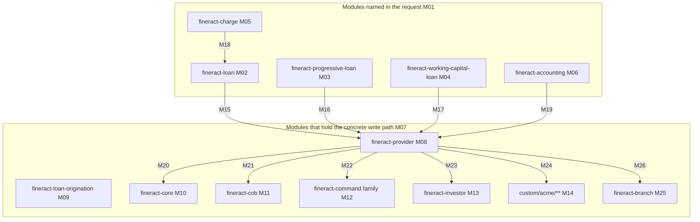

# Lending Reconstruction Candidate Selection

## 1. Purpose and run scope

This report is a read-only static-analysis **candidate-selection** report over the Apache Fineract lending domain. It measures a comparison set of lending-domain data elements and decisions under one normalized method, derives from those measurements a ranked shortlist of exactly three whose value-producing logic is maximally spread, deep, rule-dense and fully contained in the ingested code, disposes the two supplied hypotheses, and names exactly one recommended candidate for a later reconstruction run.

**Reconstruction is out of scope for this run.** No business logic is reconstructed, re-derived or expressed as pseudocode here. The report selects a target and hands the evidence to the downstream run.

- **Run result: PASS.** [CONFIRMED] Thirteen candidates were formed and measured; ten qualified against the five floors of §2.3; three were shortlisted; one recommendation was made.
- **Analysed commit** [CONFIRMED] `git rev-parse HEAD` = `74099701987ccb4755706d9a3de9fbbd3576ea1b`, branch `blitzy-b759d439-0dcc-4363-9233-9c64b56d58de`.
- **Project version** [CONFIRMED] `build.gradle` (L144) `version = '0.0.0-SNAPSHOT'`.
- **Generated** [CONFIRMED] 2026-09-08 (ISO-8601), the date observed as `date -u +%Y-%m-%d` while the report was being written. The generated date is stated separately from the analysed commit because the two can diverge: re-running the method of §2 against a newer commit is the only way to refresh this report.
- **Ownership posture.** This is a one-run artefact produced for the downstream reconstruction run. It has no standing maintainer and no update cadence. Every figure in it is a measurement of the analysed commit, and every citation is a repository-relative path that resolves against that commit.

### 1.1 Write proof

The run held a read-only posture over the analysed code and proved it with a content-level baseline comparison taken before any work and repeated after all other steps.

- Precondition: [CONFIRMED] `git status --porcelain=v1 --untracked-files=all` printed nothing before any work started; `git ls-files | wc -l` reported 8121 tracked files.
- Baseline and final manifests: [CONFIRMED] three artefacts were captured before any work and re-captured after every other step — `git rev-parse HEAD`, a SHA-256 manifest of every file under the working tree with `.git` pruned, and a SHA-256 of the `git ls-files --stage` index listing. Throughout the analysis the HEAD comparison and the index comparison are byte-identical, `cmp` exiting 0 on both, which proves that across every measurement step nothing was staged and nothing was committed; the proof was taken for the last time on the exact bytes of this file, immediately before it was committed as this run's single delivery commit. The tree manifest holds 8121 well-formed records at baseline and 8122 at the end, every record matching the `<64 hex digits><two spaces><path>` form. Compared under a single byte collation — `LC_ALL=C` for both `sort` and `comm`, with `sort -c` confirming each side sorted — 8121 records are byte-identical, **zero** records appear only in the baseline, and **exactly one** record appears only at the end: this report. Zero records only in the baseline is the strong half of that result, because it means no pre-existing file was altered or removed, not merely that none went missing.
- Comparison discipline, disclosed: [CONFIRMED] an earlier comparison of these same two manifests mixed collations between the sorting step and the comparing step and reported a spurious shortfall of matching records. The manifests were then re-verified well-formed and re-compared under one byte collation — `LC_ALL=C sort` on each side, `sort -c` confirming each side sorted, and `comm -12`, `comm -23` and `comm -13` supplying the three figures above. Those figures are the byte-collated ones, and they agree with every independent check in the bullet below.
- Git's own verdict on the analysis, independent of the manifests: [CONFIRMED] for the whole run up to the delivery commit described in the next bullet, `git status --porcelain=v1 --untracked-files=all` lists exactly one entry, `?? lending-reconstruction-candidate-selection.md`; the same command with `--ignored` adds nothing; `git diff HEAD`, `git diff --cached` and `git diff-index HEAD` are all empty, the last exiting 0 after an index refresh; and `git ls-files -m` reports zero modified files. The only untracked path in the checkout, of any kind, is one Markdown file.
- The delivery commit, stated so the proof remains checkable after it: [CONFIRMED] this report is committed by one commit whose `git diff --name-status HEAD~1 HEAD` is the single line `A lending-reconstruction-candidate-selection.md`, whose `git show --stat` reports one file changed with insertions only and no deletions, and after which `git status --porcelain=v1 --untracked-files=all` is empty. HEAD therefore advances by exactly that one commit over the analysed commit named above, and no other path appears in it. Anyone re-checking this report should compare against the analysed commit, which every citation in it resolves against.
- [CONFIRMED] **Result: zero existing files modified, zero code generated anywhere, one documentation file added.** A bounded `find` over the working tree with `.git` pruned, searching for directories named `.gradle`, `build`, `node_modules`, `dist`, `target` or `__pycache__`, returns none, and no script or program was authored in or outside the checkout — every check in this sub-section is an interactive read-only command whose output was redirected to a data file outside the repository. The Gradle build, the test tasks, the Apache RAT task and the Asciidoctor and OpenAPI documentation tasks were never run against the checkout, because each of them writes into it.
- [CONFIRMED] One incidental observation, stated so that a reader repeating the directory scan is not surprised by it: the checkout carries two empty directories, `blitzy/screenshots` and `blitzy/screen_recordings`, provisioned when the working tree was created and timestamped before the baseline was taken. `find blitzy -type f` returns zero at any depth, `stat` dates the directory earlier than the baseline capture, and they are invisible to `git status` because Git does not track empty directories — which is also why they are absent from both tree manifests, each of which lists files only. Neither this run nor its validation wrote anything into them.
- **Location deviation, disclosed.** The governing plan placed this report outside the checkout. That location is not addressable by the pipeline's file tooling, which accepts repository-relative paths only, so the report was written at the repository root with the plan's exact basename preserved. The guarantee the outside-the-checkout location was chosen to provide — that no analysed code is written — is preserved in full by the proof above, and the report's content is location-independent because every citation is a repository-relative path. A root Markdown file is also licence-gate neutral: the Apache RAT task excludes `**/*.md` [CONFIRMED] `build.gradle` (L302) and `.atr-rat-excludes-src.txt` (L42).

## 2. Method

### 2.1 Module mapping

The five modules named in the request are all declared in the Gradle settings, each cited to its own declaration line in the evidence table beneath the diagram (claims M01 to M26), but the lending logic is split between them and `fineract-provider`, which the request offered as a possible actual structure. That structure is **confirmed**: the concrete loan write services, the accounting processors for loans and the transaction-processor bean wiring all live in `fineract-provider`, while the domain entities, the classic transaction processors, the schedule-date generator and the validators live in `fineract-loan`. Two further modules the request did not name participate and are mapped here because measured chains cross into them: `fineract-progressive-loan` (the advanced allocation strategy and the progressive schedule generator), `fineract-loan-origination`, `fineract-core` (money, holiday, working-day and SQL-dialect utilities), `fineract-cob` (the close-of-business step framework), the `fineract-command` family (the typed command pipeline), `fineract-investor` (one close-of-business step), `fineract-branch` (the cashier gate on the disbursement path) and the dynamically included `custom/acme/**` tree.

| M-ID and claim | Evidence |
|---|---|
| M01 the request's five module names are all declared modules | [CONFIRMED] `settings.gradle` (L60, L66, L69, L82, L84) |
| M02 `fineract-loan` holds the loan domain entities, the nine classic transaction processors, the schedule-date generator and the down-payment handler service | [CONFIRMED] `fineract-loan/src/main/java/org/apache/fineract/portfolio/loanaccount/domain/LoanTransaction.java:LoanTransaction#updateComponents (L570-L574)`, declared at `settings.gradle` (L69) |
| M03 `fineract-progressive-loan` holds the advanced allocation strategy and the progressive schedule generator | [CONFIRMED] `fineract-progressive-loan/src/main/java/org/apache/fineract/portfolio/loanaccount/domain/transactionprocessor/impl/AdvancedPaymentScheduleTransactionProcessor.java:AdvancedPaymentScheduleTransactionProcessor (L134-L137)`, declared at `settings.gradle` (L82) |
| M04 `fineract-working-capital-loan` holds its own repayment, allocation and amortisation chain | [CONFIRMED] `fineract-working-capital-loan/src/main/java/org/apache/fineract/portfolio/workingcapitalloan/service/WorkingCapitalLoanPaymentAllocationProcessor.java:WorkingCapitalLoanPaymentAllocationProcessor#plan (L48-L90)`, declared at `settings.gradle` (L84) |
| M05 `fineract-charge` holds the charge definition entity only; the charge time types the disbursement path reads live in `fineract-core` | [CONFIRMED] declared at `settings.gradle` (L66); the time-type constants are read at `fineract-provider/src/main/java/org/apache/fineract/portfolio/loanaccount/service/LoanDisbursementService.java:LoanDisbursementService#handleDisbursementTransaction (L239, L242-L243)` |
| M06 `fineract-accounting` holds the accounting interfaces and read services; the loan journal-entry processors are in `fineract-provider` | [CONFIRMED] `fineract-accounting/src/main/java/org/apache/fineract/accounting/provisioning/service/ProvisioningEntriesReadPlatformServiceImpl.java:ProvisioningEntriesReadPlatformServiceImpl#retrieveLoanProductsProvisioningData (L56-L62)`, declared at `settings.gradle` (L60) |
| M07, M08 `fineract-provider` holds the concrete loan write service, the loan domain service, the accounting processors for loans and the transaction-processor bean wiring — the structure the request offered as a possibility, confirmed | [CONFIRMED] `fineract-provider/src/main/java/org/apache/fineract/portfolio/loanaccount/service/LoanWritePlatformServiceJpaRepositoryImpl.java:LoanWritePlatformServiceJpaRepositoryImpl#disburseLoan (L325-L326)` and `fineract-provider/src/main/java/org/apache/fineract/portfolio/loanaccount/starter/LoanAccountAutoStarter.java:LoanAccountAutoStarter (L50-L148)`, declared at `settings.gradle` (L61) |
| M09 `fineract-loan-origination` contributes seven command handlers to the lending entry universe | [CONFIRMED] declared at `settings.gradle` (L68); seven files carry `@CommandType` under `fineract-loan-origination/src/main/java` |
| M10 `fineract-core` supplies the money, holiday, working-day, charge-time-type and SQL-dialect utilities the measured chains reach | [CONFIRMED] `fineract-core/src/main/java/org/apache/fineract/infrastructure/core/service/database/DatabaseSpecificSQLGenerator.java:DatabaseSpecificSQLGenerator#dateDiff (L154-L162)` |
| M11 `fineract-cob` supplies the close-of-business step framework whose step membership is tenant-composed | [CONFIRMED] `fineract-cob/src/main/java/org/apache/fineract/cob/COBBusinessStepServiceImpl.java:COBBusinessStepServiceImpl#getCOBBusinessSteps (L99)` and `fineract-cob/src/main/java/org/apache/fineract/cob/domain/BatchBusinessStepRepository.java:BatchBusinessStepRepository#findAllByJobName (L28)` |
| M12 the `fineract-command` family supplies a second, typed command pipeline | [CONFIRMED] `fineract-command/src/main/java/org/apache/fineract/command/core/CommandHandler.java:CommandHandler#handle (L24-L26)`, family declared at `settings.gradle` (L54-L59) |
| M13 `fineract-investor` holds one lending close-of-business step, which the request's module list does not mention | [CONFIRMED] `fineract-investor/src/main/java/org/apache/fineract/investor/cob/loan/LoanAccountOwnerTransferBusinessStep.java:LoanAccountOwnerTransferBusinessStep`, module declared at `settings.gradle` (L64) |
| M14 the `custom/**` tree is included by a directory walk, not by a static include, and supplies one conditional transaction processor and one no-op close-of-business step | [CONFIRMED] `settings.gradle` (L86 static `:custom:docker`, L88 walk start, L94 dynamic include) and `custom/acme/loan/processor/src/main/java/com/acme/fineract/loan/processor/AcmeLoanRepaymentScheduleTransactionProcessor.java:AcmeLoanRepaymentScheduleTransactionProcessor (L27-L32)` |
| M15 `fineract-loan` command handlers call the write service implemented in `fineract-provider` | [CONFIRMED] `fineract-loan/src/main/java/org/apache/fineract/portfolio/loanaccount/handler/LoanRepaymentCommandHandler.java:LoanRepaymentCommandHandler#processCommand (L44-L48)` calling `fineract-loan/src/main/java/org/apache/fineract/portfolio/loanaccount/service/LoanWritePlatformService.java:LoanWritePlatformService (L37)` |
| M16 the progressive strategy is instantiated by the provider's bean wiring | [CONFIRMED] `fineract-provider/src/main/java/org/apache/fineract/portfolio/loanaccount/starter/LoanAccountAutoStarter.java:LoanAccountAutoStarter#advancedPaymentScheduleTransactionProcessor (L136-L147)` |
| M17 the working-capital chain is self-contained in its own module and reaches the provider only for accounting | [CONFIRMED] `fineract-working-capital-loan/src/main/java/org/apache/fineract/portfolio/workingcapitalloan/handler/RepaymentWorkingCapitalLoanCommandHandler.java:RepaymentWorkingCapitalLoanCommandHandler#processCommand (L39-L41)`; the GL helper it reaches is `fineract-provider/src/main/java/org/apache/fineract/accounting/journalentry/service/AccountingProcessorHelperImpl.java:AccountingProcessorHelperImpl#getLinkedGLAccountForWorkingCapitalLoanProduct (L1056-L1076)` |
| M18 the charge time types the loan path branches on are in `fineract-core`, not `fineract-charge` | [CONFIRMED] read at `fineract-provider/src/main/java/org/apache/fineract/portfolio/loanaccount/service/LoanDisbursementService.java:LoanDisbursementService#handleDisbursementTransaction (L239, L242-L243)` |
| M19 the loan journal-entry processors that the accounting interfaces abstract live in `fineract-provider` | [CONFIRMED] `fineract-provider/src/main/java/org/apache/fineract/accounting/journalentry/service/AccountingProcessorForLoanFactory.java:AccountingProcessorForLoanFactory#determineProcessor (L32-L48)` |
| M20 the provider chains reach `fineract-core` money and dialect utilities | [CONFIRMED] `fineract-core/src/main/java/org/apache/fineract/organisation/monetary/domain/Money.java:Money#percentageOf` read at `fineract-provider/src/main/java/org/apache/fineract/accounting/provisioning/service/ProvisioningEntriesWritePlatformServiceJpaRepositoryImpl.java:ProvisioningEntriesWritePlatformServiceJpaRepositoryImpl#generateLoanProvisioningEntry (L239)` |
| M21 the provider's lending close-of-business steps implement the `fineract-cob` contract | [CONFIRMED] `fineract-provider/src/main/java/org/apache/fineract/cob/loan/SetLoanDelinquencyTagsBusinessStep.java:SetLoanDelinquencyTagsBusinessStep#execute (L54-L82)` |
| M22 lending entities also reach the typed pipeline, for loan-product mix and loan collateral | [CONFIRMED] `fineract-provider/src/main/java/org/apache/fineract/portfolio/loanproduct/productmix/handler/ProductMixCreateCommandHandler.java:ProductMixCreateCommandHandler#handle (L42)` |
| M23 the investor step participates in the same close-of-business workflow as the provider's steps | [CONFIRMED] `fineract-investor/src/main/java/org/apache/fineract/investor/cob/loan/LoanAccountOwnerTransferBusinessStep.java:LoanAccountOwnerTransferBusinessStep` implements the `fineract-cob` step contract |
| M25 `fineract-branch` holds the cashier validator that the disbursement path calls when the payment type is a cash payment type; the request's module list does not mention it | [CONFIRMED] `fineract-branch/src/main/java/org/apache/fineract/organisation/teller/data/CashierTransactionDataValidator.java:CashierTransactionDataValidator#validateOnLoanDisbursal (L111)` |
| M26 the provider's disbursement path crosses into `fineract-branch` for that gate, and into `fineract-core` for the payment-detail write service | [CONFIRMED] called at `fineract-provider/src/main/java/org/apache/fineract/portfolio/loanaccount/service/LoanWritePlatformServiceJpaRepositoryImpl.java:LoanWritePlatformServiceJpaRepositoryImpl#disburseLoan (L364)`; the payment-detail service is `fineract-core/src/main/java/org/apache/fineract/portfolio/paymentdetail/service/PaymentDetailWritePlatformServiceJpaRepositoryImpl.java:PaymentDetailWritePlatformServiceJpaRepositoryImpl#createAndPersistPaymentDetail (L61)` |
| M24 the ACME processor replaces the provider's processor factory when its property is set | [CONFIRMED] `custom/acme/loan/starter/src/main/java/com/acme/fineract/loan/starter/AcmeLoanAutoConfiguration.java:AcmeLoanAutoConfiguration#loanRepaymentScheduleTransactionProcessorFactory (L35-L40)` with `@ConditionalOnProperty("acme.loan.enabled")` (L32) |

### 2.2 Entry taxonomy and coverage

An **entry point** is any of five kinds, enumerated exhaustively before any candidate was scored:

- **E1** — a handler annotated `@CommandType`, with the annotation's entity and action constants resolved to their string values, in `fineract-loan`, `fineract-progressive-loan`, `fineract-working-capital-loan`, `fineract-charge`, `fineract-accounting` and `fineract-loan-origination`, plus the `fineract-provider` packages `portfolio/loanaccount`, `accounting`, `portfolio/account` and `interoperation`.
- **E2** — an unannotated `NewCommandSourceHandler` implementation in the same modules, found by the `*CommandHandler` name convention.
- **E3** — a lending handler of the typed `fineract-command` pipeline, searched repository-wide so that coverage can only widen.
- **E4** — a direct service, API or bulk-import entry that writes lending state.
- **E5** — a batch entry: every `LoanCOBBusinessStep` implementation repository-wide, and every `*Tasklet` under `fineract-provider` that writes lending or lending-accounting state.

[CONFIRMED] Coverage measured over the analysed commit: **207 entry points — E1 160, E2 5, E3 4, E4 8, E5 30**, counted over the taxonomy above under the coverage-figure rule of §2.6. The E1 total decomposes as 71 files under `fineract-loan/src/main/java`, 4 under `fineract-progressive-loan/src/main/java`, 35 under `fineract-working-capital-loan/src/main/java`, 3 under `fineract-charge/src/main/java`, 13 under `fineract-accounting/src/main/java`, 7 under `fineract-loan-origination/src/main/java` and 27 across the four named `fineract-provider` packages (`portfolio/loanaccount` 7, `accounting` 7, `portfolio/account` 6, `interoperation` 7 — the three-package figure without `interoperation` is 20). The E5 total decomposes as 13 close-of-business steps, the 8 tasklets under `fineract-provider/src/main/java/org/apache/fineract/portfolio/loanaccount/jobs`, and 9 further lending or lending-accounting tasklets out of the 36 `*Tasklet` files under `fineract-provider/src/main/java`; the 19 excluded tasklets write savings, share, campaign, messaging, dirty-job or business-date state only. Every entry point is a row of a discovery ledger kept outside this report; completeness was checked by set comparison of the ledger's path column against the bounded enumeration for each entry class, empty in both directions, and every ledger path was confirmed to exist on disk.

**Candidate-boundary rule**, fixed before discovery and applied to every entry point. Each entry point's business-real outputs were listed — zero, one or several. Approvals, rejections, write-offs, charge-offs, charge application and accrual are outputs like any other, and a stable returned business decision counts even where it is not persisted. Outputs were then grouped into candidates of two types:

- **Value candidate** — a single computed monetary or classification value. Its boundary is the units that compute the value plus its immediate persistence on the aggregate. Journal entries, business events, delinquency tags and transfers that consume the value are outside the boundary and are listed as such. Two outputs that are the same computed value on the same fields of the same aggregates are one candidate even when reached from different entry points; this is why the write-off, charge-off, chargeback and refund component splits are entries to the repayment-split candidate rather than candidates of their own, and why rescheduling, re-ageing, holiday shifting and interest recalculation are entries to the installment-amount candidate.
- **Transition candidate** — a state transition the request's own wording defines as spanning several modules in one transaction. Its boundary is every output written inside that transaction, including the accounting, transfer and event legs.

The type is fixed by the request's wording where the request names the outcome: H1 is a value candidate, H2 is a transition candidate. Every other candidate is a value candidate unless an entry point's own contract — a single transactional method writing several aggregates — makes it a transition, in which case the type and the reason are stated. The type appears in the comparison table so that every score is read together with its boundary.

[CONFIRMED] Of the 207 entry points, 125 write at least one business-real computed lending value and map onto the 13 candidates of §4; the remaining 82 write reference or product configuration, a status transition or a flag with no computed monetary or classification value, and are recorded with their outputs and no candidate.

### 2.3 Path policy, counting rules and ranking rule

**Path policy.** For each candidate exactly one **measured path** is selected deterministically: start from the entry point whose direct chain to the outcome is deepest; at every branch point that depends on product configuration, transaction attributes, runtime state or a selectable implementation, take the alternative that leads to the deepest fully contained continuation to the outcome. Alternatives are traced only until they rejoin the path, terminate, or exceed the current best depth, and only alternatives that can change an output, a score or the containment verdict are traced and listed. Equal-depth contained alternatives are broken by higher spread, then higher rule density, then the lexicographically smaller path label. A candidate whose containment verdict is FAIL is measured on its deepest path rather than its deepest contained path. Every branch point on the measured path appears in that candidate's branch table with each alternative's added units, whether it can change an output, a score or the verdict, its containment reads and their categories, and its disposition; the branch table is the stopping proof. A candidate's scope is never narrowed after evidence is seen — a narrower candidate must be declared up front, which is exactly why C-A′ exists.

**Participating unit.** One method on one class, written `Class#method`. An interface method and its implementation are one unit, named by the implementation. Overloads are distinct units. A lambda or private helper is a unit only where it transforms or gates the value; otherwise it is folded into its caller.

**Hop.** One call edge from unit A to unit B where B transforms, gates or contributes to an output inside the candidate's boundary. An edge is counted once per path however many loop iterations or repeated calls traverse it. Crossing a class, module or layer boundary adds no extra hop — the edge is the hop. A factory or lookup that returns the unit to call next is a counted edge into the factory, and the caller's subsequent call into the returned unit is a separate edge from the caller.

**Not counted:** repository loads and saves, DTO construction, logging, pass-through getters and mappers, and configuration reads that do not alter the value. **Counted:** arithmetic helpers such as `Money#minus`, `Money#plus`, `Money#percentageOf` and `MathUtil` methods where they compute an output inside the boundary; otherwise they are folded into their caller. Trivial stateless comparison predicates — `MathUtil#isGreaterThanZero`, `MathUtil#isEmpty`, `DateUtils#isBefore` and their siblings — are folded into their caller: they compute no output and stop no transaction, and the branch each one serves is already counted once in R. Each candidate's traversed-not-counted table lists only those units whose treatment could change a hop, a score, a containment verdict or a reader's reading of the chain.

**Depth D.** For a value candidate, the number of counted edges on the measured path from the entry unit to the production of the value. For a transition candidate, the number of counted edges traversed to reach each terminal output of the outcome is measured and D is the maximum, with every per-terminal depth listed. The **direct-chain length** — the number of edges on the longest straight, gate-free call chain on the measured path, from the entry unit down to the most deeply nested contributing unit — is stated alongside D so that the two are never confused. D therefore measures how much of the chain a reconstruction has to rebuild; the direct-chain length measures how deep the deepest single stack of that chain is.

**Layer taxonomy**, fixed, one layer per unit, shown per unit in each spread table; where a package rule and a name rule both match, the package rule wins. **Entry**: `*CommandHandler`, `*Tasklet`, `*BusinessStep`, bulk-import handlers, `InteropServiceImpl`. **Service**: `*WritePlatformService*`, `*Service*`, `*Assembler*`, `*Validator*` and `*Poster*` classes in `service`, `serialization` or `api` packages of `fineract-loan`, `fineract-progressive-loan`, `fineract-working-capital-loan`, `fineract-loan-origination`, `fineract-charge` and the `fineract-provider` `portfolio.*` packages. **Domain**: `domain` packages, including the transaction processors, the schedule generators, `LoanApplicationTerms` and the entities. **Accounting**: `org.apache.fineract.accounting.*` in any module. **Events**: `BusinessEventNotifierService` calls and `*BusinessEvent` construction. **Batch**: `org.apache.fineract.cob.*` and `*jobs*` packages. **Core**: `fineract-core` utilities.

Two mechanical additions keep the taxonomy total, and both are applied to every candidate. The **Core** rule takes precedence over the **Domain** package rule for the shared `fineract-core` utility classes — `Money`, `MathUtil`, `WorkingDaysUtil`, `HolidayUtil` and `DatabaseSpecificSQLGenerator` — because they are platform arithmetic rather than lending domain; a `fineract-core` class that is a write service rather than a utility is Service. Where a unit's module or package is named by none of the rules, a **residual role rule** decides: a `*WritePlatformService*`, `*Service*`, `*Validator*`, `*Assembler*`, `*Mapper*` or `*Helper*` class that transforms or gates is Service; a calculator or schedule generator is Domain; a class in a `domain` package is Domain.

**Boundary crossings between candidates.** A third classification refinement, disclosed here and applied uniformly. Where one candidate's chain invokes the production point of a *different* measured candidate in order to derive a different value, that invocation is a **boundary crossing**: the invoked chain's units are listed in this candidate's outside-the-boundary table, are not counted for S or D, and its external reads are not this candidate's reads. The test is which candidate's outcome the invoked chain produces, not which method is called — so the account-transfer service is inside the disbursement transition's boundary where it creates that transition's own disbursement transaction, and outside it where it settles another loan account or allocates a down-payment repayment across principal, interest, fees and penalties, which is the repayment-split candidate's outcome. Without this rule every candidate that can touch a progressive loan would inherit the persisted allocation ordering of a different candidate's production point, and the containment verdict would stop measuring the candidate in front of it. For a transition candidate the terminal outputs of the outcome are enumerated up front, and the measured path is the traversal that reaches those terminals; a leg inside the boundary but off that traversal still contributes to R and to K.

**Spread S** = (distinct classes in the measured path's execution tree) + (distinct ordered layer pairs crossed by counted edges) + (distinct ordered module pairs crossed by counted edges). All three components are shown. Return crossings are not counted and a pair is counted once however many edges cross it. The distinct-method count is reported as detail.

**Rule density R**, measured over one scope — the deduplicated union of the measured path and every branch alternative inside the candidate's boundary — is the sum of four addends, each shown: selectable implementations at each factory reached, flagged built-in or custom; enum constants read to govern a branch, with `INVALID` placeholders excluded and each enum counted once; validation gates that can stop the value; and product or configuration boolean branches, each flag once.

**Containment K.** Every external read on the measured path and on every in-boundary branch alternative is classified as **OPERAND** (data the code interprets with logic that is itself in code — amounts, dates, day thresholds, GL account mappings, holiday and working-day rows, product flags and enum selections that choose among code-defined branches or implementations, and runtime selection among code-defined SQL dialects), **OPERATIVE-CONFIG** (configuration whose content supplies the algorithm's ordering, composition or rule set rather than selecting one code-defined implementation — a persisted ordered allocation list, a tenant-composed close-of-business step sequence, a stored formula), **IN-REPO-SQL** (query text explicit in the repository, dialect fragments included, with every input traced to an in-repository producer), **GENERATED-SQL**, **UNIMPLEMENTED** (a reachable branch whose body is a TODO, a no-op or a not-implemented exception) or **UNTRACED**. K is PASS only where every such read is OPERAND or IN-REPO-SQL; otherwise K is FAIL and the read is named.

Two classification refinements were necessary to apply the UNIMPLEMENTED category consistently, and both are disclosed here and applied uniformly to every candidate. First, a branch whose body **throws** terminates the transaction without producing a value, so nothing about the value-producing logic is missing from the repository; such a branch is treated as a **validation gate** and counts towards R, not as UNIMPLEMENTED. A branch whose body is a TODO or a no-op that lets execution continue and yield a value or an unmodified value **is** UNIMPLEMENTED. Second, UNIMPLEMENTED requires the branch to be reachable, which is established from the validators that admit the governing value, not assumed from the branch's presence.

**Qualification floors.** A candidate qualifies only where all five hold: the outcome is a business-real value; S shows at least 3 distinct layers and at least 5 distinct classes; D is at least 5 counted hops; R is at least 5; and K is PASS.

**Ranking rule.** Among qualifying candidates, competition ranks are assigned on S, on D and on R, with 1 the highest, equal values sharing a rank and the next rank skipped. The aggregate is the sum of the three ranks and the lowest aggregate ranks first. Ties are broken by higher D, then higher S, then higher R, then the producer-file ordering key, then the candidate identifier, and the tie-break actually applied is recorded. A candidate whose K is FAIL is measured, its scores shown for information, marked non-qualifying, and never ranked. Where fewer than three candidates qualify the run reports FAIL and makes no recommendation.

**Recommendation rule.** Applied to the three shortlisted candidates only: the one with the greatest D whose containment verdict is PASS; where two or more share the greatest D, the one with the higher shortlist rank. Every shortlisted candidate is PASS by qualification, so the rule always yields exactly one. The rule governs only the final pick and never alters the shortlist order.

### 2.4 Hop definition

One hop is counted for each traversal between distinct code units — method to method, class to class, or layer to layer — where the unit transforms, gates, or contributes to the target value. Configuration reads and pass-through getters that do not alter the value are not hops.

### 2.5 Legend

- **[CONFIRMED]** — the author opened the cited unit at the analysed commit and read the fact being asserted: that the file exists, that the method has that signature at those lines, that the call edge is present at that call site, that the count is the number of declarations read, or that the layer assignment follows from the package and role rules of §2.3.
- **[INFERRED]** — the author did not settle the statement by reading a unit. It is reserved for reachability judgements the code read did not settle and for effort estimates, and is never used for existence, location, a signature, a count, a layer assignment or a call edge.

### 2.6 Citation format and claim-ID scheme

Every structural claim carries a tag and a citation, or a claim identifier that resolves locally. Every citation is a full repository-relative path: "same file", bare file names, wildcards and directory paths are not citations, and root-level files are cited by their bare root name plus a locator.

| Claim type | Pattern |
|---|---|
| A unit exists, produces, gates or calls | `[CONFIRMED] <full path>:Class#method (L<n>-L<m>)` |
| A property or manifest fact | `[CONFIRMED] <full path> (key <name>, L<n>), read by <full path>:Class#method (L<n>-L<m>)`; module declarations cite `settings.gradle (L<n>)` |
| An enum or registration count | the constants span with `INVALID excluded`, or the registering class with its line span |
| A documentation fact | `[CONFIRMED] <full path> (heading "<text>", L<n>)` |
| An environment fact | the observed command output, or `build.gradle (L144) version 0.0.0-SNAPSHOT` |
| A chain-diagram node | the label ends with its `<candidate>-u<nn>` identifier, resolved as the first cell of that unit's row in the spread table of the same ranked-candidate section |
| A chain-diagram edge | the label is the `<candidate>-h<nn>` hop identifier resolved in the hop table of the same section; a dashed edge to a unit outside the boundary carries `<candidate>-x<nn>`, resolved in that section's outside-the-boundary table |
| A traversed-but-not-counted unit | the identifier `<candidate>-n<nn>`, resolved in that section's traversed-not-counted table; such units are never diagram nodes, because no counted edge reaches them |
| A module-map node or edge | the label `M<nn>`, resolved in the evidence table directly beneath the §2.1 diagram |
| A "Rank n" heading | a structural claim validated against the §4 tables — same identifier at the same rank — rather than by an inline citation |
| A derived score in §4 | not an independent assertion about the code but a count taken under the definitions of §2.3 over one named chain, so the row carries `[CONFIRMED]` with the full-path entry and production-point citations that define that chain, and its depth cell names the measured path the count belongs to; for a shortlisted candidate every unit and every edge behind the figure additionally carries its own tagged, fully cited row in §5, §6 or §7 |
| A row keyed by a candidate identifier | the identifier `C-<letter>` is itself the claim identifier: it resolves as the first cell of that candidate's row in table 4a, which carries the tag and the entry and production-point citations. Table 4b and the disposition table of §8 are keyed this way, so a score restated there is not a second uncited assertion |
| A count or classification restated in prose inside a ranked section, or in §8, §9 or §10 | the same rule as a derived score: the distinct-count, D, per-terminal-depth, R-addend and K-tally statements of §5, §6 and §7, and the read groups classified in each containment sub-section, are counts and classifications over that section's own rows, every one of which carries its own tag and full-path citation. Each such statement is marked `[CONFIRMED]` and is checked against those rows, not against a separate citation of its own |

| A coverage figure in §2.2, or the candidate count in §2.2 and §4 | a count over the E1–E5 taxonomy applied to the module source roots named in §2.2, taken at the analysed commit. The per-entry-point ledger behind it is deliberately outside this report, because reproducing it would be the per-file inventory the output form forbids, so the figure carries `[CONFIRMED]` and cites its enumeration basis — the taxonomy and the module roots — rather than a single unit. §2.2 decomposes each total so that the basis of every component is stated |

Claim identifiers resolve within the enclosing ranked-candidate section, or, for `M` identifiers, within §2.1.

## 3. Symbol verification

[CONFIRMED] The request supplied three symbols and one count as hypotheses. All four were verified against the analysed commit; one symbol does not exist and the count needed splitting into two figures.

**`LoanRepayment` does not exist.** [CONFIRMED] no file named `LoanRepayment.java` exists anywhere in the repository. The repayment command path is `LoanRepaymentCommandHandler#processCommand` [CONFIRMED] `fineract-loan/src/main/java/org/apache/fineract/portfolio/loanaccount/handler/LoanRepaymentCommandHandler.java:LoanRepaymentCommandHandler#processCommand (L44-L48)`, annotated `@CommandType(entity = "LOAN", action = "REPAYMENT")` (L36), calling `LoanWritePlatformServiceJpaRepositoryImpl#makeLoanRepayment` [CONFIRMED] `fineract-provider/src/main/java/org/apache/fineract/portfolio/loanaccount/service/LoanWritePlatformServiceJpaRepositoryImpl.java:LoanWritePlatformServiceJpaRepositoryImpl#makeLoanRepayment (L980-L985)`, which delegates to `#makeLoanRepaymentWithChargeRefundChargeType` [CONFIRMED] the same file `:LoanWritePlatformServiceJpaRepositoryImpl#makeLoanRepaymentWithChargeRefundChargeType (L1119-L1120)` and thence to `LoanAccountDomainServiceJpa#makeRepayment` [CONFIRMED] `fineract-provider/src/main/java/org/apache/fineract/portfolio/loanaccount/domain/LoanAccountDomainServiceJpa.java:LoanAccountDomainServiceJpa#makeRepayment (L216-L219)`, which creates the transaction with `LoanTransaction#repaymentType` [CONFIRMED] `fineract-loan/src/main/java/org/apache/fineract/portfolio/loanaccount/domain/LoanTransaction.java:LoanTransaction#repaymentType (L198)` at the call site `fineract-provider/src/main/java/org/apache/fineract/portfolio/loanaccount/domain/LoanAccountDomainServiceJpa.java:LoanAccountDomainServiceJpa#makeRepayment (L241-L242)`. The processor abstraction the request meant is `LoanRepaymentScheduleTransactionProcessor` [CONFIRMED] `fineract-loan/src/main/java/org/apache/fineract/portfolio/loanaccount/domain/transactionprocessor/LoanRepaymentScheduleTransactionProcessor.java:LoanRepaymentScheduleTransactionProcessor`. The sibling factory method `LoanTransaction#repayment` [CONFIRMED] `fineract-loan/src/main/java/org/apache/fineract/portfolio/loanaccount/domain/LoanTransaction.java:LoanTransaction#repayment (L185)` is **not** on the repayment command path; it is called by the foreclosure payoff [CONFIRMED] `fineract-provider/src/main/java/org/apache/fineract/portfolio/loanaccount/domain/LoanAccountDomainServiceJpa.java:LoanAccountDomainServiceJpa#foreCloseLoan (L703, call site L731)`.

**The three `disburseLoan` signatures**, all on [CONFIRMED] `fineract-provider/src/main/java/org/apache/fineract/portfolio/loanaccount/service/LoanWritePlatformServiceJpaRepositoryImpl.java:LoanWritePlatformServiceJpaRepositoryImpl (L1-L60 for the class declaration)` in **`fineract-provider`**, reproduced in full with their annotations, visibility, return types and parameter names:

- `@Override` (L318) `public CommandProcessingResult disburseLoan(Long loanId, JsonCommand command, Boolean isAccountTransfer)` [CONFIRMED] `fineract-provider/src/main/java/org/apache/fineract/portfolio/loanaccount/service/LoanWritePlatformServiceJpaRepositoryImpl.java:LoanWritePlatformServiceJpaRepositoryImpl#disburseLoan (L319-L321)`, delegating to the four-argument overload at L320.
- `@Transactional` (L323) `@Override` (L324) `public CommandProcessingResult disburseLoan(final Long loanId, final JsonCommand command, Boolean isAccountTransfer, Boolean isWithoutAutoPayment)` [CONFIRMED] the same file `:LoanWritePlatformServiceJpaRepositoryImpl#disburseLoan (L325-L326)`.
- `private void disburseLoan(JsonCommand command, boolean isPaymentTypeApplicableForDisbursementCharge, PaymentDetail paymentDetail, Loan loan, AppUser currentUser, Map<String, Object> changes, ScheduleGeneratorDTO scheduleGeneratorDTO)` [CONFIRMED] the same file `:LoanWritePlatformServiceJpaRepositoryImpl#disburseLoan (L571-L572)`.

The two public overloads are declared on the interface in **`fineract-loan`** [CONFIRMED] `fineract-loan/src/main/java/org/apache/fineract/portfolio/loanaccount/service/LoanWritePlatformService.java:LoanWritePlatformService (L37)`, three-argument at L39 and four-argument at L41.

**Processor count: 10 built-in, 11 repository-wide.** The two figures are different measurements and are never merged. The ten built-in processors are registered as conditional beans in one configuration class [CONFIRMED] `fineract-provider/src/main/java/org/apache/fineract/portfolio/loanaccount/starter/LoanAccountAutoStarter.java:LoanAccountAutoStarter (L50-L148)`. That class carries eleven bean methods, at L52, L60, L68, L76, L84, L93, L102, L110, L119, L128 and L136, but the one at L128 is the **processor factory**, not a processor [CONFIRMED] the same file `:LoanAccountAutoStarter#loanRepaymentScheduleTransactionProcessorFactory (L128-L134)` with `@ConditionalOnMissingBean(LoanRepaymentScheduleTransactionProcessorFactory.class)` at L129; a naive bean count therefore yields eleven built-in processors and is wrong. The remaining ten bean methods each pair with a `@Conditional` and each returns one processor whose strategy code is:

| Strategy code | `STRATEGY_CODE` constant | Registration |
|---|---|---|
| `creocore-strategy` | [CONFIRMED] `fineract-loan/src/main/java/org/apache/fineract/portfolio/loanaccount/domain/transactionprocessor/impl/CreocoreLoanRepaymentScheduleTransactionProcessor.java:CreocoreLoanRepaymentScheduleTransactionProcessor (L48)` | [CONFIRMED] `fineract-provider/src/main/java/org/apache/fineract/portfolio/loanaccount/starter/LoanAccountAutoStarter.java:LoanAccountAutoStarter#creocoreLoanRepaymentScheduleTransactionProcessor (L52-L58)` |
| `early-repayment-strategy` | [CONFIRMED] `fineract-loan/src/main/java/org/apache/fineract/portfolio/loanaccount/domain/transactionprocessor/impl/EarlyPaymentLoanRepaymentScheduleTransactionProcessor.java:EarlyPaymentLoanRepaymentScheduleTransactionProcessor (L42)` | [CONFIRMED] the same starter `:LoanAccountAutoStarter#earlyPaymentLoanRepaymentScheduleTransactionProcessor (L60-L66)` |
| `mifos-standard-strategy` | [CONFIRMED] `fineract-loan/src/main/java/org/apache/fineract/portfolio/loanaccount/domain/transactionprocessor/impl/FineractStyleLoanRepaymentScheduleTransactionProcessor.java:FineractStyleLoanRepaymentScheduleTransactionProcessor (L48)` | [CONFIRMED] the same starter `:LoanAccountAutoStarter#fineractStyleLoanRepaymentScheduleTransactionProcessor (L68-L74)` |
| `heavensfamily-strategy` | [CONFIRMED] `fineract-loan/src/main/java/org/apache/fineract/portfolio/loanaccount/domain/transactionprocessor/impl/HeavensFamilyLoanRepaymentScheduleTransactionProcessor.java:HeavensFamilyLoanRepaymentScheduleTransactionProcessor (L50)` | [CONFIRMED] the same starter `:LoanAccountAutoStarter#heavensFamilyLoanRepaymentScheduleTransactionProcessor (L76-L82)` |
| `interest-principal-penalties-fees-order-strategy` | [CONFIRMED] `fineract-loan/src/main/java/org/apache/fineract/portfolio/loanaccount/domain/transactionprocessor/impl/InterestPrincipalPenaltyFeesOrderLoanRepaymentScheduleTransactionProcessor.java:InterestPrincipalPenaltyFeesOrderLoanRepaymentScheduleTransactionProcessor (L43)` | [CONFIRMED] the same starter `:LoanAccountAutoStarter#interestPrincipalPenaltyFeesOrderLoanRepaymentScheduleTransactionProcessor (L84-L91)` |
| `principal-interest-penalties-fees-order-strategy` | [CONFIRMED] `fineract-loan/src/main/java/org/apache/fineract/portfolio/loanaccount/domain/transactionprocessor/impl/PrincipalInterestPenaltyFeesOrderLoanRepaymentScheduleTransactionProcessor.java:PrincipalInterestPenaltyFeesOrderLoanRepaymentScheduleTransactionProcessor (L43)` | [CONFIRMED] the same starter `:LoanAccountAutoStarter#principalInterestPenaltyFeesOrderLoanRepaymentScheduleTransactionProcessor (L93-L100)` |
| `rbi-india-strategy` | [CONFIRMED] `fineract-loan/src/main/java/org/apache/fineract/portfolio/loanaccount/domain/transactionprocessor/impl/RBILoanRepaymentScheduleTransactionProcessor.java:RBILoanRepaymentScheduleTransactionProcessor (L52)` | [CONFIRMED] the same starter `:LoanAccountAutoStarter#rbiLoanRepaymentScheduleTransactionProcessor (L102-L108)` |
| `due-penalty-fee-interest-principal-in-advance-principal-penalty-fee-interest-strategy` | [CONFIRMED] `fineract-loan/src/main/java/org/apache/fineract/portfolio/loanaccount/domain/transactionprocessor/impl/DuePenFeeIntPriInAdvancePriPenFeeIntLoanRepaymentScheduleTransactionProcessor.java:DuePenFeeIntPriInAdvancePriPenFeeIntLoanRepaymentScheduleTransactionProcessor (L49)` | [CONFIRMED] the same starter `:LoanAccountAutoStarter#duePenFeeIntPriInAdvancePriPenFeeIntLoanRepaymentScheduleTransactionProcessor (L110-L117)` |
| `due-penalty-interest-principal-fee-in-advance-penalty-interest-principal-fee-strategy` | [CONFIRMED] `fineract-loan/src/main/java/org/apache/fineract/portfolio/loanaccount/domain/transactionprocessor/impl/DuePenIntPriFeeInAdvancePenIntPriFeeLoanRepaymentScheduleTransactionProcessor.java:DuePenIntPriFeeInAdvancePenIntPriFeeLoanRepaymentScheduleTransactionProcessor (L49)` | [CONFIRMED] the same starter `:LoanAccountAutoStarter#duePenIntPriFeeInAdvancePenIntPriFeeLoanRepaymentScheduleTransactionProcessor (L119-L126)` |
| `advanced-payment-allocation-strategy` | [CONFIRMED] `fineract-progressive-loan/src/main/java/org/apache/fineract/portfolio/loanaccount/domain/transactionprocessor/impl/AdvancedPaymentScheduleTransactionProcessor.java:AdvancedPaymentScheduleTransactionProcessor (constant ADVANCED_PAYMENT_ALLOCATION_STRATEGY, L136; name L137; returned by #getCode L162-L165)` | [CONFIRMED] the same starter `:LoanAccountAutoStarter#advancedPaymentScheduleTransactionProcessor (L136-L147)` |

Each of the ten has an enabling property that defaults to `true` [CONFIRMED] `fineract-provider/src/main/resources/application.properties` (keys `fineract.loan.transactionprocessor.creocore.enabled` L182 through `fineract.loan.transactionprocessor.advanced-payment-strategy.enabled` L191) — exactly ten keys, which independently confirms the figure of ten.

The **eleventh** concrete implementation exists repository-wide and is never counted as built-in: `acme-standard-strategy` [CONFIRMED] `custom/acme/loan/processor/src/main/java/com/acme/fineract/loan/processor/AcmeLoanRepaymentScheduleTransactionProcessor.java:AcmeLoanRepaymentScheduleTransactionProcessor (STRATEGY_CODE L30, STRATEGY_NAME L32)`. It is invisible to an interface-level search because it extends a **concrete** processor rather than the abstract base [CONFIRMED] the same file `:AcmeLoanRepaymentScheduleTransactionProcessor (L27-L28)`, and it overrides only the code and the name [CONFIRMED] the same file `:AcmeLoanRepaymentScheduleTransactionProcessor#getCode (L39-L42)` and `:AcmeLoanRepaymentScheduleTransactionProcessor#getName (L44-L47)` — so the eleventh processor is a code-and-name alias of `mifos-standard-strategy`, not a distinct allocation algorithm. It is wired only when its property is set [CONFIRMED] `custom/acme/loan/starter/src/main/java/com/acme/fineract/loan/starter/AcmeLoanAutoConfiguration.java:AcmeLoanAutoConfiguration (L30-L33)` with `@ConditionalOnProperty("acme.loan.enabled")` at L32, and that same configuration replaces the processor factory bean [CONFIRMED] the same file `:AcmeLoanAutoConfiguration#loanRepaymentScheduleTransactionProcessorFactory (L35-L40)`.

**Selection and fallback.** A product's strategy code is matched case-insensitively against either the processor's code **or** its name [CONFIRMED] `fineract-loan/src/main/java/org/apache/fineract/portfolio/loanaccount/domain/transactionprocessor/AbstractLoanRepaymentScheduleTransactionProcessor.java:AbstractLoanRepaymentScheduleTransactionProcessor#accept (L85-L87)`. Where no processor matches, the factory throws only if the not-found flag is true, and otherwise returns the injected default [CONFIRMED] `fineract-loan/src/main/java/org/apache/fineract/portfolio/loanaccount/domain/LoanRepaymentScheduleTransactionProcessorFactory.java:LoanRepaymentScheduleTransactionProcessorFactory#determineProcessor (L39-L49)`, with the flag injected at L36-L37 from `fineract-provider/src/main/resources/application.properties` (key `fineract.loan.transactionprocessor.error-not-found-fail`, L192, default `true`). The default depends on which factory bean is active: `PrincipalInterestPenaltyFeesOrderLoanRepaymentScheduleTransactionProcessor` under the provider's factory [CONFIRMED] `fineract-provider/src/main/java/org/apache/fineract/portfolio/loanaccount/starter/LoanAccountAutoStarter.java:LoanAccountAutoStarter#loanRepaymentScheduleTransactionProcessorFactory (L128-L134, default parameter L131)`, or `AcmeLoanRepaymentScheduleTransactionProcessor` when the ACME property activates the replacement factory [CONFIRMED] `custom/acme/loan/starter/src/main/java/com/acme/fineract/loan/starter/AcmeLoanAutoConfiguration.java:AcmeLoanAutoConfiguration#loanRepaymentScheduleTransactionProcessorFactory (L35-L40, default parameter L37)`.

### 3.1 Documentation gaps this report closes

Two existing documents cover the transaction-processor area and neither traces a value from a command handler to its production point or counts hops. The processor document is also outdated: it states that Fineract has seven built-in loan transaction processors and lists seven [CONFIRMED] `fineract-doc/src/docs/en/chapters/custom/loan-transaction-processor.adoc` (L3, list L5-L11) against the ten registered above, and four of its source includes pin fixed line ranges that no longer match where those declarations sit [CONFIRMED] the same file (L16 `LoanAccountAutoStarter[lines=38..80]`, L24 `application.properties[lines=64..70]`, L99 `LoanAccountAutoStarter[lines=81..87]`, L113 `application.properties[lines=71..71]`) — the processor beans occupy L52-L147 and the properties L182-L192. The allocation document covers configuration, capabilities and allocation rules but no chain [CONFIRMED] `fineract-doc/src/docs/en/chapters/architecture/advanced-payment-allocation.adoc` (heading "Introducing Advanced payment allocation", L1; "Glossary", L13; "Capabilities", L29; "Configuration", L65; "New repayment strategy", L71; "Allocation rules", L76; "Future installment allocation rules:", L90; "High level design", L138). No inspected document maps the request's module names onto the physical split of §2.1, and none compares lending value chains on common criteria — which is precisely what a reconstruction run needs in order to choose its target.

## 4. Comparison set and scores

[CONFIRMED] Thirteen candidates were formed from the 207 entry points under the candidate-boundary rule of §2.2 — both counts resolving under the coverage-figure row of §2.6 — and every one of them was measured under the counting rules of §2.3 before any shortlist was derived. No candidate was screened out before measurement. The two tables below are the derivation of the ranks; the "Rank n" headings of §5, §6 and §7 are validated against them. Rows appear in shortlist order followed by the remaining candidates in the order they were measured; the rank cell of table 4b, not the row position, is what states each candidate's place. Every figure in both tables was counted on the candidate's own measured path, whose label is given in the depth cell, so no figure should be read as "the" size of a candidate independently of that path. Each row of table 4a therefore carries its own `[CONFIRMED]` tag with the entry and production-point citations that define the chain the counts were taken over, per the derived-score row of §2.6; for the three shortlisted candidates every unit and every edge behind those counts carries a further tagged and fully cited row in §5, §6 or §7. Table 4b is keyed by the candidate identifier, which resolves as the first cell of the same candidate's row in table 4a, so the two tables are one claim each rather than two.

**Table 4a — outcome, spread and depth.** S components are stated as classes + ordered layer pairs + ordered module pairs; the distinct-method count follows as detail.

| Candidate | Type and outcome | S (classes; layer pairs; module pairs; methods) | D (measured path; direct chain; per-terminal depths) |
|---|---|---|---|
| C-C disbursement transition (H2) | Transition — every output written inside the disbursement transaction: the disbursement transaction amount, the journal entries, the savings leg of the transfer, the regenerated schedule, the repayment-at-disbursement charge transaction, the loan state, the automatic down-payment transfer, the delinquency tag and the disbursement events. [CONFIRMED] entry `fineract-loan/src/main/java/org/apache/fineract/portfolio/loanaccount/handler/DisburseLoanToSavingsCommandHandler.java:DisburseLoanToSavingsCommandHandler#processCommand (L39-L41)` → primary production `fineract-loan/src/main/java/org/apache/fineract/portfolio/loanaccount/domain/LoanTransaction.java:LoanTransaction#disbursement (L172)` | 58 = 44 classes + 7 layer pairs + 7 module pairs; 121 methods | 131 on "DISBURSETOSAVINGS / transfer branch / progressive product / periodic-accrual accounting"; direct chain 15; per-terminal depths — disbursement transaction 25, journal entries 40, savings leg 41, schedule 87, charge transaction 99, loan state 107, down-payment transfer 115, delinquency tag 128, events 131 |
| C-B installment amounts from schedule generation | Value — the due principal, interest, fee and penalty amounts and the due dates of the repayment schedule's installments. [CONFIRMED] entry `fineract-loan/src/main/java/org/apache/fineract/portfolio/loanaccount/handler/LoanApplicationSubmittalCommandHandler.java:LoanApplicationSubmittalCommandHandler#processCommand (L39)` → production `fineract-loan/src/main/java/org/apache/fineract/portfolio/loanaccount/loanschedule/domain/LoanScheduleModelRepaymentPeriod.java:LoanScheduleModelRepaymentPeriod#addPrincipalAmount (L157)` | 28 = 18 classes + 4 layer pairs + 6 module pairs; 60 methods | 61 on "origination / progressive product / declining balance"; direct chain 13 |
| C-A′ repayment allocation split, nine classic built-in processors | Value — the four component portions of the repayment transaction, the paid portions of each installment and the paid amounts of each charge. [CONFIRMED] entry `fineract-loan/src/main/java/org/apache/fineract/portfolio/loanaccount/handler/LoanRepaymentCommandHandler.java:LoanRepaymentCommandHandler#processCommand (L44-L48)` → production `fineract-loan/src/main/java/org/apache/fineract/portfolio/loanaccount/domain/LoanTransaction.java:LoanTransaction#updateComponents (L570-L574)` | 28 = 19 classes + 5 layer pairs + 4 module pairs; 46 methods | 47 on "creocore-strategy / in-advance / latest-then-reprocess / cumulative-with-interest-recalculation"; direct chain 15 |
| C-I account-transfer amount and its loan leg | Transition — the transfer amount, the loan-side transaction, the savings-side transaction and the journal entries of both legs, written in one transaction. [CONFIRMED] entry `fineract-provider/src/main/java/org/apache/fineract/portfolio/account/handler/CreateAccountTransferCommandHandler.java:CreateAccountTransferCommandHandler#processCommand (L39)` → primary production `fineract-provider/src/main/java/org/apache/fineract/portfolio/account/service/AccountTransfersWritePlatformServiceImpl.java:AccountTransfersWritePlatformServiceImpl#create (L102)` | 23 = 17 classes + 4 layer pairs + 2 module pairs; 35 methods | 35 on "ACCOUNTTRANSFER CREATE / savings-to-loan leg / accrual accounting"; direct chain 11; per-terminal depths — savings-side transaction 7, loan-side transaction 12, journal entries 31, transfer detail 35 |
| C-A repayment allocation split, all selectable processors (H1) | Value — as C-A′, over every selectable processor including the advanced allocation strategy. [CONFIRMED] entry `fineract-loan/src/main/java/org/apache/fineract/portfolio/loanaccount/handler/LoanRepaymentCommandHandler.java:LoanRepaymentCommandHandler#processCommand (L44-L48)` → production `fineract-loan/src/main/java/org/apache/fineract/portfolio/loanaccount/domain/LoanTransaction.java:LoanTransaction#updateComponents (L570-L574)`, reached on this path from `fineract-progressive-loan/src/main/java/org/apache/fineract/portfolio/loanaccount/domain/transactionprocessor/impl/AdvancedPaymentScheduleTransactionProcessor.java:AdvancedPaymentScheduleTransactionProcessor#processTransaction (L2657)` | 31 = 21 classes + 4 layer pairs + 6 module pairs; 81 methods | 84 on "advanced-payment-allocation-strategy / progressive / full replay" (deepest path, not deepest contained path); direct chain 21 |
| C-J accrual and amortisation amounts | Value — the accrued interest, fee and penalty amounts of an accrual transaction and the matching accrual portions written onto each installment. [CONFIRMED] entry `fineract-provider/src/main/java/org/apache/fineract/cob/loan/AddPeriodicAccrualEntriesBusinessStep.java:AddPeriodicAccrualEntriesBusinessStep#execute (L38)` → production `fineract-loan/src/main/java/org/apache/fineract/portfolio/loanaccount/domain/LoanTransaction.java:LoanTransaction#accrueTransaction (L272)` | 14 = 8 classes + 3 layer pairs + 3 module pairs; 39 methods | 39 on "AddPeriodicAccrualEntries step / progressive periodic accrual"; direct chain 7 |
| C-D working-capital repayment allocation | Value — the principal, fee, penalty and overpayment portions of a working-capital repayment. [CONFIRMED] entry `fineract-working-capital-loan/src/main/java/org/apache/fineract/portfolio/workingcapitalloan/handler/RepaymentWorkingCapitalLoanCommandHandler.java:RepaymentWorkingCapitalLoanCommandHandler#processCommand (L39)` → production `fineract-working-capital-loan/src/main/java/org/apache/fineract/portfolio/workingcapitalloan/domain/WorkingCapitalLoanTransactionAllocation.java:WorkingCapitalLoanTransactionAllocation#forPortions (L83)` | 17 = 14 classes + 2 layer pairs + 1 module pair; 33 methods | 31 on "WORKINGCAPITALLOAN REPAYMENT / backdated-with-charges replay" (deepest path); direct chain 11 |
| C-G loan charge amount and its paid or waived portions | Value — the computed charge amount and the paid, waived and outstanding portions of a loan charge. [CONFIRMED] entry `fineract-loan/src/main/java/org/apache/fineract/portfolio/loanaccount/handler/AddLoanChargeCommandHandler.java:AddLoanChargeCommandHandler#processCommand (L43)` → production `fineract-loan/src/main/java/org/apache/fineract/portfolio/loanaccount/service/LoanChargeService.java:LoanChargeService#update (L860)` | 15 = 9 classes + 3 layer pairs + 3 module pairs; 24 methods | 23 on "LOANCHARGE CREATE / percentage-based instalment fee"; direct chain 6 |
| C-K working-capital amortisation schedule amounts | Value — the period amounts of a working-capital amortisation schedule. [CONFIRMED] entry `fineract-working-capital-loan/src/main/java/org/apache/fineract/portfolio/workingcapitalloan/handler/RepaymentWorkingCapitalLoanCommandHandler.java:RepaymentWorkingCapitalLoanCommandHandler#processCommand (L39)` → production `fineract-working-capital-loan/src/main/java/org/apache/fineract/portfolio/workingcapitalloan/calc/ProjectedAmortizationScheduleModel.java:ProjectedAmortizationScheduleModel#rebuildPayments (L743)` | 15 = 10 classes + 4 layer pairs + 1 module pair; 30 methods | 30 on "WORKINGCAPITALLOAN REPAYMENT / schedule rebuild"; direct chain 12 |
| C-L working-capital delinquency classification | Value — the delinquency range assigned to a working-capital loan and its periods. [CONFIRMED] entry `fineract-working-capital-loan/src/main/java/org/apache/fineract/portfolio/workingcapitalloan/handler/CreateWorkingCapitalLoanDelinquencyActionCommandHandler.java:CreateWorkingCapitalLoanDelinquencyActionCommandHandler#processCommand (L39)` → production `fineract-working-capital-loan/src/main/java/org/apache/fineract/portfolio/workingcapitalloan/service/WorkingCapitalLoanDelinquencyClassificationServiceImpl.java:WorkingCapitalLoanDelinquencyClassificationServiceImpl#applyDelinquencyTagForRange (L184)` | 14 = 10 classes + 3 layer pairs + 1 module pair; 22 methods | 23 on "WC_DELINQUENCY_ACTION CREATE / RESCHEDULE / classification"; direct chain 6 |
| C-F loan-loss provisioning amount | Value — the reserved amount on each product provisioning entry at the grain the code accumulates. [CONFIRMED] entry `fineract-provider/src/main/java/org/apache/fineract/accounting/provisioning/handler/CreateProvisioningEntriesRequestCommandHandler.java:CreateProvisioningEntriesRequestCommandHandler#processCommand (L39)` → production `fineract-provider/src/main/java/org/apache/fineract/accounting/provisioning/service/ProvisioningEntriesWritePlatformServiceJpaRepositoryImpl.java:ProvisioningEntriesWritePlatformServiceJpaRepositoryImpl#generateLoanProvisioningEntry (L197-L250)` | 16 = 10 classes + 3 layer pairs + 3 module pairs; 17 methods | 13 on "PROVISIONENTRIES CREATE"; direct chain 6 |
| C-E delinquency classification of a loan | Value — the delinquency range assigned to the loan and to its installments, and the pause state that suppresses it. [CONFIRMED] entry `fineract-provider/src/main/java/org/apache/fineract/portfolio/loanaccount/domain/LoanAccountDomainServiceJpa.java:LoanAccountDomainServiceJpa#setLoanDelinquencyTag (L575-L590)` → production `fineract-loan/src/main/java/org/apache/fineract/portfolio/delinquency/service/DelinquencyWritePlatformServiceHelper.java:DelinquencyWritePlatformServiceHelper#setLoanDelinquencyTag (L88)` | 14 = 9 classes + 3 layer pairs + 2 module pairs; 23 methods | 24 on "post-transaction entry / unpaused / installment-level tagging"; direct chain 6 |
| C-H loan arrears-aging and NPA classification | Value — the overdue-since date and the overdue principal, interest, fee and penalty amounts, and the derived non-performing-asset flag. [CONFIRMED] entry `fineract-provider/src/main/java/org/apache/fineract/cob/loan/UpdateLoanArrearsAgingBusinessStep.java:UpdateLoanArrearsAgingBusinessStep#execute (L34)` → production `fineract-loan/src/main/java/org/apache/fineract/portfolio/loanaccount/jobs/updateloanarrearsageing/LoanArrearsAgeingUpdateHandler.java:LoanArrearsAgeingUpdateHandler#buildQueryForInsertAgeingDetails (L112)` | 8 = 4 classes + 2 layer pairs + 2 module pairs; 13 methods | 13 on "UPDATE_LOAN_ARREARS_AGING step / original-schedule branch"; direct chain 4 |

**Table 4b — rule density, containment and rank.** R is stated as its four addends in the order selectable implementations + branch-governing enum constants + validation gates + configuration boolean branches.

| Candidate | R (sum; four addends) | K (verdict; category tallies; failing read) | Qualifies; aggregate; rank; tie-break applied |
|---|---|---|---|
| C-C | 86 = 5 + 34 + 17 + 30 | PASS; OPERAND 20, IN-REPO-SQL 0, others 0 | Yes; aggregate 3 (S rank 1, D rank 1, R rank 1); **Rank 1**; no tie-break needed |
| C-B | 52 = 3 + 27 + 8 + 14 | PASS; OPERAND 11, IN-REPO-SQL 0, others 0 | Yes; aggregate 7 (S rank 2 shared with C-A′, D rank 2, R rank 3); **Rank 2**; tie-break applied — tied with C-A′ at aggregate 7 and won on higher D (61 against 47) |
| C-A′ | 57 = 9 + 13 + 13 + 22 | PASS; OPERAND 9, IN-REPO-SQL 0, others 0 | Yes; aggregate 7 (S rank 2 shared with C-B, D rank 3, R rank 2); **Rank 3**; tie-break applied — lost the aggregate-7 tie to C-B on D |
| C-I | 45 = 2 + 18 + 10 + 15 | PASS; OPERAND 12, others 0 | Yes; aggregate 13 (S 4, D 5, R 4); rank 4; none |
| C-A | 110 = 11 + 57 + 14 + 28 | **FAIL**; OPERAND 19, OPERATIVE-CONFIG 1 — the loan's persisted payment-allocation-rule ordering read at [CONFIRMED] `fineract-progressive-loan/src/main/java/org/apache/fineract/portfolio/loanaccount/domain/transactionprocessor/impl/AdvancedPaymentScheduleTransactionProcessor.java:AdvancedPaymentScheduleTransactionProcessor#getAllocationRule (L3562-L3568)` and `#getDefaultAllocationRule (L3570-L3573)` | No — fails K only; not ranked |
| C-J | 35 = 3 + 8 + 7 + 17 | PASS; OPERAND 9, others 0 | Yes; aggregate 17 (S 8 shared with C-E and C-L, D 4, R 5); rank 5; none |
| C-D | 29 = 0 + 14 + 7 + 8 | **FAIL**; OPERAND 7, OPERATIVE-CONFIG 1 — the product's persisted working-capital payment-allocation-rule ordering read at [CONFIRMED] `fineract-working-capital-loan/src/main/java/org/apache/fineract/portfolio/workingcapitalloan/service/WorkingCapitalLoanAllocationRequestFactory.java:WorkingCapitalLoanAllocationRequestFactory#getAllocationRule (L56-L61)` and `#getDefaultAllocationRule (L64-L66)`, iterated at `fineract-working-capital-loan/src/main/java/org/apache/fineract/portfolio/workingcapitalloan/service/WorkingCapitalLoanPaymentAllocationProcessor.java:WorkingCapitalLoanPaymentAllocationProcessor#plan (L59)` | No — fails K only; not ranked |
| C-G | 34 = 0 + 13 + 11 + 10 | PASS; OPERAND 7, others 0 | Yes; aggregate 20 (S 6 shared with C-K, D 8 shared with C-L, R 6); rank 7; none |
| C-K | 23 = 0 + 3 + 10 + 10 | PASS; OPERAND 8, others 0 | Yes; aggregate 19 (S 6 shared with C-G, D 6, R 7); rank 6; none |
| C-L | 21 = 0 + 7 + 7 + 7 | PASS; OPERAND 6, others 0 | Yes; aggregate 24 (S 8 shared with C-E and C-J, D 8 shared with C-G, R 8); rank 9; tie-break applied — tied with C-E at aggregate 24 and lost on D (23 against 24) |
| C-F | 11 = 0 + 2 + 7 + 2 | PASS; OPERAND 6, IN-REPO-SQL 1 | Yes; aggregate 25 (S 5, D 10, R 10); rank 10; none |
| C-E | 18 = 0 + 7 + 6 + 5 | PASS; OPERAND 7, others 0 | Yes; aggregate 24 (S 8 shared with C-J and C-L, D 7, R 9); rank 8; tie-break applied — tied with C-L at aggregate 24 and won on higher D (24 against 23) |
| C-H | 11 = 0 + 2 + 4 + 5 | PASS; OPERAND 5, IN-REPO-SQL 1 | **No** — fails the spread floor only: the measured path touches 4 distinct classes against the floor of 5, so it is measured, shown for information and not ranked |

[CONFIRMED] Ten candidates qualify, so the run does not fail. Ordering the ten by aggregate gives the shortlist C-C (aggregate 3), then C-B and C-A′ tied on aggregate 7: the two share S rank 2 on an identical spread figure of 28, and each leads the other on one of the remaining criteria — C-B on depth (D rank 2 against rank 3) and C-A′ on rule density (R rank 2 against rank 3) — so the ranks sum equally and the first tie-break of §2.3, higher D, decides, giving C-B (D 61) Rank 2 and C-A′ (D 47) Rank 3. No further tie-break was reached there, because D separated them. One more tie-break was applied further down the order: C-E and C-L both reach aggregate 24, and higher D again decides, giving C-E (D 24) rank 8 and C-L (D 23) rank 9. The identical spread of C-B and C-A′ is reached by different routes — C-B over 18 classes with 6 module crossings, C-A′ over 19 classes with 4 — which is why the component figures are shown rather than the sum alone. The three non-qualifying candidates each fail exactly one test and are addressed in §9, together with the qualifying candidates that trail the shortlist.

## 5. Rank 1 — C-C disbursement transition (hypothesis H2)

### 5.1 Element, outcome and production point

The banking outcome is the moment a loan becomes money in the borrower's hands. One command turns an approved application into a disbursed, active, scheduled loan: the borrower is credited, the repayment schedule that governs every later payment is built, the charges due at disbursement are collected out of the disbursed amount, the general ledger is moved so that the institution's books balance, the delinquency classification is refreshed, and the events other subsystems listen for are raised. Everything in that list is written inside one transaction, which is what makes it a transition candidate rather than a value candidate: there is no single number to point at, there are nine outputs that must all be right or the loan is wrong.

[CONFIRMED] The nine terminal outputs of the outcome, each measured to its own depth in §5.3 and each produced by a unit cited there, are: the disbursement transaction and its amount; the journal entries of the disbursement; the savings-side leg of the transfer; the regenerated repayment schedule; the repayment-at-disbursement transaction that settles the disbursement charges; the loan's state and derived balances; the automatic down-payment transfer; the delinquency tag; and the disbursement events.

The production point of the primary terminal — the disbursement transaction and its amount — is [CONFIRMED] `fineract-loan/src/main/java/org/apache/fineract/portfolio/loanaccount/domain/LoanTransaction.java:LoanTransaction#disbursement (L172)`, invoked on the measured path from [CONFIRMED] `fineract-provider/src/main/java/org/apache/fineract/portfolio/loanaccount/domain/LoanAccountDomainServiceJpa.java:LoanAccountDomainServiceJpa#makeDisburseTransaction (L542-L543)` after the amount has been fixed by [CONFIRMED] `fineract-provider/src/main/java/org/apache/fineract/portfolio/loanaccount/service/LoanDisbursementService.java:LoanDisbursementService#adjustDisburseAmount (L125-L216)`. The measured path is labelled **"DISBURSETOSAVINGS / transfer branch / progressive product / periodic-accrual accounting"** and every figure in this section belongs to that path.

### 5.2 Spread

| Claim ID and unit | Layer and module | Role | Tag and citation |
|---|---|---|---|
| C-u01 `DisburseLoanToSavingsCommandHandler#processCommand` | Entry / fineract-loan | Entry; fixes the account-transfer flag to true | [CONFIRMED] `fineract-loan/src/main/java/org/apache/fineract/portfolio/loanaccount/handler/DisburseLoanToSavingsCommandHandler.java:DisburseLoanToSavingsCommandHandler#processCommand (L39-L41)` |
| C-u02 `LoanWritePlatformServiceJpaRepositoryImpl#disburseLoan` (three-argument) | Service / fineract-provider | Public overload; defaults the auto-payment flag | [CONFIRMED] `fineract-provider/src/main/java/org/apache/fineract/portfolio/loanaccount/service/LoanWritePlatformServiceJpaRepositoryImpl.java:LoanWritePlatformServiceJpaRepositoryImpl#disburseLoan (L319-L321)` |
| C-u03 `LoanWritePlatformServiceJpaRepositoryImpl#disburseLoan` (four-argument) | Service / fineract-provider | The transactional body that writes the transition | [CONFIRMED] `fineract-provider/src/main/java/org/apache/fineract/portfolio/loanaccount/service/LoanWritePlatformServiceJpaRepositoryImpl.java:LoanWritePlatformServiceJpaRepositoryImpl#disburseLoan (L325-L560)` |
| C-u04 `LoanTransactionValidatorImpl#validateDisbursement` | Service / fineract-provider | Gate on the command payload | [CONFIRMED] `fineract-provider/src/main/java/org/apache/fineract/portfolio/loanaccount/serialization/LoanTransactionValidatorImpl.java:LoanTransactionValidatorImpl#validateDisbursement (L127)` |
| C-u05 `BusinessEventNotifierServiceImpl#notifyPreBusinessEvent` | Events / fineract-core | Raises the pre-disbursal event | [CONFIRMED] `fineract-core/src/main/java/org/apache/fineract/infrastructure/event/business/service/BusinessEventNotifierServiceImpl.java:BusinessEventNotifierServiceImpl#notifyPreBusinessEvent (L72)` |
| C-u06 `PaymentDetailWritePlatformServiceJpaRepositoryImpl#createAndPersistPaymentDetail` | Service / fineract-core | Contributes the payment detail carried on the transaction | [CONFIRMED] `fineract-core/src/main/java/org/apache/fineract/portfolio/paymentdetail/service/PaymentDetailWritePlatformServiceJpaRepositoryImpl.java:PaymentDetailWritePlatformServiceJpaRepositoryImpl#createAndPersistPaymentDetail (L61)` |
| C-u07 `CashierTransactionDataValidator#validateOnLoanDisbursal` | Service / fineract-branch | Gate on teller cash availability | [CONFIRMED] `fineract-branch/src/main/java/org/apache/fineract/organisation/teller/data/CashierTransactionDataValidator.java:CashierTransactionDataValidator#validateOnLoanDisbursal (L111)` |
| C-u08 `ConfigurationDomainServiceJpa#isPaymentTypeApplicableForDisbursementCharge` | Domain / fineract-provider | Global configuration branch selecting how disbursement charges are settled | [CONFIRMED] `fineract-provider/src/main/java/org/apache/fineract/infrastructure/configuration/domain/ConfigurationDomainServiceJpa.java:ConfigurationDomainServiceJpa#isPaymentTypeApplicableForDisbursementCharge (L258)` |
| C-u09 `LoanWritePlatformServiceJpaRepositoryImpl#updateLoanCounters` | Service / fineract-provider | Transforms the loan's client and product counters | [CONFIRMED] `fineract-provider/src/main/java/org/apache/fineract/portfolio/loanaccount/service/LoanWritePlatformServiceJpaRepositoryImpl.java:LoanWritePlatformServiceJpaRepositoryImpl#updateLoanCounters (L2045)` |
| C-u10 `LoanWritePlatformServiceJpaRepositoryImpl#canDisburse` | Service / fineract-provider | Gate on the loan's disbursement state | [CONFIRMED] `fineract-provider/src/main/java/org/apache/fineract/portfolio/loanaccount/service/LoanWritePlatformServiceJpaRepositoryImpl.java:LoanWritePlatformServiceJpaRepositoryImpl#canDisburse (L3572)` |
| C-u11 `LoanDisbursementService#adjustDisburseAmount` | Service / fineract-provider | Fixes the amount to disburse from the tranche detail and the command | [CONFIRMED] `fineract-provider/src/main/java/org/apache/fineract/portfolio/loanaccount/service/LoanDisbursementService.java:LoanDisbursementService#adjustDisburseAmount (L125-L216)` |
| C-u12 `LoanDisbursementService#hasMultipleTranchesOnSameDateWithSameExpectedDate` | Service / fineract-provider | Narrows the tranche set the amount is taken from | [CONFIRMED] `fineract-provider/src/main/java/org/apache/fineract/portfolio/loanaccount/service/LoanDisbursementService.java:LoanDisbursementService#hasMultipleTranchesOnSameDateWithSameExpectedDate (L475)` |
| C-u13 `LoanDisbursementDetails#updateActualDisbursementDate` | Domain / fineract-loan | Transforms the tranche's actual date | [CONFIRMED] `fineract-loan/src/main/java/org/apache/fineract/portfolio/loanaccount/domain/LoanDisbursementDetails.java:LoanDisbursementDetails#updateActualDisbursementDate (L127)` |
| C-u14 `LoanDisbursementDetails#updatePrincipal` | Domain / fineract-loan | Transforms the tranche principal | [CONFIRMED] `fineract-loan/src/main/java/org/apache/fineract/portfolio/loanaccount/domain/LoanDisbursementDetails.java:LoanDisbursementDetails#updatePrincipal (L112)` |
| C-u15 `Money#plus` | Core / fineract-core | Accumulates tranche principals into the disbursed amount | [CONFIRMED] `fineract-core/src/main/java/org/apache/fineract/organisation/monetary/domain/Money.java:Money#plus (L236)` |
| C-u16 `Money#minus` | Core / fineract-core | Nets the principal difference and the topup outstanding | [CONFIRMED] `fineract-core/src/main/java/org/apache/fineract/organisation/monetary/domain/Money.java:Money#minus (L269)` |
| C-u17 `LoanDisbursementValidator#compareDisbursedToApprovedOrProposedPrincipal` | Service / fineract-provider | Gate: disbursed against approved principal | [CONFIRMED] `fineract-provider/src/main/java/org/apache/fineract/portfolio/loanaccount/serialization/LoanDisbursementValidator.java:LoanDisbursementValidator#compareDisbursedToApprovedOrProposedPrincipal (L37)` |
| C-u18 `LoanApplicationValidator#validateTopupLoan` | Service / fineract-provider | Gate on the loan being topped up, and source of the netted outstanding | [CONFIRMED] `fineract-provider/src/main/java/org/apache/fineract/portfolio/loanaccount/serialization/LoanApplicationValidator.java:LoanApplicationValidator#validateTopupLoan (L2008)` |
| C-u19 `LoanWritePlatformServiceJpaRepositoryImpl#disburseLoanToSavings` | Service / fineract-provider | Builds the loan-to-savings transfer request | [CONFIRMED] `fineract-provider/src/main/java/org/apache/fineract/portfolio/loanaccount/service/LoanWritePlatformServiceJpaRepositoryImpl.java:LoanWritePlatformServiceJpaRepositoryImpl#disburseLoanToSavings (L1729-L1750)` |
| C-u20 `AccountTransfersWritePlatformServiceImpl#transferFunds` | Service / fineract-provider | Routes the transfer by account-type pair and transfer type | [CONFIRMED] `fineract-provider/src/main/java/org/apache/fineract/portfolio/account/service/AccountTransfersWritePlatformServiceImpl.java:AccountTransfersWritePlatformServiceImpl#transferFunds (L285)` |
| C-u21 `LoanAccountDomainServiceJpa#makeDisburseTransaction` (six-argument) | Domain / fineract-provider | Public overload used by the transfer service | [CONFIRMED] `fineract-provider/src/main/java/org/apache/fineract/portfolio/loanaccount/domain/LoanAccountDomainServiceJpa.java:LoanAccountDomainServiceJpa#makeDisburseTransaction (L523-L526)` |
| C-u22 `LoanAccountDomainServiceJpa#makeDisburseTransaction` (seven-argument) | Domain / fineract-provider | Creates, persists and journals the disbursement transaction | [CONFIRMED] `fineract-provider/src/main/java/org/apache/fineract/portfolio/loanaccount/domain/LoanAccountDomainServiceJpa.java:LoanAccountDomainServiceJpa#makeDisburseTransaction (L529-L560)` |
| C-u23 `LoanAccountDomainServiceJpa#checkClientOrGroupActive` | Domain / fineract-provider | Gate on client and group status | [CONFIRMED] `fineract-provider/src/main/java/org/apache/fineract/portfolio/loanaccount/domain/LoanAccountDomainServiceJpa.java:LoanAccountDomainServiceJpa#checkClientOrGroupActive (L461)` |
| C-u24 `Money#of` | Core / fineract-core | Converts the transfer amount to the loan currency | [CONFIRMED] `fineract-core/src/main/java/org/apache/fineract/organisation/monetary/domain/Money.java:Money#of (L114)` |
| C-u25 `LoanTransaction#disbursement` | Domain / fineract-loan | **Production of terminal 1** — the disbursement transaction and its amount | [CONFIRMED] `fineract-loan/src/main/java/org/apache/fineract/portfolio/loanaccount/domain/LoanTransaction.java:LoanTransaction#disbursement (L172)` |
| C-u26 `Loan#deductFromNetDisbursalAmount` | Domain / fineract-loan | Transforms the net disbursal amount | [CONFIRMED] `fineract-loan/src/main/java/org/apache/fineract/portfolio/loanaccount/domain/Loan.java:Loan#deductFromNetDisbursalAmount (L1808)` |
| C-u27 `Loan#addLoanTransaction` | Domain / fineract-loan | Attaches the transaction to the aggregate | [CONFIRMED] `fineract-loan/src/main/java/org/apache/fineract/portfolio/loanaccount/domain/Loan.java:Loan#addLoanTransaction (L1219)` |
| C-u28 `LoanJournalEntryPosterImpl#postJournalEntriesForLoanTransaction` | Service / fineract-provider | Bridges one loan transaction into the accounting module | [CONFIRMED] `fineract-provider/src/main/java/org/apache/fineract/portfolio/loanaccount/service/LoanJournalEntryPosterImpl.java:LoanJournalEntryPosterImpl#postJournalEntriesForLoanTransaction (L64-L69)` |
| C-u29 `JournalEntryWritePlatformServiceImpl#createJournalEntriesForLoanTransaction` | Accounting / fineract-provider | Gate: returns without writing where no accounting mode is enabled | [CONFIRMED] `fineract-provider/src/main/java/org/apache/fineract/accounting/journalentry/service/JournalEntryWritePlatformServiceImpl.java:JournalEntryWritePlatformServiceImpl#createJournalEntriesForLoanTransaction (L710-L723)` |
| C-u30 `JournalEntryWritePlatformServiceImpl#createJournalEntriesForLoan` | Accounting / fineract-provider | Accounting-mode branch and processor dispatch | [CONFIRMED] `fineract-provider/src/main/java/org/apache/fineract/accounting/journalentry/service/JournalEntryWritePlatformServiceImpl.java:JournalEntryWritePlatformServiceImpl#createJournalEntriesForLoan (L425-L436)` |
| C-u31 `AccountingProcessorForLoanFactory#determineProcessor` | Accounting / fineract-provider | Factory: selects the cash or accrual processor | [CONFIRMED] `fineract-provider/src/main/java/org/apache/fineract/accounting/journalentry/service/AccountingProcessorForLoanFactory.java:AccountingProcessorForLoanFactory#determineProcessor (L32-L48)` |
| C-u32 `AccrualBasedAccountingProcessorForLoan#createJournalEntriesForLoan` | Accounting / fineract-provider | Dispatches by transaction type | [CONFIRMED] `fineract-provider/src/main/java/org/apache/fineract/accounting/journalentry/service/AccrualBasedAccountingProcessorForLoan.java:AccrualBasedAccountingProcessorForLoan#createJournalEntriesForLoan (L57-L76)` |
| C-u33 `AccountingProcessorHelperImpl#checkForBranchClosures` | Accounting / fineract-provider | Gate: accounting closure for the office and date | [CONFIRMED] `fineract-provider/src/main/java/org/apache/fineract/accounting/journalentry/service/AccountingProcessorHelperImpl.java:AccountingProcessorHelperImpl#checkForBranchClosures (L576)` |
| C-u34 `AccrualBasedAccountingProcessorForLoan#createJournalEntriesForDisbursements` | Accounting / fineract-provider | Computes the principal and overpayment portions of the entry | [CONFIRMED] `fineract-provider/src/main/java/org/apache/fineract/accounting/journalentry/service/AccrualBasedAccountingProcessorForLoan.java:AccrualBasedAccountingProcessorForLoan#createJournalEntriesForDisbursements (L1309)` |
| C-u35 `AccountingProcessorHelperImpl#createDebitJournalEntryForLoan` (nine-argument) | Accounting / fineract-provider | Resolves the account then writes the debit | [CONFIRMED] `fineract-provider/src/main/java/org/apache/fineract/accounting/journalentry/service/AccountingProcessorHelperImpl.java:AccountingProcessorHelperImpl#createDebitJournalEntryForLoan (L779-L784)` |
| C-u36 `AccountingProcessorHelperImpl#getLinkedGLAccountForLoanProduct` | Accounting / fineract-provider | Resolves the general-ledger account that is part of the entry | [CONFIRMED] `fineract-provider/src/main/java/org/apache/fineract/accounting/journalentry/service/AccountingProcessorHelperImpl.java:AccountingProcessorHelperImpl#getLinkedGLAccountForLoanProduct (L1239)` |
| C-u37 `AccountingProcessorHelperImpl#createDebitJournalEntryForLoan` (general-ledger account) | Accounting / fineract-provider | Builds the debit journal entry | [CONFIRMED] `fineract-provider/src/main/java/org/apache/fineract/accounting/journalentry/service/AccountingProcessorHelperImpl.java:AccountingProcessorHelperImpl#createDebitJournalEntryForLoan (L1019-L1032)` |
| C-u38 `AccountingProcessorHelperImpl#createCreditJournalEntryForLoan` (nine-argument) | Accounting / fineract-provider | Resolves the account then writes the credit | [CONFIRMED] `fineract-provider/src/main/java/org/apache/fineract/accounting/journalentry/service/AccountingProcessorHelperImpl.java:AccountingProcessorHelperImpl#createCreditJournalEntryForLoan (L924-L930)` |
| C-u39 `AccountingProcessorHelperImpl#createCreditJournalEntryForLoan` (general-ledger account) | Accounting / fineract-provider | **Production of terminal 2** — builds the credit journal entry that balances the disbursement | [CONFIRMED] `fineract-provider/src/main/java/org/apache/fineract/accounting/journalentry/service/AccountingProcessorHelperImpl.java:AccountingProcessorHelperImpl#createCreditJournalEntryForLoan (L981-L993)` |
| C-u40 `SavingsAccountDomainServiceJpa#handleDeposit` | Domain / fineract-provider | **Production of terminal 3** — the savings-side leg of the transfer | [CONFIRMED] `fineract-provider/src/main/java/org/apache/fineract/portfolio/savings/domain/SavingsAccountDomainServiceJpa.java:SavingsAccountDomainServiceJpa#handleDeposit (L165)` |
| C-u41 `LoanWritePlatformServiceJpaRepositoryImpl#regenerateScheduleOnDisbursement` | Service / fineract-provider | Decides whether and how the schedule is rebuilt, and records term variations | [CONFIRMED] `fineract-provider/src/main/java/org/apache/fineract/portfolio/loanaccount/service/LoanWritePlatformServiceJpaRepositoryImpl.java:LoanWritePlatformServiceJpaRepositoryImpl#regenerateScheduleOnDisbursement (L2444-L2493)` |
| C-u42 `LoanScheduleService#regenerateRepaymentSchedule` | Service / fineract-loan | Rebuilds and persists the schedule and recalculates charges | [CONFIRMED] `fineract-loan/src/main/java/org/apache/fineract/portfolio/loanaccount/service/LoanScheduleService.java:LoanScheduleService#regenerateRepaymentSchedule (L50-L62)` |
| C-u43 `LoanMapper#regenerateScheduleModel` | Service / fineract-loan | Builds the terms, selects the generator, runs generation | [CONFIRMED] `fineract-loan/src/main/java/org/apache/fineract/portfolio/loanaccount/mapper/LoanMapper.java:LoanMapper#regenerateScheduleModel (L48-L75)` |
| C-u44 `LoanTermVariationsMapper#constructLoanApplicationTerms` | Service / fineract-loan | Assembles the application terms the generator reads | [CONFIRMED] `fineract-loan/src/main/java/org/apache/fineract/portfolio/loanaccount/mapper/LoanTermVariationsMapper.java:LoanTermVariationsMapper#constructLoanApplicationTerms (L65)` |
| C-u45 `DefaultLoanScheduleGeneratorFactory#create` | Domain / fineract-provider | Factory: selects the schedule generator from the schedule type and interest method | [CONFIRMED] `fineract-provider/src/main/java/org/apache/fineract/portfolio/loanaccount/loanschedule/domain/DefaultLoanScheduleGeneratorFactory.java:DefaultLoanScheduleGeneratorFactory#create (L33-L39)` |
| C-u46 `ProgressiveLoanScheduleGenerator#generate` | Domain / fineract-progressive-loan | Builds the progressive schedule model | [CONFIRMED] `fineract-progressive-loan/src/main/java/org/apache/fineract/portfolio/loanaccount/loanschedule/domain/ProgressiveLoanScheduleGenerator.java:ProgressiveLoanScheduleGenerator#generate (L87)` |
| C-u47 `DefaultScheduledDateGenerator#generateRepaymentPeriods` | Domain / fineract-loan | Produces the period boundaries of every installment | [CONFIRMED] `fineract-loan/src/main/java/org/apache/fineract/portfolio/loanaccount/loanschedule/domain/DefaultScheduledDateGenerator.java:DefaultScheduledDateGenerator#generateRepaymentPeriods (L50-L75)` |
| C-u48 `DefaultScheduledDateGenerator#generateNextRepaymentDate` (three-argument) | Domain / fineract-loan | Computes the next due date from the frequency and the calendar | [CONFIRMED] `fineract-loan/src/main/java/org/apache/fineract/portfolio/loanaccount/loanschedule/domain/DefaultScheduledDateGenerator.java:DefaultScheduledDateGenerator#generateNextRepaymentDate (L117)` |
| C-u49 `DefaultScheduledDateGenerator#getRepaymentPeriodDate` | Domain / fineract-loan | Adds one period of the product's frequency | [CONFIRMED] `fineract-loan/src/main/java/org/apache/fineract/portfolio/loanaccount/loanschedule/domain/DefaultScheduledDateGenerator.java:DefaultScheduledDateGenerator#getRepaymentPeriodDate (L311)` |
| C-u50 `DefaultScheduledDateGenerator#adjustDate` | Domain / fineract-loan | Snaps the date to the seed date of the frequency | [CONFIRMED] `fineract-loan/src/main/java/org/apache/fineract/portfolio/loanaccount/loanschedule/domain/DefaultScheduledDateGenerator.java:DefaultScheduledDateGenerator#adjustDate (L168)` |
| C-u51 `LoanApplicationTerms#calculateMaxDateForFixedLength` | Domain / fineract-loan | Caps the last period at the product's fixed length | [CONFIRMED] `fineract-loan/src/main/java/org/apache/fineract/portfolio/loanaccount/loanschedule/domain/LoanApplicationTerms.java:LoanApplicationTerms#calculateMaxDateForFixedLength (L2071)` |
| C-u52 `DefaultScheduledDateGenerator#adjustRepaymentDate` | Domain / fineract-loan | Entry to holiday and working-day shifting | [CONFIRMED] `fineract-loan/src/main/java/org/apache/fineract/portfolio/loanaccount/loanschedule/domain/DefaultScheduledDateGenerator.java:DefaultScheduledDateGenerator#adjustRepaymentDate (L195-L199)` |
| C-u53 `DefaultScheduledDateGenerator#getAdjustedDateDetailsDTO` | Domain / fineract-loan | Computes the adjusted-date detail and the following due date | [CONFIRMED] `fineract-loan/src/main/java/org/apache/fineract/portfolio/loanaccount/loanschedule/domain/DefaultScheduledDateGenerator.java:DefaultScheduledDateGenerator#getAdjustedDateDetailsDTO (L201-L209)` |
| C-u54 `DefaultScheduledDateGenerator#recursivelyCheckNonWorkingDaysAndHolidaysAndWorkingDaysExemptionToGenerateNextRepaymentPeriodDate` | Domain / fineract-loan | Applies non-working-day and holiday rules until the date is stable | [CONFIRMED] `fineract-loan/src/main/java/org/apache/fineract/portfolio/loanaccount/loanschedule/domain/DefaultScheduledDateGenerator.java:DefaultScheduledDateGenerator#recursivelyCheckNonWorkingDaysAndHolidaysAndWorkingDaysExemptionToGenerateNextRepaymentPeriodDate (L222)` |
| C-u55 `DefaultScheduledDateGenerator#checkAndUpdateWorkingDayIfRepaymentDateIsNonWorkingDay` | Domain / fineract-loan | Shifts a due date off a non-working day | [CONFIRMED] `fineract-loan/src/main/java/org/apache/fineract/portfolio/loanaccount/loanschedule/domain/DefaultScheduledDateGenerator.java:DefaultScheduledDateGenerator#checkAndUpdateWorkingDayIfRepaymentDateIsNonWorkingDay (L290)` |
| C-u56 `WorkingDaysUtil#isNonWorkingDay` | Core / fineract-core | Tests the date against the tenant's working days | [CONFIRMED] `fineract-core/src/main/java/org/apache/fineract/organisation/workingdays/service/WorkingDaysUtil.java:WorkingDaysUtil#isNonWorkingDay (L63)` |
| C-u57 `WorkingDaysUtil#getRepaymentRescheduleType` | Core / fineract-core | Reads which shifting rule applies | [CONFIRMED] `fineract-core/src/main/java/org/apache/fineract/organisation/workingdays/service/WorkingDaysUtil.java:WorkingDaysUtil#getRepaymentRescheduleType (L74)` |
| C-u58 `DefaultScheduledDateGenerator#checkAndUpdateWorkingDayIfRepaymentDateIsHolidayDay` | Domain / fineract-loan | Shifts a due date off a holiday | [CONFIRMED] `fineract-loan/src/main/java/org/apache/fineract/portfolio/loanaccount/loanschedule/domain/DefaultScheduledDateGenerator.java:DefaultScheduledDateGenerator#checkAndUpdateWorkingDayIfRepaymentDateIsHolidayDay (L259)` |
| C-u59 `HolidayUtil#getApplicableHoliday` | Core / fineract-core | Finds the holiday covering the date | [CONFIRMED] `fineract-core/src/main/java/org/apache/fineract/organisation/holiday/service/HolidayUtil.java:HolidayUtil#getApplicableHoliday (L46)` |
| C-u60 `LoanScheduleModelRepaymentPeriod#repayment` | Domain / fineract-loan | Creates the period carrying the produced due dates | [CONFIRMED] `fineract-loan/src/main/java/org/apache/fineract/portfolio/loanaccount/loanschedule/domain/LoanScheduleModelRepaymentPeriod.java:LoanScheduleModelRepaymentPeriod#repayment (L52)` |
| C-u61 `ProgressiveEMICalculator#generatePeriodInterestScheduleModel` | Domain / fineract-progressive-loan | Builds the interest-schedule model the amounts are computed on | [CONFIRMED] `fineract-progressive-loan/src/main/java/org/apache/fineract/portfolio/loanproduct/calc/ProgressiveEMICalculator.java:ProgressiveEMICalculator#generatePeriodInterestScheduleModel (L85)` |
| C-u62 `ProgressiveLoanScheduleGenerator#processDisbursements` | Domain / fineract-progressive-loan | Feeds each disbursement into the model | [CONFIRMED] `fineract-progressive-loan/src/main/java/org/apache/fineract/portfolio/loanaccount/loanschedule/domain/ProgressiveLoanScheduleGenerator.java:ProgressiveLoanScheduleGenerator#processDisbursements (L294)` |
| C-u63 `ProgressiveEMICalculator#addDisbursement` (public) | Domain / fineract-progressive-loan | Resolves the effective due date of the disbursement | [CONFIRMED] `fineract-progressive-loan/src/main/java/org/apache/fineract/portfolio/loanproduct/calc/ProgressiveEMICalculator.java:ProgressiveEMICalculator#addDisbursement (L183-L192)` |
| C-u64 `ProgressiveEMICalculator#addDisbursement` (private) | Domain / fineract-progressive-loan | Applies the disbursement to the model and triggers recalculation | [CONFIRMED] `fineract-progressive-loan/src/main/java/org/apache/fineract/portfolio/loanproduct/calc/ProgressiveEMICalculator.java:ProgressiveEMICalculator#addDisbursement (L194-L210)` |
| C-u65 `ProgressiveEMICalculator#calculateEMIValueAndRateFactors` | Domain / fineract-progressive-loan | Interest-method branch | [CONFIRMED] `fineract-progressive-loan/src/main/java/org/apache/fineract/portfolio/loanproduct/calc/ProgressiveEMICalculator.java:ProgressiveEMICalculator#calculateEMIValueAndRateFactors (L793-L803)` |
| C-u66 `ProgressiveEMICalculator#calculateEMIValueAndRateFactorsForDecliningBalanceInterestMethod` | Domain / fineract-progressive-loan | Orchestrates rate factors, balances, installment amount and adjustments | [CONFIRMED] `fineract-progressive-loan/src/main/java/org/apache/fineract/portfolio/loanproduct/calc/ProgressiveEMICalculator.java:ProgressiveEMICalculator#calculateEMIValueAndRateFactorsForDecliningBalanceInterestMethod (L805-L826)` |
| C-u67 `ProgressiveEMICalculator#applyInterestMoratoriumIfRequired` | Domain / fineract-progressive-loan | Zeroes interest across a moratorium | [CONFIRMED] `fineract-progressive-loan/src/main/java/org/apache/fineract/portfolio/loanproduct/calc/ProgressiveEMICalculator.java:ProgressiveEMICalculator#applyInterestMoratoriumIfRequired (L1783)` |
| C-u68 `ProgressiveEMICalculator#calculateRateFactorForPeriods` | Domain / fineract-progressive-loan | Drives the per-period rate factor | [CONFIRMED] `fineract-progressive-loan/src/main/java/org/apache/fineract/portfolio/loanproduct/calc/ProgressiveEMICalculator.java:ProgressiveEMICalculator#calculateRateFactorForPeriods (L1400-L1403)` |
| C-u69 `ProgressiveEMICalculator#calculateRateFactorForRepaymentPeriod` | Domain / fineract-progressive-loan | Sets both rate factors on every interest period | [CONFIRMED] `fineract-progressive-loan/src/main/java/org/apache/fineract/portfolio/loanproduct/calc/ProgressiveEMICalculator.java:ProgressiveEMICalculator#calculateRateFactorForRepaymentPeriod (L706-L715)` |
| C-u70 `ProgressiveEMICalculator#calculateRateFactorPerPeriod` | Domain / fineract-progressive-loan | Computes the rate factor for the interest period | [CONFIRMED] `fineract-progressive-loan/src/main/java/org/apache/fineract/portfolio/loanproduct/calc/ProgressiveEMICalculator.java:ProgressiveEMICalculator#calculateRateFactorPerPeriod (L1561)` |
| C-u71 `ProgressiveEMICalculator#calculateRateFactorPerPeriodForInterest` | Domain / fineract-progressive-loan | Computes the rate factor carried to the period due date | [CONFIRMED] `fineract-progressive-loan/src/main/java/org/apache/fineract/portfolio/loanproduct/calc/ProgressiveEMICalculator.java:ProgressiveEMICalculator#calculateRateFactorPerPeriodForInterest (L1430)` |
| C-u72 `ProgressiveEMICalculator#calculateRateFactorPerPeriodBasedOnRepaymentFrequency` | Domain / fineract-progressive-loan | Converts the annual rate to the repayment frequency | [CONFIRMED] `fineract-progressive-loan/src/main/java/org/apache/fineract/portfolio/loanproduct/calc/ProgressiveEMICalculator.java:ProgressiveEMICalculator#calculateRateFactorPerPeriodBasedOnRepaymentFrequency (L1673)` |
| C-u73 `ProgressiveEMICalculator#calculateOutstandingBalance` | Domain / fineract-progressive-loan | Rolls the outstanding balance across periods | [CONFIRMED] `fineract-progressive-loan/src/main/java/org/apache/fineract/portfolio/loanproduct/calc/ProgressiveEMICalculator.java:ProgressiveEMICalculator#calculateOutstandingBalance (L1329)` |
| C-u74 `ProgressiveEMICalculator#calculateEMIOnActualModel` | Domain / fineract-progressive-loan | Interest-method branch for the installment amount | [CONFIRMED] `fineract-progressive-loan/src/main/java/org/apache/fineract/portfolio/loanproduct/calc/ProgressiveEMICalculator.java:ProgressiveEMICalculator#calculateEMIOnActualModel (L1749-L1758)` |
| C-u75 `ProgressiveEMICalculator#calculateEMIOnActualModelWithDecliningBalanceInterestMethod` | Domain / fineract-progressive-loan | Computes and sets the equal monthly installment | [CONFIRMED] `fineract-progressive-loan/src/main/java/org/apache/fineract/portfolio/loanproduct/calc/ProgressiveEMICalculator.java:ProgressiveEMICalculator#calculateEMIOnActualModelWithDecliningBalanceInterestMethod (L1797)` |
| C-u76 `ProgressiveEMICalculator#calculateEMIValue` | Domain / fineract-progressive-loan | The annuity arithmetic itself | [CONFIRMED] `fineract-progressive-loan/src/main/java/org/apache/fineract/portfolio/loanproduct/calc/ProgressiveEMICalculator.java:ProgressiveEMICalculator#calculateEMIValue (L1913)` |
| C-u77 `ProgressiveEMICalculator#applyInstallmentAmountInMultiplesOf` | Domain / fineract-progressive-loan | Rounds the installment to the product's multiple | [CONFIRMED] `fineract-progressive-loan/src/main/java/org/apache/fineract/portfolio/loanproduct/calc/ProgressiveEMICalculator.java:ProgressiveEMICalculator#applyInstallmentAmountInMultiplesOf (L1836)` |
| C-u78 `ProgressiveEMICalculator#applyPrincipalMoratoriumIfRequired` | Domain / fineract-progressive-loan | Suppresses principal across a moratorium | [CONFIRMED] `fineract-progressive-loan/src/main/java/org/apache/fineract/portfolio/loanproduct/calc/ProgressiveEMICalculator.java:ProgressiveEMICalculator#applyPrincipalMoratoriumIfRequired (L1760)` |
| C-u79 `ProgressiveEMICalculator#calculateLastUnpaidRepaymentPeriodEMI` | Domain / fineract-progressive-loan | Balances the final installment | [CONFIRMED] `fineract-progressive-loan/src/main/java/org/apache/fineract/portfolio/loanproduct/calc/ProgressiveEMICalculator.java:ProgressiveEMICalculator#calculateLastUnpaidRepaymentPeriodEMI (L1235)` |
| C-u80 `ProgressiveEMICalculator#checkAndAdjustEmiIfNeededOnRelatedRepaymentPeriods` | Domain / fineract-progressive-loan | Re-adjusts installments across related periods | [CONFIRMED] `fineract-progressive-loan/src/main/java/org/apache/fineract/portfolio/loanproduct/calc/ProgressiveEMICalculator.java:ProgressiveEMICalculator#checkAndAdjustEmiIfNeededOnRelatedRepaymentPeriods (L1333)` |
| C-u81 `ProgressiveEMICalculator#findRepaymentPeriod` | Domain / fineract-progressive-loan | Locates the model period matching the schedule period | [CONFIRMED] `fineract-progressive-loan/src/main/java/org/apache/fineract/portfolio/loanproduct/calc/ProgressiveEMICalculator.java:ProgressiveEMICalculator#findRepaymentPeriod (L117)` |
| C-u82 `LoanScheduleModelRepaymentPeriod#addPrincipalAmount` | Domain / fineract-loan | Writes the period's principal due | [CONFIRMED] `fineract-loan/src/main/java/org/apache/fineract/portfolio/loanaccount/loanschedule/domain/LoanScheduleModelRepaymentPeriod.java:LoanScheduleModelRepaymentPeriod#addPrincipalAmount (L157)` |
| C-u83 `LoanScheduleModelRepaymentPeriod#addInterestAmount` | Domain / fineract-loan | Writes the period's interest due | [CONFIRMED] `fineract-loan/src/main/java/org/apache/fineract/portfolio/loanaccount/loanschedule/domain/LoanScheduleModelRepaymentPeriod.java:LoanScheduleModelRepaymentPeriod#addInterestAmount (L168)` |
| C-u84 `LoanScheduleComponent#updateLoanSchedule` | Service / fineract-loan | **Production of terminal 4** — the regenerated schedule on the aggregate | [CONFIRMED] `fineract-loan/src/main/java/org/apache/fineract/portfolio/loanaccount/service/schedule/LoanScheduleComponent.java:LoanScheduleComponent#updateLoanSchedule (L38)` |
| C-u85 `LoanChargeService#recalculateLoanCharge` | Service / fineract-loan | Recomputes each active charge against the new schedule | [CONFIRMED] `fineract-loan/src/main/java/org/apache/fineract/portfolio/loanaccount/service/LoanChargeService.java:LoanChargeService#recalculateLoanCharge (L93)` |
| C-u86 `LoanWritePlatformServiceJpaRepositoryImpl#disburseLoan` (private) | Service / fineract-provider | The disbursement helper: derived fields, charges, balances, lifecycle | [CONFIRMED] `fineract-provider/src/main/java/org/apache/fineract/portfolio/loanaccount/service/LoanWritePlatformServiceJpaRepositoryImpl.java:LoanWritePlatformServiceJpaRepositoryImpl#disburseLoan (L571-L632)` |
| C-u87 `Loan#updateLoanScheduleDependentDerivedFields` | Domain / fineract-loan | Recomputes maturity and expected-maturity dates | [CONFIRMED] `fineract-loan/src/main/java/org/apache/fineract/portfolio/loanaccount/domain/Loan.java:Loan#updateLoanScheduleDependentDerivedFields (L720)` |
| C-u88 `Loan#deriveSumTotalOfChargesDueAtDisbursement` | Domain / fineract-loan | Sums the charges due at disbursement | [CONFIRMED] `fineract-loan/src/main/java/org/apache/fineract/portfolio/loanaccount/domain/Loan.java:Loan#deriveSumTotalOfChargesDueAtDisbursement (L614)` |
| C-u89 `Loan#updateSummaryWithTotalFeeChargesDueAtDisbursement` | Domain / fineract-loan | Writes that sum into the loan summary | [CONFIRMED] `fineract-loan/src/main/java/org/apache/fineract/portfolio/loanaccount/domain/Loan.java:Loan#updateSummaryWithTotalFeeChargesDueAtDisbursement (L593)` |
| C-u90 `LoanTransactionValidatorImpl#validateActivityNotBeforeClientOrGroupTransferDate` | Service / fineract-provider | Gate on client or group transfer dates | [CONFIRMED] `fineract-provider/src/main/java/org/apache/fineract/portfolio/loanaccount/serialization/LoanTransactionValidatorImpl.java:LoanTransactionValidatorImpl#validateActivityNotBeforeClientOrGroupTransferDate (L892)` |
| C-u91 `LoanDisbursementService#handleDisbursementTransaction` | Service / fineract-provider | Settles the charges due at disbursement out of the disbursed amount | [CONFIRMED] `fineract-provider/src/main/java/org/apache/fineract/portfolio/loanaccount/service/LoanDisbursementService.java:LoanDisbursementService#handleDisbursementTransaction (L218-L280)` |
| C-u92 `LoanTransaction#repaymentAtDisbursement` | Domain / fineract-loan | Creates the charge-settlement transaction | [CONFIRMED] `fineract-loan/src/main/java/org/apache/fineract/portfolio/loanaccount/domain/LoanTransaction.java:LoanTransaction#repaymentAtDisbursement (L244)` |
| C-u93 `LoanCharge#markAsFullyPaid` | Domain / fineract-loan | Marks the disbursement charge paid | [CONFIRMED] `fineract-loan/src/main/java/org/apache/fineract/portfolio/loanaccount/domain/LoanCharge.java:LoanCharge#markAsFullyPaid (L152)` |
| C-u94 `LoanChargeService#handleChargeAppliedTransaction` | Service / fineract-loan | Raises the charge-application transaction for a tranche charge | [CONFIRMED] `fineract-loan/src/main/java/org/apache/fineract/portfolio/loanaccount/service/LoanChargeService.java:LoanChargeService#handleChargeAppliedTransaction (L163)` |
| C-u95 `LoanTransaction#updateComponentsAndTotal` | Domain / fineract-loan | **Production of terminal 5** — the fee component and total of the charge transaction | [CONFIRMED] `fineract-loan/src/main/java/org/apache/fineract/portfolio/loanaccount/domain/LoanTransaction.java:LoanTransaction#updateComponentsAndTotal (L598-L602)` |
| C-u96 `LoanBalanceService#updateLoanOutstandingBalances` | Service / fineract-loan | Rewrites the per-transaction outstanding balances | [CONFIRMED] `fineract-loan/src/main/java/org/apache/fineract/portfolio/loanaccount/service/LoanBalanceService.java:LoanBalanceService#updateLoanOutstandingBalances (L160)` |
| C-u97 `LoanBalanceService#updateLoanSummaryDerivedFields` | Service / fineract-loan | Entry to summary refresh | [CONFIRMED] `fineract-loan/src/main/java/org/apache/fineract/portfolio/loanaccount/service/LoanBalanceService.java:LoanBalanceService#updateLoanSummaryDerivedFields (L97-L109)` |
| C-u98 `LoanBalanceService#refreshSummaryAndBalancesForDisbursedLoan` | Service / fineract-loan | Recomputes the summary of a disbursed loan | [CONFIRMED] `fineract-loan/src/main/java/org/apache/fineract/portfolio/loanaccount/service/LoanBalanceService.java:LoanBalanceService#refreshSummaryAndBalancesForDisbursedLoan (L111)` |
| C-u99 `LoanSummary#updateSummary` | Domain / fineract-loan | Writes the derived summary fields | [CONFIRMED] `fineract-loan/src/main/java/org/apache/fineract/portfolio/loanaccount/domain/LoanSummary.java:LoanSummary#updateSummary (L190)` |
| C-u100 `LoanTransaction#accrueInterest` | Domain / fineract-loan | Creates the interest-applied transaction where interest is applied at disbursement | [CONFIRMED] `fineract-loan/src/main/java/org/apache/fineract/portfolio/loanaccount/domain/LoanTransaction.java:LoanTransaction#accrueInterest (L258)` |
| C-u101 `DefaultLoanLifecycleStateMachine#transition` | Domain / fineract-loan | **Production of terminal 6** — the loan's state after disbursement | [CONFIRMED] `fineract-loan/src/main/java/org/apache/fineract/portfolio/loanaccount/domain/DefaultLoanLifecycleStateMachine.java:DefaultLoanLifecycleStateMachine#transition (L49-L52)` |
| C-u102 `DefaultLoanLifecycleStateMachine#internalTransition` | Domain / fineract-loan | Applies the status change and its dates | [CONFIRMED] `fineract-loan/src/main/java/org/apache/fineract/portfolio/loanaccount/domain/DefaultLoanLifecycleStateMachine.java:DefaultLoanLifecycleStateMachine#internalTransition (L73)` |
| C-u103 `DefaultLoanLifecycleStateMachine#getNextStatus` | Domain / fineract-loan | Computes the next status from the event and the current status | [CONFIRMED] `fineract-loan/src/main/java/org/apache/fineract/portfolio/loanaccount/domain/DefaultLoanLifecycleStateMachine.java:DefaultLoanLifecycleStateMachine#getNextStatus (L110)` |
| C-u104 `LoanAccrualsProcessingServiceImpl#reprocessExistingAccruals` | Service / fineract-provider | Rebuilds existing accruals against the new schedule | [CONFIRMED] `fineract-provider/src/main/java/org/apache/fineract/portfolio/loanaccount/service/LoanAccrualsProcessingServiceImpl.java:LoanAccrualsProcessingServiceImpl#reprocessExistingAccruals (L207)` |
| C-u105 `LoanAccrualsProcessingServiceImpl#processIncomePostingAndAccruals` | Service / fineract-provider | Posts income and accruals where interest recalculation is on | [CONFIRMED] `fineract-provider/src/main/java/org/apache/fineract/portfolio/loanaccount/service/LoanAccrualsProcessingServiceImpl.java:LoanAccrualsProcessingServiceImpl#processIncomePostingAndAccruals (L259)` |
| C-u106 `MathUtil#percentageOf` | Core / fineract-core | Computes the automatic down-payment amount | [CONFIRMED] `fineract-core/src/main/java/org/apache/fineract/infrastructure/core/service/MathUtil.java:MathUtil#percentageOf (L472)` |
| C-u107 `Money#roundToMultiplesOf` | Core / fineract-core | Rounds it to the product's installment multiple | [CONFIRMED] `fineract-core/src/main/java/org/apache/fineract/organisation/monetary/domain/Money.java:Money#roundToMultiplesOf (L159)` |
| C-u108 `LoanWritePlatformServiceJpaRepositoryImpl#updateRecurringCalendarDatesForInterestRecalculation` | Service / fineract-provider | Realigns the recalculation calendar to the disbursement | [CONFIRMED] `fineract-provider/src/main/java/org/apache/fineract/portfolio/loanaccount/service/LoanWritePlatformServiceJpaRepositoryImpl.java:LoanWritePlatformServiceJpaRepositoryImpl#updateRecurringCalendarDatesForInterestRecalculation (L687)` |
| C-u109 `LoanAccrualsProcessingServiceImpl#processAccrualsOnInterestRecalculation` | Service / fineract-provider | Posts accruals arising from recalculation | [CONFIRMED] `fineract-provider/src/main/java/org/apache/fineract/portfolio/loanaccount/service/LoanAccrualsProcessingServiceImpl.java:LoanAccrualsProcessingServiceImpl#processAccrualsOnInterestRecalculation (L224)` |
| C-u110 `LoanAccountDomainServiceJpa#setLoanDelinquencyTag` | Domain / fineract-provider | Entry to delinquency classification of the newly disbursed loan | [CONFIRMED] `fineract-provider/src/main/java/org/apache/fineract/portfolio/loanaccount/domain/LoanAccountDomainServiceJpa.java:LoanAccountDomainServiceJpa#setLoanDelinquencyTag (L575-L591)` |
| C-u111 `DelinquencyEffectivePauseHelperImpl#calculateEffectiveDelinquencyList` | Service / fineract-loan | Reduces the recorded pause actions to the effective pauses | [CONFIRMED] `fineract-loan/src/main/java/org/apache/fineract/portfolio/delinquency/helper/DelinquencyEffectivePauseHelperImpl.java:DelinquencyEffectivePauseHelperImpl#calculateEffectiveDelinquencyList (L39)` |
| C-u112 `DelinquencyWritePlatformServiceImpl#calculateDelinquencyData` | Service / fineract-loan | Computes the overdue position | [CONFIRMED] `fineract-loan/src/main/java/org/apache/fineract/portfolio/delinquency/service/DelinquencyWritePlatformServiceImpl.java:DelinquencyWritePlatformServiceImpl#calculateDelinquencyData (L200)` |
| C-u113 `LoanDelinquencyDomainServiceImpl#getOverdueCollectionData` | Service / fineract-loan | Derives overdue days and amounts | [CONFIRMED] `fineract-loan/src/main/java/org/apache/fineract/portfolio/delinquency/service/LoanDelinquencyDomainServiceImpl.java:LoanDelinquencyDomainServiceImpl#getOverdueCollectionData (L51)` |
| C-u114 `DelinquencyWritePlatformServiceImpl#applyDelinquencyTagToLoan` | Service / fineract-loan | Bucket lookup and tagging entry | [CONFIRMED] `fineract-loan/src/main/java/org/apache/fineract/portfolio/delinquency/service/DelinquencyWritePlatformServiceImpl.java:DelinquencyWritePlatformServiceImpl#applyDelinquencyTagToLoan (L250)` |
| C-u115 `LoanDelinquencyDomainServiceImpl#getLoanDelinquencyData` | Service / fineract-loan | Builds the per-installment delinquency data | [CONFIRMED] `fineract-loan/src/main/java/org/apache/fineract/portfolio/delinquency/service/LoanDelinquencyDomainServiceImpl.java:LoanDelinquencyDomainServiceImpl#getLoanDelinquencyData (L147)` |
| C-u116 `DelinquencyWritePlatformServiceImpl#applyDelinquencyToLoanAndInstallments` | Service / fineract-loan | Applies the classification at both grains | [CONFIRMED] `fineract-loan/src/main/java/org/apache/fineract/portfolio/delinquency/service/DelinquencyWritePlatformServiceImpl.java:DelinquencyWritePlatformServiceImpl#applyDelinquencyToLoanAndInstallments (L267)` |
| C-u117 `DelinquencyWritePlatformServiceHelper#applyDelinquencyForLoan` | Service / fineract-loan | Selects the range for the loan | [CONFIRMED] `fineract-loan/src/main/java/org/apache/fineract/portfolio/delinquency/service/DelinquencyWritePlatformServiceHelper.java:DelinquencyWritePlatformServiceHelper#applyDelinquencyForLoan (L55)` |
| C-u118 `DelinquencyWritePlatformServiceHelper#sortDelinquencyRangesByMinAge` | Service / fineract-loan | Orders the ranges by their minimum age | [CONFIRMED] `fineract-loan/src/main/java/org/apache/fineract/portfolio/delinquency/service/DelinquencyWritePlatformServiceHelper.java:DelinquencyWritePlatformServiceHelper#sortDelinquencyRangesByMinAge (L140)` |
| C-u119 `DelinquencyWritePlatformServiceHelper#setLoanDelinquencyTag` | Service / fineract-loan | **Production of terminal 7** — the delinquency tag on the loan | [CONFIRMED] `fineract-loan/src/main/java/org/apache/fineract/portfolio/delinquency/service/DelinquencyWritePlatformServiceHelper.java:DelinquencyWritePlatformServiceHelper#setLoanDelinquencyTag (L88)` |
| C-u120 `DelinquencyWritePlatformServiceHelper#applyDelinquencyForLoanInstallments` | Service / fineract-loan | Tags the installments | [CONFIRMED] `fineract-loan/src/main/java/org/apache/fineract/portfolio/delinquency/service/DelinquencyWritePlatformServiceHelper.java:DelinquencyWritePlatformServiceHelper#applyDelinquencyForLoanInstallments (L146)` |
| C-u121 `BusinessEventNotifierServiceImpl#notifyPostBusinessEvent` | Events / fineract-core | **Production of terminal 8** — the post-disbursal events | [CONFIRMED] `fineract-core/src/main/java/org/apache/fineract/infrastructure/event/business/service/BusinessEventNotifierServiceImpl.java:BusinessEventNotifierServiceImpl#notifyPostBusinessEvent (L91)` |

[CONFIRMED] **Distinct counts on the measured path.** 44 distinct classes; 121 distinct methods; 7 distinct ordered layer pairs crossed by counted edges (Entry→Service, Service→Domain, Service→Accounting, Service→Core, Service→Events, Domain→Service, Domain→Core); 7 distinct ordered module pairs (fineract-loan→fineract-provider, fineract-provider→fineract-loan, fineract-provider→fineract-core, fineract-provider→fineract-branch, fineract-loan→fineract-progressive-loan, fineract-progressive-loan→fineract-loan, fineract-loan→fineract-core). **S = 44 + 7 + 7 = 58.**

[CONFIRMED] **Units outside the boundary.** Each is reached from the measured path but produces another candidate's outcome under the boundary-crossing rule of §2.3, so none is counted for S or D and none of their reads is a C-C read.

| Claim ID and unit | Why not counted | Tag and citation |
|---|---|---|
| C-x01 `LoanWritePlatformServiceJpaRepositoryImpl#disburseLoanToLoan` | The topup leg settles a *different* loan account; that settlement is the account-transfer candidate's outcome, not one of this transition's nine terminals. Its gate `LoanApplicationValidator#validateTopupLoan` is on the measured path and is counted, because it can stop this transition | [CONFIRMED] `fineract-provider/src/main/java/org/apache/fineract/portfolio/loanaccount/service/LoanWritePlatformServiceJpaRepositoryImpl.java:LoanWritePlatformServiceJpaRepositoryImpl#disburseLoanToLoan (L1715)`, called at (L393) |
| C-x02 `LoanDownPaymentHandlerServiceImpl#handleDownPayment` and the processor dispatch below it | Reached where the product has no linked savings account for the down payment; it allocates the down-payment amount across principal, interest, fees and penalties, which is candidate C-A/C-A′'s outcome. This transition's terminal is the down-payment amount and the transfer that carries it, both of which are produced in code on the measured path | [CONFIRMED] `fineract-loan/src/main/java/org/apache/fineract/portfolio/loanaccount/service/LoanDownPaymentHandlerServiceImpl.java:LoanDownPaymentHandlerServiceImpl#handleDownPayment (L67)`, called at `fineract-provider/src/main/java/org/apache/fineract/portfolio/loanaccount/service/LoanWritePlatformServiceJpaRepositoryImpl.java (L463)` |
| C-x03 `ReprocessLoanTransactionsServiceImpl#reprocessTransactions` and the processor dispatch below it | Re-derives the component split of transactions already on the loan, which is candidate C-A/C-A′'s outcome; the loan-state and balance effects this transition depends on are produced by `LoanBalanceService#updateLoanSummaryDerivedFields`, which is on the measured path | [CONFIRMED] `fineract-provider/src/main/java/org/apache/fineract/portfolio/loanaccount/service/ReprocessLoanTransactionsServiceImpl.java:ReprocessLoanTransactionsServiceImpl#reprocessTransactions (L64-L71)`, called at `fineract-provider/src/main/java/org/apache/fineract/portfolio/loanaccount/service/LoanWritePlatformServiceJpaRepositoryImpl.java (L625)` |
| C-x04 The savings-side internals below `SavingsAccountDomainServiceJpa#handleDeposit` | The savings account's own balance and interest posting are outside the lending universe this report measures; the deposit amount is the transfer amount already fixed in code, so no C-C output depends on an unread unit | [CONFIRMED] `fineract-provider/src/main/java/org/apache/fineract/portfolio/savings/domain/SavingsAccountDomainServiceJpa.java:SavingsAccountDomainServiceJpa#handleDeposit (L165)`, called at `fineract-provider/src/main/java/org/apache/fineract/portfolio/account/service/AccountTransfersWritePlatformServiceImpl.java (L445)` |

### 5.3 Depth

[CONFIRMED] **Upstream values the outcome consumes.** The command's actual disbursement date, transaction amount, net disbursal amount, fixed installment amount, external identifier and payment-detail fields; the loan's approved and proposed principal and its tranche detail; the product's disbursement, down-payment, multi-tranche, interest, amortisation, schedule-type and rounding settings; the charges attached to the loan with their time types; the tenant's holiday and working-day calendars and the loan's meeting calendar; the linked savings account association; the accounting mode and the product's general-ledger account mappings; the delinquency bucket and its ranges; and the loan's existing status and transactions.

**Hop table.** Every row is one counted edge on the measured path, in traversal order. The nine terminal productions are marked, and each terminal's depth is the running edge count at that row.

| Claim ID and hop (From#unit → To#unit) | Transforms or gates | Tag and citation |
|---|---|---|
| C-h01 C-u01 → C-u02 | Entry hands the command to the write service | [CONFIRMED] `fineract-loan/src/main/java/org/apache/fineract/portfolio/loanaccount/handler/DisburseLoanToSavingsCommandHandler.java (L41)` |
| C-h02 C-u02 → C-u03 | Delegates to the transactional overload | [CONFIRMED] `fineract-provider/src/main/java/org/apache/fineract/portfolio/loanaccount/service/LoanWritePlatformServiceJpaRepositoryImpl.java (L320)` |
| C-h03 C-u03 → C-u04 | Gates the payload | [CONFIRMED] `fineract-provider/src/main/java/org/apache/fineract/portfolio/loanaccount/service/LoanWritePlatformServiceJpaRepositoryImpl.java (L327)` |
| C-h04 C-u03 → C-u05 | Contributes the pre-disbursal event | [CONFIRMED] `fineract-provider/src/main/java/org/apache/fineract/portfolio/loanaccount/service/LoanWritePlatformServiceJpaRepositoryImpl.java (L356)` |
| C-h05 C-u03 → C-u06 | Contributes the payment detail | [CONFIRMED] `fineract-provider/src/main/java/org/apache/fineract/portfolio/loanaccount/service/LoanWritePlatformServiceJpaRepositoryImpl.java (L361)` |
| C-h06 C-u03 → C-u07 | Gates on teller cash availability | [CONFIRMED] `fineract-provider/src/main/java/org/apache/fineract/portfolio/loanaccount/service/LoanWritePlatformServiceJpaRepositoryImpl.java (L364)` |
| C-h07 C-u03 → C-u08 | Reads the configuration branch that selects charge settlement | [CONFIRMED] `fineract-provider/src/main/java/org/apache/fineract/portfolio/loanaccount/service/LoanWritePlatformServiceJpaRepositoryImpl.java (L366-L367)` |
| C-h08 C-u03 → C-u09 | Transforms the loan counters | [CONFIRMED] `fineract-provider/src/main/java/org/apache/fineract/portfolio/loanaccount/service/LoanWritePlatformServiceJpaRepositoryImpl.java (L370)` |
| C-h09 C-u03 → C-u10 | Gates on the loan's disbursement state | [CONFIRMED] `fineract-provider/src/main/java/org/apache/fineract/portfolio/loanaccount/service/LoanWritePlatformServiceJpaRepositoryImpl.java (L377)` |
| C-h10 C-u03 → C-u11 | Fixes the amount to disburse | [CONFIRMED] `fineract-provider/src/main/java/org/apache/fineract/portfolio/loanaccount/service/LoanWritePlatformServiceJpaRepositoryImpl.java (L384)` |
| C-h11 C-u11 → C-u12 | Narrows the tranche set | [CONFIRMED] `fineract-provider/src/main/java/org/apache/fineract/portfolio/loanaccount/service/LoanDisbursementService.java (L134)` |
| C-h12 C-u11 → C-u13 | Stamps the tranche with the actual date | [CONFIRMED] `fineract-provider/src/main/java/org/apache/fineract/portfolio/loanaccount/service/LoanDisbursementService.java (L142)` |
| C-h13 C-u11 → C-u15 | Accumulates the tranche principals | [CONFIRMED] `fineract-provider/src/main/java/org/apache/fineract/portfolio/loanaccount/service/LoanDisbursementService.java (L143)` |
| C-h14 C-u11 → C-u14 | Writes the disbursed principal onto the tranche | [CONFIRMED] `fineract-provider/src/main/java/org/apache/fineract/portfolio/loanaccount/service/LoanDisbursementService.java (L186, L193)` |
| C-h15 C-u11 → C-u16 | Nets the principal difference | [CONFIRMED] `fineract-provider/src/main/java/org/apache/fineract/portfolio/loanaccount/service/LoanDisbursementService.java (L210)` |
| C-h16 C-u11 → C-u17 | Gates disbursed against approved principal | [CONFIRMED] `fineract-provider/src/main/java/org/apache/fineract/portfolio/loanaccount/service/LoanDisbursementService.java (L213)` |
| C-h17 C-u03 → C-u18 | Gates the topup and yields the outstanding to net | [CONFIRMED] `fineract-provider/src/main/java/org/apache/fineract/portfolio/loanaccount/service/LoanWritePlatformServiceJpaRepositoryImpl.java (L390)` |
| C-h18 C-u03 → C-u16 | Nets the topup outstanding out of the amount to disburse | [CONFIRMED] `fineract-provider/src/main/java/org/apache/fineract/portfolio/loanaccount/service/LoanWritePlatformServiceJpaRepositoryImpl.java (L392)` |
| C-h19 C-u03 → C-u19 | Enters the transfer branch | [CONFIRMED] `fineract-provider/src/main/java/org/apache/fineract/portfolio/loanaccount/service/LoanWritePlatformServiceJpaRepositoryImpl.java (L398)` |
| C-h20 C-u19 → C-u20 | Hands the transfer request to the transfer service | [CONFIRMED] `fineract-provider/src/main/java/org/apache/fineract/portfolio/loanaccount/service/LoanWritePlatformServiceJpaRepositoryImpl.java (L1749)` |
| C-h21 C-u20 → C-u21 | Routes the loan-to-savings disbursement leg | [CONFIRMED] `fineract-provider/src/main/java/org/apache/fineract/portfolio/account/service/AccountTransfersWritePlatformServiceImpl.java (L435)` |
| C-h22 C-u21 → C-u22 | Delegates to the transactional overload | [CONFIRMED] `fineract-provider/src/main/java/org/apache/fineract/portfolio/loanaccount/domain/LoanAccountDomainServiceJpa.java (L525)` |
| C-h23 C-u22 → C-u23 | Gates on client and group status | [CONFIRMED] `fineract-provider/src/main/java/org/apache/fineract/portfolio/loanaccount/domain/LoanAccountDomainServiceJpa.java (L533)` |
| C-h24 C-u22 → C-u24 | Converts the amount to the loan currency | [CONFIRMED] `fineract-provider/src/main/java/org/apache/fineract/portfolio/loanaccount/domain/LoanAccountDomainServiceJpa.java (L541)` |
| C-h25 C-u22 → C-u25 | **Terminal 1 produced at depth 25** — creates the disbursement transaction with its amount | [CONFIRMED] `fineract-provider/src/main/java/org/apache/fineract/portfolio/loanaccount/domain/LoanAccountDomainServiceJpa.java (L542-L543)` |
| C-h26 C-u22 → C-u26 | Reduces the net disbursal amount | [CONFIRMED] `fineract-provider/src/main/java/org/apache/fineract/portfolio/loanaccount/domain/LoanAccountDomainServiceJpa.java (L546)` |
| C-h27 C-u22 → C-u27 | Attaches the transaction to the loan | [CONFIRMED] `fineract-provider/src/main/java/org/apache/fineract/portfolio/loanaccount/domain/LoanAccountDomainServiceJpa.java (L549)` |
| C-h28 C-u22 → C-u28 | Bridges the transaction into accounting | [CONFIRMED] `fineract-provider/src/main/java/org/apache/fineract/portfolio/loanaccount/domain/LoanAccountDomainServiceJpa.java (L557)` |
| C-h29 C-u28 → C-u29 | Hands the accounting bridge data to the journal-entry service | [CONFIRMED] `fineract-provider/src/main/java/org/apache/fineract/portfolio/loanaccount/service/LoanJournalEntryPosterImpl.java (L68)` |
| C-h30 C-u29 → C-u30 | Gates on an accounting mode being enabled | [CONFIRMED] `fineract-provider/src/main/java/org/apache/fineract/accounting/journalentry/service/JournalEntryWritePlatformServiceImpl.java (L722)` |
| C-h31 C-u30 → C-u31 | Factory edge: selects the accounting processor | [CONFIRMED] `fineract-provider/src/main/java/org/apache/fineract/accounting/journalentry/service/JournalEntryWritePlatformServiceImpl.java (L433)` |
| C-h32 C-u30 → C-u32 | Calls the selected processor | [CONFIRMED] `fineract-provider/src/main/java/org/apache/fineract/accounting/journalentry/service/JournalEntryWritePlatformServiceImpl.java (L434)` |
| C-h33 C-u32 → C-u33 | Gates on the office's accounting closure | [CONFIRMED] `fineract-provider/src/main/java/org/apache/fineract/accounting/journalentry/service/AccrualBasedAccountingProcessorForLoan.java (L65)` |
| C-h34 C-u32 → C-u34 | Dispatches the disbursement transaction type | [CONFIRMED] `fineract-provider/src/main/java/org/apache/fineract/accounting/journalentry/service/AccrualBasedAccountingProcessorForLoan.java (L76)` |
| C-h35 C-u34 → C-u35 | Writes the loan-portfolio debit for the principal portion | [CONFIRMED] `fineract-provider/src/main/java/org/apache/fineract/accounting/journalentry/service/AccrualBasedAccountingProcessorForLoan.java (L1328-L1329)` |
| C-h36 C-u35 → C-u36 | Resolves the debit account | [CONFIRMED] `fineract-provider/src/main/java/org/apache/fineract/accounting/journalentry/service/AccountingProcessorHelperImpl.java (L782)` |
| C-h37 C-u35 → C-u37 | Builds the debit entry | [CONFIRMED] `fineract-provider/src/main/java/org/apache/fineract/accounting/journalentry/service/AccountingProcessorHelperImpl.java (L783)` |
| C-h38 C-u34 → C-u38 | Writes the liability-transfer credit for the transferred amount | [CONFIRMED] `fineract-provider/src/main/java/org/apache/fineract/accounting/journalentry/service/AccrualBasedAccountingProcessorForLoan.java (L1341-L1342)` |
| C-h39 C-u38 → C-u36 | Resolves the credit account | [CONFIRMED] `fineract-provider/src/main/java/org/apache/fineract/accounting/journalentry/service/AccountingProcessorHelperImpl.java (L927)` |
| C-h40 C-u38 → C-u39 | **Terminal 2 produced at depth 40** — builds the credit entry that balances the disbursement | [CONFIRMED] `fineract-provider/src/main/java/org/apache/fineract/accounting/journalentry/service/AccountingProcessorHelperImpl.java (L928)`, through the pass-through overload at (L932-L936) recorded as C-n01 |
| C-h41 C-u20 → C-u40 | **Terminal 3 produced at depth 41** — the savings-side deposit of the transfer | [CONFIRMED] `fineract-provider/src/main/java/org/apache/fineract/portfolio/account/service/AccountTransfersWritePlatformServiceImpl.java (L445)` |
| C-h42 C-u03 → C-u41 | Enters schedule regeneration | [CONFIRMED] `fineract-provider/src/main/java/org/apache/fineract/portfolio/loanaccount/service/LoanWritePlatformServiceJpaRepositoryImpl.java (L414-L415)` |
| C-h43 C-u41 → C-u42 | Takes the progressive regeneration branch | [CONFIRMED] `fineract-provider/src/main/java/org/apache/fineract/portfolio/loanaccount/service/LoanWritePlatformServiceJpaRepositoryImpl.java (L2484)` |
| C-h44 C-u42 → C-u43 | Builds the schedule model | [CONFIRMED] `fineract-loan/src/main/java/org/apache/fineract/portfolio/loanaccount/service/LoanScheduleService.java (L51)` |
| C-h45 C-u43 → C-u44 | Assembles the application terms | [CONFIRMED] `fineract-loan/src/main/java/org/apache/fineract/portfolio/loanaccount/mapper/LoanMapper.java (L51-L52)` |
| C-h46 C-u43 → C-u45 | Factory edge: selects the schedule generator | [CONFIRMED] `fineract-loan/src/main/java/org/apache/fineract/portfolio/loanaccount/mapper/LoanMapper.java (L69-L70)` |
| C-h47 C-u43 → C-u46 | Runs generation on the selected generator | [CONFIRMED] `fineract-loan/src/main/java/org/apache/fineract/portfolio/loanaccount/mapper/LoanMapper.java (L73-L74)` |
| C-h48 C-u46 → C-u47 | Produces the period boundaries | [CONFIRMED] `fineract-progressive-loan/src/main/java/org/apache/fineract/portfolio/loanaccount/loanschedule/domain/ProgressiveLoanScheduleGenerator.java (L106-L107)` |
| C-h49 C-u47 → C-u48 | Computes each next due date | [CONFIRMED] `fineract-loan/src/main/java/org/apache/fineract/portfolio/loanaccount/loanschedule/domain/DefaultScheduledDateGenerator.java (L59)` |
| C-h50 C-u48 → C-u49 | Adds one period of the product frequency | [CONFIRMED] `fineract-loan/src/main/java/org/apache/fineract/portfolio/loanaccount/loanschedule/domain/DefaultScheduledDateGenerator.java (L129-L130)` |
| C-h51 C-u48 → C-u50 | Snaps the date to the frequency seed | [CONFIRMED] `fineract-loan/src/main/java/org/apache/fineract/portfolio/loanaccount/loanschedule/domain/DefaultScheduledDateGenerator.java (L130-L131)` |
| C-h52 C-u47 → C-u51 | Caps the final period at the product's fixed length | [CONFIRMED] `fineract-loan/src/main/java/org/apache/fineract/portfolio/loanaccount/loanschedule/domain/DefaultScheduledDateGenerator.java (L63, L65)` |
| C-h53 C-u47 → C-u52 | Enters holiday and working-day shifting for the final period | [CONFIRMED] `fineract-loan/src/main/java/org/apache/fineract/portfolio/loanaccount/loanschedule/domain/DefaultScheduledDateGenerator.java (L67)` |
| C-h54 C-u52 → C-u53 | Computes the adjusted-date detail | [CONFIRMED] `fineract-loan/src/main/java/org/apache/fineract/portfolio/loanaccount/loanschedule/domain/DefaultScheduledDateGenerator.java (L198)` |
| C-h55 C-u53 → C-u48 | Derives the following due date for the adjustment window | [CONFIRMED] `fineract-loan/src/main/java/org/apache/fineract/portfolio/loanaccount/loanschedule/domain/DefaultScheduledDateGenerator.java (L204)` |
| C-h56 C-u53 → C-u54 | Applies the shifting rules until the date is stable | [CONFIRMED] `fineract-loan/src/main/java/org/apache/fineract/portfolio/loanaccount/loanschedule/domain/DefaultScheduledDateGenerator.java (L206-L207)` |
| C-h57 C-u54 → C-u55 | Shifts off a non-working day | [CONFIRMED] `fineract-loan/src/main/java/org/apache/fineract/portfolio/loanaccount/loanschedule/domain/DefaultScheduledDateGenerator.java (L229)` |
| C-h58 C-u55 → C-u56 | Tests the date against the tenant's working days | [CONFIRMED] `fineract-loan/src/main/java/org/apache/fineract/portfolio/loanaccount/loanschedule/domain/DefaultScheduledDateGenerator.java (L293)` |
| C-h59 C-u55 → C-u57 | Reads which shifting rule applies | [CONFIRMED] `fineract-loan/src/main/java/org/apache/fineract/portfolio/loanaccount/loanschedule/domain/DefaultScheduledDateGenerator.java (L294-L295)` |
| C-h60 C-u54 → C-u58 | Shifts off a holiday | [CONFIRMED] `fineract-loan/src/main/java/org/apache/fineract/portfolio/loanaccount/loanschedule/domain/DefaultScheduledDateGenerator.java (L233)` |
| C-h61 C-u58 → C-u59 | Finds the holiday covering the date | [CONFIRMED] `fineract-loan/src/main/java/org/apache/fineract/portfolio/loanaccount/loanschedule/domain/DefaultScheduledDateGenerator.java (L263)` |
| C-h62 C-u47 → C-u60 | Creates the period carrying the produced dates | [CONFIRMED] `fineract-loan/src/main/java/org/apache/fineract/portfolio/loanaccount/loanschedule/domain/DefaultScheduledDateGenerator.java (L70-L71)` |
| C-h63 C-u46 → C-u61 | Builds the interest-schedule model | [CONFIRMED] `fineract-progressive-loan/src/main/java/org/apache/fineract/portfolio/loanaccount/loanschedule/domain/ProgressiveLoanScheduleGenerator.java (L108-L110)` |
| C-h64 C-u46 → C-u62 | Feeds the disbursements into the model | [CONFIRMED] `fineract-progressive-loan/src/main/java/org/apache/fineract/portfolio/loanaccount/loanschedule/domain/ProgressiveLoanScheduleGenerator.java (L121-L122)` |
| C-h65 C-u62 → C-u63 | Adds one disbursement | [CONFIRMED] `fineract-progressive-loan/src/main/java/org/apache/fineract/portfolio/loanaccount/loanschedule/domain/ProgressiveLoanScheduleGenerator.java (L351)` |
| C-h66 C-u63 → C-u64 | Resolves the effective due date and applies the change | [CONFIRMED] `fineract-progressive-loan/src/main/java/org/apache/fineract/portfolio/loanproduct/calc/ProgressiveEMICalculator.java (L191)` |
| C-h67 C-u64 → C-u65 | Triggers installment recalculation | [CONFIRMED] `fineract-progressive-loan/src/main/java/org/apache/fineract/portfolio/loanproduct/calc/ProgressiveEMICalculator.java (L206)` |
| C-h68 C-u65 → C-u66 | Takes the declining-balance branch | [CONFIRMED] `fineract-progressive-loan/src/main/java/org/apache/fineract/portfolio/loanproduct/calc/ProgressiveEMICalculator.java (L798-L799)` |
| C-h69 C-u66 → C-u67 | Applies an interest moratorium | [CONFIRMED] `fineract-progressive-loan/src/main/java/org/apache/fineract/portfolio/loanproduct/calc/ProgressiveEMICalculator.java (L812)` |
| C-h70 C-u66 → C-u68 | Drives the rate factors | [CONFIRMED] `fineract-progressive-loan/src/main/java/org/apache/fineract/portfolio/loanproduct/calc/ProgressiveEMICalculator.java (L813)` |
| C-h71 C-u68 → C-u69 | Per repayment period | [CONFIRMED] `fineract-progressive-loan/src/main/java/org/apache/fineract/portfolio/loanproduct/calc/ProgressiveEMICalculator.java (L1402)` |
| C-h72 C-u69 → C-u70 | Computes the interest-period rate factor | [CONFIRMED] `fineract-progressive-loan/src/main/java/org/apache/fineract/portfolio/loanproduct/calc/ProgressiveEMICalculator.java (L710)` |
| C-h73 C-u69 → C-u71 | Computes the rate factor to the period due date | [CONFIRMED] `fineract-progressive-loan/src/main/java/org/apache/fineract/portfolio/loanproduct/calc/ProgressiveEMICalculator.java (L711-L712)` |
| C-h74 C-u71 → C-u72 | Converts the annual rate to the repayment frequency | [CONFIRMED] `fineract-progressive-loan/src/main/java/org/apache/fineract/portfolio/loanproduct/calc/ProgressiveEMICalculator.java (L1487-L1488)` |
| C-h75 C-u70 → C-u72 | Same conversion on the days-in-month branch | [CONFIRMED] `fineract-progressive-loan/src/main/java/org/apache/fineract/portfolio/loanproduct/calc/ProgressiveEMICalculator.java (L1611-L1612)` |
| C-h76 C-u66 → C-u73 | Rolls the outstanding balance | [CONFIRMED] `fineract-progressive-loan/src/main/java/org/apache/fineract/portfolio/loanproduct/calc/ProgressiveEMICalculator.java (L814, L821)` |
| C-h77 C-u66 → C-u74 | Computes the installment amount | [CONFIRMED] `fineract-progressive-loan/src/main/java/org/apache/fineract/portfolio/loanproduct/calc/ProgressiveEMICalculator.java (L816)` |
| C-h78 C-u74 → C-u75 | Takes the declining-balance installment branch | [CONFIRMED] `fineract-progressive-loan/src/main/java/org/apache/fineract/portfolio/loanproduct/calc/ProgressiveEMICalculator.java (L1755)` |
| C-h79 C-u75 → C-u76 | The annuity arithmetic | [CONFIRMED] `fineract-progressive-loan/src/main/java/org/apache/fineract/portfolio/loanproduct/calc/ProgressiveEMICalculator.java (L1807)` |
| C-h80 C-u75 → C-u77 | Rounds to the product's multiple | [CONFIRMED] `fineract-progressive-loan/src/main/java/org/apache/fineract/portfolio/loanproduct/calc/ProgressiveEMICalculator.java (L1809)` |
| C-h81 C-u66 → C-u78 | Suppresses principal across a moratorium | [CONFIRMED] `fineract-progressive-loan/src/main/java/org/apache/fineract/portfolio/loanproduct/calc/ProgressiveEMICalculator.java (L820)` |
| C-h82 C-u66 → C-u79 | Balances the final installment | [CONFIRMED] `fineract-progressive-loan/src/main/java/org/apache/fineract/portfolio/loanproduct/calc/ProgressiveEMICalculator.java (L822)` |
| C-h83 C-u66 → C-u80 | Re-adjusts installments across related periods | [CONFIRMED] `fineract-progressive-loan/src/main/java/org/apache/fineract/portfolio/loanproduct/calc/ProgressiveEMICalculator.java (L824)` |
| C-h84 C-u46 → C-u81 | Locates the model period for each schedule period | [CONFIRMED] `fineract-progressive-loan/src/main/java/org/apache/fineract/portfolio/loanaccount/loanschedule/domain/ProgressiveLoanScheduleGenerator.java (L125)` |
| C-h85 C-u46 → C-u82 | Writes the period principal due | [CONFIRMED] `fineract-progressive-loan/src/main/java/org/apache/fineract/portfolio/loanaccount/loanschedule/domain/ProgressiveLoanScheduleGenerator.java (L130)` |
| C-h86 C-u46 → C-u83 | Writes the period interest due | [CONFIRMED] `fineract-progressive-loan/src/main/java/org/apache/fineract/portfolio/loanaccount/loanschedule/domain/ProgressiveLoanScheduleGenerator.java (L131)` |
| C-h87 C-u42 → C-u84 | **Terminal 4 produced at depth 87** — the regenerated schedule written onto the loan | [CONFIRMED] `fineract-loan/src/main/java/org/apache/fineract/portfolio/loanaccount/service/LoanScheduleService.java (L55)` |
| C-h88 C-u42 → C-u85 | Recomputes each active charge against the new schedule | [CONFIRMED] `fineract-loan/src/main/java/org/apache/fineract/portfolio/loanaccount/service/LoanScheduleService.java (L59)` |
| C-h89 C-u03 → C-u86 | Enters the disbursement helper | [CONFIRMED] `fineract-provider/src/main/java/org/apache/fineract/portfolio/loanaccount/service/LoanWritePlatformServiceJpaRepositoryImpl.java (L420-L421)` |
| C-h90 C-u86 → C-u87 | Recomputes maturity dates | [CONFIRMED] `fineract-provider/src/main/java/org/apache/fineract/portfolio/loanaccount/service/LoanWritePlatformServiceJpaRepositoryImpl.java (L577)` |
| C-h91 C-u86 → C-u42 | Regenerates the schedule again inside the helper | [CONFIRMED] `fineract-provider/src/main/java/org/apache/fineract/portfolio/loanaccount/service/LoanWritePlatformServiceJpaRepositoryImpl.java (L589)` |
| C-h92 C-u86 → C-u88 | Sums the charges due at disbursement | [CONFIRMED] `fineract-provider/src/main/java/org/apache/fineract/portfolio/loanaccount/service/LoanWritePlatformServiceJpaRepositoryImpl.java (L592)` |
| C-h93 C-u86 → C-u89 | Writes that sum into the summary | [CONFIRMED] `fineract-provider/src/main/java/org/apache/fineract/portfolio/loanaccount/service/LoanWritePlatformServiceJpaRepositoryImpl.java (L592)` |
| C-h94 C-u86 → C-u90 | Gates on client or group transfer dates | [CONFIRMED] `fineract-provider/src/main/java/org/apache/fineract/portfolio/loanaccount/service/LoanWritePlatformServiceJpaRepositoryImpl.java (L594-L595)` |
| C-h95 C-u86 → C-u91 | Settles the disbursement charges | [CONFIRMED] `fineract-provider/src/main/java/org/apache/fineract/portfolio/loanaccount/service/LoanWritePlatformServiceJpaRepositoryImpl.java (L596)` |
| C-h96 C-u91 → C-u92 | Creates the charge-settlement transaction | [CONFIRMED] `fineract-provider/src/main/java/org/apache/fineract/portfolio/loanaccount/service/LoanDisbursementService.java (L233-L234)` |
| C-h97 C-u91 → C-u93 | Marks the disbursement charge paid | [CONFIRMED] `fineract-provider/src/main/java/org/apache/fineract/portfolio/loanaccount/service/LoanDisbursementService.java (L252)` |
| C-h98 C-u91 → C-u94 | Raises the charge-application transaction for a tranche charge | [CONFIRMED] `fineract-provider/src/main/java/org/apache/fineract/portfolio/loanaccount/service/LoanDisbursementService.java (L262-L263)` |
| C-h99 C-u91 → C-u95 | **Terminal 5 produced at depth 99** — the fee component and total of the charge transaction | [CONFIRMED] `fineract-provider/src/main/java/org/apache/fineract/portfolio/loanaccount/service/LoanDisbursementService.java (L273)` |
| C-h100 C-u91 → C-u27 | Attaches the charge transaction to the loan | [CONFIRMED] `fineract-provider/src/main/java/org/apache/fineract/portfolio/loanaccount/service/LoanDisbursementService.java (L275)` |
| C-h101 C-u91 → C-u28 | Journals the charge transaction | [CONFIRMED] `fineract-provider/src/main/java/org/apache/fineract/portfolio/loanaccount/service/LoanDisbursementService.java (L277)` |
| C-h102 C-u91 → C-u96 | Rewrites the per-transaction outstanding balances | [CONFIRMED] `fineract-provider/src/main/java/org/apache/fineract/portfolio/loanaccount/service/LoanDisbursementService.java (L278)` |
| C-h103 C-u86 → C-u97 | Refreshes the loan summary | [CONFIRMED] `fineract-provider/src/main/java/org/apache/fineract/portfolio/loanaccount/service/LoanWritePlatformServiceJpaRepositoryImpl.java (L597, L627)` |
| C-h104 C-u97 → C-u98 | Takes the disbursed-loan refresh branch | [CONFIRMED] `fineract-loan/src/main/java/org/apache/fineract/portfolio/loanaccount/service/LoanBalanceService.java (L106)` |
| C-h105 C-u98 → C-u99 | Writes the derived summary fields | [CONFIRMED] `fineract-loan/src/main/java/org/apache/fineract/portfolio/loanaccount/service/LoanBalanceService.java (L124-L125)` |
| C-h106 C-u86 → C-u100 | Creates the interest-applied transaction | [CONFIRMED] `fineract-provider/src/main/java/org/apache/fineract/portfolio/loanaccount/service/LoanWritePlatformServiceJpaRepositoryImpl.java (L614-L615)` |
| C-h107 C-u86 → C-u101 | **Terminal 6 produced at depth 107** — the loan's state after disbursement | [CONFIRMED] `fineract-provider/src/main/java/org/apache/fineract/portfolio/loanaccount/service/LoanWritePlatformServiceJpaRepositoryImpl.java (L630)` |
| C-h108 C-u101 → C-u97 | Refreshes the summary before transitioning | [CONFIRMED] `fineract-loan/src/main/java/org/apache/fineract/portfolio/loanaccount/domain/DefaultLoanLifecycleStateMachine.java (L50)` |
| C-h109 C-u101 → C-u102 | Applies the status change | [CONFIRMED] `fineract-loan/src/main/java/org/apache/fineract/portfolio/loanaccount/domain/DefaultLoanLifecycleStateMachine.java (L51)` |
| C-h110 C-u102 → C-u103 | Computes the next status | [CONFIRMED] `fineract-loan/src/main/java/org/apache/fineract/portfolio/loanaccount/domain/DefaultLoanLifecycleStateMachine.java (L75)` |
| C-h111 C-u03 → C-u104 | Rebuilds existing accruals against the new schedule | [CONFIRMED] `fineract-provider/src/main/java/org/apache/fineract/portfolio/loanaccount/service/LoanWritePlatformServiceJpaRepositoryImpl.java (L424)` |
| C-h112 C-u03 → C-u105 | Posts income and accruals | [CONFIRMED] `fineract-provider/src/main/java/org/apache/fineract/portfolio/loanaccount/service/LoanWritePlatformServiceJpaRepositoryImpl.java (L429)` |
| C-h113 C-u03 → C-u106 | Computes the automatic down-payment amount | [CONFIRMED] `fineract-provider/src/main/java/org/apache/fineract/portfolio/loanaccount/service/LoanWritePlatformServiceJpaRepositoryImpl.java (L447-L448)` |
| C-h114 C-u03 → C-u107 | Rounds it to the installment multiple | [CONFIRMED] `fineract-provider/src/main/java/org/apache/fineract/portfolio/loanaccount/service/LoanWritePlatformServiceJpaRepositoryImpl.java (L450-L451)` |
| C-h115 C-u03 → C-u20 | **Terminal 7 produced at depth 115** — the automatic down-payment transfer, and the charge-payment transfer at (L508) on the same edge | [CONFIRMED] `fineract-provider/src/main/java/org/apache/fineract/portfolio/loanaccount/service/LoanWritePlatformServiceJpaRepositoryImpl.java (L461, L508)` |
| C-h116 C-u03 → C-u97 | Recomputes the summary after the charge transfers | [CONFIRMED] `fineract-provider/src/main/java/org/apache/fineract/portfolio/loanaccount/service/LoanWritePlatformServiceJpaRepositoryImpl.java (L515)` |
| C-h117 C-u03 → C-u108 | Realigns the recalculation calendar | [CONFIRMED] `fineract-provider/src/main/java/org/apache/fineract/portfolio/loanaccount/service/LoanWritePlatformServiceJpaRepositoryImpl.java (L518)` |
| C-h118 C-u03 → C-u109 | Posts accruals arising from recalculation | [CONFIRMED] `fineract-provider/src/main/java/org/apache/fineract/portfolio/loanaccount/service/LoanWritePlatformServiceJpaRepositoryImpl.java (L519-L520)` |
| C-h119 C-u03 → C-u110 | Enters delinquency classification | [CONFIRMED] `fineract-provider/src/main/java/org/apache/fineract/portfolio/loanaccount/service/LoanWritePlatformServiceJpaRepositoryImpl.java (L521)` |
| C-h120 C-u110 → C-u111 | Reduces the pause actions to the effective pauses | [CONFIRMED] `fineract-provider/src/main/java/org/apache/fineract/portfolio/loanaccount/domain/LoanAccountDomainServiceJpa.java (L580-L581)` |
| C-h121 C-u110 → C-u112 | Computes the overdue position | [CONFIRMED] `fineract-provider/src/main/java/org/apache/fineract/portfolio/loanaccount/domain/LoanAccountDomainServiceJpa.java (L582)` |
| C-h122 C-u112 → C-u113 | Derives overdue days and amounts | [CONFIRMED] `fineract-loan/src/main/java/org/apache/fineract/portfolio/delinquency/service/DelinquencyWritePlatformServiceImpl.java (L213)` |
| C-h123 C-u110 → C-u114 | Applies the tag | [CONFIRMED] `fineract-provider/src/main/java/org/apache/fineract/portfolio/loanaccount/domain/LoanAccountDomainServiceJpa.java (L587)` |
| C-h124 C-u114 → C-u115 | Builds the per-installment delinquency data | [CONFIRMED] `fineract-loan/src/main/java/org/apache/fineract/portfolio/delinquency/service/DelinquencyWritePlatformServiceImpl.java (L255-L256)` |
| C-h125 C-u114 → C-u116 | Applies the classification at both grains | [CONFIRMED] `fineract-loan/src/main/java/org/apache/fineract/portfolio/delinquency/service/DelinquencyWritePlatformServiceImpl.java (L263)` |
| C-h126 C-u116 → C-u117 | Selects the range for the loan | [CONFIRMED] `fineract-loan/src/main/java/org/apache/fineract/portfolio/delinquency/service/DelinquencyWritePlatformServiceImpl.java (L271)` |
| C-h127 C-u117 → C-u118 | Orders the ranges by minimum age | [CONFIRMED] `fineract-loan/src/main/java/org/apache/fineract/portfolio/delinquency/service/DelinquencyWritePlatformServiceHelper.java (L64)` |
| C-h128 C-u117 → C-u119 | **Terminal 8 produced at depth 128** — the delinquency tag on the loan | [CONFIRMED] `fineract-loan/src/main/java/org/apache/fineract/portfolio/delinquency/service/DelinquencyWritePlatformServiceHelper.java (L60, L71, L78)` |
| C-h129 C-u116 → C-u120 | Tags the installments | [CONFIRMED] `fineract-loan/src/main/java/org/apache/fineract/portfolio/delinquency/service/DelinquencyWritePlatformServiceImpl.java (L274)` |
| C-h130 C-u120 → C-u118 | Orders the ranges for the installment grain | [CONFIRMED] `fineract-loan/src/main/java/org/apache/fineract/portfolio/delinquency/service/DelinquencyWritePlatformServiceHelper.java (L189)` |
| C-h131 C-u03 → C-u121 | **Terminal 9 produced at depth 131** — the post-disbursal, disbursal-transaction and balance-changed events | [CONFIRMED] `fineract-provider/src/main/java/org/apache/fineract/portfolio/loanaccount/service/LoanWritePlatformServiceJpaRepositoryImpl.java (L530, L546)` |

[CONFIRMED] **D = 131** counted edges on the measured path "DISBURSETOSAVINGS / transfer branch / progressive product / periodic-accrual accounting". **Direct-chain length 15**, on the chain C-u01 → C-u02 → C-u03 → C-u41 → C-u42 → C-u43 → C-u46 → C-u62 → C-u63 → C-u64 → C-u65 → C-u66 → C-u68 → C-u69 → C-u71 → C-u72.

[CONFIRMED] **Per-terminal depths.** Terminal 1 disbursement transaction 25; terminal 2 journal entries 40; terminal 3 savings-side transfer leg 41; terminal 4 regenerated schedule 87; terminal 5 repayment-at-disbursement charge transaction 99; terminal 6 loan state 107; terminal 7 automatic down-payment transfer 115; terminal 8 delinquency tag 128; terminal 9 disbursement events 131.

**Branch table — the stopping proof.** Every branch point on the measured path, with each alternative traced only until it rejoins, terminates, or is disposed of.

| Branch point (unit and condition) | Alternatives and disposition | Reads and categories | Tag and citation |
|---|---|---|---|
| Entry: which disbursement command | `LOAN DISBURSETOSAVINGS` (became the measured path, because the transfer branch adds the transfer service and the loan domain service above the transaction production); `LOAN DISBURSE` (rejoins at C-u03; the cash branch produces terminal 1 directly at L400-L401, two edges shallower and without terminal 3); `LOAN DISBURSEWITHOUTAUTOPAYMENT` (rejoins at C-u03 with the auto-payment flag set, terminating terminal 7) | Command payload only — OPERAND | [CONFIRMED] `fineract-loan/src/main/java/org/apache/fineract/portfolio/loanaccount/handler/DisburseLoanCommandHandler.java:DisburseLoanCommandHandler#processCommand (L43-L46)` and `fineract-loan/src/main/java/org/apache/fineract/portfolio/loanaccount/handler/DisburseLoanWithoutAutoPaymentHandler.java:DisburseLoanWithoutAutoPaymentHandler#processCommand (L41-L43)` |
| C-u03 at (L331): product disallows expected disbursements | Yes — an artificial tranche is built in the method body and no unit is added; No — became the measured path | Product flag — OPERAND | [CONFIRMED] `fineract-provider/src/main/java/org/apache/fineract/portfolio/loanaccount/service/LoanWritePlatformServiceJpaRepositoryImpl.java (L331-L344)` |
| C-u03 at (L363): payment type is a cash payment type | Yes — became the measured path, adding C-u07 and the crossing into `fineract-branch`; No — rejoins at C-u03 one edge shallower | Payment-type flag and teller cashier rows — OPERAND | [CONFIRMED] `fineract-provider/src/main/java/org/apache/fineract/portfolio/loanaccount/service/LoanWritePlatformServiceJpaRepositoryImpl.java (L363-L364)` |
| C-u11 at (L136): the command carries an explicit principal | Explicit principal — became the measured path, adding the tranche-selection and netting units C-u12 to C-u16; absent — the product principal is taken whole and C-u16 is not reached | Command principal and tranche rows — OPERAND | [CONFIRMED] `fineract-provider/src/main/java/org/apache/fineract/portfolio/loanaccount/service/LoanDisbursementService.java (L136-L152)` |
| C-u03 at (L389): the loan is a topup | Yes — became the measured path for its gate C-u18 and the netting edge C-h18; the settlement leg itself is the boundary crossing C-x01 and is not counted; No — rejoins at C-u03 | Topup flag and the other loan's outstanding balance — OPERAND | [CONFIRMED] `fineract-provider/src/main/java/org/apache/fineract/portfolio/loanaccount/service/LoanWritePlatformServiceJpaRepositoryImpl.java (L389-L393)` |
| C-u20 at (L434): the transfer's from-transfer type | `DISBURSEMENT` — became the measured path; otherwise `makeRefund` is called, which produces a refund transaction, not this transition's terminal, and is a boundary crossing | Transfer type constant — OPERAND | [CONFIRMED] `fineract-provider/src/main/java/org/apache/fineract/portfolio/account/service/AccountTransfersWritePlatformServiceImpl.java (L434-L442)` |
| C-u30 at (L426-L430): accounting mode | Periodic accrual — became the measured path (`accrualBasedAccountingProcessorForLoan`); upfront accrual — selects the same processor and rejoins at C-u32; cash — selects `CashBasedAccountingProcessorForLoan`, whose `#createJournalEntriesForDisbursements` produces the same terminal one edge shallower; none enabled — the journal-entry terminal is not written at all, and C-u29 returns | Product accounting mode and general-ledger mappings — OPERAND | [CONFIRMED] `fineract-provider/src/main/java/org/apache/fineract/accounting/journalentry/service/AccountingProcessorForLoanFactory.java (L36-L44)` and `fineract-provider/src/main/java/org/apache/fineract/accounting/journalentry/service/CashBasedAccountingProcessorForLoan.java:CashBasedAccountingProcessorForLoan#createJournalEntriesForDisbursements (L444)` |
| C-u34 at (L1337-L1344): which credit account balances the disbursement | Account transfer — became the measured path (liability transfer); loan-to-loan transfer — asset transfer, same units; neither — fund source, same units. All three rejoin at C-u38 and change only the resolved account | General-ledger mappings and financial-activity mappings — OPERAND | [CONFIRMED] `fineract-provider/src/main/java/org/apache/fineract/accounting/journalentry/service/AccrualBasedAccountingProcessorForLoan.java (L1337-L1346)` |
| C-u41 at (L2480-L2486): schedule type and interest recalculation | Progressive — became the measured path through C-u42; cumulative with interest recalculation — calls `LoanScheduleService#regenerateRepaymentScheduleWithInterestRecalculation`, which reaches the same persistence unit C-u84 through the recalculated-schedule service and is one edge deeper in its own subtree but does not reach the progressive installment calculator, so it is shallower overall; neither — the schedule is not regenerated and terminal 4 is reached only through the helper edge C-h91 | Product schedule type and recalculation flag — OPERAND | [CONFIRMED] `fineract-provider/src/main/java/org/apache/fineract/portfolio/loanaccount/service/LoanWritePlatformServiceJpaRepositoryImpl.java (L2480-L2486)` and `fineract-loan/src/main/java/org/apache/fineract/portfolio/loanaccount/service/LoanScheduleService.java:LoanScheduleService#regenerateRepaymentScheduleWithInterestRecalculation (L97-L112)` |
| C-u43 at (L53-L69): equal amortisation | Yes — a second generator is created and run for the declining-balance interest method before the flat generator is selected, adding no new unit because both are already on the path through C-u45 and C-u46; No — became the measured path | Product equal-amortisation flag — OPERAND | [CONFIRMED] `fineract-loan/src/main/java/org/apache/fineract/portfolio/loanaccount/mapper/LoanMapper.java (L53-L69)` |
| C-u45 at (L33-L39): generator selection | `PROGRESSIVE` → `ProgressiveLoanScheduleGenerator`, became the measured path; `CUMULATIVE` → the flat or declining-balance cumulative generator, an in-boundary alternative whose units are the cumulative generator and `LoanApplicationTerms` arithmetic; it produces the same terminal and contributes its enum constants and gates to R | Product schedule type and interest method — OPERAND | [CONFIRMED] `fineract-provider/src/main/java/org/apache/fineract/portfolio/loanaccount/loanschedule/domain/DefaultLoanScheduleGeneratorFactory.java (L33-L39)` |
| C-u65 at (L795-L802) and C-u74 at (L1753-L1756): interest method | `DECLINING_BALANCE` — became the measured path; `FLAT` — rejoins at C-u66's siblings with the flat variants and is shallower; any other value throws, which is a gate and not an unimplemented path under §2.3 | Product interest method — OPERAND | [CONFIRMED] `fineract-progressive-loan/src/main/java/org/apache/fineract/portfolio/loanproduct/calc/ProgressiveEMICalculator.java (L795-L802, L1753-L1756)` |
| C-u47 at (L60-L67): last period and date adjustment | Last period — became the measured path, adding C-u51 to C-u59; earlier periods — rejoin at C-u47 without the adjustment subtree. Holiday and non-working-day handling inside the adjustment is itself branched on the tenant's calendars and both alternatives are on the path | Product fixed length; tenant working-day and holiday rows; the loan's meeting calendar — OPERAND | [CONFIRMED] `fineract-loan/src/main/java/org/apache/fineract/portfolio/loanaccount/loanschedule/domain/DefaultScheduledDateGenerator.java (L60-L67, L224-L241)` |
| C-u91 at (L239-L263): charge time type and settlement mode | `DISBURSEMENT` charge — became the measured path through C-u93 and C-u95; `TRANCHE_DISBURSEMENT` charge on the matching date — adds C-u94 and is on the path; charge payable by account transfer — deferred to the transfer edge C-h115, already counted | Charge rows and their time types; the global payment-type-applicable flag — OPERAND | [CONFIRMED] `fineract-provider/src/main/java/org/apache/fineract/portfolio/loanaccount/service/LoanDisbursementService.java (L239-L263)` |
| C-u03 at (L432-L434): automatic down payment | Auto-repayment enabled with a linked savings account — became the measured path, producing terminal 7 through C-h115; enabled without a linked account — calls the down-payment handler, which allocates the amount and is the boundary crossing C-x02; disabled — terminal 7 is not written | Product down-payment percentage, rounding multiple and auto-repayment flag; the linked-account association — OPERAND | [CONFIRMED] `fineract-provider/src/main/java/org/apache/fineract/portfolio/loanaccount/service/LoanWritePlatformServiceJpaRepositoryImpl.java (L432-L465)` |
| C-u86 at (L620-L625): reprocessing after disbursement | Reprocess — the boundary crossing C-x03, which re-derives another candidate's value and adds no unit inside this boundary; skip — became the measured path | Loan transactions already on the account — OPERAND | [CONFIRMED] `fineract-provider/src/main/java/org/apache/fineract/portfolio/loanaccount/service/LoanWritePlatformServiceJpaRepositoryImpl.java (L620-L625)` |
| C-u110 at (L583-L589): delinquency pause and bucket | Not paused with a bucket on the product — became the measured path through C-u114; paused — the tag is removed instead by `#removeDelinquencyTagToLoan`, which rejoins at the same helper; no bucket — C-u114 returns without tagging | Delinquency bucket and range rows; recorded pause actions — OPERAND | [CONFIRMED] `fineract-provider/src/main/java/org/apache/fineract/portfolio/loanaccount/domain/LoanAccountDomainServiceJpa.java (L583-L589)` and `fineract-loan/src/main/java/org/apache/fineract/portfolio/delinquency/service/DelinquencyWritePlatformServiceImpl.java (L253)` |
| C-u03 at (L536-L543): which post events are raised | Account transfer — became the measured path: the pre-disbursal, post-disbursal and balance-changed events are raised and the disbursal-transaction event is skipped; cash — the disbursal-transaction event is also raised on the same edge C-h131 | Loan transactions and terms counts — OPERAND | [CONFIRMED] `fineract-provider/src/main/java/org/apache/fineract/portfolio/loanaccount/service/LoanWritePlatformServiceJpaRepositoryImpl.java (L536-L546)` |

**Traversed but not counted.** Only units whose treatment could change a hop, a score, a verdict or a reader's reading of the chain.

| Claim ID and unit | Why not counted | Tag and citation |
|---|---|---|
| C-n01 `AccountingProcessorHelperImpl#createCreditJournalEntryForLoan` (seven-argument overload) | A pure delegation between the nine-argument entry and the general-ledger-account body; it alters nothing, so the edge C-h40 spans it | [CONFIRMED] `fineract-provider/src/main/java/org/apache/fineract/accounting/journalentry/service/AccountingProcessorHelperImpl.java:AccountingProcessorHelperImpl#createCreditJournalEntryForLoan (L932-L936)` |
| C-n02 `AccountingProcessorHelperImpl#persistJournalEntry` | A repository save; the entry's content is produced by C-u37 and C-u39 | [CONFIRMED] `fineract-provider/src/main/java/org/apache/fineract/accounting/journalentry/service/AccountingProcessorHelperImpl.java:AccountingProcessorHelperImpl#persistJournalEntry (L1472)` |
| C-n03 `AccountingProcessorHelperImpl#populateLoanDtoFromDTO` | Maps the accounting bridge data into the processor's data object without altering an amount | [CONFIRMED] `fineract-provider/src/main/java/org/apache/fineract/accounting/journalentry/service/AccountingProcessorHelperImpl.java:AccountingProcessorHelperImpl#populateLoanDtoFromDTO (L113)` |
| C-n04 `LoanUtilService#buildScheduleGeneratorDTO` | Data-object construction: it gathers the holiday, working-day and calendar rows that later alter due dates, but alters nothing itself. Its reads are classified in §5.5 because they are inputs to the schedule terminal | [CONFIRMED] called at `fineract-provider/src/main/java/org/apache/fineract/portfolio/loanaccount/service/LoanWritePlatformServiceJpaRepositoryImpl.java (L354)` |
| C-n05 `LoanAssemblerImpl#assembleFrom(Long)` | A repository load with helper wiring; a reader could mistake it for the origination assembler, which is a counted unit of candidate C-B | [CONFIRMED] called at `fineract-provider/src/main/java/org/apache/fineract/portfolio/loanaccount/service/LoanWritePlatformServiceJpaRepositoryImpl.java (L329)` |
| C-n06 `DefaultScheduledDateGenerator#applyLoanTermVariations` | Returns immediately for a progressive schedule, so on the measured path it is a pass-through; it is a counted unit on the cumulative alternative | [CONFIRMED] `fineract-loan/src/main/java/org/apache/fineract/portfolio/loanaccount/loanschedule/domain/DefaultScheduledDateGenerator.java:DefaultScheduledDateGenerator#applyLoanTermVariations (L77-L81)` |
| C-n07 `MathUtil#isGreaterThanZero` in the accounting processor | A stateless comparison on an amount already computed; the branch it serves is counted once in R | [CONFIRMED] `fineract-provider/src/main/java/org/apache/fineract/accounting/journalentry/service/AccrualBasedAccountingProcessorForLoan.java (L1327, L1332, L1336)` |
| C-n08 `LoanWritePlatformServiceJpaRepositoryImpl#createAndSaveLoanScheduleArchive` | Writes an archival copy of the schedule; it neither alters the schedule nor is one of the nine terminals | [CONFIRMED] `fineract-provider/src/main/java/org/apache/fineract/portfolio/loanaccount/service/LoanWritePlatformServiceJpaRepositoryImpl.java:LoanWritePlatformServiceJpaRepositoryImpl#createAndSaveLoanScheduleArchive (L638)`, called at (L418) |

### 5.4 Rules and strategies

[CONFIRMED] **R = 86 = 5 selectable implementations + 34 branch-governing enum constants + 17 validation gates + 30 configuration boolean branches**, measured over the union of the measured path and every branch alternative inside the boundary.

**Selectable implementations at the factories reached (5, all built-in).** At `DefaultLoanScheduleGeneratorFactory#create`, three schedule generators: `CumulativeFlatInterestLoanScheduleGenerator`, `CumulativeDecliningBalanceInterestLoanScheduleGenerator` and `ProgressiveLoanScheduleGenerator` [CONFIRMED] `fineract-provider/src/main/java/org/apache/fineract/portfolio/loanaccount/loanschedule/domain/DefaultLoanScheduleGeneratorFactory.java:DefaultLoanScheduleGeneratorFactory#create (L33-L47)`. At `AccountingProcessorForLoanFactory#determineProcessor`, two accounting processors: `cashBasedAccountingProcessorForLoan` and `accrualBasedAccountingProcessorForLoan`, the latter serving both the upfront-accrual and the periodic-accrual mode [CONFIRMED] `fineract-provider/src/main/java/org/apache/fineract/accounting/journalentry/service/AccountingProcessorForLoanFactory.java:AccountingProcessorForLoanFactory#determineProcessor (L36-L44)`. No custom implementation is selectable on this chain.

**Branch-governing enum constants (34; each enum counted once; `INVALID` placeholders excluded).** `LoanScheduleType` 2 [CONFIRMED] `fineract-loan/src/main/java/org/apache/fineract/portfolio/loanaccount/loanschedule/domain/LoanScheduleType.java (constants L31-L32)`; `InterestMethod` 2 usable [CONFIRMED] `fineract-loan/src/main/java/org/apache/fineract/portfolio/loanproduct/domain/InterestMethod.java (constants L23-L24, INVALID excluded)`; `AmortizationMethod` 2 usable, read on the in-boundary cumulative alternative [CONFIRMED] `fineract-loan/src/main/java/org/apache/fineract/portfolio/loanproduct/domain/AmortizationMethod.java (constants L23-L24, INVALID excluded)`; `InterestCalculationPeriodMethod` 2 usable [CONFIRMED] `fineract-loan/src/main/java/org/apache/fineract/portfolio/loanproduct/domain/InterestCalculationPeriodMethod.java (constants L23-L24, INVALID excluded)`; `PeriodFrequencyType` 4 selectable [CONFIRMED] `fineract-core/src/main/java/org/apache/fineract/portfolio/common/domain/PeriodFrequencyType.java (constants L25-L28; WHOLE_TERM L29 unreachable per §5.5; INVALID L30 excluded)`; `RepaymentRescheduleType` 5 usable [CONFIRMED] `fineract-core/src/main/java/org/apache/fineract/organisation/workingdays/domain/RepaymentRescheduleType.java (constants L29-L33, INVALID excluded)`; `ChargeTimeType` 2 constants read to branch [CONFIRMED] `fineract-core/src/main/java/org/apache/fineract/portfolio/charge/domain/ChargeTimeType.java (DISBURSEMENT L23, TRANCHE_DISBURSEMENT L33)`; `LoanTransactionType` 1 constant read to branch, `DISBURSEMENT` at the transfer service [CONFIRMED] `fineract-provider/src/main/java/org/apache/fineract/portfolio/account/service/AccountTransfersWritePlatformServiceImpl.java (L434)`; `PortfolioAccountType` 2, which select the transfer direction [CONFIRMED] `fineract-provider/src/main/java/org/apache/fineract/portfolio/account/service/AccountTransfersWritePlatformServiceImpl.java (L291, L412)`; `LoanEvent` 1, `LOAN_DISBURSED` [CONFIRMED] `fineract-provider/src/main/java/org/apache/fineract/portfolio/loanaccount/service/LoanWritePlatformServiceJpaRepositoryImpl.java (L630)`; `DaysInMonthType` 2 usable and `DaysInYearType` 4 usable and `DaysInYearCustomStrategyType` 2, all read in the rate-factor switch [CONFIRMED] `fineract-progressive-loan/src/main/java/org/apache/fineract/portfolio/loanproduct/calc/ProgressiveEMICalculator.java:ProgressiveEMICalculator#calculateRateFactorPerPeriod (L1611)` with constants at `fineract-core/src/main/java/org/apache/fineract/portfolio/common/domain/DaysInMonthType.java (L35-L36, INVALID L34 excluded)`, `fineract-core/src/main/java/org/apache/fineract/portfolio/common/domain/DaysInYearType.java (L37-L40, INVALID L36 excluded)` and `fineract-core/src/main/java/org/apache/fineract/portfolio/common/domain/DaysInYearCustomStrategyType.java (L57, L60)`; and the accounting account-mapping constants, 3 read to branch, `LOAN_PORTFOLIO`, `OVERPAYMENT` and `FUND_SOURCE`, the last of which governs the payment-channel-specific mapping lookup [CONFIRMED] `fineract-provider/src/main/java/org/apache/fineract/accounting/journalentry/service/AccountingProcessorHelperImpl.java (L1253)`. Sum: 2+2+2+2+4+5+2+1+2+1+2+4+2+3 = 34.

**Validation gates that can stop the outcome (17).** `LoanTransactionValidatorImpl#validateDisbursement` (C-u04); `CashierTransactionDataValidator#validateOnLoanDisbursal` (C-u07); `LoanWritePlatformServiceJpaRepositoryImpl#canDisburse` (C-u10); `LoanDisbursementValidator#compareDisbursedToApprovedOrProposedPrincipal` (C-u17); `LoanApplicationValidator#validateTopupLoan` (C-u18); `LoanAccountDomainServiceJpa#checkClientOrGroupActive` (C-u23); the charge-off-date rule inside `makeDisburseTransaction` [CONFIRMED] `fineract-provider/src/main/java/org/apache/fineract/portfolio/loanaccount/domain/LoanAccountDomainServiceJpa.java (L534-L535)`; `AccountingProcessorHelperImpl#checkForBranchClosures` (C-u33); `LoanTransactionValidatorImpl#validateActivityNotBeforeClientOrGroupTransferDate` (C-u90); the linked-savings-account requirement for disbursement to savings [CONFIRMED] `fineract-provider/src/main/java/org/apache/fineract/portfolio/loanaccount/service/LoanWritePlatformServiceJpaRepositoryImpl.java (L1738-L1742)`; the same requirement for the automatic down payment [CONFIRMED] `fineract-provider/src/main/java/org/apache/fineract/portfolio/loanaccount/service/LoanWritePlatformServiceJpaRepositoryImpl.java (L437-L441)`; and for a charge payable by account transfer [CONFIRMED] `fineract-provider/src/main/java/org/apache/fineract/portfolio/loanaccount/service/LoanWritePlatformServiceJpaRepositoryImpl.java (L495-L499)`; the accounting-not-enabled early return that suppresses the journal-entry terminal [CONFIRMED] `fineract-provider/src/main/java/org/apache/fineract/accounting/journalentry/service/JournalEntryWritePlatformServiceImpl.java (L713-L716)`; the unsupported-interest-method rule in the rate-factor branch [CONFIRMED] `fineract-progressive-loan/src/main/java/org/apache/fineract/portfolio/loanproduct/calc/ProgressiveEMICalculator.java (L800-L801)` and in the installment branch [CONFIRMED] `fineract-progressive-loan/src/main/java/org/apache/fineract/portfolio/loanproduct/calc/ProgressiveEMICalculator.java (L1756)`; the missing-general-ledger-mapping rule [CONFIRMED] `fineract-provider/src/main/java/org/apache/fineract/accounting/journalentry/service/AccountingProcessorHelperImpl.java (L1262-L1264)`; and the lifecycle guard that leaves the status unchanged where the event yields no next status [CONFIRMED] `fineract-loan/src/main/java/org/apache/fineract/portfolio/loanaccount/domain/DefaultLoanLifecycleStateMachine.java (L75-L76)`.

**Configuration boolean branches (30, each flag once).** From the write service [CONFIRMED] `fineract-provider/src/main/java/org/apache/fineract/portfolio/loanaccount/service/LoanWritePlatformServiceJpaRepositoryImpl.java`: `isDisallowExpectedDisbursements` (L331), `isMultiDisburmentLoan` (L336), the payment type's cash flag (L363), the global disbursement-charge-by-payment-type flag (L366), `isTopup` (L389), the account-transfer flag (L397), `isEnableDownPayment` (L416), `isInterestBearingAndInterestRecalculationEnabled` (L417), the without-auto-payment flag (L432), `isAutoRepaymentForDownPaymentEnabled` (L432), `shouldCreateStandingInstructionAtDisbursement` (L434), the installment-multiple flag (L449), `isDisbursementMissed` (L583), the product's multi-disburse flag (L2452), `isCanDefineInstallmentAmount` (L2452) and `isChangeEmiIfRepaymentDateSameAsDisbursementDateEnabled` (L2457-L2458). From the schedule mapper: `isEqualAmortization` [CONFIRMED] `fineract-loan/src/main/java/org/apache/fineract/portfolio/loanaccount/mapper/LoanMapper.java (L53-L55)`. From the loan domain service: `isChargedOff` [CONFIRMED] `fineract-provider/src/main/java/org/apache/fineract/portfolio/loanaccount/domain/LoanAccountDomainServiceJpa.java (L534)`. From accounting: the cash, upfront-accrual and periodic-accrual mode flags — three flags [CONFIRMED] `fineract-provider/src/main/java/org/apache/fineract/accounting/journalentry/service/JournalEntryWritePlatformServiceImpl.java (L426-L430)`; the reversed-transaction flag [CONFIRMED] `fineract-provider/src/main/java/org/apache/fineract/accounting/journalentry/service/AccrualBasedAccountingProcessorForLoan.java (L68)`; the loan-to-loan-transfer and account-transfer flags on the transaction data object [CONFIRMED] `fineract-provider/src/main/java/org/apache/fineract/accounting/journalentry/service/AccrualBasedAccountingProcessorForLoan.java (L1337, L1340)`. From date generation: the fixed-length flag [CONFIRMED] `fineract-loan/src/main/java/org/apache/fineract/portfolio/loanaccount/loanschedule/domain/DefaultScheduledDateGenerator.java (L62)`, the seven-days-week flag (L228) and the holiday-enabled flag (L240). From the installment calculator: `isAllowPartialPeriodInterestCalculation` [CONFIRMED] `fineract-progressive-loan/src/main/java/org/apache/fineract/portfolio/loanproduct/calc/ProgressiveEMICalculator.java (L187)`. From the schedule service: the charge-waived flag [CONFIRMED] `fineract-loan/src/main/java/org/apache/fineract/portfolio/loanaccount/service/LoanScheduleService.java (L57)`. From delinquency: the product's delinquency-bucket flag [CONFIRMED] `fineract-loan/src/main/java/org/apache/fineract/portfolio/delinquency/service/DelinquencyWritePlatformServiceImpl.java (L253)` and the delinquency-paused flag [CONFIRMED] `fineract-provider/src/main/java/org/apache/fineract/portfolio/loanaccount/domain/LoanAccountDomainServiceJpa.java (L586)`. Sum 16 + 1 + 1 + 6 + 3 + 1 + 1 + 2 = 30.

### 5.5 Containment

Every external read on the measured path and on every in-boundary branch alternative is classified below. Each group is a classification over the units cited in §5.2 and §5.3, so it is [CONFIRMED] against those rows' own citations under the last rule of §2.6 rather than against a separate citation of its own. [CONFIRMED] **K = PASS**: category tallies OPERAND 20, IN-REPO-SQL 0, OPERATIVE-CONFIG 0, GENERATED-SQL 0, UNIMPLEMENTED 0, UNTRACED 0.

- **The command payload** — amounts, dates, the external identifier, the payment-detail fields, the net disbursal amount and the fixed installment amount. **OPERAND**: every one is a number or a date that in-repository code interprets.
- **The loan aggregate and its tranche detail** — approved and proposed principal, expected and actual disbursement dates, existing transactions, status and net disbursal amount. **OPERAND**.
- **The loan product's disbursement settings** — multi-disburse, disallow-expected-disbursements, can-define-installment-amount, change-installment-if-repayment-date-equals-disbursement-date. **OPERAND**: each selects between branches written in code.
- **The loan product's schedule settings** — schedule type, interest method, amortisation method, interest-calculation period method, days-in-month, days-in-year and the custom days-in-year strategy, installment multiple, fixed length, moratorium settings. **OPERAND**: every one is an enum selection or a number that in-repository arithmetic consumes.
- **The loan product's down-payment settings** — enable-down-payment, disbursed-amount percentage, auto-repayment-for-down-payment. **OPERAND**.
- **The interest-recalculation configuration** — the recalculation flag and the recurring calendar. **OPERAND**.
- **The charges attached to the loan** — amounts, charge time types, waived and paid flags, payment mode. **OPERAND**.
- **The tenant's working-day rows** — the working-day set and the reschedule type. **OPERAND**: the day thresholds are data, the shifting logic is `WorkingDaysUtil` and the date generator.
- **The tenant's holiday rows** — from and to dates and the rescheduled-to date. **OPERAND**, for the same reason.
- **The loan's meeting calendar and its history** — the recurrence used to align due dates. **OPERAND**: the recurrence string is data interpreted by in-repository calendar code.
- **The global configuration flag** for disbursement charges payable by payment type. **OPERAND**: a boolean selecting an in-code branch.
- **The linked savings-account association**. **OPERAND**: an identifier, with the requirement enforced by an in-code gate.
- **The teller and cashier allocation rows** read by the cashier gate. **OPERAND**.
- **The savings account** the transfer credits — currency and status. **OPERAND**.
- **The accounting mode flags** on the product. **OPERAND**: they select among three code-defined processors.
- **The product-to-general-ledger account mappings**, including the payment-channel-specific fund-source mapping and the financial-activity mappings. **OPERAND**: the AAP's own classification for general-ledger mappings, and the entry-building logic is in code.
- **The general-ledger closure rows** for the office. **OPERAND**: dates compared by an in-code gate.
- **The delinquency bucket and its ranges**. **OPERAND**: day boundaries compared by in-code range selection.
- **The recorded delinquency pause actions**. **OPERAND**: dates reduced to effective pauses by in-repository code.
- **The loan's own status and transaction history** read by the lifecycle state machine and the balance service. **OPERAND**.

**Nothing on this chain would break an end-to-end trace.** Three specific hazards were checked and cleared. First, no persisted ordering, composition or formula governs any step: the transition reads product flags and enum selections that choose among implementations written in the repository, never a stored rule list, and in particular the persisted payment-allocation ordering that fails candidates C-A and C-D is not read anywhere inside this boundary — where the transition triggers a repayment allocation, that allocation is another candidate's outcome and is recorded as the boundary crossing C-x02 and C-x03. Second, no query text is assembled outside the repository: the chain writes through the entity model and the journal-entry repository, and no dynamic SQL is built on it. Third, the one unimplemented-looking branch in the reachable date-generation code — the whole-term repayment frequency, whose cases in `DefaultScheduledDateGenerator` are no-ops [CONFIRMED] `fineract-loan/src/main/java/org/apache/fineract/portfolio/loanaccount/loanschedule/domain/DefaultScheduledDateGenerator.java (L328-L330, L370-L371, L407-L409)` — is **unreachable**, because every validator that admits a repayment frequency restricts it to the range 0 to 3 while the whole-term constant is 4 [CONFIRMED] `fineract-provider/src/main/java/org/apache/fineract/portfolio/loanproduct/serialization/LoanProductDataValidator.java (L360, L1446)`, `fineract-provider/src/main/java/org/apache/fineract/portfolio/loanaccount/serialization/LoanApplicationValidator.java (L401-L402, L1079-L1080)` and `fineract-core/src/main/java/org/apache/fineract/portfolio/common/domain/PeriodFrequencyType.java (WHOLE_TERM L29)`. The savings-side internals below the deposit are outside the lending universe and are recorded as C-x04; no output of this transition depends on them, because the deposit amount is the transfer amount already fixed in code.

### 5.6 Chain diagram

Every node label ends with its unit identifier from §5.2 and every solid edge carries its hop identifier from §5.3, one edge per hop row. Dashed edges carry the outside-the-boundary identifiers of §5.2.

```mermaid
flowchart LR
    subgraph Entry["Entry"]
        u01["DisburseLoanToSavingsCommandHandler#processCommand C-u01"]
    end
    subgraph Service["Service"]
        u02["LoanWritePlatformServiceJpaRepositoryImpl#disburseLoan 3-arg C-u02"]
        u03["LoanWritePlatformServiceJpaRepositoryImpl#disburseLoan 4-arg C-u03"]
        u04["LoanTransactionValidatorImpl#validateDisbursement C-u04"]
        u06["PaymentDetailWritePlatformServiceJpaRepositoryImpl#createAndPersistPaymentDetail C-u06"]
        u07["CashierTransactionDataValidator#validateOnLoanDisbursal C-u07"]
        u09["LoanWritePlatformServiceJpaRepositoryImpl#updateLoanCounters C-u09"]
        u10["LoanWritePlatformServiceJpaRepositoryImpl#canDisburse C-u10"]
        u11["LoanDisbursementService#adjustDisburseAmount C-u11"]
        u12["LoanDisbursementService#hasMultipleTranchesOnSameDateWithSameExpectedDate C-u12"]
        u17["LoanDisbursementValidator#compareDisbursedToApprovedOrProposedPrincipal C-u17"]
        u18["LoanApplicationValidator#validateTopupLoan C-u18"]
        u19["LoanWritePlatformServiceJpaRepositoryImpl#disburseLoanToSavings C-u19"]
        u20["AccountTransfersWritePlatformServiceImpl#transferFunds C-u20"]
        u28["LoanJournalEntryPosterImpl#postJournalEntriesForLoanTransaction C-u28"]
        u41["LoanWritePlatformServiceJpaRepositoryImpl#regenerateScheduleOnDisbursement C-u41"]
        u42["LoanScheduleService#regenerateRepaymentSchedule C-u42"]
        u43["LoanMapper#regenerateScheduleModel C-u43"]
        u44["LoanTermVariationsMapper#constructLoanApplicationTerms C-u44"]
        u84["LoanScheduleComponent#updateLoanSchedule C-u84"]
        u85["LoanChargeService#recalculateLoanCharge C-u85"]
        u86["LoanWritePlatformServiceJpaRepositoryImpl#disburseLoan private C-u86"]
        u90["LoanTransactionValidatorImpl#validateActivityNotBeforeClientOrGroupTransferDate C-u90"]
        u91["LoanDisbursementService#handleDisbursementTransaction C-u91"]
        u94["LoanChargeService#handleChargeAppliedTransaction C-u94"]
        u96["LoanBalanceService#updateLoanOutstandingBalances C-u96"]
        u97["LoanBalanceService#updateLoanSummaryDerivedFields C-u97"]
        u98["LoanBalanceService#refreshSummaryAndBalancesForDisbursedLoan C-u98"]
        u104["LoanAccrualsProcessingServiceImpl#reprocessExistingAccruals C-u104"]
        u105["LoanAccrualsProcessingServiceImpl#processIncomePostingAndAccruals C-u105"]
        u108["LoanWritePlatformServiceJpaRepositoryImpl#updateRecurringCalendarDatesForInterestRecalculation C-u108"]
        u109["LoanAccrualsProcessingServiceImpl#processAccrualsOnInterestRecalculation C-u109"]
        u111["DelinquencyEffectivePauseHelperImpl#calculateEffectiveDelinquencyList C-u111"]
        u112["DelinquencyWritePlatformServiceImpl#calculateDelinquencyData C-u112"]
        u113["LoanDelinquencyDomainServiceImpl#getOverdueCollectionData C-u113"]
        u114["DelinquencyWritePlatformServiceImpl#applyDelinquencyTagToLoan C-u114"]
        u115["LoanDelinquencyDomainServiceImpl#getLoanDelinquencyData C-u115"]
        u116["DelinquencyWritePlatformServiceImpl#applyDelinquencyToLoanAndInstallments C-u116"]
        u117["DelinquencyWritePlatformServiceHelper#applyDelinquencyForLoan C-u117"]
        u118["DelinquencyWritePlatformServiceHelper#sortDelinquencyRangesByMinAge C-u118"]
        u119["DelinquencyWritePlatformServiceHelper#setLoanDelinquencyTag C-u119"]
        u120["DelinquencyWritePlatformServiceHelper#applyDelinquencyForLoanInstallments C-u120"]
    end
    subgraph Domain["Domain"]
        u08["ConfigurationDomainServiceJpa#isPaymentTypeApplicableForDisbursementCharge C-u08"]
        u13["LoanDisbursementDetails#updateActualDisbursementDate C-u13"]
        u14["LoanDisbursementDetails#updatePrincipal C-u14"]
        u21["LoanAccountDomainServiceJpa#makeDisburseTransaction 6-arg C-u21"]
        u22["LoanAccountDomainServiceJpa#makeDisburseTransaction 7-arg C-u22"]
        u23["LoanAccountDomainServiceJpa#checkClientOrGroupActive C-u23"]
        u25["LoanTransaction#disbursement C-u25"]
        u26["Loan#deductFromNetDisbursalAmount C-u26"]
        u27["Loan#addLoanTransaction C-u27"]
        u40["SavingsAccountDomainServiceJpa#handleDeposit C-u40"]
        u45["DefaultLoanScheduleGeneratorFactory#create C-u45"]
        u46["ProgressiveLoanScheduleGenerator#generate C-u46"]
        u47["DefaultScheduledDateGenerator#generateRepaymentPeriods C-u47"]
        u48["DefaultScheduledDateGenerator#generateNextRepaymentDate C-u48"]
        u49["DefaultScheduledDateGenerator#getRepaymentPeriodDate C-u49"]
        u50["DefaultScheduledDateGenerator#adjustDate C-u50"]
        u51["LoanApplicationTerms#calculateMaxDateForFixedLength C-u51"]
        u52["DefaultScheduledDateGenerator#adjustRepaymentDate C-u52"]
        u53["DefaultScheduledDateGenerator#getAdjustedDateDetailsDTO C-u53"]
        u54["DefaultScheduledDateGenerator#recursivelyCheckNonWorkingDaysAndHolidays C-u54"]
        u55["DefaultScheduledDateGenerator#checkAndUpdateWorkingDayIfRepaymentDateIsNonWorkingDay C-u55"]
        u58["DefaultScheduledDateGenerator#checkAndUpdateWorkingDayIfRepaymentDateIsHolidayDay C-u58"]
        u60["LoanScheduleModelRepaymentPeriod#repayment C-u60"]
        u61["ProgressiveEMICalculator#generatePeriodInterestScheduleModel C-u61"]
        u62["ProgressiveLoanScheduleGenerator#processDisbursements C-u62"]
        u63["ProgressiveEMICalculator#addDisbursement public C-u63"]
        u64["ProgressiveEMICalculator#addDisbursement private C-u64"]
        u65["ProgressiveEMICalculator#calculateEMIValueAndRateFactors C-u65"]
        u66["ProgressiveEMICalculator#calculateEMIValueAndRateFactorsForDecliningBalanceInterestMethod C-u66"]
        u67["ProgressiveEMICalculator#applyInterestMoratoriumIfRequired C-u67"]
        u68["ProgressiveEMICalculator#calculateRateFactorForPeriods C-u68"]
        u69["ProgressiveEMICalculator#calculateRateFactorForRepaymentPeriod C-u69"]
        u70["ProgressiveEMICalculator#calculateRateFactorPerPeriod C-u70"]
        u71["ProgressiveEMICalculator#calculateRateFactorPerPeriodForInterest C-u71"]
        u72["ProgressiveEMICalculator#calculateRateFactorPerPeriodBasedOnRepaymentFrequency C-u72"]
        u73["ProgressiveEMICalculator#calculateOutstandingBalance C-u73"]
        u74["ProgressiveEMICalculator#calculateEMIOnActualModel C-u74"]
        u75["ProgressiveEMICalculator#calculateEMIOnActualModelWithDecliningBalanceInterestMethod C-u75"]
        u76["ProgressiveEMICalculator#calculateEMIValue C-u76"]
        u77["ProgressiveEMICalculator#applyInstallmentAmountInMultiplesOf C-u77"]
        u78["ProgressiveEMICalculator#applyPrincipalMoratoriumIfRequired C-u78"]
        u79["ProgressiveEMICalculator#calculateLastUnpaidRepaymentPeriodEMI C-u79"]
        u80["ProgressiveEMICalculator#checkAndAdjustEmiIfNeededOnRelatedRepaymentPeriods C-u80"]
        u81["ProgressiveEMICalculator#findRepaymentPeriod C-u81"]
        u82["LoanScheduleModelRepaymentPeriod#addPrincipalAmount C-u82"]
        u83["LoanScheduleModelRepaymentPeriod#addInterestAmount C-u83"]
        u87["Loan#updateLoanScheduleDependentDerivedFields C-u87"]
        u88["Loan#deriveSumTotalOfChargesDueAtDisbursement C-u88"]
        u89["Loan#updateSummaryWithTotalFeeChargesDueAtDisbursement C-u89"]
        u92["LoanTransaction#repaymentAtDisbursement C-u92"]
        u93["LoanCharge#markAsFullyPaid C-u93"]
        u95["LoanTransaction#updateComponentsAndTotal C-u95"]
        u99["LoanSummary#updateSummary C-u99"]
        u100["LoanTransaction#accrueInterest C-u100"]
        u101["DefaultLoanLifecycleStateMachine#transition C-u101"]
        u102["DefaultLoanLifecycleStateMachine#internalTransition C-u102"]
        u103["DefaultLoanLifecycleStateMachine#getNextStatus C-u103"]
        u110["LoanAccountDomainServiceJpa#setLoanDelinquencyTag C-u110"]
    end
    subgraph Accounting["Accounting"]
        u29["JournalEntryWritePlatformServiceImpl#createJournalEntriesForLoanTransaction C-u29"]
        u30["JournalEntryWritePlatformServiceImpl#createJournalEntriesForLoan C-u30"]
        u31["AccountingProcessorForLoanFactory#determineProcessor C-u31"]
        u32["AccrualBasedAccountingProcessorForLoan#createJournalEntriesForLoan C-u32"]
        u33["AccountingProcessorHelperImpl#checkForBranchClosures C-u33"]
        u34["AccrualBasedAccountingProcessorForLoan#createJournalEntriesForDisbursements C-u34"]
        u35["AccountingProcessorHelperImpl#createDebitJournalEntryForLoan 9-arg C-u35"]
        u36["AccountingProcessorHelperImpl#getLinkedGLAccountForLoanProduct C-u36"]
        u37["AccountingProcessorHelperImpl#createDebitJournalEntryForLoan GLAccount C-u37"]
        u38["AccountingProcessorHelperImpl#createCreditJournalEntryForLoan 9-arg C-u38"]
        u39["AccountingProcessorHelperImpl#createCreditJournalEntryForLoan GLAccount C-u39"]
    end
    subgraph Events["Events"]
        u05["BusinessEventNotifierServiceImpl#notifyPreBusinessEvent C-u05"]
        u121["BusinessEventNotifierServiceImpl#notifyPostBusinessEvent C-u121"]
    end
    subgraph Core["Core"]
        u15["Money#plus C-u15"]
        u16["Money#minus C-u16"]
        u24["Money#of C-u24"]
        u56["WorkingDaysUtil#isNonWorkingDay C-u56"]
        u57["WorkingDaysUtil#getRepaymentRescheduleType C-u57"]
        u59["HolidayUtil#getApplicableHoliday C-u59"]
        u106["MathUtil#percentageOf C-u106"]
        u107["Money#roundToMultiplesOf C-u107"]
    end
    subgraph Outside["Outside the boundary"]
        x01["LoanWritePlatformServiceJpaRepositoryImpl#disburseLoanToLoan C-x01"]
        x02["LoanDownPaymentHandlerServiceImpl#handleDownPayment C-x02"]
        x03["ReprocessLoanTransactionsServiceImpl#reprocessTransactions C-x03"]
        x04["savings-side internals below handleDeposit C-x04"]
    end
    u01 -->|C-h01| u02
    u02 -->|C-h02| u03
    u03 -->|C-h03| u04
    u03 -->|C-h04| u05
    u03 -->|C-h05| u06
    u03 -->|C-h06| u07
    u03 -->|C-h07| u08
    u03 -->|C-h08| u09
    u03 -->|C-h09| u10
    u03 -->|C-h10| u11
    u11 -->|C-h11| u12
    u11 -->|C-h12| u13
    u11 -->|C-h13| u15
    u11 -->|C-h14| u14
    u11 -->|C-h15| u16
    u11 -->|C-h16| u17
    u03 -->|C-h17| u18
    u03 -->|C-h18| u16
    u03 -->|C-h19| u19
    u19 -->|C-h20| u20
    u20 -->|C-h21| u21
    u21 -->|C-h22| u22
    u22 -->|C-h23| u23
    u22 -->|C-h24| u24
    u22 -->|C-h25| u25
    u22 -->|C-h26| u26
    u22 -->|C-h27| u27
    u22 -->|C-h28| u28
    u28 -->|C-h29| u29
    u29 -->|C-h30| u30
    u30 -->|C-h31| u31
    u30 -->|C-h32| u32
    u32 -->|C-h33| u33
    u32 -->|C-h34| u34
    u34 -->|C-h35| u35
    u35 -->|C-h36| u36
    u35 -->|C-h37| u37
    u34 -->|C-h38| u38
    u38 -->|C-h39| u36
    u38 -->|C-h40| u39
    u20 -->|C-h41| u40
    u03 -->|C-h42| u41
    u41 -->|C-h43| u42
    u42 -->|C-h44| u43
    u43 -->|C-h45| u44
    u43 -->|C-h46| u45
    u43 -->|C-h47| u46
    u46 -->|C-h48| u47
    u47 -->|C-h49| u48
    u48 -->|C-h50| u49
    u48 -->|C-h51| u50
    u47 -->|C-h52| u51
    u47 -->|C-h53| u52
    u52 -->|C-h54| u53
    u53 -->|C-h55| u48
    u53 -->|C-h56| u54
    u54 -->|C-h57| u55
    u55 -->|C-h58| u56
    u55 -->|C-h59| u57
    u54 -->|C-h60| u58
    u58 -->|C-h61| u59
    u47 -->|C-h62| u60
    u46 -->|C-h63| u61
    u46 -->|C-h64| u62
    u62 -->|C-h65| u63
    u63 -->|C-h66| u64
    u64 -->|C-h67| u65
    u65 -->|C-h68| u66
    u66 -->|C-h69| u67
    u66 -->|C-h70| u68
    u68 -->|C-h71| u69
    u69 -->|C-h72| u70
    u69 -->|C-h73| u71
    u71 -->|C-h74| u72
    u70 -->|C-h75| u72
    u66 -->|C-h76| u73
    u66 -->|C-h77| u74
    u74 -->|C-h78| u75
    u75 -->|C-h79| u76
    u75 -->|C-h80| u77
    u66 -->|C-h81| u78
    u66 -->|C-h82| u79
    u66 -->|C-h83| u80
    u46 -->|C-h84| u81
    u46 -->|C-h85| u82
    u46 -->|C-h86| u83
    u42 -->|C-h87| u84
    u42 -->|C-h88| u85
    u03 -->|C-h89| u86
    u86 -->|C-h90| u87
    u86 -->|C-h91| u42
    u86 -->|C-h92| u88
    u86 -->|C-h93| u89
    u86 -->|C-h94| u90
    u86 -->|C-h95| u91
    u91 -->|C-h96| u92
    u91 -->|C-h97| u93
    u91 -->|C-h98| u94
    u91 -->|C-h99| u95
    u91 -->|C-h100| u27
    u91 -->|C-h101| u28
    u91 -->|C-h102| u96
    u86 -->|C-h103| u97
    u97 -->|C-h104| u98
    u98 -->|C-h105| u99
    u86 -->|C-h106| u100
    u86 -->|C-h107| u101
    u101 -->|C-h108| u97
    u101 -->|C-h109| u102
    u102 -->|C-h110| u103
    u03 -->|C-h111| u104
    u03 -->|C-h112| u105
    u03 -->|C-h113| u106
    u03 -->|C-h114| u107
    u03 -->|C-h115| u20
    u03 -->|C-h116| u97
    u03 -->|C-h117| u108
    u03 -->|C-h118| u109
    u03 -->|C-h119| u110
    u110 -->|C-h120| u111
    u110 -->|C-h121| u112
    u112 -->|C-h122| u113
    u110 -->|C-h123| u114
    u114 -->|C-h124| u115
    u114 -->|C-h125| u116
    u116 -->|C-h126| u117
    u117 -->|C-h127| u118
    u117 -->|C-h128| u119
    u116 -->|C-h129| u120
    u120 -->|C-h130| u118
    u03 -->|C-h131| u121
    u03 -.->|C-x01| x01
    u03 -.->|C-x02| x02
    u86 -.->|C-x03| x03
    u20 -.->|C-x04| x04
```

## 6. Rank 2 — C-B installment amounts from repayment-schedule generation

### 6.1 Element, outcome and production point

The banking outcome is the repayment schedule the borrower actually owes: for every installment, the due date and the principal, interest, fee and penalty amounts due on it. It is the number the customer sees, the number every later repayment is measured against, and the number the delinquency and provisioning machinery both consume. It is a value candidate: one computed set of per-installment amounts and dates on one aggregate.

The value is produced in two places on the measured path and completed by one. The due dates are produced by the date generator and carried into the model period at [CONFIRMED] `fineract-loan/src/main/java/org/apache/fineract/portfolio/loanaccount/loanschedule/domain/LoanScheduleModelRepaymentPeriod.java:LoanScheduleModelRepaymentPeriod#repayment (L52)`. The due amounts are produced by the installment calculator and written onto the period at [CONFIRMED] `fineract-loan/src/main/java/org/apache/fineract/portfolio/loanaccount/loanschedule/domain/LoanScheduleModelRepaymentPeriod.java:LoanScheduleModelRepaymentPeriod#addPrincipalAmount (L157)` and `#addInterestAmount (L168)`, with the disbursement-percentage charge amounts added at `#addLoanCharges (L150)`. The outcome is complete when the model periods become installment entities on the aggregate at [CONFIRMED] `fineract-loan/src/main/java/org/apache/fineract/portfolio/loanaccount/service/schedule/LoanScheduleComponent.java:LoanScheduleComponent#updateLoanSchedule (L38)`.

[CONFIRMED] The measured path is labelled **"origination / progressive product / declining balance"**. Origination is the entry whose direct chain to the value is deepest, because it assembles the application terms from the raw command before generating, whereas every regeneration entry receives an already-assembled loan. Rescheduling, re-ageing, holiday shifting and interest recalculation are further entries to this same candidate under the boundary rule of §2.2, not candidates of their own; they are listed in the branch table.

### 6.2 Spread

| Claim ID and unit | Layer and module | Role | Tag and citation |
|---|---|---|---|
| B-u01 `LoanApplicationSubmittalCommandHandler#processCommand` | Entry / fineract-loan | Entry for `LOAN CREATE` | [CONFIRMED] `fineract-loan/src/main/java/org/apache/fineract/portfolio/loanaccount/handler/LoanApplicationSubmittalCommandHandler.java:LoanApplicationSubmittalCommandHandler#processCommand (L39-L41)`, annotated at (L32) |
| B-u02 `LoanApplicationWritePlatformServiceJpaRepositoryImpl#submitApplication` | Service / fineract-provider | Orchestrates validation, assembly and persistence | [CONFIRMED] `fineract-provider/src/main/java/org/apache/fineract/portfolio/loanaccount/service/LoanApplicationWritePlatformServiceJpaRepositoryImpl.java:LoanApplicationWritePlatformServiceJpaRepositoryImpl#submitApplication (L136)` |
| B-u03 `LoanApplicationValidator#validateForCreate` (command) | Service / fineract-provider | Gate on the raw application, including the repayment frequency range | [CONFIRMED] `fineract-provider/src/main/java/org/apache/fineract/portfolio/loanaccount/serialization/LoanApplicationValidator.java:LoanApplicationValidator#validateForCreate (L237)` |
| B-u04 `LoanAssemblerImpl#assembleFrom` (command) | Service / fineract-provider | Builds the loan, drives generation and persists the schedule | [CONFIRMED] `fineract-provider/src/main/java/org/apache/fineract/portfolio/loanaccount/service/LoanAssemblerImpl.java:LoanAssemblerImpl#assembleFrom (L163-L295)` |
| B-u05 `LoanChargeAssembler#fromParsedJson` | Service / fineract-provider | Builds the charges whose amounts enter the installments | [CONFIRMED] `fineract-provider/src/main/java/org/apache/fineract/portfolio/loanaccount/service/LoanChargeAssembler.java:LoanChargeAssembler#fromParsedJson (L66)` |
| B-u06 `LoanScheduleAssembler#assembleLoanTerms` | Service / fineract-provider | Resolves the product and delegates to the terms builder | [CONFIRMED] `fineract-provider/src/main/java/org/apache/fineract/portfolio/loanaccount/loanschedule/service/LoanScheduleAssembler.java:LoanScheduleAssembler#assembleLoanTerms (L173-L179)` |
| B-u07 `LoanScheduleAssembler#assembleLoanApplicationTermsFrom` | Service / fineract-provider | Assembles every term the generator reads: frequency, rates, grace, calendar, recalculation, down payment | [CONFIRMED] `fineract-provider/src/main/java/org/apache/fineract/portfolio/loanaccount/loanschedule/service/LoanScheduleAssembler.java:LoanScheduleAssembler#assembleLoanApplicationTermsFrom (L181-L570)` |
| B-u08 `CalendarUtils#getMeetingPeriodFrequencyType` | Core / fineract-core | Derives the repayment frequency from the meeting recurrence | [CONFIRMED] `fineract-core/src/main/java/org/apache/fineract/portfolio/calendar/service/CalendarUtils.java:CalendarUtils#getMeetingPeriodFrequencyType (L459)` |
| B-u09 `LoanScheduleAssembler#deriveFirstRepaymentDate` | Service / fineract-provider | Derives the first repayment date by account type | [CONFIRMED] `fineract-provider/src/main/java/org/apache/fineract/portfolio/loanaccount/loanschedule/service/LoanScheduleAssembler.java:LoanScheduleAssembler#deriveFirstRepaymentDate (L1171)` |
| B-u10 `LoanScheduleAssembler#deriveFirstRepaymentDateForLoans` | Service / fineract-provider | The individual-loan variant of that derivation | [CONFIRMED] `fineract-provider/src/main/java/org/apache/fineract/portfolio/loanaccount/loanschedule/service/LoanScheduleAssembler.java:LoanScheduleAssembler#deriveFirstRepaymentDateForLoans (L1206)` |
| B-u11 `LoanScheduleAssembler#validateMinimumDaysBetweenDisbursalAndFirstRepayment` | Service / fineract-provider | Gate between disbursal and the first due date | [CONFIRMED] `fineract-provider/src/main/java/org/apache/fineract/portfolio/loanaccount/loanschedule/service/LoanScheduleAssembler.java:LoanScheduleAssembler#validateMinimumDaysBetweenDisbursalAndFirstRepayment (L1220)` |
| B-u12 `LoanProduct#fetchInterestRates` | Domain / fineract-loan | Resolves the applicable floating rates | [CONFIRMED] `fineract-loan/src/main/java/org/apache/fineract/portfolio/loanproduct/domain/LoanProduct.java:LoanProduct#fetchInterestRates (L747)` |
| B-u13 `LoanApplicationTerms#assembleFrom` | Domain / fineract-loan | Produces the terms object the generator computes from | [CONFIRMED] `fineract-loan/src/main/java/org/apache/fineract/portfolio/loanaccount/loanschedule/domain/LoanApplicationTerms.java:LoanApplicationTerms#assembleFrom (L609-L666)` |
| B-u14 `LoanScheduleAssembler#assembleLoanProductRelatedDetail` | Service / fineract-provider | Derives the loan's own product-related detail from the terms | [CONFIRMED] `fineract-provider/src/main/java/org/apache/fineract/portfolio/loanaccount/loanschedule/service/LoanScheduleAssembler.java:LoanScheduleAssembler#assembleLoanProductRelatedDetail (L698-L707)` |
| B-u15 `LoanScheduleAssembler#assembleLoanScheduleFrom` (six-argument) | Service / fineract-provider | Selects the generator, runs generation, folds in disbursement-percentage charges | [CONFIRMED] `fineract-provider/src/main/java/org/apache/fineract/portfolio/loanaccount/loanschedule/service/LoanScheduleAssembler.java:LoanScheduleAssembler#assembleLoanScheduleFrom (L745-L771)` |
| B-u16 `LoanScheduleAssembler#validateDisbursementPercentageCharges` | Service / fineract-provider | Gate and partition of percentage-of-disbursement charges | [CONFIRMED] `fineract-provider/src/main/java/org/apache/fineract/portfolio/loanaccount/loanschedule/service/LoanScheduleAssembler.java:LoanScheduleAssembler#validateDisbursementPercentageCharges (L1570)` |
| B-u17 `DefaultLoanScheduleGeneratorFactory#create` | Domain / fineract-provider | Factory: schedule type and interest method select the generator | [CONFIRMED] `fineract-provider/src/main/java/org/apache/fineract/portfolio/loanaccount/loanschedule/domain/DefaultLoanScheduleGeneratorFactory.java:DefaultLoanScheduleGeneratorFactory#create (L33-L47)` |
| B-u18 `ProgressiveLoanScheduleGenerator#generate` | Domain / fineract-progressive-loan | Builds the progressive schedule model | [CONFIRMED] `fineract-progressive-loan/src/main/java/org/apache/fineract/portfolio/loanaccount/loanschedule/domain/ProgressiveLoanScheduleGenerator.java:ProgressiveLoanScheduleGenerator#generate (L87)` |
| B-u19 `DefaultScheduledDateGenerator#generateRepaymentPeriods` | Domain / fineract-loan | Produces every period's boundaries | [CONFIRMED] `fineract-loan/src/main/java/org/apache/fineract/portfolio/loanaccount/loanschedule/domain/DefaultScheduledDateGenerator.java:DefaultScheduledDateGenerator#generateRepaymentPeriods (L50-L75)` |
| B-u20 `DefaultScheduledDateGenerator#generateNextRepaymentDate` (three-argument) | Domain / fineract-loan | Computes the next due date | [CONFIRMED] `fineract-loan/src/main/java/org/apache/fineract/portfolio/loanaccount/loanschedule/domain/DefaultScheduledDateGenerator.java:DefaultScheduledDateGenerator#generateNextRepaymentDate (L117)` |
| B-u21 `DefaultScheduledDateGenerator#getRepaymentPeriodDate` | Domain / fineract-loan | Adds one period of the product frequency | [CONFIRMED] `fineract-loan/src/main/java/org/apache/fineract/portfolio/loanaccount/loanschedule/domain/DefaultScheduledDateGenerator.java:DefaultScheduledDateGenerator#getRepaymentPeriodDate (L311)` |
| B-u22 `DefaultScheduledDateGenerator#adjustDate` | Domain / fineract-loan | Snaps the date to the frequency seed | [CONFIRMED] `fineract-loan/src/main/java/org/apache/fineract/portfolio/loanaccount/loanschedule/domain/DefaultScheduledDateGenerator.java:DefaultScheduledDateGenerator#adjustDate (L168)` |
| B-u23 `LoanApplicationTerms#calculateMaxDateForFixedLength` | Domain / fineract-loan | Caps the last period at the product's fixed length | [CONFIRMED] `fineract-loan/src/main/java/org/apache/fineract/portfolio/loanaccount/loanschedule/domain/LoanApplicationTerms.java:LoanApplicationTerms#calculateMaxDateForFixedLength (L2071)` |
| B-u24 `DefaultScheduledDateGenerator#adjustRepaymentDate` | Domain / fineract-loan | Entry to holiday and working-day shifting | [CONFIRMED] `fineract-loan/src/main/java/org/apache/fineract/portfolio/loanaccount/loanschedule/domain/DefaultScheduledDateGenerator.java:DefaultScheduledDateGenerator#adjustRepaymentDate (L195-L199)` |
| B-u25 `DefaultScheduledDateGenerator#getAdjustedDateDetailsDTO` | Domain / fineract-loan | Computes the adjusted-date detail | [CONFIRMED] `fineract-loan/src/main/java/org/apache/fineract/portfolio/loanaccount/loanschedule/domain/DefaultScheduledDateGenerator.java:DefaultScheduledDateGenerator#getAdjustedDateDetailsDTO (L201-L209)` |
| B-u26 `DefaultScheduledDateGenerator#recursivelyCheckNonWorkingDaysAndHolidaysAndWorkingDaysExemptionToGenerateNextRepaymentPeriodDate` | Domain / fineract-loan | Applies the shifting rules until the date is stable | [CONFIRMED] `fineract-loan/src/main/java/org/apache/fineract/portfolio/loanaccount/loanschedule/domain/DefaultScheduledDateGenerator.java:DefaultScheduledDateGenerator#recursivelyCheckNonWorkingDaysAndHolidaysAndWorkingDaysExemptionToGenerateNextRepaymentPeriodDate (L222)` |
| B-u27 `DefaultScheduledDateGenerator#checkAndUpdateWorkingDayIfRepaymentDateIsNonWorkingDay` | Domain / fineract-loan | Shifts a due date off a non-working day | [CONFIRMED] `fineract-loan/src/main/java/org/apache/fineract/portfolio/loanaccount/loanschedule/domain/DefaultScheduledDateGenerator.java:DefaultScheduledDateGenerator#checkAndUpdateWorkingDayIfRepaymentDateIsNonWorkingDay (L290)` |
| B-u28 `WorkingDaysUtil#isNonWorkingDay` | Core / fineract-core | Tests the date against the tenant's working days | [CONFIRMED] `fineract-core/src/main/java/org/apache/fineract/organisation/workingdays/service/WorkingDaysUtil.java:WorkingDaysUtil#isNonWorkingDay (L63)` |
| B-u29 `WorkingDaysUtil#getRepaymentRescheduleType` | Core / fineract-core | Reads which shifting rule applies | [CONFIRMED] `fineract-core/src/main/java/org/apache/fineract/organisation/workingdays/service/WorkingDaysUtil.java:WorkingDaysUtil#getRepaymentRescheduleType (L74)` |
| B-u30 `DefaultScheduledDateGenerator#checkAndUpdateWorkingDayIfRepaymentDateIsHolidayDay` | Domain / fineract-loan | Shifts a due date off a holiday | [CONFIRMED] `fineract-loan/src/main/java/org/apache/fineract/portfolio/loanaccount/loanschedule/domain/DefaultScheduledDateGenerator.java:DefaultScheduledDateGenerator#checkAndUpdateWorkingDayIfRepaymentDateIsHolidayDay (L259)` |
| B-u31 `HolidayUtil#getApplicableHoliday` | Core / fineract-core | Finds the holiday covering the date | [CONFIRMED] `fineract-core/src/main/java/org/apache/fineract/organisation/holiday/service/HolidayUtil.java:HolidayUtil#getApplicableHoliday (L46)` |
| B-u32 `LoanScheduleModelRepaymentPeriod#repayment` | Domain / fineract-loan | **Production of the due dates** on the model period | [CONFIRMED] `fineract-loan/src/main/java/org/apache/fineract/portfolio/loanaccount/loanschedule/domain/LoanScheduleModelRepaymentPeriod.java:LoanScheduleModelRepaymentPeriod#repayment (L52)` |
| B-u33 `ProgressiveEMICalculator#generatePeriodInterestScheduleModel` | Domain / fineract-progressive-loan | Builds the interest-schedule model | [CONFIRMED] `fineract-progressive-loan/src/main/java/org/apache/fineract/portfolio/loanproduct/calc/ProgressiveEMICalculator.java:ProgressiveEMICalculator#generatePeriodInterestScheduleModel (L85)` |
| B-u34 `ProgressiveLoanScheduleGenerator#processDisbursements` | Domain / fineract-progressive-loan | Feeds each disbursement into the model | [CONFIRMED] `fineract-progressive-loan/src/main/java/org/apache/fineract/portfolio/loanaccount/loanschedule/domain/ProgressiveLoanScheduleGenerator.java:ProgressiveLoanScheduleGenerator#processDisbursements (L294)` |
| B-u35 `ProgressiveEMICalculator#addDisbursement` (public) | Domain / fineract-progressive-loan | Resolves the effective due date of the disbursement | [CONFIRMED] `fineract-progressive-loan/src/main/java/org/apache/fineract/portfolio/loanproduct/calc/ProgressiveEMICalculator.java:ProgressiveEMICalculator#addDisbursement (L183-L192)` |
| B-u36 `ProgressiveEMICalculator#addDisbursement` (private) | Domain / fineract-progressive-loan | Applies it and triggers recalculation | [CONFIRMED] `fineract-progressive-loan/src/main/java/org/apache/fineract/portfolio/loanproduct/calc/ProgressiveEMICalculator.java:ProgressiveEMICalculator#addDisbursement (L194-L210)` |
| B-u37 `ProgressiveEMICalculator#calculateEMIValueAndRateFactors` | Domain / fineract-progressive-loan | Interest-method branch | [CONFIRMED] `fineract-progressive-loan/src/main/java/org/apache/fineract/portfolio/loanproduct/calc/ProgressiveEMICalculator.java:ProgressiveEMICalculator#calculateEMIValueAndRateFactors (L793-L803)` |
| B-u38 `ProgressiveEMICalculator#calculateEMIValueAndRateFactorsForDecliningBalanceInterestMethod` | Domain / fineract-progressive-loan | Orchestrates rate factors, balances, installment amount, adjustments | [CONFIRMED] `fineract-progressive-loan/src/main/java/org/apache/fineract/portfolio/loanproduct/calc/ProgressiveEMICalculator.java:ProgressiveEMICalculator#calculateEMIValueAndRateFactorsForDecliningBalanceInterestMethod (L805-L826)` |
| B-u39 `ProgressiveEMICalculator#applyInterestMoratoriumIfRequired` | Domain / fineract-progressive-loan | Zeroes interest across a moratorium | [CONFIRMED] `fineract-progressive-loan/src/main/java/org/apache/fineract/portfolio/loanproduct/calc/ProgressiveEMICalculator.java:ProgressiveEMICalculator#applyInterestMoratoriumIfRequired (L1783)` |
| B-u40 `ProgressiveEMICalculator#calculateRateFactorForPeriods` | Domain / fineract-progressive-loan | Drives the per-period rate factor | [CONFIRMED] `fineract-progressive-loan/src/main/java/org/apache/fineract/portfolio/loanproduct/calc/ProgressiveEMICalculator.java:ProgressiveEMICalculator#calculateRateFactorForPeriods (L1400-L1403)` |
| B-u41 `ProgressiveEMICalculator#calculateRateFactorForRepaymentPeriod` | Domain / fineract-progressive-loan | Sets both rate factors on every interest period | [CONFIRMED] `fineract-progressive-loan/src/main/java/org/apache/fineract/portfolio/loanproduct/calc/ProgressiveEMICalculator.java:ProgressiveEMICalculator#calculateRateFactorForRepaymentPeriod (L706-L715)` |
| B-u42 `ProgressiveEMICalculator#calculateRateFactorPerPeriod` | Domain / fineract-progressive-loan | Computes the interest-period rate factor | [CONFIRMED] `fineract-progressive-loan/src/main/java/org/apache/fineract/portfolio/loanproduct/calc/ProgressiveEMICalculator.java:ProgressiveEMICalculator#calculateRateFactorPerPeriod (L1561)` |
| B-u43 `ProgressiveEMICalculator#calculateRateFactorPerPeriodForInterest` | Domain / fineract-progressive-loan | Computes the rate factor to the period due date | [CONFIRMED] `fineract-progressive-loan/src/main/java/org/apache/fineract/portfolio/loanproduct/calc/ProgressiveEMICalculator.java:ProgressiveEMICalculator#calculateRateFactorPerPeriodForInterest (L1430)` |
| B-u44 `ProgressiveEMICalculator#calculateRateFactorPerPeriodBasedOnRepaymentFrequency` | Domain / fineract-progressive-loan | Converts the annual rate to the repayment frequency | [CONFIRMED] `fineract-progressive-loan/src/main/java/org/apache/fineract/portfolio/loanproduct/calc/ProgressiveEMICalculator.java:ProgressiveEMICalculator#calculateRateFactorPerPeriodBasedOnRepaymentFrequency (L1673)` |
| B-u45 `ProgressiveEMICalculator#calculateOutstandingBalance` | Domain / fineract-progressive-loan | Rolls the outstanding balance across periods | [CONFIRMED] `fineract-progressive-loan/src/main/java/org/apache/fineract/portfolio/loanproduct/calc/ProgressiveEMICalculator.java:ProgressiveEMICalculator#calculateOutstandingBalance (L1329)` |
| B-u46 `ProgressiveEMICalculator#calculateEMIOnActualModel` | Domain / fineract-progressive-loan | Interest-method branch for the installment amount | [CONFIRMED] `fineract-progressive-loan/src/main/java/org/apache/fineract/portfolio/loanproduct/calc/ProgressiveEMICalculator.java:ProgressiveEMICalculator#calculateEMIOnActualModel (L1749-L1758)` |
| B-u47 `ProgressiveEMICalculator#calculateEMIOnActualModelWithDecliningBalanceInterestMethod` | Domain / fineract-progressive-loan | Computes and sets the equal monthly installment | [CONFIRMED] `fineract-progressive-loan/src/main/java/org/apache/fineract/portfolio/loanproduct/calc/ProgressiveEMICalculator.java:ProgressiveEMICalculator#calculateEMIOnActualModelWithDecliningBalanceInterestMethod (L1797)` |
| B-u48 `ProgressiveEMICalculator#calculateEMIValue` | Domain / fineract-progressive-loan | The annuity arithmetic itself | [CONFIRMED] `fineract-progressive-loan/src/main/java/org/apache/fineract/portfolio/loanproduct/calc/ProgressiveEMICalculator.java:ProgressiveEMICalculator#calculateEMIValue (L1913)` |
| B-u49 `ProgressiveEMICalculator#applyInstallmentAmountInMultiplesOf` | Domain / fineract-progressive-loan | Rounds the installment to the product's multiple | [CONFIRMED] `fineract-progressive-loan/src/main/java/org/apache/fineract/portfolio/loanproduct/calc/ProgressiveEMICalculator.java:ProgressiveEMICalculator#applyInstallmentAmountInMultiplesOf (L1836)` |
| B-u50 `ProgressiveEMICalculator#applyPrincipalMoratoriumIfRequired` | Domain / fineract-progressive-loan | Suppresses principal across a moratorium | [CONFIRMED] `fineract-progressive-loan/src/main/java/org/apache/fineract/portfolio/loanproduct/calc/ProgressiveEMICalculator.java:ProgressiveEMICalculator#applyPrincipalMoratoriumIfRequired (L1760)` |
| B-u51 `ProgressiveEMICalculator#calculateLastUnpaidRepaymentPeriodEMI` | Domain / fineract-progressive-loan | Balances the final installment | [CONFIRMED] `fineract-progressive-loan/src/main/java/org/apache/fineract/portfolio/loanproduct/calc/ProgressiveEMICalculator.java:ProgressiveEMICalculator#calculateLastUnpaidRepaymentPeriodEMI (L1235)` |
| B-u52 `ProgressiveEMICalculator#checkAndAdjustEmiIfNeededOnRelatedRepaymentPeriods` | Domain / fineract-progressive-loan | Re-adjusts installments across related periods | [CONFIRMED] `fineract-progressive-loan/src/main/java/org/apache/fineract/portfolio/loanproduct/calc/ProgressiveEMICalculator.java:ProgressiveEMICalculator#checkAndAdjustEmiIfNeededOnRelatedRepaymentPeriods (L1333)` |
| B-u53 `ProgressiveEMICalculator#findRepaymentPeriod` | Domain / fineract-progressive-loan | Locates the model period matching the schedule period | [CONFIRMED] `fineract-progressive-loan/src/main/java/org/apache/fineract/portfolio/loanproduct/calc/ProgressiveEMICalculator.java:ProgressiveEMICalculator#findRepaymentPeriod (L117)` |
| B-u54 `LoanScheduleModelRepaymentPeriod#addPrincipalAmount` | Domain / fineract-loan | **Production of the principal due** on the period | [CONFIRMED] `fineract-loan/src/main/java/org/apache/fineract/portfolio/loanaccount/loanschedule/domain/LoanScheduleModelRepaymentPeriod.java:LoanScheduleModelRepaymentPeriod#addPrincipalAmount (L157)` |
| B-u55 `LoanScheduleModelRepaymentPeriod#addInterestAmount` | Domain / fineract-loan | **Production of the interest due** on the period | [CONFIRMED] `fineract-loan/src/main/java/org/apache/fineract/portfolio/loanaccount/loanschedule/domain/LoanScheduleModelRepaymentPeriod.java:LoanScheduleModelRepaymentPeriod#addInterestAmount (L168)` |
| B-u56 `LoanScheduleAssembler#updateDisbursementWithCharges` | Service / fineract-provider | Spreads percentage-of-disbursement charges across the periods | [CONFIRMED] `fineract-provider/src/main/java/org/apache/fineract/portfolio/loanaccount/loanschedule/service/LoanScheduleAssembler.java:LoanScheduleAssembler#updateDisbursementWithCharges (L1583)` |
| B-u57 `LoanScheduleModelRepaymentPeriod#addLoanCharges` | Domain / fineract-loan | **Production of the fee and penalty due** on the period | [CONFIRMED] `fineract-loan/src/main/java/org/apache/fineract/portfolio/loanaccount/loanschedule/domain/LoanScheduleModelRepaymentPeriod.java:LoanScheduleModelRepaymentPeriod#addLoanCharges (L150)` |
| B-u58 `Loan#newIndividualLoanApplication` | Domain / fineract-loan | Creates the aggregate the installments are persisted on | [CONFIRMED] `fineract-loan/src/main/java/org/apache/fineract/portfolio/loanaccount/domain/Loan.java:Loan#newIndividualLoanApplication (L438)` |
| B-u59 `LoanScheduleComponent#updateLoanSchedule` | Service / fineract-loan | **Completes the outcome** — model periods become installment entities | [CONFIRMED] `fineract-loan/src/main/java/org/apache/fineract/portfolio/loanaccount/service/schedule/LoanScheduleComponent.java:LoanScheduleComponent#updateLoanSchedule (L38)` |
| B-u60 `LoanApplicationValidator#validateForCreate` (loan) | Service / fineract-provider | Gate on the assembled loan and its schedule | [CONFIRMED] `fineract-provider/src/main/java/org/apache/fineract/portfolio/loanaccount/serialization/LoanApplicationValidator.java:LoanApplicationValidator#validateForCreate (L209)` |

[CONFIRMED] **Distinct counts on the measured path.** 18 distinct classes; 60 distinct methods; 4 distinct ordered layer pairs (Entry→Service, Service→Domain, Service→Core, Domain→Core); 6 distinct ordered module pairs (fineract-loan→fineract-provider, fineract-provider→fineract-loan, fineract-provider→fineract-core, fineract-provider→fineract-progressive-loan, fineract-progressive-loan→fineract-loan, fineract-loan→fineract-core). **S = 18 + 4 + 6 = 28.**

**Units outside the boundary.**

| Claim ID and unit | Why not counted | Tag and citation |
|---|---|---|
| B-x01 `LoanAssemblerImpl#copyAdvancedPaymentRulesIfApplicable` | Copies the product's persisted payment-allocation ordering onto the loan. That ordering is candidate C-A's production input, not an installment amount, so it is a boundary crossing — which is why the OPERATIVE-CONFIG read that fails C-A does not fail this candidate | [CONFIRMED] `fineract-provider/src/main/java/org/apache/fineract/portfolio/loanaccount/service/LoanAssemblerImpl.java:LoanAssemblerImpl#copyAdvancedPaymentRulesIfApplicable (L426)`, called at (L291) |
| B-x02 `CollateralAssembler#fromParsedJson` | Builds collateral, which is not an installment amount | [CONFIRMED] called at `fineract-provider/src/main/java/org/apache/fineract/portfolio/loanaccount/service/LoanAssemblerImpl.java (L210)` |
| B-x03 `LoanRepositoryWrapper#saveAndFlush` and the post-persistence notification | Repository save and downstream notification; the value is complete once B-u59 has run | [CONFIRMED] called at `fineract-provider/src/main/java/org/apache/fineract/portfolio/loanaccount/service/LoanApplicationWritePlatformServiceJpaRepositoryImpl.java (L145)` |

### 6.3 Depth

[CONFIRMED] **Upstream values the outcome consumes.** The command's principal, number of repayments, repayment frequency and interval, interest rate and its frequency, expected disbursement date, first-repayment date, interest-charged-from date, grace periods, fixed installment amount, fixed length and charge list; the loan product's interest method, amortisation method, interest-calculation period method, days-in-month, days-in-year and custom days-in-year strategy, schedule type, installment multiple, moratorium settings, down-payment settings, recalculation settings and floating-rate linkage; the tenant's working-day and holiday rows and the group meeting calendar with its history; and the base lending rate periods.

**Hop table.**

| Claim ID and hop (From#unit → To#unit) | Transforms or gates | Tag and citation |
|---|---|---|
| B-h01 B-u01 → B-u02 | Entry hands the command to the application service | [CONFIRMED] `fineract-loan/src/main/java/org/apache/fineract/portfolio/loanaccount/handler/LoanApplicationSubmittalCommandHandler.java (L41)` |
| B-h02 B-u02 → B-u03 | Gates the raw application | [CONFIRMED] `fineract-provider/src/main/java/org/apache/fineract/portfolio/loanaccount/service/LoanApplicationWritePlatformServiceJpaRepositoryImpl.java (L139)` |
| B-h03 B-u02 → B-u04 | Assembles the loan | [CONFIRMED] `fineract-provider/src/main/java/org/apache/fineract/portfolio/loanaccount/service/LoanApplicationWritePlatformServiceJpaRepositoryImpl.java (L141)` |
| B-h04 B-u04 → B-u05 | Builds the charges | [CONFIRMED] `fineract-provider/src/main/java/org/apache/fineract/portfolio/loanaccount/service/LoanAssemblerImpl.java (L213)` |
| B-h05 B-u04 → B-u06 | Builds the application terms | [CONFIRMED] `fineract-provider/src/main/java/org/apache/fineract/portfolio/loanaccount/service/LoanAssemblerImpl.java (L225)` |
| B-h06 B-u06 → B-u07 | Delegates to the terms builder | [CONFIRMED] `fineract-provider/src/main/java/org/apache/fineract/portfolio/loanaccount/loanschedule/service/LoanScheduleAssembler.java (L178)` |
| B-h07 B-u07 → B-u08 | Derives the frequency from the meeting recurrence | [CONFIRMED] `fineract-provider/src/main/java/org/apache/fineract/portfolio/loanaccount/loanschedule/service/LoanScheduleAssembler.java (L300)` |
| B-h08 B-u07 → B-u09 | Derives the first repayment date | [CONFIRMED] `fineract-provider/src/main/java/org/apache/fineract/portfolio/loanaccount/loanschedule/service/LoanScheduleAssembler.java (L319, L321)` |
| B-h09 B-u09 → B-u10 | Takes the individual-loan derivation | [CONFIRMED] `fineract-provider/src/main/java/org/apache/fineract/portfolio/loanaccount/loanschedule/service/LoanScheduleAssembler.java (L1181)` |
| B-h10 B-u07 → B-u11 | Gates the gap between disbursal and first repayment | [CONFIRMED] `fineract-provider/src/main/java/org/apache/fineract/portfolio/loanaccount/loanschedule/service/LoanScheduleAssembler.java (L353)` |
| B-h11 B-u07 → B-u12 | Resolves the applicable floating rates | [CONFIRMED] `fineract-provider/src/main/java/org/apache/fineract/portfolio/loanaccount/loanschedule/service/LoanScheduleAssembler.java (L459)` |
| B-h12 B-u07 → B-u13 | Produces the terms object | [CONFIRMED] `fineract-provider/src/main/java/org/apache/fineract/portfolio/loanaccount/loanschedule/service/LoanScheduleAssembler.java (L548)` |
| B-h13 B-u04 → B-u14 | Derives the loan's product-related detail | [CONFIRMED] `fineract-provider/src/main/java/org/apache/fineract/portfolio/loanaccount/service/LoanAssemblerImpl.java (L226-L227)` |
| B-h14 B-u04 → B-u15 | Runs schedule generation | [CONFIRMED] `fineract-provider/src/main/java/org/apache/fineract/portfolio/loanaccount/service/LoanAssemblerImpl.java (L263-L264)` |
| B-h15 B-u15 → B-u05 | Rebuilds the charges for generation | [CONFIRMED] `fineract-provider/src/main/java/org/apache/fineract/portfolio/loanaccount/loanschedule/service/LoanScheduleAssembler.java (L749)` |
| B-h16 B-u15 → B-u16 | Gates and partitions the percentage charges | [CONFIRMED] `fineract-provider/src/main/java/org/apache/fineract/portfolio/loanaccount/loanschedule/service/LoanScheduleAssembler.java (L750)` |
| B-h17 B-u15 → B-u17 | Factory edge: selects the generator | [CONFIRMED] `fineract-provider/src/main/java/org/apache/fineract/portfolio/loanaccount/loanschedule/service/LoanScheduleAssembler.java (L761-L762)` |
| B-h18 B-u15 → B-u18 | Runs generation on the selected generator | [CONFIRMED] `fineract-provider/src/main/java/org/apache/fineract/portfolio/loanaccount/loanschedule/service/LoanScheduleAssembler.java (L765)` |
| B-h19 B-u18 → B-u19 | Produces the period boundaries | [CONFIRMED] `fineract-progressive-loan/src/main/java/org/apache/fineract/portfolio/loanaccount/loanschedule/domain/ProgressiveLoanScheduleGenerator.java (L106-L107)` |
| B-h20 B-u19 → B-u20 | Computes each next due date | [CONFIRMED] `fineract-loan/src/main/java/org/apache/fineract/portfolio/loanaccount/loanschedule/domain/DefaultScheduledDateGenerator.java (L59)` |
| B-h21 B-u20 → B-u21 | Adds one period of the frequency | [CONFIRMED] `fineract-loan/src/main/java/org/apache/fineract/portfolio/loanaccount/loanschedule/domain/DefaultScheduledDateGenerator.java (L129-L130)` |
| B-h22 B-u20 → B-u22 | Snaps to the frequency seed | [CONFIRMED] `fineract-loan/src/main/java/org/apache/fineract/portfolio/loanaccount/loanschedule/domain/DefaultScheduledDateGenerator.java (L130-L131)` |
| B-h23 B-u19 → B-u23 | Caps the final period at the fixed length | [CONFIRMED] `fineract-loan/src/main/java/org/apache/fineract/portfolio/loanaccount/loanschedule/domain/DefaultScheduledDateGenerator.java (L63, L65)` |
| B-h24 B-u19 → B-u24 | Enters holiday and working-day shifting | [CONFIRMED] `fineract-loan/src/main/java/org/apache/fineract/portfolio/loanaccount/loanschedule/domain/DefaultScheduledDateGenerator.java (L67)` |
| B-h25 B-u24 → B-u25 | Computes the adjusted-date detail | [CONFIRMED] `fineract-loan/src/main/java/org/apache/fineract/portfolio/loanaccount/loanschedule/domain/DefaultScheduledDateGenerator.java (L198)` |
| B-h26 B-u25 → B-u20 | Derives the following due date for the window | [CONFIRMED] `fineract-loan/src/main/java/org/apache/fineract/portfolio/loanaccount/loanschedule/domain/DefaultScheduledDateGenerator.java (L204)` |
| B-h27 B-u25 → B-u26 | Applies the shifting rules until stable | [CONFIRMED] `fineract-loan/src/main/java/org/apache/fineract/portfolio/loanaccount/loanschedule/domain/DefaultScheduledDateGenerator.java (L206-L207)` |
| B-h28 B-u26 → B-u27 | Shifts off a non-working day | [CONFIRMED] `fineract-loan/src/main/java/org/apache/fineract/portfolio/loanaccount/loanschedule/domain/DefaultScheduledDateGenerator.java (L229)` |
| B-h29 B-u27 → B-u28 | Tests the working-day set | [CONFIRMED] `fineract-loan/src/main/java/org/apache/fineract/portfolio/loanaccount/loanschedule/domain/DefaultScheduledDateGenerator.java (L293)` |
| B-h30 B-u27 → B-u29 | Reads the shifting rule | [CONFIRMED] `fineract-loan/src/main/java/org/apache/fineract/portfolio/loanaccount/loanschedule/domain/DefaultScheduledDateGenerator.java (L294-L295)` |
| B-h31 B-u26 → B-u30 | Shifts off a holiday | [CONFIRMED] `fineract-loan/src/main/java/org/apache/fineract/portfolio/loanaccount/loanschedule/domain/DefaultScheduledDateGenerator.java (L233)` |
| B-h32 B-u30 → B-u31 | Finds the covering holiday | [CONFIRMED] `fineract-loan/src/main/java/org/apache/fineract/portfolio/loanaccount/loanschedule/domain/DefaultScheduledDateGenerator.java (L263)` |
| B-h33 B-u19 → B-u32 | **Produces the due dates** on the model period | [CONFIRMED] `fineract-loan/src/main/java/org/apache/fineract/portfolio/loanaccount/loanschedule/domain/DefaultScheduledDateGenerator.java (L70-L71)` |
| B-h34 B-u18 → B-u33 | Builds the interest-schedule model | [CONFIRMED] `fineract-progressive-loan/src/main/java/org/apache/fineract/portfolio/loanaccount/loanschedule/domain/ProgressiveLoanScheduleGenerator.java (L108-L110)` |
| B-h35 B-u18 → B-u34 | Feeds the disbursements in | [CONFIRMED] `fineract-progressive-loan/src/main/java/org/apache/fineract/portfolio/loanaccount/loanschedule/domain/ProgressiveLoanScheduleGenerator.java (L121-L122)` |
| B-h36 B-u34 → B-u35 | Adds one disbursement | [CONFIRMED] `fineract-progressive-loan/src/main/java/org/apache/fineract/portfolio/loanaccount/loanschedule/domain/ProgressiveLoanScheduleGenerator.java (L351)` |
| B-h37 B-u35 → B-u36 | Applies the change to the model | [CONFIRMED] `fineract-progressive-loan/src/main/java/org/apache/fineract/portfolio/loanproduct/calc/ProgressiveEMICalculator.java (L191)` |
| B-h38 B-u36 → B-u37 | Triggers installment recalculation | [CONFIRMED] `fineract-progressive-loan/src/main/java/org/apache/fineract/portfolio/loanproduct/calc/ProgressiveEMICalculator.java (L206)` |
| B-h39 B-u37 → B-u38 | Takes the declining-balance branch | [CONFIRMED] `fineract-progressive-loan/src/main/java/org/apache/fineract/portfolio/loanproduct/calc/ProgressiveEMICalculator.java (L798-L799)` |
| B-h40 B-u38 → B-u39 | Applies an interest moratorium | [CONFIRMED] `fineract-progressive-loan/src/main/java/org/apache/fineract/portfolio/loanproduct/calc/ProgressiveEMICalculator.java (L812)` |
| B-h41 B-u38 → B-u40 | Drives the rate factors | [CONFIRMED] `fineract-progressive-loan/src/main/java/org/apache/fineract/portfolio/loanproduct/calc/ProgressiveEMICalculator.java (L813)` |
| B-h42 B-u40 → B-u41 | Per repayment period | [CONFIRMED] `fineract-progressive-loan/src/main/java/org/apache/fineract/portfolio/loanproduct/calc/ProgressiveEMICalculator.java (L1402)` |
| B-h43 B-u41 → B-u42 | Computes the interest-period rate factor | [CONFIRMED] `fineract-progressive-loan/src/main/java/org/apache/fineract/portfolio/loanproduct/calc/ProgressiveEMICalculator.java (L710)` |
| B-h44 B-u41 → B-u43 | Computes the rate factor to the due date | [CONFIRMED] `fineract-progressive-loan/src/main/java/org/apache/fineract/portfolio/loanproduct/calc/ProgressiveEMICalculator.java (L711-L712)` |
| B-h45 B-u43 → B-u44 | Converts the annual rate to the frequency | [CONFIRMED] `fineract-progressive-loan/src/main/java/org/apache/fineract/portfolio/loanproduct/calc/ProgressiveEMICalculator.java (L1487-L1488)` |
| B-h46 B-u42 → B-u44 | Same conversion on the days-in-month branch | [CONFIRMED] `fineract-progressive-loan/src/main/java/org/apache/fineract/portfolio/loanproduct/calc/ProgressiveEMICalculator.java (L1611-L1612)` |
| B-h47 B-u38 → B-u45 | Rolls the outstanding balance | [CONFIRMED] `fineract-progressive-loan/src/main/java/org/apache/fineract/portfolio/loanproduct/calc/ProgressiveEMICalculator.java (L814, L821)` |
| B-h48 B-u38 → B-u46 | Computes the installment amount | [CONFIRMED] `fineract-progressive-loan/src/main/java/org/apache/fineract/portfolio/loanproduct/calc/ProgressiveEMICalculator.java (L816)` |
| B-h49 B-u46 → B-u47 | Takes the declining-balance installment branch | [CONFIRMED] `fineract-progressive-loan/src/main/java/org/apache/fineract/portfolio/loanproduct/calc/ProgressiveEMICalculator.java (L1755)` |
| B-h50 B-u47 → B-u48 | The annuity arithmetic | [CONFIRMED] `fineract-progressive-loan/src/main/java/org/apache/fineract/portfolio/loanproduct/calc/ProgressiveEMICalculator.java (L1807)` |
| B-h51 B-u47 → B-u49 | Rounds to the product's multiple | [CONFIRMED] `fineract-progressive-loan/src/main/java/org/apache/fineract/portfolio/loanproduct/calc/ProgressiveEMICalculator.java (L1809)` |
| B-h52 B-u38 → B-u50 | Suppresses principal across a moratorium | [CONFIRMED] `fineract-progressive-loan/src/main/java/org/apache/fineract/portfolio/loanproduct/calc/ProgressiveEMICalculator.java (L820)` |
| B-h53 B-u38 → B-u51 | Balances the final installment | [CONFIRMED] `fineract-progressive-loan/src/main/java/org/apache/fineract/portfolio/loanproduct/calc/ProgressiveEMICalculator.java (L822)` |
| B-h54 B-u38 → B-u52 | Re-adjusts related periods | [CONFIRMED] `fineract-progressive-loan/src/main/java/org/apache/fineract/portfolio/loanproduct/calc/ProgressiveEMICalculator.java (L824)` |
| B-h55 B-u18 → B-u53 | Locates the model period | [CONFIRMED] `fineract-progressive-loan/src/main/java/org/apache/fineract/portfolio/loanaccount/loanschedule/domain/ProgressiveLoanScheduleGenerator.java (L125)` |
| B-h56 B-u18 → B-u54 | **Produces the principal due** | [CONFIRMED] `fineract-progressive-loan/src/main/java/org/apache/fineract/portfolio/loanaccount/loanschedule/domain/ProgressiveLoanScheduleGenerator.java (L130)` |
| B-h57 B-u18 → B-u55 | **Produces the interest due** | [CONFIRMED] `fineract-progressive-loan/src/main/java/org/apache/fineract/portfolio/loanaccount/loanschedule/domain/ProgressiveLoanScheduleGenerator.java (L131)` |
| B-h58 B-u15 → B-u56 | Spreads the percentage charges across periods | [CONFIRMED] `fineract-provider/src/main/java/org/apache/fineract/portfolio/loanaccount/loanschedule/service/LoanScheduleAssembler.java (L767-L768)` |
| B-h59 B-u56 → B-u57 | **Produces the fee and penalty due** | [CONFIRMED] `fineract-provider/src/main/java/org/apache/fineract/portfolio/loanaccount/loanschedule/service/LoanScheduleAssembler.java (L1595)` |
| B-h60 B-u04 → B-u58 | Creates the aggregate | [CONFIRMED] `fineract-provider/src/main/java/org/apache/fineract/portfolio/loanaccount/service/LoanAssemblerImpl.java (L280-L281)` |
| B-h61 B-u04 → B-u59 | **Completes the outcome at depth 61** — the model becomes installment entities | [CONFIRMED] `fineract-provider/src/main/java/org/apache/fineract/portfolio/loanaccount/service/LoanAssemblerImpl.java (L289)` |
| B-h62 B-u02 → B-u60 | Gates the assembled loan and its schedule, after production | [CONFIRMED] `fineract-provider/src/main/java/org/apache/fineract/portfolio/loanaccount/service/LoanApplicationWritePlatformServiceJpaRepositoryImpl.java (L143)` |

[CONFIRMED] **D = 61** counted edges from the entry unit to the completion of production, on the measured path "origination / progressive product / declining balance". Row B-h62 is a further counted edge on the path but lies beyond production and is therefore not part of D. **Direct-chain length 13**, on the chain B-u01 → B-u02 → B-u04 → B-u15 → B-u18 → B-u34 → B-u35 → B-u36 → B-u37 → B-u38 → B-u40 → B-u41 → B-u43 → B-u44.

**Branch table — the stopping proof.**

| Branch point (unit and condition) | Alternatives and disposition | Reads and categories | Tag and citation |
|---|---|---|---|
| Entry: which entry produces the installment amounts | `LOAN CREATE` origination — became the measured path, because it assembles the terms from the raw command; regeneration through `LoanScheduleService#regenerateRepaymentSchedule` and `#regenerateRepaymentScheduleWithInterestRecalculation` — rejoins at the schedule model builder with an already-assembled loan and is shallower by the whole terms-assembly subtree; rescheduling, re-ageing and holiday-shifting entries — likewise rejoin at the generator with terms already assembled | Command payload, product settings — OPERAND | [CONFIRMED] `fineract-loan/src/main/java/org/apache/fineract/portfolio/loanaccount/service/LoanScheduleService.java:LoanScheduleService#regenerateRepaymentSchedule (L50-L62)` and `#regenerateRepaymentScheduleWithInterestRecalculation (L97-L112)` |
| B-u07 at (L296-L321): a meeting calendar is attached | Calendar attached — became the measured path, adding B-u08 and the calendar-derived frequency; no calendar — the frequency comes from the command and B-u08 is not reached | Calendar recurrence rows — OPERAND: the recurrence string is data that in-repository calendar code interprets | [CONFIRMED] `fineract-provider/src/main/java/org/apache/fineract/portfolio/loanaccount/loanschedule/service/LoanScheduleAssembler.java (L296-L321)` |
| B-u07 at (L1171-L1181): account type | Individual loan — became the measured path through B-u10; group or joint-liability loan — a sibling derivation that rejoins at B-u09 | Account type — OPERAND | [CONFIRMED] `fineract-provider/src/main/java/org/apache/fineract/portfolio/loanaccount/loanschedule/service/LoanScheduleAssembler.java (L1171-L1181)` |
| B-u07 at (L450-L459): floating interest rate | Floating — became the measured path through B-u12; fixed — the rate comes from the command and B-u12 is not reached | Base lending rate periods and the product's rate linkage — OPERAND | [CONFIRMED] `fineract-provider/src/main/java/org/apache/fineract/portfolio/loanaccount/loanschedule/service/LoanScheduleAssembler.java (L450-L459)` |
| B-u15 at (L756-L762): equal amortisation | Not equal amortisation — became the measured path; equal amortisation — calls `#updateInterestForEqualAmortization` and then selects the flat generator, adding one unit and reaching the same production units, and is shallower because the flat installment branch is shorter than the declining-balance branch | Product equal-amortisation flag — OPERAND | [CONFIRMED] `fineract-provider/src/main/java/org/apache/fineract/portfolio/loanaccount/loanschedule/service/LoanScheduleAssembler.java (L756-L762)` and `#updateInterestForEqualAmortization (L1601)` |
| B-u17 at (L33-L47): generator selection | `PROGRESSIVE` — became the measured path; `CUMULATIVE` with declining balance or flat — the cumulative generators, an in-boundary alternative that produces the same value through `AbstractCumulativeLoanScheduleGenerator#generate` and `LoanApplicationTerms` arithmetic, contributing its enum constants and gates to R | Product schedule type and interest method — OPERAND | [CONFIRMED] `fineract-provider/src/main/java/org/apache/fineract/portfolio/loanaccount/loanschedule/domain/DefaultLoanScheduleGeneratorFactory.java (L33-L47)` and `fineract-loan/src/main/java/org/apache/fineract/portfolio/loanaccount/loanschedule/domain/AbstractCumulativeLoanScheduleGenerator.java:AbstractCumulativeLoanScheduleGenerator#generate (L77-L80)` |
| B-u37 at (L795-L802) and B-u46 at (L1753-L1756): interest method | `DECLINING_BALANCE` — became the measured path; `FLAT` — the flat variants, shallower; any other value throws, which is a gate | Product interest method — OPERAND | [CONFIRMED] `fineract-progressive-loan/src/main/java/org/apache/fineract/portfolio/loanproduct/calc/ProgressiveEMICalculator.java (L795-L802, L1753-L1756)` |
| B-u19 at (L60-L67): last period, fixed length and date adjustment | Last period with a fixed length — became the measured path, adding B-u23 to B-u31; earlier periods — rejoin without the adjustment subtree; within the adjustment, both the non-working-day and the holiday rules are on the path | Product fixed length; working-day and holiday rows — OPERAND | [CONFIRMED] `fineract-loan/src/main/java/org/apache/fineract/portfolio/loanaccount/loanschedule/domain/DefaultScheduledDateGenerator.java (L60-L67, L224-L241)` |
| B-u19 at (L69): loan term variations | Progressive — `#applyLoanTermVariations` returns immediately, so it is a pass-through recorded as B-n01; cumulative — it applies due-date variations and is a counted unit on that alternative | Recorded term variations — OPERAND | [CONFIRMED] `fineract-loan/src/main/java/org/apache/fineract/portfolio/loanaccount/loanschedule/domain/DefaultScheduledDateGenerator.java (L69, L77-L81)` |
| B-u15 at (L766-L768): percentage-of-disbursement charges present | Present — became the measured path through B-u56 and B-u57; absent — the fee and penalty due amounts come only from the charge assembler and B-u56 is not reached | Charge rows and their calculation types — OPERAND | [CONFIRMED] `fineract-provider/src/main/java/org/apache/fineract/portfolio/loanaccount/loanschedule/service/LoanScheduleAssembler.java (L766-L768)` |
| B-u04 at (L265-L281): individual or group application | Individual — became the measured path through B-u58; from a group — the sibling factory `Loan#newIndividualLoanApplicationFromGroup`, which rejoins at B-u59 | Client and group rows — OPERAND | [CONFIRMED] `fineract-provider/src/main/java/org/apache/fineract/portfolio/loanaccount/service/LoanAssemblerImpl.java (L265-L281)` and `fineract-loan/src/main/java/org/apache/fineract/portfolio/loanaccount/domain/Loan.java:Loan#newIndividualLoanApplicationFromGroup (L472)` |
| B-u04 at (L291): the product uses the advanced allocation strategy | Yes — the allocation ordering is copied onto the loan, which is the boundary crossing B-x01 and adds no unit to this value; No — nothing is copied | The product's persisted payment-allocation ordering, read only across the crossing and therefore not a read of this candidate | [CONFIRMED] `fineract-provider/src/main/java/org/apache/fineract/portfolio/loanaccount/service/LoanAssemblerImpl.java (L291)` |

**Traversed but not counted.**

| Claim ID and unit | Why not counted | Tag and citation |
|---|---|---|
| B-n01 `DefaultScheduledDateGenerator#applyLoanTermVariations` | Returns immediately for a progressive schedule, so it is a pass-through on the measured path; it is a counted unit on the cumulative alternative | [CONFIRMED] `fineract-loan/src/main/java/org/apache/fineract/portfolio/loanaccount/loanschedule/domain/DefaultScheduledDateGenerator.java:DefaultScheduledDateGenerator#applyLoanTermVariations (L77-L81)` |
| B-n02 `HolidayRepository#findByOfficeIdAndGreaterThanDate` and `WorkingDaysRepository#findOne` | Repository loads that supply the calendars; the dates they shift are altered by B-u27 to B-u31, which are counted | [CONFIRMED] called at `fineract-provider/src/main/java/org/apache/fineract/portfolio/loanaccount/service/LoanAssemblerImpl.java (L260-L262)` |
| B-n03 `HolidayDetailDTO` construction | Data-object construction that carries the calendars into generation without altering them | [CONFIRMED] `fineract-provider/src/main/java/org/apache/fineract/portfolio/loanaccount/loanschedule/service/LoanScheduleAssembler.java (L754)` |
| B-n04 `LoanApplicationTerms#toLoanProductRelatedDetail` | A mapper from the terms to the loan's product-related detail; the value it carries was produced by B-u13 | [CONFIRMED] called at `fineract-provider/src/main/java/org/apache/fineract/portfolio/loanaccount/loanschedule/service/LoanScheduleAssembler.java (L700)` |

### 6.4 Rules and strategies

[CONFIRMED] **R = 52 = 3 selectable implementations + 27 branch-governing enum constants + 8 validation gates + 14 configuration boolean branches.**

**Selectable implementations (3, all built-in).** `CumulativeFlatInterestLoanScheduleGenerator`, `CumulativeDecliningBalanceInterestLoanScheduleGenerator` and `ProgressiveLoanScheduleGenerator`, selected by schedule type and interest method [CONFIRMED] `fineract-provider/src/main/java/org/apache/fineract/portfolio/loanaccount/loanschedule/domain/DefaultLoanScheduleGeneratorFactory.java:DefaultLoanScheduleGeneratorFactory#create (L33-L47)`. No custom generator is registered anywhere in the repository.

**Branch-governing enum constants (27).** `LoanScheduleType` 2 [CONFIRMED] `fineract-loan/src/main/java/org/apache/fineract/portfolio/loanaccount/loanschedule/domain/LoanScheduleType.java (constants L31-L32)`; `InterestMethod` 2 usable and `AmortizationMethod` 2 usable and `InterestCalculationPeriodMethod` 2 usable [CONFIRMED] `fineract-loan/src/main/java/org/apache/fineract/portfolio/loanproduct/domain/InterestMethod.java (L23-L24)`, `AmortizationMethod.java (L23-L24)`, `InterestCalculationPeriodMethod.java (L23-L24)`, each with `INVALID` excluded; `PeriodFrequencyType` 4 selectable [CONFIRMED] `fineract-core/src/main/java/org/apache/fineract/portfolio/common/domain/PeriodFrequencyType.java (L25-L28)`; `RepaymentRescheduleType` 5 usable [CONFIRMED] `fineract-core/src/main/java/org/apache/fineract/organisation/workingdays/domain/RepaymentRescheduleType.java (L29-L33)`; `DaysInMonthType` 2 usable, `DaysInYearType` 4 usable and `DaysInYearCustomStrategyType` 2, read in the rate-factor switch [CONFIRMED] `fineract-progressive-loan/src/main/java/org/apache/fineract/portfolio/loanproduct/calc/ProgressiveEMICalculator.java (L1611)`; and `RepaymentStartDateType` 2, which selects whether the schedule starts from disbursement or from submission [CONFIRMED] `fineract-loan/src/main/java/org/apache/fineract/portfolio/loanaccount/loanschedule/domain/LoanApplicationTerms.java (L2101)`. Sum 2+2+2+2+4+5+2+4+2+2 = 27.

**Validation gates (8).** `LoanApplicationValidator#validateForCreate` on the command (B-u03), which is also where the repayment frequency is restricted to the range that makes the whole-term branch unreachable; `LoanApplicationValidator#validateForCreate` on the assembled loan (B-u60); `LoanScheduleAssembler#validateMinimumDaysBetweenDisbursalAndFirstRepayment` (B-u11); `LoanScheduleAssembler#validateDisbursementPercentageCharges` (B-u16); the product-not-found rule [CONFIRMED] `fineract-provider/src/main/java/org/apache/fineract/portfolio/loanaccount/loanschedule/service/LoanScheduleAssembler.java (L176-L178)`; the invalid-recurring-date rule [CONFIRMED] `fineract-provider/src/main/java/org/apache/fineract/portfolio/loanaccount/loanschedule/service/LoanScheduleAssembler.java (L669-L671)`; and the two unsupported-interest-method rules [CONFIRMED] `fineract-progressive-loan/src/main/java/org/apache/fineract/portfolio/loanproduct/calc/ProgressiveEMICalculator.java (L800-L801, L1756)`.

**Configuration boolean branches (14).** The product's equal-amortisation flag [CONFIRMED] `fineract-provider/src/main/java/org/apache/fineract/portfolio/loanaccount/loanschedule/service/LoanScheduleAssembler.java (L757)`; the floating-interest-rate flag (L450-L457); the attached-calendar and skip-repayment-on-first-day-of-month flags (L296-L321); the account-type branch in the first-repayment derivation (L1171-L1181); the presence of percentage-of-disbursement charges (L766); the interest-charged-from-date and repayments-starting-from-date flags (L319-L321); the interest-recalculation flag, read into the terms (L548); the holiday-enabled flag [CONFIRMED] `fineract-loan/src/main/java/org/apache/fineract/portfolio/loanaccount/loanschedule/domain/DefaultScheduledDateGenerator.java (L240)`; the seven-days-week flag (L228); the fixed-length flag (L62); the partial-period-interest-calculation flag [CONFIRMED] `fineract-progressive-loan/src/main/java/org/apache/fineract/portfolio/loanproduct/calc/ProgressiveEMICalculator.java (L187)`; the installment-multiple flag, read by `#applyInstallmentAmountInMultiplesOf (L1836)`; and the interest and principal moratorium flags, read by `#applyInterestMoratoriumIfRequired (L1783)` and `#applyPrincipalMoratoriumIfRequired (L1760)`.

### 6.5 Containment

Each group below is a classification over the units cited in §6.2 and §6.3 and is [CONFIRMED] against those rows under the last rule of §2.6. [CONFIRMED] **K = PASS**: category tallies OPERAND 11, IN-REPO-SQL 0, OPERATIVE-CONFIG 0, GENERATED-SQL 0, UNIMPLEMENTED 0, UNTRACED 0.

- **The command payload** — principal, term, frequency, interval, rate, dates, grace periods, fixed installment amount, fixed length, charges. **OPERAND**.
- **The loan product's schedule settings** — schedule type, interest method, amortisation method, interest-calculation period method, days-in-month, days-in-year, custom days-in-year strategy, installment multiple, moratorium and grace settings, repayment-start-date type. **OPERAND**: enum selections and numbers consumed by in-repository arithmetic.
- **The loan product's recalculation and down-payment settings**, read into the terms. **OPERAND**.
- **The charge rows** with their amounts and calculation types. **OPERAND**.
- **The floating base lending rate periods** and the product's rate linkage. **OPERAND**: rate values interpreted by `LoanProduct#fetchInterestRates`.
- **The group meeting calendar and its history** — the recurrence used to derive the frequency and validate the dates. **OPERAND**: a recurrence string interpreted by in-repository calendar code, per §2.3.
- **The tenant's working-day rows**. **OPERAND**.
- **The tenant's holiday rows**. **OPERAND**.
- **The global configuration flags** for skip-repayment-on-first-day-of-month and interest-charged-from-date behaviour. **OPERAND**.
- **The client, group and office rows** read to create the aggregate. **OPERAND**.
- **The loan's own recorded term variations**. **OPERAND**: dates and amounts applied by in-repository code.

**Nothing on this chain would break an end-to-end trace.** The one branch in the reachable date-generation code whose body is a no-op is the whole-term repayment frequency, and it is unreachable: the repayment frequency is restricted to the range 0 to 3 by all four validator sites that admit it, while the whole-term constant is 4 [CONFIRMED] `fineract-provider/src/main/java/org/apache/fineract/portfolio/loanproduct/serialization/LoanProductDataValidator.java (L360, L1446)`, `fineract-provider/src/main/java/org/apache/fineract/portfolio/loanaccount/serialization/LoanApplicationValidator.java (L401-L402, L1079-L1080)` and `fineract-core/src/main/java/org/apache/fineract/portfolio/common/domain/PeriodFrequencyType.java (WHOLE_TERM L29)`. This is the finding that keeps this candidate qualifying, and it was settled from the validators rather than assumed. No persisted ordering, composition or formula is read: the one such read reachable from this chain — the product's payment-allocation ordering copied onto the loan — lies across the boundary crossing B-x01 and belongs to candidate C-A. No query text is assembled anywhere on the chain; the generator works entirely on the entity and model objects.

### 6.6 Chain diagram

```mermaid
flowchart LR
    subgraph Entry["Entry"]
        b01["LoanApplicationSubmittalCommandHandler#processCommand B-u01"]
    end
    subgraph Service["Service"]
        b02["LoanApplicationWritePlatformServiceJpaRepositoryImpl#submitApplication B-u02"]
        b03["LoanApplicationValidator#validateForCreate command B-u03"]
        b04["LoanAssemblerImpl#assembleFrom command B-u04"]
        b05["LoanChargeAssembler#fromParsedJson B-u05"]
        b06["LoanScheduleAssembler#assembleLoanTerms B-u06"]
        b07["LoanScheduleAssembler#assembleLoanApplicationTermsFrom B-u07"]
        b09["LoanScheduleAssembler#deriveFirstRepaymentDate B-u09"]
        b10["LoanScheduleAssembler#deriveFirstRepaymentDateForLoans B-u10"]
        b11["LoanScheduleAssembler#validateMinimumDaysBetweenDisbursalAndFirstRepayment B-u11"]
        b14["LoanScheduleAssembler#assembleLoanProductRelatedDetail B-u14"]
        b15["LoanScheduleAssembler#assembleLoanScheduleFrom B-u15"]
        b16["LoanScheduleAssembler#validateDisbursementPercentageCharges B-u16"]
        b56["LoanScheduleAssembler#updateDisbursementWithCharges B-u56"]
        b59["LoanScheduleComponent#updateLoanSchedule B-u59"]
        b60["LoanApplicationValidator#validateForCreate loan B-u60"]
    end
    subgraph Domain["Domain"]
        b12["LoanProduct#fetchInterestRates B-u12"]
        b13["LoanApplicationTerms#assembleFrom B-u13"]
        b17["DefaultLoanScheduleGeneratorFactory#create B-u17"]
        b18["ProgressiveLoanScheduleGenerator#generate B-u18"]
        b19["DefaultScheduledDateGenerator#generateRepaymentPeriods B-u19"]
        b20["DefaultScheduledDateGenerator#generateNextRepaymentDate B-u20"]
        b21["DefaultScheduledDateGenerator#getRepaymentPeriodDate B-u21"]
        b22["DefaultScheduledDateGenerator#adjustDate B-u22"]
        b23["LoanApplicationTerms#calculateMaxDateForFixedLength B-u23"]
        b24["DefaultScheduledDateGenerator#adjustRepaymentDate B-u24"]
        b25["DefaultScheduledDateGenerator#getAdjustedDateDetailsDTO B-u25"]
        b26["DefaultScheduledDateGenerator#recursivelyCheckNonWorkingDaysAndHolidays B-u26"]
        b27["DefaultScheduledDateGenerator#checkAndUpdateWorkingDayIfRepaymentDateIsNonWorkingDay B-u27"]
        b30["DefaultScheduledDateGenerator#checkAndUpdateWorkingDayIfRepaymentDateIsHolidayDay B-u30"]
        b32["LoanScheduleModelRepaymentPeriod#repayment B-u32"]
        b33["ProgressiveEMICalculator#generatePeriodInterestScheduleModel B-u33"]
        b34["ProgressiveLoanScheduleGenerator#processDisbursements B-u34"]
        b35["ProgressiveEMICalculator#addDisbursement public B-u35"]
        b36["ProgressiveEMICalculator#addDisbursement private B-u36"]
        b37["ProgressiveEMICalculator#calculateEMIValueAndRateFactors B-u37"]
        b38["ProgressiveEMICalculator#calculateEMIValueAndRateFactorsForDecliningBalanceInterestMethod B-u38"]
        b39["ProgressiveEMICalculator#applyInterestMoratoriumIfRequired B-u39"]
        b40["ProgressiveEMICalculator#calculateRateFactorForPeriods B-u40"]
        b41["ProgressiveEMICalculator#calculateRateFactorForRepaymentPeriod B-u41"]
        b42["ProgressiveEMICalculator#calculateRateFactorPerPeriod B-u42"]
        b43["ProgressiveEMICalculator#calculateRateFactorPerPeriodForInterest B-u43"]
        b44["ProgressiveEMICalculator#calculateRateFactorPerPeriodBasedOnRepaymentFrequency B-u44"]
        b45["ProgressiveEMICalculator#calculateOutstandingBalance B-u45"]
        b46["ProgressiveEMICalculator#calculateEMIOnActualModel B-u46"]
        b47["ProgressiveEMICalculator#calculateEMIOnActualModelWithDecliningBalanceInterestMethod B-u47"]
        b48["ProgressiveEMICalculator#calculateEMIValue B-u48"]
        b49["ProgressiveEMICalculator#applyInstallmentAmountInMultiplesOf B-u49"]
        b50["ProgressiveEMICalculator#applyPrincipalMoratoriumIfRequired B-u50"]
        b51["ProgressiveEMICalculator#calculateLastUnpaidRepaymentPeriodEMI B-u51"]
        b52["ProgressiveEMICalculator#checkAndAdjustEmiIfNeededOnRelatedRepaymentPeriods B-u52"]
        b53["ProgressiveEMICalculator#findRepaymentPeriod B-u53"]
        b54["LoanScheduleModelRepaymentPeriod#addPrincipalAmount B-u54"]
        b55["LoanScheduleModelRepaymentPeriod#addInterestAmount B-u55"]
        b57["LoanScheduleModelRepaymentPeriod#addLoanCharges B-u57"]
        b58["Loan#newIndividualLoanApplication B-u58"]
    end
    subgraph Core["Core"]
        b08["CalendarUtils#getMeetingPeriodFrequencyType B-u08"]
        b28["WorkingDaysUtil#isNonWorkingDay B-u28"]
        b29["WorkingDaysUtil#getRepaymentRescheduleType B-u29"]
        b31["HolidayUtil#getApplicableHoliday B-u31"]
    end
    subgraph Outside["Outside the boundary"]
        bx01["LoanAssemblerImpl#copyAdvancedPaymentRulesIfApplicable B-x01"]
        bx02["CollateralAssembler#fromParsedJson B-x02"]
        bx03["LoanRepositoryWrapper#saveAndFlush B-x03"]
    end
    b01 -->|B-h01| b02
    b02 -->|B-h02| b03
    b02 -->|B-h03| b04
    b04 -->|B-h04| b05
    b04 -->|B-h05| b06
    b06 -->|B-h06| b07
    b07 -->|B-h07| b08
    b07 -->|B-h08| b09
    b09 -->|B-h09| b10
    b07 -->|B-h10| b11
    b07 -->|B-h11| b12
    b07 -->|B-h12| b13
    b04 -->|B-h13| b14
    b04 -->|B-h14| b15
    b15 -->|B-h15| b05
    b15 -->|B-h16| b16
    b15 -->|B-h17| b17
    b15 -->|B-h18| b18
    b18 -->|B-h19| b19
    b19 -->|B-h20| b20
    b20 -->|B-h21| b21
    b20 -->|B-h22| b22
    b19 -->|B-h23| b23
    b19 -->|B-h24| b24
    b24 -->|B-h25| b25
    b25 -->|B-h26| b20
    b25 -->|B-h27| b26
    b26 -->|B-h28| b27
    b27 -->|B-h29| b28
    b27 -->|B-h30| b29
    b26 -->|B-h31| b30
    b30 -->|B-h32| b31
    b19 -->|B-h33| b32
    b18 -->|B-h34| b33
    b18 -->|B-h35| b34
    b34 -->|B-h36| b35
    b35 -->|B-h37| b36
    b36 -->|B-h38| b37
    b37 -->|B-h39| b38
    b38 -->|B-h40| b39
    b38 -->|B-h41| b40
    b40 -->|B-h42| b41
    b41 -->|B-h43| b42
    b41 -->|B-h44| b43
    b43 -->|B-h45| b44
    b42 -->|B-h46| b44
    b38 -->|B-h47| b45
    b38 -->|B-h48| b46
    b46 -->|B-h49| b47
    b47 -->|B-h50| b48
    b47 -->|B-h51| b49
    b38 -->|B-h52| b50
    b38 -->|B-h53| b51
    b38 -->|B-h54| b52
    b18 -->|B-h55| b53
    b18 -->|B-h56| b54
    b18 -->|B-h57| b55
    b15 -->|B-h58| b56
    b56 -->|B-h59| b57
    b04 -->|B-h60| b58
    b04 -->|B-h61| b59
    b02 -->|B-h62| b60
    b04 -.->|B-x01| bx01
    b04 -.->|B-x02| bx02
    b02 -.->|B-x03| bx03
```

## 7. Rank 3 — C-A′ repayment allocation split under the nine classic built-in processors

### 7.1 Element, outcome and production point

The banking outcome is what one payment actually settles. A borrower pays an amount; that amount has to be divided across the penalties, fees, interest and principal that are outstanding, in an order the institution has chosen, and the division has to be written in three places at once: the transaction's four component portions, the paid portions of each installment it touches, and the paid amounts of each charge it settles. When an earlier payment is later adjusted, the whole division is re-derived from scratch so that the loan's position reflects the corrected history. It is a value candidate: one computed split, on the fields of the transaction, the installments and the charges.

[CONFIRMED] This candidate's scope was declared up front as the **nine classic built-in processors** — every registered processor except the advanced payment-allocation strategy. That is not a narrowing after evidence: it is the sibling of candidate C-A, defined before measurement precisely so that the hypothesis H1 has a contained counterpart if the advanced strategy's persisted ordering fails containment, which §5.5's reasoning and §8's disposition show it does.

The production point is [CONFIRMED] `fineract-loan/src/main/java/org/apache/fineract/portfolio/loanaccount/domain/LoanTransaction.java:LoanTransaction#updateComponents (L570-L574)` for the transaction's components, [CONFIRMED] `fineract-loan/src/main/java/org/apache/fineract/portfolio/loanaccount/domain/LoanRepaymentScheduleInstallment.java:LoanRepaymentScheduleInstallment#payPenaltyChargesComponent (L607)`, `#payFeeChargesComponent (L630)`, `#payInterestComponent (L651)` and `#payPrincipalComponent (L672)` for the installment portions, and [CONFIRMED] `fineract-loan/src/main/java/org/apache/fineract/portfolio/loanaccount/domain/LoanCharge.java:LoanCharge#updatePaidAmountBy (L436)` for the charge paid amounts. The measured path is labelled **"creocore-strategy / in-advance / latest-then-reprocess / cumulative-with-interest-recalculation"**.

[CONFIRMED] Two of that label's four choices deserve a word, because both were forced by the path policy rather than chosen. The processor is `creocore-strategy` because four of the nine classic processors delegate *both* timing handlers to their on-time handler, which is one edge deeper than the five that delegate only one, and among those four the tie on depth, spread and rule density is broken by the lexicographically smallest path label. The processing mode is latest-then-reprocess because the two are not exclusive: a cumulative interest-bearing loan with recalculation enabled processes the latest transaction and then, on the post-condition at L144-L155, reprocesses the whole history, so that path traverses both sub-chains and is strictly deeper than either alone.

### 7.2 Spread

| Claim ID and unit | Layer and module | Role | Tag and citation |
|---|---|---|---|
| A-u01 `LoanRepaymentCommandHandler#processCommand` | Entry / fineract-loan | Entry for `LOAN REPAYMENT`; fixes the transaction type | [CONFIRMED] `fineract-loan/src/main/java/org/apache/fineract/portfolio/loanaccount/handler/LoanRepaymentCommandHandler.java:LoanRepaymentCommandHandler#processCommand (L44-L48)`, annotated at (L36) |
| A-u02 `LoanWritePlatformServiceJpaRepositoryImpl#makeLoanRepayment` | Service / fineract-provider | Public entry on the write service | [CONFIRMED] `fineract-provider/src/main/java/org/apache/fineract/portfolio/loanaccount/service/LoanWritePlatformServiceJpaRepositoryImpl.java:LoanWritePlatformServiceJpaRepositoryImpl#makeLoanRepayment (L980-L985)` |
| A-u03 `LoanWritePlatformServiceJpaRepositoryImpl#makeLoanRepaymentWithChargeRefundChargeType` | Service / fineract-provider | Gates the request, assembles the loan and the payment detail, delegates | [CONFIRMED] `fineract-provider/src/main/java/org/apache/fineract/portfolio/loanaccount/service/LoanWritePlatformServiceJpaRepositoryImpl.java:LoanWritePlatformServiceJpaRepositoryImpl#makeLoanRepaymentWithChargeRefundChargeType (L1119-L1155)` |
| A-u04 `LoanUtilService#validateRepaymentTransactionType` | Service / fineract-provider | Gate: the type must be a repayment type | [CONFIRMED] `fineract-provider/src/main/java/org/apache/fineract/portfolio/loanaccount/service/LoanUtilService.java:LoanUtilService#validateRepaymentTransactionType (L301-L307)` |
| A-u05 `LoanTransactionValidatorImpl#validateNewRepaymentTransaction` | Service / fineract-provider | Gate on the payload | [CONFIRMED] `fineract-provider/src/main/java/org/apache/fineract/portfolio/loanaccount/serialization/LoanTransactionValidatorImpl.java:LoanTransactionValidatorImpl#validateNewRepaymentTransaction (L408)` |
| A-u06 `PaymentDetailWritePlatformServiceJpaRepositoryImpl#createAndPersistPaymentDetail` | Service / fineract-core | Contributes the payment detail | [CONFIRMED] `fineract-core/src/main/java/org/apache/fineract/portfolio/paymentdetail/service/PaymentDetailWritePlatformServiceJpaRepositoryImpl.java:PaymentDetailWritePlatformServiceJpaRepositoryImpl#createAndPersistPaymentDetail (L61)` |
| A-u07 `LoanAccountDomainServiceJpa#makeRepayment` (twelve-argument) | Domain / fineract-provider | Public overload | [CONFIRMED] `fineract-provider/src/main/java/org/apache/fineract/portfolio/loanaccount/domain/LoanAccountDomainServiceJpa.java:LoanAccountDomainServiceJpa#makeRepayment (L166-L172)` |
| A-u08 `LoanAccountDomainServiceJpa#makeRepayment` (thirteen-argument) | Domain / fineract-provider | Creates the transaction and runs the state, date and status gates | [CONFIRMED] `fineract-provider/src/main/java/org/apache/fineract/portfolio/loanaccount/domain/LoanAccountDomainServiceJpa.java:LoanAccountDomainServiceJpa#makeRepayment (L216-L300)` |
| A-u09 `LoanTransactionValidatorImpl#validateLoanNotClosedOrOverpaidForTransactions` | Service / fineract-provider | Gate on loan status | [CONFIRMED] `fineract-provider/src/main/java/org/apache/fineract/portfolio/loanaccount/serialization/LoanTransactionValidatorImpl.java:LoanTransactionValidatorImpl#validateLoanNotClosedOrOverpaidForTransactions (L685)` |
| A-u10 `LoanTransaction#repaymentType` | Domain / fineract-loan | Creates the repayment transaction that the split is written onto | [CONFIRMED] `fineract-loan/src/main/java/org/apache/fineract/portfolio/loanaccount/domain/LoanTransaction.java:LoanTransaction#repaymentType (L198)` |
| A-u11 `LoanTransactionValidatorImpl#validateRepaymentDateIsOnHoliday` | Service / fineract-provider | Gate on holidays | [CONFIRMED] `fineract-provider/src/main/java/org/apache/fineract/portfolio/loanaccount/serialization/LoanTransactionValidatorImpl.java:LoanTransactionValidatorImpl#validateRepaymentDateIsOnHoliday (L788)` |
| A-u12 `LoanTransactionValidatorImpl#validateRepaymentDateIsOnNonWorkingDay` | Service / fineract-provider | Gate on non-working days | [CONFIRMED] `fineract-provider/src/main/java/org/apache/fineract/portfolio/loanaccount/serialization/LoanTransactionValidatorImpl.java:LoanTransactionValidatorImpl#validateRepaymentDateIsOnNonWorkingDay (L779)` |
| A-u13 `LoanTransactionValidatorImpl#validateActivityNotBeforeLastTransactionDate` | Service / fineract-provider | Gate on backdating against the last transaction | [CONFIRMED] `fineract-provider/src/main/java/org/apache/fineract/portfolio/loanaccount/serialization/LoanTransactionValidatorImpl.java:LoanTransactionValidatorImpl#validateActivityNotBeforeLastTransactionDate (L745)` |
| A-u14 `LoanDownPaymentTransactionValidator#validateRepaymentTypeAccountStatus` | Service / fineract-loan | Gate on the account status for the repayment type | [CONFIRMED] `fineract-loan/src/main/java/org/apache/fineract/portfolio/loanaccount/serialization/LoanDownPaymentTransactionValidator.java:LoanDownPaymentTransactionValidator#validateRepaymentTypeAccountStatus (L71)` |
| A-u15 `LoanTransactionValidatorImpl#validateActivityNotBeforeClientOrGroupTransferDate` | Service / fineract-provider | Gate on client or group transfer dates | [CONFIRMED] `fineract-provider/src/main/java/org/apache/fineract/portfolio/loanaccount/serialization/LoanTransactionValidatorImpl.java:LoanTransactionValidatorImpl#validateActivityNotBeforeClientOrGroupTransferDate (L892)` |
| A-u16 `LoanAccountDomainServiceJpa#makeRepayment` (private) | Domain / fineract-provider | Charge-refund gate and hand-off to the handler service | [CONFIRMED] `fineract-provider/src/main/java/org/apache/fineract/portfolio/loanaccount/domain/LoanAccountDomainServiceJpa.java:LoanAccountDomainServiceJpa#makeRepayment (L1018-L1022)` |
| A-u17 `LoanChargeValidator#validateRepaymentTypeTransactionNotBeforeAChargeRefund` | Service / fineract-loan | Gate against paying before a charge refund | [CONFIRMED] `fineract-loan/src/main/java/org/apache/fineract/portfolio/loanaccount/serialization/LoanChargeValidator.java:LoanChargeValidator#validateRepaymentTypeTransactionNotBeforeAChargeRefund (L86)` |
| A-u18 `LoanDownPaymentHandlerServiceImpl#handleRepaymentOrRecoveryOrWaiverTransaction` | Service / fineract-loan | Chooses latest-only or full reprocessing and drives both | [CONFIRMED] `fineract-loan/src/main/java/org/apache/fineract/portfolio/loanaccount/service/LoanDownPaymentHandlerServiceImpl.java:LoanDownPaymentHandlerServiceImpl#handleRepaymentOrRecoveryOrWaiverTransaction (L82-L175)` |
| A-u19 `Loan#addLoanTransaction` | Domain / fineract-loan | Attaches the transaction to the aggregate | [CONFIRMED] `fineract-loan/src/main/java/org/apache/fineract/portfolio/loanaccount/domain/Loan.java:Loan#addLoanTransaction (L1219)` |
| A-u20 `LoanTransactionProcessingServiceImpl#canProcessLatestTransactionOnly` | Service / fineract-provider | Gate deciding whether the history must be replayed | [CONFIRMED] `fineract-provider/src/main/java/org/apache/fineract/portfolio/loanaccount/service/LoanTransactionProcessingServiceImpl.java:LoanTransactionProcessingServiceImpl#canProcessLatestTransactionOnly (L70)` |
| A-u21 `LoanTransactionProcessingServiceImpl#processLatestTransaction` | Service / fineract-provider | Resolves the processor and dispatches the single transaction | [CONFIRMED] `fineract-provider/src/main/java/org/apache/fineract/portfolio/loanaccount/service/LoanTransactionProcessingServiceImpl.java:LoanTransactionProcessingServiceImpl#processLatestTransaction (L96-L105)` |
| A-u22 `LoanTransactionProcessingServiceImpl#getTransactionProcessor` | Service / fineract-provider | The lookup that reaches the factory | [CONFIRMED] `fineract-provider/src/main/java/org/apache/fineract/portfolio/loanaccount/service/LoanTransactionProcessingServiceImpl.java:LoanTransactionProcessingServiceImpl#getTransactionProcessor (L128-L130)` |
| A-u23 `LoanRepaymentScheduleTransactionProcessorFactory#determineProcessor` | Domain / fineract-loan | Factory: selects the strategy, throws or falls back to the active factory's default | [CONFIRMED] `fineract-loan/src/main/java/org/apache/fineract/portfolio/loanaccount/domain/LoanRepaymentScheduleTransactionProcessorFactory.java:LoanRepaymentScheduleTransactionProcessorFactory#determineProcessor (L39-L49)` |
| A-u24 `AbstractLoanRepaymentScheduleTransactionProcessor#accept` | Domain / fineract-loan | The strategy filter: code or name, case-insensitively | [CONFIRMED] `fineract-loan/src/main/java/org/apache/fineract/portfolio/loanaccount/domain/transactionprocessor/AbstractLoanRepaymentScheduleTransactionProcessor.java:AbstractLoanRepaymentScheduleTransactionProcessor#accept (L85-L87)` |
| A-u25 `AbstractLoanRepaymentScheduleTransactionProcessor#processLatestTransaction` | Domain / fineract-loan | Entry to allocation for a single transaction | [CONFIRMED] `fineract-loan/src/main/java/org/apache/fineract/portfolio/loanaccount/domain/transactionprocessor/AbstractLoanRepaymentScheduleTransactionProcessor.java:AbstractLoanRepaymentScheduleTransactionProcessor#processLatestTransaction (L235-L242)` |
| A-u26 `AbstractLoanRepaymentScheduleTransactionProcessor#handleTransactionAndCharges` | Domain / fineract-loan | Allocates against installments, then against charges | [CONFIRMED] `fineract-loan/src/main/java/org/apache/fineract/portfolio/loanaccount/domain/transactionprocessor/AbstractLoanRepaymentScheduleTransactionProcessor.java:AbstractLoanRepaymentScheduleTransactionProcessor#handleTransactionAndCharges (L591-L625)` |
| A-u27 `AbstractLoanRepaymentScheduleTransactionProcessor#processTransaction` | Domain / fineract-loan | Walks the installments and branches on timing | [CONFIRMED] `fineract-loan/src/main/java/org/apache/fineract/portfolio/loanaccount/domain/transactionprocessor/AbstractLoanRepaymentScheduleTransactionProcessor.java:AbstractLoanRepaymentScheduleTransactionProcessor#processTransaction (L627-L658)` |
| A-u28 `AbstractLoanRepaymentScheduleTransactionProcessor#isTransactionInAdvanceOfInstallment` | Domain / fineract-loan | Decides the in-advance timing branch | [CONFIRMED] `fineract-loan/src/main/java/org/apache/fineract/portfolio/loanaccount/domain/transactionprocessor/AbstractLoanRepaymentScheduleTransactionProcessor.java:AbstractLoanRepaymentScheduleTransactionProcessor#isTransactionInAdvanceOfInstallment (L348)` |
| A-u29 `CreocoreLoanRepaymentScheduleTransactionProcessor#handleTransactionThatIsPaymentInAdvanceOfInstallment` | Domain / fineract-loan | The in-advance handler, which delegates to the on-time handler | [CONFIRMED] `fineract-loan/src/main/java/org/apache/fineract/portfolio/loanaccount/domain/transactionprocessor/impl/CreocoreLoanRepaymentScheduleTransactionProcessor.java:CreocoreLoanRepaymentScheduleTransactionProcessor#handleTransactionThatIsPaymentInAdvanceOfInstallment (L72-L78)` |
| A-u30 `CreocoreLoanRepaymentScheduleTransactionProcessor#handleTransactionThatIsOnTimePaymentOfInstallment` | Domain / fineract-loan | The strategy's ordering: penalties, fees, interest, principal | [CONFIRMED] `fineract-loan/src/main/java/org/apache/fineract/portfolio/loanaccount/domain/transactionprocessor/impl/CreocoreLoanRepaymentScheduleTransactionProcessor.java:CreocoreLoanRepaymentScheduleTransactionProcessor#handleTransactionThatIsOnTimePaymentOfInstallment (L98-L150)` |
| A-u31 `Money#zero` | Core / fineract-core | Initialises the four portions | [CONFIRMED] `fineract-core/src/main/java/org/apache/fineract/organisation/monetary/domain/Money.java:Money#zero (L118)` |
| A-u32 `LoanRepaymentScheduleInstallment#payPenaltyChargesComponent` | Domain / fineract-loan | **Produces the penalty portion** and writes it on the installment | [CONFIRMED] `fineract-loan/src/main/java/org/apache/fineract/portfolio/loanaccount/domain/LoanRepaymentScheduleInstallment.java:LoanRepaymentScheduleInstallment#payPenaltyChargesComponent (L607)` |
| A-u33 `Money#minus` | Core / fineract-core | Reduces the amount remaining after each portion | [CONFIRMED] `fineract-core/src/main/java/org/apache/fineract/organisation/monetary/domain/Money.java:Money#minus (L269)` |
| A-u34 `LoanRepaymentScheduleInstallment#payFeeChargesComponent` | Domain / fineract-loan | **Produces the fee portion** | [CONFIRMED] `fineract-loan/src/main/java/org/apache/fineract/portfolio/loanaccount/domain/LoanRepaymentScheduleInstallment.java:LoanRepaymentScheduleInstallment#payFeeChargesComponent (L630)` |
| A-u35 `LoanRepaymentScheduleInstallment#payInterestComponent` | Domain / fineract-loan | **Produces the interest portion** | [CONFIRMED] `fineract-loan/src/main/java/org/apache/fineract/portfolio/loanaccount/domain/LoanRepaymentScheduleInstallment.java:LoanRepaymentScheduleInstallment#payInterestComponent (L651)` |
| A-u36 `LoanRepaymentScheduleInstallment#payPrincipalComponent` | Domain / fineract-loan | **Produces the principal portion** | [CONFIRMED] `fineract-loan/src/main/java/org/apache/fineract/portfolio/loanaccount/domain/LoanRepaymentScheduleInstallment.java:LoanRepaymentScheduleInstallment#payPrincipalComponent (L672)` |
| A-u37 `Money#plus` | Core / fineract-core | Sums the portions to test whether anything was allocated | [CONFIRMED] `fineract-core/src/main/java/org/apache/fineract/organisation/monetary/domain/Money.java:Money#plus (L236)` |
| A-u38 `LoanTransaction#updateComponents` | Domain / fineract-loan | **Production of the transaction's four components** | [CONFIRMED] `fineract-loan/src/main/java/org/apache/fineract/portfolio/loanaccount/domain/LoanTransaction.java:LoanTransaction#updateComponents (L570-L574)` |
| A-u39 `AbstractLoanRepaymentScheduleTransactionProcessor#extractFeeCharges` | Domain / fineract-loan | Partitions the fee charges the split will settle | [CONFIRMED] `fineract-loan/src/main/java/org/apache/fineract/portfolio/loanaccount/domain/transactionprocessor/AbstractLoanRepaymentScheduleTransactionProcessor.java:AbstractLoanRepaymentScheduleTransactionProcessor#extractFeeCharges (L660)` |
| A-u40 `AbstractLoanRepaymentScheduleTransactionProcessor#extractPenaltyCharges` | Domain / fineract-loan | Partitions the penalty charges | [CONFIRMED] `fineract-loan/src/main/java/org/apache/fineract/portfolio/loanaccount/domain/transactionprocessor/AbstractLoanRepaymentScheduleTransactionProcessor.java:AbstractLoanRepaymentScheduleTransactionProcessor#extractPenaltyCharges (L670)` |
| A-u41 `AbstractLoanRepaymentScheduleTransactionProcessor#updateChargesPaidAmountBy` | Domain / fineract-loan | Distributes the fee and penalty portions across the unpaid charges | [CONFIRMED] `fineract-loan/src/main/java/org/apache/fineract/portfolio/loanaccount/domain/transactionprocessor/AbstractLoanRepaymentScheduleTransactionProcessor.java:AbstractLoanRepaymentScheduleTransactionProcessor#updateChargesPaidAmountBy (L680)` |
| A-u42 `LoanCharge#updatePaidAmountBy` | Domain / fineract-loan | **Production of each charge's paid amount** | [CONFIRMED] `fineract-loan/src/main/java/org/apache/fineract/portfolio/loanaccount/domain/LoanCharge.java:LoanCharge#updatePaidAmountBy (L436)` |
| A-u43 `ReprocessLoanTransactionsServiceImpl#reprocessTransactions` | Service / fineract-provider | Entry to full replay of the transaction history | [CONFIRMED] `fineract-provider/src/main/java/org/apache/fineract/portfolio/loanaccount/service/ReprocessLoanTransactionsServiceImpl.java:ReprocessLoanTransactionsServiceImpl#reprocessTransactions (L64-L71)` |
| A-u44 `ReprocessLoanTransactionsServiceImpl#reprocessTransactionsAndFetchChangedTransactions` | Service / fineract-provider | Replays and collects the changed transactions | [CONFIRMED] `fineract-provider/src/main/java/org/apache/fineract/portfolio/loanaccount/service/ReprocessLoanTransactionsServiceImpl.java:ReprocessLoanTransactionsServiceImpl#reprocessTransactionsAndFetchChangedTransactions (L158)` |
| A-u45 `LoanTransactionProcessingServiceImpl#reprocessLoanTransactions` | Service / fineract-provider | Resolves the processor again and dispatches the replay | [CONFIRMED] `fineract-provider/src/main/java/org/apache/fineract/portfolio/loanaccount/service/LoanTransactionProcessingServiceImpl.java:LoanTransactionProcessingServiceImpl#reprocessLoanTransactions (L108-L125)` |
| A-u46 `AbstractLoanRepaymentScheduleTransactionProcessor#reprocessLoanTransactions` | Domain / fineract-loan | Re-derives every transaction's split from a zeroed schedule | [CONFIRMED] `fineract-loan/src/main/java/org/apache/fineract/portfolio/loanaccount/domain/transactionprocessor/AbstractLoanRepaymentScheduleTransactionProcessor.java:AbstractLoanRepaymentScheduleTransactionProcessor#reprocessLoanTransactions (L90)` |

[CONFIRMED] **Distinct counts on the measured path.** 19 distinct classes; 46 distinct methods; 5 distinct ordered layer pairs (Entry→Service, Service→Domain, Service→Core, Domain→Service, Domain→Core); 4 distinct ordered module pairs (fineract-loan→fineract-provider, fineract-provider→fineract-loan, fineract-provider→fineract-core, fineract-loan→fineract-core). **S = 19 + 5 + 4 = 28.**

**Units outside the boundary.**

| Claim ID and unit | Why not counted | Tag and citation |
|---|---|---|
| A-x01 `AdvancedPaymentScheduleTransactionProcessor` and everything below it | Excluded by this candidate's declared scope; it is candidate C-A's territory, and its persisted allocation ordering is what fails C-A's containment | [CONFIRMED] `fineract-progressive-loan/src/main/java/org/apache/fineract/portfolio/loanaccount/domain/transactionprocessor/impl/AdvancedPaymentScheduleTransactionProcessor.java:AdvancedPaymentScheduleTransactionProcessor#getAllocationRule (L3562-L3568)` |
| A-x02 `LoanScheduleService#regenerateRepaymentScheduleWithInterestRecalculation` | Reached on this path at L157-L158, but it produces the installment due amounts, which are candidate C-B's outcome; a boundary crossing under §2.3 | [CONFIRMED] `fineract-loan/src/main/java/org/apache/fineract/portfolio/loanaccount/service/LoanScheduleService.java:LoanScheduleService#regenerateRepaymentScheduleWithInterestRecalculation (L97-L112)`, called at `fineract-loan/src/main/java/org/apache/fineract/portfolio/loanaccount/service/LoanDownPaymentHandlerServiceImpl.java (L157-L158)` |
| A-x03 `DefaultLoanLifecycleStateMachine#determineAndTransition` and `LoanBalanceService#updateLoanSummaryDerivedFields` | Consumers of the split: they set the loan's status and derived balances after the components are written, which the value-candidate boundary of §2.2 places outside | [CONFIRMED] `fineract-loan/src/main/java/org/apache/fineract/portfolio/loanaccount/domain/DefaultLoanLifecycleStateMachine.java:DefaultLoanLifecycleStateMachine#determineAndTransition (L55)`, called at `fineract-loan/src/main/java/org/apache/fineract/portfolio/loanaccount/service/LoanDownPaymentHandlerServiceImpl.java (L168-L170)`; `fineract-loan/src/main/java/org/apache/fineract/portfolio/loanaccount/service/LoanBalanceService.java:LoanBalanceService#updateLoanSummaryDerivedFields (L97-L109)`, called at (L172) |
| A-x04 `LoanJournalEntryPosterImpl#postJournalEntriesForLoanTransaction`, the delinquency tag and the repayment business events | Consumers of the split raised after it is written | [CONFIRMED] `fineract-provider/src/main/java/org/apache/fineract/portfolio/loanaccount/domain/LoanAccountDomainServiceJpa.java (L288-L294)` |

### 7.3 Depth

[CONFIRMED] **Upstream values the outcome consumes.** The transaction amount and date and the payment detail; the outstanding principal, interest, fee and penalty components of every installment; the product's transaction-processing strategy code; the charges due with their outstanding amounts and their fee-or-penalty nature; the tenant's holiday and working-day calendars, read by the date gates; the interest-recalculation flag and the schedule type, which together decide whether the history is replayed; and, on the adjustment entry, the reversed transaction being replaced.

**Hop table.**

| Claim ID and hop (From#unit → To#unit) | Transforms or gates | Tag and citation |
|---|---|---|
| A-h01 A-u01 → A-u02 | Entry hands the command to the write service | [CONFIRMED] `fineract-loan/src/main/java/org/apache/fineract/portfolio/loanaccount/handler/LoanRepaymentCommandHandler.java (L47-L48)` |
| A-h02 A-u02 → A-u03 | Delegates to the charge-refund-aware body | [CONFIRMED] `fineract-provider/src/main/java/org/apache/fineract/portfolio/loanaccount/service/LoanWritePlatformServiceJpaRepositoryImpl.java (L982-L983)` |
| A-h03 A-u03 → A-u04 | Gates the transaction type | [CONFIRMED] `fineract-provider/src/main/java/org/apache/fineract/portfolio/loanaccount/service/LoanWritePlatformServiceJpaRepositoryImpl.java (L1122)` |
| A-h04 A-u03 → A-u05 | Gates the payload | [CONFIRMED] `fineract-provider/src/main/java/org/apache/fineract/portfolio/loanaccount/service/LoanWritePlatformServiceJpaRepositoryImpl.java (L1123)` |
| A-h05 A-u03 → A-u06 | Contributes the payment detail | [CONFIRMED] `fineract-provider/src/main/java/org/apache/fineract/portfolio/loanaccount/service/LoanWritePlatformServiceJpaRepositoryImpl.java (L1144)` |
| A-h06 A-u03 → A-u07 | Hands over to the loan domain service | [CONFIRMED] `fineract-provider/src/main/java/org/apache/fineract/portfolio/loanaccount/service/LoanWritePlatformServiceJpaRepositoryImpl.java (L1149-L1151)` |
| A-h07 A-u07 → A-u08 | Delegates to the full overload | [CONFIRMED] `fineract-provider/src/main/java/org/apache/fineract/portfolio/loanaccount/domain/LoanAccountDomainServiceJpa.java (L171-L172)` |
| A-h08 A-u08 → A-u09 | Gates on loan status | [CONFIRMED] `fineract-provider/src/main/java/org/apache/fineract/portfolio/loanaccount/domain/LoanAccountDomainServiceJpa.java (L221)` |
| A-h09 A-u08 → A-u10 | Creates the repayment transaction | [CONFIRMED] `fineract-provider/src/main/java/org/apache/fineract/portfolio/loanaccount/domain/LoanAccountDomainServiceJpa.java (L241)` |
| A-h10 A-u08 → A-u11 | Gates on holidays | [CONFIRMED] `fineract-provider/src/main/java/org/apache/fineract/portfolio/loanaccount/domain/LoanAccountDomainServiceJpa.java (L260)` |
| A-h11 A-u08 → A-u12 | Gates on non-working days | [CONFIRMED] `fineract-provider/src/main/java/org/apache/fineract/portfolio/loanaccount/domain/LoanAccountDomainServiceJpa.java (L262)` |
| A-h12 A-u08 → A-u13 | Gates on backdating | [CONFIRMED] `fineract-provider/src/main/java/org/apache/fineract/portfolio/loanaccount/domain/LoanAccountDomainServiceJpa.java (L266)` |
| A-h13 A-u08 → A-u14 | Gates on the account status for the repayment type | [CONFIRMED] `fineract-provider/src/main/java/org/apache/fineract/portfolio/loanaccount/domain/LoanAccountDomainServiceJpa.java (L267)` |
| A-h14 A-u08 → A-u15 | Gates on transfer dates | [CONFIRMED] `fineract-provider/src/main/java/org/apache/fineract/portfolio/loanaccount/domain/LoanAccountDomainServiceJpa.java (L268)` |
| A-h15 A-u08 → A-u16 | Enters the private overload | [CONFIRMED] `fineract-provider/src/main/java/org/apache/fineract/portfolio/loanaccount/domain/LoanAccountDomainServiceJpa.java (L270)` |
| A-h16 A-u16 → A-u17 | Gates against a preceding charge refund | [CONFIRMED] `fineract-provider/src/main/java/org/apache/fineract/portfolio/loanaccount/domain/LoanAccountDomainServiceJpa.java (L1020)` |
| A-h17 A-u16 → A-u18 | Hands over to the handler service | [CONFIRMED] `fineract-provider/src/main/java/org/apache/fineract/portfolio/loanaccount/domain/LoanAccountDomainServiceJpa.java (L1021)` |
| A-h18 A-u18 → A-u19 | Attaches the transaction to the loan | [CONFIRMED] `fineract-loan/src/main/java/org/apache/fineract/portfolio/loanaccount/service/LoanDownPaymentHandlerServiceImpl.java (L100)` |
| A-h19 A-u18 → A-u20 | Gates whether the history must be replayed | [CONFIRMED] `fineract-loan/src/main/java/org/apache/fineract/portfolio/loanaccount/service/LoanDownPaymentHandlerServiceImpl.java (L140)` |
| A-h20 A-u18 → A-u21 | Processes the latest transaction | [CONFIRMED] `fineract-loan/src/main/java/org/apache/fineract/portfolio/loanaccount/service/LoanDownPaymentHandlerServiceImpl.java (L141-L143)` |
| A-h21 A-u21 → A-u22 | Looks the processor up | [CONFIRMED] `fineract-provider/src/main/java/org/apache/fineract/portfolio/loanaccount/service/LoanTransactionProcessingServiceImpl.java (L98-L99)` |
| A-h22 A-u22 → A-u23 | Factory edge | [CONFIRMED] `fineract-provider/src/main/java/org/apache/fineract/portfolio/loanaccount/service/LoanTransactionProcessingServiceImpl.java (L129)` |
| A-h23 A-u23 → A-u24 | Filters the registered processors by code or name | [CONFIRMED] `fineract-loan/src/main/java/org/apache/fineract/portfolio/loanaccount/domain/LoanRepaymentScheduleTransactionProcessorFactory.java (L41-L42)` |
| A-h24 A-u21 → A-u25 | Dispatches to the selected processor | [CONFIRMED] `fineract-provider/src/main/java/org/apache/fineract/portfolio/loanaccount/service/LoanTransactionProcessingServiceImpl.java (L104)` |
| A-h25 A-u25 → A-u26 | Enters allocation | [CONFIRMED] `fineract-loan/src/main/java/org/apache/fineract/portfolio/loanaccount/domain/transactionprocessor/AbstractLoanRepaymentScheduleTransactionProcessor.java (L242)` |
| A-h26 A-u26 → A-u27 | Allocates against the installments | [CONFIRMED] `fineract-loan/src/main/java/org/apache/fineract/portfolio/loanaccount/domain/transactionprocessor/AbstractLoanRepaymentScheduleTransactionProcessor.java (L597)` |
| A-h27 A-u27 → A-u28 | Decides the timing branch | [CONFIRMED] `fineract-loan/src/main/java/org/apache/fineract/portfolio/loanaccount/domain/transactionprocessor/AbstractLoanRepaymentScheduleTransactionProcessor.java (L641)` |
| A-h28 A-u27 → A-u29 | Takes the in-advance handler | [CONFIRMED] `fineract-loan/src/main/java/org/apache/fineract/portfolio/loanaccount/domain/transactionprocessor/AbstractLoanRepaymentScheduleTransactionProcessor.java (L642-L643)` |
| A-h29 A-u29 → A-u30 | Delegates to the on-time ordering | [CONFIRMED] `fineract-loan/src/main/java/org/apache/fineract/portfolio/loanaccount/domain/transactionprocessor/impl/CreocoreLoanRepaymentScheduleTransactionProcessor.java (L76-L77)` |
| A-h30 A-u30 → A-u31 | Initialises the four portions | [CONFIRMED] `fineract-loan/src/main/java/org/apache/fineract/portfolio/loanaccount/domain/transactionprocessor/impl/CreocoreLoanRepaymentScheduleTransactionProcessor.java (L105-L108)` |
| A-h31 A-u30 → A-u32 | **Produces the penalty portion** | [CONFIRMED] `fineract-loan/src/main/java/org/apache/fineract/portfolio/loanaccount/domain/transactionprocessor/impl/CreocoreLoanRepaymentScheduleTransactionProcessor.java (L125, L132)` |
| A-h32 A-u30 → A-u33 | Reduces the amount remaining after each portion | [CONFIRMED] `fineract-loan/src/main/java/org/apache/fineract/portfolio/loanaccount/domain/transactionprocessor/impl/CreocoreLoanRepaymentScheduleTransactionProcessor.java (L126, L133, L136, L139, L142)` |
| A-h33 A-u30 → A-u34 | **Produces the fee portion** | [CONFIRMED] `fineract-loan/src/main/java/org/apache/fineract/portfolio/loanaccount/domain/transactionprocessor/impl/CreocoreLoanRepaymentScheduleTransactionProcessor.java (L128, L135)` |
| A-h34 A-u30 → A-u35 | **Produces the interest portion** | [CONFIRMED] `fineract-loan/src/main/java/org/apache/fineract/portfolio/loanaccount/domain/transactionprocessor/impl/CreocoreLoanRepaymentScheduleTransactionProcessor.java (L138)` |
| A-h35 A-u30 → A-u36 | **Produces the principal portion** | [CONFIRMED] `fineract-loan/src/main/java/org/apache/fineract/portfolio/loanaccount/domain/transactionprocessor/impl/CreocoreLoanRepaymentScheduleTransactionProcessor.java (L141)` |
| A-h36 A-u30 → A-u37 | Sums the portions to test whether anything was allocated | [CONFIRMED] `fineract-loan/src/main/java/org/apache/fineract/portfolio/loanaccount/domain/transactionprocessor/impl/CreocoreLoanRepaymentScheduleTransactionProcessor.java (L144)` |
| A-h37 A-u30 → A-u38 | **Writes the four components onto the transaction, at depth 37** | [CONFIRMED] `fineract-loan/src/main/java/org/apache/fineract/portfolio/loanaccount/domain/transactionprocessor/impl/CreocoreLoanRepaymentScheduleTransactionProcessor.java (L122, L148)` |
| A-h38 A-u26 → A-u39 | Partitions the fee charges | [CONFIRMED] `fineract-loan/src/main/java/org/apache/fineract/portfolio/loanaccount/domain/transactionprocessor/AbstractLoanRepaymentScheduleTransactionProcessor.java (L599)` |
| A-h39 A-u26 → A-u40 | Partitions the penalty charges | [CONFIRMED] `fineract-loan/src/main/java/org/apache/fineract/portfolio/loanaccount/domain/transactionprocessor/AbstractLoanRepaymentScheduleTransactionProcessor.java (L600)` |
| A-h40 A-u26 → A-u41 | Distributes the fee and penalty portions across the charges | [CONFIRMED] `fineract-loan/src/main/java/org/apache/fineract/portfolio/loanaccount/domain/transactionprocessor/AbstractLoanRepaymentScheduleTransactionProcessor.java (L617, L621)` |
| A-h41 A-u41 → A-u42 | **Writes each charge's paid amount, at depth 41** | [CONFIRMED] `fineract-loan/src/main/java/org/apache/fineract/portfolio/loanaccount/domain/transactionprocessor/AbstractLoanRepaymentScheduleTransactionProcessor.java (L701)` |
| A-h42 A-u18 → A-u43 | Enters full replay of the history | [CONFIRMED] `fineract-loan/src/main/java/org/apache/fineract/portfolio/loanaccount/service/LoanDownPaymentHandlerServiceImpl.java (L162)` |
| A-h43 A-u43 → A-u44 | Replays and collects the changed transactions | [CONFIRMED] `fineract-provider/src/main/java/org/apache/fineract/portfolio/loanaccount/service/ReprocessLoanTransactionsServiceImpl.java (L68-L69)` |
| A-h44 A-u44 → A-u45 | Dispatches the replay | [CONFIRMED] `fineract-provider/src/main/java/org/apache/fineract/portfolio/loanaccount/service/ReprocessLoanTransactionsServiceImpl.java (L160)` |
| A-h45 A-u45 → A-u22 | Resolves the processor again for the replay | [CONFIRMED] `fineract-provider/src/main/java/org/apache/fineract/portfolio/loanaccount/service/LoanTransactionProcessingServiceImpl.java (L111-L112)` |
| A-h46 A-u45 → A-u46 | Enters the processor's replay | [CONFIRMED] `fineract-provider/src/main/java/org/apache/fineract/portfolio/loanaccount/service/LoanTransactionProcessingServiceImpl.java (L122-L123)` |
| A-h47 A-u46 → A-u26 | **Completes the outcome at depth 47** — re-derives every transaction's split, so the split that stands is the replayed one | [CONFIRMED] `fineract-loan/src/main/java/org/apache/fineract/portfolio/loanaccount/domain/transactionprocessor/AbstractLoanRepaymentScheduleTransactionProcessor.java (L155)` |

[CONFIRMED] **D = 47** counted edges on the measured path "creocore-strategy / in-advance / latest-then-reprocess / cumulative-with-interest-recalculation". **Direct-chain length 15**, on the chain A-u01 → A-u02 → A-u03 → A-u07 → A-u08 → A-u16 → A-u18 → A-u43 → A-u44 → A-u45 → A-u46 → A-u26 → A-u27 → A-u29 → A-u30 → A-u32.

**Branch table — the stopping proof.**

| Branch point (unit and condition) | Alternatives and disposition | Reads and categories | Tag and citation |
|---|---|---|---|
| Entry: ordinary repayment or adjustment | `LOAN REPAYMENT` — became the measured path; `LOAN ADJUST` — reverses the original, creates the replacement and re-enters the same handler service, so it rejoins at A-u18 while adding the adjustment service above it. It is the request's "reprocessing on adjustment" and produces the same value on the same fields; its journal posting and adjustment event are consumers | Command payload; the reversed transaction — OPERAND | [CONFIRMED] `fineract-loan/src/main/java/org/apache/fineract/portfolio/loanaccount/handler/LoanRepaymentAdjustmentCommandHandler.java:LoanRepaymentAdjustmentCommandHandler#processCommand (L40)` → `fineract-provider/src/main/java/org/apache/fineract/portfolio/loanaccount/service/LoanWritePlatformServiceJpaRepositoryImpl.java:LoanWritePlatformServiceJpaRepositoryImpl#adjustLoanTransaction (L1228)` → `fineract-provider/src/main/java/org/apache/fineract/portfolio/loanaccount/service/adjustment/LoanAdjustmentServiceImpl.java:LoanAdjustmentServiceImpl#adjustLoanTransaction (L103)`, re-entering the handler service at (L331) |
| A-u23 at (L41-L47): which of the nine processors the product selects | `creocore-strategy` — became the measured path by the depth-then-label rule of §2.3; the other eight — each rejoins at A-u27 with its own ordering of the same four `pay*Component` calls; `mifos-standard-strategy`, `interest-principal-penalties-fees-order-strategy` and `principal-interest-penalties-fees-order-strategy` are equal in depth and lost only the label tie-break; no match at all — the factory throws or returns the active factory's default | The product's strategy code; the nine enabling properties; the not-found-fail property — OPERAND: a code that selects one of nine implementations written in the repository | [CONFIRMED] `fineract-loan/src/main/java/org/apache/fineract/portfolio/loanaccount/domain/LoanRepaymentScheduleTransactionProcessorFactory.java (L41-L47)` and `fineract-provider/src/main/resources/application.properties (L182-L192)` |
| A-u27 at (L639-L649): payment timing | In advance — became the measured path, because Creocore's in-advance handler delegates to the on-time handler and so is one edge deeper; late — the same delegation on this processor, equal depth, and it loses the label tie-break; on time — one edge shallower | Installment due dates against the transaction date — OPERAND | [CONFIRMED] `fineract-loan/src/main/java/org/apache/fineract/portfolio/loanaccount/domain/transactionprocessor/AbstractLoanRepaymentScheduleTransactionProcessor.java (L639-L649)` |
| A-u18 at (L135-L140): can the latest transaction be processed alone | Yes — became the measured path through A-u21; No — the replay branch alone, which reaches the same production units through A-u43 to A-u46 but skips the single-transaction dispatch, so it is shallower | Chronology of the transaction, the reversal, the foreclosure flag and the charges affected by backdating — OPERAND | [CONFIRMED] `fineract-loan/src/main/java/org/apache/fineract/portfolio/loanaccount/service/LoanDownPaymentHandlerServiceImpl.java (L135-L140)` |
| A-u18 at (L144-L156): post-condition reprocessing | Cumulative, interest-bearing, recalculation enabled — became the measured path: the latest transaction is processed and the history is then replayed, so both sub-chains are traversed; progressive or recalculation disabled — no replay after latest-only processing, two edges shallower | The product's schedule type and recalculation flag; the installment's paid-in-advance position — OPERAND | [CONFIRMED] `fineract-loan/src/main/java/org/apache/fineract/portfolio/loanaccount/service/LoanDownPaymentHandlerServiceImpl.java (L144-L156)` |
| A-u18 at (L156-L162): schedule regeneration before replay | Cumulative with recalculation — regenerates with interest recalculation, which is the boundary crossing A-x02 because it produces candidate C-B's value; progressive — regenerates the schedule, the same crossing; neither — no regeneration, and the replay runs directly | The product's schedule type and recalculation flag — OPERAND; the regenerated amounts are read across the crossing and are not this candidate's reads | [CONFIRMED] `fineract-loan/src/main/java/org/apache/fineract/portfolio/loanaccount/service/LoanDownPaymentHandlerServiceImpl.java (L156-L162)` |
| A-u18 at (L167-L172): recovery or ordinary repayment | Ordinary — the lifecycle transition and the summary refresh, both consumers recorded as A-x03; recovery — only the summary refresh. Neither alters the split | Transaction type — OPERAND | [CONFIRMED] `fineract-loan/src/main/java/org/apache/fineract/portfolio/loanaccount/service/LoanDownPaymentHandlerServiceImpl.java (L167-L172)` |
| A-u26 at (L601-L621): are there fee or penalty charges to settle | Both present — became the measured path through A-u39 to A-u42; neither — the charge production units are not reached and only the transaction and installment components are written | Charge rows, their outstanding amounts and their penalty flag — OPERAND | [CONFIRMED] `fineract-loan/src/main/java/org/apache/fineract/portfolio/loanaccount/domain/transactionprocessor/AbstractLoanRepaymentScheduleTransactionProcessor.java (L601-L621)` |
| A-u03 at (L1119-L1123): a charge-refund charge type is supplied | Supplied — the same units with the charge-refund type carried through; absent — became the measured path | Command payload — OPERAND | [CONFIRMED] `fineract-provider/src/main/java/org/apache/fineract/portfolio/loanaccount/service/LoanWritePlatformServiceJpaRepositoryImpl.java (L1119-L1123)` |

**Traversed but not counted.**

| Claim ID and unit | Why not counted | Tag and citation |
|---|---|---|
| A-n01 `LoanRepaymentScheduleInstallment#isNotFullyPaidOff` and `Money#isGreaterThanZero` | Trivial stateless predicates on values already computed; the loop branch they serve is counted once in R | [CONFIRMED] read at `fineract-loan/src/main/java/org/apache/fineract/portfolio/loanaccount/domain/transactionprocessor/AbstractLoanRepaymentScheduleTransactionProcessor.java (L638-L639)` |
| A-n02 `LoanTransaction#updateLoanTransactionToRepaymentScheduleMappings` | Persists the transaction-to-installment mapping that the counted units already computed | [CONFIRMED] `fineract-loan/src/main/java/org/apache/fineract/portfolio/loanaccount/domain/transactionprocessor/AbstractLoanRepaymentScheduleTransactionProcessor.java (L656)` |
| A-n03 `LoanAssemblerImpl#assembleFrom(Long)` | A repository load with helper wiring | [CONFIRMED] called at `fineract-provider/src/main/java/org/apache/fineract/portfolio/loanaccount/service/LoanWritePlatformServiceJpaRepositoryImpl.java (L1143)` |
| A-n04 `LoanTransactionService#retrieveListOfTransactionsForReprocessing` | A repository read that supplies the replay list; the replay itself is counted at A-u46 | [CONFIRMED] called at `fineract-provider/src/main/java/org/apache/fineract/portfolio/loanaccount/service/ReprocessLoanTransactionsServiceImpl.java (L65-L66)` |

### 7.4 Rules and strategies

[CONFIRMED] **R = 57 = 9 selectable implementations + 13 branch-governing enum constants + 13 validation gates + 22 configuration boolean branches.**

**Selectable implementations (9, all built-in; no custom implementation is in this candidate's scope).** Each is registered as a conditional bean in the provider's auto-starter and identified by its strategy-code constant: `mifos-standard-strategy` [CONFIRMED] `fineract-loan/src/main/java/org/apache/fineract/portfolio/loanaccount/domain/transactionprocessor/impl/FineractStyleLoanRepaymentScheduleTransactionProcessor.java (L48)`; `creocore-strategy` [CONFIRMED] `fineract-loan/src/main/java/org/apache/fineract/portfolio/loanaccount/domain/transactionprocessor/impl/CreocoreLoanRepaymentScheduleTransactionProcessor.java (L48)`; `rbi-india-strategy` [CONFIRMED] `fineract-loan/src/main/java/org/apache/fineract/portfolio/loanaccount/domain/transactionprocessor/impl/RBILoanRepaymentScheduleTransactionProcessor.java (L52)`; `heavensfamily-strategy` [CONFIRMED] `fineract-loan/src/main/java/org/apache/fineract/portfolio/loanaccount/domain/transactionprocessor/impl/HeavensFamilyLoanRepaymentScheduleTransactionProcessor.java (L50)`; `early-repayment-strategy` [CONFIRMED] `fineract-loan/src/main/java/org/apache/fineract/portfolio/loanaccount/domain/transactionprocessor/impl/EarlyPaymentLoanRepaymentScheduleTransactionProcessor.java (L42)`; `interest-principal-penalties-fees-order-strategy` [CONFIRMED] `fineract-loan/src/main/java/org/apache/fineract/portfolio/loanaccount/domain/transactionprocessor/impl/InterestPrincipalPenaltyFeesOrderLoanRepaymentScheduleTransactionProcessor.java (L43)`; `principal-interest-penalties-fees-order-strategy` [CONFIRMED] `fineract-loan/src/main/java/org/apache/fineract/portfolio/loanaccount/domain/transactionprocessor/impl/PrincipalInterestPenaltyFeesOrderLoanRepaymentScheduleTransactionProcessor.java (L43)`; `due-penalty-fee-interest-principal-in-advance-principal-penalty-fee-interest-strategy` [CONFIRMED] `fineract-loan/src/main/java/org/apache/fineract/portfolio/loanaccount/domain/transactionprocessor/impl/DuePenFeeIntPriInAdvancePriPenFeeIntLoanRepaymentScheduleTransactionProcessor.java (L49)`; and `due-penalty-interest-principal-fee-in-advance-penalty-interest-principal-fee-strategy` [CONFIRMED] `fineract-loan/src/main/java/org/apache/fineract/portfolio/loanaccount/domain/transactionprocessor/impl/DuePenIntPriFeeInAdvancePenIntPriFeeLoanRepaymentScheduleTransactionProcessor.java (L49)`. The tenth registered processor and the eleventh repository-wide one are outside this candidate's declared scope; §3 states all eleven and §8 disposes of the difference.

**Branch-governing enum constants (13).** `LoanTransactionType` 8 constants, tested by the repayment-type predicate that the entry gate applies [CONFIRMED] `fineract-loan/src/main/java/org/apache/fineract/portfolio/loanaccount/domain/LoanTransactionType.java:LoanTransactionType#isRepaymentType (L193-L196)`; `LoanEvent` 3 constants, switched on by the backdating gate [CONFIRMED] `fineract-provider/src/main/java/org/apache/fineract/portfolio/loanaccount/serialization/LoanTransactionValidatorImpl.java (L755-L766)`; and `LoanScheduleType` 2, read to decide whether the history is replayed and how the schedule is regenerated [CONFIRMED] `fineract-loan/src/main/java/org/apache/fineract/portfolio/loanaccount/service/LoanDownPaymentHandlerServiceImpl.java (L144, L157-L159)` with constants at `fineract-loan/src/main/java/org/apache/fineract/portfolio/loanaccount/loanschedule/domain/LoanScheduleType.java (L31-L32)`.

**Validation gates (13).** A-u04, A-u05, A-u09, A-u11, A-u12, A-u13, A-u14, A-u15, A-u17 and A-u20 as cited in §7.2; the transaction-amount-threshold rule [CONFIRMED] `fineract-loan/src/main/java/org/apache/fineract/portfolio/loanaccount/serialization/LoanRefundValidator.java:LoanRefundValidator#validateTransactionAmountThreshold (L103)`, called at `fineract-loan/src/main/java/org/apache/fineract/portfolio/loanaccount/service/LoanDownPaymentHandlerServiceImpl.java (L128)`; the strategy filter A-u24, which decides whether any processor matches at all; and the strategy-not-found rule [CONFIRMED] `fineract-loan/src/main/java/org/apache/fineract/portfolio/loanaccount/domain/LoanRepaymentScheduleTransactionProcessorFactory.java (L44-L45)`.

**Configuration boolean branches (22).** The nine enabling properties of the nine classic processors and the not-found-fail property, ten flags in all [CONFIRMED] `fineract-provider/src/main/resources/application.properties (L182-L190 for the nine classic strategies, L192 for the not-found-fail flag)`, each defaulting to true and each read by the auto-starter's conditional bean registration [CONFIRMED] `fineract-provider/src/main/java/org/apache/fineract/portfolio/loanaccount/starter/LoanAccountAutoStarter.java:LoanAccountAutoStarter (L50-L148)`. Then, from the handler service [CONFIRMED] `fineract-loan/src/main/java/org/apache/fineract/portfolio/loanaccount/service/LoanDownPaymentHandlerServiceImpl.java`: the chronologically-latest flag (L135), the reversal flag (L136), the foreclosure flag (L137), the charges-affected-by-backdating flag (L138), the latest-only result (L140), the interest-recalculation flag (L144) and the recovery-repayment flag (L167) — seven flags. From the date gates: the allow-transactions-on-holiday and allow-transactions-on-non-working-day configuration flags [CONFIRMED] `fineract-provider/src/main/java/org/apache/fineract/portfolio/loanaccount/serialization/LoanTransactionValidatorImpl.java (L779, L788)` — two flags. From the allocation itself: the installment's not-fully-paid-off state (L639), the charge's penalty flag [CONFIRMED] `fineract-loan/src/main/java/org/apache/fineract/portfolio/loanaccount/domain/transactionprocessor/AbstractLoanRepaymentScheduleTransactionProcessor.java (L670-L676)` and the charge's due-at-disbursement flag (L96) — three flags. Sum 10 + 7 + 2 + 3 = 22.

### 7.5 Containment

Each group below is a classification over the units cited in §7.2 and §7.3 and is [CONFIRMED] against those rows under the last rule of §2.6. [CONFIRMED] **K = PASS**: category tallies OPERAND 9, IN-REPO-SQL 0, OPERATIVE-CONFIG 0, GENERATED-SQL 0, UNIMPLEMENTED 0, UNTRACED 0.

- **The command payload** — transaction amount, transaction date, payment-detail fields, external identifier, note, charge-refund charge type. **OPERAND**.
- **The loan aggregate** — status, currency, transactions, foreclosure state, overpaid amount. **OPERAND**.
- **The installments** — outstanding principal, interest, fee and penalty components and due dates. **OPERAND**: numbers and dates the strategy consumes.
- **The product's transaction-processing strategy code**. **OPERAND**, and this is the decisive classification for this candidate: the code selects one of nine implementations whose ordering is written in the repository, so it chooses among code-defined branches. It is not an ordering supplied by configuration.
- **The nine processor-enabling properties and the not-found-fail property**. **OPERAND**: booleans that gate bean registration and the fallback, both written in code, with the defaults in the repository's own properties file.
- **The charges** — outstanding amounts, penalty flag, due-at-disbursement flag, instalment linkage. **OPERAND**.
- **The tenant's holiday and working-day rows** and the two global flags that decide whether transactions may fall on them. **OPERAND**.
- **The product's schedule type and interest-recalculation flag**. **OPERAND**: they select in-code branches, one of which crosses to candidate C-B.
- **The client and group transfer dates** read by the transfer gate. **OPERAND**.

**Nothing on this chain would break an end-to-end trace, and the contrast with candidate C-A is the whole point of this candidate's existence.** Every ordering decision on this path is a `switch` or a fixed sequence of `pay*Component` calls compiled into one of nine processor classes; a reconstruction reads the class and knows the order. The persisted ordering that fails C-A — the loan's payment-allocation rules, read at `AdvancedPaymentScheduleTransactionProcessor#getAllocationRule` — is unreachable here, because that processor is outside this candidate's declared scope and no classic processor reads an allocation-rule row. The classic chargeback path was checked for the same hazard and is clean: `AbstractLoanRepaymentScheduleTransactionProcessor#processCreditTransaction` allocates in code [CONFIRMED] `fineract-loan/src/main/java/org/apache/fineract/portfolio/loanaccount/domain/transactionprocessor/AbstractLoanRepaymentScheduleTransactionProcessor.java:AbstractLoanRepaymentScheduleTransactionProcessor#processCreditTransaction (L509)`, and the persisted credit-allocation rules are read only by the balance service and by the advanced processor, never by a classic one [CONFIRMED] `fineract-loan/src/main/java/org/apache/fineract/portfolio/loanaccount/service/LoanBalanceService.java (L80-L81)`. No query text is assembled on the chain, and no reachable branch on it is a no-op or a not-implemented body.

### 7.6 Chain diagram

```mermaid
flowchart LR
    subgraph Entry["Entry"]
        a01["LoanRepaymentCommandHandler#processCommand A-u01"]
    end
    subgraph Service["Service"]
        a02["LoanWritePlatformServiceJpaRepositoryImpl#makeLoanRepayment A-u02"]
        a03["LoanWritePlatformServiceJpaRepositoryImpl#makeLoanRepaymentWithChargeRefundChargeType A-u03"]
        a04["LoanUtilService#validateRepaymentTransactionType A-u04"]
        a05["LoanTransactionValidatorImpl#validateNewRepaymentTransaction A-u05"]
        a06["PaymentDetailWritePlatformServiceJpaRepositoryImpl#createAndPersistPaymentDetail A-u06"]
        a09["LoanTransactionValidatorImpl#validateLoanNotClosedOrOverpaidForTransactions A-u09"]
        a11["LoanTransactionValidatorImpl#validateRepaymentDateIsOnHoliday A-u11"]
        a12["LoanTransactionValidatorImpl#validateRepaymentDateIsOnNonWorkingDay A-u12"]
        a13["LoanTransactionValidatorImpl#validateActivityNotBeforeLastTransactionDate A-u13"]
        a14["LoanDownPaymentTransactionValidator#validateRepaymentTypeAccountStatus A-u14"]
        a15["LoanTransactionValidatorImpl#validateActivityNotBeforeClientOrGroupTransferDate A-u15"]
        a17["LoanChargeValidator#validateRepaymentTypeTransactionNotBeforeAChargeRefund A-u17"]
        a18["LoanDownPaymentHandlerServiceImpl#handleRepaymentOrRecoveryOrWaiverTransaction A-u18"]
        a20["LoanTransactionProcessingServiceImpl#canProcessLatestTransactionOnly A-u20"]
        a21["LoanTransactionProcessingServiceImpl#processLatestTransaction A-u21"]
        a22["LoanTransactionProcessingServiceImpl#getTransactionProcessor A-u22"]
        a43["ReprocessLoanTransactionsServiceImpl#reprocessTransactions A-u43"]
        a44["ReprocessLoanTransactionsServiceImpl#reprocessTransactionsAndFetchChangedTransactions A-u44"]
        a45["LoanTransactionProcessingServiceImpl#reprocessLoanTransactions A-u45"]
    end
    subgraph Domain["Domain"]
        a07["LoanAccountDomainServiceJpa#makeRepayment 12-arg A-u07"]
        a08["LoanAccountDomainServiceJpa#makeRepayment 13-arg A-u08"]
        a10["LoanTransaction#repaymentType A-u10"]
        a16["LoanAccountDomainServiceJpa#makeRepayment private A-u16"]
        a19["Loan#addLoanTransaction A-u19"]
        a23["LoanRepaymentScheduleTransactionProcessorFactory#determineProcessor A-u23"]
        a24["AbstractLoanRepaymentScheduleTransactionProcessor#accept A-u24"]
        a25["AbstractLoanRepaymentScheduleTransactionProcessor#processLatestTransaction A-u25"]
        a26["AbstractLoanRepaymentScheduleTransactionProcessor#handleTransactionAndCharges A-u26"]
        a27["AbstractLoanRepaymentScheduleTransactionProcessor#processTransaction A-u27"]
        a28["AbstractLoanRepaymentScheduleTransactionProcessor#isTransactionInAdvanceOfInstallment A-u28"]
        a29["CreocoreLoanRepaymentScheduleTransactionProcessor#handleTransactionThatIsPaymentInAdvanceOfInstallment A-u29"]
        a30["CreocoreLoanRepaymentScheduleTransactionProcessor#handleTransactionThatIsOnTimePaymentOfInstallment A-u30"]
        a32["LoanRepaymentScheduleInstallment#payPenaltyChargesComponent A-u32"]
        a34["LoanRepaymentScheduleInstallment#payFeeChargesComponent A-u34"]
        a35["LoanRepaymentScheduleInstallment#payInterestComponent A-u35"]
        a36["LoanRepaymentScheduleInstallment#payPrincipalComponent A-u36"]
        a38["LoanTransaction#updateComponents A-u38"]
        a39["AbstractLoanRepaymentScheduleTransactionProcessor#extractFeeCharges A-u39"]
        a40["AbstractLoanRepaymentScheduleTransactionProcessor#extractPenaltyCharges A-u40"]
        a41["AbstractLoanRepaymentScheduleTransactionProcessor#updateChargesPaidAmountBy A-u41"]
        a42["LoanCharge#updatePaidAmountBy A-u42"]
        a46["AbstractLoanRepaymentScheduleTransactionProcessor#reprocessLoanTransactions A-u46"]
    end
    subgraph Core["Core"]
        a31["Money#zero A-u31"]
        a33["Money#minus A-u33"]
        a37["Money#plus A-u37"]
    end
    subgraph Outside["Outside the boundary"]
        ax01["AdvancedPaymentScheduleTransactionProcessor A-x01"]
        ax02["LoanScheduleService#regenerateRepaymentScheduleWithInterestRecalculation A-x02"]
        ax03["DefaultLoanLifecycleStateMachine#determineAndTransition and LoanBalanceService#updateLoanSummaryDerivedFields A-x03"]
        ax04["LoanJournalEntryPosterImpl#postJournalEntriesForLoanTransaction and the repayment events A-x04"]
    end
    a01 -->|A-h01| a02
    a02 -->|A-h02| a03
    a03 -->|A-h03| a04
    a03 -->|A-h04| a05
    a03 -->|A-h05| a06
    a03 -->|A-h06| a07
    a07 -->|A-h07| a08
    a08 -->|A-h08| a09
    a08 -->|A-h09| a10
    a08 -->|A-h10| a11
    a08 -->|A-h11| a12
    a08 -->|A-h12| a13
    a08 -->|A-h13| a14
    a08 -->|A-h14| a15
    a08 -->|A-h15| a16
    a16 -->|A-h16| a17
    a16 -->|A-h17| a18
    a18 -->|A-h18| a19
    a18 -->|A-h19| a20
    a18 -->|A-h20| a21
    a21 -->|A-h21| a22
    a22 -->|A-h22| a23
    a23 -->|A-h23| a24
    a21 -->|A-h24| a25
    a25 -->|A-h25| a26
    a26 -->|A-h26| a27
    a27 -->|A-h27| a28
    a27 -->|A-h28| a29
    a29 -->|A-h29| a30
    a30 -->|A-h30| a31
    a30 -->|A-h31| a32
    a30 -->|A-h32| a33
    a30 -->|A-h33| a34
    a30 -->|A-h34| a35
    a30 -->|A-h35| a36
    a30 -->|A-h36| a37
    a30 -->|A-h37| a38
    a26 -->|A-h38| a39
    a26 -->|A-h39| a40
    a26 -->|A-h40| a41
    a41 -->|A-h41| a42
    a18 -->|A-h42| a43
    a43 -->|A-h43| a44
    a44 -->|A-h44| a45
    a45 -->|A-h45| a22
    a45 -->|A-h46| a46
    a46 -->|A-h47| a26
    a23 -.->|A-x01| ax01
    a18 -.->|A-x02| ax02
    a18 -.->|A-x03| ax03
    a08 -.->|A-x04| ax04
```

## 8. Hypothesis disposition

Both supplied hypotheses were treated as claims to verify. No name and no number from the request was carried forward as fact: §3 records that no class named `LoanRepayment` exists and names the symbols that do the work, reproduces the three `disburseLoan` signatures as they stand, and derives the processor count from the registrations rather than from the request.

H1, in the request's words, is *"how one repayment is split across principal/interest/fees/penalties under a selectable transaction processor, with reprocessing on adjustment"*. That wording admits two scopes, and because §2.3 forbids narrowing a candidate's scope after evidence is seen, both were declared before any measurement: **C-A** over every selectable processor, and **C-A′** over the nine classic built-in processors whose ordering is compiled into code. H2, in the request's words, is *"the disbursement transition where the loan, accounting, transfer, and event modules participate in one transaction"*, measured as the single transition candidate **C-C**.

**Table 8 — disposition of H1 and H2.** Every figure is the one derived in §4 on the candidate's own measured path, and each row is keyed by its candidate identifier, which resolves to that candidate's tagged and fully cited row in table 4a.

| Hypothesis and candidate | Verdict | Wins on | Loses on |
|---|---|---|---|
| H1 as C-A — the split over all eleven selectable processors, measured on "advanced-payment-allocation-strategy / progressive / full replay" | **Not seated — explicitly beaten on containment.** Measured on its deepest path, shown for information, never ranked, per the K rule of §2.3 | Rule density: R 110 is the highest measured in the run, ahead of C-C's 86, C-A′'s 57 and C-B's 52. Depth: D 84 is second only to C-C's 131 and ahead of C-B's 61 | Containment: K = FAIL. The advanced strategy takes its allocation ordering from the loan's persisted payment-allocation rules [CONFIRMED] `fineract-progressive-loan/src/main/java/org/apache/fineract/portfolio/loanaccount/domain/transactionprocessor/impl/AdvancedPaymentScheduleTransactionProcessor.java:AdvancedPaymentScheduleTransactionProcessor#getAllocationRule (L3562-L3568)`, falling back to the loan's `DEFAULT` rule and throwing where there is none [CONFIRMED] the same file, `#getDefaultAllocationRule (L3570-L3573)` — an OPERATIVE-CONFIG read under §2.3. Spread: S 31 against C-C's 58 |
| H1 as C-A′ — the same outcome over the nine classic built-in processors, measured on "creocore-strategy / in-advance / latest-then-reprocess / cumulative-with-interest-recalculation" | **Seated — Rank 3** | Rule density among qualifying candidates: R 57 is second only to C-C's 86 and ahead of C-B's 52, giving it R rank 2. Containment: K = PASS, every read an operand | Depth: D 47 against C-C's 131 and C-B's 61, which is the criterion that lost it the aggregate-7 tie with C-B. Spread: S 28, tied with C-B and far behind C-C's 58 |
| H2 as C-C — the disbursement transition, measured on "DISBURSETOSAVINGS / transfer branch / progressive product / periodic-accrual accounting" | **Seated — Rank 1** | All three ranked criteria: S 58, D 131 and R 86 are each the highest measured, giving rank 1 on every one and an aggregate of 3. Containment: K = PASS | Nothing. No tie-break was reached, and no candidate leads it on any criterion |

**The reprocessing-on-adjustment half of H1 is covered inside C-A′, not deferred.** The adjustment entry runs [CONFIRMED] `fineract-loan/src/main/java/org/apache/fineract/portfolio/loanaccount/handler/LoanRepaymentAdjustmentCommandHandler.java:LoanRepaymentAdjustmentCommandHandler#processCommand (L39)` → [CONFIRMED] `fineract-provider/src/main/java/org/apache/fineract/portfolio/loanaccount/service/LoanWritePlatformServiceJpaRepositoryImpl.java:LoanWritePlatformServiceJpaRepositoryImpl#adjustLoanTransaction (L1228)` → [CONFIRMED] `fineract-provider/src/main/java/org/apache/fineract/portfolio/loanaccount/service/adjustment/LoanAdjustmentServiceImpl.java:LoanAdjustmentServiceImpl#adjustLoanTransaction (L103)`, which reverses the original transaction, creates the replacement and hands it back to the same handler-service unit the ordinary entry reaches [CONFIRMED] the same file (L331). Because it re-enters the identical computation and adds no unit to it, it is recorded as an alternate entry in the branch table of §7.3 rather than as a candidate of its own; §2.2's candidate-boundary rule is what places it there.

**On the processor count H1 asked to be confirmed.** Ten processors are registered as conditional beans and eleven concrete implementations exist repository-wide, the eleventh being conditionally wired and reachable only where `acme.loan.enabled` is set; §3 states both figures with their citations and never merges them. The eleventh is also not a distinct algorithm: it extends the Fineract-style processor and overrides only the code and the name [CONFIRMED] `custom/acme/loan/processor/src/main/java/com/acme/fineract/loan/processor/AcmeLoanRepaymentScheduleTransactionProcessor.java:AcmeLoanRepaymentScheduleTransactionProcessor (L28-L41)`, so C-A′'s nine classic orderings already cover its behaviour.

**Net disposition.** [CONFIRMED] H2 is seated at the top of the shortlist. H1 is seated at Rank 3, but only in the form whose allocation ordering is in code: the hypothesis as the request framed it — every selectable processor, the advanced allocation strategy included — is beaten on containment, and the criterion it loses on is exactly the one the request itself rules out when it forbids recommending a chain that "trails off into runtime configuration".

## 9. Near misses

[CONFIRMED] Three of the thirteen measured candidates fail exactly one qualification test, and they are the near misses under §2.3. No non-shortlisted qualifying candidate comes within one aggregate point of Rank 3: the nearest is C-I at aggregate 13 against the shortlist's 7, and the rest run from 17 to 25. Each paragraph below adds the evidence §4's cells could not carry.

**C-A — the repayment split over all eleven selectable processors; fails containment only.** Every other floor is cleared comfortably: 21 classes across four layer crossings and six module crossings, 84 counted hops, and the highest rule density measured. What fails is a single class of read. The ordering the advanced strategy allocates by is persisted on the loan, copied there from the product at application assembly [CONFIRMED] `fineract-provider/src/main/java/org/apache/fineract/portfolio/loanaccount/service/LoanAssemblerImpl.java:LoanAssemblerImpl#copyAdvancedPaymentRulesIfApplicable (L426, called at L291)`, after being parsed from the product payload [CONFIRMED] `fineract-progressive-loan/src/main/java/org/apache/fineract/portfolio/loanproduct/domain/AdvancedPaymentAllocationsJsonParser.java:AdvancedPaymentAllocationsJsonParser#assembleLoanProductPaymentAllocationRules (L39)` and validated [CONFIRMED] `fineract-progressive-loan/src/main/java/org/apache/fineract/portfolio/loanproduct/domain/AdvancedPaymentAllocationsValidator.java:AdvancedPaymentAllocationsValidator#validate (L35)`. The code supplies the machinery that walks an ordering; the ordering itself is tenant data. [INFERRED] A reconstruction run targeting C-A would therefore have to reproduce a tenant's rule rows before it could reproduce a single split, which is the failure mode the containment criterion exists to catch — and it is why C-A′ was declared up front as the contained sibling rather than carved out of C-A afterwards.

**C-D — working-capital repayment allocation; fails containment only.** The same shape appears one module over, which is what makes it worth stating twice: the allocator asks a factory for the loan's rule for this transaction type and falls back to its `DEFAULT` rule [CONFIRMED] `fineract-working-capital-loan/src/main/java/org/apache/fineract/portfolio/workingcapitalloan/service/WorkingCapitalLoanAllocationRequestFactory.java:WorkingCapitalLoanAllocationRequestFactory#getAllocationRule (L56-L61)` and `#getDefaultAllocationRule (L64-L66)`, and the planner then iterates that ordering to decide the split [CONFIRMED] `fineract-working-capital-loan/src/main/java/org/apache/fineract/portfolio/workingcapitalloan/service/WorkingCapitalLoanPaymentAllocationProcessor.java:WorkingCapitalLoanPaymentAllocationProcessor#plan (L59)`. Had the read been an operand, C-D would still have trailed the shortlist: at 17 its spread is the lowest of the deep candidates, with two layer crossings and a single module crossing, because the whole chain from handler to allocation lives inside one module.

**C-H — loan arrears-aging and non-performing-asset classification; fails spread only.** Its containment is PASS, its depth of 13 clears the floor of 5, and its rule density of 11 clears the floor of 5. It fails on distinct classes: four, against a floor of five. The reason is architectural rather than incidental — the overdue principal, interest, fee and penalty amounts are computed by SQL text assembled in the repository [CONFIRMED] `fineract-loan/src/main/java/org/apache/fineract/portfolio/loanaccount/jobs/updateloanarrearsageing/LoanArrearsAgeingUpdateHandler.java:LoanArrearsAgeingUpdateHandler#buildQueryForInsertAgeingDetails (L112)` and, on the original-schedule branch, in per-loan insert statements built from the schedule rows [CONFIRMED] `fineract-loan/src/main/java/org/apache/fineract/portfolio/loanaccount/service/LoanArrearsAgingServiceImpl.java:LoanArrearsAgingServiceImpl#createInsertStatements (L219)`. [INFERRED] Concentrating the arithmetic in query text is what keeps the Java-side chain to four classes, so the candidate is thin for the purpose of this selection even though the outcome is business-real and the query text is fully in the repository.

**The qualifying candidates that trail the shortlist.** [CONFIRMED] C-I (aggregate 13), C-J (17), C-K (19), C-G (20), C-E (24), C-L (24) and C-F (25) all qualify and none is a near miss: each loses to every shortlisted candidate on at least two of the three ranked criteria. C-I is the closest and the instructive one — its 35 hops and 17 classes reach across the transfer, loan and accounting layers, but the allocation of its loan-side repayment is a boundary crossing into C-A's production point under §2.3, so the depth that would have made it competitive belongs to another candidate's chain rather than to its own. C-F sits last on both depth and rule density because its outcome is one percentage applied to one queried balance, and C-H's neighbours in the lower half show the same pattern: the shallower the arithmetic, the fewer the rules that can govern it.

## 10. Recommendation

[CONFIRMED] The rule of §2.3 is applied to the three shortlisted candidates only: the one with the greatest D whose containment verdict is PASS, and, where two share the greatest D, the higher shortlist rank. C-C has the greatest D of the three by a wide margin and its K is PASS, so the rule yields exactly one answer and no tie-break is needed.

Recommended candidate: **C-C, the disbursement transition (hypothesis H2)** — entered at [CONFIRMED] `fineract-loan/src/main/java/org/apache/fineract/portfolio/loanaccount/handler/DisburseLoanToSavingsCommandHandler.java:DisburseLoanToSavingsCommandHandler#processCommand (L39-L41)` and completing at the disbursement business events.

[CONFIRMED] It is the deepest chain measured in this run, 131 counted hops from the command handler to the last of nine terminal outputs against 61 for the next candidate, and the widest, 44 distinct classes crossing seven ordered layer pairs and seven module pairs from the entry handler through the loan, accounting, transfer, event, batch and core layers. Its rule density is likewise the highest measured, 86 rules made up of 5 selectable implementations, 34 branch-governing enum constants, 17 validation gates and 30 configuration flags, so a reconstruction run targeting it will exercise strategy selection, accounting-mode selection, tranche and top-up arithmetic, charge application, down-payment automation and date shifting in one pass. Its containment verdict is PASS on the strictest reading available here: every external read on the measured path and on every in-boundary branch alternative is an operand the code interprets with logic that is itself in the repository, with no persisted ordering, no query text assembled outside the repository and no reachable unimplemented branch — the two hazards that disqualified C-A and C-D sit outside its boundary as declared crossings, and the one no-op branch in its reachable date-generation code was shown unreachable in §5.5. Nothing in the chain trails off into runtime configuration, generated SQL or an unimplemented path, which is what the recommendation was required to guarantee.
